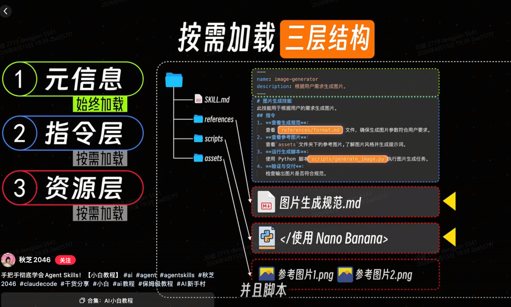
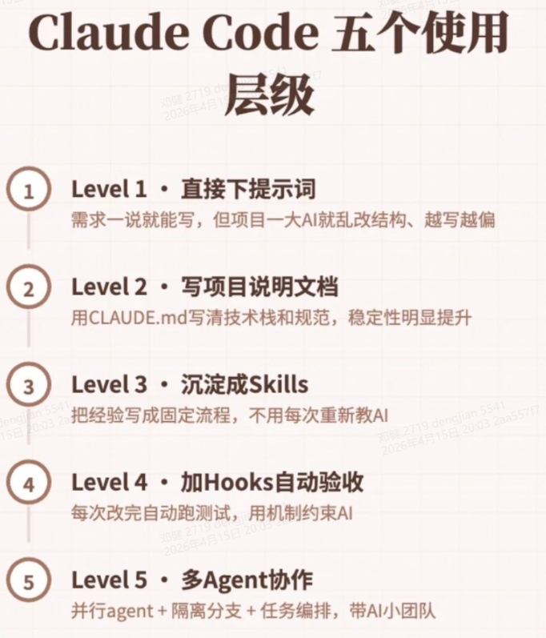
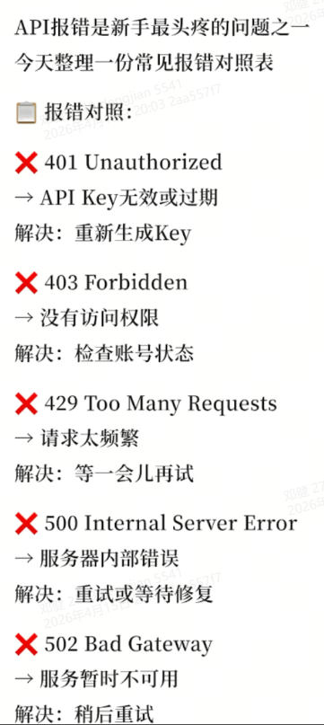

# AI发展历史 & 核心概念

# Transformer 基本原理

|     |                                      |                                                                                    |
| --- | ------------------------------------ | ---------------------------------------------------------------------------------- |
| 序号  | 内容概述                                 | 文档                                                                                 |
| 1   | - 什么是**注意力机制（Attention）**？它解决了什么问题？  | [Transformer基本原理](https://qcnlk893w3nx.feishu.cn/wiki/Bla1wjhN1isEhwkB6uGcJOGXngd) |
| 2   | - Transformer 整体架构：Encoder + Decoder |                                                                                    |
| 3   | - 为什么Transformer 让大模型成为可能？           |                                                                                    |

### 1. 什么是注意力机制（Attention）？它解决了什么问题？

#### 什么是注意力？

注意力机制帮助模型**在处理一个词的时候，能关注到句子中其他相关的词**，把上下文信息融入到当前词的编码中。

举个经典例子：

> The animal didn't cross the street because it was too tired.（这只动物没能过马路，因为它太累了）

这句话里的 `it` 指代谁？是 street 还是 animal？对人来说很简单，但对算法来说不容易。

**自注意力（Self-Attention）** 在处理 `it` 这个词时，会让模型把 `it` 和 `The animal` 关联起来，把 `The animal` 的语义信息融入到 `it` 的编码中，这样模型就知道 `it` 指的是动物，而不是街道了。

如果你熟悉 RNN/LSTM 这类传统模型，它们是一个词一个词依次处理，靠隐藏状态把之前的信息传递过来。而自注意力让每个词可以一次性"看到"整个句子的所有词，直接建立关联。

#### 注意力解决了什么问题？

- **解决长距离依赖问题**：传统RNN处理长句子时，早期信息会被遗忘，注意力能直接建立远距离词之间的关联

- **支持并行计算**：每个位置的计算可以并行进行，训练速度比RNN快很多，才能训练更大规模的模型

- **更好的语义理解**：能更好地理解上下文语境，解决代词指代、多义词歧义等问题

### 

### 2. 自注意力计算步骤（大白话版）

不需要推导数学，我们看直观理解：

每个词会生成三个向量：Query（查询）、Key（键）、Value（值）

1. **算分数**：当前词的Query和每个词的Key做点积，得到分数，分数代表"相关性"

2. **缩放归一化**：分数除以根号d_k，然后做softmax归一化，分数变成0-1之间，总和为1的权重

3. **加权求和**：每个词的Value乘以对应的权重，相加得到输出向量

这个输出向量就包含了整个句子中与当前词相关的信息。

一句话总结：我（当前词）拿着查询（Query）去和所有词的键（Key）比对，算出谁和我最相关，然后把相关词的值（Value）加权合起来，就是我最终的表示。

### 

### 3. Transformer 整体架构：Encoder + Decoder

Transformer 整体分为三部分：

```markdown
┌─────────────────────────────────────┐
│             Encoder 编码部分         │
│ （N个相同的Encoder堆叠在一起           │
│  每个Encoder包含：                  │
│    1. 自注意力层（Self-Attention）  │
│    2. 前馈神经网络（Feed-Forward）  │
└──────────────┬──────────────────────┘
               │
       编码结果
               │
┌──────────────▼──────────────────────┐
│             Decoder 解码部分         │
│ （N个相同的Decoder堆叠在一起      │
│  每个Decoder包含：                  │
│    1. 掩码自注意力层（Masked Self-Attention） │
│    2. 交叉注意力层（Encoder-Decoder Attention） │
│    3. 前馈神经网络                 │
└──────────────┬──────────────────────┘
               │
           输出概率
               │
┌──────────────▼──────────────────────┐
│          最后一层线性层+Softmax      │
│         输出下一个词的概率分布        │
└─────────────────────────────────────┘
┘

#### Encoder（编码器）的工作：

- 接收原始输入序列（比如一句话）
- 对输入进行编码，每个位置输出一个包含上下文信息的向量表示
- 层层抽象，越高层的编码能学到越复杂的语义

#### Decoder（解码器）的工作：

- 生成输出序列（比如翻译结果），一步一步生成
- 掩码自注意力：保证生成第i个词时只能看到前i-1个词，不能偷看未来
- 交叉注意力：从Encoder的输出中"注意力"到输入相关信息
- 最终输出下一个词的概率
```

### 4. 为什么 Transformer 让大模型成为可能？

1. **天生支持并行训练**：
   
   - RNN必须一个词一个词顺序计算，无法并行
   - Transformer在Feed-Forward层，每个位置可以同时计算，完全并行
   - 这意味着能用更大的批量、更大的模型，训练速度快很多，才能训练千亿参数量级的模型

2. **解决长距离依赖**：
   
   - 传统RNN长句子容易遗忘早期信息
   - Transformer注意力机制直接建立任意两个词的连接，不管距离多远
   - 能处理更长的文档、更复杂的语境

3. **可扩展性好**：
   
   - 简单堆叠Encoder/Decoder层数，增加参数量，性能就能持续提升
   - "越大越好"的 scaling law 被验证有效，让大模型可以通过堆参数涨性能

就是这个可扩展的架构设计，让大语言模型从理论变成了现实。

### 5. 多头注意力（Multi-Head Attention）

Transformer还用到了多头注意力：

- 不是一组Query/Key/Value，而是多组（论文用了8组）
- 每个头学习不同的注意力模式：有的头关注句法关系，有的头关注语义关系，有的头指代关联
- 多个头能让模型同时关注不同位置、不同类型的相关性，提升表达能力

---

## 参考资料来源

1. [The Illustrated Transformer - Jay Alammar（原版图文详解）](https://jalammar.github.io/illustrated-transformer/)  
   这篇就是经典的看图学Transformer，不用数学就能懂，推荐去看原图更直观

# Zero-shot / Few-shot 深入理解

## 一、基础定义

### 什么是 Zero-shot（零样本）？

**定义：** 不给AI任何示例，只给任务指令，让AI直接完成任务。

也就是：**你说清楚要做什么，不给例子，AI直接做**。

**完整示例：**

```Plain
请将以下中文句子翻译成英文：人工智能正在改变我们的生活和工作方式。
```

这里只说了"翻译中文到英文"，没给任何翻译示例，就是纯 Zero-shot。

### 什么是 Few-shot（少样本）？

**定义：** 给AI提供 **N个示例**（通常N很小，2-5个，每个示例都是"输入+输出"对），让AI从示例中学习任务规律，然后完成新的任务。

也就是：**你给几个样板，让AI照着样板的规律做**。

也叫"小样本学习"、"示例学习"、"语境学习"（in-context learning）。

**完整示例：情感分类任务**

```Plain
请判断下面这条用户评论的情感是正面还是负面。示例1：输入：这家餐厅味道真好，服务员也很热情，下次还会来。输出：正面示例2：输入：这个产品用了三天就坏了，客服也不理人，体验太差了。输出：负面示例3：输入：快递速度很快，商品包装完好，性价比很高。输出：正面现在请你判断：输入：这家店的位置不好找，停车也很不方便，找了半天。输出：
```

这里给了3个"输入+输出"示例，让AI学习规律，然后处理新输入，就是 Few-shot。

---

## 二、核心区别对比

| 对比维度    | Zero-shot   | Few-shot     |
| ------- | ----------- | ------------ |
| 是否需要示例  | ❌ 不需要       | ✅ 需要（2-5个常见） |
| 对用户来说   | 写Prompt快，省力 | 需要花时间准备示例    |
| 对模型来说   | 考验模型本身能力    | 从示例中快速学习规律   |
| 输出稳定性   | 波动可能较大      | 通常更稳定，符合预期   |
| Token消耗 | 少           | 多（示例占上下文）    |

---

## 三、什么时候用 Zero-shot？

### ✅ 推荐 Zero-shot 的场景

1. **任务简单直接，AI已经很擅长**这些任务大模型训练时已经见过无数同类数据，Zero-shot 就能做得很好，不用多此一举给示例。
   
   1. 翻译（中译英/英译中）
   
   2. 文本概括、总结
   
   3. 文本改写、调整语气
   
   4. 问答常识性问题
   
   5. 基础代码生成

2. **你赶时间，不想花精力写示例**快速出结果，验证想法，Zero-shot 最方便。

3. **模型能力足够强**现在的 GPT-4o、Claude 3 Opus/Sonnet、DeepSeek V3 这些强模型，Zero-shot 能力已经非常出色，简单任务零样本足够。

4. **输入上下文已经很长，没空间放示例**上下文窗口有限，优先把空间留给输入内容。

---

## 四、什么时候用 Few-shot？

### ✅ 推荐 Few-shot 的场景

1. **输出格式要求严格**用语言描述格式往往说不清楚，**给一个示例比说十句规则都管用**。**例子：** 要求输出JSON，如果描述半天格式，不如直接给一个正确示例。
   
   1. 要求输出特定格式的 JSON
   
   2. 要求输出 Markdown 表格
   
   3. 要求输出特定结构的文章
   
   4. 要求输出特定风格的文案

2. **任务有特殊自定义规律**你需要AI遵循某种你自己定义的规则，语言描述很复杂，直接给正反示例最清晰。比如："帮我过滤掉不合适的关键词，符合这几个示例标准的留下"，给几个留/删的示例，AI一下子就懂了。

3. **模型容易理解错你的意图**试了几次Zero-shot，AI总是跑偏，这时候给几个正确示例，能让AI瞬间get到你想要什么。

4. **复杂分类/标注任务**分类标准比较微妙，给几个不同类别的示例，比文字描述标准更准确。

5. **小模型能力不足**模型越小，Zero-shot能力越差，Few-shot 提升越明显。给几个示例能显著提升准确率。

---

## 五、Few-shot 为什么有效？

### 核心原因：

1. **大模型本身就有"In-context Learning（上下文学习）"能力**大模型在训练过程中见过大量"问题+示例+解答"的文本，已经学会了从示例中归纳规律。不需要微调，在上下文里放几个示例，它就能泛化到新问题。

2. **消除歧义**自然语言描述规则总有歧义，示例是最直观的，看完示例AI就知道你想要什么样的输出。

3. "示范"比"指令"更直接你说一百遍"要这么做"，不如直接给一个正确例子让它模仿。

---

## 六、Few-shot 实用技巧

### 1. 示例数量：2-5个足够

不是越多越好，太多示例占满上下文，反而效果下降。一般给2-5个覆盖不同情况的示例就够了。

### 2. 示例要覆盖不同情况

如果任务有多种情况，每个情况最好给一个示例，让AI充分理解规律。比如分类任务，每个类别至少给一个示例。

### 3. 格式保持一致

示例的输入输出格式要和你要求AI处理新问题的格式完全一致，AI会模仿格式。

### 4. 顺序：指令 → 示例 → 新问题

正确顺序：

```Plain
[任务指令][示例1：输入+输出][示例2：输入+输出][示例3：输入+输出][新问题：输入][（让AI输出）]
```

### 5. 正负示例都给（如果容易错）

如果有容易混淆的边界情况，可以给一个反例（"这种情况要输出什么"），帮助AI划清界限。

---

## 七、什么时候选择 One-shot？

One-shot 就是只给 **1个示例**。适合：

- 任务规律简单，一个示例就能说清楚

- 上下文空间有限，放不下多个示例

---

## 八、总结：怎么选择？

| 场景           | 优先选       |
| ------------ | --------- |
| 任务简单，AI擅长    | Zero-shot |
| 赶时间，快速验证     | Zero-shot |
| 格式要求严格       | Few-shot  |
| 自定义规则，语言说不清楚 | Few-shot  |
| AI总是理解错      | Few-shot  |
| 分类标注任务       | Few-shot  |
| 模型能力弱        | Few-shot  |

一句话经验：**先试 Zero-shot，效果不满意再加 Few-shot 示例**。现在强模型Zero-shot能力真的很强，很多时候零样本就够用了，能省你写示例的时间。

---

## 参考资料

- [Language Models are Few-shot Learners](https://arxiv.org/abs/2005.14165)（原始论文）

- [GPT-3 论文中的 In-context Learning 概念](https://arxiv.org/abs/2005.14165)

# Chain-of-Thought（CoT）思维链

### 什么是思维链？

思维链（Chain-of-Thought, CoT）是一种**引导大语言模型通过中间推理步骤来解决问题**的提示技术。它要求AI不仅给出最终答案，还要展示完整的思考过程，就像人类解题时会写出详细的步骤一样。

**说人话：** 想象你在教一个学生做数学题。与其直接让他说答案，不如让他先理解题目，列出已知条件，选择合适的公式，逐步计算，最后得出答案。思维链就是让AI也这样做——**不仅要答案，还要思考过程**。

### 直接回答 vs 思维链对比

**数学问题示例：**

❌ **直接回答：**

> 小明有5个苹果，给了小红2个，又买了3个，现在有几个？答案：7个

✅ **思维链：**

> 小明最初有5个苹果。给了小红2个后，剩下5-2=3个。又买了3个，所以现在有3+3=6个苹果。最终答案：6个。

**逻辑推理示例：**

❌ **直接回答：**

> 如果所有的A都是B，所有的B都是C，那么所有的A都是C吗？是的。

✅ **思维链：**

> 已知：所有A都是B（A⊆B），所有B都是C（B⊆C）。根据集合的传递性，如果A⊆B且B⊆C，那么A⊆C。因此，所有的A都是C。

思维链的核心价值在于**将复杂的端到端推理分解为可验证的中间步骤**，这不仅提高了准确性，还增强了结果的可解释性。

### 为什么思维链能提升准确率？

目前研究总结，主要有这几个原因：

#### 1. **分解问题，降低单步认知负荷**

复杂问题 = 多个简单子问题的组合。直接让AI一步出答案，相当于要求它一下子处理所有信息，容易出错。思维链要求分步拆解，每一步只解决一个小问题，显著降低了单步推理难度。

#### 2. **减少跳步错误**

标准提示下，模型容易从输入直接跳到输出，跳过关键推理细节，累积错误。强迫输出思考过程，模型必须一步一步来，减少了跳步，方便中间检查，降低总错误率。数学上：每步错误率 ε，n步总错误率约为 nε，分步检查能有效降低累计错误。

#### 3. **概率分布更集中，不确定性降低**

研究发现，CoT让模型预测下一个词时概率分布更加集中，正确答案的不确定性可以降低 50-80%，熵更低，密度峰值提升数倍，选择更确定。

#### 4. **激活训练中的"解题模式"**

大模型在训练时见过大量带解释、带步骤的文本（教程、解析、论文）。当你要求"分步思考"时，能更好对齐到这种推理模式，激活模型内部已经学到的逻辑推理能力。

#### 5. **把隐性知识变成显性语言推理**

LLM内部包含丰富的语义与世界知识，但往往以压缩形式存在。逐步生成思维链可以帮助模型依次调取这些"隐性知识"，一步步完成复杂组合，得到正确结论。

#### 6. **便于错误定位和修正**

如果最终答案错了，可以从中间步骤找到错在哪一步，方便修正。对于可解释AI也很重要。

### CoT 的几种常见形式

#### 1. 零样本思维链（Zero-shot CoT）

直接在Prompt末尾加上一句：`"让我们一步步思考"` 即可。

```Plain
Q: 小明有5个苹果，给了小红2个，又买了3个，现在有几个？A: 让我们一步步思考...
```

#### 2. 少样本思维链（Few-shot CoT）

提供几个包含完整思维链的示例，让AI照着做：

```Plain
Q: 小华有10元钱，买了一个3元的冰淇淋，还剩多少钱？A: 小华原有10元，花了3元，所以剩下10-3=7元。最终答案：7元。Q: 小明有5个苹果，给了小红2个，又买了3个，现在有几个？A: 
```

#### 3. 自洽性思维链（Self-Consistency CoT）

生成多个不同的推理路径，选出现频率最高的答案：

- 让模型生成 5-10 种不同的推理过程

- 统计各推理路径得出的答案分布

- 选择出现次数最多的答案作为最终结果

### 实际效果

研究表明，在 GSM8K（小学数学问题）数据集上：

| 方法        | 准确率  |
| --------- | ---- |
| 标准Prompt  | ~17% |
| 思维链Prompt | ~58% |
| 自洽性思维链    | ~74% |

提升非常显著！对复杂推理任务效果尤其明显。

### 什么场景用 CoT？

✅ **适合用：**

- 数学计算、逻辑推理

- 编程、算法设计

- 法律案例分析、商业决策

- 科学问题求解

- 需要分步推导的复杂问题

❌ **不一定需要：**

- 简单问答、创作

- AI已经很擅长的任务

- 追求响应速度

### 主要挑战

- **计算成本增加**：生成更长的响应，需要更多 Token 和时间

- **幻觉风险**：AI可能在中间步骤产生看似合理但错误的推理

- **更长的输出**：占用更多上下文窗口

# Self-Consistency（自洽性）深入理解

## 一、什么是 Self-Consistency？

**Self-Consistency（自洽性）** 是在 **Chain-of-Thought（思维链）** 基础上改进的一种提示技术，用来进一步提升复杂推理任务的准确率。

核心思想：

> 不要只让AI生成一条推理路径，而是生成**多条不同的推理路径**，然后**投票选择出现次数最多的最终答案**作为最终输出。

论文：《Self-Consistency Improves Chain of Thought Reasoning in Language Models》（2022）

---

## 二、为什么需要 Self-Consistency？它解决了什么问题？

### 问题背景

尽管思维链（CoT）已经大幅提升了推理准确率，但大语言模型生成是**随机性**的：

- 同一个问题，你让AI回答两次，它可能走出不同的推理路径，得到不同的答案

- 单次生成很容易走偏，某一步错了，最终答案就错了

Self-Consistency 利用了大模型的随机性，通过**多次采样+投票**，来滤除错误的、不一致的推理，选出最"自洽"的答案。

一句话：**三个臭皮匠，顶一个诸葛亮**——让模型多想几次，选那个大家都想到的答案，正确率更高。

---

## 三、Self-Consistency 的工作流程

### 步骤：

1. **第一步：使用思维链提示**，让模型对问题生成推理路径

2. **第二步：** 重复采样 **N次**（通常 N = 5 ~ 10），得到 N 条不同的推理路径

3. **第三步：** 从 N 条路径中提取出每个路径的**最终答案**

4. **第四步：** 对最终答案进行**投票**，选择**出现频率最高**的答案作为最终输出

### 图示：

```Plain
问题：小明有5个苹果，给了小红2个，又买了3个，现在有几个？↓ 采样第1次 → 推理：5-2=3，3+3=6 → 答案：6↓ 采样第2次 → 推理：5+3=8，8-2=6 → 答案：6↓ 采样第3次 → 推理：5-2=4，4+3=7 → 答案：7↓ 采样第4次 → 推理：一开始5个，给出去2个剩3个，再加买来的3个 → 答案：6↓ 采样第5次 → 推理：5 + (3-2) = 6 → 答案：6统计答案：  6 → 出现4次  7 → 出现1次投票结果：答案是 6 ✅
```

---

## 四、Self-Consistency 为什么有效？

### 核心原理：

1. **正确的推理路径往往更一致**对于一个确定的问题，正确答案往往是唯一的，大多数不同的推理路径最终都会汇聚到同一个正确答案。而错误往往是各式各样的，分散在不同答案上。

2. **错误路径更容易被投票淘汰**错误通常是随机的，每条错误路径可能得出不同的错误答案，分散了票数，很难赢过正确答案。

3. **利用了模型的随机性，而不是避免随机性**CoT 还是单次生成，Self-Consistency 主动利用多次采样来探索更多可能性，然后选最稳的那个。

4. **边际成本低，收益明显**只需要多采样几次，不需要训练或微调，就能拿到不错的准确率提升。

---

## 五、什么样的问题适合用 Self-Consistency？

✅ **特别适合：**

- 数学应用题（有唯一正确答案）

- 逻辑推理题

- 常识推理问题

- 需要计算的问题

- 有明确唯一答案的复杂推理

❌ **不太适合：**

- 开放式创作（答案不唯一，不需要投票）

- 简单问题（CoT 已经对了，多此一举）

- 需要很长输出的问题（多次采样Token成本太高）

---

## 六、实际效果

论文中的实验结果（GSM8K 数学数据集）：

| 方法                     | 准确率  |
| ---------------------- | ---- |
| 标准提示                   | ~17% |
| 标准 CoT                 | ~58% |
| CoT + Self-Consistency | ~74% |

提升了 **16个百分点**，非常显著！

在其他数据集（如 AddSub, MultiArith, AQuA 等）上，普遍能提升 **5~20个百分点**。

---

## 七、实用参数建议

- **采样次数 N：** 推荐 5 ~ 10 次
  
  - N=5 已经有明显提升
  
  - N=10 提升接近饱和，再往上提升边际收益递减

- **采样温度 Temperature：** 推荐 0.5 ~ 0.7
  
  - 不能设 0（温度0每次生成一样，投票没用）
  
  - 也不能太高（温度太高，生成太随机，很多离谱路径）
  
  - 要有一点随机性，但不要太离谱

- **投票方式：** 简单多数投票就够了，不需要复杂加权

---

## 八、优点和缺点

### ✅ 优点：

- 不需要训练或微调模型，即插即用

- 实现简单，调用API多采样几次就行

- 提升明显，对推理任务准确率提升很大

- 不改变原有的Prompt设计，兼容CoT

### ❌ 缺点：

- 计算成本增加 N 倍（要生成N次）

- Token消耗增加 N 倍

- 推理时间变长

---

## 九、和 CoT 的关系

- Self-Consistency **不是替代** CoT，而是 **基于 CoT 的改进**

- 必须先用 CoT 让模型输出完整推理过程，才能用 Self-Consistency 投票

- 公式：`CoT + 多次采样 + 投票 = Self-Consistency`

---

## 十、总结

| 要点        | 结论                       |
| --------- | ------------------------ |
| **是什么**   | 对同一个问题生成多条思维链，投票选最多的答案   |
| **解决什么**  | 解决单次生成容易走偏出错的问题          |
| **为什么有效** | 正确答案更一致，错误答案更分散，投票能选出正确的 |
| **适合场景**  | 数学、逻辑推理等有唯一答案的复杂推理       |
| **采样次数**  | 5-10次足够                  |
| **收益**    | 准确率提升 5-20个百分点           |

一句话总结：**让模型多想几次，投票选最一致的答案，正确率更高**。

## 十一、大部分AI模型默认自动做Self-Consistency吗

❌ 大部分AI模型默认不会自动做Self-Consistency，需要你额外指令（或者调用方代码层面）处理。

具体分情况：

1. 你直接在ChatGPT/Claude/Gemini这些网页对话框里用

默认就是单次生成。你需要自己写prompt让它生成多个不同答案，然后你自己投票。

比如你可以这么写prompt：

请解决这个数学问题，给我5种不同的解题思路，最后帮我统计哪个答案出现最多：

[问题内容]

这样就是你手动实现Self-Consistency。

2. 你调用API自己开发应用

Self-Consistency是需要你在代码层面实现的：

1. 你调用API N次（比如5次），设置一点温度（比如0.5-0.7），得到N个不同的输出

2. 你提取每个输出的最终答案

3. 你统计投票，选票数最多的模型本身不帮你做这个步骤，需要你自己写代码。

4. 有没有平台默认集成了Self-Consistency？

目前：

- 主流的ChatGPT、Claude网页版都没有默认开

- 一些进阶的AI工作流平台（比如LangChain、LlamaIndex）提供Self-Consistency的实现，你可以配置开启

- 一些专门面向推理的Agent框架会自动用类似的多路径投票方法

结论： 普通人日常用对话框，默认就是单次CoT，Self-Consistency需要你主动要求它生成多个结果，然后自己比选。你如果用API开发，可以自己实现这个逻辑。

简单说：它不是模型自带的默认行为，是一种提示工程/采样技巧，需要使用者主动用 😊

---

## 参考资料

- [Self-Consistency Improves Chain of Thought Reasoning in Language Models (arXiv)](https://arxiv.org/abs/2203.09415)（原始论文）

# Tree of Thoughts（ToT，思维树）深入理解

## 一、什么是 Tree of Thoughts（ToT，思维树）？

**Tree of Thoughts（思维树，简称 ToT）** 是在 Chain-of-Thought 基础上进一步改进的**高阶推理框架**，由清华大学、谷歌、普林斯顿大学在 2023 年联合提出。

核心思想：

> 把问题解决过程建模为**树状搜索空间**，每个节点是一个中间思维状态（部分解决方案），模型在每个关键步骤生成多个候选分支，评估分支的可行性，剪枝掉没希望的路径，保留有希望的路径继续探索，必要时可以回溯重来。

一句话概括：**让AI像人类解题一样——"三思而后行，走不通就回头"**。

---

## 二、ToT 和 CoT 的核心区别

| 对比维度         | Chain-of-Thought（CoT，思维链） | Tree of Thoughts（ToT，思维树） |
| ------------ | ------------------------- | ------------------------- |
| **结构**       | 线性链式结构，一条路走到底，无分支         | 树状结构，每个步骤支持多分支探索          |
| **决策方式**     | 单一路径向前推导，不能回头             | 动态评估每个分支，剪枝差的路径，可以回溯重来    |
| **探索能力**     | 只能探索一种可能性                 | 同时探索多种可能性，选最优解            |
| **计算复杂度**    | 低，只生成一条链                  | 高，要维护多分支+评估+搜索            |
| **实现难度**     | 简单，一句提示就能用                | 复杂，需要框架支持搜索和评估            |
| **更像人类哪种思维** | 系统1，快思考，直觉式一步步推           | 系统2，慢思考，深思熟虑策略性探索         |

### 一句话说清区别：

- **CoT：** "一步一步想，一条道走到黑"

- **ToT：** "每一步想几种可能性，看看哪个更有戏，不好就换条路走"

---

## 三、ToT 的核心机制（四个关键问题）

ToT 框架需要回答四个问题：

### 1. 如何分解问题？

把一个完整问题分解成多个思考步骤，每个步骤生成一个"思维状态"（节点）。

比如 **24点游戏**：给定 4 个数字，问能不能通过加减乘除得到 24。分解为：

- 第一步：选两个数字做运算，得到一个新数字 → 生成多个候选结果

- 第二步：从剩下的三个数字再选两个运算 → 继续分支

- 第三步：现在剩下两个数字，运算得到最终结果 → 看是不是 24

### 2. 如何生成候选思维？

在当前状态下，生成多个可能的下一步（多个分支候选）。

### 3. 如何评估思维状态？

模型自己评估每个候选分支，判断"这个思路有没有戏"，剪掉明显没希望的分支，节省计算。

评估方式通常有两种：

- 分类：直接判断"好/中/差"

- 打分：给一个 0-1 的分数，表示这个路径能走到正确答案的概率

### 4. 用什么搜索策略？

常见搜索策略：

- **广度优先搜索（BFS）**：逐层探索，保留每一层最好的 k 个分支，适合深度不大的问题

- **深度优先搜索（DFS）**：沿着一条分支走到底，走不通再回溯，适合深度大的问题

---

## 四、ToT 解决了 CoT 的什么问题？

CoT 的固有缺陷：

1. **路径依赖**：一旦中间某一步错了，后面全错，无法挽回，ToT 可以剪枝错误分支，回溯重来

2. **只能探索一种可能性**：复杂问题往往有多个可能路径，CoT 只走一条，容易错过最优解

3. **无法提前评估中间步骤**：走到终点才知道错了，浪费了计算，ToT 在每一步就评估，早点剪掉坏分支

---

## 五、实际效果

论文中的经典实验：**Game of 24（24点游戏）**，用 GPT-4 测试：

| 方法       | 成功率  |
| -------- | ---- |
| 标准 CoT   | ~4%  |
| ToT（思维树） | ~74% |

提升了整整 **70个百分点**！效果非常惊人。

在其他需要规划、搜索的任务上，ToT 都比 CoT 有明显提升。

---

## 六、优劣势对比

### ✅ ToT 的优势：

- **全局优化**：多路径探索，更容易找到最优解

- **容错性高**：错误分支被及时淘汰，不会连累整个推理

- **复杂任务适配好**：适合需要规划、探索、多可能性的任务

- **更接近人类深度思考方式**

### ❌ ToT 的劣势：

- **资源消耗大**：要维护树结构，生成多个分支，计算量和 Token 消耗比 CoT 大很多

- **实现复杂度高**：不像 CoT 一句提示就能用，ToT 需要框架（搜索+评估+剪枝）支持

- **对提示设计敏感**：分支生成和评估需要精细的提示工程

- **简单问题大材小用**：简单推理问题，CoT 已经够用，ToT 浪费算力

---

## 七、适用场景

| ✅ 非常适合 ToT               | ❌ 不太适合 ToT     |
| ------------------------ | -------------- |
| 需要策略规划的问题（24点、游戏走法、路径规划） | 步骤清晰的简单数学题     |
| 创意生成（多结局故事、多个文案方案探索）     | 直接问答、常识问题      |
| 复杂多步骤决策（项目规划、实验设计）       | 代码生成（CoT 基本够用） |
| 需要尝试多种可能性的开放问题           | 追求速度的实时交互      |

---

## 八、普通人日常怎么用？

目前的情况：

1. **你在网页对话框用 ChatGPT/Claude**：ToT 没法直接原生用，因为网页版不支持树搜索。你可以手动模拟：在关键步骤让AI给出几个不同方案，你自己评估选一个继续走。

2. **你开发应用调用 API**：可以用 LangChain 等框架现成的 ToT 实现，自己配置搜索策略和评估方式。

3. **研究/复杂问题**：ToT 确实效果更好，但成本也更高。简单问题就用 CoT 足够了。

---

## 九、总结

| 要点              | 一句话总结                         |
| --------------- | ----------------------------- |
| **是什么**         | 把推理从一条链扩展成一棵树，支持多分支探索、评估剪枝、回溯 |
| **和 CoT 的本质区别** | CoT 线性单路径，ToT 树状多路径           |
| **解决什么问题**      | 解决 CoT 一条道走到黑，错一步全错的问题        |
| **优势**          | 复杂推理、规划任务准确率大幅提升              |
| **代价**          | 计算成本更高，实现更复杂                  |
| **适合谁用**        | 复杂问题、需要探索多种可能性的场景             |

一句话总结：**CoT 是一步一步走到底，ToT 是边走边看，不好就换条路**。

---

备注：在和ai对话的时候，怎么知道它用了CoT 还是ToT呢？

结论： 你在网页对话框（ChatGPT/Claude 这些地方用，完全靠你的指令来决定用不用 CoT，而 ToT 模型默认不用，你也很难靠简单指令让它用。

具体分情况说：

1. CoT（思维链）：完全靠你指令激活

你说一句话就能让它用 CoT：

- 你直接加一句 "让我们一步步思考" → 它就会一步步输出推理过程 → 这就是在用 CoT

- 你不给这句话，它可能直接给答案 → 这就是没用 CoT

所以你完全能控制它用不用 CoT，就是加不加那一句提示的事。

2. ToT（思维树）：你简单指令没法让它自动用

原因：

- ToT 不是一句话提示就能实现的，它需要树状搜索、评估分支、剪枝回溯这些额外步骤

- 现在网页版的 ChatGPT、Claude 都是单次生成，它不会自己做这些步骤

- ToT 是一套框架算法，需要代码层面实现搜索，不是光改改prompt就行

那你在对话框里想手动模拟ToT可以这么做：

"这个问题有几种可能的思路，你帮我列出来，分别分析每种思路的可行性，然后选一个最可能的答案：[问题]

这就是你手动引导它做了"多分支探索，算是简易版ToT。但它不是原生的ToT，只是模拟。

总结一下怎么判断：

<style> td {white-space:nowrap;border:0.5pt solid #dee0e3;font-size:10pt;font-style:normal;font-weight:normal;vertical-align:middle;word-break:normal;word-wrap:normal;}</style>

|      |                                  |                        |
| ---- | -------------------------------- | ---------------------- |
| 情况   | 怎么判断用没用                          | 谁决定                    |
| CoT  | 看输出有没有一步步展示思考过程 → 有就是用了，没有就是没用收起 | 你决定，加一句提示就用了           |
| ToT  | 普通网页对话默认都不会用，除非你手动引导多路径探索收起      | 需要框架/代码支持，简单指令做不到完整ToT |
| <br> |                                  |                        |

简单说：CoT 你一句话就能开，ToT 普通用户对话框里用不到原生的，最多手动模拟一下多路径 😊

## 参考资料

- [Tree of Thoughts: Deliberate Problem Solving with Large Language Models (arXiv)](https://arxiv.org/abs/2305.10601)（原始论文）

- [CoT和ToT是什么，有什么区别和优劣](https://blog.csdn.net/sinat_37574187/article/details/146372131)

# Claude Code / Code Agent 核心思想

## 一、Claude Code 是什么？

Claude Code 是 Anthropic（Anthropic 就是做 Claude 模型的公司）推出的**终端原生 AI 编程 Agent 工具**，定位是"生活在终端中的结对编程伙伴"。

它不是简单的代码补全插件，而是一个**能完整处理从需求分析、读代码、写代码、跑测试到修 bug 全流程的智能代理（Agent）**。

一句话说：**你给它一个任务，它自己从头到尾做完，你来拍板就行**。

---

## 二、和传统 AI 编程工具的根本区别

### 控制流归属不同

| 工具             | 控制流       | 类比     | 你是什么角色             |
| -------------- | --------- | ------ | ------------------ |
| GitHub Copilot | 你主导，AI 补全 | 聪明的输入法 | 你是司机，AI 给导航提示      |
| Claude Code    | AI 主导，你拍板 | 编程伙伴   | 你是坐在副驾的技术主管，偶尔点头就行 |

### 能力范围不同

- **传统 AI 插件（Copilot）**：只能补全当前文件的片段，你得自己复制粘贴、自己找文件、自己跑测试

- **Claude Code**：能自主读整个项目的文件、修改多个文件、跑终端命令、搜索代码，它自己完成整个流程

---

## 三、为什么说它改变了 AI 编程？

### 1. 从"只说不做"到"真能落地"

以前的 AI 编程：

- 你复制代码给它 → 它给你输出修改后的代码 → 你再复制回去 → 你自己保存测试 → 有问题再来一遍

Claude Code：

- 你说需求 → 它自己读文件 → 它自己改代码 → 它自己跑测试 → 改完问你"这样可以吗" → 你同意就完事儿了

**省掉了大量手工复制粘贴的折腾**。

### 2. 真正的项目级全局视野

它不是只能看到你当前打开的这一个文件，它能：

- 自主搜索整个代码库找到相关文件

- 理解项目架构和依赖关系

- 同时修改多个文件，保证接口一致

- 比如你说"给这个 API 加个参数，更新所有调用方"，它能找到所有调用点逐一修改

### 3. Agent Loop（思考-行动-观察）闭环

Claude Code 遵循完整的 Agent 循环：

```Plain
用户给需求 → AI 做计划 → AI 用工具（读文件/改代码/跑命令）→ AI 看工具结果 → AI 调整计划 → 继续执行 → 直到任务完成 → 给你看结果
```

这是一个闭环，不需要你每一步都指挥。

---

## 四、核心能力：五类工具

Claude Code 自带五类核心工具，让它能和你的开发环境深度交互：

### 1. 文件系统操作

- `read_file`：读文件，支持指定行号范围（不用整个大文件塞上下文，省 token）

- `write_file`：写文件

- `list_directory`：列目录

- `search_files`：搜索文件，支持正则

### 2. 终端执行

- `bash` / `run_command`：运行终端命令

- **权限设计**：
  
  - 只读操作默认自动执行
  
  - 写文件需要用户确认
  
  - 终端命令默认必须确认，可以用参数绕过（`--dangerously-skip-permissions`，名字很坦诚）

### 3. 代码搜索与理解

- 用 `grep` / `find` 这些传统工具搜索代码，零依赖适配所有项目

### 4. 多文件精确编辑

- `str_replace_editor`：精确局部替换，不是重写整个文件

- 好比外科手术缝合，只改你要改的地方，diff 干净，不容易出错

### 5. 网络访问

- `web_search` / `web_fetch`：主要用来查文档、看 Stack Overflow

---

## 五、Agent 怎么和代码仓库交互？

### 核心流程：

1. **理解需求**：你说清楚要做什么（比如"给我加一个错误处理中间件"）

2. **计划阶段**：AI 先输出修改计划，说清楚它要改哪些文件，每个文件改什么，你先看看对不对

3. **探索代码库**：
   
   1. AI 用搜索工具找到相关文件
   
   2. 按需读取文件内容（懒读取，不是一次性读所有文件）
   
   3. 理解现有代码结构和接口

4. **执行修改**：
   
   1. 逐个修改目标文件，精确替换
   
   2. 改完可以运行测试、构建，看能不能过
   
   3. 如果有报错，AI 自己读报错信息，尝试修复

5. **结果汇总**：改完给你看 diff，问你同不同意

### 关键设计：

- **懒读取**：不一次性读整个代码库，用到什么读什么，节省上下文窗口

- **CLAUDE.md 约定**：鼓励你在项目根目录写一个 `CLAUDE.md`，给 AI 讲项目结构、命名约定、禁止事项。这个文件每次对话都会读，相当于给 AI 做了定制培训，投入产出比很高

- **上下文压缩**：长对话快到上下文限制时，AI 主动总结已完成工作，省出空间

---

## 六、权限设计：安全与便捷的平衡

Claude Code 把操作分成三个权限层级，很聪明：

| 层级     | 操作类型      | 默认行为            |
| ------ | --------- | --------------- |
| 1. 只读  | 读文件、搜索    | ✅ 自动执行，不用确认     |
| 2. 写操作 | 修改文件、创建文件 | ⚠️ 需要你确认        |
| 3. 执行  | 终端命令、安装包  | 🚫 必须手动确认，默认不允许 |

- 风险越高，确认越严，平衡了安全和便捷

- 和 Devin 不一样：Devin 是云端沙箱全自动，Claude Code 是本地结对编程，你随时掌控

---

## 七、和同类产品对比

| 产品              | 核心定位          | 适合场景             |
| --------------- | ------------- | ---------------- |
| **Claude Code** | 本地结对编程 Agent  | 复杂重构、多文件修改、全流程任务 |
| GitHub Copilot  | 行内代码补全        | 日常编码，你写它补        |
| Cursor          | AI-native IDE | 日常编码 + 聊天，体验流畅   |
| Devin           | 云端全自动 AI 工程师  | 独立小任务、异步执行       |

---

## 八、核心思想总结

1. **控制流转移**：从"你驱动，AI 辅助" → "AI 驱动，你拍板"，解放你的精力

2. **全流程闭环**：从需求到落地，AI 能自己走完整个流程，不用你反复手工复制粘贴

3. **工具赋能**：给 AI 开了一扇门访问你的本地环境（文件、终端），它才能真的干活

4. **安全优先**：权限分级，风险和确认力度成正比，不盲目全自动

5. **务实设计**：承认上下文窗口有限，用懒读取、CLAUDE.md、主动压缩这些技巧应对真实项目

---

## 一句话总结

Claude Code 不是更好的代码补全，它是**第一个真正能用的"AI 结对程序员"**——你说需求，它干活，你验收，把开发者从重复劳动里解放出来，让你专注在产品和架构决策上。

---

## 参考资料

- [Claude Code 深度拆解：它凭什么被称为「最接近真实工程师」的 AI 编码工具](https://aicoding.juejin.cn/post/7623616071808155694)

- [再见，复制粘贴: 为何 Claude Code 才是编程 Agent 的完全体](https://blog.csdn.net/2501_94554400/article/details/157699917)

# 核心概念：skill / agent / assets / references



### 1️⃣ Skill（技能）

**定义**：Skill 是一份给 Claude 的「操作规范说明书」，通常是一个文件夹，包含一个 `SKILL.md` 文件，告诉 Claude 做某类任务应该遵循什么流程、用什么方法、遵守什么规则。

**本质**：用自然语言约束 Claude 的行为，避免它自由发挥瞎改，减少返工，节省 tokens。

**常见结构**：

```Plain
my-skill/└── SKILL.md  # 最核心的就是这个文件，写着操作说明└── (可选) 一些脚本或模板文件
```

**分类**：

- **全局 Skill**：装在 `~/claude-code-projects/skills/`，所有项目都能用，比如 `superpowers`、`planning-with-files`

- **项目 Skill**：装在当前项目的 `./skills/`，只有这个项目能用，一般是项目特有的规则

**举个例子**：`superpowers` 的 SKILL.md 会说：

> 拿到需求后，不要直接写代码，先做 brainstorming，和用户确认方案，然后生成设计文档，然后拆分任务，最后再写代码。保证质量，减少返工。

Claude 读了之后，就会按这个流程走，而不是上来就瞎写。

---

### 2️⃣ Agent（代理）

**定义**：Agent 是子代理，就是让一个专门的 Claude 实例去做某个特定的子任务，做完再把结果合回来。

**什么时候用**：

- 复杂任务，可以拆成多个子任务，每个子任务交给不同的 Agent 去做

- Code Review 这个例子很典型：多个 Agent 从不同角度审查代码，比一个 Agent 更全面

**存放位置**：

- 全局 Agent：`~/.claude/agents/`

- 项目 Agent：`./agent/`（就是你项目里建的那个文件夹）

**对小白来说**：先用好 Skill 就够了，Agent 可以等后面进阶了再玩。

---

### 3️⃣ Assets（静态资源）

**定义**：Assets 是这个项目用到的所有静态文件，比如：

- 图片（头像、logo、设计稿）

- 字体文件

- 数据文件（CSV、JSON 数据）

- 其他二进制资源

**存放位置**：每个项目自己的 `./assets/` 文件夹。

**例子**：你做个人网站，你的头像照片就放在 `./assets/avatar.jpg`。

---

### 4️⃣ References（参考资料）

**定义**：References 是你做这个项目时用到的参考材料，比如：

- 参考网站的截图

- 需求文档

- 设计稿

- 竞品分析

- 你参考别人的代码片段

**存放位置**：每个项目自己的 `./references/` 文件夹。

**例子**：你说要参考 `mitbunny.ai` 这个网站，你可以把它首页截图保存到 `./references/mitbunny-homepage.png`，Claude 能看到参考，做出来更贴合你的想法。

---

## 二、目录结构总结（标准模板）

这是我们推荐的结构，你以后开新项目都按这个来：

```Plain
# 全局根目录~/claude-code-projects/├── skills/             # 全局通用 Skill，所有项目共用│   ├── superpowers/│   ├── planning-with-files/│   ├── ralph-loop/       # ✅ 已经安装好了│   └── ui-ux-pro-max-skill/├── projects/           # 你所有的项目都放在这里，一个项目一个文件夹│   ├── personal-website/          # 你的第一个项目：个人网站│   │   ├── skills/        # 项目特有 Skill（可选，一般空着）│   │   ├── agent/         # 项目特有 Agent（可选，一般空着）│   │   ├── assets/        # 项目静态资源（头像、图片等）│   │   ├── references/    # 项目参考资料（截图、需求文档等）│   │   └── ... 项目代码文件 ...│   ├── cover-generator/   # 你的第二个项目：封面生成器│   │   ├── skills/│   │   ├── agent/│   │   ├── assets/│   │   ├── references/│   │   └── ...│   └── ...├── assets/             # 全局通用资源（很少用）└── references/         # 全局通用参考（很少用）
```

然后我们做了一个软链接，让 Claude Code 能找到全局 Skill：

```Bash
ln -s ~/claude-code-projects/skills ~/.claude/skills
```

---

## 三、标准化操作流程

所有项目都可以 SOP 化，不管是简单网页还是复杂工具，基础框架都是一样的，只是细节增减，核心流程不变。拆解不同的需求，方便大家理解：

备注：强烈推荐大家所有的项目不需要从0-1开始，可以去github里面看是否有类似能够用得到的代码，节省一些自己的tokens。尤其是复杂的项目，其实没有必要大家所有的都是从0-1，大家的诉求可能很多时候都是类似的，只不过for自己的一些定制化的个人需求，也有可能在别人的项目上稍做一些更改，就能够和我们的诉求完美匹配起来。

不管你做什么需求，核心流程永远都是这五步，反复强调，基本流程和操作～

1️⃣ 创建项目结构 → 你搞定

2️⃣ 放参考资料 → 你做好

3️⃣ 写规则说明 → 你写好

4️⃣ 加载常用 Skill → 你加载

5️⃣ 说清楚需求 → 开始干活

例子一：不同类型前端网页

<style> td {white-space:nowrap;border:0.5pt solid #dee0e3;font-size:10pt;font-style:normal;font-weight:normal;vertical-align:middle;word-break:normal;word-wrap:normal;}</style>

|                         |      |                                                    |
| ----------------------- | ---- | -------------------------------------------------- |
| 网页类型                    | 做法   | 额外要做的                                              |
| 简单展示型（个人网站、着陆页）查看更多     | 标准流程 | 放参考网站截图到 references/查看更多                           |
| 带交互表单（登录、注册、充值、验证码）查看更多 | 标准流程 | CLAUDE.md 额外写上需要什么功能，把第三方 API 文档放到 references/查看更多 |
| 后台管理系统                  | 标准流程 | CLAUDE.md 说明 UI 框架，把布局截图放到 references/查看更多         |
| 全栈应用（前端 + 后端）查看更多       | 标准流程 | CLAUDE.md 加上后端技术栈，说明需要哪些 API查看更多                   |
| <br>                    |      |                                                    |

结论：框架永远不变，只需要改 CLAUDE.md 里的文字描述。

## ✂️ 例子二：AI 视频剪辑工具网页

### *1. 创建项目（直接复制运行，改项目名就行）*

PROJECT_NAME=ai-video-editor && \

cd ~/claude-code-projects/projects && \

mkdir $PROJECT_NAME && \

cd $PROJECT_NAME && \

mkdir -p skills references agent assets

### *2. 放参考 UI 截图*

mv ~/Desktop/reference-ui.png ./references/

### *3. 写 CLAUDE.md*

cat > CLAUDE.md << 'EOF'

## ❤️例子二AI 视频剪辑工具

### 🛠️ 技术栈

- 前端：React + TypeScript + Vite + Tailwind CSS

- 后端：Node.js + Express

- 视频处理：调用第三方 API

### *📁 项目结构*

frontend/ # 前端代码

backend/ # 后端 API

skills/ # 项目 Skill

references/ # 参考资料

assets/ # 静态资源

### 📐 编码规范

- 2 空格缩进

- camelCase 命名

- 单个函数不超过 50 行

### ✅ Claude 工作要求

- 先看 references 里的参考截图，理解 UI 风格

- 先设计 API 接口，再写代码

- 前后端分离，前端放 frontend 目录，后端放 backend 目录

- 一次只写一个 API / 一个页面，不要一次性写完

EOF

### *4. 启动 Claude 干活*

claude

/skills load superpowers

/skills load planning-with-files

/skills load ui-ux-pro-max-skill

### 5、然后说需求：

我要做一个 AI 视频剪辑工具网页，功能：

1. 用户上传视频

2. 用户输入剪辑脚本（说明保留/剪掉哪段）

3. 点击"开始剪辑"，调用后端 API 处理

4. 处理完用户可以下载剪辑好的视频

参考 UI 风格见 ./references/reference-ui.png

请按照 CLAUDE.md 帮我从零开始开发这个项目。

## 🛠️ 例子三：基于 GitHub 已有代码二次开发

如果你不想从零开始，想改别人的项目：

### *1. 创建完项目结构后，克隆 GitHub 代码*

cd ~/claude-code-projects/projects/your-project-name

git clone https://github.com/用户名/项目名.git temp

mv temp/* ./ && rm -rf temp

## 说明

这个项目基于 GitHub 上 用户名/项目名 二次开发，现有代码已经放在项目里，请基于现有代码修改满足我的需求

🎯 终极总结

不管什么项目，核心流程永远是：

1️⃣ 创建项目结构 → ✅ 永远第一步

↓

2️⃣ 放参考/已有代码 → ✅ 有就放，没有就跳过

↓

3️⃣ 写 CLAUDE.md 说清楚规矩 → ✅ 永远要写

↓

4️⃣ 启动 Claude，加载常用 Skill → ✅ 永远要做

↓

5️⃣ 说清楚需求 → ✅ 说完干活

哪里变了：

- 只变 CLAUDE.md 里的技术栈和需求描述

- 越复杂多写几行就行，核心骨架不变

- 从零开始 ≈ 基于现有代码改，只是多一步克隆代码，骨架不变

## 四、三个月 Claude Code 成长计划（从小白到高手）

### 📅 第一个月：基础搭建 + 理解核心概念

| 天数          | 任务                                                                                 | 目标                   |
| ----------- | ---------------------------------------------------------------------------------- | -------------------- |
| **第 1 天**   | 1. 搭建全局目录结构<br>2. 安装三个核心 Skill<br>3. 理解 skill/agent/assets/references 都是什么         | 环境跑通，能加载 Skill       |
| **第 2-4 天** | 完成第一个项目：你的个人网站<br>- 从需求到开发到运行<br>- 把你的信息填进去，替换掉默认内容<br>- 尝试本地运行 `npm run dev` 看看效果 | 做完一个能运行的完整项目，理解流程    |
| **第 5-7 天** | 整理总结<br>- 看看项目结构是不是清晰<br>- 把你遇到的问题记下来<br>- 尝试把项目推到 GitHub                          | 项目能跑，能推 GitHub，通关第一周 |

✅ **第一周完成标准**：你的个人网站能在本地跑起来，能访问，内容是你自己的，代码已经放到 GitHub 了。

---

| 天数            | 任务                                                                                                                 | 目标              |
| ------------- | ------------------------------------------------------------------------------------------------------------------ | --------------- |
| **第 8-10 天**  | 开始第二个项目：重构你之前做的「封面生成器」<br>- 用我们现在的标准结构重新做一遍<br>- 加载 superpowers + planning-with-files<br>- 把参考图片放到 `references/` 里 | 用新流程重做一遍，体会少返工  |
| **第 11-12 天** | 去 GitHub 搜一个新的 Skill 安装试用<br>- 搜 `claude-code skill`，找一个你感兴趣的<br>- 装到你的全局 Skill 目录<br>- 试试用它做任务                    | 学会自己安装别人的 Skill |
| **第 13-14 天** | 完成第二个项目，推到 GitHub                                                                                                  | 第二个项目做完，通关第二周   |

✅ **第二周完成标准**：你会自己找 Skill、装 Skill、用 Skill，第二个项目完整做完。

---

| 天数            | 任务                                                                                               | 目标               |
| ------------- | ------------------------------------------------------------------------------------------------ | ---------------- |
| **第 15-18 天** | 做第三个项目：选一个你工作能用得上的小工具<br>- 比如：飞书消息自动总结、日程整理工具、或者一个小博客<br>- 继续用标准流程                               | 保持节奏，完成第三个项目     |
| **第 19-20 天** | 想想你做项目的时候，哪些步骤是重复的？<br>- 比如：每次都要初始化 Next.js 项目？<br>- 比如：每次都要写 README？<br>- 写一个简单的 Skill，把重复步骤写进去 | 写出你的第一个自定义 Skill |

✅ **第三周完成**：你会自己写简单的 Skill 了，能把重复流程打包起来。

---

| 天数            | 任务                                                                                          | 目标                 |
| ------------- | ------------------------------------------------------------------------------------------- | ------------------ |
| **第 21-24 天** | 整理你现在的全局 Skill<br>- 留下好用的，删掉不好用的<br>- 给每个 Skill 做个简单笔记，记下来它是干什么的<br>- 试试不同的组合，找到你最喜欢的工作流    | 整理出你自己的常用 Skill 集合 |
| **第 25-28 天** | 逛社区，发现新 Skill<br>- GitHub 搜更多 Claude Code 相关项目<br>- 小红书 / Twitter 看看别人分享的技巧<br>- 遇到好的就装下来试试 | 持续发现新东西            |
| **第 29-30 天** | 回顾总结<br>- 写写你这一个月学到了什么<br>- 写写你觉得最有用的技巧是什么<br>- 计划下一个月的学习                                   | 完成一个月学习，通关！        |

✅ **第四周完成标准**：你有了自己的常用 Skill 列表，知道去哪里找新 Skill，能独立开始新项目了。

---

### 👉 你的当前进度

✅ [x] **第一步**：安装第三方 Skill（Ralph Loop）

⬜ [ ] **第二步**：写自己第一个 Skill

⬜ [ ] **第三步**：第一个项目上传 GitHub

⬜ [ ] **第四步**：第二个项目上传 GitHub

⬜ [ ] **第五步**：打造 X + GitHub 个人品牌

---

## 五、五步成长计划（最终目标）

### 第一步：安装并且学会使用第三方 Skill ✅

你已经完成了：

- ✓ Ralph Loop 成功安装到 `~/claude-code-projects/skills/ralph-loop`

- ✓ 解决了配置问题，等待 API 恢复就能用

**通用安装流程**：

```Bash
cd ~/claude-code-projects/skillsgit clone <仓库地址>cd <技能名称># 如果有安装脚本./scripts/install.sh# 重启 Claude Code 就能用了
```

---

### 第二步：自己动手写一个 Skill

**什么是 Skill**：

- 把你重复做的事固化下来，一次写好一直用

- 比如"新建 React 组件"、"写单元测试"，做成 Skill 不用每次重新教

**手把手写一个最简单的 Skill：/hello**

```Bash
# 1. 创建目录结构mkdir -p ~/claude-code-projects/skills/hello-command/.claude-pluginmkdir -p ~/claude-code-projects/skills/hello-command/commands# 2. 写插件配置cat > ~/claude-code-projects/skills/hello-command/.claude-plugin/plugin.json << 'EOF'{  "id": "hello-command",  "name": "Hello Command",  "description": "A simple hello world skill",  "version": "0.1.0",  "author": "你的名字"}EOF# 3. 写命令定义cat > ~/claude-code-projects/skills/hello-command/commands/hello.md << 'EOF'---name: hellodescription: Say hello to the user---Say hello to the user, and output current date and time.EOF# 4. 初始化 Git（Claude 要求必须有 Git 才能识别）cd ~/claude-code-projects/skills/hello-commandgit initgit add .git commit -m "init: my first skill"
```

**Skill 标准目录结构**：

```Plain
your-skill/├── .claude-plugin/│   └── plugin.json        # 插件信息（必填）├── commands/               # 每个命令对应一个 .md 文件│   ├── command-1.md│   └── command-2.md├── hooks/                 # 钩子（可选，自动触发脚本）├── scripts/               # 辅助脚本（可选）└── README.md              # 说明文档
```

**测试**：

1. 完全退出 Claude Code

2. 重新打开

3. 输入 `/hello`

4. 能正常回复 = 成功 ✅

---

### 第三步：做第一个项目，并且上传 GitHub

**核心秘密：一定要写 CLAUDE.md！**

这就是 Level 2 比 Level 1 稳定太多的原因。

**什么是 CLAUDE.md？**

- 给 Claude 看的项目说明书

- 放在项目根目录，Claude 打开项目自动读

- 告诉 Claude 你的技术栈、结构、规范 → 不会瞎改

**CLAUDE.md 模板（直接抄）**：

```Markdown
# {{你的项目名称}}## 🛠️ 技术栈- 语言：{{Python/TypeScript/...}}- 框架：{{Next.js/FastAPI/...}}- 包管理器：{{npm/pip/poetry/...}}## 📁 项目结构
```

src/ # 源代码tests/ # 测试README.md # 给人看CLAUDE.md # 给 Claude 看

```Plain
## 📐 编码规范- 缩进：{{2 空格 / 4 空格}}- 命名：{{camelCase / snake_case}}- 单个函数不超过 50 行- 复杂逻辑必须加注释## ✅ Claude 工作要求- 先读现有文件，理解清楚再动手- 一次只改一个功能，不要碰太多文件- 改完一定要说明改了什么、为什么这么改- 拿不准就停下来问我
```

**怎么上传 GitHub 一步步来：**

```Bash
# 1 进到项目文件夹cd ~/your-project-name# 2 初始化 Gitgit initgit add .git commit -m "init: first commit"# 3 去 GitHub 网页点击 "New repository"#    - Repository name = 你的项目名#    - 不要勾选 "Initialize this repository with a README"#    - 点击 "Create repository"# 4 按照 GitHub 给你的命令推送（替换成你自己的信息）git branch -M maingit remote add origin https://github.com/{{你的GitHub用户名}}/{{你的项目名}}.gitgit push -u origin main
```

完成 ✅ 刷新 GitHub 就能看到你的项目了。

---

### 第四步：做第二个项目，并且上传 GitHub

- 换一个不同类型的项目（第一个做了 CLI 工具，第二个就做网页）

- 练习写 `CLAUDE.md`，养成习惯

- 巩固从需求到上线完整流程

---

### 第五步：注册 X 账号 + GitHub 账号 → 打造个人品牌

#### 为什么要做个人品牌？

| 平台                     | 作用                                       |
| ---------------------- | ---------------------------------------- |
| **GitHub**<br><br><br> | 存放你的项目代码，就是你的**作品集**，show it not tell it |
| **X (Twitter)**        | 分享你的学习过程、经验总结，tell it，输入倒逼输出             |

#### 怎么做？

**GitHub：**

1. 去 [github.com](https://github.com) 注册免费账号

2. 你做完的每个项目都上传上去

3. 每个项目都写好 README，说明做了什么、怎么用

4. 持续更新

---

## 🎖️ Claude Code 五个使用层级



| Level       | 做法                 | 效果                                    |
| ----------- | ------------------ | ------------------------------------- |
| **Level 1** | 直接丢提示词             | 小需求快，项目一大 AI 就乱改结构、越写越偏               |
| **Level 2** | 写 `CLAUDE.md` 项目说明 | 把技术栈、结构、规范写清楚，AI 稳定性大幅提升              |
| **Level 3** | 沉淀经验成 Skill        | 常用流程做成 Skill，不用每次重新教 AI               |
| **Level 4** | 加 Hooks 自动验收       | 改完自动跑测试，不通过 AI 自己改，用机制保证质量            |
| **Level 5** | 多 Agent 协作         | 并行 Agent + 隔离分支 + 任务编排，你当项目经理，AI 团队干活 |

## 六、小白常见问题

### Q: 我一定要每个项目都建 skills/ agent/ assets/ references 吗？

A: 最好都建，哪怕是空的。养成好习惯，后面用到的时候就不用临时建了，结构一直保持一致，你自己也清楚东西放哪。

### Q: 我什么时候需要自己写 Skill？

A: 当你发现同一件事你总是要反复跟 Claude 说一遍流程，就可以把这个流程写成 Skill，下次直接加载就行，不用说第二遍。

### Q: Skill 和 Plugin 有什么区别？

A: Plugin 是更完整的扩展，可以包含命令、子代理、Hook 等代码，Skill 主要是文档说明书。对小白来说，不用太区分，装进来用就行，加载方式都是 `/skills load`。

### Q: 装了不用的 Skill 会占空间吗？

A: 每个 Skill 都很小，一般几十KB，就算装几十个也占不了多少空间，放心装，不好用删掉就行。

---

## 七、推荐资源

### 必装核心 Skill（推荐你都装上）

skills：

| 名称                                                                                              | 作用                      | 适合场景                    |
| ----------------------------------------------------------------------------------------------- | ----------------------- | ----------------------- |
| [obra/superpowers](https://github.com/obra/superpowers)                                         | 规范开发流程，先脑暴再写代码，减少返工     | 所有开发项目                  |
| [OthmanAdi/planning-with-files](https://github.com/OthmanAdi/planning-with-files)               | 规划持久化到文件，解决上下文丢失        | 所有长项目                   |
| [nextlevelbuilder/ui-ux-pro-max-skill](https://github.com/nextlevelbuilder/ui-ux-pro-max-skill) | 提升前端设计审美                | 前端项目                    |
| ralph-loop                                                                                      | 拦截 Claude 半途退出，自动循环直到完成 | 所有项目，解决 Claude 做一半停了的痛点 |

### 去哪里找更多 Skill

1. GitHub 搜索：`claude-code skill`、`claude-code plugin`

2. Twitter/X：搜索 `#ClaudeCode`

3. 小红书：搜索 `Claude Code`

4. Reddit: r/ClaudeAI

---

## 八、行动检查表（每次开新项目都可以对照）

基本上每次做一个新的项目，都可以按照这个步骤来

- `cd ~/claude-code-projects/projects`

- `mkdir 新项目名 && cd 新项目名`

- `mkdir -p skills references agent assets`

- 启动 `claude`

- `/skills load superpowers`

- `/skills load planning-with-files`

- （做前端加一条）`/skills load ui-ux-pro-max-skill`

- 说你的需求

- 开始干活！

大家也可以善用各种知识以及其他的ai工具，作为一个毫无开发背景的人而言，我每次开发一个新的不同类型的项目之前，我会先和其他的ai工具进行探讨，我实际应该准备的到底是什么

---

## 九、小白实操常见问题（step by step）

### 问题 1：怎么把参考网站的截图放到 `./references/` 文件夹里？

#### 📝 详细步骤：

**第一步：打开浏览器，访问网站**

```Plain
在你的浏览器地址栏输入网址，回车打开
```

**第二步：截图**

- **Mac 截图快捷键**：按 `Command + Shift + 4`，鼠标会变成十字，拖动框选整个网页，松开后截图就保存到你的桌面了

- **Windows 截图快捷键**：按 `Win + Shift + S`，同样框选网页

**第三步：找到截图文件**

- Mac 截图默认保存在**桌面**，文件名一般是 `屏幕截图 2026-03-30 15.30.00.png` 这样

- Windows 截图默认保存在**剪贴板**，你可以打开"画图"，粘贴进去，然后保存到桌面

**第四步：把截图移动到项目的 references 文件夹**打开你的终端，执行：

```Bash
# 假设你的截图在桌面，文件名是 mitbunny-homepage.png# 项目是 personal-websitemv ~/Desktop/mitbunny-homepage.png ~/claude-code-projects/projects/personal-website/references/
```

如果你的文件名不一样，把 `mitbunny-homepage.png` 改成你实际的文件名就行。

**第五步：在 Claude Code 里告诉它**

```Plain
我的参考网站首页截图已经放到 ./references/mitbunny-homepage.png，请参考这个截图的风格和布局来设计。
```

这样 Claude 就能看到你的参考了，做出来更贴合你的想法 ✅

---

### 问题 2：GitHub 是什么？怎么把项目放上去？为什么重要？

#### 1️⃣ GitHub 到底是什么？

GitHub 就是一个**代码云仓库**，相当于你代码的百度网盘，但比网盘专业很多：

- 帮你保存代码，不怕电脑坏了丢代码

- 方便你从不同电脑访问你的代码

- 别人能看到你的项目（如果你公开的话）

- **对你来说最重要的一点：未来找 AI 相关工作，GitHub 作品集就是你的简历**

#### 2️⃣ 为什么重要？

- 你说你想转行 AI，面试官不信你说你会，但是他们会信你 GitHub 上一个个能跑的项目

- 每个项目都有提交记录，能看到你是真的在做东西，不是瞎吹

- 这就是为什么"干出项目放到 GitHub"比你说"我学过 AI"管用一百倍

#### 3️⃣ 怎么把你现在的个人网站项目放到 GitHub？

**第一步：你先去 GitHub 注册一个账号**

- 打开 https://github.com/，用邮箱注册，免费账号就够用了

- 用户名建议用你自己名字或者网名，方便别人记住你

**第二步：创建一个新的仓库**

- 登录后，点击右上角"+"号 → "New repository"

- Repository name 填 `personal-website`

- Description 填 "我的个人网站"

- 选 "Public"（公开，这样别人能看到）

- 不勾选 "Add a README file"（我们已经有了）

- 点击 "Create repository"

**第三步：在你本地终端，把代码推上去**

```Bash
# 进入你的项目目录cd ~/claude-code-projects/projects/personal-website# 初始化 gitgit init# 添加所有文件git add .# 第一次提交git commit -m "initial commit: 个人网站骨架"# 绑定远程仓库（把这里 <你的用户名> 换成你 GitHub 用户名）git remote add origin https://github.com/<你的用户名>/personal-website.git# 推送到 GitHubgit branch -M maingit push -u origin main
```

按照提示输入你的 GitHub 用户名和密码（如果开了两步验证，用 token，按 GitHub 提示操作就行）。完成之后，刷新你的 GitHub 页面，就能看到你的代码了！

#### 4️⃣ GitHub vs X (Twitter)，时间怎么分配？

- **GitHub**：放你的项目，这是你的**作品集**，是硬通货，找工作全靠它，优先级更高

- **X**：用来涨粉、交流、获取信息，是引流和社交

- **建议**：70% 时间做项目放到 GitHub，30% 时间在 X 分享内容。先有作品，再分享，这样最扎实。

---

### 问题 3：装了 Skill 以后，是自动运行吗？每个新项目都要加载吗？

**不是自动运行，需要你每次开始新项目的时候手动加载。这是对的，因为不是每个项目都需要所有 Skill。**

#### ✅ 正确操作流程（每次开新项目都这么走）：

```Bash
# 1. 终端里新建项目文件夹cd ~/claude-code-projects/projectsmkdir 新项目名称cd 新项目名称mkdir -p skills references agent assets# 2. 启动 Claude Codeclaude# 3. 在 Claude Code 里加载你需要的 Skill/skills load superpowers/skills load planning-with-files# 如果你做前端，再加这两行/skills load ui-ux-pro-max-skill/skills load anthropics-skills/skills/webapp-testing# 4. 然后说你的需求...
```

所以：

- **每次开始新项目** → 都要手动加载你需要的 Skill

- **不是自动运行** → 你可以根据项目需要选，不浪费

- 比如你做不涉及前端的小工具，就不用加载 `ui-ux-pro-max` 了

#### 举例子：重构封面生成器项目，具体怎么做：

```Bash
# 终端里操作cd ~/claude-code-projects/projectsmkdir cover-generatorcd cover-generatormkdir -p skills references agent assets# 把你原来的参考图片放进去（就用上面问题 1 教的方法）mv ~/Desktop/你的参考封面图.png ~/claude-code-projects/projects/cover-generator/references/# 启动 Claudeclaude# Claude 启动后，输入：/skills load superpowers/skills load planning-with-files# 然后说你的需求：我要重做封面生成器项目，参考 designs 放在 references 文件夹，请按照 superpowers 流程帮我重新做一遍，要求结构清晰，方便维护。就是这样，一步步来就行。---### 问题 4：我想自己写 Skill，不会写，可以用 AI 帮我写吗？写完放哪里？#### 1️⃣ 当然可以用 AI 帮你写！完全没问题。你现在就可以用 Claude Code 帮你写，你只要把需求说清楚：> 举个例子，你想写一个"初始化 Next.js 项目"的 Skill：
```

我想写一个 Skill，名字叫 "init-nextjs-project"，功能是：帮我在当前目录初始化一个标准的 Next.js + Tailwind CSS 项目，并且创建好 skills/references/agent/assets 这几个标准文件夹，请帮我写这个 Skill 的 SKILL.md 文件。

```Plain
Claude 就会帮你写好内容，你只要检查一下，觉得没问题就保存就行。#### 2️⃣ 写完之后放在哪里？**如果你这个 Skill 是所有项目通用的** → 放到全局 Skill 目录：
```

~/claude-code-projects/skills/你的skill名称/SKILL.md

```Plain
因为我们已经做了软链接，Claude 直接就能找到，加载的时候：
```

/skills load 你的skill名称

```Plain
**如果你这个 Skill 只给某个特定项目用** → 放到项目自己的 Skill 目录：
```

你的项目目录/skills/你的skill名称/SKILL.md

```Plain
加载的时候用相对路径：
```

/skills load ./skills/你的skill名称

```Plain
#### 3️⃣ Skill 的结构超简单，其实就是一个文件夹加一个 `SKILL.md`：
```

我的skill/└── SKILL.md # 就这一个文件，写清楚流程就行

```Plain
就这么简单！你看，就是用自然语言把你想要 Claude 遵循的流程说清楚，比如：**SKILL.md 例子（init-nextjs）：**```markdown# Init Next.js Project Skill当你使用这个 Skill 的时候，请按照以下流程操作：1. 在当前目录初始化 Next.js 项目，使用 TypeScript + Tailwind CSS2. 初始化完成后，创建标准文件夹结构：   - ./skills   - ./references   - ./agent   - ./assets3. 完成后告诉我已经准备好了，可以开始开发了
```

就是这样！很简单，说清楚步骤，Claude 就能读懂，然后照着做。

---

### 问题 5：推荐安装这些 Skill 都装好了吗？都有什么用？

你装好之后，应该是这样：

| 名称                  | 作用                      | 适合场景                    |
| ------------------- | ----------------------- | ----------------------- |
| superpowers         | 规范开发流程，先脑暴再写代码，减少返工     | 所有开发项目                  |
| planning-with-files | 规划存在文件里，不丢失上下文          | 所有长项目                   |
| ui-ux-pro-max-skill | 提升前端设计审美                | 前端项目                    |
| code-review         | 多 Agent 并行代码审查，减少假阳性    | 代码写完后检查                 |
| code-simplifier     | 自动简化代码，合并重复逻辑           | 写完功能后重构                 |
| webapp-testing      | 自动写前端测试，用 Playwright    | 前端项目                    |
| mcp-builder         | 一步步帮你写 MCP Server       | 进阶开发，写自定义 MCP           |
| ralph-loop          | 拦截 Claude 半途退出，自动循环直到完成 | 所有项目，解决 Claude 做一半停了的痛点 |

全部装好之后，你的 Claude Code 就已经非常强大了，能应对绝大多数场景。

#### 问题4: 经常遇到的错误

#### 问题5:常见的问题-api报错

claude遇到了api报错，通常是




> 记住：Claude Code 是工具，你越会用规则约束它，它越能帮你省时间省钱。先从流程开始，慢慢积累你的 Skill 集合，一个月后你会发现你已经玩转它了。


# RAG（检索增强生成）

## 一、RAG 解决了大模型的什么问题？

RAG（Retrieval Augmented Generation，检索增强生成）是一种通过**实时检索外部知识库**补充大模型信息的技术方案。**先从外部知识库检索相关信息，再用这些信息增强大模型，最后生成更准确、更真实的回答。**也就是常说的 **RAG 技术**。

它主要解决大模型三个核心痛点：

### 1. **知识过时（训练数据截止日期问题）**

- 大模型的训练数据有截止日期（比如 GPT-4 训练数据截止 2023 年）

- 无法回答截止日期之后的新事件、新政策、新产品信息

- RAG 可以实时从外部知识库检索最新信息，解决知识过时问题

### 2. **专业领域知识缺失**

- 通用大模型没有深度覆盖垂直领域/企业内部知识（比如企业内部规章、未公开的研究数据）

- RAG 可以让大模型基于你指定的专业知识库回答，不用重新训练模型

### 3. **幻觉问题**

- 大模型遇到超出训练范围的问题，容易编造看似合理但错误的内容

- RAG 要求大模型**只能基于检索到的上下文回答**，大幅降低幻觉概率

---

## 二、RAG 完整流程

一个标准的 RAG 系统分为两大阶段：**离线构建向量存储** + **在线检索生成**

---

### 阶段 1：离线构建向量存储（知识准备）

目标：把你的非结构化文档（PDF、Word、网页...）转成可高效检索的向量格式。

#### 步骤 1：文档加载（Load）

- 把分散的数据源统一导入系统

- 支持各种格式：TXT、PDF、Word、JSON、HTML、Markdown 等

- 工具：LangChain 提供了各种 `DocumentLoader` 一键解析

#### 步骤 2：文档切割（Chunking，分块）

大模型输入 Token 有上限，长文档直接塞进去会超；同时冗余信息会降低检索精度，所以需要切分成更小的文本块（Chunk）。

**常见切分方法：**

| 切分方法        | 核心逻辑                            | 优点             | 缺点            | 适用场景              |
| ----------- | ------------------------------- | -------------- | ------------- | ----------------- |
| 固定长度切分（带重叠） | 按固定 Token 数切，相邻 Chunk 重叠 10-20% | 实现简单，兼容性强      | 可能截断完整语义      | 无明显结构的纯文本（小说、报告）  |
| 句子边界切分      | 基于标点符号拆分句子                      | 保留完整句子语义       | 长段落可能拆分过细     | 结构化文本（新闻、论文摘要）    |
| 自定义规则切分     | 按文档逻辑结构（标题、小标题、段落）切分            | 贴合文档结构，语义完整性最高 | 需手动设计规则，适配成本高 | 结构化强的文档（PDF手册、网页） |
| 基于语义切分      | 用模型分析语义相似度，相似句子归为一块             | 动态适配语义，避免断裂    | 计算成本高，速度慢     | 专业文档（法律、医学）       |

**分块最佳实践：**

- Chunk 大小：通常建议 256 - 1024 Token，根据你的上下文窗口调整

- 优先保证关键信息完整性：强关联内容放在同一个 Chunk

- 相邻 Chunk 留一点重叠，避免信息被切断

#### 步骤 3：Embedding 编码（向量转化）

计算机无法直接理解文本，需要通过 Embedding 模型把文本块转化为**高维向量**（比如 768 维浮点数数组）。

- 核心原理：**语义越相似的文本，向量在高维空间中的距离越近**

- 常用 Embedding 模型：OpenAI `text-embedding-3`、开源 `BERT-base`、`Sentence-BERT` 等

#### 步骤 4：向量存储（VectorStore）

把生成的向量存入专门的**向量数据库**，支持高效的相似性检索。

- 作用：快速找出"和用户问题向量最相似的 Top-K 个文本块"

- 主流向量数据库：Pinecone（云服务）、Milvus（开源）、Chroma（轻量开源）

---

### 阶段 2：在线检索生成（回答用户问题）

当用户提出问题，走这个流程：

#### 步骤 1：问题向量化

把用户问题用**同一个 Embedding 模型**转化为向量。

#### 步骤 2：相似性检索

向量数据库对比"问题向量"和"存储的文本块向量"，返回相似度最高的 Top-K 个文本块（就是和问题最相关的上下文）。

**常用相似度算法：**

- **余弦相似度**：RAG 最常用，忽略向量长度，只看方向，适合文本语义匹配

- **BM25**：基于词频/逆文档频率，适合关键词匹配，常和余弦相似度混合检索

- **欧氏距离**：适合图片等非文本场景

#### 步骤 3：构建 Prompt 喂给 LLM 生成回答

把 `[用户问题] + [检索到的相关上下文]` 拼接成 Prompt，喂给大模型，让大模型**基于上下文**生成答案。

典型 Prompt 模板：

```Plain
请你基于以下上下文回答用户的问题。如果上下文里没有答案，请直接说"这个问题我无法从提供的信息中找到答案"，不要编造。上下文：{{retrieved_chunks}}用户问题：{{question}}回答：
```

---

## 三、什么是 GraphRAG？和普通 RAG 区别是什么？

GraphRAG（Graph-based RAG，基于知识图谱的检索增强生成）是 RAG 的进阶版本，由微软研究院在 2024 年提出。

### 核心思想

普通 RAG 的检索单元是**文本块（Chunk）**，只能做"单跳语义匹配"。GraphRAG 把知识表示为**知识图谱**：

- **节点**：实体（人名、公司名、地点、事件...）

- **边**：实体之间的关系（比如〈马斯克，CEO，特斯拉〉、〈特斯拉，竞争对手，比亚迪〉）

这样就能做**多跳推理**。

### GraphRAG 和普通 RAG 的核心区别

| 对比维度 | 普通 RAG        | GraphRAG            |
| ---- | ------------- | ------------------- |
| 检索单元 | 文本块（Chunk）    | 实体、关系、子图            |
| 推理能力 | 单跳语义匹配（直接找答案） | 多跳推理（比如 A→B→C→答案）   |
| 知识表示 | 非结构化文本        | 结构化三元组（主体-关系-客体）    |
| 适用场景 | 简单问答、信息查询     | 关系挖掘、复杂推理（金融、法律、科研） |

### 举个例子：

问题：**"特斯拉竞争对手的 CEO 是谁？"**

- 普通 RAG：很难直接找到答案，因为信息分散在不同文本块里

- GraphRAG：
  
  - 问题识别出实体：特斯拉、竞争对手、CEO
  
  - 图遍历：特斯拉 → 竞争对手 → 比亚迪 → CEO → 王传福
  
  - 一步一步推理出答案

### GraphRAG 优缺点

✅ 优点：

- 能处理需要多跳推理的复杂问题

- 能发现实体间隐藏的关联

- 知识表示更结构化，更容易解释

❌ 缺点：

- 构建和维护知识图谱成本高（需要提取实体、关系）

- 对专业能力要求高

- 简单问答大材小用，速度比普通 RAG 慢

---

## 四、什么是 LLM-RAG？

LLM-RAG 这个说法有两种常见理解：

### 理解 1：**用 LLM 增强的 RAG**（最常见）

这是现在主流的进阶 RAG 思路，全程让 LLM 参与各个环节：

1. **问题理解阶段**：LLM 重写/优化用户问题，让问题更清晰，更容易检索到相关内容

2. **检索阶段**：LLM 帮助筛选检索结果，判断哪些文档真的相关，去掉不相关的

3. **生成阶段**：LLM 基于检索到的内容生成答案

4. **后处理阶段**：LLM 可以自我校验答案是否和上下文一致，减少幻觉

简单说：**传统 RAG 是"检索好再给 LLM"，LLM-RAG 是 LLM 全程参与每个环节，提升整体质量**。

### 理解 2：**端到端 RAG（LLM 原生 RAG）**

一些研究探索让 LLM 直接做检索决策，不需要传统的"Embedding + 向量库"分离流程，把检索和生成整合在一起。但这种还在研究阶段，工程落地不多。

---

## 五、总结：RAG 核心价值

| 问题     | RAG 怎么解决           |
| ------ | ------------------ |
| 知识过时   | 实时检索外部最新知识库        |
| 专业知识缺失 | 基于你提供的私有知识库回答      |
| 幻觉     | 要求只能基于上下文回答，降低编造概率 |

RAG 最大的优势是：**不用微调模型，就能让大模型用上你的私有/最新知识，成本低，见效快**，是现在企业落地大模型最主流的方案之一。

🔍 第一个问题：为什么 RAG 不用微调就能用？

原理很简单：

RAG 做的是**"检索+组合"**，不是"改模型"：

1. 大模型本身已经会说话、会组织语言了，能力本来就有

2. RAG 只是帮大模型把相关的信息找出来，放到它的上下文窗口里

3. 然后让大模型"就根据我给你的这些信息来回答"

相当于：

- 你考试（回答问题），大模型是本来就会写作的考生，RAG 是帮你把对应的参考书翻好翻到那一页，放到考生面前

- 考生（大模型）本来就会写字，不用重新训练，他照着书上的内容组织语言回答就行

所以：

- 不用改模型参数 → 不用微调

- 你只要更新知识库（加新文档/删旧文档） → 知识就更新了

- 成本当然低，见效当然快

🔍 第二个问题：RAG 能检索到所有互联网公开信息吗？

答案：看你怎么配置，默认不能，你要自己把信息导入进去。

分情况说：

1. 你自己搭的私有 RAG 系统
- 你只能检索你提前导入进去的文档

- 你没导入互联网信息，它就搜不到

- 如果你想让它搜互联网，你需要集成联网搜索工具（比如让它先搜 Google/百度，把搜索结果导入 RAG 知识库再回答），这是额外开发的，不是 RAG 自带的
2. 那些带联网功能的 RAG 产品
- 它们做了集成：用户提问 → 先去搜索引擎搜互联网 → 把搜到的结果拿进来 → 再给大模型回答

- 这种就能检索到最新的互联网公开信息
3. 限制
- 就算联网，也不是"所有互联网信息"都能检索到，搜索引擎能搜到什么，它就能搜到什么

- 隐私网站、需要登录的网站、屏蔽爬虫的网站，它也进不去

💡 一句话总结：

- 为什么不用微调就能用：RAG 不是改模型，只是给模型递参考书，模型本来就会答题，不用重新教

- 能检索所有互联网信息吗：默认不能，你要提前把信息导进去；想搜互联网需要额外集成搜索工具 ✔️

---

## 参考资料

- [【建议收藏】RAG全面解析:从基础概念到GraphRAG进阶](https://blog.csdn.net/Z987421/article/details/151216589)

- [什么是 RAG? — AWS 官方解释](https://aws.amazon.com/cn/what-is/retrieval-augmented-generation)

- [GraphRAG深度解析:从原理到实战](https://jishuzhan.net/article/2009573325526843394)


# Fine-tuning（微调）+ Skills / Tool Calling

## 一、什么是预训练？什么是微调？

### 预训练（Pre-training）

**定义：** 在海量的通用无标注数据（比如整个互联网的文本）上，训练一个大模型从无到有学习语言知识和世界知识。

- **目标：** 让模型学到通用的语言能力、常识、逻辑

- **数据量：** 万亿级 token

- **成本：** 百万美元级，只有大公司能玩

- **产出：** "基座模型"（比如 Llama、Qwen、GPT 都是预训练出来的基座）

**比喻：** 预训练相当于考上大学，学到了通用的基础知识，成为一个"通才毕业生"。

---

### 微调（Fine-tuning）

**定义：** 在已经预训练好的基座模型基础上，用你自己的业务数据继续训练，让模型适配你的特定任务。

- **目标：** 让通用模型变成你的"领域专家"

- **数据量：** 通常几百到几万条标注样本就够

- **成本：** 比预训练低几个数量级

**比喻：** 大学毕业（预训练）之后，去读个研究生/职业培训（微调），专精一个领域。

---

## 二、完整训练流程：预训练 → SFT → RLHF

现在大模型主流训练都是这三步：

### 第一步：预训练（Pre-training）

- **数据：** 海量互联网无标注文本

- **任务：** 预测下一个词

- **目标：** 学到语言和世界知识

- **结果：** 基座模型（Base Model）

### 第二步：SFT（Supervised Fine-Tuning，监督微调）

- **数据：** 人工标注的"指令-回答"样本

- **任务：** 让模型学会听懂人类指令，按照要求输出

- **目标：** 把"只会预测下一个词"的基座模型，变成"会聊天会干活"的对话模型

- **结果：** 可以直接用的对话模型了，但还没对齐人类偏好

### 第三步：RLHF（Reinforcement Learning from Human Feedback，人类反馈强化学习）

- **数据：** 人类对模型输出的排序/评分（哪个回答更好）

- **流程：**
  
  - 训练一个奖励模型（Reward Model），学习人类偏好
  
  - 用强化学习继续微调大模型，让输出更符合人类偏好（更 helpful、更无害、更符合价值观）

- **目标：** 让模型输出更安全、更符合人类期望

**完整流程总结：**

```Plain
预训练（学基础知识） → SFT（学听指令） → RLHF（学人类偏好）
```

---

## 三、全参数微调 vs LoRA：区别是什么？成本差多少？

### 全参数微调（Full Fine-tuning）

**原理：** 更新预训练模型**所有参数**，用你的数据重新训练。

**比喻：** 把大学毕业生送回学校回炉重造，所有课程重新学一遍。

✅ **优点：**

- 效果上限最高，能深度改造模型

- 训练完就是一个独立模型，部署简单

❌ **缺点：**

- 成本惊人：7B模型需要多张A100，70B模型要几十万成本

- 有"灾难性遗忘"风险：可能忘掉原来的通用知识

- 不灵活：每个新任务都要从头训练

---

### LoRA（Low-Rank Adaptation，低秩适配）

**原理：** **冻结**原始模型所有参数，只额外插入几个小的低秩矩阵，只训练这几个小矩阵。

相当于给模型打了一个"技能插件"，不改原模型，只加外挂。

**比喻：** 不给毕业生改专业，只给他报一个几个月的行业速成班，学完就能上岗。不想干了把插件一摘，还是原来的毕业生。

✅ **优点：**

- **成本极低：** 单张 RTX 4090 就能微调 7B/13B 模型

- 参数只训练原模型的 **0.1% ~ 1%**，显存占用只有全参数的 1/10甚至更低

- 模块化：一个基座可以插多个不同的LoRA插件，切换任务很方便

- 保留原模型通用能力，不会遗忘

❌ **缺点：**

- 理论效果上限略低于全参数微调

- 对大幅度模型改造能力有限

---

### QLoRA 是什么？

QLoRA 是 LoRA 的进一步优化，用 4bit 量化量化原始模型，进一步降低显存占用，**一张 4090 就能微调 70B 模型**，现在是最主流的微调方式。

---

### 对比表格

| 对比维度   | 全参数微调          | LoRA / QLoRA   |
| ------ | -------------- | -------------- |
| 更新哪些参数 | 全部参数           | 只更新新增的少量参数     |
| 显存占用   | 很高（7B需要多张A100） | 很低（7B单张4090够了） |
| 训练成本   | 很贵（数万~数十万）     | 很便宜（几百~几千）     |
| 效果上限   | 最高             | 略低（但90%+场景够用）  |
| 模块化    | 不支持，每个任务一个模型   | 支持，一个基座插多个插件   |
| 遗忘原能力  | 容易             | 几乎不会           |

---

## 四、什么时候需要微调？什么时候用 RAG 就够了？

### 一句话总结选择：

| 问题类型                                | 首选技术 | 原因                       |
| ----------------------------------- | ---- | ------------------------ |
| **缺信息、缺知识**（需要最新数据、内部文档、专业资料）       | RAG  | RAG 直接从外部拿信息，不用训练，知识更新方便 |
| **缺风格、缺能力**（需要特定风格、特定输出格式、特定领域思维方式） | 微调   | 微调改变模型行为，RAG 改不了模型骨子里的习惯 |

### 详细决策树：

```Plain
开始 → 知识需要实时更新 / 答案需要可溯源？  → 是 → 首选 RAG  → 否 → 需要深度领域推理 / GPU预算充足？    → 是 → 全参数微调    → 否 → 需要掌握特定技能 / 性价比优先？      → 是 → LoRA/QLoRA
```

### 举例子：

| 场景                   | 选什么      | 为什么                 |
| -------------------- | -------- | ------------------- |
| 企业内部文档问答             | RAG      | 需要实时更新文档，答案要溯源      |
| 学习公司内部规章问答           | RAG      | 规章经常改，RAG 更新方便      |
| 让模型学会你公司特定的说话风格      | 微调（LoRA） | RAG 改不了说话风格，微调能学会   |
| 医疗诊断领域专业推理           | 全参数微调    | 需要深度领域理解，预算充足追求效果上限 |
| 给模型加一个新技能（比如写特定格式代码） | LoRA     | 低成本，见效快             |

---

## 五、Skills / Tool Calling 是什么？

### 什么是工具调用（Tool Calling）？

**定义：** 让大模型能主动调用外部工具（函数、API、数据库、计算器等）来完成任务，而不是只靠自己生成。

比如：

- 你问"今天北京天气怎么样？"，模型知道它自己不知道实时信息，所以**调用天气API**去查，然后把结果告诉你

- 你问"1234 × 5678 等于多少？"，模型知道自己算容易错，所以**调用计算器工具**算出准确结果

- 你让它"帮我查一下公司上个月的销售额"，它调用你公司内部数据库API查询

### 什么是技能（Skills）？

Skills 就是平台对工具调用的**封装和生态化叫法**：

- 每一个工具就是一个 Skill

- 平台做好了Skill市场，你添加一下就能用

- 本质就是工具调用，叫法不同而已

### 工具调用 = Skill，关系就是：

- **Skill 是平台对工具的封装叫法**

- **Tool Calling 是技术实现方式**

- 你在平台上"添加一个Skill"，本质就是给模型开放了调用这个工具的能力

---

## 六、为什么现在大模型都在拼 Skill 生态？

### 三个核心原因：

1. **弥补大模型天生缺陷**模型负责推理，工具负责干活，完美分工。
   
   1. 大模型不知道实时信息（训练数据截止）→ 调用搜索Skill
   
   2. 大模型算算术容易错 → 调用计算器Skill
   
   3. 大模型不能直接读你数据库 → 调用数据库Skill
   
   4. 大模型不能帮你发邮件、查CRM → 调用对应Skill

2. **降低开发门槛，生态飞轮**
   
   1. 用户用你的平台，发现缺个工具，现成Skill点一下就能用，不用自己开发
   
   2. 越多Skill → 越多用户 → 越多开发者贡献Skill → 飞轮转起来

3. **让大模型从"只能聊"变成"能做事"**
   
   1. 纯聊天只能当秘书
   
   2. 能调用工具就能当"自动化代理人"，真的帮你完成工作流

---

## 七、OpenAI / Anthropic / 豆包 / 通义千问 各自 Skill 生态区别

| 平台                     | 工具调用 / Skill 生态特点                                                                                                      |
| ---------------------- | ---------------------------------------------------------------------------------------------------------------------- |
| **OpenAI (ChatGPT)**   | - 最早推出原生 Function Calling，生态最成熟<br>- GPTs 支持你自定义GPT+自定义技能<br>- OpenAI 插件市场有大量现成Skill<br>- 开发者可以发布自己的插件赚钱               |
| **Anthropic (Claude)** | - 原生支持工具调用，设计更简洁，稳定性好<br>- Claude 3 对长上下文工具调用支持更好<br>- 最近推出 Claude Code 本身就是一个超强的代码工具Agent<br>- 生态建设比 OpenAI 晚一点，但增长很快 |
| **字节豆包**               | - 豆包插件平台，支持公开插件和自定义插件<br>- 国内生态，对中文应用支持好<br>- 支持网页插件、API插件多种类型<br>- 抖音/字节系产品集成好                                        |
| **阿里通义千问**             | - 通义千问插件市场叫"百炼插件"<br>- 支持函数调用、开箱即用官方插件<br>- 结合阿里云生态，方便企业级集成<br>- 支持企业私有部署+私有插件                                         |

### 共同点：

- 现在几家大平台都把 Skill/工具调用当作核心竞争力

- 都在鼓励开发者贡献Skill，做大生态

- 目标都是让大模型能调用更多外部服务，真正落地干活

---

## 八、总结

| 概念                        | 一句话总结                  |
| ------------------------- | ---------------------- |
| **预训练**                   | 大模型从无到有学通用知识           |
| **微调**                    | 让通用模型适配你的特定任务          |
| **SFT**                   | 预训练后第一步，教模型听指令         |
| **RLHF**                  | 教模型符合人类偏好，更安全更好用       |
| **全参数微调**                 | 改所有参数，成本高效果好           |
| **LoRA**                  | 只改少量参数，低成本模块化，性价比之王    |
| **RAG**                   | 解决知识缺失，不用改模型，检索外部知识    |
| **Tool Calling / Skills** | 让模型能调用外部工具，弥补自身缺陷，真能干活 |
| **什么时候微调什么时候RAG**         | 缺知识用RAG，缺风格/能力用微调      |

---

## 参考资料

- [3种大模型微调技术对比: 全参、LoRA、RAG，你的项目该怎么选?](https://developer.aliyun.com/article/1705385)

- [【必收藏】LLM微调技术全解析:从零开始掌握大模型定制化技能](https://blog.csdn.net/2401_85373691/article/details/156716556)


# Agent（智能体）基础

## 一、什么是 Agent？和普通 Chatbot 区别是什么？

### 一句话定义

**AI Agent（智能体）** = **能自主感知环境、自主规划、调用工具、反思修正，最终帮你完成目标的 AI 程序**。

它不是"你问一句它答一句"，而是**你给一个目标，它自己走完整个流程直到完成**。

### 和普通 Chatbot 对比

| 对比维度     | 普通 Chatbot    | AI Agent                  |
| -------- | ------------- | ------------------------- |
| **主动性**  | 被动回答，你问一句它答一句 | 主动规划，为了目标自主决策             |
| **任务范围** | 单轮/多轮问答，单次交互  | 多步骤复杂任务，直到目标达成            |
| **工具调用** | 几乎没有，或非常有限    | 核心能力，能调用 API/计算器/数据库/外部服务 |
| **记忆**   | 只有当前对话上下文     | 有多种记忆系统，能记住之前的信息          |
| **反思**   | 没有自我纠正能力      | 能反思结果，自我修正                |
| **类比**   | 知识渊博的顾问，你问它答  | 能帮你干活的数字员工，你给目标它干活        |

**一句话总结区别：**

- Chatbot：**你动脑，它动口**

- Agent：**你给目标，它动脑又动手**

---

## 二、Agent 核心三大模块

公认的 Agent 核心三大模块：

### 1. 规划（Planning）

**把一个大目标分解成一个个小步骤**，让问题可执行。

- **任务分解**：将复杂目标拆分成多个子任务

- **思维链推理**：一步步思考，不跳步

- **反思修正**：走一步看一步，不对就调整

举个例子：你说"帮我策划一个3天杭州旅行"，Agent 会分解成：

1. 查询杭州热门景点

2. 搜索符合预算的酒店

3. 规划每日路线

4. 估算总费用

5. 生成完整方案

### 2. 工具调用（Tool Use）

Agent 知道自己什么能做，什么不能做——**不会的就调用外部工具**。

常用工具：

- 联网搜索（获取最新信息）

- 计算器（准确计算）

- 数据库/API 查询（拿数据）

- 文件读写（读你的文档）

- 代码解释器（运行代码）

**分工：**

- LLM（大模型）负责：推理、规划、语言组织

- 工具负责：计算、查询、拿最新信息、执行操作

### 3. 反思（Reflection / Self-Correction）

Agent 做完一步或者做完整个任务，会**自我检查、反思错误、修正结果**。

- 检查结果是否符合目标

- 发现错误重新来

- 逐步优化，直到满意

典型流程：`生成 → 反思 → 修改 → 再反思 → 输出`

---

## 三、什么是 Agentic Workflow（Agent 工作流）？

Agentic Workflow 就是遵循 Agent 范式的工作流：

```Plain
用户给目标 → Agent 规划 → 执行（调用工具） → 观察结果 → 反思 → 如果没完成继续执行 → 完成目标
```

对比传统工作流：

- **传统 Chatbot 工作流**：用户输入 → AI 输出 → 结束（一问一答）

- **Agentic Workflow**：用户给目标 → AI 自主循环`思考-行动-观察` → 直到目标完成 → 给你最终结果

**一句话：** Agentic Workflow 就是 AI 从"被动回答"变成"主动完成任务"的工作方式。

---

## 四、12-Factor Agents：核心思想是什么？为什么这个标准重要？

12-Factor Agents 是**业界总结的构建生产级 AI Agent 的 12 个最佳实践**，类似软件开发里的"12-Factor App"。

### 核心思想（简单版）：

| 因子           | 核心思想                    |
| ------------ | ----------------------- |
| 1. **可执行规划** | 任务分解要具体可执行，不要太抽象        |
| 2. **工具保真**  | 工具调用要准确，参数要对，结果要正确处理    |
| 3. **结构化输出** | 输出格式要清晰，方便后续处理          |
| 4. **依赖明确**  | 明确哪些步骤依赖哪些步骤，合理调度       |
| 5. **增量状态**  | 增量更新状态，不要每次都重来          |
| 6. **持续反思**  | 每一步都要检查，及时发现错误          |
| 7. **可观测性**  | Agent 每一步做了什么都要能看到，方便调试 |
| 8. **错误恢复**  | 错了能 recover，能重来，不要直接崩   |
| 9. **权限边界**  | 工具调用要有安全权限控制，不能乱改东西     |
| 10. **模块化**  | 能力模块化，方便替换和复用           |
| 11. **可测试性** | 每个模块能单独测试，方便调试          |
| 12. **优雅降级** | 复杂任务做不了，能优雅降级，不要硬撑出错误结果 |

### 为什么这个标准重要？

- 现在 Agent 开发比较野，大家各搞各的，没有统一最佳实践

- 12-Factor 总结了生产级 Agent 需要关注的核心点，帮你避开常见坑

- 照着做，你做出来的 Agent 更稳定、更可维护、更容易调试

---

## 五、Agent 的 9 种设计模式（大概了解）

根据业界总结，常见的 Agent 设计模式主要这 9 种：

| 设计模式                                 | 核心思想                                          | 适用场景                  |
| ------------------------------------ | --------------------------------------------- | --------------------- |
| **1. ReAct（Reasoning + Acting）**     | 思考 → 行动 → 观察，循环往复                             | 大多数基础 Agent，需要工具调用的任务 |
| **2. Plan-and-Solve**                | 先制定完整计划，再逐步执行                                 | 复杂但结构清晰的任务，比如旅行规划     |
| **3. Multi-Agent 协作**                | 多个专业 Agent 分工协作，比如搜索Agent + 写作Agent + 审核Agent | 复杂任务，一个 Agent 搞不定     |
| **4. Reflection & Self-Critique**    | 生成 → 反思 → 修改，自我提升                             | 对输出质量要求高的场景，能显著提升质量   |
| **5. Chain-of-Thought Agent**        | 用思维链拆解每一步推理                                   | 需要复杂推理的任务             |
| **6. Tree-of-Thought Agent**         | 树状探索多个可能路径，选最好的                               | 复杂推理，多条路径可能都对         |
| **7. RAG + Agent**                   | RAG 提供知识，Agent 负责规划执行                         | 需要内部知识库问答 + 推理执行      |
| **8. Toolformer / Function Calling** | 专门训练模型学会调用工具                                  | 需要调用多个外部 API 的场景      |
| **9. Hierarchical Agent**            | 层层分解，高层Manager分配任务给下层Worker                   | 超大复杂任务                |

**最常用的就是前 5 种**，ReAct 是基础中的基础。

---

## 六、Agent 的 8 种「记忆系统」（大概了解）

Agent 需要记忆来记住之前做了什么、结果是什么，常见的记忆系统分这 8 种：

| 记忆类型                         | 作用                        | 存储方式          |
| ---------------------------- | ------------------------- | ------------- |
| **1. 上下文记忆（Working Memory）** | 当前任务执行过程中的信息，放在 LLM 上下文窗口 | 当前对话上下文       |
| **2. 短期记忆**                  | 记住最近几轮交互                  | 上下文窗口 / 轻量数据库 |
| **3. 长期记忆**                  | 记住用户偏好、历史任务信息，跨会话保留       | 向量数据库         |
| **4. 实体记忆**                  | 记住实体之间的关系（比如谁是谁，什么是什么）    | 知识图谱 / 向量库    |
| **5. 程序记忆**                  | 记住工具怎么用、流程怎么走             | 提示词 / 程序代码    |
| **6. 用户记忆**                  | 记住用户的偏好、习惯、个人信息           | 用户档案数据库       |
| **7. 检索记忆**                  | 把记忆存在外部，需要的时候检索出来         | 向量数据库 + 语义检索  |
| **8. 元记忆**                   | 记住"我之前哪些做对了哪些做错了"，用来改进    | 日志 + 反思总结     |

简单说：**工作记忆放当前要用的，长期记忆放要记住的，检索记忆找需要的**。大多数 Agent 用"上下文 + 向量库"就够了。

---

## 七、总结

| 核心概念                 | 一句话总结                                        |
| -------------------- | -------------------------------------------- |
| **Agent vs Chatbot** | Chatbot 被动回答，Agent 主动完成目标                    |
| **三大核心模块**           | 规划（分解任务） + 工具调用（外部能力） + 反思（自我纠正）             |
| **Agentic Workflow** | 思考-行动-观察循环，直到目标达成                            |
| **12-Factor Agents** | 生产级 Agent 的 12 个最佳实践，帮你避坑                    |
| **设计模式**             | ReAct 是基础，复杂任务用 Plan-and-Solve 或 Multi-Agent |
| **记忆系统**             | 上下文记当前的，向量库记长期的                              |

Agent 代表了 AI 从"会说话"到"会做事"的进化方向 —— 未来 AI 不只是陪你聊天，而是能真的帮你完成复杂任务 ✔️

---

## 参考资料

- [从 Chatbot 到 Agent：AI 智能体架构设计的 5 个关键模式](https://juejin.cn/post/7618527973040341028)

- [AI Agent:从“聊天机器人“到“数字员工“的智能革命](https://blog.csdn.net/huang9604/article/details/159381447)

- [什么是 AI agent (AI 智能体)? | IBM](https://www.ibm.com/cn-zh/think/topics/ai-agents)


# 开源生态 & 主流模型梳理

| 模型                   | 发布公司      | 开源闭源  | 优势                    | 劣势     | 适用场景        | 学习状态  |
| -------------------- | --------- | ----- | --------------------- | ------ | ----------- | ----- |
| GPT-4o               | OpenAI    | 闭源    | 最强多模态                 | 贵      | 旗舰产品        | ☐ 未整理 |
| Claude 3 Opus/Sonnet | Anthropic | 闭源    | 长上下文 + Claude Code生态好 | 贵      | 文档处理 / AI编程 | ☐ 未整理 |
| Qwen 3.6 Plus        | 阿里        | 闭源+开源 | 中文好，性价比高              | <br>   | 国内应用        | ☐ 未整理 |
| Llama 3              | Meta      | 开源    | 开源生态好                 | 需要自己部署 | 私有化部署       | ☐ 未整理 |
| DeepSeek V4          | DeepSeek  | 开源+闭源 | 代码强                   | <br>   | 代码相关        | ☐ 未整理 |
