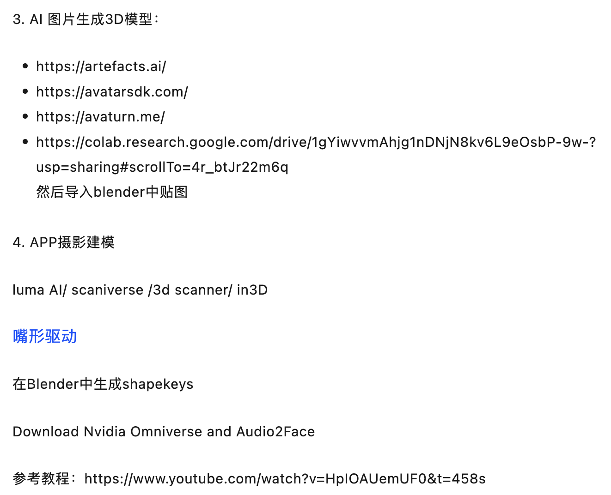
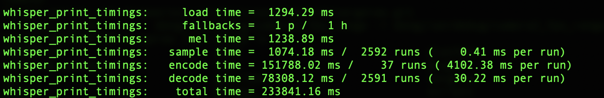

## NLP

### **[GPT2-chitchat](https://github.com/yangjianxin1/GPT2-chitchat)**

中文大语言模型，基于GPT2的中文闲聊机器人。开源了很多模型：

| 中文闲聊语料     | 数据集地址                                                   | 语料描述                                                     |
| ---------------- | ------------------------------------------------------------ | ------------------------------------------------------------ |
| 常见中文闲聊     | [chinese_chatbot_corpus](https://github.com/codemayq/chinese_chatbot_corpus) | 包含小黄鸡语料、豆瓣语料、电视剧对白语料、贴吧论坛回帖语料、微博语料、PTT八卦语料、青云语料等 |
| 50w中文闲聊语料  | [百度网盘【提取码:4g5e】](https://pan.baidu.com/s/1M87Zf9e8iBqqmfTkKBWBWA) 或 [GoogleDrive](https://drive.google.com/drive/folders/1QFRsftLNTR_D3T55mS_FocPEZI7khdST?usp=sharing) | 包含50w个多轮对话的原始语料、预处理数据                      |
| 100w中文闲聊语料 | [百度网盘【提取码:s908】](https://pan.baidu.com/s/1TvCQgJWuOoK2f5D95nH3xg) 或 [GoogleDrive](https://drive.google.com/drive/folders/1NU4KLDRxdOGINwxoHGWfVOfP0wL05gyj?usp=sharing) | 包含100w个多轮对话的原始语料、预处理数据                     |

| 模型              | 共享地址                                                     | 模型描述                                              |
| ----------------- | ------------------------------------------------------------ | ----------------------------------------------------- |
| model_epoch40_50w | [百度网盘【提取码:ju6m】](https://pan.baidu.com/s/1iEu_-Avy-JTRsO4aJNiRiA) 或 [GoogleDrive](https://drive.google.com/drive/folders/1fJ6VuBp4wA1LSMpZgpe7Hgm9dbZT5bHS?usp=sharing) | 使用50w多轮对话语料训练了40个epoch，loss降到2.0左右。 |

可在本地用cpu运行，支持mac。


### **[GPT2-Chinese](https://github.com/Morizeyao/GPT2-Chinese)**

中文的GPT2训练代码，使用BERT的Tokenizer或Sentencepiece的BPE model（感谢[kangzhonghua](https://github.com/kangzhonghua)的贡献，实现BPE模式需要略微修改train.py的代码）。可以写诗，新闻，小说，或是训练通用语言模型。支持字为单位或是分词模式或是BPE模式（需要略微修改train.py的代码）。支持大语料训练。

| 模型名称       | 模型介绍                                                     | 分享者                                | 链接地址1                                                    | 链接地址2                                                    |
| -------------- | ------------------------------------------------------------ | ------------------------------------- | ------------------------------------------------------------ | ------------------------------------------------------------ |
| 散文模型       | 使用130MB的名家散文、情感散文和散文诗歌训练所得 。           | [hughqiu](https://github.com/hughqiu) | [百度网盘【fpyu】](https://pan.baidu.com/s/1nbrW5iw34GRhoTin8uU2tQ) | [GDrive](https://drive.google.com/drive/folders/1rJC4niJKMVwixUQkuL9k5teLRnEYTmUf?usp=sharing) |
| 诗词模型       | 使用180MB的约80万首古诗词训练所得。                          | [hhou435](https://github.com/hhou435) | [百度网盘【7fev】](https://pan.baidu.com/s/1Hy0OQ5xZcTLer9MQZW8o3g) | [GDrive](https://drive.google.com/drive/folders/1Z6nF1nrgTkrZcRLHedQHXb4_M9I7yQPN?usp=sharing) |
| 对联模型       | 使用40MB的约70万条对联训练所得。                             | [hhou435](https://github.com/hhou435) | [百度网盘【i5n0】](https://pan.baidu.com/s/1j9yVQwjlXZq58wOyXK4lcg) | [GDrive](https://drive.google.com/drive/folders/1ZnsvS7oHRVueNKj_SeEhiQt86aze3ojj?usp=sharing) |
| 通用中文模型   | 使用[CLUECorpusSmall](https://github.com/CLUEbenchmark/CLUECorpus2020/)语料训练所得。 | [hhou435](https://github.com/hhou435) | [百度网盘【n3s8】](https://pan.baidu.com/s/16x0hfBCekWju75xPeyyRfA) | [GDrive](https://drive.google.com/drive/folders/1dLEANs5z4pWS0pzrak6Q2H2Nq4iYsMsf?usp=sharing) |
| 通用中文小模型 | 使用[CLUECorpusSmall](https://github.com/CLUEbenchmark/CLUECorpus2020/)语料训练所得。 | [hhou435](https://github.com/hhou435) | [百度网盘【rpjk】](https://pan.baidu.com/s/1AiSm2GWhbGNxvhrcUlDXNA) | [GDrive](https://drive.google.com/drive/folders/1eerX1N8n_eFlnQ4xpxZ4iU2-Mx83pXFp?usp=sharing) |
| 中文歌词模型   | 使用140MB的约15万首中文歌词训练所得。                        | [hhou435](https://github.com/hhou435) | [百度网盘【0qnn】](https://pan.baidu.com/s/19x0d0bPGCWHi9L4Pu0pSiw) | [GDrive](https://drive.google.com/drive/folders/1RFq4NoQ3phCJjrhKtu2Xbn6z0krcN9TM?usp=sharing) |
| 文言文模型     | 使用1.8GB的约300万篇文言文训练所得。                         | [hhou435](https://github.com/hhou435) | [百度网盘【ek2z】](https://pan.baidu.com/s/1X3Um9HketnlGYZubY9gnew) | [GDrive](https://drive.google.com/drive/folders/1dtHTRn3fX7g8cPCCaJEXA2tmrIcImR6t?usp=sharing) |

此处为热情大方的git友训练所得的模型文件，公开给所有朋友使用，同时也欢迎各位伙伴将自己训练完毕的模型公开于此处。

- 由用户[JamesHujy](https://github.com/JamesHujy)根据本仓库改版代码训练得到的模型作为律诗与绝句后台，新版[九歌诗歌生成器](https://jiuge.thunlp.cn/lvshi.html)已经上线。
- 由[leemengtaiwan](https://github.com/leemengtaiwan)贡献，提供[文章直觀介紹 GPT-2 以及如何視覺化自注意力機制](https://leemeng.tw/gpt2-language-model-generate-chinese-jing-yong-novels.html)。另提供 [Colab 筆記本與模型](https://colab.research.google.com/drive/1MaT8-HUHfZkdCra0OqZEIr0IFCq0MJBx)供任何使用者一鍵生成新樣例。


### [ChatGLM-6B](https://github.com/THUDM/ChatGLM-6B)

清华的大模型。还没试过。


### [h2ogpt](https://github.com/h2oai/h2ogpt)

开源大语言模型，还未尝试。有视频介绍：https://www.youtube.com/watch?v=Coj72EzmX20


## 动作/表情捕捉

### [SysMocap](https://github.com/xianfei/SysMocap)

js实现，跨平台的实时视频驱动动作捕捉及3D虚拟形象生成系统 for VTuber/Live/AR/VR.

提供用于Windows，macOS的可执行文件包，可在Linux上通过源代码运行。

支持表情和全身动作捕捉。

使用方式：

```shell
git clone https://github.com/xianfei/SysMocap.git
cd SysMocap
npm i
npm start
```


### [EasyMocap](https://github.com/zju3dv/EasyMocap)

支持Colab使用。EasyMocap-mv1p.ipynb


## 数字人

### [SadTalker](https://github.com/OpenTalker/SadTalker)

文本驱动图片，支持Colab，不需要训练模型。表情动作逼真，不支持身体动作。


### **[video-retalking](https://github.com/OpenTalker/video-retalking)**

语音驱动更换视频的唇形。不需要训练模型，效果很好，最好用不说话的视频推理。支持Colab。


### [Wav2Lip](https://github.com/Rudrabha/Wav2Lip)

和VideoRetalking类似，支持Colab。


## [PaddleGAN](https://github.com/PaddlePaddle/PaddleGAN)

百度的平台，支持的功能较多。但部署不方便。

支持功能包括：图片清晰度增强，图片妆容变化，人物图片卡通化，图片变动画，wav2lip等。


### **[DINet](https://github.com/MRzzm/DINet)**

可结合Openface来训练数字人模型。

参考：https://www.youtube.com/watch?v=YhK5LQTdPCM

[基于DINet+openface自训练AI数字人_哔哩哔哩_bilibili](https://www.bilibili.com/video/BV1Hg4y1u7C3/?spm_id_from=333.788.recommend_more_video.-1&vd_source=001f650913e144b8c11cbad6dd894734)

[AI 数字人训练(方法一：DINet训练)_哔哩哔哩_bilibili](https://www.bilibili.com/video/BV1Zu411L786/?spm_id_from=333.999.0.0)

本地训练可参考：[基于DINet的虚拟数字人-CSDN博客](https://datayang.blog.csdn.net/article/details/130082007)


### [ER-NeRF](https://github.com/Fictionarry/ER-NeRF)

应该是效果最好的，技术基于 ，但Colab训练貌似会爆显存。


## AI换脸

### [roop](https://github.com/s0md3v/roop)

一张图就可以换脸，不需要训练模型，效果也还不错，没有大量侧脸和丰富表情时效果很好。支持Colab运行。


### **[DeepFaceLab](https://github.com/iperov/DeepFaceLab)** && **[DeepFaceLive](https://github.com/iperov/DeepFaceLive)**

需要训练模型，效果应该是最好的一个。但Colab已被Google禁用。


### **[faceswap](https://github.com/deepfakes/faceswap)**


### **[insightface](https://github.com/deepinsight/insightface)**

图片换脸，可以直接在Discord上使用。


## AI语音

### [so-vits-svc](https://github.com/svc-develop-team/so-vits-svc)

目前主流的AI歌曲项目，AI孙燕姿大部分用这个。也支持说话换音，但没验证效果。训练数据集不知道能不能歌声和说话声混合一起训练。训练时音频需要切割到20s左右大小。男变女、女变男的音色不知道怎么切换。支持Colab训练和推理，可以Colab接力训练。原作者更新到4.0后停更。

训练集最好配合语音切割工具(**[AudioSlicer](https://github.com/henrymaas/AudioSlicer)**  这个无可视化界面，切割效果不太稳定。推荐**[audio-slicer](https://github.com/flutydeer/audio-slicer)** 这个工具，效果更好，有UI界面可用)和人声与背景分离工具Ultimate Vocal Remover配合使用。

推理效果容易出现电音，需要用工具消除。Ultimate Vocal Remover也支持消除电音，需要另外下载模型。

目前有别人做的[so-vits-svc-5.0](https://github.com/PlayVoice/so-vits-svc-5.0)，但作者声明**本项目只是使用简洁明了的代码结构，方便学习研究，效果远不如[so-vits-svc](https://github.com/svc-develop-team/so-vits-svc)**。主要方便学习pytorch。


### [Retrieval-based-Voice-Conversion-WebUI](https://github.com/RVC-Project/Retrieval-based-Voice-Conversion-WebUI)

大名鼎鼎的RVC变声。支持Colab训练模型和推理。有WebUI方便操作，但Colab接力训练我还没跑通。支持歌声和说话，男变女和女变男很方便。声音效果很好，不知道歌声怎么样。不知道是否能歌声和说话声混合训练。训练源语音可以支持较长时间的语音文件，不需要自己切割。大多用在实时语音切换、直播等，对显卡要求较高。


### [voice-changer](https://github.com/w-okada/voice-changer)

日本人做的支持Mac M1的实时语音变换。支持RVC等多种模型。但Mac上效果不好，延时很严重。不知道M2怎么样。


## AI绘画

### [stable-diffusion-webui](https://github.com/AUTOMATIC1111/stable-diffusion-webui)

AI绘图神器，本地配置，灵活度大。可自由搭配模型，支持文生图、图生图、局部绘制等等。对显卡要求较高。支持Mac M1,但Mac出图较慢。


### **[kohya-trainer](https://github.com/Linaqruf/kohya-trainer)**

Stable Diffusion模型训练。


## AI视频

### **[VToonify](https://github.com/williamyang1991/VToonify)**

视频转卡通风格。相比使用stable diffusion，这个效率更高，不闪烁，且有huggingface试用，试用地址只支持3秒视频。可以在Colab上转完整的视频。


### [CogVideo](https://github.com/THUDM/CogVideo)

AI文字生成视频方案：

方法一：在线试玩

google的Imagen-Video  网址：https://imagen.research.google/video/ 

google的phenaki    网址：https://phenaki.github.io/# 

Meta的Make-A-Video  网址：https://makeavideo.studio/ 

方法二：跑开源项目代码。 github开源项目 CogVideo    网址： https://github.com/THUDM/CogVideo 

有试玩：[CogVideo - a Hugging Face Space by THUDM](https://huggingface.co/spaces/THUDM/CogVideo)

方法三：用自己的方法，先文字生成图像，再用图像生成视频。 先用：Disco Diffusion或者Stable Diffusion 文字生成图片     网址：https://www.bilibili.com/video/BV1Hd4y197hF/?spm_id_from=333.999.0.0&vd_source=7720ff9e037156b51374d14ee8f76b51 

再用：Infinite Nature 生成视频     网址：https://www.bilibili.com/video/BV1bB4y1J7Ux/?spm_id_from=333.999.0.0&vd_source=7720ff9e037156b51374d14ee8f76b51    


### [Controlvideo](https://github.com/YBYBZhang/ControlVideo)

项目地址：https://ml.cs.tsinghua.edu.cn/controlvideo/

在线试玩：https://replicate.com/cjwbw/controlvideo/examples#az7atbep3fc3lnprxwdavpqaxy

文字编辑视频


## AI 3D

### **[ECON](https://github.com/YuliangXiu/ECON)**

一张图片生成3d人物。支持Colab，但效果一般


### [mint](https://github.com/google-research/mint)

Google出品，根据音乐生成3D人物动作。官网介绍：

[AI Choreographer: Music Conditioned 3D Dance Generation with AIST++ (google.github.io)](https://google.github.io/aichoreographer/)


### [shap-e](https://github.com/openai/shap-e)

OpenAI出品，文生3D模型。效果一般，适合做一些趣味性的模型；


### Dream3D

[Dream3D: Zero-Shot Text-to-3D Synthesis Using 3D Shape Prior and Text-to-Image Diffusion Models (bluestyle97.github.io)](https://bluestyle97.github.io/dream3d/)

腾讯的文生3D，效果一般。支持Colab


### Rodin Diffusion

微软的文生3D，一张照片生成人物3D模型。未开源。看介绍效果不错，官网在[RODIN Diffusion (microsoft.com)](https://3d-avatar-diffusion.microsoft.com/)

可以持续关注。


### [Skybox AI (blockadelabs.com)](https://skybox.blockadelabs.com/)

文生SkyBox。


### 其他




## AI生成游戏

### [GameGAN](https://github.com/nv-tlabs/GameGAN_code)

官网https://nv-tlabs.github.io/gameGAN/


## AI工具


## TTS/ASR

### **[Bark-Voice-Cloning](https://github.com/KevinWang676/Bark-Voice-Cloning)**

根据声音训练tts模型。个人觉得声音不是特别像，只有60%的相似度。推理的声音断句速度不太好。


### [tortoise-tts](https://github.com/neonbjb/tortoise-tts)

英文效果较好。据说eleven-labs用的它

#### Apple Silicon

On macOS 13+ with M1/M2 chips you need to install the nighly version of PyTorch, as stated in the official page you can do:

```
pip3 install --pre torch torchvision torchaudio --index-url https://download.pytorch.org/whl/nightly/cpu
```

Be sure to do that after you activate the environment. If you don't use conda the commands would look like this:

```
python3.10 -m venv .venv
source .venv/bin/activate
pip3.10 install numba inflect psutil
pip3.10 install --pre torch torchvision torchaudio --index-url https://download.pytorch.org/whl/nightly/cpu
pip3.10 install transformers
git clone https://github.com/neonbjb/tortoise-tts.git
cd tortoise-tts
pip3.10 install .
```

Be aware that DeepSpeed is disabled on Apple Silicon since it does not work. The flag `--use_deepspeed` is ignored. You may need to prepend `PYTORCH_ENABLE_MPS_FALLBACK=1` to the commands below to make them work since MPS does not support all the operations in Pytorch.

#### do_tts.py

This script allows you to speak a single phrase with one or more voices.

```
python3.10 tortoise/do_tts.py --text "I'm going to speak this" --voice random --preset fast
```


#### 自定义声音

```
# the scipy version packaged with colab is not tolerant of misformated WAV files.
# install the latest version.
!pip3 install -U scipy

!git clone https://github.com/jnordberg/tortoise-tts.git
%cd tortoise-tts
!pip3 install -r requirements.txt
!pip3 install transformers==4.19.0 einops==0.5.0 rotary_embedding_torch==0.1.5 unidecode==1.3.5
!python3 setup.py install
```

```
# Imports used through the rest of the notebook.
import torch
import torchaudio
import torch.nn as nn
import torch.nn.functional as F

import IPython

from tortoise.api import TextToSpeech
from tortoise.utils.audio import load_audio, load_voice, load_voices

# This will download all the models used by Tortoise from the HuggingFace hub.
tts = TextToSpeech()
```

```
# This is the text that will be spoken.
text = "In the second year of Jianzhong of the Tang Dynasty, Tubo captured Shazhou with its strength."

# Pick a "preset mode" to determine quality. Options: {"ultra_fast", "fast" (default), "standard", "high_quality"}. See docs in api.py
preset = "fast"
```

```
# Optionally, upload use your own voice by running the next two cells. I recommend
# you upload at least 2 audio clips. They must be a WAV file, 6-10 seconds long.
CUSTOM_VOICE_NAME = "martin"

import os
from google.colab import files

custom_voice_folder = f"tortoise/voices/{CUSTOM_VOICE_NAME}"
os.makedirs(custom_voice_folder)
for i, file_data in enumerate(files.upload().values()):
  with open(os.path.join(custom_voice_folder, f'{i}.wav'), 'wb') as f:
    f.write(file_data)
```

```
# Generate speech with the custotm voice.
voice_samples, conditioning_latents = load_voice(CUSTOM_VOICE_NAME)
gen = tts.tts_with_preset(text, voice_samples=voice_samples, conditioning_latents=conditioning_latents, 
                          preset=preset)
torchaudio.save(f'generated-{CUSTOM_VOICE_NAME}.wav', gen.squeeze(0).cpu(), 24000)
IPython.display.Audio(f'generated-{CUSTOM_VOICE_NAME}.wav')
```


### [VITS-fast-fine-tuning](https://github.com/Plachtaa/VITS-fast-fine-tuning)

相比tortoise-tts, 这个是中文效果较好的tts，且有完善的Colab训练方式，可根据短音频集、长音频、视频、视频链接等方式直接拿数据训练。训练完成还有推理的UI。暂未和Bert-Vits2进行比较，不知道这两个哪个效果更好。和Sovits的训练基本类似；


### [Bert-VITS2](https://github.com/fishaudio/Bert-VITS2)

暂时没找到合适的Colab训练方式，本地推理不友好。


### **[bark](https://github.com/suno-ai/bark)**

带情绪的tts，用于做数字人的推理应该效果不错。

有快速推理的huggingface链接：https://huggingface.co/spaces/suno/bark

限制14秒以内，会自动插入一些情绪、停顿等声音，不适合做新闻、自媒体类播报；

如果突破14秒限制，可以用Colab实现如下：

```python
# install bark (make sure you have torch>=2 for much faster flash-attention)
!pip install git+https://github.com/suno-ai/bark.git
```

```python
# 生成长语音
import nltk
nltk.download('punkt')
```

```python
import os

os.environ["CUDA_VISIBLE_DEVICES"] = "0"

from IPython.display import Audio
import nltk  # we'll use this to split into sentences
import numpy as np

from bark.generation import (
    generate_text_semantic,
    preload_models,
)
from bark.api import semantic_to_waveform
from bark import generate_audio, SAMPLE_RATE
preload_models()
script = """
Dunhuang, also known as Shazhou in ancient times.
In the second year of Jianzhong of the Tang Dynasty, Tubo captured Shazhou with its strength.
All the defenders of the Tang Dynasty died for the country.
Chang'an lost its last stronghold leading to the Western Regions.
To the west of Yumen Pass, there is no flag of the Tang family.
""".replace("\n", " ").strip()
sentences = nltk.sent_tokenize(script)
SPEAKER = "v2/en_speaker_7"
silence = np.zeros(int(0.85 * SAMPLE_RATE))  # quarter second of silence

pieces = []
for sentence in sentences:
    audio_array = generate_audio(sentence, history_prompt=SPEAKER)
    pieces += [audio_array, silence.copy()]
Audio(np.concatenate(pieces), rate=SAMPLE_RATE)
```

音色的speaker可以从这里预览：https://suno-ai.notion.site/8b8e8749ed514b0cbf3f699013548683?v=bc67cff786b04b50b3ceb756fd05f68c


### [whisper.cpp](https://github.com/ggerganov/whisper.cpp)

业界良心OpenAI开源的[Whisper模型](https://v3u.cn/a_id_272)是开源语音转文字领域的执牛耳者，白璧微瑕之处在于无法通过苹果M芯片优化转录效率，Whisper.cpp 则是 Whisper 模型的 C/C++ 移植版本，它具有无依赖项、内存使用量低等特点，重要的是增加了 Core ML 支持，完美适配苹果M系列芯片。

Whisper.cpp的张量运算符针对苹果M芯片的 CPU 进行了大量优化，根据计算大小，使用 Arm Neon SIMD instrisics 或 CBLAS Accelerate 框架例程，后者对于更大的尺寸特别有效，因为 Accelerate 框架可以使用苹果M系列芯片中提供的专用 AMX 协处理器。

注意音频源需要转码成wav，且16000的采样率才行。

以下内容参考博客：https://www.cnblogs.com/v3ucn/p/17370373.html

#### 配置Whisper.cpp

老规矩，运行git命令来克隆Whisper.cpp项目：

```bash
git clone https://github.com/ggerganov/whisper.cpp.git
```

随后进入项目的目录：

```bash
cd whisper.cpp
```

<font color="red">项目默认的基础模型不支持中文</font>，这里推荐使用medium模型，通过shell脚本进行下载：

```bash
bash ./models/download-ggml-model.sh medium
```

下载完成后，会在项目的models目录保存ggml-medium.bin模型文件，大小为1.53GB：

```diff
whisper.cpp git:(master) cd models   
➜  models git:(master) ll  
total 3006000  
-rw-r--r--  1 liuyue  staff   3.2K  4 21 07:21 README.md  
-rw-r--r--  1 liuyue  staff   7.2K  4 21 07:21 convert-h5-to-ggml.py  
-rw-r--r--  1 liuyue  staff   9.2K  4 21 07:21 convert-pt-to-ggml.py  
-rw-r--r--  1 liuyue  staff    13K  4 21 07:21 convert-whisper-to-coreml.py  
drwxr-xr-x  4 liuyue  staff   128B  4 22 00:33 coreml-encoder-medium.mlpackage  
-rwxr-xr-x  1 liuyue  staff   2.1K  4 21 07:21 download-coreml-model.sh  
-rw-r--r--  1 liuyue  staff   1.3K  4 21 07:21 download-ggml-model.cmd  
-rwxr-xr-x  1 liuyue  staff   2.0K  4 21 07:21 download-ggml-model.sh  
-rw-r--r--  1 liuyue  staff   562K  4 21 07:21 for-tests-ggml-base.bin  
-rw-r--r--  1 liuyue  staff   573K  4 21 07:21 for-tests-ggml-base.en.bin  
-rw-r--r--  1 liuyue  staff   562K  4 21 07:21 for-tests-ggml-large.bin  
-rw-r--r--  1 liuyue  staff   562K  4 21 07:21 for-tests-ggml-medium.bin  
-rw-r--r--  1 liuyue  staff   573K  4 21 07:21 for-tests-ggml-medium.en.bin  
-rw-r--r--  1 liuyue  staff   562K  4 21 07:21 for-tests-ggml-small.bin  
-rw-r--r--  1 liuyue  staff   573K  4 21 07:21 for-tests-ggml-small.en.bin  
-rw-r--r--  1 liuyue  staff   562K  4 21 07:21 for-tests-ggml-tiny.bin  
-rw-r--r--  1 liuyue  staff   573K  4 21 07:21 for-tests-ggml-tiny.en.bin  
-rwxr-xr-x  1 liuyue  staff   1.4K  4 21 07:21 generate-coreml-interface.sh  
-rwxr-xr-x@ 1 liuyue  staff   769B  4 21 07:21 generate-coreml-model.sh  
-rw-r--r--  1 liuyue  staff   1.4G  3 22 16:04 ggml-medium.bin
```

模型下载以后，在根目录编译可执行文件：（<font color="red">注意，如果切换了模型，比如切换为ggml-large-v3.bin，要重新make才能生效，不然好像只能支持英文</font>）

```go
make
```

程序返回：

```yaml
➜  whisper.cpp git:(master) make  
I whisper.cpp build info:   
I UNAME_S:  Darwin  
I UNAME_P:  arm  
I UNAME_M:  arm64  
I CFLAGS:   -I.              -O3 -DNDEBUG -std=c11   -fPIC -pthread -DGGML_USE_ACCELERATE  
I CXXFLAGS: -I. -I./examples -O3 -DNDEBUG -std=c++11 -fPIC -pthread  
I LDFLAGS:   -framework Accelerate  
I CC:       Apple clang version 14.0.3 (clang-1403.0.22.14.1)  
I CXX:      Apple clang version 14.0.3 (clang-1403.0.22.14.1)  
  
c++ -I. -I./examples -O3 -DNDEBUG -std=c++11 -fPIC -pthread examples/bench/bench.cpp ggml.o whisper.o -o bench  -framework Accelerate
```

至此，Whisper.cpp就配置好了。

#### 牛刀小试

现在我们来测试一段英文语音，看看效果：

```bash
./main -osrt -m ./models/ggml-medium.bin -f samples/jfk.wav
```

这行命令的含义是通过刚才下载ggml-medium.bin模型来对项目中的samples/jfk.wav语音文件进行识别，只需要11秒，同时语音字幕会写入samples/jfk.wav.srt文件。英文准确率是百分之百。

现在我们来换成中文语音，可以随便录制一段语音，需要注意的是，Whisper.cpp只支持wav格式的单声道且采样率16k Hz的语音文件，这里先通过ffmpeg将mp3文件转换为wav:（格式不对可能报错read_wav: WAV file '/Users/jian.deng/Downloads/Se1Ep07.wav' must be 16 kHz）

```bash
ffmpeg -i ./test1.mp3 -ar 16000 -ac 1 -c:a pcm_s16le ./test1.wav
```

这里将一段五分四十一秒的语音转换为wav文件。

随后运行命令开始转录：

```bash
./main -osrt -m ./models/ggml-medium.bin -f samples/test1.wav -l zh

或
./main -osrt -m ./models/ggml-large-v3.bin -f samples/test1.wav -l zh
```

这里需要加上参数-l，告知程序为中文语音。五分钟的语音，只需要一分钟多一点就可以转录完成，效率满分。

当然，精确度还有待提高，提高精确度可以选择large模型，但转录时间会相应增加。

P.S. 输入的wav的采样率必须是16k，如果不是用ffmpeg命令转一下

```shell
ffmpeg -i input.mp4 -vn -acodec pcm_s16le -ar 16000 -ac 2 output.wav
```


#### 苹果M芯片模型转换

基于苹果Mac系统的用户有福了，Whisper.cpp可以通过Core ML在Apple Neural Engine (ANE)上执行编码器推理，这可以比仅使用CPU执行快出三倍以上。

首先安装转换依赖：

```mipsasm
pip install ane_transformers  
pip install openai-whisper  
pip install coremltools
```

接着运行转换脚本：

```verilog
./models/generate-coreml-model.sh medium 
```

这里参数即模型的名称。

程序返回：<font color="red">这个步骤我会一直卡在done converting之前，</font>Running MIL backend_mlprogram pipeline: 100%这个已经输出，但一直不输出done，后面也无法进行转换。报错failed to load Core ML model。不推荐使用。

```vhdl
➜  models git:(master) python3 convert-whisper-to-coreml.py --model medium --encoder-only True   
scikit-learn version 1.2.0 is not supported. Minimum required version: 0.17. Maximum required version: 1.1.2. Disabling scikit-learn conversion API.  
ModelDimensions(n_mels=80, n_audio_ctx=1500, n_audio_state=1024, n_audio_head=16, n_audio_layer=24, n_vocab=51865, n_text_ctx=448, n_text_state=1024, n_text_head=16, n_text_layer=24)  
/opt/homebrew/lib/python3.10/site-packages/whisper/model.py:166: TracerWarning: Converting a tensor to a Python boolean might cause the trace to be incorrect. We can't record the data flow of Python values, so this value will be treated as a constant in the future. This means that the trace might not generalize to other inputs!  
  assert x.shape[1:] == self.positional_embedding.shape, "incorrect audio shape"  
/opt/homebrew/lib/python3.10/site-packages/whisper/model.py:97: UserWarning: __floordiv__ is deprecated, and its behavior will change in a future version of pytorch. It currently rounds toward 0 (like the 'trunc' function NOT 'floor'). This results in incorrect rounding for negative values. To keep the current behavior, use torch.div(a, b, rounding_mode='trunc'), or for actual floor division, use torch.div(a, b, rounding_mode='floor').  
  scale = (n_state // self.n_head) ** -0.25  
Converting PyTorch Frontend ==> MIL Ops: 100%|▉| 1971/1972 [00:00<00:00, 3247.25  
Running MIL frontend_pytorch pipeline: 100%|█| 5/5 [00:00<00:00, 54.69 passes/s]  
Running MIL default pipeline: 100%|████████| 57/57 [00:09<00:00,  6.29 passes/s]  
Running MIL backend_mlprogram pipeline: 100%|█| 10/10 [00:00<00:00, 444.13 passe  
  
done converting
```

转换好以后，重新进行编译：

```go
make clean  
WHISPER_COREML=1 make -j
```

随后用转换后的模型进行转录即可：

```bash
./main -m models/ggml-medium.bin -f samples/jfk.wav
```

至此，Mac用户立马荣升一等公民。

#### 日语支持

参考https://sspai.com/post/76899

我有一个大胆的想法...

whisper貌似默认支持日语，不知道识别效果如何，前面下载的ggml-medium.bin就可以用。使用时需要指定语言，不能简写。同样注意输入的原音频需要采样率是16k的。如下：
```
./main -osrt -m ./models/ggml-medium.bin -f /Users/jian.deng/AI/WhisperTest/test.wav -l japanese
```

我这边Mac M1测试16分钟的日语wav转换花了4分钟左右。



然后再用https://www.nikse.dk/subtitleedit/online 这个进行翻译。

通过 Whisper 获得原生字幕后，接着要将其翻译为中文。这一步需借助 SubtitleEdit Online，它支持免费在线翻译字幕，可使用 Google 和 Yandex 两种翻译引擎。1

1. 打开 [SubtitleEdit Online]([Nikse - Subtitle Edit online](https://www.nikse.dk/subtitleedit/online))，点击「Subtitle」>「Open...」，选择要导入的字幕文件。
2. 点击「Auto-translate」，选择翻译引擎，然后在弹出窗口中选择字幕要翻译的语言，并**将页面拖动到最下方**（非常重要），确定所有文字都被翻译后点击 OK 按钮。
3. 点击「Subtitle」>「Save/download...」，即可保存翻译好的字幕文件。

除了网页翻译字幕，本地端的神经机器翻译也是种好选择。macOS 用户推荐使用 [Argos Translate](https://sspai.com/link?target=https%3A%2F%2Fgithub.com%2Fargosopentech%2Fargos-translate)，这是基于 OpenNMT 的开源神经机器翻译。如果你的动手能力较强，可以尝试 [Opus-MT](https://sspai.com/link?target=https%3A%2F%2Fgithub.com%2FHelsinki-NLP%2FOpus-MT)。不管用哪种方式，都是将字幕以文本方式导出，复制到翻译引擎中翻译，即可得到不同于 Google Translate 的翻译结果。


#### Whisper 进阶命令

##### task

`--task` 分为 transcribe（语音转录）和 translate。Whisper 默认使用 `--task transcribe` 模式，将语音转录为对应的语言字幕。`--task translate` 是所有语言翻译为**英文**，目前尚未支持翻译为其他语言。

##### language

`--language` 是设置语音转录的语种，支持语种范围查看 [tokenizer.py](https://sspai.com/link?target=https%3A%2F%2Fgithub.com%2Fopenai%2Fwhisper%2Fblob%2Fmain%2Fwhisper%2Ftokenizer.py)，比如指定日语 `--language japanese`。如果你没指定语种，Whisper 会截取音频的前 30 秒来判断语种。

如果指定语种与文件中的语种并不相同，Whisper 会强制翻译，但 10 分钟以上的音视频会出现大量的重复无意义字幕。2假设你把日语视频的转录语言设为汉语，前 8 分钟 Whisper 会正确转录到中文，但 8 分钟后的转录字幕会一直重复，并与实际片段无关。

##### model

`--model` 指 Whisper 的转录模型，转录效果为 tiny < base < small < medium < large，默认使用 small。添加参数 `--model medium` 或 `--model large` 可以切换到更大的模型，但转录时间也会变长。如果你是对英文视频进行转录，则在模型参数上添加后缀 `.en`，能提升转录速度。

##### 幻听参数

非英语视频的转录有时会出现**幻听**，即静默片段被识别出语音，或是转录结果与该片段无关。这些问题是由语气停顿参数引起的。幻听的解决方案是引入 [VAD](https://sspai.com/link?target=https%3A%2F%2Fgithub.com%2Fsnakers4%2Fsilero-vad)，但 VAD 对动手能力要求较高。如果你的视频转录出现了严重幻听，建议先尝试调节参数阈值。

- `--no_speech_threshold` 无声识别的阈值，默认为 0.6。当 no_speech_threshold 高于阈值且 logprob_threshold 低于预设时，该片段将被标记为静默。对于非英语长视频来说，建议将其调低，否则经常出现大段的重复识别。
- `--logprob_threshold` 转录频次的阈值，默认为 -1.0。当 logprob_threshold 低于预设时，将不对该片段进行转录。建议修改为 None 或更低的值。
- `--compression_ratio_threshold` 压缩比的阈值，默认为 2.4。当 compression_ratio_threshold 高于预设时，将不对该片段进行转录。

`--no_speech_threshold 0.5 --logprob_threshold None --compression_ratio_threshold 2.2` 是我常用的参数，你可以按视频情况来调节。

