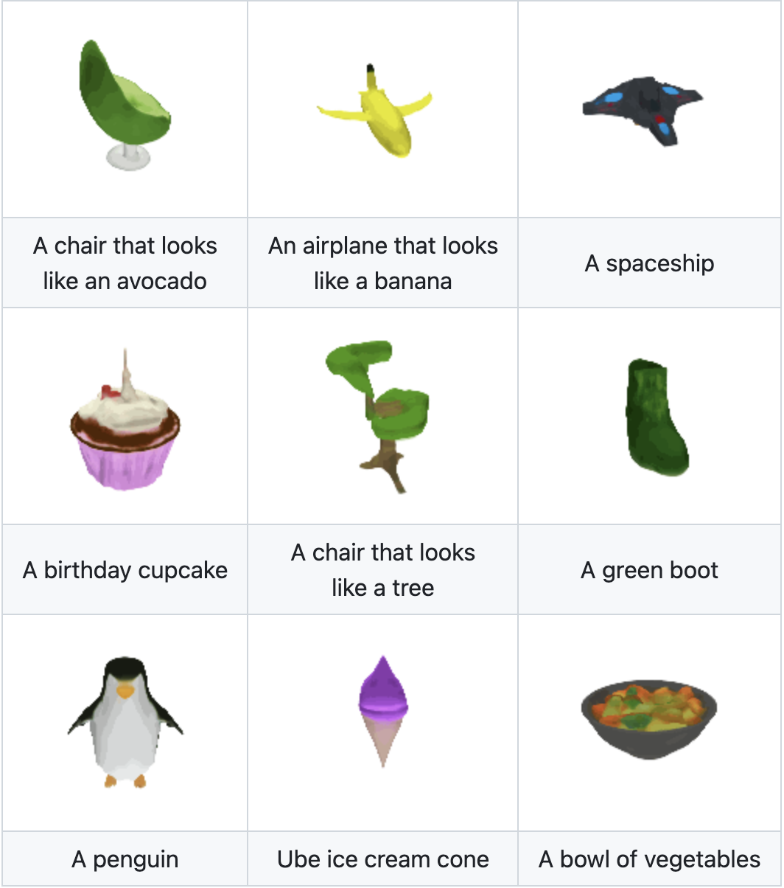

## NLP

### **[GPT2-chitchat](https://github.com/yangjianxin1/GPT2-chitchat)**

中文大语言模型，基于GPT2的中文闲聊机器人。开源了很多模型：

| 中文闲聊语料     | 数据集地址                                                   | 语料描述                                                     |
| ---------------- | ------------------------------------------------------------ | ------------------------------------------------------------ |
| 常见中文闲聊     | [chinese_chatbot_corpus](https://github.com/codemayq/chinese_chatbot_corpus) | 包含小黄鸡语料、豆瓣语料、电视剧对白语料、贴吧论坛回帖语料、微博语料、PTT八卦语料、青云语料等 |
| 50w中文闲聊语料  | [百度网盘【提取码:4g5e】](https://pan.baidu.com/s/1M87Zf9e8iBqqmfTkKBWBWA) 或 [GoogleDrive](https://drive.google.com/drive/folders/1QFRsftLNTR_D3T55mS_FocPEZI7khdST?usp=sharing) | 包含50w个多轮对话的原始语料、预处理数据                      |
| 100w中文闲聊语料 | [百度网盘【提取码:s908】](https://pan.baidu.com/s/1TvCQgJWuOoK2f5D95nH3xg) 或 [GoogleDrive](https://drive.google.com/drive/folders/1NU4KLDRxdOGINwxoHGWfVOfP0wL05gyj?usp=sharing) | 包含100w个多轮对话的原始语料、预处理数据                     |

| 模型              | 共享地址                                                     | 模型描述                                              |
| ----------------- | ------------------------------------------------------------ | ----------------------------------------------------- |
| model_epoch40_50w | [百度网盘【提取码:ju6m】](https://pan.baidu.com/s/1iEu_-Avy-JTRsO4aJNiRiA) 或 [GoogleDrive](https://drive.google.com/drive/folders/1fJ6VuBp4wA1LSMpZgpe7Hgm9dbZT5bHS?usp=sharing) | 使用50w多轮对话语料训练了40个epoch，loss降到2.0左右。 |

可在本地用cpu运行，支持mac。


### **[GPT2-Chinese](https://github.com/Morizeyao/GPT2-Chinese)**

中文的GPT2训练代码，使用BERT的Tokenizer或Sentencepiece的BPE model（感谢[kangzhonghua](https://github.com/kangzhonghua)的贡献，实现BPE模式需要略微修改train.py的代码）。可以写诗，新闻，小说，或是训练通用语言模型。支持字为单位或是分词模式或是BPE模式（需要略微修改train.py的代码）。支持大语料训练。

| 模型名称       | 模型介绍                                                     | 分享者                                | 链接地址1                                                    | 链接地址2                                                    |
| -------------- | ------------------------------------------------------------ | ------------------------------------- | ------------------------------------------------------------ | ------------------------------------------------------------ |
| 散文模型       | 使用130MB的名家散文、情感散文和散文诗歌训练所得 。           | [hughqiu](https://github.com/hughqiu) | [百度网盘【fpyu】](https://pan.baidu.com/s/1nbrW5iw34GRhoTin8uU2tQ) | [GDrive](https://drive.google.com/drive/folders/1rJC4niJKMVwixUQkuL9k5teLRnEYTmUf?usp=sharing) |
| 诗词模型       | 使用180MB的约80万首古诗词训练所得。                          | [hhou435](https://github.com/hhou435) | [百度网盘【7fev】](https://pan.baidu.com/s/1Hy0OQ5xZcTLer9MQZW8o3g) | [GDrive](https://drive.google.com/drive/folders/1Z6nF1nrgTkrZcRLHedQHXb4_M9I7yQPN?usp=sharing) |
| 对联模型       | 使用40MB的约70万条对联训练所得。                             | [hhou435](https://github.com/hhou435) | [百度网盘【i5n0】](https://pan.baidu.com/s/1j9yVQwjlXZq58wOyXK4lcg) | [GDrive](https://drive.google.com/drive/folders/1ZnsvS7oHRVueNKj_SeEhiQt86aze3ojj?usp=sharing) |
| 通用中文模型   | 使用[CLUECorpusSmall](https://github.com/CLUEbenchmark/CLUECorpus2020/)语料训练所得。 | [hhou435](https://github.com/hhou435) | [百度网盘【n3s8】](https://pan.baidu.com/s/16x0hfBCekWju75xPeyyRfA) | [GDrive](https://drive.google.com/drive/folders/1dLEANs5z4pWS0pzrak6Q2H2Nq4iYsMsf?usp=sharing) |
| 通用中文小模型 | 使用[CLUECorpusSmall](https://github.com/CLUEbenchmark/CLUECorpus2020/)语料训练所得。 | [hhou435](https://github.com/hhou435) | [百度网盘【rpjk】](https://pan.baidu.com/s/1AiSm2GWhbGNxvhrcUlDXNA) | [GDrive](https://drive.google.com/drive/folders/1eerX1N8n_eFlnQ4xpxZ4iU2-Mx83pXFp?usp=sharing) |
| 中文歌词模型   | 使用140MB的约15万首中文歌词训练所得。                        | [hhou435](https://github.com/hhou435) | [百度网盘【0qnn】](https://pan.baidu.com/s/19x0d0bPGCWHi9L4Pu0pSiw) | [GDrive](https://drive.google.com/drive/folders/1RFq4NoQ3phCJjrhKtu2Xbn6z0krcN9TM?usp=sharing) |
| 文言文模型     | 使用1.8GB的约300万篇文言文训练所得。                         | [hhou435](https://github.com/hhou435) | [百度网盘【ek2z】](https://pan.baidu.com/s/1X3Um9HketnlGYZubY9gnew) | [GDrive](https://drive.google.com/drive/folders/1dtHTRn3fX7g8cPCCaJEXA2tmrIcImR6t?usp=sharing) |

此处为热情大方的git友训练所得的模型文件，公开给所有朋友使用，同时也欢迎各位伙伴将自己训练完毕的模型公开于此处。

- 由用户[JamesHujy](https://github.com/JamesHujy)根据本仓库改版代码训练得到的模型作为律诗与绝句后台，新版[九歌诗歌生成器](https://jiuge.thunlp.cn/lvshi.html)已经上线。
- 由[leemengtaiwan](https://github.com/leemengtaiwan)贡献，提供[文章直觀介紹 GPT-2 以及如何視覺化自注意力機制](https://leemeng.tw/gpt2-language-model-generate-chinese-jing-yong-novels.html)。另提供 [Colab 筆記本與模型](https://colab.research.google.com/drive/1MaT8-HUHfZkdCra0OqZEIr0IFCq0MJBx)供任何使用者一鍵生成新樣例。


### [ChatGLM-6B](https://github.com/THUDM/ChatGLM-6B)

清华的大模型。还没试过。


## 动作/表情捕捉

### [SysMocap](https://github.com/xianfei/SysMocap)

js实现，跨平台的实时视频驱动动作捕捉及3D虚拟形象生成系统 for VTuber/Live/AR/VR.

提供用于Windows，macOS的可执行文件包，可在Linux上通过源代码运行。

支持表情和全身动作捕捉。

使用方式：

```shell
git clone https://github.com/xianfei/SysMocap.git
cd SysMocap
npm i
npm start
```


### [EasyMocap](https://github.com/zju3dv/EasyMocap)

支持Colab使用。EasyMocap-mv1p.ipynb


## 数字人

### [SadTalker](https://github.com/OpenTalker/SadTalker)

文本驱动图片，支持Colab，不需要训练模型。表情动作逼真，不支持身体动作。


### **[video-retalking](https://github.com/OpenTalker/video-retalking)**

语音驱动更换视频的唇形。不需要训练模型，效果很好，最好用不说话的视频推理。支持Colab。


### [Wav2Lip](https://github.com/Rudrabha/Wav2Lip)

和VideoRetalking类似，支持Colab。


## [PaddleGAN](https://github.com/PaddlePaddle/PaddleGAN)

百度的平台，支持的功能较多。但部署不方便。

支持功能包括：图片清晰度增强，图片妆容变化，人物图片卡通化，图片变动画，wav2lip等。


## AI换脸

### [roop](https://github.com/s0md3v/roop)

一张图就可以换脸，不需要训练模型，效果也还不错，没有大量侧脸和丰富表情时效果很好。支持Colab运行。


### **[DeepFaceLab](https://github.com/iperov/DeepFaceLab)** && **[DeepFaceLive](https://github.com/iperov/DeepFaceLive)**

需要训练模型，效果应该是最好的一个。但Colab已被Google禁用。


### **[faceswap](https://github.com/deepfakes/faceswap)**


## AI语音

### [so-vits-svc](https://github.com/svc-develop-team/so-vits-svc)

目前主流的AI歌曲项目，AI孙燕姿大部分用这个。也支持说话换音，但没验证效果。训练数据集不知道能不能歌声和说话声混合一起训练。训练时音频需要切割到20s左右大小。男变女、女变男的音色不知道怎么切换。支持Colab训练和推理，可以Colab接力训练。原作者更新到4.0后停更。

训练集最好配合语音切割工具(**[AudioSlicer](https://github.com/henrymaas/AudioSlicer)**  这个无可视化界面，切割效果不太稳定。推荐**[audio-slicer](https://github.com/flutydeer/audio-slicer)** 这个工具，效果更好，有UI界面可用)和人声与背景分离工具Ultimate Vocal Remover配合使用。

推理效果容易出现电音，需要用工具消除。Ultimate Vocal Remover也支持消除电音，需要另外下载模型。

目前有别人做的[so-vits-svc-5.0](https://github.com/PlayVoice/so-vits-svc-5.0)，但作者声明**本项目只是使用简洁明了的代码结构，方便学习研究，效果远不如[so-vits-svc](https://github.com/svc-develop-team/so-vits-svc)**。主要方便学习pytorch。


### [Retrieval-based-Voice-Conversion-WebUI](https://github.com/RVC-Project/Retrieval-based-Voice-Conversion-WebUI)

大名鼎鼎的RVC变声。支持Colab训练模型和推理。有WebUI方便操作，但Colab接力训练我还没跑通。支持歌声和说话，男变女和女变男很方便。声音效果很好，不知道歌声怎么样。不知道是否能歌声和说话声混合训练。训练源语音可以支持较长时间的语音文件，不需要自己切割。大多用在实时语音切换、直播等，对显卡要求较高。


### [voice-changer](https://github.com/w-okada/voice-changer)

日本人做的支持Mac M1的实时语音变换。支持RVC等多种模型。但Mac上效果不好，延时很严重。不知道M2怎么样。


## AI绘画

### [stable-diffusion-webui](https://github.com/AUTOMATIC1111/stable-diffusion-webui)

AI绘图神器，本地配置，灵活度大。可自由搭配模型，支持文生图、图生图、局部绘制等等。对显卡要求较高。支持Mac M1,但Mac出图较慢。


### **[kohya-trainer](https://github.com/Linaqruf/kohya-trainer)**

Stable Diffusion模型训练。


## AI 3D

### **[ECON](https://github.com/YuliangXiu/ECON)**

一张图片生成3d人物。支持Colab，但效果一般


### [shap-e](https://github.com/openai/shap-e)

OpenAI出品，文生3D模型。效果一般，适合做一些趣味性的模型；



### Dream3D

[Dream3D: Zero-Shot Text-to-3D Synthesis Using 3D Shape Prior and Text-to-Image Diffusion Models (bluestyle97.github.io)](https://bluestyle97.github.io/dream3d/)

腾讯的文生3D，效果一般。支持Colab


### [Skybox AI (blockadelabs.com)](https://skybox.blockadelabs.com/)

文生SkyBox。


## AI工具


## TTS/ASR

### **[Bark-Voice-Cloning](https://github.com/KevinWang676/Bark-Voice-Cloning)**

根据声音训练tts模型。个人觉得声音不是特别像，只有60%的相似度。推理的声音断句速度不太好。


### [tortoise-tts](https://github.com/neonbjb/tortoise-tts)


### [whisper.cpp](https://github.com/ggerganov/whisper.cpp)

业界良心OpenAI开源的[Whisper模型](https://v3u.cn/a_id_272)是开源语音转文字领域的执牛耳者，白璧微瑕之处在于无法通过苹果M芯片优化转录效率，Whisper.cpp 则是 Whisper 模型的 C/C++ 移植版本，它具有无依赖项、内存使用量低等特点，重要的是增加了 Core ML 支持，完美适配苹果M系列芯片。

Whisper.cpp的张量运算符针对苹果M芯片的 CPU 进行了大量优化，根据计算大小，使用 Arm Neon SIMD instrisics 或 CBLAS Accelerate 框架例程，后者对于更大的尺寸特别有效，因为 Accelerate 框架可以使用苹果M系列芯片中提供的专用 AMX 协处理器。


