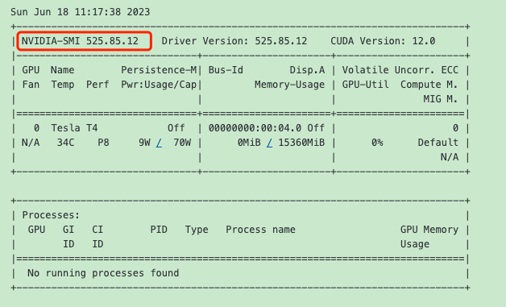

## Step1 先查看是否 运行在GPU环境

```python
# !/usr/local/cuda/bin/nvcc --version
# Check graphics card
!nvidia-smi
```

如果运行正常，会显示如下：




## Step2 拉代码和安装依赖

```python
!pip install pyworld==0.3.2
!pip install numpy==1.23.5
```

正常如下：

Looking in indexes: https://pypi.org/simple, https://us-python.pkg.dev/colab-wheels/public/simple/ 
Requirement already satisfied: pyworld==0.3.2 in [/usr/local/lib/python3.10/dist-packages](https://file+.vscode-resource.vscode-cdn.net/usr/local/lib/python3.10/dist-packages) (0.3.2) 

Requirement already satisfied: numpy in [/usr/local/lib/python3.10/dist-packages](https://file+.vscode-resource.vscode-cdn.net/usr/local/lib/python3.10/dist-packages) (from pyworld==0.3.2) (1.23.5) 

Requirement already satisfied: cython in [/usr/local/lib/python3.10/dist-packages](https://file+.vscode-resource.vscode-cdn.net/usr/local/lib/python3.10/dist-packages) (from pyworld==0.3.2) (0.29.34) 

Looking in indexes: https://pypi.org/simple, https://us-python.pkg.dev/colab-wheels/public/simple/ 

Requirement already satisfied: numpy==1.23.5 in [/usr/local/lib/python3.10/dist-packages](https://file+.vscode-resource.vscode-cdn.net/usr/local/lib/python3.10/dist-packages) (1.23.5)


```python
import os
import glob
!git clone https://github.com/effusiveperiscope/so-vits-svc -b eff-4.0
os.chdir('/content/so-vits-svc')
# install requirements one-at-a-time to ignore exceptions
!cat requirements.txt | xargs -n 1 pip install --extra-index-url https://download.pytorch.org/whl/cu117
!pip install praat-parselmouth
!pip install ipywidgets
!pip install huggingface_hub
!pip install pip==23.0.1 # fix pip version for fairseq install
!pip install fairseq==0.12.2
!jupyter nbextension enable --py widgetsnbextension
existing_files = glob.glob('/content/**/*.*', recursive=True)
!pip install --upgrade protobuf==3.9.2
!pip uninstall -y tensorflow
!pip install tensorflow==2.11.0
```

```python
os.chdir('/content/so-vits-svc') # force working-directory to so-vits-svc - this line is just for safety and is probably not required

import tarfile
import os
from zipfile import ZipFile
# taken from https://github.com/CookiePPP/cookietts/blob/master/CookieTTS/utils/dataset/extract_unknown.py
def extract(path):
    if path.endswith(".zip"):
        with ZipFile(path, 'r') as zipObj:
           zipObj.extractall(os.path.split(path)[0])
    elif path.endswith(".tar.bz2"):
        tar = tarfile.open(path, "r:bz2")
        tar.extractall(os.path.split(path)[0])
        tar.close()
    elif path.endswith(".tar.gz"):
        tar = tarfile.open(path, "r:gz")
        tar.extractall(os.path.split(path)[0])
        tar.close()
    elif path.endswith(".tar"):
        tar = tarfile.open(path, "r:")
        tar.extractall(os.path.split(path)[0])
        tar.close()
    elif path.endswith(".7z"):
        import py7zr
        archive = py7zr.SevenZipFile(path, mode='r')
        archive.extractall(path=os.path.split(path)[0])
        archive.close()
    else:
        raise NotImplementedError(f"{path} extension not implemented.")

# taken from https://github.com/CookiePPP/cookietts/tree/master/CookieTTS/_0_download/scripts

# megatools download urls
win64_url = "https://megatools.megous.com/builds/builds/megatools-1.11.1.20230212-win64.zip"
win32_url = "https://megatools.megous.com/builds/builds/megatools-1.11.1.20230212-win32.zip"
linux_url = "https://megatools.megous.com/builds/builds/megatools-1.11.1.20230212-linux-x86_64.tar.gz"
# download megatools
from sys import platform
import os
import urllib.request
import subprocess
from time import sleep

if platform == "linux" or platform == "linux2":
        dl_url = linux_url
elif platform == "darwin":
    raise NotImplementedError('MacOS not supported.')
elif platform == "win32":
        dl_url = win64_url
else:
    raise NotImplementedError ('Unknown Operating System.')

dlname = dl_url.split("/")[-1]
if dlname.endswith(".zip"):
    binary_folder = dlname[:-4] # remove .zip
elif dlname.endswith(".tar.gz"):
    binary_folder = dlname[:-7] # remove .tar.gz
else:
    raise NameError('downloaded megatools has unknown archive file extension!')

if not os.path.exists(binary_folder):
    print('"megatools" not found. Downloading...')
    if not os.path.exists(dlname):
        urllib.request.urlretrieve(dl_url, dlname)
    assert os.path.exists(dlname), 'failed to download.'
    extract(dlname)
    sleep(0.10)
    os.unlink(dlname)
    print("Done!")


binary_folder = os.path.abspath(binary_folder)

def megadown(download_link, filename='.', verbose=False):
    """Use megatools binary executable to download files and folders from MEGA.nz ."""
    filename = ' --path "'+os.path.abspath(filename)+'"' if filename else ""
    wd_old = os.getcwd()
    os.chdir(binary_folder)
    try:
        if platform == "linux" or platform == "linux2":
            subprocess.call(f'./megatools dl{filename}{" --debug http" if verbose else ""} {download_link}', shell=True)
        elif platform == "win32":
            subprocess.call(f'megatools.exe dl{filename}{" --debug http" if verbose else ""} {download_link}', shell=True)
    except:
        os.chdir(wd_old) # don't let user stop download without going back to correct directory first
        raise
    os.chdir(wd_old)
    return filename

import urllib.request
from tqdm import tqdm
import gdown
from os.path import exists

def request_url_with_progress_bar(url, filename):
    class DownloadProgressBar(tqdm):
        def update_to(self, b=1, bsize=1, tsize=None):
            if tsize is not None:
                self.total = tsize
            self.update(b * bsize - self.n)

    def download_url(url, filename):
        with DownloadProgressBar(unit='B', unit_scale=True,
                                 miniters=1, desc=url.split('/')[-1]) as t:
            filename, headers = urllib.request.urlretrieve(url, filename=filename, reporthook=t.update_to)
            print("Downloaded to "+filename)
    download_url(url, filename)


def download(urls, dataset='', filenames=None, force_dl=False, username='', password='', auth_needed=False):
    assert filenames is None or len(urls) == len(filenames), f"number of urls does not match filenames. Expected {len(filenames)} urls, containing the files listed below.\n{filenames}"
    assert not auth_needed or (len(username) and len(password)), f"username and password needed for {dataset} Dataset"
    if filenames is None:
        filenames = [None,]*len(urls)
    for i, (url, filename) in enumerate(zip(urls, filenames)):
        print(f"Downloading File from {url}")
        #if filename is None:
        #    filename = url.split("/")[-1]
        if filename and (not force_dl) and exists(filename):
            print(f"{filename} Already Exists, Skipping.")
            continue
        if 'drive.google.com' in url:
            assert 'https://drive.google.com/uc?id=' in url, 'Google Drive links should follow the format "https://drive.google.com/uc?id=1eQAnaoDBGQZldPVk-nzgYzRbcPSmnpv6".\nWhere id=XXXXXXXXXXXXXXXXX is the Google Drive Share ID.'
            gdown.download(url, filename, quiet=False)
        elif 'mega.nz' in url:
            megadown(url, filename)
        else:
            #urllib.request.urlretrieve(url, filename=filename) # no progress bar
            request_url_with_progress_bar(url, filename) # with progress bar

import huggingface_hub
import os
import shutil

class HFModels:
    def __init__(self, repo = "therealvul/so-vits-svc-4.0",
            model_dir = "hf_vul_models"):
        self.model_repo = huggingface_hub.Repository(local_dir=model_dir,
            clone_from=repo, skip_lfs_files=True)
        self.repo = repo
        self.model_dir = model_dir

        self.model_folders = os.listdir(model_dir)
        self.model_folders.remove('.git')
        self.model_folders.remove('.gitattributes')

    def list_models(self):
        return self.model_folders

    # Downloads model;
    # copies config to target_dir and moves model to target_dir
    def download_model(self, model_name, target_dir):
        if not model_name in self.model_folders:
            raise Exception(model_name + " not found")
        model_dir = self.model_dir
        charpath = os.path.join(model_dir,model_name)

        gen_pt = next(x for x in os.listdir(charpath) if x.startswith("G_"))
        cfg = next(x for x in os.listdir(charpath) if x.endswith("json"))
        try:
          clust = next(x for x in os.listdir(charpath) if x.endswith("pt"))
        except StopIteration as e:
          print("Note - no cluster model for "+model_name)
          clust = None

        if not os.path.exists(target_dir):
            os.makedirs(target_dir, exist_ok=True)

        gen_dir = huggingface_hub.hf_hub_download(repo_id = self.repo,
            filename = model_name + "/" + gen_pt) # this is a symlink

        if clust is not None:
          clust_dir = huggingface_hub.hf_hub_download(repo_id = self.repo,
              filename = model_name + "/" + clust) # this is a symlink
          shutil.move(os.path.realpath(clust_dir), os.path.join(target_dir, clust))
          clust_out = os.path.join(target_dir, clust)
        else:
          clust_out = None

        shutil.copy(os.path.join(charpath,cfg),os.path.join(target_dir, cfg))
        shutil.move(os.path.realpath(gen_dir), os.path.join(target_dir, gen_pt))

        return {"config_path": os.path.join(target_dir,cfg),
            "generator_path": os.path.join(target_dir,gen_pt),
            "cluster_path": clust_out}

# Example usage
# vul_models = HFModels()
# print(vul_models.list_models())
# print("Applejack (singing)" in vul_models.list_models())
# vul_models.download_model("Applejack (singing)","models/Applejack (singing)")

    print("Finished!")
```


## Step3 加载Google Drive，拷贝资源

一般Sovits每次checkpoints的模型大约在1G左右。

```python
#@title Mount google drive
#@markdown Mount google drive, which will be used to hold your dataset files.
from google.colab import drive
drive.mount('/content/drive')
```

会弹框让登录和授权，正常如下：

Mounted at [/content/drive](https://file+.vscode-resource.vscode-cdn.net/content/drive)


拷贝资源，如下代码视实际情况打开注释运行。把模型的.pth和.json文件拷贝到Sovits的工作目录/content/so-vits-svc/models/。按歌手名字区分好。

```python
!pwd
# !mkdir /content/so-vits-svc/models
!ls /content/so-vits-svc/models
# !mkdir /content/so-vits-svc/models/trump
# !mkdir /content/so-vits-svc/models/chestnut

# # !ls
# !ls /content/drive/MyDrive/sovits4data/logs/44k/trump
# !cp /content/drive/MyDrive/sovits4data/logs/44k/trump/config.json /content/so-vits-svc/models/trump/config.json
# !cp /content/drive/MyDrive/sovits4data/logs/44k/trump/G_18500.pth /content/so-vits-svc/models/trump/G_18500.pth

# !ls /content/drive/MyDrive/sovits4data/logs/44k/sunyanzi
# !cp /content/drive/MyDrive/sovits4data/logs/44k/sunyanzi/sunyanzi_27200_config.json /content/so-vits-svc/models/sunyanzi/config.json
# !cp /content/drive/MyDrive/sovits4data/logs/44k/sunyanzi/G_sunyanzi_27200.pth /content/so-vits-svc/models/sunyanzi/G_sunyanzi_27200.pth
# !cp /content/drive/MyDrive/sovits4data/logs/44k/sunyanzi/sunyanzi_27200_kmeans_10000.pt /content/so-vits-svc/models/sunyanzi/sunyanzi_27200_kmeans_10000.pt

!ls /content/drive/MyDrive/sovits4data/logs/44k/chestnut
# !cp /content/drive/MyDrive/sovits4data/logs/44k/chestnut/config.json /content/so-vits-svc/models/chestnut/config.json
!cp /content/drive/MyDrive/sovits4data/logs/44k/chestnut/G_4000.pth /content/so-vits-svc/models/chestnut/G_4000.pth

# !cp /content/drive/MyDrive/sovits4data/raw/cjhyy.wav /content/cjhyy.wav
# !cp /content/drive/MyDrive/sovits4data/raw/qpy.wav /content/qpy.wav

# !ls /content/so-vits-svc/models/trump
!ls /content/so-vits-svc/models/chestnut
# !ls /content
```


```python
#@title Setup 2 (just run this once)
import os
os.chdir('/content/so-vits-svc') # force working-directory to so-vits-svc - this line is just for safety and is probably not required

from zipfile import ZipFile
from pathlib import Path
import tarfile
import gdown
import urllib
import os
import subprocess
from tqdm import tqdm

class DownloadProgressBar(tqdm):
    def update_to(self, b=1, bsize=1, tsize=None):
        if tsize is not None:
            self.total = tsize
        self.update(b * bsize - self.n)

class Downloader2:
    LINUX_MEGATOOLS_URL = ("https://megatools.megous.com/builds/builds/"
        "megatools-1.11.1.20230212-linux-x86_64.tar.gz")
    def __init__(self):
        self.mega_setup()
        pass

    def mega_setup(self):
        MEGATOOLS_TAR_PATH = Downloader2.LINUX_MEGATOOLS_URL.split("/")[-1]
        MEGATOOLS_FOLDER_PATH = (
            Downloader2.LINUX_MEGATOOLS_URL.split("/")[-1].removesuffix(
                ".tar.gz"))
        self.abs_megatools_path = os.path.abspath(MEGATOOLS_FOLDER_PATH)

        urllib.request.urlretrieve(
            url=Downloader2.LINUX_MEGATOOLS_URL,
            filename=MEGATOOLS_TAR_PATH)
        with tarfile.open(MEGATOOLS_TAR_PATH) as tar:
            tar.extractall()
            tar.close()
        os.unlink(MEGATOOLS_TAR_PATH)
        assert os.path.exists(self.abs_megatools_path)

        pass

    def megadown(self, url, filename):
        cmd = (os.path.join(self.abs_megatools_path,'megatools')+
            " dl "+"--print-names "+(
            "--path "+filename+" " if filename else "")+url)
        proc = subprocess.run(cmd, shell=True)
        if proc.returncode != 0:
            raise Exception('megadown failed -- cmd: '+cmd)
        return filename

    def request_url_with_progress_bar(self, url, filename):
        def download_url(url, filename):
            with DownloadProgressBar(unit='B', unit_scale=True,
                miniters=1, desc=url.split('/')[-1]) as t:
                return urllib.request.urlretrieve(
                    url, filename=filename, reporthook=t.update_to)
        return download_url(url, filename)

    def download(self, url, filename):
        if "drive.google.com" in url:
            print("Downloading Google Drive file "+url)
            return gdown.download(url, filename, quiet=False, fuzzy=True)
        elif "mega.nz" in url:
            print("Downloading MEGA file "+url)
            # There is no other way to determine the file name
            # from megatools prior to downloading without authentication
            # so we set it to a placeholder
            import uuid
            return self.megadown(url, filename=str(uuid.uuid4())+".zip")
        else:
            print("Downloading direct "+url)
            local_filename, headers = (
                self.request_url_with_progress_bar(url, filename))
            return local_filename


import fnmatch
def default_next(x):
    try:
        return next(x)
    except StopIteration:
        return None

def zip_extract(zipfile, model_dir):
    model_folder_name = Path(zipfile).stem
    model_folder_path = os.path.join(model_dir,
        Path(zipfile).stem)
    with ZipFile(zipfile, 'r') as f:
        member_infos = f.infolist()
        generator = default_next(
            x for x in member_infos if fnmatch.fnmatch(x.filename, '*G_*.pth'))
        config_json = default_next(
            x for x in member_infos if fnmatch.fnmatch(x.filename, '*.json'))
        cluster_pt = default_next(
            x for x in member_infos if fnmatch.fnmatch(x.filename, '*.pt'))

        generator.filename = generator.filename.split('/')[-1]
        config_json.filename = config_json.filename.split('/')[-1]

        if (not generator):
            print("Could not find G_*.pth in "+zipfile)
            return
        if (not config_json):
            print("Could not find config.json in "+zipfile)
            return
        f.extract(generator, path=model_folder_path)
        f.extract(config_json, path=model_folder_path)

        if cluster_pt:
            cluster_pt.filename = cluster_pt.filename.split('/')[-1]
            f.extract(cluster_pt, path=model_folder_path)
    print("Cleaning "+zipfile)
    os.remove(zipfile)

import huggingface_hub
import os
import shutil

class HFModels:
    def __init__(self, repo = "therealvul/so-vits-svc-4.0",
            model_dir = "hf_vul_models"):
        self.model_repo = huggingface_hub.Repository(local_dir=model_dir,
            clone_from=repo, skip_lfs_files=True)
        self.repo = repo
        self.model_dir = model_dir

        self.model_folders = sorted(os.listdir(model_dir))
        print(self.model_folders)
        self.model_folders.remove('.git')
        self.model_folders.remove('.gitattributes')

    def list_models(self):
        return self.model_folders

    # Downloads model;
    # copies config to target_dir and moves model to target_dir
    def download_model(self, model_name, target_dir):
        if not model_name in self.model_folders:
            raise Exception(model_name + " not found")
        model_dir = self.model_dir
        charpath = os.path.join(model_dir,model_name)

        gen_pt = next(x for x in os.listdir(charpath) if x.startswith("G_"))
        cfg = next(x for x in os.listdir(charpath) if x.endswith("json"))
        try:
          clust = next(x for x in os.listdir(charpath) if x.endswith("pt"))
        except StopIteration as e:
          print("Note - no cluster model for "+model_name)
          clust = None

        if not os.path.exists(target_dir):
            os.makedirs(target_dir, exist_ok=True)

        gen_dir = huggingface_hub.hf_hub_download(repo_id = self.repo,
            filename = model_name + "/" + gen_pt) # this is a symlink

        if clust is not None:
          clust_dir = huggingface_hub.hf_hub_download(repo_id = self.repo,
              filename = model_name + "/" + clust) # this is a symlink
          shutil.move(os.path.realpath(clust_dir), os.path.join(target_dir, clust))
          clust_out = os.path.join(target_dir, clust)
        else:
          clust_out = None

        shutil.copy(os.path.join(charpath,cfg),os.path.join(target_dir, cfg))
        shutil.move(os.path.realpath(gen_dir), os.path.join(target_dir, gen_pt))

        return {"config_path": os.path.join(target_dir,cfg),
            "generator_path": os.path.join(target_dir,gen_pt),
            "cluster_path": clust_out}

# Example usage
# vul_models = HFModels()
# print(vul_models.list_models())
# print("Applejack (singing)" in vul_models.list_models())
# vul_models.download_model("Applejack (singing)","models/Applejack (singing)")
downloader = Downloader2()
print("Finished!")
```

用上面下载的downloader下载如下checkpoint

```python
#@title Download ContentVec (just run this once)
os.chdir('/content/so-vits-svc') # force working-directory to so-vits-svc - this line is just for safety and is probably not required
downloader.download("https://huggingface.co/therealvul/so-vits-svc-4.0-init/resolve/main/checkpoint_best_legacy_500.pt", filename="hubert/checkpoint_best_legacy_500.pt")
```


## Step4 进行推理

这里会弹出个网页交互，如果前面步骤路径正确，就可以选择模型，然后会遍历Google Drive里的所有歌曲进行推理。

```python
import os
import glob
import json
import copy
import logging
import io
from ipywidgets import widgets
from pathlib import Path
from IPython.display import Audio, display

os.chdir('/content/so-vits-svc')

import torch
from inference import infer_tool
from inference import slicer
from inference.infer_tool import Svc
import soundfile
import numpy as np

MODELS_DIR = "models"

def get_speakers():
  speakers = []
  for _,dirs,_ in os.walk(MODELS_DIR):
    print("Step 2: ");
    for folder in dirs:
      print("now searching in folder: " + folder);
      cur_speaker = {}
      # Look for G_****.pth
      g = glob.glob(os.path.join(MODELS_DIR,folder,'G_*.pth'))
      if not len(g):
        print("Skipping "+folder+", no G_*.pth")
        continue
      else:
        print("Got " + folder + ".pth");
      cur_speaker["model_path"] = g[0]
      cur_speaker["model_folder"] = folder

      # Look for *.pt (clustering model)
      clst = glob.glob(os.path.join(MODELS_DIR,folder,'*.pt'))
      if not len(clst):
        print("Note: No clustering model found for "+folder)
        cur_speaker["cluster_path"] = ""
      else:
        cur_speaker["cluster_path"] = clst[0]

      # Look for config.json
      cfg = glob.glob(os.path.join(MODELS_DIR,folder,'*.json'))
      if not len(cfg):
        print("Skipping "+folder+", no config json")
        continue
      cur_speaker["cfg_path"] = cfg[0]
      with open(cur_speaker["cfg_path"]) as f:
        try:
          cfg_json = json.loads(f.read())
        except Exception as e:
          print("Malformed config json in "+folder)
        for name, i in cfg_json["spk"].items():
          cur_speaker["name"] = name
          cur_speaker["id"] = i
          if not name.startswith('.'):
            speakers.append(copy.copy(cur_speaker))

    return sorted(speakers, key=lambda x:x["name"].lower())

logging.getLogger('numba').setLevel(logging.WARNING)
chunks_dict = infer_tool.read_temp("inference/chunks_temp.json")
existing_files = []
slice_db = -40
wav_format = 'wav'

class InferenceGui():
  def __init__(self):
    self.speakers = get_speakers()
    self.speaker_list = [x["name"] for x in self.speakers]
    self.speaker_box = widgets.Dropdown(
        options = self.speaker_list
    )
    display(self.speaker_box)

    def convert_cb(btn):
      self.convert()
    def clean_cb(btn):
      self.clean()

    self.convert_btn = widgets.Button(description="Convert")
    self.convert_btn.on_click(convert_cb)
    self.clean_btn = widgets.Button(description="Delete all audio files")
    self.clean_btn.on_click(clean_cb)

    self.trans_tx = widgets.IntText(value=0, description='Transpose')
    self.cluster_ratio_tx = widgets.FloatText(value=0.0,
      description='Clustering Ratio')
    self.noise_scale_tx = widgets.FloatText(value=0.4,
      description='Noise Scale')
    self.auto_pitch_ck = widgets.Checkbox(value=False, description=
      'Auto pitch f0 (do not use for singing)')

    display(self.trans_tx)
    display(self.cluster_ratio_tx)
    display(self.noise_scale_tx)
    display(self.auto_pitch_ck)
    display(self.convert_btn)
    display(self.clean_btn)

  def convert(self):
    trans = int(self.trans_tx.value)
    speaker = next(x for x in self.speakers if x["name"] ==
          self.speaker_box.value)
    spkpth2 = os.path.join(os.getcwd(),speaker["model_path"])
    print(spkpth2)
    print(os.path.exists(spkpth2))

    svc_model = Svc(speaker["model_path"], speaker["cfg_path"],
      cluster_model_path=speaker["cluster_path"])

    input_filepaths = [f for f in glob.glob('/content/**/*.*', recursive=True)
     if f not in existing_files and
     any(f.endswith(ex) for ex in ['.wav','.flac','.mp3','.ogg','.opus'])]
    for name in input_filepaths:
      print("Converting "+os.path.split(name)[-1])
      infer_tool.format_wav(name)

      wav_path = str(Path(name).with_suffix('.wav'))
      wav_name = Path(name).stem
      chunks = slicer.cut(wav_path, db_thresh=slice_db)
      audio_data, audio_sr = slicer.chunks2audio(wav_path, chunks)

      audio = []
      for (slice_tag, data) in audio_data:
          print(f'#=====segment start, '
              f'{round(len(data)/audio_sr, 3)}s======')

          length = int(np.ceil(len(data) / audio_sr *
              svc_model.target_sample))

          if slice_tag:
              print('jump empty segment')
              _audio = np.zeros(length)
          else:
              # Padding "fix" for noise
              pad_len = int(audio_sr * 0.5)
              data = np.concatenate([np.zeros([pad_len]),
                  data, np.zeros([pad_len])])
              raw_path = io.BytesIO()
              soundfile.write(raw_path, data, audio_sr, format="wav")
              raw_path.seek(0)
              _cluster_ratio = 0.0
              if speaker["cluster_path"] != "":
                _cluster_ratio = float(self.cluster_ratio_tx.value)
              out_audio, out_sr = svc_model.infer(
                  speaker["name"], trans, raw_path,
                  cluster_infer_ratio = _cluster_ratio,
                  auto_predict_f0 = bool(self.auto_pitch_ck.value),
                  noice_scale = float(self.noise_scale_tx.value))
              _audio = out_audio.cpu().numpy()
              pad_len = int(svc_model.target_sample * 0.5)
              _audio = _audio[pad_len:-pad_len]
          audio.extend(list(infer_tool.pad_array(_audio, length)))

      res_path = os.path.join('/content/',
          f'{wav_name}_{trans}_key_'
          f'{speaker["name"]}.{wav_format}')
      soundfile.write(res_path, audio, svc_model.target_sample,
          format=wav_format)
      display(Audio(res_path, autoplay=True)) # display audio file
    pass

  def clean(self):
     input_filepaths = [f for f in glob.glob('/content/**/*.*', recursive=True)
     if f not in existing_files and
     any(f.endswith(ex) for ex in ['.wav','.flac','.mp3','.ogg','.opus'])]
     for f in input_filepaths:
       os.remove(f)

inference_gui = InferenceGui()
```


注意推理的音乐，最好选用不超过3分钟的。超时的可能导致推理卡主，而且关掉后无法继续，只能重连Colab。