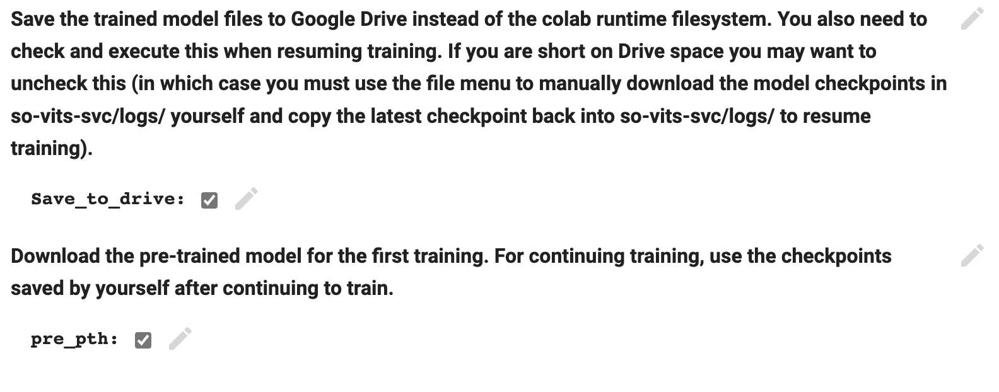

## Step1 检查环境

```python
# Check graphics card
!nvidia-smi
```


#### Clone github repo

```python
#@title Clone github repo
!git clone https://github.com/effusiveperiscope/so-vits-svc -b eff-4.0
```


#### Install dependencies

```PYTHON
#@title Install dependencies
%cd /content/so-vits-svc
!python -m pip install --upgrade pip setuptools numpy numba
!pip install pyworld==0.3.1 praat-parselmouth
!pip install fairseq==0.12.2 librosa==0.8.1
!pip install torchcrepe tensorboardX
```

如果出现如下

ERROR: pip's dependency resolver does not currently take into account all the packages that are installed. This behaviour is the source of the following dependency conflicts. tensorflow 2.12.0 requires numpy<1.24,>=1.22, but you have numpy 1.24.4 which is incompatible.

报错，可以重新运行一下。


## Step2 下载必要资源，加载数据

#### Download ContentVec model file

```python
#@title Download ContentVec model file
!wget -P hubert/ https://huggingface.co/therealvul/so-vits-svc-4.0-init/resolve/main/checkpoint_best_legacy_500.pt
```

正常情况下输出如下日志：


## Step3 Dataset preprocessing

#### Mount google drive

```python
#@title Mount google drive
#@markdown Mount google drive, which will be used to hold your dataset files.
from google.colab import drive
drive.mount('/content/drive')
```

```
This processing script can preprocess multiple speakers at one time and generate multi-speaker filelists and corresponding configuration files.

First, create a folder in your Google Drive called "dataset" (no quotes).

Then, for each character you intend to train, upload the training data to Google Drive in the form of a .zip enclosing your speaker dataset (i.e. the .zip should enclose folders containing .wav files for each speaker).

Use the dialog below to load the dataset from Google Drive.
```


#### Load the dataset from .zip in Google Drive for preprocessing

```
#@title Load the dataset from .zip in Google Drive for preprocessing
#@markdown Name of the zip folder
DATASETNAME = "AvaDe"  #@param {type:"string"}
#@markdown Zip path (usually do not need to change this unless you uploaded to a different directory)
ZIP_PATH = "/content/drive/MyDrive/dataset/"  #@param {type:"string"}
ZIP_NAME = ZIP_PATH + DATASETNAME

!unzip -d /content/so-vits-svc/dataset_raw {ZIP_NAME}.zip
```

加载打包好的wav声音资源。示例用的是AvaDe.zip。放在GoogleDrive的/content/drive/MyDrive/dataset/目录下。

声音可以用ffmpeg批量转成wav格式，单声道，批量降噪。在Mac上做成zip包时需要用一个文件夹来压缩，不能直接选取多个wav文件压缩成.zip包。我也不知道为什么后者会各种报错。

部分声音或多出一个解压路径，不清楚原因，但不影响。

  inflating: /content/so-vits-svc/dataset_raw/AvaDe/1001001.wav   

 inflating: /content/so-vits-svc/dataset_raw/AvaDe/zsjnmdr002.wav    

inflating: /content/so-vits-svc/dataset_raw/AvaDe/1001000.wav    

inflating: /content/so-vits-svc/dataset_raw/__MACOSX/AvaDe/._1001000.wav  

mac本地批量降噪：

```shell
#!/bin/bash

input_dir="/Users/jian.deng/Github/AI/VoiceForTraining/AvaMono"
output_dir="/Users/jian.deng/Github/AI/VoiceForTraining/AvaDenoise"

# 遍历输入目录下的所有音频文件
for file in "$input_dir"/*.wav; do
    # 获取文件名和扩展名
    filename=$(basename "$file")
    extension="${filename##*.}"
    filename="${filename%.*}"

    # 构建输出文件路径
    output_file="$output_dir/$filename"."$extension"

    # 使用FFmpeg应用降噪滤波器
    ffmpeg -i "$file" -af "afftdn" "$output_file"
done

```

mac本地转成单声道

```shell
#!/bin/bash

input_dir="/Users/jian.deng/Github/AI/VoiceForTraining/Ava"
output_dir="/Users/jian.deng/Github/AI/VoiceForTraining/AvaMono"

# 遍历输入目录下的所有音频文件
for file in "$input_dir"/*.wav; do
    # 获取文件名和扩展名
    filename=$(basename "$file")
    extension="${filename##*.}"
    filename="${filename%.*}"

    # 构建输出文件路径
    output_file="$output_dir/$filename"_mono."$extension"

    # 使用FFmpeg将音频文件转换为单声道
    ffmpeg -i "$file" -ac 1 "$output_file"
done

```

mp3批量转wav

```shell
for file in *.mp3; do
  ffmpeg -i "$file" "${file%.mp3}.wav"
done
```


#### Resample to 44.1k

```
#@title Resample to 44.1k
!python resample.py
```

正常的话输出如下日志：

./dataset_raw/AvaDe 123it [00:01, 106.28it/s] 

./dataset_raw/__MACOSX 0it [00:00, ?it/s]

如果音频 有问题，在这一步可能报错。


#### Segment training set and generate configuration files

```
#@title Segment training set and generate configuration files
!python preprocess_flist_config.py
```


### Generate hubert and f0

```python
#@title Generate hubert and f0
!python preprocess_hubert_f0.py
```

正常的话会输出如下日志：


#### Save preprocessed dataset files to Google Drive (for training convenience)

```python
#@title Save preprocessed dataset files to Google Drive (for training convenience)
#Compress dataset folder
!zip -r dataset.zip /content/so-vits-svc/dataset
#@markdown Customize name of preprocessed dataset folder to avoid conflicts.
dataset_name_drive = "44k_dataset"  #@param {type:"string"}
DATASET_PATH_DRIVE = "/content/drive/MyDrive/dataset/" + dataset_name_drive
!mkdir -p {DATASET_PATH_DRIVE}

!cp /content/so-vits-svc/dataset.zip "{DATASET_PATH_DRIVE}"
!cp configs/config.json "{DATASET_PATH_DRIVE}"
!cp filelists/train.txt "{DATASET_PATH_DRIVE}"
!cp filelists/val.txt "{DATASET_PATH_DRIVE}"
```


#### Load preprocessed dataset files from Google Drive (no need to run first round)

```python
#@title Load preprocessed dataset files from Google Drive (no need to run first round)
#@markdown If you already have preprocessed dataset files on Google Drive, you can load them here instead of re-running the preprocessing steps.
back_up_name = "44k_dataset"  #@param {type:"string"}
BACK_UP_DATASET_PATH = "/content/drive/MyDrive/dataset/" + back_up_name
!unzip {BACK_UP_DATASET_PATH}/dataset.zip -d /
!cp {BACK_UP_DATASET_PATH}/config.json /content/so-vits-svc/configs/config.json 
!cp {BACK_UP_DATASET_PATH}/val.txt filelists/val.txt
!cp {BACK_UP_DATASET_PATH}/train.txt filelists/train.txt
```


## Step4 Training

#### Model saving/pretrained model preferences

```python
#@title  Model saving/pretrained model preferences
Clone = "44k"
%cd /content/so-vits-svc

#@markdown **Save the trained model files to Google Drive instead of the colab runtime filesystem. You also need to check and execute this when resuming training. If you are short on Drive space you may want to uncheck this (in which case you must use the file menu to manually download the model checkpoints in so-vits-svc/logs/ yourself and copy the latest checkpoint back into so-vits-svc/logs/ to resume training).**
Save_to_drive = True #@param {type:"boolean"}
if Save_to_drive:
  !rm -rf /content/so-vits-svc/logs/"{Clone}"
  !mkdir -p /content/drive/MyDrive/"{Clone}"
  !ln -s /content/drive/MyDrive/"{Clone}" /content/so-vits-svc/logs/"{Clone}"

#@markdown **Download the pre-trained model for the first training. For continuing training, use the checkpoints saved by yourself after continuing to train.**
pre_pth = True #@param {type:"boolean"}
if pre_pth:
  !wget -O logs/"{Clone}"/G_0.pth -P logs/"{Clone}"/ https://huggingface.co/therealvul/so-vits-svc-4.0-init/resolve/main/G_0.pth
  !wget -O logs/"{Clone}"/D_0.pth -P logs/"{Clone}"/ https://huggingface.co/therealvul/so-vits-svc-4.0-init/resolve/main/D_0.pth

```

这里要勾选Save_to_drive。这样会把sovits的工作目录映射一份到GoogleDrive，这样自动保存的checkpoint到GoogleDrive。



#### Start training

```
#@title  Start training
#@markdown **Start training**
Clone = "44k"

#@markdown **Enable tensorboard for data visualization**
tensorboard_on = True #@param {type:"boolean"}
if tensorboard_on:
  %load_ext tensorboard
  %tensorboard --logdir logs/"{Clone}"

!python train.py -c configs/config.json -m "{Clone}"

```

炼丹过程日志如下：


Epoch次数和checkpoint的迭代次数不对应。音频资源好的话，每50次Epoch就出1000的checkpoint，两天就能练一个不错的。

Losses值这个有好几个值，不知道分别对应哪些损失函数。


## 多个Google账号共享接力训练

把44k和dataset这两个目录共享。其他账号拿到共享后选择右键->Add Shortcut to Drive。下次训练的时候选择对应的目录就可以继续训练。


### 防掐断


```python
import time
import pyautogui

# 循环执行点击操作
while True:
    # 获取当前鼠标位置
    x, y = pyautogui.position()

    # 输出当前鼠标位置
    print(f"当前鼠标位置：({x}, {y})")

    # 模拟点击鼠标左键
    pyautogui.click()

    # 等待5分钟
    time.sleep(30)
```


