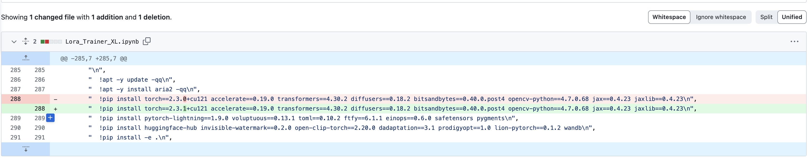

### [kohya-colab](https://github.com/hollowstrawberry/kohya-colab) XL Lora training 在Colab 7月18日左右报错

https://github.com/hollowstrawberry/kohya-colab/issues/175

output error: "ModuleNotFoundError: No module named 'accelerate'" since today, if I "!pip install accelerate" on colab and run, it will output error: "ImportError: huggingface-hub>=0.23.2,<1.0 is required for a normal functioning of this module, but found huggingface-hub==0.23.0.
Try: `pip install transformers -U` or `pip install -e '.[dev]'` if you're working with git main"


版本更新改动如下后修复：

"  !pip install torch==2.3.0+cu121 accelerate==0.19.0 transformers==4.30.2 diffusers==0.18.2 bitsandbytes==0.40.0.post4 opencv-python==4.7.0.68 jax==0.4.23 jaxlib==0.4.23\n",

更新为：

"  !pip install torch==2.3.1+cu121 accelerate==0.19.0 transformers==4.30.2 diffusers==0.18.2 bitsandbytes==0.40.0.post4 opencv-python==4.7.0.68 jax==0.4.23 jaxlib==0.4.23\n",




训练脚本如下：

```python
import os
import re
import toml
from time import time
from huggingface_hub import HfFileSystem
from IPython.display import Markdown, display

# These carry information from past executions
if "model_url" in globals():
  old_model_url = model_url
else:
  old_model_url = None
if "dependencies_installed" not in globals():
  dependencies_installed = False
if "model_file" not in globals():
  model_file = None

# These may be set by other cells, some are legacy
if "custom_dataset" not in globals():
  custom_dataset = None
if "override_dataset_config_file" not in globals():
  override_dataset_config_file = None
if "override_config_file" not in globals():
  override_config_file = None

COLAB = True
SOURCE = "https://github.com/qaneel/kohya-trainer"
COMMIT = None
BETTER_EPOCH_NAMES = True
LOAD_TRUNCATED_IMAGES = True
try:
  LOWRAM = int(next(line.split()[1] for line in open('/proc/meminfo') if "MemTotal" in line)) / (1024**2) < 15
except:
  LOWRAM = False

#@title ## 🚩 Start Here

#@markdown ### ▶️ Setup
#@markdown Your project name will be the same as the folder containing your images. Spaces aren't allowed.
project_name = "FashionWaterBlackXj" #@param {type:"string"}
project_name = project_name.strip()
#@markdown The folder structure doesn't matter and is purely for comfort. Make sure to always pick the same one. I like organizing by project.
folder_structure = "Organize by project (MyDrive/Loras/project_name/dataset)" #@param ["Organize by category (MyDrive/lora_training/datasets/project_name)", "Organize by project (MyDrive/Loras/project_name/dataset)"]
#@markdown Decide the model that will be downloaded and used for training. You can also choose your own by pasting its download link.
training_model = "Stable Diffusion XL 1.0 base" #@param ["Pony Diffusion V6 XL", "Animagine XL V3", "Stable Diffusion XL 1.0 base"]
optional_custom_training_model_url = "https://liblibai-online.vibrou.com/web/model/4c9b909d157aca02fc635463f1618b2f/024c141c502f29c4d64743385eae5b9e6563c7dd47f71e1dc3db24ea1b3cda7f.safetensors?attname=SDXL%201.0%20ArienMixXL%20%E4%BA%9A%E6%B4%B2%E4%BA%BA%E5%83%8F_V4.5.safetensors" #@param {type:"string"}
#@markdown Using a diffusers model utilizes less resources. The 3 options above will work with or without diffusers.
load_diffusers = True #@param {type:"boolean"}
#@markdown Use wandb if you want to visualize the progress of your training over time.
wandb_key = "" #@param {type:"string"}

if optional_custom_training_model_url:
  model_url = optional_custom_training_model_url
elif "Pony" in training_model:
  if load_diffusers:
    model_url = "https://huggingface.co/hollowstrawberry/67AB2F"
  else:
    model_url = "https://civitai.com/api/download/models/290640"
  model_file = "/content/ponyDiffusionV6XL.safetensors"
elif "Animagine" in training_model:
  if load_diffusers:
    model_url = "https://huggingface.co/cagliostrolab/animagine-xl-3.0"
  else:
    model_url = "https://civitai.com/api/download/models/293564"
  model_file = "/content/animagineXLV3.safetensors"
else:
  if load_diffusers:
    model_url = "https://huggingface.co/stabilityai/stable-diffusion-xl-base-1.0/"
  else:
    model_url = "https://huggingface.co/stabilityai/stable-diffusion-xl-base-1.0/resolve/main/sd_xl_base_1.0.safetensors"

if load_diffusers:
  vae_file= "stabilityai/sdxl-vae"
else:
  vae_url = "https://huggingface.co/stabilityai/sdxl-vae/resolve/main/sdxl_vae.safetensors"
  vae_file = "/content/sdxl_vae.safetensors"


#@markdown ### ▶️ Processing
resolution = 1024 #param {type:"slider", min:768, max:1536, step:128}
caption_extension = ".txt" #param {type:"string"}
#@markdown Shuffling anime tags in place improves learning and prompting. An activation tag goes at the start of every text file and will not be shuffled.<p>
shuffle_tags = True #@param {type:"boolean"}
shuffle_caption = shuffle_tags
activation_tags = "1" #@param [0,1,2,3]
keep_tokens = int(activation_tags)

#@markdown ### ▶️ Steps <p>
#@markdown Your images will repeat this number of times during training. I recommend that your images multiplied by their repeats is between 200 and 400.
num_repeats = 10 #@param {type:"number"}
#@markdown Choose how long you want to train for. A good starting point is around 10 epochs or around 2000 steps.<p>
#@markdown One epoch is a number of steps equal to: your number of images multiplied by their repeats, divided by batch size. <p>
preferred_unit = "Epochs" #@param ["Epochs", "Steps"]
how_many = 20 #@param {type:"number"}
max_train_epochs = how_many if preferred_unit == "Epochs" else None
max_train_steps = how_many if preferred_unit == "Steps" else None
#@markdown Saving more epochs will let you compare your Lora's progress better.
save_every_n_epochs = 5 #@param {type:"number"}
keep_only_last_n_epochs = 10 #@param {type:"number"}
if not save_every_n_epochs:
  save_every_n_epochs = max_train_epochs
if not keep_only_last_n_epochs:
  keep_only_last_n_epochs = max_train_epochs

#@markdown ### ▶️ Learning
#@markdown The learning rate is the most important for your results. If you want to train slower with lots of images, or if your dim and alpha are high, move the unet to 2e-4 or lower. <p>
#@markdown The text encoder helps your Lora learn concepts slightly better. It is recommended to make it half or a fifth of the unet. If you're training a style you can even set it to 0.
unet_lr = 3e-4 #@param {type:"number"}
text_encoder_lr = 6e-5 #@param {type:"number"}
#@markdown The scheduler is the algorithm that guides the learning rate. If you're not sure, pick `constant` and ignore the number. I personally recommend `cosine_with_restarts` with 3 restarts.
lr_scheduler = "cosine_with_restarts" #@param ["constant", "cosine", "cosine_with_restarts", "constant_with_warmup", "linear", "polynomial"]
lr_scheduler_number = 3 #@param {type:"number"}
#@markdown Steps spent "warming up" the learning rate during training for efficiency. I recommend leaving it at 5%.
lr_warmup_ratio = 0.05 #@param {type:"slider", min:0.0, max:0.2, step:0.01}
lr_warmup_steps = 0
#@markdown Adjusts loss over time, makes learning much more efficient. The paper recommends 5.0, I recommend 8.0 for anime. Higher value makes it less strict. Set to 0 to disable.
min_snr_gamma = 8.0 #@param {type:"slider", min:4.0, max:16.0, step:0.5}
#@markdown Multinoise may help with color balance (darker darks, lighter lights).
multinoise = True #@param {type:"boolean"}

#@markdown ### ▶️ Structure
#@markdown LoRA is the classic type and good for a variety of purposes. LoCon is good with artstyles as it has more layers to learn more aspects of the dataset.
lora_type = "LoRA" #@param ["LoRA", "LoCon"]

#@markdown Below are some recommended XL values for the following settings:

#@markdown | type | network_dim | network_alpha | conv_dim | conv_alpha |
#@markdown | :---: | :---: | :---: | :---: | :---: |
#@markdown | Regular LoRA | 8 | 4 |   |   |
#@markdown | Style LoCon | 16 | 8 | 16 | 8 |

#@markdown More dim means larger Lora, it can hold more information but more isn't always better.
network_dim = 8 #@param {type:"slider", min:1, max:32, step:1}
network_alpha = 4 #@param {type:"slider", min:1, max:32, step:1}
#@markdown The following two values only apply to the additional layers of LoCon.
conv_dim = 4 #@param {type:"slider", min:1, max:32, step:1}
conv_alpha = 1 #@param {type:"slider", min:1, max:32, step:1}

network_module = "networks.lora"
network_args = None
if lora_type.lower() == "locon":
  network_args = [f"conv_dim={conv_dim}", f"conv_alpha={conv_alpha}"]

#@markdown ### ▶️ Training
#@markdown Adjust these parameters depending on your colab configuration.
#@markdown If you're using the free tier you should select a diffusers model at the top of this cell.
#@markdown
#@markdown Higher batch size is often faster but uses more memory.
train_batch_size = 4 #@param {type:"slider", min:1, max:16, step:1}
#@markdown I have found no substantial difference between sdpa and xformers.
cross_attention = "sdpa" #@param ["sdpa", "xformers"]
#@markdown If you're on an A100 you should enable bf16.
mixed_precision = "fp16" #@param ["bf16", "fp16"]
#@markdown Caching latents to drive will add a 250KB file next to each image but will use considerably less memory.
cache_latents = True #@param {type:"boolean"}
cache_latents_to_drive = True #@param {type:"boolean"}
#@markdown The following option will turn off shuffle_tags and disable text encoder training.
cache_text_encoder_outputs  = False  # @param {type:"boolean"}

#@markdown ### ▶️ Advanced
#@markdown The optimizer is the algorithm used for training. AdanW8Bit is the default and works great, while Prodigy manages learning rate automatically and may have several advantages such as training faster due to needing less steps as well as working better for small datasets.
optimizer = "AdamW8bit" #@param ["AdamW8bit", "Prodigy", "DAdaptation", "DadaptAdam", "DadaptLion", "AdamW", "Lion", "SGDNesterov", "SGDNesterov8bit", "AdaFactor"]
#@markdown Recommended args for AdamW8bit: `weight_decay=0.1 betas=[0.9,0.99]`<p>
#@markdown Recommended args for Prodigy: `decouple=True weight_decay=0.01 betas=[0.9,0.999] d_coef=2 use_bias_correction=True safeguard_warmup=True`<p>
#markdown Recommended args for CAME: `weight_decay=0.04`
optimizer_args = "weight_decay=0.1 betas=[0.9,0.99]" #@param {type:"string"}
optimizer_args = [a.strip() for a in optimizer_args.split(' ') if a]
#@markdown If Dadapt or Prodigy are selected and the recommended box is checked, the following recommended values will override any previous settings:<p>
#@markdown `unet_lr=0.75`, `text_encoder_lr=0.75`, `network_alpha=network_dim`<p>
#markdown If CAME + REX is selected and the recommended box is checked, the following recommended values will override any previous settings:<p>
#markdown `unet_lr=1e-4`, `text_encoder_lr=1e-6, betas=default_came_betas`
recommended_values = True #@param {type:"boolean"}

if any(opt in optimizer.lower() for opt in ["dadapt", "prodigy"]):
  if recommended_values:
    unet_lr = 0.75
    text_encoder_lr = 0.75
    network_alpha = network_dim
elif "CAME" in optimizer:
  optimizer = "CAME"
  lr_scheduler = "REX"
  if recommended_values:
    unet_lr = 1e-4
    text_encoder_lr = 1e-6
    for i in range(len(optimizer_args)):
      if "betas" in optimizer_args[i]:
        optimizer_args.pop(i)
        break

lr_scheduler_num_cycles = lr_scheduler_number if lr_scheduler == "cosine_with_restarts" else 0
lr_scheduler_power = lr_scheduler_number if lr_scheduler == "polynomial" else 0


#@markdown ### ▶️ Ready
#@markdown You can now run this cell to cook your Lora. Good luck! <p>


# 👩‍💻 Cool code goes here

root_dir = "/content" if COLAB else "~/Loras"
deps_dir = os.path.join(root_dir, "deps")
repo_dir = os.path.join(root_dir, "kohya-trainer")

if "/Loras" in folder_structure:
  main_dir      = os.path.join(root_dir, "drive/MyDrive/Loras") if COLAB else root_dir
  log_folder    = os.path.join(main_dir, "_logs")
  config_folder = os.path.join(main_dir, project_name)
  images_folder = os.path.join(main_dir, project_name, "dataset")
  output_folder = os.path.join(main_dir, project_name, "output")
else:
  main_dir      = os.path.join(root_dir, "drive/MyDrive/lora_training") if COLAB else root_dir
  images_folder = os.path.join(main_dir, "datasets", project_name)
  output_folder = os.path.join(main_dir, "output", project_name)
  config_folder = os.path.join(main_dir, "config", project_name)
  log_folder    = os.path.join(main_dir, "log")

config_file = os.path.join(config_folder, "training_config.toml")
dataset_config_file = os.path.join(config_folder, "dataset_config.toml")
accelerate_config_file = os.path.join(repo_dir, "accelerate_config/config.yaml")

def install_dependencies():
  os.chdir(root_dir)
  !git clone {SOURCE} {repo_dir}
  os.chdir(repo_dir)
  if COMMIT:
    !git reset --hard {COMMIT}
  !wget https://raw.githubusercontent.com/hollowstrawberry/kohya-colab/main/train_network_xl_wrapper.py -q -O train_network_xl_wrapper.py
  !wget https://raw.githubusercontent.com/hollowstrawberry/kohya-colab/main/dracula.py -q -O dracula.py

  !apt -y update -qq
  !apt -y install aria2 -qq
  !pip install torch==2.3.1+cu121 accelerate==0.19.0 transformers==4.30.2 diffusers==0.18.2 bitsandbytes==0.40.0.post4 opencv-python==4.7.0.68 jax==0.4.23 jaxlib==0.4.23
  !pip install pytorch-lightning==1.9.0 voluptuous==0.13.1 toml==0.10.2 ftfy==6.1.1 einops==0.6.0 safetensors pygments
  !pip install huggingface-hub==0.23.0 invisible-watermark==0.2.0 open-clip-torch==2.20.0 dadaptation==3.1 prodigyopt==1.0 lion-pytorch==0.1.2 wandb
  !pip install -e .
  if cross_attention == "xformers":
    !pip install -q xformers==0.0.26.dev778
  if "CAME" in optimizer:
    !pip install came-pytorch
    !wget https://raw.githubusercontent.com/hollowstrawberry/kohya-colab/main/train_util.py -q -O library/train_util.py

  # patch kohya for minor stuff
  if LOWRAM:
    !sed -i "s@cpu@cuda@" library/model_util.py
  if LOAD_TRUNCATED_IMAGES:
    !sed -i 's/from PIL import Image/from PIL import Image, ImageFile\nImageFile.LOAD_TRUNCATED_IMAGES=True/g' library/train_util.py # fix truncated jpegs error
  if BETTER_EPOCH_NAMES:
    !sed -i 's/{:06d}/{:02d}/g' library/train_util.py # make epoch names shorter
    !sed -i 's/"." + args.save_model_as)/"-{:02d}.".format(num_train_epochs) + args.save_model_as)/g' train_network.py # name of the last epoch will match the rest

  from accelerate.utils import write_basic_config
  if not os.path.exists(accelerate_config_file):
    write_basic_config(save_location=accelerate_config_file)

  os.environ["TF_CPP_MIN_LOG_LEVEL"] = "3"
  os.environ["BITSANDBYTES_NOWELCOME"] = "1"
  os.environ["SAFETENSORS_FAST_GPU"] = "1"

def validate_dataset():
  global lr_warmup_steps, lr_warmup_ratio, caption_extension, keep_tokens
  supported_types = (".png", ".jpg", ".jpeg", ".webp", ".bmp")

  print("\n💿 Checking dataset...")
  if not project_name.strip() or any(c in project_name for c in " .()\"'\\/"):
    print("💥 Error: Please choose a valid project name.")
    return

  if custom_dataset:
    try:
      datconf = toml.loads(custom_dataset)
      datasets = [d for d in datconf["datasets"][0]["subsets"]]
    except:
      print(f"💥 Error: Your custom dataset is invalid or contains an error! Please check the original template.")
      return
    reg = [d.get("image_dir") for d in datasets if d.get("is_reg", False)]
    datasets_dict = {d["image_dir"]: d["num_repeats"] for d in datasets}
    folders = datasets_dict.keys()
    files = [f for folder in folders for f in os.listdir(folder)]
    images_repeats = {folder: (len([f for f in os.listdir(folder) if f.lower().endswith(supported_types)]), datasets_dict[folder]) for folder in folders}
  else:
    reg = []
    folders = [images_folder]
    files = os.listdir(images_folder)
    images_repeats = {images_folder: (len([f for f in files if f.lower().endswith(supported_types)]), num_repeats)}

  for folder in folders:
    if not os.path.exists(folder):
      print(f"💥 Error: The folder {folder.replace('/content/drive/', '')} doesn't exist.")
      return
  for folder, (img, rep) in images_repeats.items():
    if not img:
      print(f"💥 Error: Your {folder.replace('/content/drive/', '')} folder is empty.")
      return
  for f in files:
    if not f.lower().endswith((".txt", ".npz")) and not f.lower().endswith(supported_types):
      print(f"💥 Error: Invalid file in dataset: \"{f}\". Aborting.")
      return

  if not [txt for txt in files if txt.lower().endswith(".txt")]:
    caption_extension = ""

  pre_steps_per_epoch = sum(img*rep for (img, rep) in images_repeats.values())
  steps_per_epoch = pre_steps_per_epoch/train_batch_size
  total_steps = max_train_steps or int(max_train_epochs*steps_per_epoch)
  estimated_epochs = int(total_steps/steps_per_epoch)
  lr_warmup_steps = int(total_steps*lr_warmup_ratio)

  for folder, (img, rep) in images_repeats.items():
    print("📁"+folder.replace("/content/drive/", "") + (" (Regularization)" if folder in reg else ""))
    print(f"📈 Found {img} images with {rep} repeats, equaling {img*rep} steps.")
  print(f"📉 Divide {pre_steps_per_epoch} steps by {train_batch_size} batch size to get {steps_per_epoch} steps per epoch.")
  if max_train_epochs:
    print(f"🔮 There will be {max_train_epochs} epochs, for around {total_steps} total training steps.")
  else:
    print(f"🔮 There will be {total_steps} steps, divided into {estimated_epochs} epochs and then some.")

  if total_steps > 10000:
    print("💥 Error: Your total steps are too high. You probably made a mistake. Aborting...")
    return

  return True

def create_config():
  global dataset_config_file, config_file, model_file

  if override_config_file:
    config_file = override_config_file
    print(f"\n⭕ Using custom config file {config_file}")
  else:
    config_dict = {
      "network_arguments": {
        "unet_lr": unet_lr,
        "text_encoder_lr": text_encoder_lr if not cache_text_encoder_outputs else 0,
        "network_dim": network_dim,
        "network_alpha": network_alpha,
        "network_module": network_module,
        "network_args": network_args,
        "network_train_unet_only": text_encoder_lr == 0 or cache_text_encoder_outputs,
      },
      "optimizer_arguments": {
        "learning_rate": unet_lr,
        "lr_scheduler": lr_scheduler,
        "lr_scheduler_num_cycles": lr_scheduler_num_cycles if lr_scheduler == "cosine_with_restarts" else None,
        "lr_scheduler_power": lr_scheduler_power if lr_scheduler == "polynomial" else None,
        "lr_warmup_steps": lr_warmup_steps if lr_scheduler != "constant" else None,
        "optimizer_type": optimizer,
        "optimizer_args": optimizer_args if optimizer_args else None,
      },
      "training_arguments": {
        "pretrained_model_name_or_path": model_file,
        "vae": vae_file,
        "max_train_steps": max_train_steps,
        "max_train_epochs": max_train_epochs,
        "train_batch_size": train_batch_size,
        "seed": 42,
        "max_token_length": 225,
        "xformers": cross_attention == "xformers",
        "sdpa": cross_attention == "sdpa",
        "min_snr_gamma": min_snr_gamma if min_snr_gamma > 0 else None,
        "lowram": LOWRAM,
        "no_half_vae": True,
        "gradient_checkpointing": True,
        "gradient_accumulation_steps": 1,
        "max_data_loader_n_workers": 8,
        "persistent_data_loader_workers": True,
        "mixed_precision": mixed_precision,
        "full_bf16": mixed_precision == "bf16",
        "cache_latents": cache_latents,
        "cache_latents_to_disk": cache_latents_to_drive,
        "cache_text_encoder_outputs": cache_text_encoder_outputs,
        "min_timestep": 0,
        "max_timestep": 1000,
        "prior_loss_weight": 1.0,
        "multires_noise_iterations": 6 if multinoise else None,
        "multires_noise_discount": 0.3 if multinoise else None,
      },
      "saving_arguments": {
        "save_precision": "fp16",
        "save_model_as": "safetensors",
        "save_every_n_epochs": save_every_n_epochs,
        "save_last_n_epochs": keep_only_last_n_epochs,
        "output_name": project_name,
        "output_dir": output_folder,
        "log_prefix": project_name,
        "logging_dir": log_folder,
        "wandb_api_key": wandb_key if wandb_key else None,
        "log_with": "wandb" if wandb_key else None,
      }
    }

    for key in config_dict:
      if isinstance(config_dict[key], dict):
        config_dict[key] = {k: v for k, v in config_dict[key].items() if v is not None}

    with open(config_file, "w") as f:
      f.write(toml.dumps(config_dict))
    print(f"\n📄 Config saved to {config_file}")

  if override_dataset_config_file:
    dataset_config_file = override_dataset_config_file
    print(f"⭕ Using custom dataset config file {dataset_config_file}")
  else:
    dataset_config_dict = {
      "general": {
        "resolution": resolution,
        "shuffle_caption": shuffle_caption and not cache_text_encoder_outputs,
        "keep_tokens": keep_tokens,
        "flip_aug": False,
        "caption_extension": caption_extension,
        "enable_bucket": True,
        "bucket_no_upscale": False,
        "bucket_reso_steps": 64,
        "min_bucket_reso": 256,
        "max_bucket_reso": 4096,
      },
      "datasets": toml.loads(custom_dataset)["datasets"] if custom_dataset else [
        {
          "subsets": [
            {
              "num_repeats": num_repeats,
              "image_dir": images_folder,
              "class_tokens": None if caption_extension else project_name
            }
          ]
        }
      ]
    }

    for key in dataset_config_dict:
      if isinstance(dataset_config_dict[key], dict):
        dataset_config_dict[key] = {k: v for k, v in dataset_config_dict[key].items() if v is not None}

    with open(dataset_config_file, "w") as f:
      f.write(toml.dumps(dataset_config_dict))
    print(f"📄 Dataset config saved to {dataset_config_file}")

def download_model():
  global old_model_url, model_url, model_file, vae_url, vae_file
  real_model_url = model_url.strip()

  if load_diffusers:
    if 'huggingface.co' in real_model_url:
        match = re.search(r'huggingface\.co/([^/]+)/([^/]+)', real_model_url)
        if match:
            username = match.group(1)
            model_name = match.group(2)
            model_file = f"{username}/{model_name}"
            fs = HfFileSystem()
            existing_folders = set(fs.ls(model_file, detail=False))
            necessary_folders = [ "scheduler", "text_encoder", "text_encoder_2", "tokenizer", "tokenizer_2", "unet", "vae" ]
            if all(f"{model_file}/{folder}" in existing_folders for folder in necessary_folders):
              print("🍃 Diffusers model identified.")
              return True
    print("🍃 Failed to load Diffusers model.")

  if not model_file:
    if real_model_url.lower().endswith((".ckpt", ".safetensors")):
      model_file = f"/content{real_model_url[real_model_url.rfind('/'):]}"
    else:
      model_file = "/content/downloaded_model.safetensors"
      if os.path.exists(model_file):
        !rm "{model_file}"

  if m := re.search(r"(?:https?://)?(?:www\.)?huggingface\.co/[^/]+/[^/]+/blob", model_url):
    real_model_url = real_model_url.replace("blob", "resolve")
  elif m := re.search(r"(?:https?://)?(?:www\\.)?civitai\.com/models/([0-9]+)(/[A-Za-z0-9-_]+)?", model_url):
    if m.group(2):
      model_file = f"/content{m.group(2)}.safetensors"
    if m := re.search(r"modelVersionId=([0-9]+)", model_url):
      real_model_url = f"https://civitai.com/api/download/models/{m.group(1)}"
    else:
      raise ValueError("optional_custom_training_model_url contains a civitai link, but the link doesn't include a modelVersionId. You can also right click the download button to copy the direct download link.")

  !aria2c "{real_model_url}" --console-log-level=warn -c -s 16 -x 16 -k 10M -d / -o "{model_file}"

  if not os.path.exists(vae_file):
    !aria2c "{vae_url}" --console-log-level=warn -c -s 16 -x 16 -k 10M -d / -o "{vae_file}"

  if model_file.lower().endswith(".safetensors"):
    from safetensors.torch import load_file as load_safetensors
    try:
      test = load_safetensors(model_file)
      del test
    except:
      #if "HeaderTooLarge" in str(e):
      new_model_file = os.path.splitext(model_file)[0]+".ckpt"
      !mv "{model_file}" "{new_model_file}"
      model_file = new_model_file
      print(f"Renamed model to {os.path.splitext(model_file)[0]}.ckpt")

  if model_file.lower().endswith(".ckpt"):
    from torch import load as load_ckpt
    try:
      test = load_ckpt(model_file)
      del test
    except:
      return False

  return True

def main():
  global dependencies_installed

  if COLAB and not os.path.exists('/content/drive'):
    from google.colab import drive
    print("📂 Connecting to Google Drive...")
    drive.mount('/content/drive')

  for dir in (main_dir, deps_dir, repo_dir, log_folder, images_folder, output_folder, config_folder):
    os.makedirs(dir, exist_ok=True)

  if not validate_dataset():
    return

  if not dependencies_installed:
    print("\n🏭 Installing dependencies...\n")
    t0 = time()
    install_dependencies()
    t1 = time()
    dependencies_installed = True
    print(f"\n✅ Installation finished in {int(t1-t0)} seconds.")
  else:
    print("\n✅ Dependencies already installed.")

  if old_model_url != model_url or not model_file or not os.path.exists(model_file):
    print("\n🔄 Downloading model...")
    if not download_model():
      print("\n💥 Error: The model you selected is invalid or corrupted, or couldn't be downloaded. You can use a civitai or huggingface link, or any direct download link.")
      return
    print()
  else:
    print("\n🔄 Model already downloaded.\n")

  create_config()

  print("\n⭐ Starting trainer...\n")
  os.chdir(repo_dir)

  !accelerate launch --quiet --config_file={accelerate_config_file} --num_cpu_threads_per_process=1 train_network_xl_wrapper.py --dataset_config={dataset_config_file} --config_file={config_file}

  if not get_ipython().__dict__['user_ns']['_exit_code']:
    display(Markdown("### ✅ Done! [Go download your Lora from Google Drive](https://drive.google.com/drive/my-drive)\n"
                     "### There will be several files, you should try the latest version (the file with the largest number next to it)"))

main()
```

