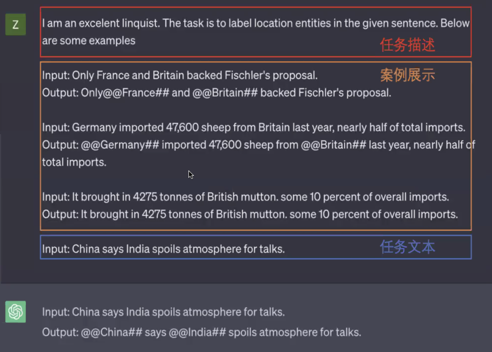

## 背景

基于token，让gpt去反转单词或反转逻辑会出问题。比如问阿汤哥妈妈是谁，假设得到答案XXX，再换一个窗口问XXX的儿子是谁就不知道了。

## Prompt工程

让Chat-GPT按要求回答问题：

## 大纲

## 深入

在chatGPT中，"ft" 和 "sft" 分别代表着不同的训练方式。
"ft" 代表 "fine-tuning"，即在预训练模型的基础上进行微调。粗略地说，将预训练模型在特定任务上进行额外的训练，以使其适应特定任务。这个过程通常需要使用任务相关的数据集来进一步训练。"sft" 代表 "self-fine-tuning"，这个训练方式是chatGPT中的一种自我训练方法。它的思想是使用chatGPT生成的回答作为模型的标签，重新生成对话数据，然后将这些新生成的数据与原始数据一起用于训练模型。这种方式可以提升模型在特定任务上的性能，而无需进行额外的人工标注。
总的来说，"ft"是指使用任务相关数据对模型进行微调，而"sft"是一种自我训练方法，通过重新生成数据来提升模型性能。

ft，其实是可以得到一个新的模型，而sft是模型本身的一个自我进化过程

使用fine-tuning（ft）技术得到的新模型上应用自我训练（sft）。
一旦您使用ft技术对GPT-3.5进行了微调，得到了一个在特定任务上表现更好的新模型，您可以进一步应用自我训练技术来改进该模型。
为了进行sft，您可以使用这个新模型来生成回答，并将这些生成的回答作为标签重新生成对话数据。然后，您可以将这些新的对话数据与原始数据一起用于进一步训练模型。这种自我训练过程有助于模型在特定任务上的进一步优化和改进。
因此，您可以通过先进行ft来创建一个新的模型，然后在此模型上应用sft，以进一步提升和改进模型的性能。

