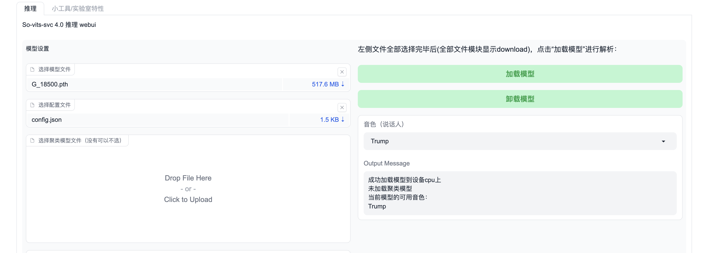
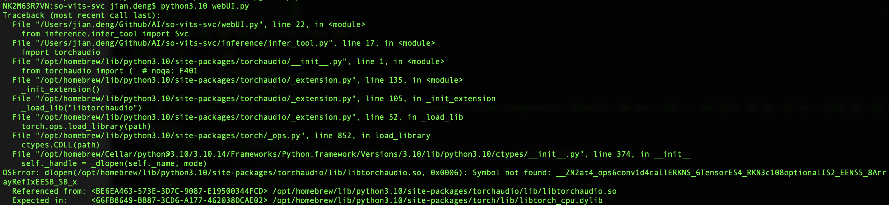

参考https://xiaoao.cyou/m1-mac%E4%BD%BF%E7%94%A8so-vits-svc-4-0/

这个文章上是用conda环境下的。现在公司不让用conda，下面是我自己的流程。


## **环境搭建**

git clone项目文件https://github.com/svc-develop-team/so-vits-svc

cd到这个目录，pip3 install -r requirements.txt

我原来MacOS默认的python3的版本是3.11.4，这个安装依赖一直报错

ERROR: Could not build wheels for fairseq, which is required to install pyproject.toml-based projects

网上的方案是修改pyworld的版本，比如把requirements.txt这里的pyworld指定版本删掉再安装。

但我是改了python3版本来安装的。


mac安装指定版本python参考：https://zhuanlan.zhihu.com/p/373853381

```text
brew install python@3.10
```

我安装了python3.10版本后（3.10.3），用pip3.10 install -r requirements.txt命令重新安装。这次报错是：

<font color="red">ERROR: Could not build wheels for pyworld, which is required to install pyproject.toml-based projects</font>

然后继续安装pip3.10 install fairseq==0.12.2后，再运行pip3.10 install -r requirements.txt 

终于全部成功了。


下载“必要模型文件”[checkpoint_best_legacy_500.pt](https://ibm.ent.box.com/shared/static/z1wgl1stco8ffooyatzdwsqn2psd9lrr)放入项目的hubert文件夹（推理需要用到，链接失效的话请自行google）。


## 运行

目录下python3.10 webUI.py。就可以推理了。




如果跑python3.10 webUI.py出现如下错误：

OSError: dlopen(/opt/homebrew/lib/python3.10/site-packages/torchaudio/lib/libtorchaudio.so, 0x0006): Symbol not found: __ZN2at4_ops6conv1d4callERKNS_6TensorES4_RKN3c108optionalIS2_EENS5_8ArrayRefIxEESB_SB_x



可以尝试如下命令重新安装torchaudio

pip3.10 install --pre --upgrade torch torchvision torchaudio --index-url https://download.pytorch.org/whl/nightly/cpu


## 版本问题

从git上clone的https://github.com/svc-develop-team/so-vits-svc 这个默认版本是4.0（refs/heads/4.0）。但实际还有一个更新的4.1-Stable版本。可以git checkout -b 4.1-Stable origin/4.1-Stable 用这个来拿到4.1版本。

因为我使用Colab脚本训练的都是基于4.1的模型，网上公开的大部分是4.0模型。这有两个区别：

1. 4.1的preprocess_flist_config.py编码器默认是768l12，而4.0版本默认是256l9。如果用4.0的分支做本地推理，会用不了4.1的模型而报错；反过来也一样，4.1本地推理使用4.0的模型会报错：RuntimeError('Given groups=1, weight of size [192, 256, 5], expected input[1, 768, 418] to have 256 channels, but got 768 channels instead')

参考：https://www.cnblogs.com/strawberryPudding/p/17473944.html

2. 本地推理时，4.0分支checkpoint_best_legacy_500.pt这个模型需要放在so-vits-svc/hubert目录下。而4.1-stable分支需要放到so-vits-svc/pretrain目录。


## 推理

男声变女声：

女声变男声：

