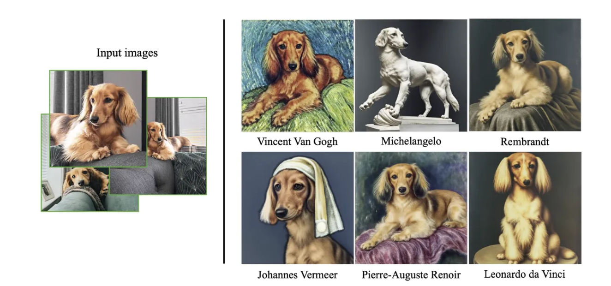
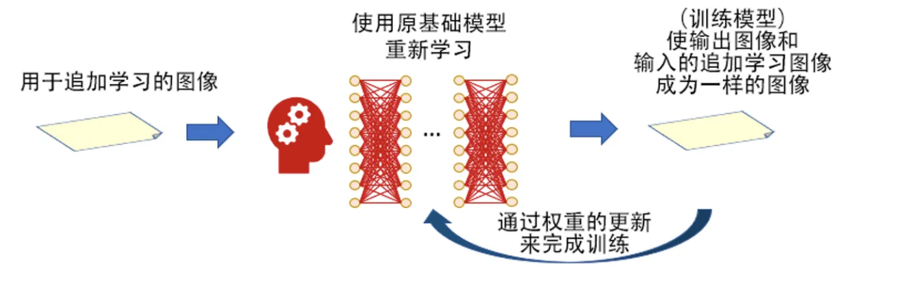
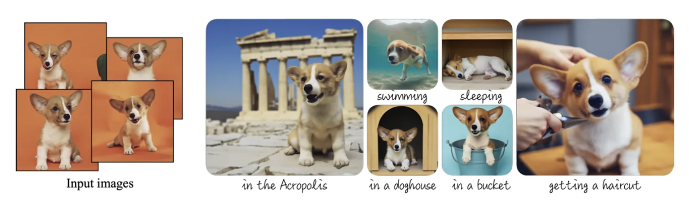

## 1. Dreambooth 模型简介

Dreambooth 是2022年谷歌发布的一种训练模型的方式，该方式通过向模型注入自定义的主题来微调扩散模型（论文地址：[https://arxiv.org/abs/2208.12242](https://link.zhihu.com/?target=https%3A//arxiv.org/abs/2208.12242)） 。

Google 团队解释了为什么给这个训练方法起这样一个名字“Dreambooth : It’s like a photo booth, but once the subject is captured, it can be synthesized wherever your dreams take you.”。翻译过来大概意思就是，在一个小拍照亭（ booth：一个小黑屋，在屋子里你可以照半身像的照片）中进行拍照，无论是人物、动物或物体等等，一旦你拍照成功，那么“你便可以任由梦想带你去到任何一个场景”，即这个照片里的主角都可以被合成融入到任何的“梦想的场景”中。

论文中举了一组狗的例子：仅使用 3 张图片作为训练的输入，成型的模型就可以在不同的提示词作用下生成不同场景或不同风格的画面中这种狗狗的画面，且狗狗和对应的提示词所表达的风格与场景融合的相当自然。所以，Dreambooth 模型就像一个“小照相亭”一样，一旦拍照成功，就可以 AI 生成的方式自动 P 到任何一个场景中去，且和场景融入得相当好。

只有3个训练图像，Dreambooth 便可以往 SD 基础大模型中注入这个这个狗狗的形象

在 Stable Diffusion 领域， DreamBooth 具体的模型训练思维框架是这样的。它基于原有的基础大模型进行追加学习训练，相当于在原有基础大模型之中注入了一些新的信息，以期达到训练的目标。达成训练结目标后，便得到了一个新的基础大模型。这样训练出来的模型文件大小通常在 2GB到5GB，因此不便于在网上进行广泛的交流。虽然传播效率和训练效率不高，但是模型的品质却是很好。

DreamBooth 的模型训练思维框架图

Dreambooth 训练出的结果为 Checkpoint 模型（.ckpt 或 .safetensors 扩展名文件的模型），这种模型相当于训练出一了个完整的新 SD 基础模型出来。只是在训练过程中，是需要单独提供一个class类别的定义，比如这几张狗狗的图片来训练，就需要提供一个类别”dog“，这样模型就会在原有 SD 基础大模型中仅仅从“dog”这一细分领域去训练了。另外一个就是需要提供一个独特的名称，比如 kkoxxbb 这种明显不是某个有意义的单词的新名字，确保这个新名字在原有 SD 大模型中不被识别为某种自然语言的含义。这样 Dreambooth 训练就变成一个在原有 SD 基础模型之中进行局部参数的更新来完成训练的过程。

因此从效果上来说，Dreambooth 是将一个以前人类史上没有见过的崭新的概念添加到 SD 基础模型中的最适合的训练方案。当然，如果你非要把你家的狗狗的照片当做“人类史上没有”的崭新形象进行 Dreambooth 训练也没关系，只不过是有点大材小用，因为其实这样的训练，单靠 LoRA 训练就可以了。

## 2. Dreambooth 模型在 Stable Diffusion WebUI 中的使用

在 Stable Diffusion WebUI 的使用中， Dreambooth 训练出的模型一般为 .ckpt 或 .safetensors 为扩展名的文件，把它们放在 stable-diffusion-webui/models/Stable-diffusion 目录中，使用时无需重启 WebUI，在基础模型选择下拉框处刷新后选择即可开始使用。并且你无需在提示词中有任何特殊的公式语句来描述该模型。你仍然可以附加其他 LoRA 模型来进行叠加的风格变换。

## 3. Dreambooth 的模型训练

Dreambooth 的模型训练，如果通过 kohya_ss GUI 这个软件来进行，则 Dreambooth 的训练设置界面类似 LoRA ，其训练数据集的准备和训练时的参数设置也与 LoRA 大体相同，除了有个别的设置是不同的。（具体细节请查看通过 kohya_ss GUI 训练 LoRA 模型）

### 3.1 首先是需要确定清楚对训练集图片的 class 与 instance

举个例子，假设我们要训练一个“施瓦辛格”的模型。我们有3张他的照片图片，设置每一张的 captions（图片描述文本）如下：

1. Schwarzenegger, man, sunglasses, black coat, muscular, scene from Terminator
2. Schwarzenegger, man, suit, red tie, smiling
3. chwarzenegger, muscular, smiling, man, flexing, black and white

class 此时的设置就应该是“man”。这个 class 的作用就是首先框定住要训练的这个“Schwarzenegger”概念是属于“man”这个类别的，这样在训练时就会使 SD 基础大模型聚焦于“man”这个大概念范畴。同时，更重要的作用是，避免“Schwarzenegger”这个新的概念把所有“man”的概念带歪！

再具体来说就是，这三个训练图片的 captions（图片描述文本）中都有“man”这个提示词，那么在模型训练时，势必会影响模型与“man”的关联度，以至于在模型训练好后在具体使用模型时，当你输入“man”这个提示词时，都会产生“施瓦辛格”形象的图片。也就是说，由于在训练阶段提示词中都有“man”，导致 SD 基础大模型所有有关man的内容都聚焦到了“Schwarzenegger”这个新的概念上。

这就是“既要又要”的尴尬。。。既要框定范围为“man”，又不能让“Schwarzenegger”将所有“man”概念劫持。所以就引入了一个叫 class 的东西。

此时 class 在设置为“man”后，系统在调用“Schwarzenegger”这三个训练集图片时，同时会生成3张正常的“man”的图片，以做平衡。具体是这样进行的，首先你设置参数如下：

- **Instance Token** = `Schwarzenegger`
- **Class Token** = `man`
- **Instance Prompt** = `[filewords]`
- **Class Prompt** = `[filewords]`
- **# Class Images** = `1`

这些参数的意思是，

- instance 代表这三个“Schwarzenegger”的训练集图片，Instance Token 就是告诉系统，在captions（图片描述文本）中，凡是有“Schwarzenegger”这个词时，就被识别为训练集图片的独有概念单词；
- Class token，就是说此次训练的内容是被框定在“man”这个 class 类目中的，系统会为每一个 Instance 图片生成若干匹配的一般意义上的“man”的图像，以避免“Schwarzenegger”这个新概念把所有“man”概念都劫持走。具体这个“若干”是多少呢？下面 # Class Images 处进行设置，本例子为 1；
- Instance Prompt 和 Class Prompt 默认。

系统生成“man”图像时，这些图像遵循的提示词标准就是你提供的 caption 中的非“Schwarzenegger”部分，即：

1. man, sunglasses, black coat, muscular, scene from Terminator
2. man, suit, red tie, smiling
3. muscular, smiling, man, flexing, black and white

这样就可以来平衡了。注意，在实际的训练过程中 # Class Images 的设置更多时不会仅仅是 1。这要看模型被新概念词汇和训练图片带偏的程度来决定，如果新概念和训练图片太强，这里就需要更多的 class 图片做平衡，所以可能会设置成 3 或 5，等等。这个可以多去尝试。

### 3.2 在 Dreambooth 模型训练的界面中，有几处高级设置与 LoRA 不同

- VAE 输入框 (Optional) path to checkpoint of vae to replace for training：如果在此处指定了一个 VAE 模型文件，那么该 VAE 将参与模型训练，并且在得到的Dreambooth 模型中，将自动包括该 VAE 。
- Flip augmentation 复选框：类似 Color augmentation 将颜色进行轻微调节，以增加训练图像的多样性，Flip augmentation 将图像左右进行镜像反转，以增加训练图像的多样性。

