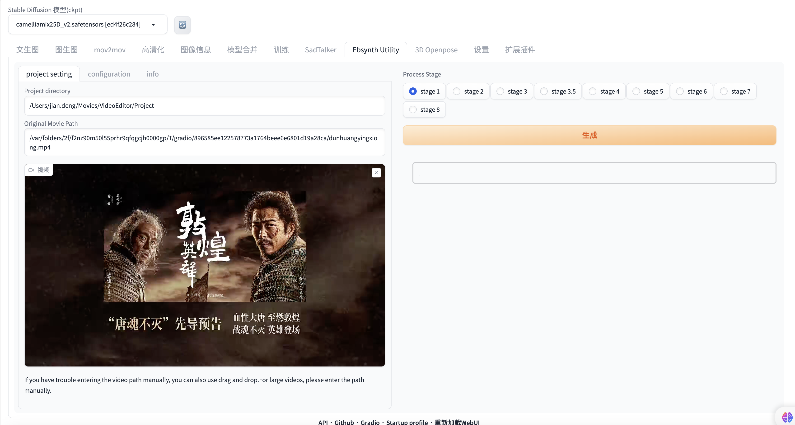
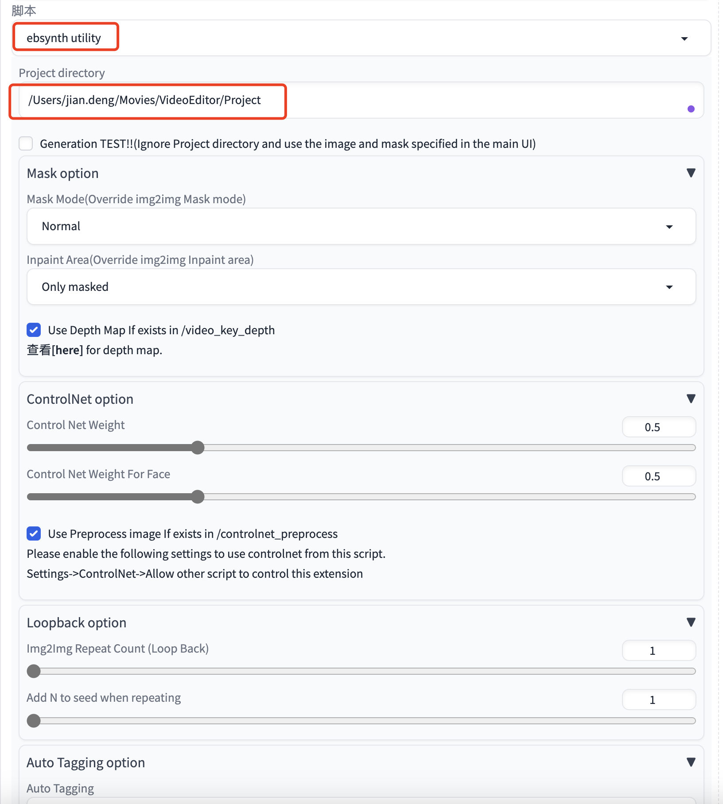
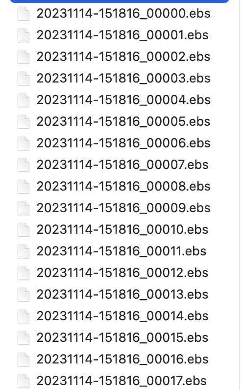

## 插件简介和安装

ebsynth_utility for SD WebUI : [https://github.com/s9roll7/ebsynth_ut...](https://www.youtube.com/redirect?event=video_description&redir_token=QUFFLUhqa0Z5TG1VdUstWGFmY0FaSm5VWEZleGs0d19id3xBQ3Jtc0tuVlN0d1dlR2U0YUl3ZUREaWVNWmJXNkc2OGVpUktWeTNjemQ3TTVHQlVBYzBWekdWd0NaUzIzUTZRVjN2WmhUd2l0NVRYYkt3Zm1JLVlUSk5feGFOVHdpb1ZsVHNtREFFRkk5b3dmYUw4eHlhNWZuSQ&q=https%3A%2F%2Fgithub.com%2Fs9roll7%2Febsynth_utility&v=AN2Qf7Gek4g) 

Ebsynth (For video frames generation) : [https://ebsynth.com/](https://www.youtube.com/redirect?event=video_description&redir_token=QUFFLUhqa01QNUZTTlA5MVV0LTlFbHVXbVNqS1YwRHdaZ3xBQ3Jtc0tsMGVGUEdLQVVuT2Z6Z2tEVExDV3FDNnloeVJXblZZMTBocWVhU1NOQnhnX3JTSVdmdndmYXlIMkJZal93Skd5elVTZGQwMjU2NXVyRXRYbmRCWmRNcTVNNTZhZ1A2MGlmOWQtWjFFaDlLQ1RINk5PWQ&q=https%3A%2F%2Febsynth.com%2F&v=AN2Qf7Gek4g) 

All Google Colab links here : [https://thefuturethinker.org/stable-d...](https://www.youtube.com/redirect?event=video_description&redir_token=QUFFLUhqbTB6RGptVTFoc3lzX2NrYXVMWWRCZG1WaWZpd3xBQ3Jtc0trNmh2YzZFOTA2N1QxbVNaTjFuekVlaVRubWZ3UEFUbGwzMWlDREk1ZXFTN2d3MnpQM2tLM3hJZWdodFdONG8yVVVaRk5MZ1JqVEV0VFdtNmtaemltdHhFbmo2Q0N5RjF3R1NoMGVXcUZUY0dzS3dFdw&q=https%3A%2F%2Fthefuturethinker.org%2Fstable-diffusion-google-colab-ipynb-list%2F&v=AN2Qf7Gek4g) 

直接在SD界面上插件安装那从https://github.com/s9roll7/ebsynth_utility 这个地址安装，然后重启webUI。

插件步骤提示如下：

The process of creating a video can be divided into the following stages.
(Stage 3, 4, and 6 only show a guide and do nothing actual processing.)

**stage 1**
Extract frames from the original video.
Generate a mask image.

**stage 2**
Select keyframes to be given to ebsynth.

**stage 3**
img2img keyframes.

**stage 3.5**
(this is optional. Perform color correction on the img2img results and expect flickering to decrease. Or, you can simply change the color tone from the generated result.)

**stage 4**
and upscale to the size of the original video.

**stage 5**
Rename keyframes.
Generate .ebs file.(ebsynth project file)

**stage 6**
Running ebsynth.(on your self)
Open the generated .ebs under project directory and press [Run All] button.
If out-* directory already exists in the Project directory, delete it manually before executing.
If multiple .ebs files are generated, run them all.

**stage 7**
Concatenate each frame while crossfading.
Composite audio files extracted from the original video onto the concatenated video.

**stage 8**
This is an extra stage.
You can put any image or images or video you like in the background.
You can specify in this field -> [Ebsynth Utility]->[configuration]->[stage 8]->[Background source]
If you have already created a background video in Invert Mask Mode([Ebsynth Utility]->[configuration]->[etc]->[Mask Mode]),
You can specify "path_to_project_dir/inv/crossfade_tmp".

## 使用步骤

### Step1 提取视频帧

目录中输入要保存视频帧的路径和视频原始路径 ，可以生成出人物蒙版

如果视频较长，提取mask可能耗时较长，看是否确实需要mask。

如果出现没有生成视频帧，可以重启SD。

### Step2 提取关键帧

直接运行，会在工程上生成一个目录，保存关键帧信息；

### Step3 图生图

!!!!!!!!!!!!!!!!!!!!!!!!!!!!!!!!!!!!!!!!
\1. Go to img2img tab
\2. Select [ebsynth utility] in the script combo box
\3. Fill in the "Project directory" field with [/Users/jian.deng/Movies/VideoEditor/Project]
\4. Select in the "Mask Mode(Override img2img Mask mode)" field with [Normal]
\5. I recommend to fill in the "Width" field with [960]
\6. I recommend to fill in the "Height" field with [512]
\7. I recommend to fill in the "Denoising strength" field with lower than 0.35
(When using controlnet together, you can put in large values (even 1.0 is possible).)
\8. Fill in the remaining configuration fields of img2img. No image and mask settings are required.
\9. Drop any image onto the img2img main screen. This is necessary to avoid errors, but does not affect the results of img2img.
\10. Generate
(Images are output to [/Users/jian.deng/Movies/VideoEditor/Project/img2img_key])

在SD的图生图中，选择一张关键帧，推理出提示词后选择合适的模型先调整重绘尺寸、重绘参数（最好不要超过0.5）、提示词引导参数，看看重绘的效果，然后固定随机种子。在脚本中选择ebsynth utility，工程路径选择前面step1设置的工程路径。然后点击生成，就会开始批量重绘所有关键帧。

采样方法可以选择DPM++ 2M Karras

要想追求比较好图生图的效果，可以打开ControlNet的两个选项：(勾选启用和完美像素模式)

1. Depth(深度)，预处理器选：depth_midas, 模型选择control_v11f1p_sd15_depth;
2. OpenPose,预处理器选：openpose_full,模型选择control_v11p_sd15_openpose;

### **Step 3.5**

(this is optional. Perform color correction on the img2img results and expect flickering to decrease. Or, you can simply change the color tone from the generated result.)

### Step 4

and upscale to the size of the original video.

高清化处理，如果之前重绘的分辨率比较低可以用这个

### Step 5

Rename keyframes.
Generate .ebs file.(ebsynth project file)

点击生成后，会根据视频长度生成N多个.ebs文件，如图：

### Step 6

Running ebsynth.(on your self)
Open the generated .ebs under project directory and press [Run All] button.
If out-* directory already exists in the Project directory, delete it manually before executing.
If multiple .ebs files are generated, run them all.

依次把Step5生成的.ebs文件拖到独立app EbSynth中运行。如果不需要mask可以点off掉。

### Step7

直接运行，有时看起来好像没响应，不用管。直接等视频生成就可以。
