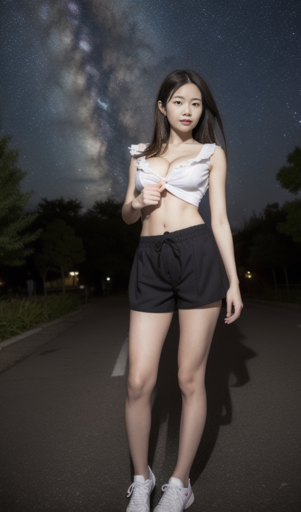
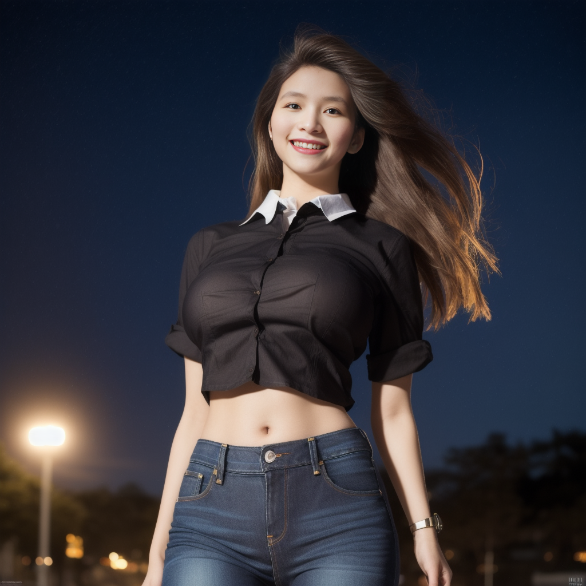
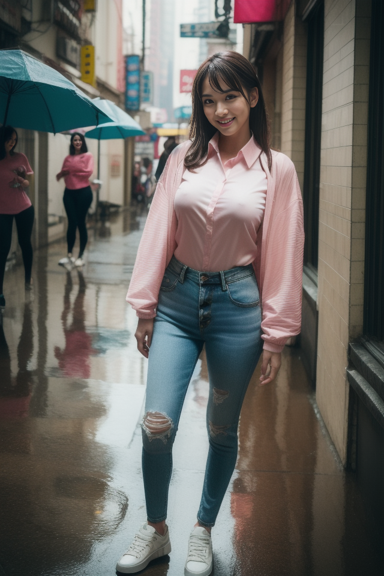
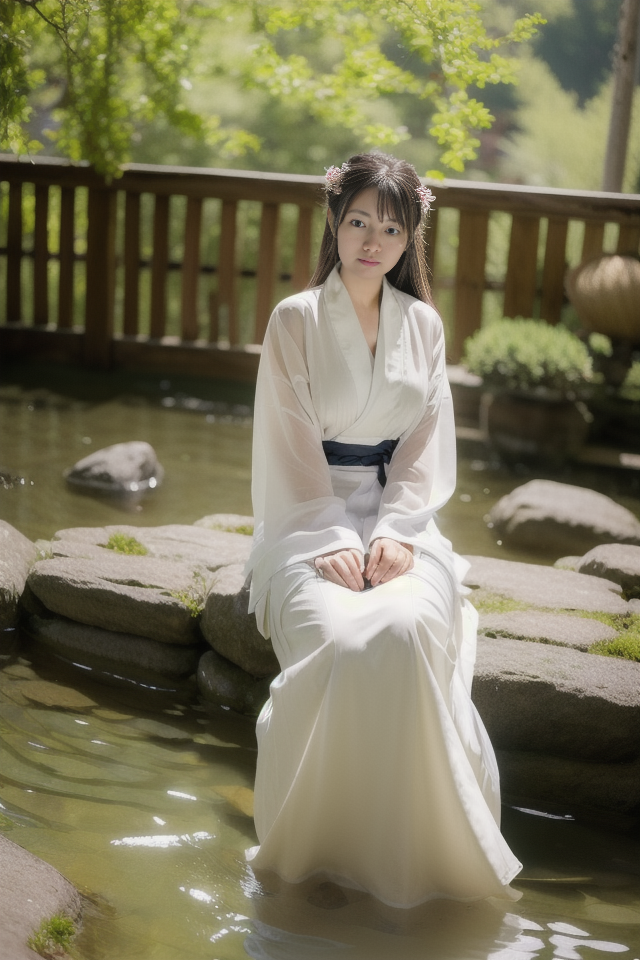

## 必要流程

插件**ADetailer**必须要启用，不然很容易出现脸崩的情况。这里也有正向提示词：realistic face, detailed face。反向提示词: ugly


主模型我用的beautifulRealistic_v60.safetensors，这个是针对亚洲女人的。

分辨率我一般用640*960，后面再用高清修复。

可配合各种LoRA模型使用；


## 咒语

### 1. 先来一段简单的：

正向：

```
nightclub, laughing,(see through pantyhose:0.8),(see through Oversized_sweater:1.3), 
```

反向：

```
paintings, sketches, (worst quality:2), (low quality:2), (normal quality:2), lowres, normal quality, ((monochrome)), ((grayscale)),extra fingers,fewer fingers,((watermark:2)),(white letters:1), lowres, bad anatomy, (badhandv4:1.4),
```

效果如图：


### 2. 再看另外一个，画星空下的女孩。

正向：

```
1girl, (best quality, masterpiece, ultra-high resolution, 4K, HDR, UHD, 64K, official art), (photorealistic:1.3, realistic:1.3),depth of field, outdoors, (starry sky, clusters of stars, starry sky, glinting stars), (night, night sky), (dim light),floating hair, long hair, dark brown hair,(long frilled shirt), (shorts), (full body:1.3), (arms crossed),(standing:1.3), (large breasts:1.3), (solo_focus:1.2), looking_at_viewer,(fit and petite body, busty), close-up,
```

反向：

```
(badhandv4:0.6), EasyNegative, negative_hand-neg, bhands-neg, ((multiple arm, bad hands, only hand, missing finger)), (NSFW), (cameltoe:1.5, rei no himo:1.5), paintings, sketches, (worst quality:2), (low quality:2), (normal quality:2), low res, ((monochrome)), ((grayscale)), skin spots, acnes, skin blemishes, bad feet, missing arms, missing legs, extra digit, extra arms, extra leg, extra foot, multiple arms, multiple hands,
```




### 3. 再来一套：

正向：

```
(1girl:1.3), (best quality, masterpiece, ultra high resolution, 4K, HDR, UHD, 64K),(photorealistic:1.3), (realistic:1.3), depth of field, charming, happy, solo,(full body:1.3), (outdoors:1.2), (late at night:1.3), (dim light:1.2), (hut:1.3), (curvy:1.3),(closed mouth), (light smile:1.2), (floating hair:1.2), (long hair), (dark brown hair:1.2), (collared_shirt:1.3), (closed button:1.2), (jeans:1.2),(standing:1.2), vivacious and seductive, (slim legs:1.2), (Slender legs:1.2), (short thin waist:1.2), (only one girl:1.2), (huge breasts:1.2), (from below), (looking down), (arms at sides:1.2),
```

反向：

```
(badhandv4), negative_hand-neg, NSFW, Easy Negative, paintings, sketches, (worst quality:2), (low quality:2), (normal quality:2), low res, normal quality, ((monochrome)), ((grayscale)), skin spots, acnes, skin blemishes, age spot, glans, extra fingers, fewer fingers, (extra hands), bad anatomy, bad hands, missing fingers, extra digit, fewer digits, blurry, bad feet, poorly drawn hands, poorly drawn face, mutation, deformed, worst quality, bad proportions, gross proportions, missing arms, missing legs, extra digit, extra arms, extra leg, extra foot, multiple arms, multiple hands, (multiple fingers, broken fingers),
```

效果如图：


如果给这个正向提示词加上星空背景，可改成

```
(1girl:1.3), (best quality, masterpiece, ultra high resolution, 4K, HDR, UHD, 64K),(photorealistic:1.3), (realistic:1.3), depth of field, charming, happy, solo,(full body:1.3), (outdoors:1.2), (late at night:1.3), (dim light:1.2), (hut:1.3), (curvy:1.3),(closed mouth), (light smile:1.2), (floating hair:1.2), (long hair), (dark brown hair:1.2), (collared_shirt:1.3), (closed button:1.2), (jeans:1.2),(standing:1.2), vivacious and seductive, (slim legs:1.2), (Slender legs:1.2), (short thin waist:1.2), (only one girl:1.2), (huge breasts:1.2), (from below), (looking down), (arms at sides:1.2), (starry sky, clusters of stars, starry sky, glinting stars), (night, night sky)
```


晚上背景

```
(1girl:1.3), (best quality, masterpiece, ultra high resolution, 4K, HDR, UHD, 64K),(photorealistic:1.3), (realistic:1.3), depth of field, charming, happy, solo,(full body:1.3), (outdoors:1.2), (late at night:1.3), (dim light:1.2), (hut:1.3), (curvy:1.3),(closed mouth), (light smile:1.2), (floating hair:1.2), (long hair), (dark brown hair:1.2), (collared_shirt:1.3), (closed button:1.2), (jeans:1.2),(standing:1.2), vivacious and seductive, (slim legs:1.2), (Slender legs:1.2), (short thin waist:1.2), (only one girl:1.2), (huge breasts:1.2), (from below), (looking down), (arms at sides:1.2),
```




如果是市区风格，可以

正向：

```
(1girl:1.3), (best quality, masterpiece, ultra high resolution),(photorealistic:1.3), (realistic:1.3), depth of field,(full body:1.2), (outdoors:1.2), (day:1.2), (cinematic lighting:1.2), (dim light:1.2), (in autumn, cyberpunk, city, kowloon, rain),(closed mouth), (light smile:1.2), (expressive hair:1.2), (floating hair:1.2), (pink compression shirt:1.3), (button-down:1.2), (skinny jeans:1.2),busty, vivacious and seductive, (only one girl:1.2),(standing:1.2), (slender), (slender legs), (long legs:1.3), (looking at viewer, facing viewer:1.2), (pov:1.3), (sfw:1.4), (One hand insertion pocket:1.2), (straight-on:1.2), (large breasts:1.2),
```

反向

```
(badhandv4), negative_hand-neg, NSFW, Easy Negative, paintings, sketches, (worst quality:2), (low quality:2), (normal quality:2), low res, normal quality, ((monochrome)), ((grayscale)), skin spots, acnes, skin blemishes, age spot, glans, extra fingers, fewer fingers, (extra hands), bad anatomy, bad hands, missing fingers, extra digit, fewer digits, blurry, bad feet, poorly drawn hands, poorly drawn face, mutation, deformed, worst quality, bad proportions, gross proportions, missing arms, missing legs, extra digit, extra arms, extra leg, extra foot, multiple arms, multiple hands, (multiple fingers, broken fingers),
```




### 4. 改成丝袜风格

需要<lora:40d_grey_pantyhose:1>

正向：

```
(1girl:1.3), (best quality, masterpiece, ultra high resolution, 4K, HDR, UHD, 64K), ((40d grey pantyhose)),(photorealistic:1.3), (realistic:1.3), depth of field, charming, happy, solo,(full body:1.5), outdoors, day, sunlight, cubicle_1_cubicle, (skinny:1.3),closed mouth, light smile, floating hair, long hair, dark brown hair, ([white] collared taut shirt:1.2), (closed button:1.2), ([red] pencil skirt),(standing:1.2), vivacious and seductive, slim legs, Slender legs, short thin waist, (only one girl:1.2), (large breasts), (from below:1.3), looking down, (5 fingers:1.4, perfect hand:1.3, detailed hand, high quality hand:1.3), (family friendly:1.3), <lora:40d_grey_pantyhose:1>
```

反向：

```
(badhandv4:0.6), EasyNegative, negative_hand-neg, bhands-neg, ((multiple arm, bad hands, only hand, missing finger)), (NSFW), (cameltoe:1.5, rei no himo:1.5), paintings, sketches, (worst quality:2), (low quality:2), (normal quality:2), low res, ((monochrome)), ((grayscale)), skin spots, acnes, skin blemishes, bad feet, missing arms, missing legs, extra digit, extra arms, extra leg, extra foot, multiple arms, multiple hands,
```


### 5. 汉服风格

需要使用“国风 _ 汉服 _ 写实_v1.safetensors”这个主模型

正向：

```
1girl, solo, long hair, black hair, hair ornament, long sleeves, jewelry, upper body, flower, earrings, hair flower, wide sleeves, looking to the side, looking away, chinese clothes, curtains, robe, realistic, red lips, hair stick, hanfu
```

反向：

```
(worst quality,low quality:1.4),(depth of field,blurry:1.2),(greyscale,monochrome:1.1),3D face,cropped,lowres,text,(nsfw:1.3),(worst quality:2),(low quality:2),(normal quality:2),normal quality,((grayscale)),skin spots,acnes,skin blemishes,age spot,(ugly:1.331),(duplicate:1.331),(morbid:1.21),(mutilates:1.21),(tranny:1.331),mutated hands,(poorly drawn hands:1.5),blurry,(bad anatomu:1.21),(bad proportions:1.331),extra limbs,(disfigured:1.331),(missing arms:1.331),(extra legs:1.331),(fused fingers:1.61051),(too many fingers:1.61051),(unclear eyes:1.331),bad hands,missing fingers,extra digit,bad hands,missing fingers,(((extra arms and legs))),,nsfw
```


如果画温泉背景，可改成

正向

```
1girl, (best quality, masterpiece, ultra-high resolution, 4K, HDR, UHD, 64K, official art), (photorealistic:1.3, realistic:1.3),depth of field, outdoors, (night:1.3), (dim light), (onsen:1.2, flower arrangement:1.2),floating hair, long hair, dark brown hair,([white]collared_shirt:1.2), (full body:1.3), arms at sides, seductive pose, (wedge heels), (pantyhose), pencil skirt,(sitting:1.3), (large breasts), (solo_focus:1.2), looking_at_viewer,(fit and petite body, busty), (curvy:1.2), (under the water), (wet hair, wet shirt), (sitting in water),
```

反向

```
(badhandv4:0.6), EasyNegative, negative_hand-neg, bhands-neg, ((multiple arm, bad hands, only hand, missing finger)), (NSFW), (cameltoe:1.5, rei no himo:1.5), paintings, sketches, (worst quality:2), (low quality:2), (normal quality:2), low res, ((monochrome)), ((grayscale)), skin spots, acnes, skin blemishes, bad feet, missing arms, missing legs, extra digit, extra arms, extra leg, extra foot, multiple arms, multiple hands,
```





### 6. 画动物

正向：（这种就比较接近自然语言描述）

```
An elephant is walking in the deep forest. The sun shines on the elephant through the branches. There is a small river beside the forest. The elephant is very tall, with big ears and a very long nose.
```

反向：

```markup
worst quality, low quality, lowres, bad anatomy, bad hands, text, error, missing fingers, extra digit, fewer digits, cropped, worst quality, low quality, normal quality, jpeg artifacts, signature, watermark, username, blurry, bad feet,ugly,pregnant,vore,duplicate,hermaphrodite,trannsexual,mutilated,morbid,extra fingers,fused fingers,too many fingers,long neck,mutation,poorly drawn face,poorly drawn hands,mutated hands,deformed,blurry,bad anatomy,bad proportions,disfigured,cloned face,extra limbs,malformed limbs,gross proportions,missing arms,missing legs,extra arms,extra legs,tooth，Showing teeth
```


### 7. 画景色

这种最方便用于做二维码或其他ControlNet图，需要启用control_v1p_sd15_qrcode_monster.ckpt


正向：

```
(masterpiece, best quality:1.3),extremely high detailed,intricate,8k,big tree,landscape,lakes,stream,mountain
```

反向：

```
```


### . 画机甲

```
cinematic photo breathtaking photograph, armor mech future knight intricate details, Style-Psycho town, blue steel, by Mark Brooks, by Ismail Inceoglu, (intricate details:0.9), Sony A9 II, split lighting, award-winning, professional, highly detailed . 35mm photograph, film, bokeh, professional, 4k, highly detailed, confused, looking around scared
Negative prompt: (Low_quality:1.5), blurry, ugly, duplicate, error, fake, watermark, text, monochrome
Steps: 37, Size: 768x1024, Seed: 1326882228, Model: nightvisionXLPhotorealisticPortrait_beta0681Bakedvae, Version: 1.5.2, Sampler: Euler a, CFG scale: 7, Model hash: 2f602b1df5
```


