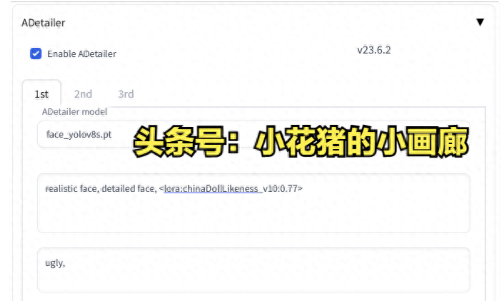
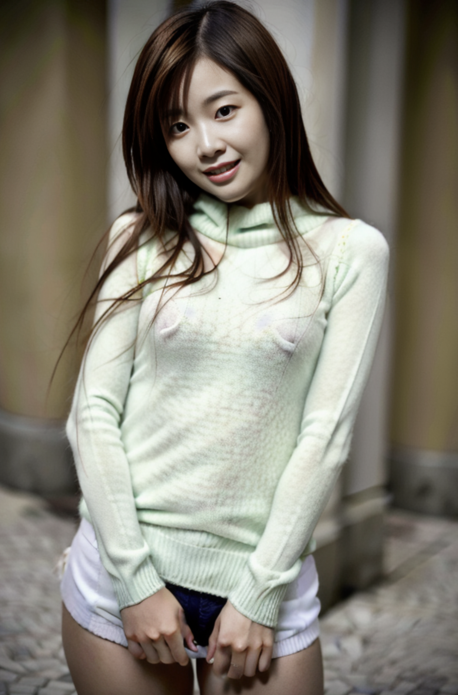
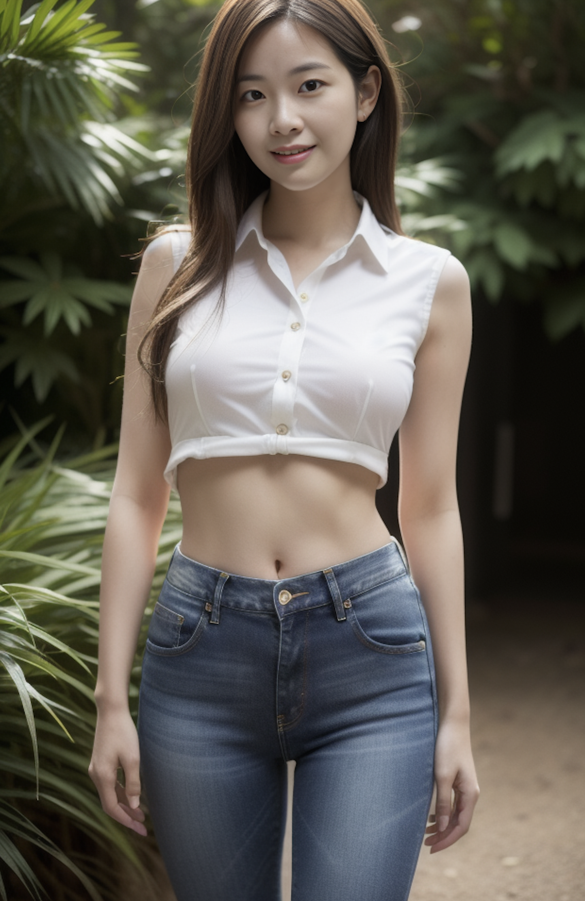

## 必要流程

插件**ADetailer**必须要启用，不然很容易出现脸崩的情况。这里也有正向提示词：realistic face, detailed face。反向提示词: ugly



主模型我用的beautifulRealistic_v60.safetensors，这个是针对亚洲女人的。

分辨率我一般用640*960，后面再用高清修复。

可配合各种LoRA模型使用；


## 咒语

### 1. 先来一段简单的：

正向：

```
nightclub, laughing,(see through pantyhose:0.8),(see through Oversized_sweater:1.3), 
```

反向：

```
paintings, sketches, (worst quality:2), (low quality:2), (normal quality:2), lowres, normal quality, ((monochrome)), ((grayscale)),extra fingers,fewer fingers,((watermark:2)),(white letters:1), lowres, bad anatomy, (badhandv4:1.4),
```

效果如图：




### 2. 再看另外一个，画星空下的女孩。

正向：

```
1girl, (best quality, masterpiece, ultra-high resolution, 4K, HDR, UHD, 64K, official art), (photorealistic:1.3, realistic:1.3),depth of field, outdoors, (starry sky, clusters of stars, starry sky, glinting stars), (night, night sky), (dim light),floating hair, long hair, dark brown hair,(long frilled shirt), (shorts), (full body:1.3), (arms crossed),(standing:1.3), (large breasts:1.3), (solo_focus:1.2), looking_at_viewer,(fit and petite body, busty), close-up,
```

反向：

```
(badhandv4:0.6), EasyNegative, negative_hand-neg, bhands-neg, ((multiple arm, bad hands, only hand, missing finger)), (NSFW), (cameltoe:1.5, rei no himo:1.5), paintings, sketches, (worst quality:2), (low quality:2), (normal quality:2), low res, ((monochrome)), ((grayscale)), skin spots, acnes, skin blemishes, bad feet, missing arms, missing legs, extra digit, extra arms, extra leg, extra foot, multiple arms, multiple hands,
```


### 3. 再来一套：

正向：

```
(1girl:1.3), (best quality, masterpiece, ultra high resolution, 4K, HDR, UHD, 64K),(photorealistic:1.3), (realistic:1.3), depth of field, charming, happy, solo,(full body:1.3), (outdoors:1.2), (late at night:1.3), (dim light:1.2), (hut:1.3), (curvy:1.3),(closed mouth), (light smile:1.2), (floating hair:1.2), (long hair), (dark brown hair:1.2), (collared_shirt:1.3), (closed button:1.2), (jeans:1.2),(standing:1.2), vivacious and seductive, (slim legs:1.2), (Slender legs:1.2), (short thin waist:1.2), (only one girl:1.2), (huge breasts:1.2), (from below), (looking down), (arms at sides:1.2),
```

反向：

```
(badhandv4), negative_hand-neg, NSFW, Easy Negative, paintings, sketches, (worst quality:2), (low quality:2), (normal quality:2), low res, normal quality, ((monochrome)), ((grayscale)), skin spots, acnes, skin blemishes, age spot, glans, extra fingers, fewer fingers, (extra hands), bad anatomy, bad hands, missing fingers, extra digit, fewer digits, blurry, bad feet, poorly drawn hands, poorly drawn face, mutation, deformed, worst quality, bad proportions, gross proportions, missing arms, missing legs, extra digit, extra arms, extra leg, extra foot, multiple arms, multiple hands, (multiple fingers, broken fingers),
```

效果如图：



如果给这个正向提示词加上星空背景，可改成

```
(1girl:1.3), (best quality, masterpiece, ultra high resolution, 4K, HDR, UHD, 64K),(photorealistic:1.3), (realistic:1.3), depth of field, charming, happy, solo,(full body:1.3), (outdoors:1.2), (late at night:1.3), (dim light:1.2), (hut:1.3), (curvy:1.3),(closed mouth), (light smile:1.2), (floating hair:1.2), (long hair), (dark brown hair:1.2), (collared_shirt:1.3), (closed button:1.2), (jeans:1.2),(standing:1.2), vivacious and seductive, (slim legs:1.2), (Slender legs:1.2), (short thin waist:1.2), (only one girl:1.2), (huge breasts:1.2), (from below), (looking down), (arms at sides:1.2), (starry sky, clusters of stars, starry sky, glinting stars), (night, night sky)
```

