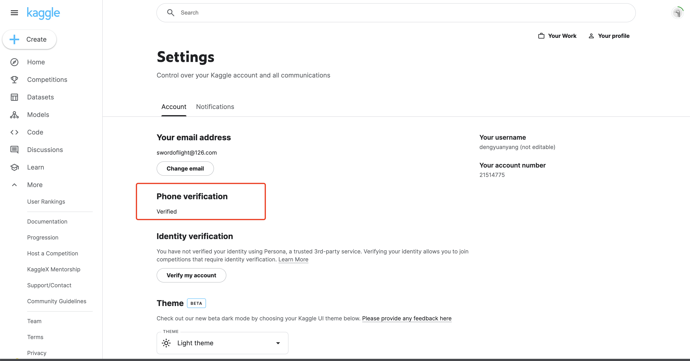
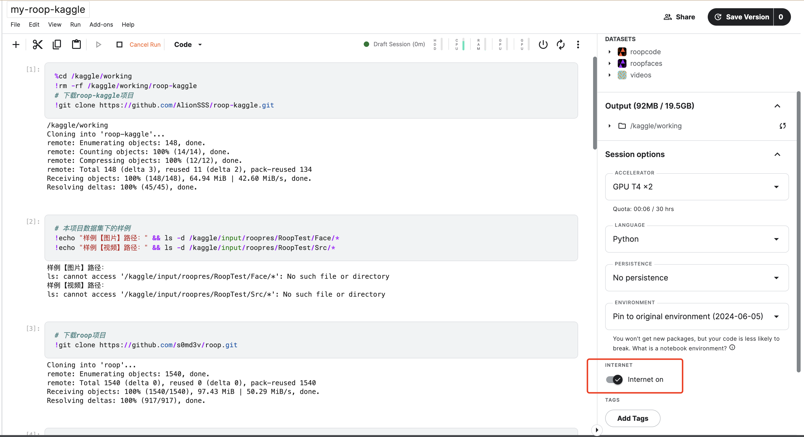

## Kaggle使用的几个注意事项

1. 账号必须要手机号认证，才能使用GPU，认证页面：



2. 需要在NoteBook开启网络，不然无法clone代码等




## 代码

```python
%cd /kaggle/working 
!rm -rf /kaggle/working/roop-kaggle
# 下载roop-kaggle项目
!git clone https://github.com/AlionSSS/roop-kaggle.git
```

```python
# 下载roop项目
!git clone https://github.com/s0md3v/roop.git
```

```python
# 进入到roop项目下
%cd /kaggle/working/roop

# 列出roop项目下已发布的tag，使用tag版本相对更稳定
!git tag
```

```python
# 从上面列出的版本中选择需要的版本
# 版本 1.3.0: 该版本如果想要取消鉴黄，需要调整roop/predictor.py中的opennsfw2库相关代码。最简单的修改方法，把roop/predictor.py代码最前面定义的MAX_PROBABILITY，改成 MAX_PROBABILITY = 1 。
version = "1.3.0"
!git checkout $version
```

```python
# 解除 nsfw
!sed -i "s|MAX_PROBABILITY = 0.85|MAX_PROBABILITY = 1.0|g" /kaggle/working/roop/roop/predictor.py
```

```python
# kaggle上的opencv有点问题，需要卸载
!pip uninstall opencv-python -y
# 看一下roop需要安装的依赖库
!cat requirements.txt
# 开始安装依赖库，时间较长，多等等
!pip install -r requirements.txt
!ls
```

```python
# 下面是本项目的其中一个样例图片、视频。
# 将自己的数据上传到Kaggle，替换下面2个路径为你的图片、视频，即可做你自己的合成视频。
#    - 可以使用 wget 命令下载你的资源
#    - 或者上传资源到Kaggle的Dataset，使用时需要用cp命令将/kaggle/input下的资源拷贝到/kaggle/working下，因为/kaggle/input目录是只读的，而roop会写一些临时数据在你的资源目录下
#    - 或者像我一样把你的图片、视频传到 github 上，再用 git clone 拉取过来
# 人脸图片
!cp "/kaggle/input/roopfaces/life/face.jpg" "/kaggle/working/roop-kaggle/resource/face.jpg"
# 要替换的视频
!cp "/kaggle/input/videos/hanfuHair.mp4" "/kaggle/working/roop-kaggle/resource/hanfuHair.mp4"

!cp /kaggle/input/roopcode/face_swapper.py /kaggle/working/roop/roop/processors/frame/face_swapper.py
!cp /kaggle/input/roopcode/face_enhancer.py /kaggle/working/roop/roop/processors/frame/face_enhancer.py

# 合成的视频的输出位置
output_video = "/kaggle/working/output/hanfuHairResult.mp4"
```

```python
# 人脸图片
source_picture = "/kaggle/working/roop-kaggle/resource/face.jpg"
# 要替换的视频
target_video = "/kaggle/working/roop-kaggle/resource/hanfuHair.mp4"

# 合成的视频的输出位置
output_video = "/kaggle/working/output/hanfuHairResult.mp4"
```

```python
!rm -rf /kaggle/working/output
!mkdir -p /kaggle/working/output


device = "cuda"  # 默认是cpu，如果申请不到显卡可以换cpu，速度会变得很慢
frame_processor = "face_swapper face_enhancer"
output_video_encoder = "libx264"
output_video_quality = "25"

# 参数
arguments = f"--execution-provider {device} " \
       f"-s {source_picture} -t {target_video} -o {output_video} " \
       f"--frame-processor {frame_processor} --output-video-encoder {output_video_encoder} --output-video-quality {output_video_quality} " \
       f"--keep-fps"
print("arguments:" + arguments)

# 进入到roop项目下
%cd /kaggle/working/roop
# 开始合成
!python run.py $arguments
```

### 如果上面输出“Processing to video succeed!”，说明执行成功

### 合成后的视频见本页面右侧栏，Data的目录 /kaggle/working/output/ 下

```python
!ls /kaggle/working/output/
from IPython.display import Video

Video(output_video, embed=True)
```


