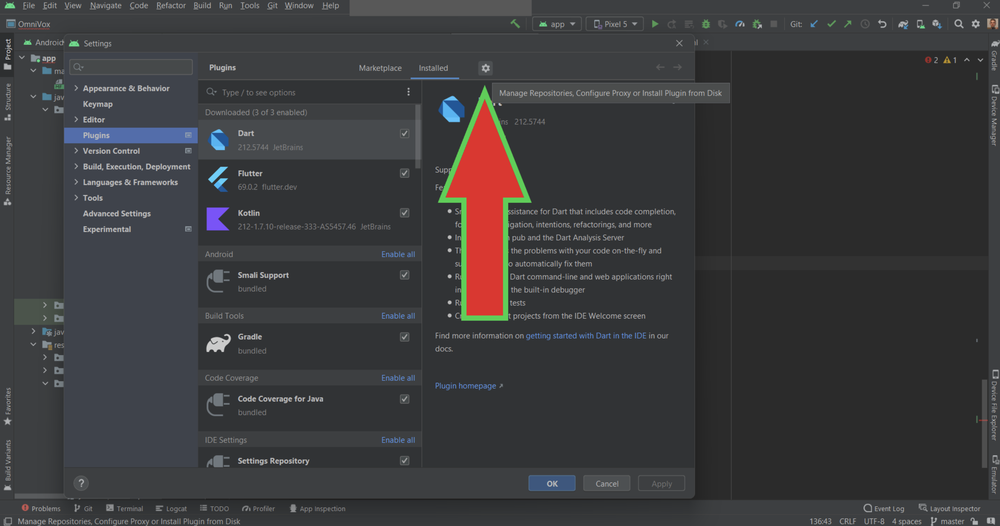
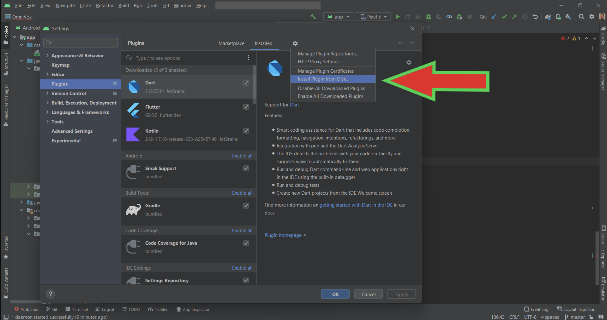
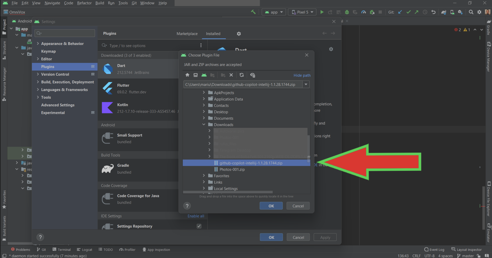

Android也可以考虑直接插件商店中搜索使用CodeGeeX。

https://stackoverflow.com/questions/72911525/how-can-i-use-github-copilot-in-android-studio

Is it possible to use the new [Copilot](https://github.com/features/copilot) plugin from GitHub in Android Studio? I see they advertise it for Visual Code, but I am working in Android Studio and I would like to test it.

GitHub (https://github.com/features/copilot?utm_medium=email&utm_source=announcement&utm_campaign=copilot-technical-preview) GitHub Copilot · Your AI pair programmer GitHub Copilot works alongside you directly in your editor, suggesting whole lines or entire functions for you.

Deprecated:

Yes it is, You need to go to the JetBrains [marketplace](https://plugins.jetbrains.com/plugin/17718-github-copilot/versions), download the latest Copilot plugin version and then manually install it in Android Studio. See pictures attached. Go to settings

then go to install from disk

and then choose plugin location (choose the one you downloaded in the first step).

For iOS：

https://github.com/github/CopilotForXcode?tab=readme-ov-file

