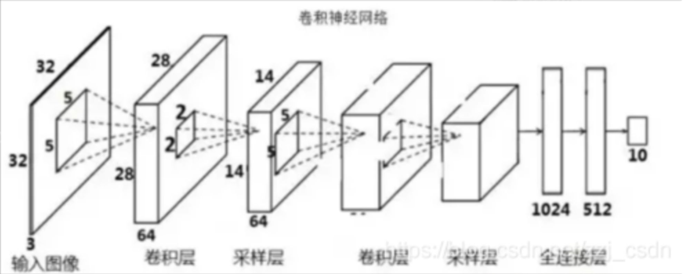
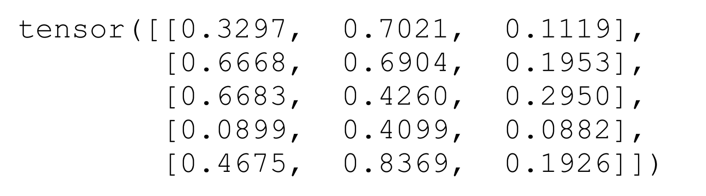
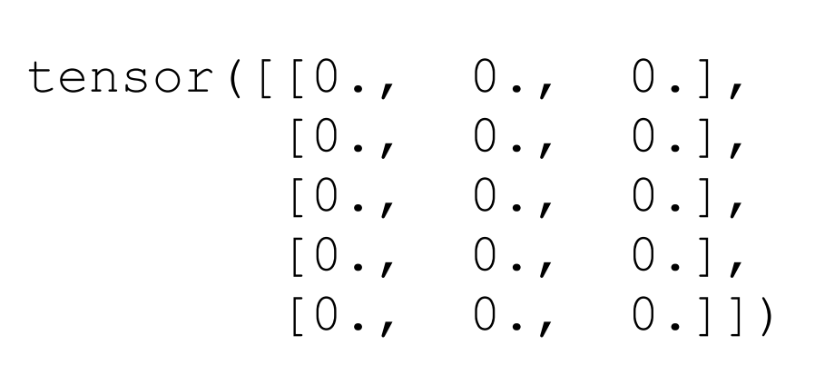

## **第1章　深度学习简介**

的深度网络架构，就是整个网络体系的构建方式和拓扑连接结构，目前主要分为3种：前馈神经网络、卷积神经网络(CNN)和循环神经网络(RNN)。

从应用方面上来看，CNN用到做[图像识别](https://so.csdn.net/so/search?q=图像识别&spm=1001.2101.3001.7020)比较多，而RNN在做到语言处理多一点。




## **第2章　PyTorch简介**

PyTorch具有如下3个最关键的特性：

·与Python完美融合(Pythonic)；

·支持张量计算(tensor computation)；

·动态计算图(dynamic computation graph)。


### **张量计算**

PyTorch的运算单元叫作张量(tensor)。我们可以将张量理解为 一个多维数组，一阶张量即为一维数组，通常叫作向量(vector)；二 阶张量即为二维数组，通常叫作矩阵(matrix)；三阶张量即为三维数组； n阶张量即为 n维数组，有 n个下标。


**定义张量**

下面，我们来看看如何利用PyTorch定义一个张量。首先，需要导入PyTorch的包，我们只需要在Jupyter Notebook中输入以下命令即可：

接下来，我们可以创建一个尺寸为(5, 3)的二阶张量（也就是5行 3列的矩阵）。我们希望其中每个元素的数值是随机赋予的[0, 1]区间

中的一个实数，则只需要输入：

其中，第二行的x表示打印输出 的数值。系统的返回值如下（每次执行数值都会不同）：

```python
import torch
x=torch.rand(5,3)
x

```




**访问张量**

访问 张量中的第一个元素（注意，张量的下标是从0开始的）用z[0]。系统返回如下：



还可以使用切片(slicing)的方法来访问张量。如果希望访问 中第3列的全部元素，则可以输入：x[:,2]

系统返回：tensor([0.1119, 0.1953, 0.2950, 0.0882, 0.1926])

第一个维度下标用“:”表示所有的行，“:”相当于一个通配符。

PyTorch中的张量定义和 访问方法与Python中NumPy数组的定义和访问没有什么区别，因此参考NumPy的各种语法和技巧来操作PyTorch的张量就可以了。


**张量的运算**

PyTorch中的张量还可像NumPy的多维数组一样完成各种运算。

例如，张量可以相加：要保证 和 的尺寸一模一样才能相加。

z=x+y

z

看两 

个二维张量的矩阵乘法，其实这与两个矩阵相乘没有任何区别。这里 需要调用PyTorch的mm(matrix multiply)命令，它的作用就是矩阵相乘：y.t表示矩阵 的转置。因为 的尺寸为(5, 3)， 的尺寸为(5,3)，而根据矩阵的乘法规则，第一个张量第二个维度的尺寸必须和第 二个张量第一个维度的尺寸相等才能相乘，所以将 转置之后得到y.t的尺寸是(3, 5)，才可以和 相乘。

q=x.mm(y.t())

q


**张量与NumPy数组之间的转换**

从NumPy到张量的转换可以使用from_numpy(a)，其中a为一个NumPy数组。反过来，从张量到Numpy的转换可以使用a.numpy()，其中a为一个PyTorch张量。

x_tensor是一个尺寸为(2, 3)的随机张量，y_numpy是一个尺寸为(2, 3)的随机矩阵。randn的意思是创建一个满足正态分布的随机张量或矩阵（rand是创建满足均匀分布的随机张量或矩阵）。

```python
import numpy as np

x_tensor = torch.randn(2,3)
y_numpy = np.random.randn(2,3)

#将张量转化为NumPy：
x_numpy = x_tensor.numpy()
#以将NumPy转化为张量：
y_tensor = torch.from_numpy(y_numpy)
```

除了这种直接转换，大多数时候还需要按照类型进行转换。例如 ， a 是 一 个 float 类 型 的 NumPy 数 组 ， 那 么 可 以 torch.FloatTensor(a)将a转化为一个float类型的张量。与此类似，如果 a 是 一 个 int 类 型 的 NumPy 数 组 ， 那 么 我 们 可 以 用torch.LongTensor(a)将a转化为一个整数类型的张量。


**GPU上的张量运算**

PyTorch中的张量可以在GPU中计算，这大大提高了运算速度，而NumPy数组却不能。

首先，要完成GPU上的运算，需要确认你的计算机已经安装了GPU并且可以正常操作。可以用如下方法进行验证：torch.cuda.is_available()

如果返回True就表明GPU已经正常安装，否则将无法使用GPU。 当确认可以使用之后，你只需要将定义的张量放置到GPU上即可。例如，将x、y放到GPU上，你只需要输入如下代码即可：

```python
if torch.cuda.is_available():
   x=x.cuda()
   y=y.cuda()
   print(x+y)
```

返回如下：

tensor([[1.3297, 1.7021, 1.1119],

 [1.6668, 1.6904, 1.1953],

 [1.6683, 1.4260, 1.2950],

 [1.0899, 1.4099, 1.0882],

 [1.4675, 1.8369, 1.1926]], device='cuda:0')

注意，最后一行多出来的cuda:0表明当前这个输出结果x+y是存储在GPU上的。

我们也可以将已存储在GPU上的变量再“卸载”到CPU上，只需要输入以下命令即可： x = x.cpu()


### **动态计算图**

人工神经网络之所以在诸多机器学习算法中脱颖而出，就是因为 它可以利用反向传播算法来更新内在的计算单元，从而更加精准地解 决问题。反向传播算法能够精确地计算出网络中每一个单元对于网络 表现的贡献（即所谓的梯度信息），利用这种技术大大提高了神经网络的训练效率，从而避免了大量无效学习。


