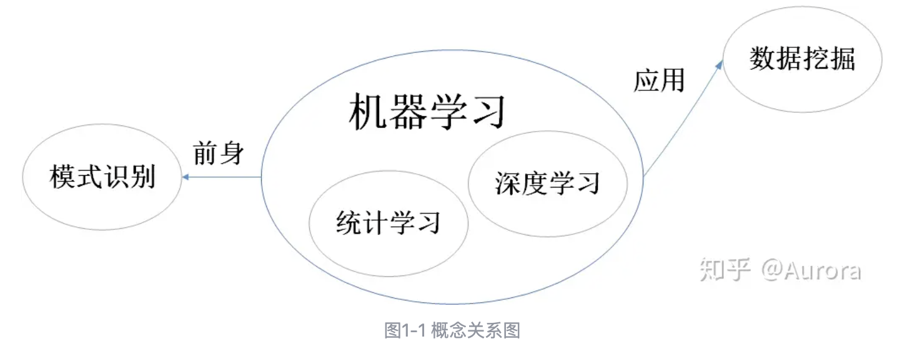
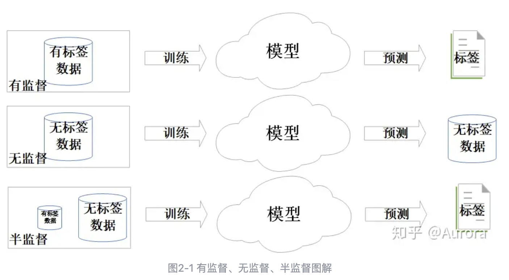
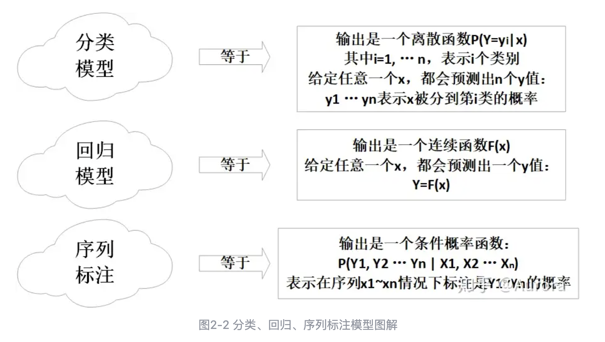

https://zhuanlan.zhihu.com/p/82571138

## 一、 概念理解

在机器学习初期，我们经常会接触一些概念，比如模式识别，统计学习，数据挖掘，机器学习，深度学习...。在我们看来这些概念好像都在讲同样的算法，那它们之间有什么区别呢？

首先我们可以先给这些概念下一个简单的定义：

- 模式识别：根据给定的特征对对象的模式进行分类，是用于决策系统的重要部分。
- 机器学习：机器学习算法是一类从数据中自动分析获得规律，并利用规律对未知数据进行预测的算法。
- 统计学习：根据经验数据构建概率统计模型并运用模型对数据进行预测与分析的一门学科。
- 深度学习：是一种以人工神经网络为架构，对数据进行表征学习的算法。深度学习能够自主提取对象的特征。
- 数据挖掘：识别出海量数据中有效的、新颖的、潜在有用的、最终可理解的模式的非平凡过程（有价值/规律的信息）。

单从定义上来说，我们还是不能够直观的区分这些概念。下面我们用西瓜的例子来对这几个概念进行区分。假设我们刚刚从计算机专业毕业，但是由于就业形势不佳，我们被迫回老家做了瓜农。我们发现做瓜农需要有丰富的经验才能在不破坏瓜的情况下挑出那些好瓜，虽然我们并没有丰富的挑瓜经验，但是我们希望能够利用学到的计算机知识制作一个机器来帮助我们挑瓜，这样就能大大加快效率。于是，我们想到去向有经验的瓜农请教，得知：声音脆的，颜色淡的，纹理稀疏的瓜是好瓜的概率大，于是我们就可以设计一个机器，当我输入这几个参数时，机器会告诉我们这个瓜是不是好瓜。这个时候机器单纯给了我们一个识别的结果，但是后续的事情（比如如何给这个瓜定一个合适的售价）需要我们自己完成。【以上的过程可以认为是模式识别的过程】。一阵高兴之后，我们发现，我们对瓜的定价也是一无所知，于是我们又想让机器帮我们完成这个任务，那么现在，我们需要采集历史价格信息，比如瓜的质量，出售时间，以及地域等都会影响瓜的价格，我们希望机器能够从这些数据中学习出一个模型，然后用这个模型可以直接判别瓜的好坏，并给瓜定价，这样机器本身就可以胜任瓜农的角色了。【以上的过程可以认为是机器学习的过程】。那么这个机器应该怎么建立预测模型呢？我们很容易会想到使用统计学的方法，比如根据历史经验，我们认为出现次数多的情况更加接近真实情况（比如声音脆的瓜往往是好瓜，价格要高一点儿，于是我们可以给这个特征一个大的权重），那些出现少的情况自然会被分一个小权重。我们用加权结果来预测结果。【以上过程使用了统计学方法，仍然需要人为提供特征，我们可以认为这是统计学习方法】。但是很快我们发现了一个问题，我们的机器并没有老瓜农的判断精确，于是我们又去请教了老瓜农。这次我们发现其实除了这些主要特征之外，还会有许多细节或者是组合出现的特征都会影响瓜的判断，就拿最简单的颜色深浅来说，色度可以划分到很细（不单单是深浅两种可能），而且当有其他特征和颜色同时出现时，同一种颜色可能也会有不同的结果。甚至老瓜农还说，有时候他们会靠直觉来判断瓜的好坏。这样一来，我们很难人工建立一个这么健全的模型，还好我们学过神经网络模型可以自己提取到数据的特征，于是我们使用了神经网络模型，只需要将瓜的照片数据，声音数据，价格数据喂给模型，模型会自动从当中抽取出特征，然后再做出判断。【这个过程可以认为是深度学习模型】。

总结来说，模式识别是机器学习的前身，它只能完成模式分类的任务，重心放在能够正确识别模式上。机器学习则侧重于能够利用已有的经验知识预测未知的结果，重心放在预测结果精准度上，可以是分类问题也可以是回归问题。统计学习和深度学习是两种基于不同方法的机器学习。数据挖掘则是在海量的数据中找出有价值的信息，它的输出形式和机器学习略有区别（对于有模式的数据，可以学习出数据的模式分类；对于有一定发展规律的数据，可以学习出数据发展的回归函数；对于相关的数据，可以学习出数据之间的关联关系...），侧重点是在已有的海量数据中发现有价值的信息，不在预测未来数据上。用一个关系图来表示它们的关系如下：

## 二、机器学习方法的分类

机器学习方法按照不同的属性可以划分为不同的类别。比如：

- 按照是否需要标签样本分类，可以将模型分为以下几类：有监督模型，无监督模型和半监督模型。

* 按照模型预测结果类型划分，可以将模型分为以下几类：分类模型，回归模型，序列标注模型。

* 按照最终学到的模型类型划分，有监督模型又可以分为：判别式模型和生成式模型。判别式模型本身学到的就是一个条件概率函数P(Y|X)或者判别函数Y=f(X)，根据输入X可以直接输出分类或分类的概率（如 决策树，支持向量机，逻辑回归等）；生成式模型学到的内容是一个联合概率密度函数P(X,Y), 需要通过P(X,Y)/P(X)计算得到条件概率函数P(Y|X)（如 朴素贝叶斯和隐马尔可夫模型等）。

本系列中我将会把这些模型按照模型本身的原理进行分类和学习，主要目的是为了便于对比理解，结构看起来清晰一点儿，可能分类会有一定的不当之处。

- 按照模型原理，可以划分为：基于距离的回归分类模型，基于树结构的回归分类模型，基于划分超平面的回归分类模型，基于概率图的分类回归模型，和基于神经网络的回归分类模型。

1. 基于距离的模型：往往利用样本之间的度量距离来描述样本间的相似性，进而完成下游分类回归任务。如，KNN以及部分聚类算法。
2. 基于树结构的模型：以决策树为基本单元构建的模型。如，决策树以及以树模型构成的集成学习方法和提升学习方法。
3. 基于划分超平面的模型：模型的核心是寻找一个划分超平面，在此基础上完成分类任务。如SVM和逻辑回归。
4. 基于概率图的模型：以概率图为基础构建的模型。如，贝叶斯网络，HMM和CRF。
5. 基于神经网络的模型：以神经元为基本单元构建的模型。如，感知机，MLP，卷积神经网络和循环神经网络。

## 三、机器学习方法的三要素

这一节的内容主要来自于《统计学习方法》，机器学习方法的三要素是模型，策略和优化算法。

3.1 模型

模型就是所要学习的条件概率分布或者决策函数，由模型的结构和参数共同构成。模型结构可以理解为函数形式或者是概率图（比如选择n次线性方程作为模型结构或者n层神经网络作为模型机构），当结构确定下来之后，参数的个数也会随之确定下来。因为每一组参数都构成一个模型，所以无数的参数可能取值就构成了无数个备选的模型。所有的模型构成了假设空间。参数的变化空间也叫参数空间。

模型的假设空间包含所有可能的模型，一般为无穷多个。模型的训练过程就是在假设空间中找到一个最优解。

3.2 策略

策略可以理解为评价模型优劣的方法，具体来说是通过评价模型预测结果优劣来判定模型优劣的方法。这里引入两个函数，一个是损失函数，一个是风险函数。

- 损失函数：描述预测结果和真实的结果之间的误差，损失函数越小，模型越好。常见的几种损失函数如下：

