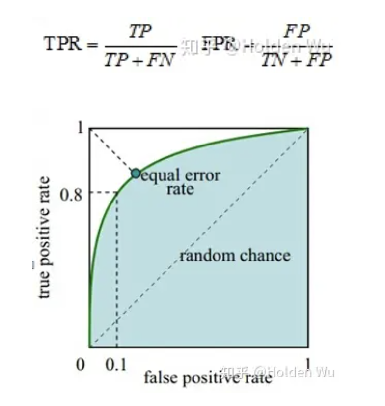

https://zhuanlan.zhihu.com/p/82571138

## 一、 概念理解

在机器学习初期，我们经常会接触一些概念，比如模式识别，统计学习，数据挖掘，机器学习，深度学习...。在我们看来这些概念好像都在讲同样的算法，那它们之间有什么区别呢？

首先我们可以先给这些概念下一个简单的定义：

- 模式识别：根据给定的特征对对象的模式进行分类，是用于决策系统的重要部分。
- 机器学习：机器学习算法是一类从数据中自动分析获得规律，并利用规律对未知数据进行预测的算法。
- 统计学习：根据经验数据构建概率统计模型并运用模型对数据进行预测与分析的一门学科。
- 深度学习：是一种以人工神经网络为架构，对数据进行表征学习的算法。深度学习能够自主提取对象的特征。
- 数据挖掘：识别出海量数据中有效的、新颖的、潜在有用的、最终可理解的模式的非平凡过程（有价值/规律的信息）。

单从定义上来说，我们还是不能够直观的区分这些概念。下面我们用西瓜的例子来对这几个概念进行区分。假设我们刚刚从计算机专业毕业，但是由于就业形势不佳，我们被迫回老家做了瓜农。我们发现做瓜农需要有丰富的经验才能在不破坏瓜的情况下挑出那些好瓜，虽然我们并没有丰富的挑瓜经验，但是我们希望能够利用学到的计算机知识制作一个机器来帮助我们挑瓜，这样就能大大加快效率。于是，我们想到去向有经验的瓜农请教，得知：声音脆的，颜色淡的，纹理稀疏的瓜是好瓜的概率大，于是我们就可以设计一个机器，当我输入这几个参数时，机器会告诉我们这个瓜是不是好瓜。这个时候机器单纯给了我们一个识别的结果，但是后续的事情（比如如何给这个瓜定一个合适的售价）需要我们自己完成。【以上的过程可以认为是模式识别的过程】。一阵高兴之后，我们发现，我们对瓜的定价也是一无所知，于是我们又想让机器帮我们完成这个任务，那么现在，我们需要采集历史价格信息，比如瓜的质量，出售时间，以及地域等都会影响瓜的价格，我们希望机器能够从这些数据中学习出一个模型，然后用这个模型可以直接判别瓜的好坏，并给瓜定价，这样机器本身就可以胜任瓜农的角色了。【以上的过程可以认为是机器学习的过程】。那么这个机器应该怎么建立预测模型呢？我们很容易会想到使用统计学的方法，比如根据历史经验，我们认为出现次数多的情况更加接近真实情况（比如声音脆的瓜往往是好瓜，价格要高一点儿，于是我们可以给这个特征一个大的权重），那些出现少的情况自然会被分一个小权重。我们用加权结果来预测结果。【以上过程使用了统计学方法，仍然需要人为提供特征，我们可以认为这是统计学习方法】。但是很快我们发现了一个问题，我们的机器并没有老瓜农的判断精确，于是我们又去请教了老瓜农。这次我们发现其实除了这些主要特征之外，还会有许多细节或者是组合出现的特征都会影响瓜的判断，就拿最简单的颜色深浅来说，色度可以划分到很细（不单单是深浅两种可能），而且当有其他特征和颜色同时出现时，同一种颜色可能也会有不同的结果。甚至老瓜农还说，有时候他们会靠直觉来判断瓜的好坏。这样一来，我们很难人工建立一个这么健全的模型，还好我们学过神经网络模型可以自己提取到数据的特征，于是我们使用了神经网络模型，只需要将瓜的照片数据，声音数据，价格数据喂给模型，模型会自动从当中抽取出特征，然后再做出判断。【这个过程可以认为是深度学习模型】。

总结来说，模式识别是机器学习的前身，它只能完成模式分类的任务，重心放在能够正确识别模式上。机器学习则侧重于能够利用已有的经验知识预测未知的结果，重心放在预测结果精准度上，可以是分类问题也可以是回归问题。统计学习和深度学习是两种基于不同方法的机器学习。数据挖掘则是在海量的数据中找出有价值的信息，它的输出形式和机器学习略有区别（对于有模式的数据，可以学习出数据的模式分类；对于有一定发展规律的数据，可以学习出数据发展的回归函数；对于相关的数据，可以学习出数据之间的关联关系...），侧重点是在已有的海量数据中发现有价值的信息，不在预测未来数据上。用一个关系图来表示它们的关系如下：


## 二、机器学习方法的分类

机器学习方法按照不同的属性可以划分为不同的类别。比如：

- 按照是否需要标签样本分类，可以将模型分为以下几类：有监督模型，无监督模型和半监督模型。


* 按照模型预测结果类型划分，可以将模型分为以下几类：分类模型，回归模型，序列标注模型。


* 按照最终学到的模型类型划分，有监督模型又可以分为：判别式模型和生成式模型。判别式模型本身学到的就是一个条件概率函数P(Y|X)或者判别函数Y=f(X)，根据输入X可以直接输出分类或分类的概率（如 决策树，支持向量机，逻辑回归等）；生成式模型学到的内容是一个联合概率密度函数P(X,Y), 需要通过P(X,Y)/P(X)计算得到条件概率函数P(Y|X)（如 朴素贝叶斯和隐马尔可夫模型等）。

本系列中我将会把这些模型按照模型本身的原理进行分类和学习，主要目的是为了便于对比理解，结构看起来清晰一点儿，可能分类会有一定的不当之处。

- 按照模型原理，可以划分为：基于距离的回归分类模型，基于树结构的回归分类模型，基于划分超平面的回归分类模型，基于概率图的分类回归模型，和基于神经网络的回归分类模型。

1. 基于距离的模型：往往利用样本之间的度量距离来描述样本间的相似性，进而完成下游分类回归任务。如，KNN以及部分聚类算法。
2. 基于树结构的模型：以决策树为基本单元构建的模型。如，决策树以及以树模型构成的集成学习方法和提升学习方法。
3. 基于划分超平面的模型：模型的核心是寻找一个划分超平面，在此基础上完成分类任务。如SVM和逻辑回归。
4. 基于概率图的模型：以概率图为基础构建的模型。如，贝叶斯网络，HMM和CRF。
5. 基于神经网络的模型：以神经元为基本单元构建的模型。如，感知机，MLP，卷积神经网络和循环神经网络。


## 三、机器学习方法的三要素

这一节的内容主要来自于《统计学习方法》，机器学习方法的三要素是模型，策略和优化算法。

3.1 模型

模型就是所要学习的条件概率分布或者决策函数，由模型的结构和参数共同构成。模型结构可以理解为函数形式或者是概率图（比如选择n次线性方程作为模型结构或者n层神经网络作为模型机构），当结构确定下来之后，参数的个数也会随之确定下来。因为每一组参数都构成一个模型，所以无数的参数可能取值就构成了无数个备选的模型。所有的模型构成了假设空间。参数的变化空间也叫参数空间。

模型的假设空间包含所有可能的模型，一般为无穷多个。模型的训练过程就是在假设空间中找到一个最优解。

3.2 策略

策略可以理解为评价模型优劣的方法，具体来说是通过评价模型预测结果优劣来判定模型优劣的方法。这里引入两个函数，一个是损失函数，一个是风险函数。

- 损失函数：描述预测结果和真实的结果之间的误差，损失函数越小，模型越好。常见的几种损失函数如下：


- 风险函数：对损失函数求平均。如果我们按照样本分布的概率密度对损失函数做加权的平均，那么得到的结果是期望风险。如果我们将样本平等看待，直接对损失函数求平均，那么得到的结果是经验风险。实际应用当中样本分布往往未知，所以一般会使用经验风险函数。

最优模型应该做到以下两点，经验风险最小和结构风险最小。

- 经验风险最小：经验风险函数在上面已经提到过，最优模型需要使得经验风险最小。可以理解为在确定的模型结构下选择最有的参数组合使模型达到最优。
- 结构风险最小：结构风险可以理解为通过调整模型结构使得模型达到最优。（通过上面的描述，我们可以发现模型结构往往是在训练前就被人为指定好了，但是我们并不能保证指定的结构就比其他的结构要好，为了防止选择太离谱的结构，引入了结构风险。）结构在这里可以理解为参数的规模，参数越多结构越复杂，所以我们需要通过一种方法来控制结构的复杂性，选择出最合适的结构规模。这种办法就是正则化方法。后面会具体讲到。

3.3 优化算法

优化算法是指如何找到最优解的方法，不仅仅局限于我们都听过的梯度下降算法。比如，对于连续可导函数，可以直接通过求导求最优解。当函数过于复杂，参数过多时，求导方法往往不太实用，我们通常采用梯度下降的方法来逼近最优解（可能永远得不到最优解）。另外在概率图模型当中，也可以用极大似然估计的方法来获得最优解，也可是实用EM算法来求解带有隐藏变量的最优化问题。此外，还有一些带约束的最优化问题（如SVM求解），拉格朗日乘子法方法求解等等。具体的算法细节在后续章节中会一一讲到。

总结来看，模型是定义了解空间，策略定义了什么是最优解，优化算法是在解空间中寻找最优解的方法。三者结合就能够完整的求解出一个问题的最优解。


## 四、模型评估&选择

在第三节中，我们提到经验风险函数（或叫经验误差）可以来评估一个模型的优劣。实际上，在给定训练数据集的情况下，只要模型的复杂度足够高，我们总能把经验误差降低到0（比如我们建一个足够复杂的决策树，每个叶节点只有一个样本，对应输出是正确结果），那么这个模型是最优解吗？显然并不是。这种模型不具备预测新数据的能力，我们称这种模型“过拟合”了。与过拟合对应的是“欠拟合”，指模型学习能力低，不能够胜任任务，不能达到一个理想的精度（精度=1-错误率）。


那么，评估过程应该怎么实际操作呢？一个直观的想法就是我们从训练集中抽出一部分作为测试集（测试集应该尽量不在训练过程中使用），在模型训练完成后，用测试集来进行验证，测试模型在未知数据上的表现。下面介绍三种抽取测试集的方法。

- 留出法：直接将标注数据集划分成训练集合测试集两个互斥的部分，一般训练集占2/3~4/5，剩余的作为测试集。这种方法比较简单，但是有一部分标记数据没有参与训练，会造成一定的浪费。
- 交叉验证法：对标记数据多次使用留出法（每次都选择不同的划分），最后用多次划分结果中测试集表现的平均值作为测试结果。这样保证了全部数据都参与了运算，而且每次的测试集合训练集是互斥的。
- 自助法：采用有放回的抽样方法，在m个样本中抽出m个样本作为训练集，将始终没有抽到的样本作为测试集。每次不被抽到的概率是1-1/m，m次都没有被抽到的概率是0.368.这个比例也刚好合适做测试集。


有了评估方法之后，我们应该制定一个标准来筛选优秀的模型。那么应该怎么度量一个模型的性能呢？对于回归任务来说主要使用的是均方误差：


分类问题的度量相对比较复杂，下面介绍几种常见的方法：

- ***错误率与精度***：错误率为预测错误的数量占总样本的比重，用E(f;D)表示；精度为预测正确的数量占总样本的比重，用Acc(f;D)表示。当样本分布不对称时，这种平均方法往往没有实际价值。（比如一百个样例中有98个正例，2个反例，那么模型不需要任何训练，直接输出正，精度就能达到98%，这显然是不合理的）


* 查准率、查全率与F1：为了避免上面描述的缺陷，引入F1评分。首先所有的预测样本一定属于真正例（预测和实际都为正例）、假正例（预测为正例，实际为反例）、真反例（预测和实际都为反例）、假反例（预测为反例，实际为正例）四种情况中的一种。且TP+FP+TN+FN=样本总数。定义查准率P=TP/(TP+FP)和查全率R=TP/(TP+FN)。


当模型固定后，我们可以通过调节分类阈值来改变查准率和查全率，我们会发现这两个值是一组矛盾的度量，当一个值变大时，另一个值会相应的减小。通过不断改变阈值，我们会得到这个模型的一条P-R曲线。不同的模型会有不同的P-R曲线。曲线与坐标轴包围的面积越大，说明模型越好。


通过计算面积来比较模型优劣还是有点麻烦，我们可以用一个公式来等价描述这个性能度量，这就是F1度量。


* ***ROC与AUC***：ROC是一条曲线（图中的绿色曲线），AUC是曲线与轴边界围成的面积（图中阴影面积）。ROC与上面的P-R曲线的获得方法完全一样，只不过是横纵坐标轴不同，P-R曲线的横纵坐标轴分别是查全率和查准率。ROC曲线的横坐标轴是假正例率（用FPR表示），纵坐标轴是真正例率（用TPR表示）。AUC可以通过积分来求解，值越大，模型越好。



* ***代价敏感错误率与代价曲线***：在实际生活中，把正例识别成反例，和把反例识别成正例往往造成的损失是不同的，不如把良性肿瘤误判成恶性肿瘤不会造成患者丧失生命，然而如果我们把恶性肿瘤误诊成良性，往往会错过最佳的治疗时间，造成不可挽回的损失。所以这两种错误往往代价不同。那么我们在计算误差时，需要对不同的情况分配一个权重，此时计算的错误率称作代价敏感错误率。


代价曲线将代价因素考虑曲线生成的过程当中，可以直接在图中反应出模型的期望总代价。

到现在，看起来我们只需要比较性能度量的大小就能选择最优模型了，但是实际中仍然需要考虑一个问题：我们计算的误差都是在测试集上计算的，测试集上的误差能代表真实数据的误差（或叫泛化误差）吗？虽然两个误差相关性很大，但是并不能够完全相互取代。我们只能先假设测试误差=泛化误差，然后用“假设检验”的方法来验证这个假设的可信度，当可信度超过一定的阈值（或在接受域内）时，我们就可以认为测试误差近似等于泛化误差。那怎么验证这个假设呢？下面会介绍几种方法。

- 二项检验：计算泛化误差被估计成测试误差的概率分布P：


该分布服从二项分布，取显著度a(一般为0.05-0.1)，当P(泛化误差<=测试误差)>=1-a时，我们就认为假设是可以接受的。

- t检验：重复多次留出法后，我们会得到多个测试误差，然后套用t检验的公式，用采样的方差来近似实际方差，然后再检验均值假设。


选取取显著度a，当P(-测试误差<=泛化误差<=测试误差)>=1-a时，我们就认为假设是可以接受的。

- 交叉验证t检验：使用t分布，在同一数据集上验证两个不同模型A和B是否性能相当。（如果不相当，平均误差率小的模型效果好）。
- McNemar检验（一种卡方检验）：使用卡方分布，在同一数据集上验证两个不同模型A和B是否性能相当。（如果不相当，平均误差率小的模型效果好）。
- Friedman检验：在多数据集、多算法模型上判断假设“所以算法的性能相同”是否成立。
- Nemenyi后续检验：当Friedman检验拒绝了“所以算法的性能相同”这个假设后，我们需要使用Nemenyi后续检验来做进一步的验证，判断算法之间两两的差异性。

> 方差和偏差：这两个概念可以帮助我们理解影响泛化误差的原因。泛化误差分解得到：


> 也就是说，泛化误差可以分解为偏差、方差和噪声三个部分。**偏差**度量了学习算法的期望预测与真实结果的偏离程度，即刻画了学习算法本身的拟合能力；**方差**度量了同样大小的训练集的变动所导致的学习性能的变化，即刻画了数据扰动造成的影响；**噪声**则表达了在当前任务上任何学习算法所能达到的期望泛化误差的下界，即刻画了学习问题本身的难度。


## **五、模型的泛化能力&正则化方法**

泛化能力是指模型在未知的新数据上的预测表现。在新数据上表现好的模型泛化能力强，是优秀的模型。上一节当中的过拟合和欠拟合都会降低模型的泛化能力，所以要想提高模型的泛化的能力需要防止这两种情况的发生。

欠拟合发生是因为训练不充分，或者模型复杂度小，参数少，学习能力不足，只需要多训练几轮，或者更换复杂度高的模型重新训练直到模型收敛为止。

过拟合发生是因为过度学习，将一些不太重要的因素统统学习到，导致模型在训练集上表现异常准确，但是在新数据上那些学到的不重要因素极大的干扰了预测的准确性。为了解决这个问题，前辈们提出了一系列的正则化方法来提过泛化能力。比如使用范数惩罚项，提前停止训练，增强数据集，bagging方法，dropout等等。这些方法在以后的学习中会具体介绍。


## **六、线性回归&线性判别**

### 6.1 线性回归

线性回归是一个回归问题，旨在寻找一条直线来拟合数据的变化规律，从而能够预测数据的结果。数据集使用房价预测这个经典的例子，数据集可以在我的GitHub中获得，地址见文末，数据集一共有506个样本，每个样本有13个特征，一个标签价格。我们先使用线性回归来解决这个问题：（以后默认向量是列向量，向量转置是行向量）


现在样本数据已知，我们需要通过这些数据来求解模型参数W和B。求解的目标是使得损失函数最小。那么优化方法可以使用最小二乘法（数据量和模型都比较简单），也可以使用梯度下降法求解。我们将会使用这两种方法分别求解。在开始推导之前先附上常用的矩阵求导公式：


最小二乘法推导：


如果你之前看过其他的推导，你可能会觉得这个最终形式好像不对，其实有没有转置取决于你默认的数据格式（是一维的还是二维的，是行向量还是列向量）。以上的推导X是二维矩阵，每一列是一个样本，一共m列，Y向量是一维列向量，表示m个结果。

最小二乘法代码实现：

```python3
class LinearRegression:
    def __init__(self, dim, lr):   
        self.thet = []
 
    def fit_lss(self, train_data_x, train_data_y):
        b = np.ones(len(train_data_x))
        x = np.mat(train_data_x)
        x = np.c_[x, b]
        y = np.mat(train_data_y)
        out = (x.T * x).I * x.T * y.T
        self.thet = np.array(out).squeeze()
        return np.array(out).squeeze()

    def predict_lss(self, train_data_x):
        b = np.ones(len(train_data_x))
        x = np.mat(train_data_x)
        x = np.c_[x, b]
        out = self.thet.T.dot(x.T)
        return np.array(out).squeeze()

    def loss_lss(self, train_data_x, train_data_y):
        y = np.mat(train_data_y)
        y_p = np.mat(self.predict_lss(train_data_x))
        out = np.array((y_p-y) * (y_p-y).T).squeeze()
        return out/(2*len(train_data_x))
```

在程序中一定要注意行向量还是列向量，否则计算过程很容易出错。

二乘法有求逆的过程，并不是所有的矩阵都可逆，另外当训练样本很大时，计算速度非常慢，而且不适合曲线求解。梯度下降就比较灵活，但是不能保证是最优解，只能逼近最优解。梯度下降法推导：


梯度下降法代码实现：

```python3
class LinearRegression:
    def __init__(self, dim, lr):
        self.weights = np.zeros(dim)
        self.lr = lr
        self.bias = np.random.randn(1, 1)

    def get_grad(self, train_data_x, train_data_y):
        my_theta = np.mat(np.append(self.weights, self.bias))
        b = np.ones(len(train_data_x))
        x = np.mat(train_data_x)
        x = np.c_[x, b]
        y = np.mat(train_data_y)
        grad = np.array(x.T*(x*my_theta.T-y.T)*self.lr).squeeze()
        return grad

    def update_grad(self, grad):
        self.weights = self.weights - grad[0:13]
        self.bias = self.bias - grad[-1]

    def predict_gd(self, train_data_x):
        my_theta = np.mat(np.append(self.weights, self.bias))
        b = np.ones(len(train_data_x))
        x = np.mat(train_data_x)
        x = np.c_[x, b]
        out = my_theta * x.T
        return np.array(out).squeeze()

    def loss_gd(self, train_data_x, train_data_y):
        y = np.mat(train_data_y)
        y_p = np.mat(self.predict_gd(train_data_x))
        out = np.array((y_p - y) * (y_p - y).T).squeeze()
        return out / (2 * len(train_data_x))
```


### 6.2 线性判别法（LDA）

线性判别是一种分类方法，这里采用红酒分类数据集，数据一共存在三个分类，13个特征，完整数据集可以在我的GitHub上找到。

LDA的思想非常朴素：将所有的样本投影到一条直线上，让同一个类别的样本尽量靠近，让不同类的样本尽量远离。模型学习的目标就是找出这么一条直线。（注意：每条直线只能做到二分类，如果想实现多分类，需要将它们两两之间都找一条这样的直线。）


LDA推导过程：

投影长度在以后可能会经常遇到，这里单独拿出来写一下，以后会直接使用：


推导LDA：


LDA代码实现：

```python3
class LDA:
    def __init__(self, train_x, trian_y):
        self.w12 = []
        self.w13 = []
        self.w23 = []
        self.train_x1 = []
        self.train_x2 = []
        self.train_x3 = []
        self.train_y1 = []
        self.train_y2 = []
        self.train_y3 = []
        self.w12_l1 = 0
        self.w12_l2 = 0
        self.w13_l1 = 0
        self.w13_l3 = 0
        self.w23_l2 = 0
        self.w23_l3 = 0

        for i in range(len(trian_y)):
            if trian_y[i] == 1.0:
                self.train_x1.append(train_x[i])
                self.train_y1.append(1.0)
            if trian_y[i] == 2.0:
                self.train_x2.append(train_x[i])
                self.train_y2.append(2.0)
            if trian_y[i] == 3.0:
                self.train_x3.append(train_x[i])
                self.train_y3.append(3.0)

    def fit(self):
        u1 = np.array(self.train_x1).sum(axis=0)/len(self.train_x1)
        u2 = np.array(self.train_x2).sum(axis=0)/len(self.train_x2)
        u3 = np.array(self.train_x3).sum(axis=0)/len(self.train_x3)
        sum1 = np.mat(np.array(self.train_x1)-np.array(u1)).T * np.mat(np.array(self.train_x1)-np.array(u1))
        sum2 = np.mat(np.array(self.train_x2)-np.array(u2)).T * np.mat(np.array(self.train_x2)-np.array(u2))
        sum3 = np.mat(np.array(self.train_x3)-np.array(u3)).T * np.mat(np.array(self.train_x3)-np.array(u3))
        self.w12 = (sum1 + sum2).I * np.mat(u1 - u2).T
        self.w13 = (sum1 + sum3).I * np.mat(u1 - u3).T
        self.w23 = (sum2 + sum3).I * np.mat(u2 - u3).T
        self.w12_l1 = (self.w12.T * np.mat(u1).T)[0, 0]
        self.w12_l2 = (self.w12.T * np.mat(u2).T)[0, 0]
        self.w13_l1 = (self.w13.T * np.mat(u1).T)[0, 0]
        self.w13_l3 = (self.w13.T * np.mat(u3).T)[0, 0]
        self.w23_l2 = (self.w23.T * np.mat(u2).T)[0, 0]
        self.w23_l3 = (self.w23.T * np.mat(u3).T)[0, 0]

    def predict(self, train_x):
        out = []
        for x in train_x:
            len1 = (self.w12.T * np.mat(x).T)[0, 0]
            if abs(len1-self.w12_l1) < abs(len1-self.w12_l2):
                len3 = (self.w13.T * np.mat(x).T)[0, 0]
                if abs(len3 - self.w13_l1) < abs(len3 - self.w13_l3):
                    out.append(1.0)
                else:
                    out.append(3.0)
            else:
                len2 = (self.w23.T * np.mat(x).T)[0, 0]
                if abs(len2 - self.w23_l2) < abs(len2 - self.w23_l3):
                    out.append(2.0)
                else:
                    out.append(3.0)
        return out

    def loss(self, x, y):
        count = 0
        yy = self.predict(x)
        for i in range(len(y)):
            if yy[i] != y[i]:
                count += 1
        return count
```

上面的推导只是寻找一条投影线的二分类过程，而代码中需要解决三分类的问题。对于多分类的问题，通常有“一对一”，“一对多”，“多对多”几种方式。我们这里采用一对一的方式，即两两之间都寻找这么一条直线，所以一共需要寻找3条直线。

- 一对一：两两分类之间都要求一个投影线，比如对于三分类来说，（1,2）（1,3）（2,3）都划分一遍，先使用（1,2）划分，如果第一类可能性大，在用（1,3），如果第三类可能性大，就分到第三类，依次类推。
- 一对多：将每一个类与剩余的类做划分，比如对于三分类来说。需要找（1，其余）（2，其余）（3，其余）三条投影线，然后将样本分别用这三个分类器划分，划分到第几类的可能性大，就是第几类。
- 多对多：多分类的情况稍微复杂，我们用四分类来解释一下。我们将1,2看做一类，3,4看做一类，找到分类器（1,2 ：3,4）。同样找到分类器（1,3 ：2,4）。然后将样本分别用这两个分类器分类，每个二分类器划分后都给样本一个编号“+”“-”，对于第1类的一个样本，使用（1,2 ：3,4）分类后得到一个编号“+”，使用（1,3 ：2,4）分类后也得到一个编号“+”，那么这个样本的编号为“++”，即“++”表示第一类，同理“+-”表示第2类，“-+”表示第3类，“--”表示第四类。 当然实际中为了提高容错率，会使用多于两个分类器，然后根据编码的相似度来确定和那个分类最相似。这里就不再展开。

这个分类问题中每类的个数相差不大，但是有些数据集（实际情况中多数数据集）存在样本分布不均匀的情况，一个类别的样本占90%以上，而另一个样本只占不到10%。这种数据集往往会降低模型的效果。为了解决这个问题，也有很多的应对方法被提出。实际应用中主要有三类做法：欠采样，过采样和阈值移动。

- 欠采样：对于样本多的一类进行降采样，只随机抽取其中的一部分。
- 过采样：对于样本少的一类进行过采样，重复随机抽取这一类中的样本或采用差值法等方法创造一些和已知样本相似的新数据。
- 阈值移动：假设我们的分类器输出的是二分类中划分为每个类别的概率，当样本均匀分布时，我们认为以0.5为划分界限，划分到某类的概率超过0.5我们就认为应该划分到该类，当样本分布不均匀时，比如某一类只占10%，我们就要上调划分界限，调到0.9，只有较少样本类的划分概率达到0.9以上，我们才将其划分到该类。这种思想就叫做阈值滑动。

------


完整代码参见GitHub

C++实现：[https://github.com/wuhaotianwww/ML_CPP/tree/master_local](https://link.zhihu.com/?target=https%3A//github.com/wuhaotianwww/ML_CPP/tree/master_local)

Python实现：[https://github.com/wuhaotianwww/ML](https://link.zhihu.com/?target=https%3A//github.com/wuhaotianwww/ML)

[下一篇：机器学习基础篇（二）](https://zhuanlan.zhihu.com/p/85154434)

