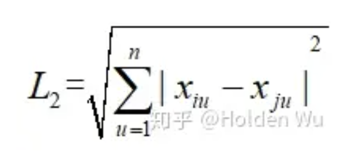
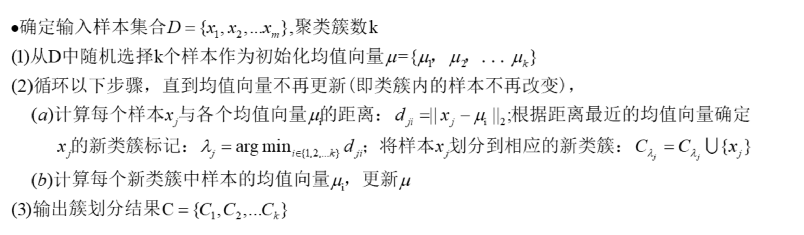

> 机器学习包括统计机器学习方法以及深度学习方法，是实现人工智能的一个重要途径。在人工智能概念火爆的今天，掌握基本的机器学习知识已经成为必然趋势。本系列文章将个人的学习和思考做了整理，希望对机器学习的初学者能有所帮助。由于博主水平有限，难免会存在一些错误，欢迎大家批评指正。
> 本节内容：本节主要总结基于距离的模型。原计划接着上一节内容总结基于超平面的模型，但是公式太多，对于初学者来说不太友好，所以就选择了数学知识不需要太多的基于距离的模型做为第二篇。


## **一、为什么叫基于距离的模型**

当我们翻开书看K近邻和聚类算法这两章内容时会发现，这两章都有一节内容专门来讲距离计算或者距离度量的。因为这类模型用样本之间的距离来描述样本的相似性，从而做出判断。所以距离的度量是这类模型的基础，这也是我将其划分到该类的原因。这一节主要总结K近邻和一些常见的聚类方法。


## **二、距离度量**

距离度量是这类方法的基础，有必要在开始之前对一些常见的距离度量方法先做一个总结。用xi表示第i个样本的向量。

- 闵可夫斯基距离（Minkowski）,也叫Lp距离：


- 当上面公式中p=2时，L2距离也叫欧式距离：



- 当上面公式中p=1时，L1距离也叫曼哈顿距离：


- 夹角余弦：通过两个向量的夹角大小度量相似性。


- 切比雪夫距离：n维空间上两点a(x1,x2……..xn)，b(y1,y2……..yn)的切比雪夫距离公式：


以上几种度量方式使用与有序属性的度量，也就是说特征的取值是有序的，比如{1,2，3}，正是因为这种顺序的存在，我们很容易通过减法来度量它们的距离，但是如果特征取值是{飞机，火车，轮船}，我们就无法通过上面的方法来描述相似性，这时候需要引入无序属性的度量方式。

- 无序属性的度量，VDM距离：


- 汉明距离：两个等长向量之间的汉明距离是两个向量对应位置的不同字符的个数。比如1011101与 1001001 之间的汉明距离是2 。

此外还可以通过以上方式的组合或者加权距离构造一个适合实际场景的新度量。


## **三、K近邻**

K近邻常被应用于分类问题。K近邻的思想非常简单：根据距离样本最近的K个邻居样本的类别标签进行多数表决，表决的结果就是该样本的分类结果。因此K近邻没有一个显示的学习过程。

- 模型：样本的分布空间，在这个空间里能够度量样本的距离。
- 损失：可以采用误分类率。
- 优化：通过调整参数K的值，选择合适的距离度量方式和选择合适的表决方法使得误分类率最小。

距离度量在上面已经总结过，现在讨论一下如何选择K值和选择决策规则。

- K值选择：k值较小容易过拟合，k值较大则会对特征不敏感，降低精度。在实际应用中，k值一般取一个比较小的数值，通常采用交叉验证法来选择最优k值。
- 决策规则：往往采用多数表决法，比较简单，就不做展开了。

KNN算法不仅可以用于分类，还可以用于回归。通过找出一个样本的k个最近邻居，将这些邻居的属性的平均值赋给该样本，就可以得到该样本的属性。更有用的方法是将不同距离的邻居对该样本产生的影响给予不同的权值(weight)，如权值与距离成正比。

该算法在分类时有个主要的不足是，当样本不平衡时，如一个类的样本容量很大，而其他类样本容量很小时，有可能导致当输入一个新样本时，该样本的K个邻居中大容量类的样本占多数。因此可以采用权值的方法（和该样本距离小的邻居权值大）来改进。

该方法的另一个不足之处：K近邻最简单的实现方法就是计算待预测的样本与每个已知样本的距离，当样本数量大时，每次预测还是比较耗时的。可以通过构造kd树(就是k维树，当k=1时就是二叉搜索树)的方法加快模型的计算速度。这种方法的目的是使用特殊的结构存储训练数据，从而减少计算距离的次数。该方法主要分为构建kd树和搜索kd树两个步骤。

构建kd树步骤：


代码实现（采用红酒分类数据集，13维，比较贴近实用下的情况）：

```python3
class TreeNode(object):
    def __init__(self):
        self.left = None
        self.right = None
        self.father = None
        self.feature = []
        self.label = 0


class KNN:
    def __init__(self, dim, k):
        self.dim = dim
        self.k = k
        self.root = None

    def CreateKDTree(self, train, deep):
        if len(train) == 0:
            return None
        root = TreeNode()
        deep = deep % self.dim
        train.sort(key=lambda x: x[deep])
        index = int(len(train)/2)
        while index+1 < len(train) and train[index][deep] == train[index+1][deep]:
            index += 1
        if len(train) != 0:
            root.label = train[index][13]
            root.feature = train[index][0:13]
            root.left = self.CreateKDTree(train[0:index], deep + 1)
            if root.left:
                root.left.father = root
            root.right = self.CreateKDTree(train[index+1:], deep + 1)
            if root.right:
                root.right.father = root
        self.root = root
        return root
```

搜索kd树步骤：


代码实现：

```python
    def getDist(self, x1, x2):
        dist = 0
        for i in range(self.dim):
            dist += (abs(x1[i] - x2[i])*abs(x1[i]-x2[i]))
        return math.sqrt(dist)

    def isTangency(self, node, x, cmp):
        y = node.feature
        for i in range(self.dim):
            if abs(y[i] - x[i]) < cmp:
                return True
        return False

    def dfs(self, node, nodelist):
        if node:
            nodelist.append(node)
        else:
            return nodelist
        if node.left:
            self.dfs(node.left, nodelist)
        if node.right:
            self.dfs(node.right, nodelist)
        return nodelist

    def SearchKDTree(self, x):
        deep = 0
        isfromleft = True
        tempnode = self.root
        while tempnode.right or tempnode.left:
            if x[deep] > tempnode.feature[deep] and tempnode.right:
                tempnode = tempnode.right
            elif tempnode.left:
                tempnode = tempnode.left
            else:
                tempnode = tempnode.right
            if tempnode == None:
                break
            deep = (deep+1) % self.dim

        q = queue.PriorityQueue(maxsize=self.k)
        dist = -1 * self.getDist(tempnode.feature, x)
        q.put((dist, tempnode))
        if tempnode.father.left == tempnode:
            isfromleft = True
        else:
            isfromleft = False
        tempnode = tempnode.father

        while tempnode.father:
            temp = q.get()
            cmp = -1.0*temp[0]
            q.put(temp)
            if self.isTangency(tempnode, x, cmp) or q.qsize() < self.k:
                nodelist = [tempnode]
                if isfromleft:
                    self.dfs(tempnode.right, nodelist)
                else:
                    self.dfs(tempnode.left, nodelist)
                for each in nodelist:
                    dist = -1 * self.getDist(each.feature, x)
                    if q.qsize() == self.k:
                        temp = q.get()
                        tempdist = temp[0]
                        if dist < tempdist:
                            q.put(temp)
                        else:
                            q.put((dist, tempnode))
                    else:
                        q.put((dist, tempnode))

            if tempnode.father.left == tempnode:
                isfromleft = True
            else:
                isfromleft = False
            tempnode = tempnode.father

        out = []
        while q.qsize():
            out.append(q.get()[1].label)
        return out
```

kd树用于分类的完整代码参见GitHub。


## **四、聚类任务和性能度量**

聚类是一种典型的无监督学习方法。也就是说训练样本是没有标记的，聚类算法需要能跟据数据自身的规律自动将样本聚成一簇，从而完成分类任务。聚类算法涉及两个问题：性能度量和距离度量，距离度量上面已经介绍过，这里再介绍一下性能度量。

性能度量也称“有效性指标”。是评价聚类算法性能的方法，性能度量也可以作为聚类过程的优化目标，从而更好地得到符合要求的聚类模型。从直观的角度，我们认为每个类的类内样本距离要紧凑，而不同类之间样本的距离要远大于类内样本的距离，这样我们就能清晰的观察到不同的簇（也就是不同的类）。那么我们怎么用专业术语来描述这种理想的状态呢？这里引入了两个名词：“簇内相似度”和“簇间相似度”。显然簇内相似度高（即簇内样本距离紧凑），簇间相似度低（即簇间样本距离远）的模型性能好。

我们把性能度量分类两大类，一类是将聚类结果与某个参考模型进行比较，称为“外部指标”，另一类是直接考察聚类结果而不利用任何参考模型，称为“内部指标”。


### 4.1 外部指标


### 4.2 内部指标


## **五、原型聚类**

原型聚类假设聚类算法可以通过一组原型（原型指样本空间中具有代表性的点）来刻画，然后不断迭代这个原型就能得到最终结果，下面介绍三种原型聚类方法。


### **5.1 k-means聚类**

聚类过程：



该方法需要事先指定k（如果聚类前k未知，k值也可以通过多次聚类选择最优性能度量结果获得），对初值敏感，对于不同的初始值，可能会导致不同的聚类结果。对于"噪声"和孤立点数据敏感，少量的该类数据能够对平均值产生极大影响。

代码实现：

```python
class KMeans:
    def __init__(self, k, data_x, data_y, dim):
        self.k = k
        self.x = data_x
        self.y = data_y
        self.dim = dim
        self.u1 = data_x[0]
        self.u2 = data_x[int(len(data_x)/2)]
        self.u3 = data_x[len(data_x)-1]

    def getDistance(self, x1, x2):
        dist = 0
        for i in range(len(x1)):
            # dist += (abs(x1[i] - x2[i]) * abs(x1[i] - x2[i]))
            dist += (abs(x1[i] - x2[i]) / (x1[i] + x2[i])) * (abs(x1[i] - x2[i]) / (x1[i] + x2[i])) * 4
        return math.sqrt(dist)

    def onceRepeat(self):
        u1_class = []
        u2_class = []
        u3_class = []
        for each in self.x:
            dist1 = self.getDistance(each, self.u1)
            dist2 = self.getDistance(each, self.u2)
            dist3 = self.getDistance(each, self.u3)
            if dist1 < dist2 and dist1 < dist3:
                u1_class.append(each)
            elif dist2 < dist1 and dist2 < dist3:
                u2_class.append(each)
            elif dist3 < dist1 and dist3 < dist2:
                u3_class.append(each)
        self.u1 = np.sum(u1_class, axis=0)/len(u1_class)
        self.u2 = np.sum(u2_class, axis=0)/len(u2_class)
        self.u3 = np.sum(u3_class, axis=0)/len(u3_class)

    def train(self):
        while True:
            temp1 = self.u1
            temp2 = self.u2
            temp3 = self.u3
            self.onceRepeat()
            if temp1[0] == self.u1[0] and temp2[0] == self.u2[0] and temp3[0] == self.u3[0]:
                break

    def predict(self):
        out = []
        for each in self.x:
            dist1 = self.getDistance(each, self.u1)
            dist2 = self.getDistance(each, self.u2)
            dist3 = self.getDistance(each, self.u3)
            if dist1 < dist2 and dist1 < dist3:
                out.append(1.0)
            elif dist2 < dist1 and dist2 < dist3:
                out.append(2.0)
            elif dist3 < dist1 and dist3 < dist2:
                out.append(3.0)
        return out
```

### **5.2 学习向量-量化**

学习向量量化也叫LVQ，思想仍然是通过迭代的方法来更新一组原型向量，但是它的样本数据是带标签的（也就是监督学习），而且迭代更新过程不是求均值的过程，而是一种类似梯度更新的方式。通过下面的过程可以体会到这一点。

聚类过程：


### **5.3 高斯混合聚类**

与上述两个聚类算法不同，高斯聚类采用概率模型来表达聚类原型。高斯聚类认为每个类都服从一个高斯分布，整个样本空间是由k个参数不同高斯分布混合而成。


求解模型中最重要的环节就是确定参数： 和𝛼,𝜇和Σ 。具体过程如下。

聚类过程：


上述过程中和𝛼,𝜇和Σ的更新公式可能让人感到迷惑，这个公式不像前面LVQ中的公式那么直观，它是怎么来的呢？这个公式的得出使用EM算法，一种优化方法。下面稍微简单的介绍一下。

EM算法是一种迭代算法，用于含有隐变量的概率模型参数的极大似然估计。（隐变量并不是指未知变量，而是深层的变量，与直接观察变量相对。比如一个分布的参数，我们可以直接利用极大似然估计算出这个参数，这叫观察变量，但是当多个分布组合时，组合参数就是一种更加深层的变量，这个变量在观察变量未知时，无法直接通过极大似然估计求解，我们叫隐变量）。EM算法的是期望最大化英文的缩写，顾名思义，EM包含两个主要步骤，E步求期望，M步最大化期望。我们顺着这个思路来推导上面的几个公式。


代码实现：

```python
class GMM:
    def __init__(self, k, dim, data_x, data_y):
        self.k = k
        self.x = data_x
        self.y = data_y
        self.dim = dim
        self.a1 = 0.33
        self.a2 = 0.34
        self.a3 = 0.33
        self.u1 = np.sum(self.x[0:50], axis=0)/50
        self.u2 = np.sum(self.x[60:110], axis=0)/50
        self.u3 = np.sum(self.x[120:170], axis=0)/50
        self.segma1 = np.mat(self.x[0:50]-np.tile(self.u1, (50, 1))).T * np.mat(self.x[0:50]-np.tile(self.u1, (50, 1)))/50
        self.segma2 = np.mat(self.x[60:110]-np.tile(self.u2, (50, 1))).T * np.mat(self.x[60:110]-np.tile(self.u2, (50, 1)))/50
        self.segma3 = np.mat(self.x[120:170]-np.tile(self.u3, (50, 1))).T * np.mat(self.x[120:170]-np.tile(self.u3, (50, 1)))/50

    def gaussian(self, x):
        x = np.mat(x)
        u1 = np.mat(self.u1)
        u2 = np.mat(self.u2)
        u3 = np.mat(self.u3)
        g = abs(np.linalg.det(self.segma1))
        g1 = (1/math.sqrt(math.pow(2*math.pi, self.k)*np.abs(np.linalg.det(self.segma1))))
        g = np.array(-0.5*(x-u1)*self.segma1.I*(x-u1).T).squeeze()
        g1 = g1 *math.exp(-0.5*(x-u1)*self.segma1.I*(x-u1).T)
        g2 = (1/math.sqrt(math.pow(2*math.pi, self.k)*abs(np.linalg.det(self.segma2))))*math.exp(-0.5*(x-u2)*self.segma2.I*(x-u2).T)
        g3 = (1/math.sqrt(math.pow(2*math.pi, self.k)*abs(np.linalg.det(self.segma3))))*math.exp(-0.5*(x-u3)*self.segma3.I*(x-u3).T)
        return g1, g2, g3

    def onceRepeat(self):
        r = []
        for j in range(len(self.x)):
            g1, g2, g3 = self.gaussian(self.x[j])
            temp = []
            temp.append(self.a1 * g1 / (self.a1 * g1 + self.a2 * g2 + self.a3 * g3))
            temp.append(self.a2 * g2 / (self.a1 * g1 + self.a2 * g2 + self.a3 * g3))
            temp.append(self.a3 * g3 / (self.a1 * g1 + self.a2 * g2 + self.a3 * g3))
            r.append(temp)
        r = np.array(r)
        sum = np.sum(r, axis=0)
        self.u1 = np.sum([r[i][0]*np.array(self.x[i]) for i in range(len(self.x))], axis=0)/sum[0]
        self.segma1 = np.mat(np.array(self.x)-np.array(self.u1)).T * np.diag(np.array(r[:, 0:1]).squeeze()) * np.mat(np.array(self.x)-np.array(self.u1))/sum[0]
        self.a1 = sum[0]/len(self.x)

        self.u2 = np.sum([r[i][1]*np.array(self.x[i]) for i in range(len(self.x))], axis=0)/sum[1]
        self.segma2 = np.mat(np.array(self.x)-np.array(self.u2)).T * np.diag(np.array(r[:, 1:2]).squeeze()) * np.mat(np.array(self.x)-np.array(self.u2)) / sum[1]
        self.a2 = sum[1] / len(self.x)

        self.u3 = np.sum([r[i][2]*np.array(self.x[i]) for i in range(len(self.x))], axis=0)/sum[2]
        self.segma3 = np.mat(np.array(self.x)-np.array(self.u3)).T * np.diag(np.array(r[:, 2:3]).squeeze()) * np.mat(np.array(self.x)-np.array(self.u3)) / sum[2]
        self.a3 = sum[2] / len(self.x)

    def train(self, epoch):
        for e in range(epoch):
            self.onceRepeat()

    def predict(self, x):
        g1, g2, g3 = self.gaussian(x)
        if g1 > g2 and g1 > g3:
            return 1.0
        elif g2 > g1 and g2 > g3:
            return 2.0
        elif g3 > g1 and g3 > g2:
            return 3.0
```

## **六、密度聚类和层次聚类**

### **6.1 密度聚类**

基于密度的聚类认为聚类结构能够通过样本分布的紧密程度确定。通常情形下，密度聚类算法从样本密度的角度来考察样本之间的可连接性，并基于可连接样本不断扩展聚类簇以获得最终的聚类结果。

DBSCAN 是一种著君的密度聚类算法，它基于一组"邻域" 参数 (𝜖,𝑚𝑖𝑛𝑃𝑡𝑠) 来刻画样本分布的紧密程度。下面先给出以下聚类算法中需要用到的一些概念：


有了上面的概念，DBSCAN 将"簇"定义为:由密度可达关系导出的最大的密度相连样本集合。

DBSCAN聚类算法的过程：


### **6.2层次聚类**

层次聚类试图在不同层次对数据进行划分，从而形成树形的聚类结构。数据集的划分可以采用“自底向上”的聚类策略，也可以采用“自顶向下”的分拆策略。这里介绍一种采用自底向上聚合策略的层次聚类方法AGNES。AGNES先将数据集中的每个样本看做一类，假设一共有m个数据样本，那么初始时，数据集就被划分成m个类，然后寻找距离最近的两个类，将其合并，得到m-1个类。依次循环上面的步骤，直到得到我们预先设定的k个类为止。

整个过程中最重要的部分就是怎么计算两个类之间的距离，然后选最小距离的两类合并。计算类间距离的方式有很多，比如采用以下三种计算公式：


西瓜书上的这个图还是很直观的反应出了AGNES的聚类过程。


完整代码参见GitHub

C++实现：[https://github.com/wuhaotianwww/ML_CPP/tree/master_local](https://link.zhihu.com/?target=https%3A//github.com/wuhaotianwww/ML_CPP/tree/master_local)

Python实现：[https://github.com/wuhaotianwww/ML](https://link.zhihu.com/?target=https%3A//github.com/wuhaotianwww/ML)

[上一篇：机器学习基础篇（一）](https://zhuanlan.zhihu.com/p/82571138)

下一篇：机器学习基础篇（三）

