机器学习基础 https://zhuanlan.zhihu.com/p/82571138  https://zhuanlan.zhihu.com/p/85154434  

深度学习基础 [https://github.com/scutan90/DeepLearning-500-questions/blob/master/ch03_%E6%B7%B1%E5%BA%A6%E5%AD%A6%E4%B9%A0%E5%9F%BA%E7%A1%80/%E7%AC%AC%E4%B8%89%E7%AB%A0_%E6%B7%B1%E5%BA%A6%E5%AD%A6%E4%B9%A0%E5%9F%BA%E7%A1%80.md](https://github.com/scutan90/DeepLearning-500-questions/blob/master/ch03_深度学习基础/第三章_深度学习基础.md)  

Pytorch基础 [https://datawhalechina.github.io/thorough-pytorch/%E7%AC%AC%E4%BA%8C%E7%AB%A0/index.html](https://datawhalechina.github.io/thorough-pytorch/第二章/index.html)  

Huggingface基础 https://huggingface.co/learn/nlp-course/zh-CN/chapter1/1?fw=pt 

# 机器学习----基础篇（一）

机器学习(Machine Learning, ML)，顾名思义，让机器去学习。这里，机器指的是计算机，是算法运行的物理载体，你也可以把各种算法本身当做一个有输入和输出的机器。那么到底让计算机去学习什么呢？对于一个任务及其表现的度量方法，设计一种算法，让算法能够提取中数据所蕴含的规律，这就叫机器学习。如果输入机器的数据是带有标签的，就称作有监督学习。如果数据是无标签的，就是无监督学习。

### 神经网络

 神经网络就是按照一定规则将多个神经元连接起来的网络。不同的神经网络，具有不同的连接规则。例如全连接(Full Connected, FC)神经网络，它的规则包括：

（1）有三种层：输入层，输出层，隐藏层。

（2）同一层的神经元之间没有连接。

（3）fully connected的含义：第 N 层的每个神经元和第 N-1 层的所有神经元相连，第 N-1 层神经元的输出就是第 N 层神经元的输入。

（4）每个连接都有一个权值。

**神经网络架构** 下图就是一个神经网络系统，它由很多层组成。输入层负责接收信息，比如一只猫的图片。输出层是计算机对这个输入信息的判断结果，它是不是猫。隐藏层就是对输入信息的传递和加工处理。

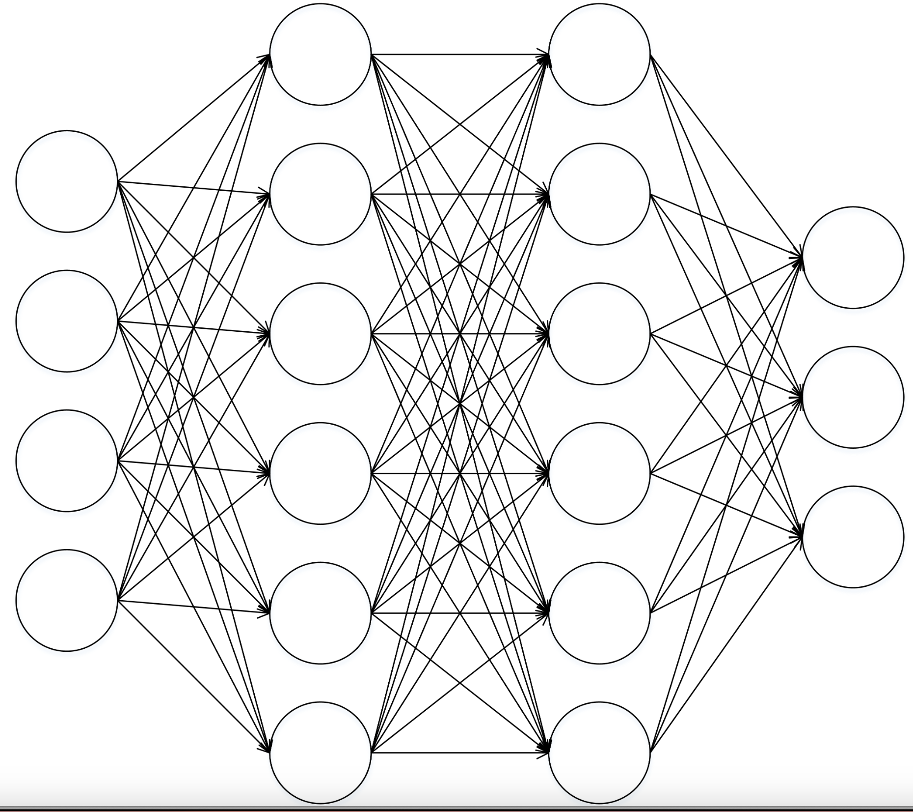

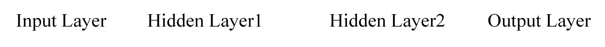

### 常见算法

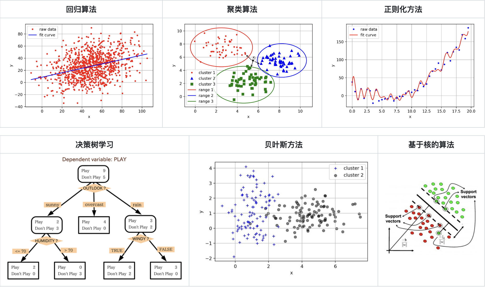

## Fine-Tuning

\- 模型训练（Training）

\- 预训练（Pre-Training）

\- 微调（Fine-Tuning）

\- 轻量化微调（Parameter Efficient Fine-Tuning, PEFT）

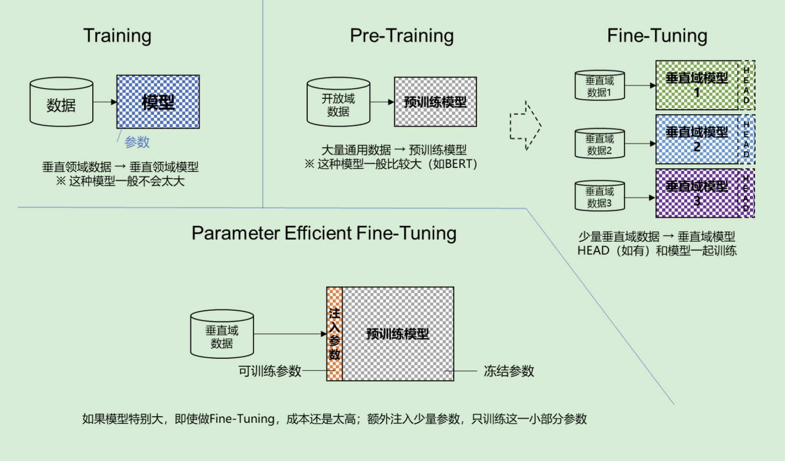

## 模型

模型可以当做一个函数： y = F(x; w)

## 模型训练

本质是求解最优化问题的过程

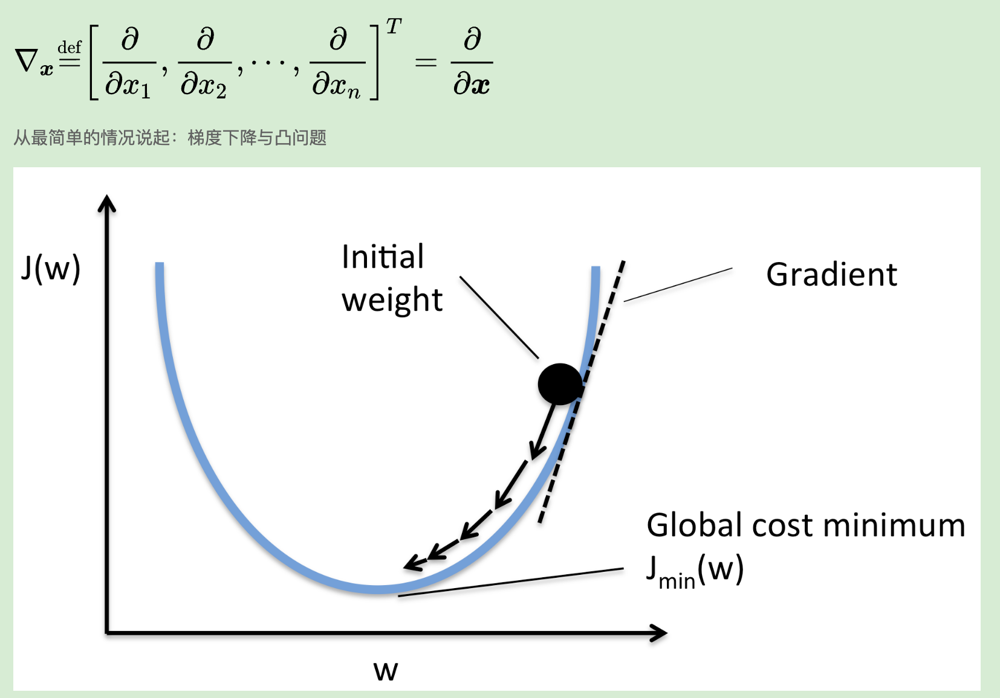

#### 现实1 整个数据集上求梯度，计算量太大

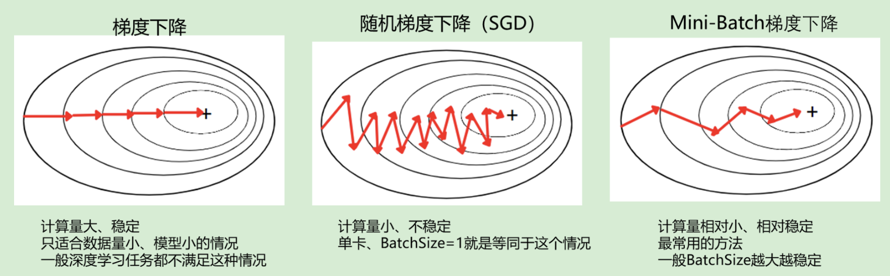

#### 现实2 深度学习没有局部最优解

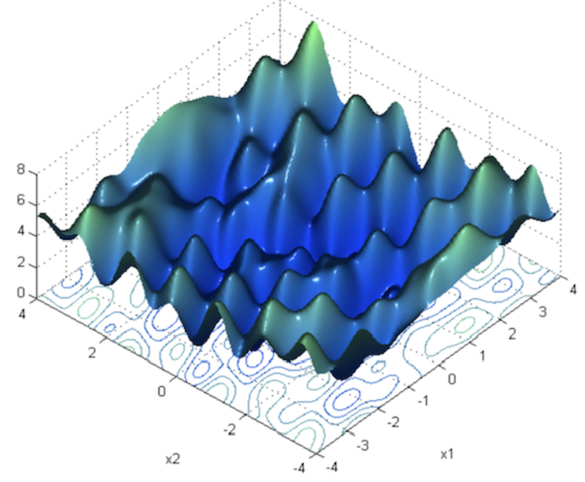

#### 现实3 学习率很关键，甚至需要动态调整

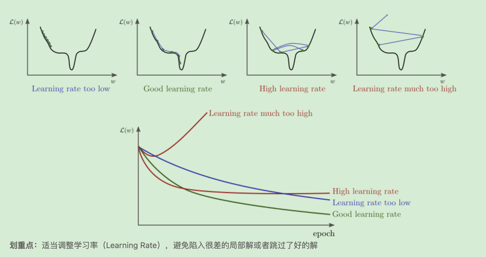

模型量化：

#### 过拟合与欠拟合

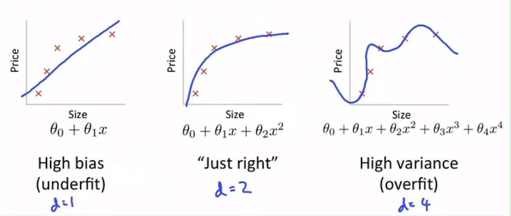

#### 防止过拟合1：Weight Decay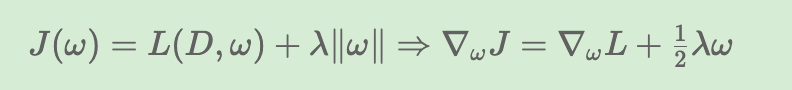

#### 防止过拟合2：Dropout

我们在前向传播的时候，概率性的（临时）删除一部分神经元，这样可以使模型泛化性更强，因为它不会太依赖某些局部的特征。

这样训练$N$次，等价于训练$N$不同的网络，再取平均值；$N$个网络不会同时过拟合于与一个结果，这样平均值的方式能有效减少过拟合的干扰。

#### 防止过拟合3：学习率Warm up

先从一个很小的学习率逐步上升到正常学习率，再稳步减少学习率

* 原理尚未被证明
* 经验主义解释：减缓模型在初始阶段对 mini-batch 的提前过拟合现象，保持分布的平稳
* 经验主义解释：有助于保持模型深层的稳定性

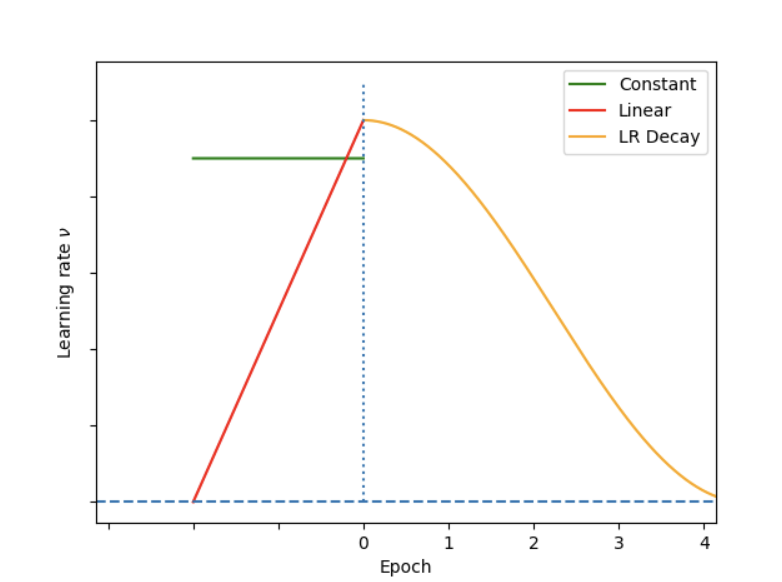

#### 学习率调整策略

\- 开始时学习率大些：快速到达最优解附近

\- 逐渐减小学习率：避免跳过最优解

\- NLP 任务的损失函数有很多“悬崖峭壁”，自适应学习率更能处理这种极端情况，避免梯度爆炸。

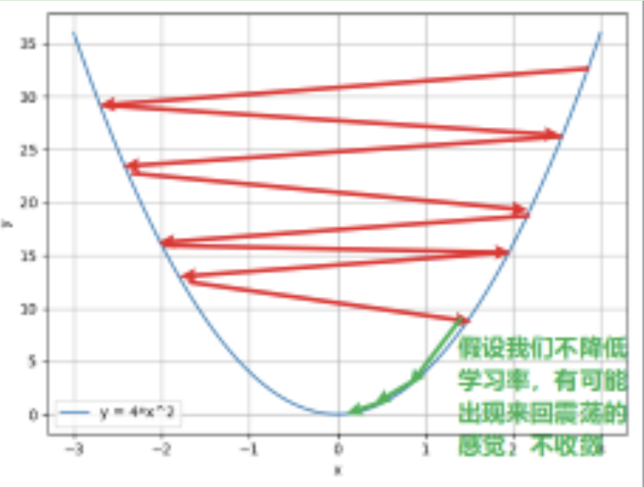

几种常用的学习率调整器：

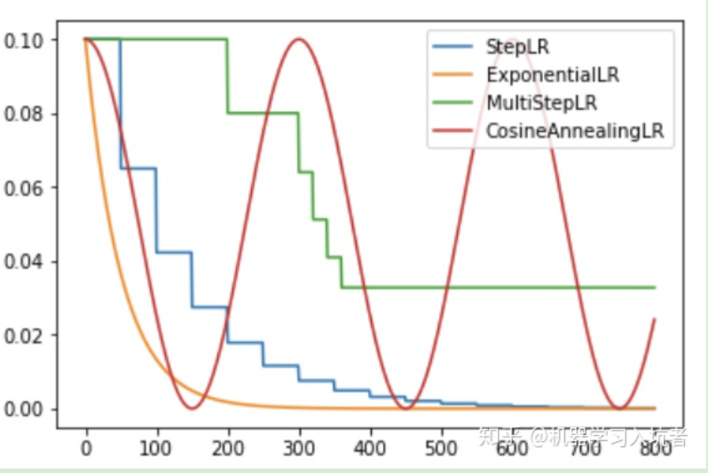

### 模型训练常见参数

* BATCH_SIZE 每一次迭代训练时，模型同时处理的样本数量。训练数据集通常会被分成多个批次进行训练，每个批次包含多个样本。BATCH_SIZE的大小会影响训练的效果和速度。

​		较大的BATCH_SIZE可以提高训练的速度，因为在每个迭代中同时处理更多的样本。同时，较大的批次还可以利用并行计算的优势，加快训练过程。然而，较大的BATCH_SIZE也需要更多的内存和计算资源。

​		较小的BATCH_SIZE可以提供更稳定的梯度估计，因为每个批次的样本更多地代表了整个训练数据集的分布。这有助于避免陷入局部最优解，并提高模型的泛化能力。然而，较小的批次可能导致训练过程更慢，因为需要更多次迭代才能处理完整个数据集。

* EPOCHS 整个数据集跑一遍叫一个epoch
* LR 学习率，设置多少要看经验。太低了训练慢，太高了可能进入如下图状态，梯度无法下降，拿不到最优解。

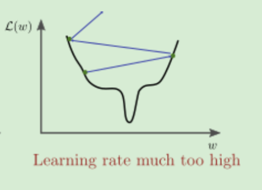

* GAMMA 学习器参数
* WEIGHT_DECAY
* SEED 随机种子，可固定种子让跑一样的流程，让实验可复现

