# 判别式模型vs生成式模型

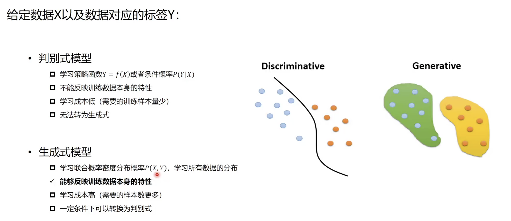

# Autoencoder自编码器

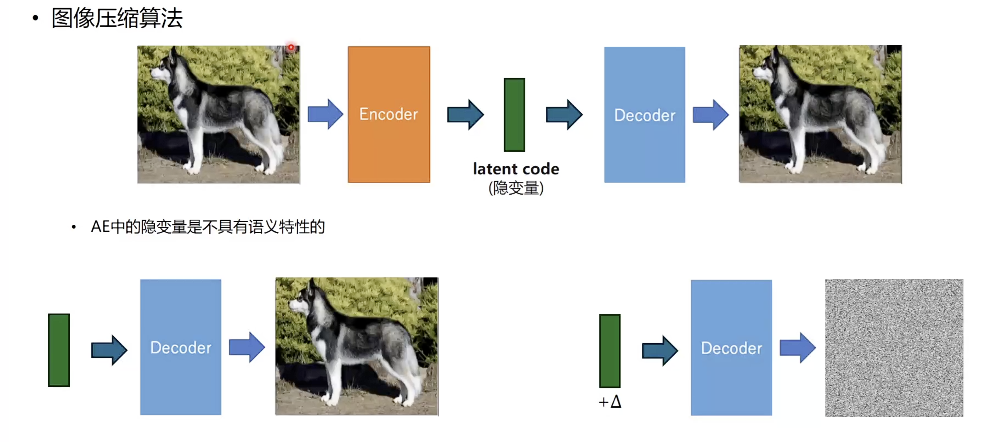

如果加入干扰，还原失败。不可控，不好推广。

# VAE变分自编码器

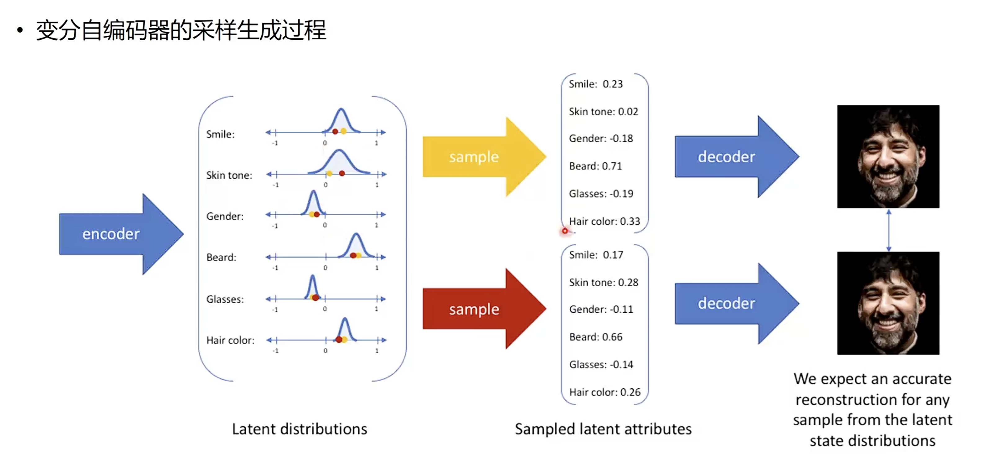

变成N个高斯分布

# 常见的视觉内容生成模型架构

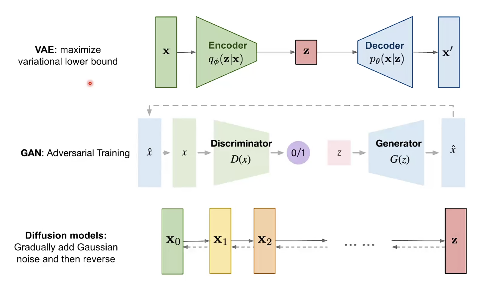

* GAN: 判别器，生成器。

* 扩散模型，灵感来源于非平衡热力学

# 扩散模型

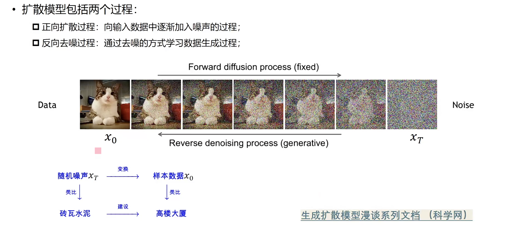

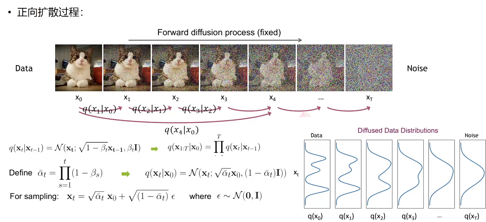

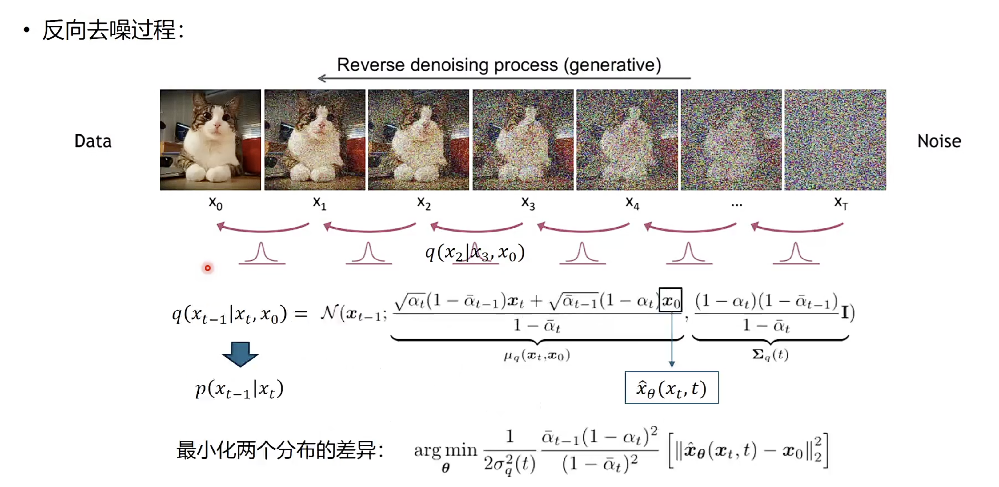

# Rectified Flow简介

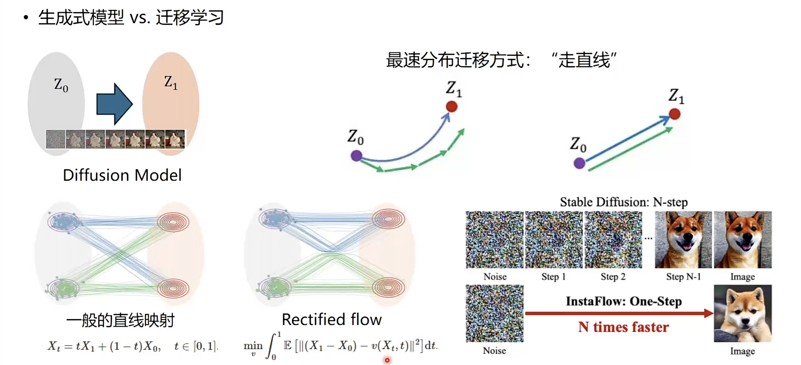

# 扩散模型条件引入

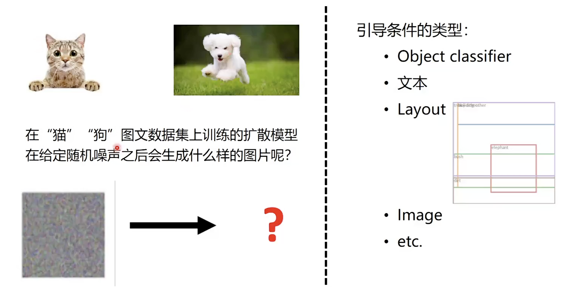

# Stable Diffusion Model 扩散模型结构

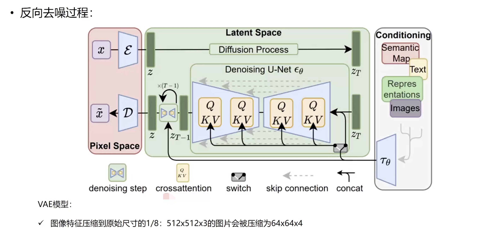

# 多模态Dit - StableDiffusion 3

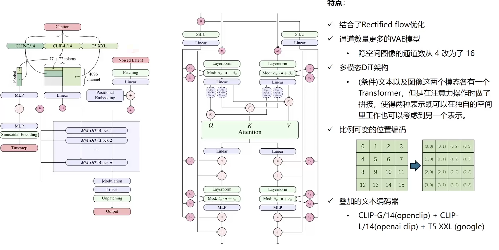

# 多模态Dit - Flux

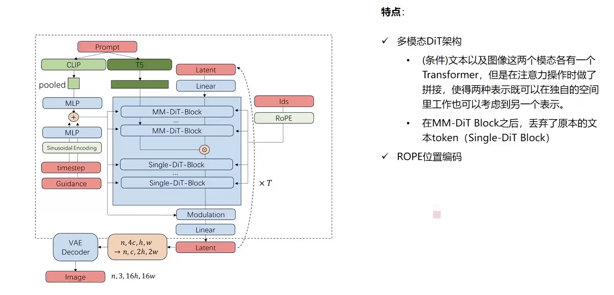

无法全参数量微调。

# 开源文生图版本

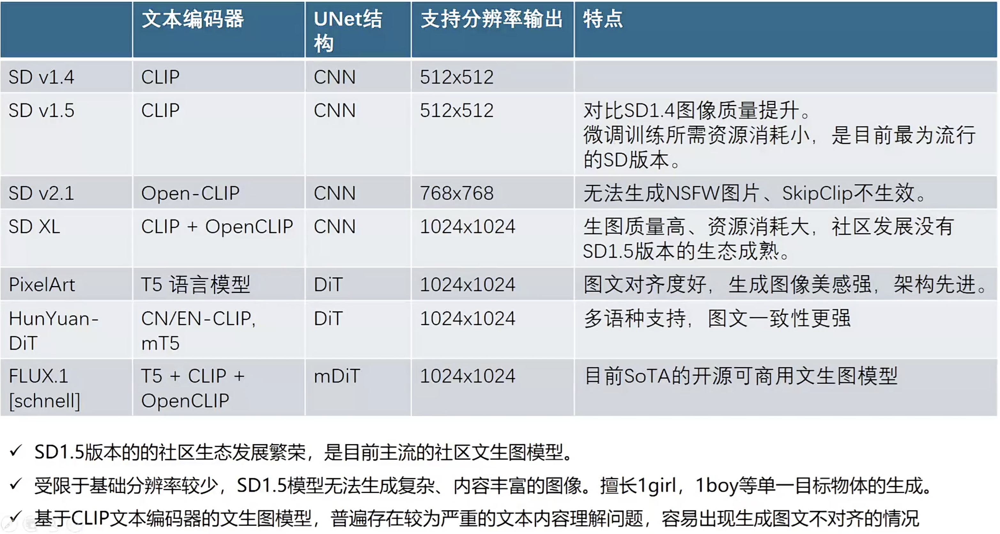

# SD扩展

## 1. 多图像引导图像生成

## 2. 特征注入式引导图像生成 ControlNet

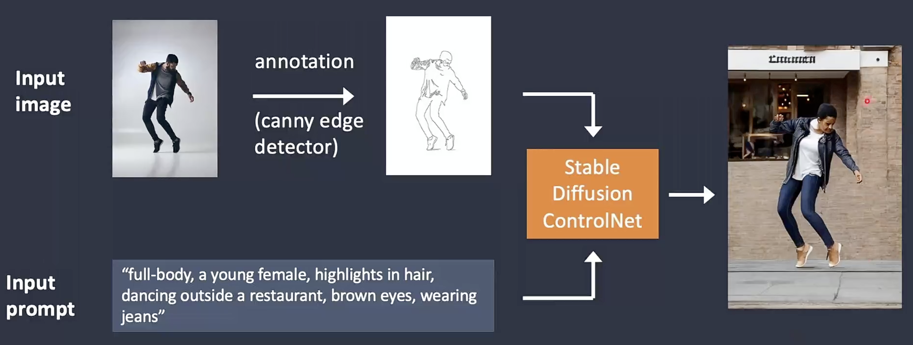

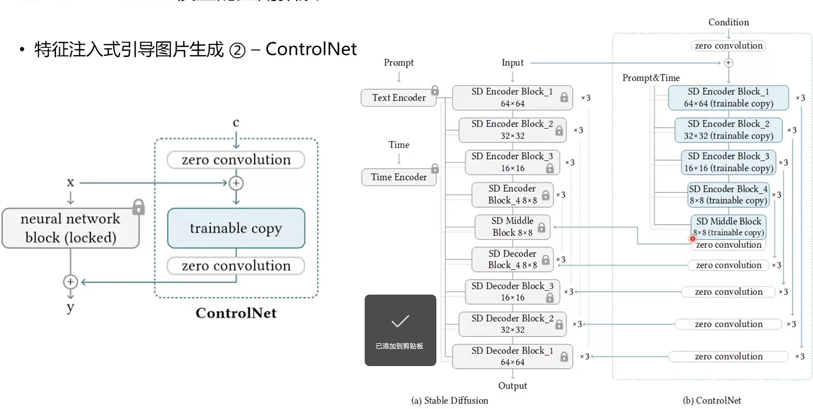

OpenPose

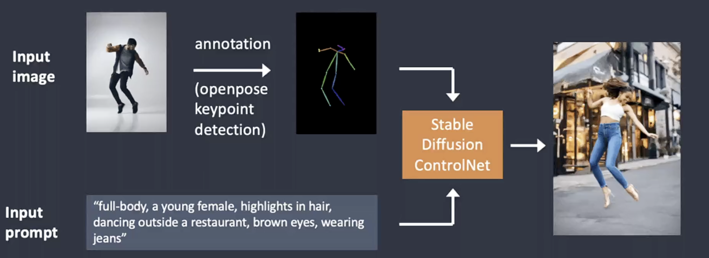

## 3. 特征注入式引导图像生成 IP-Adapter

参考图像风格的生成任务

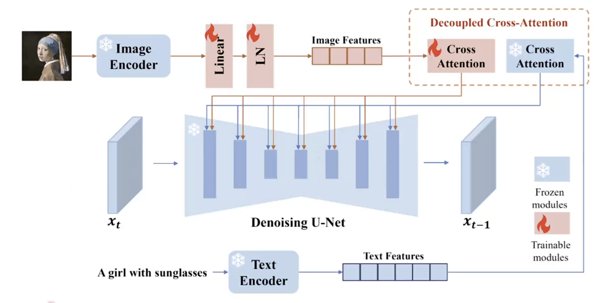

## 4. 特征注入式引导图像生成 InstantID

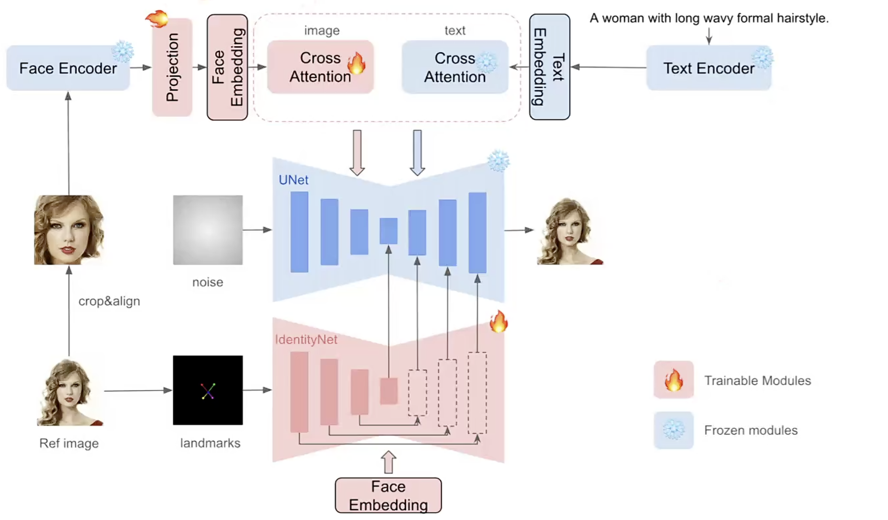

ImageEecoder换成了Face Encoder

代表作品：try-on

