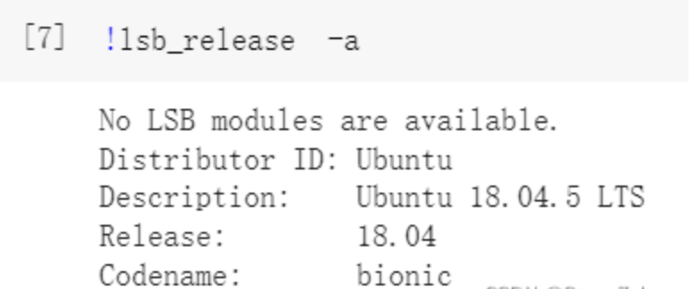

## 背景

一直使用https://github.com/Linaqruf/kohya-trainer 的[Kohya LoRA Dreambooth](https://github.com/Linaqruf/kohya-trainer/blob/main/kohya-LoRA-dreambooth.ipynb) 在Colab中训练LoRA模型。

之前一切安好。在12月14日之后，突然在4.2.1步开始出现警告：output

```shell
CUDA backend failed to initialize: Found cuDNN version 8700, but JAX was built against version 8904, which is newer. The copy of cuDNN that is installed must be at least as new as the version against which JAX was built. (Set TF_CPP_MIN_LOG_LEVEL=0 and rerun for more info.)
```

然后训练的时候说没有了CUDA环境而报错。


## 解决

### Step1

先网上搜索报错的信息。相关的搜索很少，只有一个类似的：https://github.com/google/jax/issues/18027，也没有找到具体线索。

Unable to correct CUDA vs. JAX version mismatch #18027


把“CUDA backend failed to initialize: Found cuDNN version 8700, but JAX was built against version 8904, which is newer.”这个问题抛给ChatGPT。返回如下：


这个错误信息意味着您的CUDA backend无法初始化，因为您的cuDNN版本与JAX的版本不匹配。cuDNN是一个用于加速深度学习计算的CUDA库，而JAX是一个用于自动微分和高性能数值计算的Python库，它可以使用CUDA backend来加速计算。

为了解决这个问题，您可以尝试以下几种方法：

1. **升级cuDNN版本**：您可以尝试升级cuDNN版本到与JAX构建时使用的版本相同的版本。您可以在cuDNN的官方网站上下载并安装适当的版本，然后重新安装JAX。
2. **降级JAX版本**：如果您无法升级cuDNN版本，您可以尝试降级JAX版本到与您的cuDNN版本相同的版本。您可以使用pip来安装特定版本的JAX，例如：`pip install jax==0.2.14`。
3. **更新JAX版本**：如果您的cuDNN版本已经是最新的，您可以尝试升级JAX版本到与您的cuDNN版本相同的版本。您可以使用pip来更新JAX，例如：`pip install --upgrade jax`。

请注意，具体的步骤可能会因您的操作系统、CUDA版本、cuDNN版本和JAX版本而有所不同。如果您仍然遇到问题，请查看JAX和cuDNN的文档，或者参考相关的社区和论坛，以获取更详细的帮助和支持。


### Step2

看起来问题应该是谷歌更新了Colab中的JAX版本，导致默认Colab环境的的cuDNN版本和JAX版本对不上。GPT还贴心的返回了3个解决方案。然后继续问“如果JAX was built against version 8904，Colab上如何升级cuDNN？”，返回如下：


作为 GPT-3.5，我无法直接在 Colab 上执行命令，但是您可以尝试在 Colab 中执行以下步骤来升级 cuDNN：

1. **检查当前 cuDNN 版本**：在 Colab 中，您可以使用以下命令来检查当前的 cuDNN 版本：

   ```python
   !cat /usr/local/cuda/version.txt
   ```

2. **安装适当版本的 cuDNN**：根据您的 JAX 版本需要的 cuDNN 版本，您可以在 Colab 中使用以下命令安装特定版本的 cuDNN：

   ```python
   !wget https://developer.download.nvidia.com/compute/redist/cudnn/v8.0.5/cudnn-11.1-linux-x64-v8.0.5.39.tgz
   !tar -xzvf cudnn-11.1-linux-x64-v8.0.5.39.tgz
   !sudo cp cuda/include/cudnn*.h /usr/local/cuda/include
   !sudo cp cuda/lib64/libcudnn* /usr/local/cuda/lib64
   !sudo chmod a+r /usr/local/cuda/include/cudnn*.h /usr/local/cuda/lib64/libcudnn*
   ```

请注意，这些命令中的 URL 和文件名可能会因为 cuDNN 版本的不同而有所变化。您可以根据您需要的 cuDNN 版本的官方下载页面来获取正确的 URL 和文件名。

1. 验证 cuDNN 安装

   ：安装完成后，您可以再次运行以下命令来验证 cuDNN 版本：

   ```python
   !cat /usr/local/cuda/version.txt
   ```

请注意，在执行这些操作之前，请确保您了解操作的影响，并牢记 Colab 的环境可能会有限制。如果您在执行过程中遇到问题，建议查阅相关的文档和社区讨论，以获取更多帮助。


直接跑发现找不到这个cudnn版本，那尝试下降级JAX，问“CUDA backend failed to initialize: Found cuDNN version 8700, but JAX was built against version 8904。这种情况下Colab如何降级JAX？”回答：


您可以在 Colab 中使用以下命令来降级 JAX 版本：

```python
!pip uninstall jax jaxlib
!pip install jax==0.2.17 jaxlib==0.1.69+cuda110 -f https://storage.googleapis.com/jax-releases/jax_releases.html
```

这将首先卸载当前安装的 JAX 和 jaxlib，然后安装特定版本的 JAX 和 jaxlib。请注意，这里的版本号（0.2.17和0.1.69）是示例版本号，您需要根据您需要的 cuDNN 版本和 JAX 兼容性来选择合适的 JAX 版本号。

安装完成后，您可以通过以下命令来验证 JAX 的版本：

```python
import jax
print(jax.__version__)
```

这些步骤应该可以帮助您在 Colab 中降级 JAX 版本。如果您在执行过程中遇到问题，建议查阅相关的文档和社区讨论，以获取更多帮助。


但运行发现：ERROR: Could not find a version that satisfies the requirement jaxlib==0.1.69+cuda110。再问下去答案就不靠谱了。


### Step3

切换问问题的方式，目前问题核心是CUDA版本不匹配。问：“CUDA backend failed to initialize: Found cuDNN version 8700, but JAX was built against version 8904, which is newer. 这种情况下应该指定安装哪个CUDA版本？”

回答：


在这种情况下，您应该尝试安装与您的cuDNN版本兼容的CUDA版本。根据错误消息显示，您的cuDNN版本是8700，而JAX是构建在版本8904上的，因此您需要安装与cuDNN版本8700兼容的CUDA版本。

您可以尝试安装CUDA 11.0，因为CUDA 11.0与cuDNN 8.0（包括8700版本）兼容。您可以使用以下命令在Colab中安装CUDA 11.0：

```python
!apt-get --purge remove "cublas*" "cuda*"
!apt-get --purge remove "nvidia*"
!wget https://developer.download.nvidia.com/compute/cuda/repos/ubuntu1804/x86_64/cuda-ubuntu1804.pin
!mv cuda-ubuntu1804.pin /etc/apt/preferences.d/cuda-repository-pin-600
!apt-key adv --fetch-keys https://developer.download.nvidia.com/compute/cuda/repos/ubuntu1804/x86_64/7fa2af80.pub
!add-apt-repository "deb https://developer.download.nvidia.com/compute/cuda/repos/ubuntu1804/x86_64/ /"
!apt-get update
!apt-get -y install cuda-11-0
```

请注意，安装特定版本的CUDA可能会受到Colab环境的限制，因此在尝试安装特定版本之前，请务必确认Colab环境是否支持您需要的CUDA版本。

如果您遇到任何问题，建议查阅相关文档或寻求相关社区的帮助，以便更好地了解如何在Colab中安装特定版本的CUDA。


再问详细一点：“CUDA backend failed to initialize: Found cuDNN version 8700, but JAX was built against version 8904, which is newer. The copy of cuDNN that is installed must be at least as new as the version against which JAX was built.。这种情况下我应该升级cuDNN的版本，并安装CUDA相匹配的版本，我应该安装CUDA哪个版本？”

回答：


在这种情况下，您应该尝试升级您的cuDNN版本以匹配JAX所构建的版本。根据错误消息显示，JAX是构建在cuDNN版本8904上的，而您的系统中安装的cuDNN版本是8700，因此您需要升级cuDNN版本以匹配JAX的要求。

一旦您升级了cuDNN版本，您应该安装与新cuDNN版本兼容的CUDA版本。通常情况下，cuDNN和CUDA有特定的兼容性要求。在这种情况下，您可以尝试安装CUDA 11.0，因为CUDA 11.0与cuDNN 8.0（包括版本8700和8904）兼容。

您可以使用以下命令在Colab中安装CUDA 11.0：

```python
!apt-get --purge remove "cublas*" "cuda*"
!apt-get --purge remove "nvidia*"
!wget https://developer.download.nvidia.com/compute/cuda/repos/ubuntu1804/x86_64/cuda-ubuntu1804.pin
!mv cuda-ubuntu1804.pin /etc/apt/preferences.d/cuda-repository-pin-600
!apt-key adv --fetch-keys https://developer.download.nvidia.com/compute/cuda/repos/ubuntu1804/x86_64/7fa2af80.pub
!add-apt-repository "deb https://developer.download.nvidia.com/compute/cuda/repos/ubuntu1804/x86_64/ /"
!apt-get update
!apt-get -y install cuda-11-0
```

请注意，安装特定版本的CUDA可能会受到Colab环境的限制，因此在尝试安装特定版本之前，请务必确认Colab环境是否支持您需要的CUDA版本。

如果您遇到任何问题，建议查阅相关文档或寻求相关社区的帮助，以便更好地了解如何在Colab中安装特定版本的CUDA。


看来核心是要安装11.x的CUDA，这样才能和cuDNN的8700版本兼容。而JAX是构建在版本8904上的，因此您需要安装与cuDNN版本8700兼容的CUDA版本。但如果按照它给的命令安装，会报错：E: Unable to locate package cuda-11-0


后面继续问“如何在Colab中安装CUDA 11.0”，但给的答案都不靠谱。


### Step4

在网上查找如何在Colab安装指定版本CUDA，找到一个老文章：https://blog.csdn.net/qq_46521210/article/details/122211173

如下：


Colab的CUDA版本是11.1，而我需要10.0的CUDA版本，更改CUDA版本过程如下：

1. 首先查看当前Colab的CUDA版本

!nvcc --version
2. 卸载当前Colab的CUDA

#Uninstall the current CUDA version
!apt-get --purge remove cuda nvidia* libnvidia-*
!dpkg -l | grep cuda- | awk '{print $2}' | xargs -n1 dpkg --purge
!apt-get remove cuda-*
!apt autoremove
!apt-get update
3. 去https://developer.nvidia.com/cuda-toolkit-archive下载你需要的CUDA版本，并安装；可以先看一下Colab的系统版本，应该都是Ubuntu 18.04；

!lsb_release -a



然后知道系统版本，就可以去找对应的CUDA下载链接了，过程如下：


最后安装的命令为：

```shell
#Download CUDA 10.0
!wget  --no-clobber https://developer.nvidia.com/compute/cuda/10.0/Prod/local_installers/cuda-repo-ubuntu1804-10-0-local-10.0.130-410.48_1.0-1_amd64
#install CUDA kit dpkg
!dpkg -i cuda-repo-ubuntu1804-10-0-local-10.0.130-410.48_1.0-1_amd64
!sudo apt-key add /var/cuda-repo-10-0-local-10.0.130-410.48/7fa2af80.pub
!apt-get update
!apt-get install **cuda-10-0**
```

!apt-get install **cuda-10-0**是强制系统安装CUDA10.0，一定要记得加**，否则系统将会安装CUDA的最新版本！！！！！

 4. 再次查看CUDA版本，检查一下是否安装成功

```sql
!nvcc --version
```


我这里情况不一样，通过!lsb_release -a查询发现Colab的Ubuntu版本是22.04。我本来打算安装11.0版本，但发现11.0的版本只有ubuntu20.04的选择。就选了11.x的最高版本，11.8


最后得到安装下载的命令，整理下，Colab中运行如下：

```
# Check graphics card
# !nvidia-smi
!nvcc --version

#Uninstall the current CUDA version
!apt-get --purge remove cuda nvidia* libnvidia-*
!dpkg -l | grep cuda- | awk '{print $2}' | xargs -n1 dpkg --purge
!apt-get remove cuda-*
!apt autoremove
!apt-get update

!lsb_release -a

#Download CUDA 11.8
!wget https://developer.download.nvidia.com/compute/cuda/repos/ubuntu2204/x86_64/cuda-ubuntu2204.pin
!sudo mv cuda-ubuntu2204.pin /etc/apt/preferences.d/cuda-repository-pin-600
!wget https://developer.download.nvidia.com/compute/cuda/11.8.0/local_installers/cuda-repo-ubuntu2204-11-8-local_11.8.0-520.61.05-1_amd64.deb
!sudo dpkg -i cuda-repo-ubuntu2204-11-8-local_11.8.0-520.61.05-1_amd64.deb
!sudo cp /var/cuda-repo-ubuntu2204-11-8-local/cuda-*-keyring.gpg /usr/share/keyrings/
!sudo apt-get update
!sudo apt-get -y install cuda

!nvcc --version
```

其中会有两次需要选择设备的语言环境和键盘布局，选择后继续运行。运行成功后最后一个命令会：**/bin/bash: line 1: nvcc: command not found** 找不到。但再跑训练发现问题已经解决了，可以继续炼丹了。


