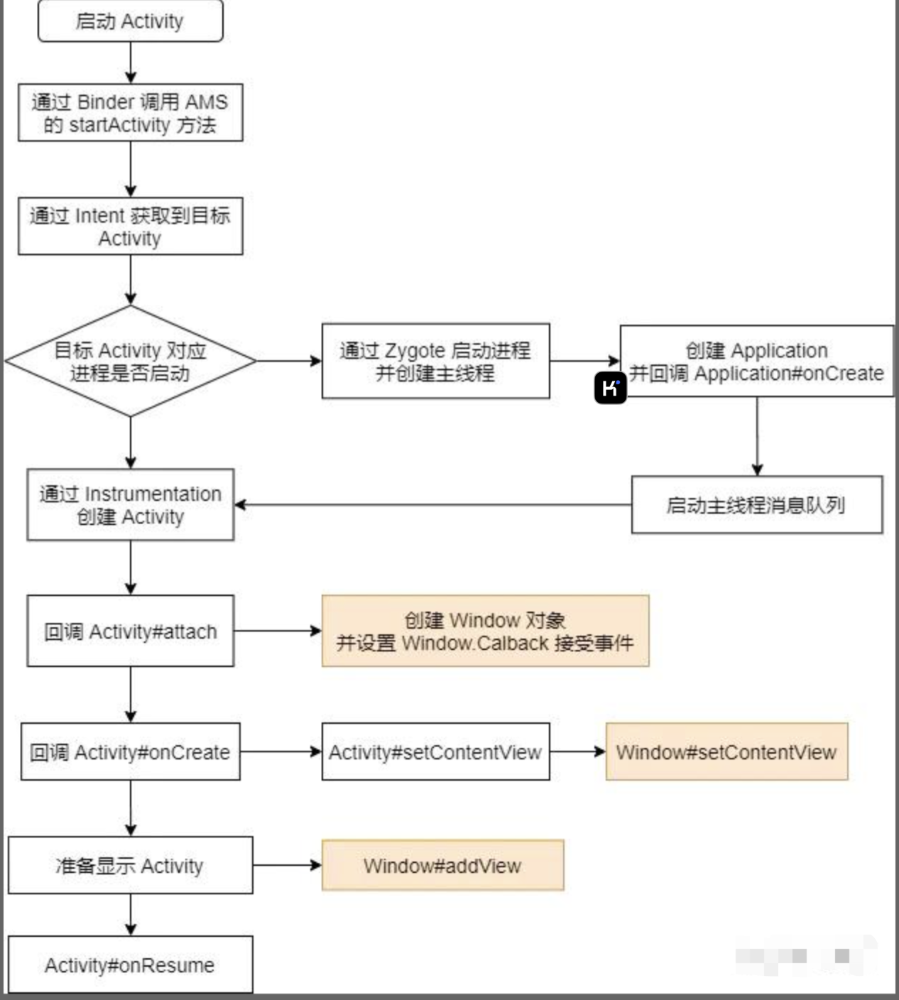

https://zhuanlan.zhihu.com/p/150283395?utm_campaign=shareopn&utm_medium=social&utm_psn=1839336210377605120&utm_source=wechat_session

## 概览

Activity 启动流程比较复杂，分析起来很容易陷入复杂的代码中去，所以我这篇分析文章不会深入的分析代码细节，尽量抛开不重要的东西把启动流程按照重点分成几个部分来分析。
下图是 Activity 启动流程的总览。



(上图红色方块是与 WMS 关联的部分，后面会从这里开始介绍 WMS)
后面我们将以 Android 29 为例，按照上图步骤逐步分析。


## Intent 解析到 Activity

调用 startActivity 之后，经过几步辗转最终会调用到 **AMS** 中，而 AMS 又会调用 ActivityStarter 来启动 Activity。
解析 Intent 的任务将由`PackageManagerService#resolveIntent`方法来处理。
Intent 匹配规则太负责了，我本意是想学习启动流程，所以就没深入进去看代码，就这样吧。


## 通过 Zygote 创建进程

如果目标进程未启动，则会先启动进程，这里先把启动进程的方法调用栈放上来，方便后面分析。

```java
ActivityStackSupervisor#startSpecificActivityLocked
ActivityManagerService$LocalService#startProcess
ProcessList#startProcessLocked
Process#start
ZygoteProcess#start
```

方法最终是走到了 ZygoteProcess 中，这个类负责创建进程，我们知道 Android 系统的进程由 **Zygote** 创建，而 ZygoteProcess 实际上是负责与 Zygote 进行通信的类。

`ZygoteProcess#attemptUsapSendArgsAndGetResult`方法中打开了一个 **LocalSocket** 连接，通过这个 Socket 与 Zygote 进行通信。

该 LocalSocket 服务端在 **ZygoteServer** 中，我们再看下服务端具体是如何做的。

我们主要关注`ZygoteServer#runSelectLoop`方法，里面最重要的两行代码如下：

```java
ZygoteConnection connection = peers.get(pollIndex); 
final Runnable command = connection.processOneCommand(this); 
```

那我们再跳到`ZygoteConnection#processOneCommand`中看看。

```java
Runnable processOneCommand(ZygoteServer zygoteServer) {
    ...
    //处理并应用参数
    args = Zygote.readArgumentList(mSocketReader);
    parsedArgs = new ZygoteArguments(args);
    Zygote.applyUidSecurityPolicy(parsedArgs, peer);
    ...
    pid = Zygote.forkAndSpecialize(parsedArgs.mUid, parsedArgs.mGid, parsedArgs.mGids,
            parsedArgs.mRuntimeFlags, rlimits, parsedArgs.mMountExternal, parsedArgs.mSeInfo,
            parsedArgs.mNiceName, fdsToClose, fdsToIgnore, parsedArgs.mStartChildZygote,
            parsedArgs.mInstructionSet, parsedArgs.mAppDataDir, parsedArgs.mTargetSdkVersion);
    ...
    if (pid == 0) {
        return handleChildProc(parsedArgs, descriptors, childPipeFd,
                parsedArgs.mStartChildZygote);
    } else {
        handleParentProc(pid, descriptors, serverPipeFd);
        return null;
    }
}
```

看到没，找了半天，终于找到了 Zygote，这里主要通过`Zygote.forkAndSpecialize`方法来**孵化进程**，并获取 pid。

forkAndSpecialize 方法主要就是调用了`Zygote.nativeForkAndSpecialize`方法，根据名字可以看出来这是一个**原生方法**，我们就到此为止吧，不继续了。

我们再回到`ZygoteConnection#processOneCommand`方法中，进程创建完成后，还会继续调用 handleChildProc 方法，我们顺着这个方法继续看下去。

```java
private Runnable handleChildProc(ZygoteArguments parsedArgs, FileDescriptor[] descriptors,
                                 FileDescriptor pipeFd, boolean isZygote) {
    closeSocket();
    //省略...
    if (parsedArgs.mInvokeWith != null) {
    //省略...
    } else {
        if (!isZygote) {
            //isZygote 一般为 false
            return ZygoteInit.zygoteInit(parsedArgs.mTargetSdkVersion,
                    parsedArgs.mRemainingArgs, null /* classLoader */);
        } else {
            return ZygoteInit.childZygoteInit(parsedArgs.mTargetSdkVersion,
                    parsedArgs.mRemainingArgs, null /* classLoader */);
        }
    }
}
```

最后调用了`ZygoteInit.zygoteInit`方法，这个方法是用来进程进行初始化操作的，上面进程创建完成后，还需要对其进行初始化操作才能让整个 APP 运转起来。

实际上 zygoteInit 方法就是通过反射找到`ActivityThread.main`方法并调用。关于这个方法后面会介绍。


## ActivityThread

ActivityThread 实际上**并不是个线程**，他并没有继承 Thread 类，我们下面来分析下这个类到底是个什么鬼。

上面说到 Zygote 最后会调用`Activity.main`方法，main 方法也就是程序的入口，一个 Android 软件也就是从这里开始的。

```java
public static void main(String[] args) {
    //省略...
    Looper.prepareMainLooper();
    ActivityThread thread = new ActivityThread();
    thread.attach(false, startSeq);
    Looper.loop();
    throw new RuntimeException("Main thread loop unexpectedly exited");
}
```

上面是 main 函数的部分代码，主要做了如下几件事:

- 实例化 ActivityThread
- 调用 ActivityThread#attach 方法
- 启动 Loop 消息循环队列

着重看一下 attach 方法，其中主要做了一些程序启动的前置准其中的方法调用顺序如下：

```text
ActivityThread#attach
ActivityManagerService#attachApplication
ActivityThread$ApplicationThread#bindApplication
ActivityThread#handleBindApplication
```

ApplicationThread 跟 ActivityThread 一样，都不是一个线程，我们直接看`ActivityThread#handleBindApplication`方法好了，另外几个都是一些乱七八糟的判断和参数组织之类的。

handleBindApplication 这个方法比较长，主要就是一些前置准备、检查、初始化等操作，例如：

- 调试模式下启动 APP 时显示 waiting for debugger 的等待对话框
- 初始化分辨率
- 设置时间格式
- 初始化包名、依赖库路径、资源文件路径
- 创建并初始化 **Instrumentation**，这个类很重要
- 调用 LoadApk#makeApplication **创建 Application 实例**。

如果未指定程序的 Application 则使用默认的 Application 类，否则使用我们指定的，然后获取到 ClassLoader 并调用 `Instrumentation#newApplication` 方法，Application 创建完成后继续回调 `Application#onCreate` 方法。


## Activity#onCreate

我们上面看到 ActivityThread#main 中开启了消息循环，主线程所有的操作都将通过 Handler 来分发。

关于生命周期的调用链也比较复杂，有个专门的 **ClientLifecycleManager** 类负责管理生命周期，这个类最终也是通过 **Handler** 的方式来控制生命周期。具体的调用链这里就不贴了，挺复杂的，也没必要，不是本文的重点，我们只需要知道最终调用到了`ActivityThread#performLaunchActivity`方法就行了。

这个方法将会创建目标 Activity 实例，并回调 attach 及 onCreate 方法，我们来看下：

```java
private Activity performLaunchActivity(ActivityClientRecord r, Intent customIntent) {
    java.lang.ClassLoader cl = appContext.getClassLoader();
    //通过 Instrumentation 实例化 Activity 对象
    Activity activity = mInstrumentation.newActivity(
            cl, component.getClassName(), r.intent);
    if (activity != null) {
        CharSequence title = r.activityInfo.loadLabel(appContext.getPackageManager());
        //回调 attach 方法，设置 title 等等
        activity.attach(appContext, this, getInstrumentation(), r.token,
                r.ident, app, r.intent, r.activityInfo, title, r.parent,
                r.embeddedID, r.lastNonConfigurationInstances, config,
                r.referrer, r.voiceInteractor, window, r.configCallback,
                r.assistToken);
        int theme = r.activityInfo.getThemeResource();
        if (theme != 0) {
            //设置样式
            activity.setTheme(theme);
        }
        //回调 Activity#onCreate
        if (r.isPersistable()) {
            mInstrumentation.callActivityOnCreate(activity, r.state, r.persistentState);
        } else {
            mInstrumentation.callActivityOnCreate(activity, r.state);
        }
    }
    return activity;
}
```

(上面代码只是简写版，中间省略了很多)
重点都在注释里面了。


## Activity#attach

attach 方法也比较重要，**这是 Activity 初始化方法**，除了基本设置之外，还负责创建 Window 对象，为后面的显示页面做好准备。

```java
final void attach(Context context, ActivityThread aThread,
                  Instrumentation instr, IBinder token, int ident,
                  Application application, Intent intent, ActivityInfo info,
                  CharSequence title, Activity parent, String id,
                  NonConfigurationInstances lastNonConfigurationInstances,
                  Configuration config, String referrer, IVoiceInteractor voiceInteractor,
                  Window window, ActivityConfigCallback activityConfigCallback, IBinder assistToken) {
    //初始化 FragmentManager
    mFragments.attachHost(null /*parent*/);

    //实例化 Window，一般为 PhoneWindow
    mWindow = new PhoneWindow(this, window, activityConfigCallback);
    mWindow.setWindowControllerCallback(this);
    //设置 Window.Callback 回调，用于接收各种输入事件
    mWindow.setCallback(this);
    mWindow.setOnWindowDismissedCallback(this);
    mWindow.getLayoutInflater().setPrivateFactory(this);
    if (info.softInputMode != WindowManager.LayoutParams.SOFT_INPUT_STATE_UNSPECIFIED) {
        mWindow.setSoftInputMode(info.softInputMode);
    }
    if (info.uiOptions != 0) {
        mWindow.setUiOptions(info.uiOptions);
    }
    mUiThread = Thread.currentThread();

    mMainThread = aThread;
    mApplication = application;
    mActivityInfo = info;
    mTitle = title;
    //设置 WindowManager
    mWindow.setWindowManager(
            (WindowManager)context.getSystemService(Context.WINDOW_SERVICE),
            mToken, mComponent.flattenToString(),
            (info.flags & ActivityInfo.FLAG_HARDWARE_ACCELERATED) != 0);
}
```

这个重点也写在注释里了，主要就是创建 **PhoneWindow** 并设置回调，关于 Window 系列的东西我的下一篇文章会继续介绍，这里先把他们互相调用的接口留出来。


## ActivityThread#handleResumeActivity

onCreate 回调完成后就开始准备显示页面然后回调 onResume。这个操作从 handleResumeActivity 方法开始。

```java
@Override
public void handleResumeActivity(IBinder token, boolean finalStateRequest, boolean isForward,
                                 String reason) {
    //通过 performResumeActivity 方法获取到 Activity,该方法还会调用 Activity#onCreate 方法
    final ActivityClientRecord r = performResumeActivity(token, finalStateRequest, reason);
    final Activity a = r.activity;

    //是否需要显示
    boolean willBeVisible = ActivityManager.getService().willActivityBeVisible(
            a.getActivityToken());
    if (r.window == null && !a.mFinished && willBeVisible) {
        r.window = r.activity.getWindow();
        //获取 DecorView，这里的 DecorView 是在 setContentView 时 Window 创建好的
        View decor = r.window.getDecorView();
        decor.setVisibility(View.INVISIBLE);
        ViewManager wm = a.getWindowManager();
        WindowManager.LayoutParams l = r.window.getAttributes();
        a.mDecor = decor;
        l.type = WindowManager.LayoutParams.TYPE_BASE_APPLICATION;
        l.softInputMode |= forwardBit;
        if (!a.mWindowAdded) {
            a.mWindowAdded = true;
            //将 DecorView 添加到 WindowManager 中
            wm.addView(decor, l);
        } else {
            a.onWindowAttributesChanged(l);
        }
    } else if (!willBeVisible) {
        r.hideForNow = true;
    }

    //调用 Activity#makeVisible 方法使其可见
    if (r.activity.mVisibleFromClient) {
        r.activity.makeVisible();
    }
}
```

该方法主要做了如下几件事：

- 回调`Activity#onCreate`
- 将 DecorView 添加到 WindowManager 中
- 调用`Activity#makeVisible`方法使 Activity 可见

还有一些其他的操作这里就不介绍了，上面代码也省略了很多本文不关心的部分。

`Activity#makeVisible`方法其实很简单，看上面代码，再把 DecorView 添加到 WM 之前会先调用`decor.setVisibility(View.INVISIBLE)`方法使其不可见，而`Activity#makeVisible`方法就是调用了`mDecor.setVisibility(View.VISIBLE)`使其变成可见状态。

好了，关于 Activity 的启动流程就这么多了，关于具体 Activity 如何显示的属于 WindowManagerService 部分，我们上面也说了是哪里调用了 WMS，下一篇文章将会从本文提到的几个 WMS 的接口方法开始说起，一直到 Window 如何被加载显示等等。


