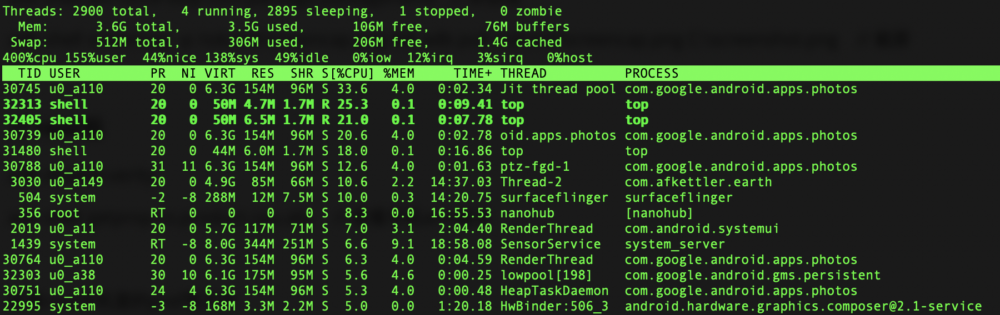
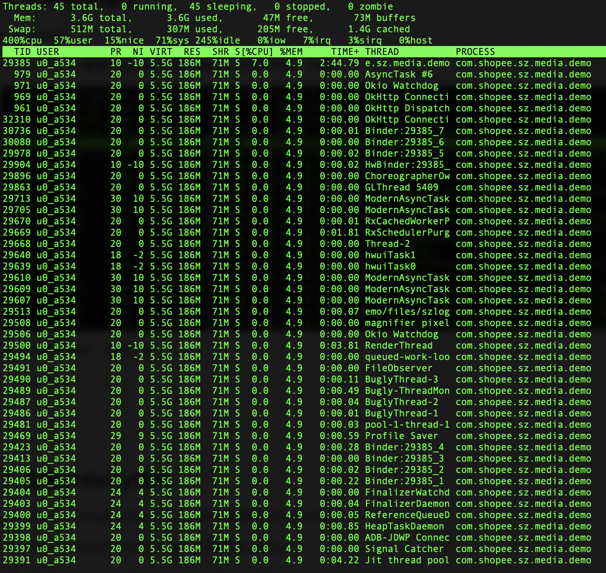
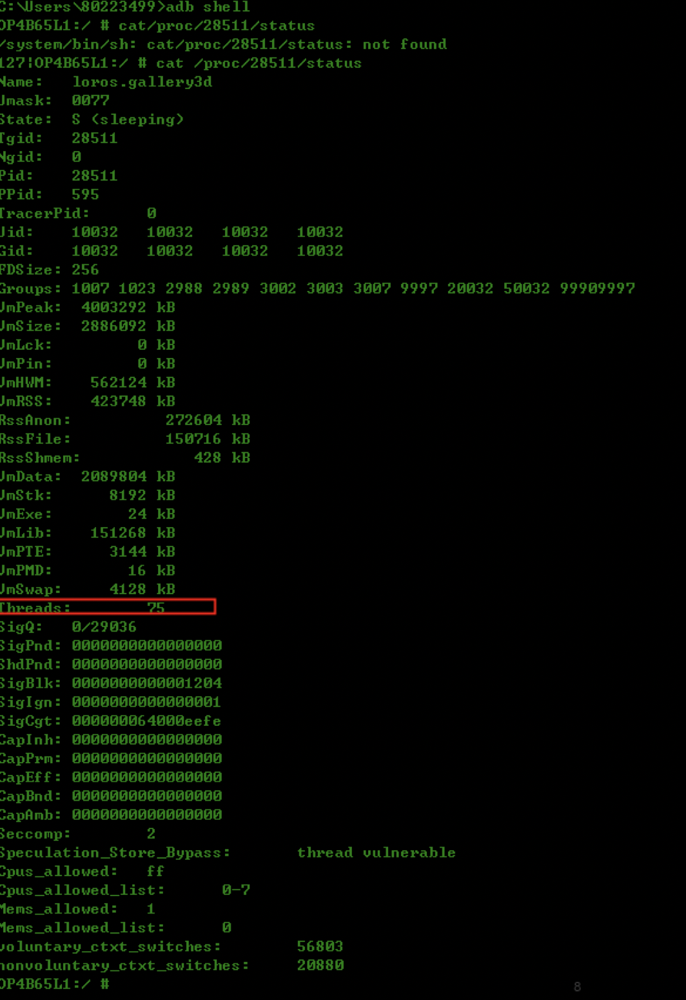
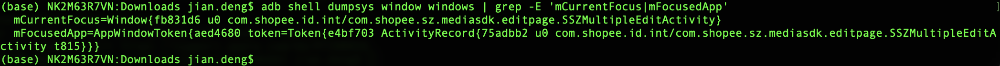
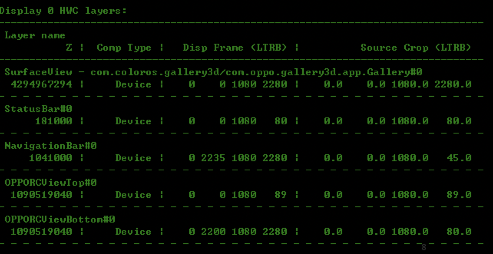
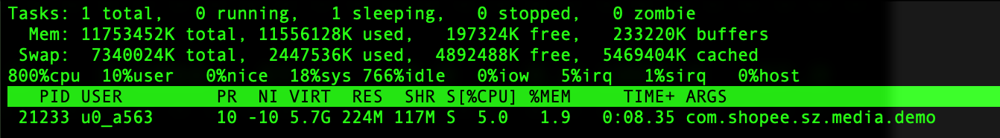
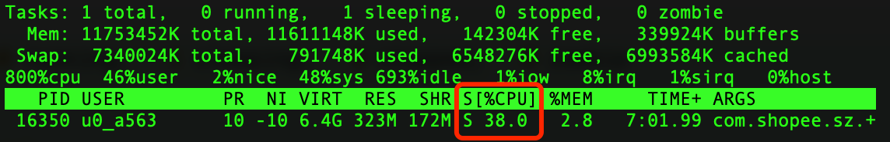
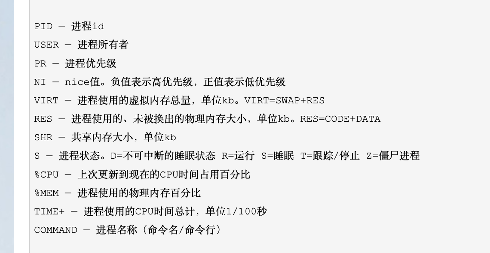

### 1. adb常用（杂） 

  adb shell

  adb top 详见top命令总结笔记

  adb devices

  adb reboot

  adb remount 类似adb root

  adb shell am force-stop com.package.packagename   // 杀进程

  adb shell screencap -p /sdcard/screencap.png && adb pull /sdcard/screencap.png C:\screenshot.png	// 截屏

  pm -lf|grep "aruler"	// 查找（比如查找包在哪个目录）

* adb shell **getprop** 
  * adb shell **getprop** ro.hardware 	// dump CPU信息
  * 查看设备相关信息，都可用，后面参数可参考Build.java。比如查看手机model信息，就用 adb shell getprop ro.product.model

* root后
  * adb disable-verity
  * adb shell getprop ro.product.cpu.abi 	// 查看手机arm版本

*  find
  * find / -name xxx.xxx	// 按文件名在**根目录**查找
  * find frameworks/ -name xxx.xxx    // 在frameworks目录下查找
  * find frameworks/ -name ‘PowerManager*’   // 使用通配符*（0个或任意多个），在frameworks目录下查找文件名开头是字符串‘PowerManager’的文件
  * find . -name ‘PowerManager*’   // 表示在当前目录下（包含子目录）查找文件名开头是字符串‘PowerManager’的文件。
  * find frameworks/ -amin -10    // 按文件特征找，表示在frameworks目录下查找最后10分钟访问的文件。

* grep
  * -i：不区分大小写；
  * -n：显示匹配行及行号；
  * -r：包含子目录；
  * -c：只输出匹配行的计数；
  * -w：匹配整个单词；


  查看root手机里的pref等文件

  adb root后，adb shell，cd到data/data/com.your.packagename这个目录，ls可查看文件

  如果要拷贝出这里面的文件，可先把他拷贝到手机SD卡，比如再data目录下，cp 1.jpg /mnt/sdcard/


通过如下 adb 命令在 /mnt/sdcard/ 目录下产生一个名为 bigfile 的文件，让其自动增长到磁盘剩余空间大：

adb shell dd if=/dev/zero of=/mnt/sdcard/bigfile

  

### 2. 进程线程信息

adb shell后 

\>> top -H	// 查看活跃进程，默认按cpu占用率排序，如图：



第一个是进程号，可进一步

\>> top -H -p <pid>



或者从AS中看到对应的进程号，然后直接用命令：

或用adb shell pidof <package_name> 查看包名对应的进程号

top -d 1 -p 16350   

也可以用代码打印出来：

```java
		private void printThread() {
        Map<Thread, StackTraceElement[]> stacks = Thread.getAllStackTraces();
        Set<Thread> set = stacks.keySet();
        for (Thread key : set) {
            StackTraceElement[] stackTraceElements = stacks.get(key);
            Log.d(TAG, "---- print thread: " + key.getName() + " start ----");
            for (StackTraceElement st : stackTraceElements) {
                Log.d(TAG, "StackTraceElement: " + st.toString());
            }
            Log.d(TAG, "---- print thread: " + key.getName() + " end ----");
        }
    }
```


// 定位线程泄漏

先用**ps -fe |grep programname** 查看进程id

adb shell cat /proc/<pid>/status 	// 如图的Threads:后面标注了线程数量




### 3. 查看activity信息

adb shell dumpsys activity 	// adb查看当前task的activity

adb shell dumpsys activity | grep 应用的package

adb shell dumpsys activity | grep mFocusedActivity

**adb -d shell dumpsys activity activities | grep mResumedActivity** // 查看当前显示的activity

**adb shell dumpsys activity activities | sed -En -e '/Running activities/,/Run #0/p'**	// 查看activity堆栈

adb shell dumpsys activity top  // 可以看到Added Fragment的信息


<font color="red">adb shell dumpsys window windows | grep -E 'mCurrentFocus|mFocusedApp'	// 这个可以查看当前活动的进程和页面</font>



### 4. adb logcat

adb logcat | grep -E "keyword1|keyword2$"

比如 adb logcat | grep -E "arworks|arcore|OAR-E"

输出到电脑上

adb logcat > e:\log\log.txt


### 5. 查看到内存详情，包括虚拟机内存、Native内存，图层信息等

adb shell dumpsys meminfo packageName

adb dumpsys SurfaceFlinger packageName	// 可查看到图层信息，比如：



这上面可以看到当前有多少个图层处于显示状态。如果有卡顿现象，也可以优先查看是否SurfaceView等是否设置了透明属性。导致很多额外图层显示。HWC为图层


dumpsys gfxinfo packagename	// 查看硬件加速是否开启，如果开启，能看到TextureCache，LayerCache等log信息


### Top命令总结

adb shell top -d 1 | grep "com.dengjian.xxx"	// 查看线程的CPU占用率、线程状态、占用内存大小等信息。

-d 表示显示多少条，后面的数字是显示条数。

grep 后是线程名，用作过滤。

但这样看的不够清晰，可以运行这个后，找到对于的进程号，然后用 <font color="red">top -d 1 -p xxxxx</font> , 运行结果如下：



如果要保存输出的结果，可以用adb shell top  -p <pid > top.txt

注意：

CPU会有超过100%的情况，假如这台手机是8核数，总量是按800%算的。

所以此时的CPU=38.0/800=4.75%，一般取十几组拿平均值

经对比，这样获取的数据跟Android studio获取的是一样的



既然方法有了，那脚本自然也可以获取到，下面附上代码和文件：

```python
# encoding:utf-8
import logging
import os
import re
from threading import Thread
import time

thread_running = True
# 每隔0.5秒获取一次
interval = 0.3


def get_pid(package_name, device_name):
    if device_name.__len__() > 0:
        device_name = "-s " + device_name
    # else:
    # print("未指定设备名，尝试连接默认设备")

    try:
        # 获取进程ID
        cmd = 'adb ' + device_name + ' shell ps -o pid,NAME | grep ' + package_name
        # print cmd
        p = os.popen(cmd)
        pid = p.readline().split()[0]
    except:
        try:
            # 获取进程ID（旧版命令）
            cmd = 'adb ' + device_name + ' shell ps | grep ' + package_name
            # print ("获取cpu的adb命令：%s" , cmd)
            # print cmd
            p = os.popen(cmd)
            pid = p.readline().split()[1]
        except:
            logging.error("获取进程ID失败，请确认包名是否正确、程序是否打开")

    return pid


def get_app_cpu_usage(pid, device_name="", device_cores=-1):
    """
    :param package_name: 待检测安卓应用包名【必填】
    :param device_name: 待检测设备名（使用“adb devices”命令获取）【若为空则检测默认设备，当设备数大于一时将报错】
    :param device_cores: 设备核心数，从adb获取到的使用率可能会超过100%，指定这个数字来修正获得的结果（旧版安卓系统指定为1即可）
    :return: 该设备指定应用的CPU占用率（占用15%则return 0.15）
    """
    if device_cores == -1:
        print("未指定CPU核心数，尝试自动获取（结果不一定可靠）")
        try:
            cmd = 'adb ' + device_name + ' shell top -n 1'
            print("adb命令：%s" % cmd)
            # print cmd
            device_cores = int(os.popen(cmd).readlines()[3].split('%cpu')[0]) / 100
        except:
            device_cores = 1
            logging.error("获取CPU核心数失败，请手动指定CPU核心数！")

    try:
        # 根据进程ID获取CPU使用率
        cmd = 'adb ' + device_name + ' shell top -n 1  -o %CPU,pid  | grep ' + pid

        # print cmd
        p = os.popen(cmd)
        # print ("output：%s" % p)
        result = float(p.readline().split()[0]) / (device_cores * 100)
        print("current app's cpu usage: %f%%" % (result * 100))
        return result
    except:
        try:
            # 根据包名获取CPU使用率（旧版命令）
            cmd = 'adb ' + device_name + ' shell top -n 1 | grep ' + pid
            # print "获取cpu的adb命令：%s" % cmd

            # print cmd
            p = os.popen(cmd)
            output = p.readline().split()
            # print ("output：%s" % output)

            for i in range(0, output.__len__()):
                if output[i].__contains__('%'):
                    return float(output[i].split('%')[0]) / (device_cores * 100)
            #     若数据中不带%，尝试直接读取第9列
            result = float(output[8]) / (device_cores * 100)
            print("current app's cpu usage: %f%%" % (result * 100))
            return result
        except:
            try:
                result = float(output[9]) / (device_cores * 100)
                print("可能存在未知字符,尝试获取下一列")
                print(output)
                print("current app's cpu usage: %f%%" % (result * 100))
                return result
            except:
                logging.error("尝试获取下一列失败")
    return -1


def get_app_pss_in_KB(pid, device_name=""):
    if device_name.__len__() > 0:
        device_name = "-s " + device_name
    # else:
    #     print("未指定设备名，尝试连接默认设备")
    try:
        cmd = 'adb ' + device_name + ' shell dumpsys meminfo ' + pid
        output = os.popen(cmd).readlines()
        for i in range(len(output)):
            if "TOTAL SWAP" in output[i]:
                # TOTAL PSS:    84502            TOTAL RSS:   185240       TOTAL SWAP PSS:      83
                # TOTAL: 201300 TOTAL SWAP PSS: 30797
                # 部分机器显示TOTAL后面不跟PSS，用swap代替
                # 正则匹配提取数字，然后获取第一个
                result = int(re.findall('\d+', output[i])[0])
                print("current app's pss: %d MB" % (result / 1024))
                return result
        raise Exception("快速方法获取失败！该机器可能无法使用meminfo+包名的方式获取")
    except Exception as e:
        interval = 0
        print(e)
        try:
            cmd = 'adb ' + device_name + ' shell dumpsys meminfo -package | grep ' + pid
            # print cmd
            output = os.popen(cmd).readlines()
            result = int(output[2].replace(' ', '').replace('k', 'K').split('K')[0].replace(',', ''))
            print("get slowly : current app's pss: %d MB" % (result / 1024))
            return result
        except:
            logging.error("获取PSS失败，请尝试更改输出信息提取规则，控制台输出为：" + output)


def take_input():
    input('输入任意字符停止计算：\n')
    # doing something with the input
    print('停止计算')


def restart():
    result = input("输入Y可以重启app：\n")
    if result == 'y' or result == "Y":
        cmd = "adb shell am force-stop com.shopee.sz.media.demo"
        os.popen(cmd)

        time.sleep(3)

        cmd = 'adb shell am start com.shopee.sz.media.demo'
        os.popen(cmd)


def get_cpu_mem_task():
    global thread_running
    global interval

    package_name = "com.shopee.sz.media.demo"
    # device_name = '8fe3afe'

    pid = get_pid(package_name=package_name, device_name="")

    # cpu核数
    device_cores = 8

    cpu_data = []
    mem_data = []

    while thread_running:
        cpu = get_app_cpu_usage(pid=pid, device_cores=device_cores)
        # 问题数据排除
        if cpu != -1:
            cpu_data.append(cpu)
        mem_data.append(get_app_pss_in_KB(pid=pid))
        time.sleep(interval)

    max_cpu = 0
    sum_cpu = 0
    max_mem = 0
    sum_mem = 0
    for cpu in cpu_data:
        sum_cpu = sum_cpu + cpu
        if cpu > max_cpu:
            max_cpu = cpu

    for mem in mem_data:
        sum_mem = sum_mem + mem
        if mem > max_mem:
            max_mem = mem

    average_mem = sum_mem / len(mem_data)
    average_cpu = sum_cpu / len(cpu_data)

    print("average_mem：{}, max_max：{}".format(round(average_mem / 1024), round(max_mem / 1024)))
    # 加回车方便复制
    print("average_cpu：\n{:.2f}\nmax_cpu：\n{:.2f}".format(average_cpu * 100, max_cpu * 100))


if __name__ == "__main__":
    t1 = Thread(target=get_cpu_mem_task)
    t2 = Thread(target=take_input)

    t1.start()
    t2.start()

    t2.join()  # 会一直等到线程结束
    thread_running = False

    # 输入y重启app，可选
    # restart()
```


旧版本top输出的数据含义：

```shell
PID   进程id
USER  用户名
PR    优先级
CPU%  当前瞬时CPU占用率
S     进程状态:D=不可中断的睡眠状态, R=运行, S=睡眠, T=跟踪/停止, Z=僵尸进程
#THR  程序当前所用的线程数
VSS   Virtual Set Size  虚拟耗用内存（包含共享库占用的内存）
RSS   Resident Set Size 实际使用物理内存（包含共享库占用的内存）
PCY   调度策略优先级，SP_BACKGROUND/SP_FOREGROUND
UID   进程所有者的用户id
Name  进程的名称
```

新版本为：



