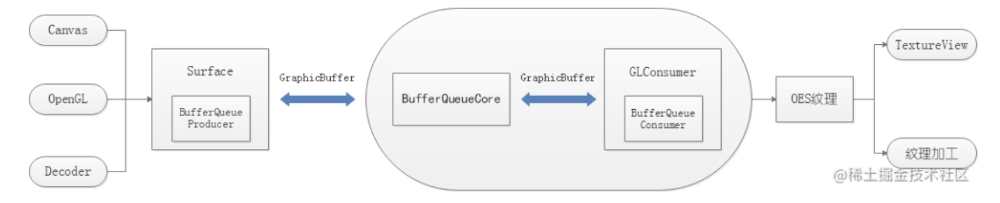
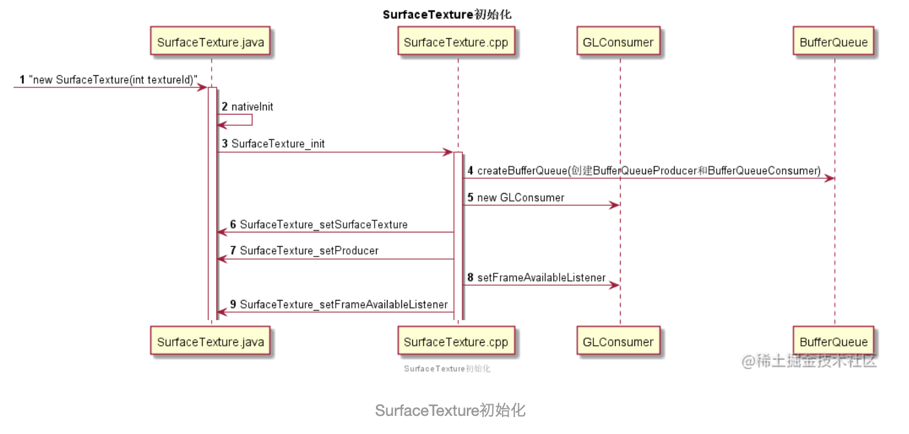
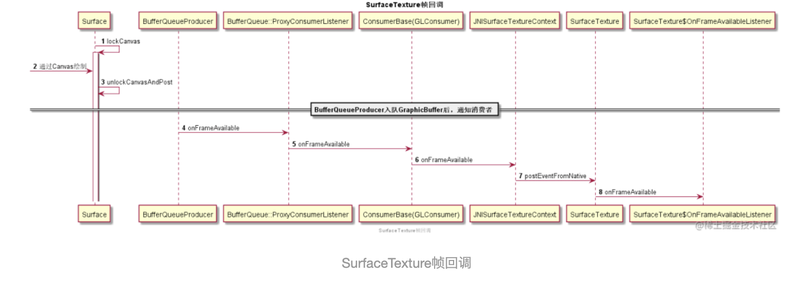
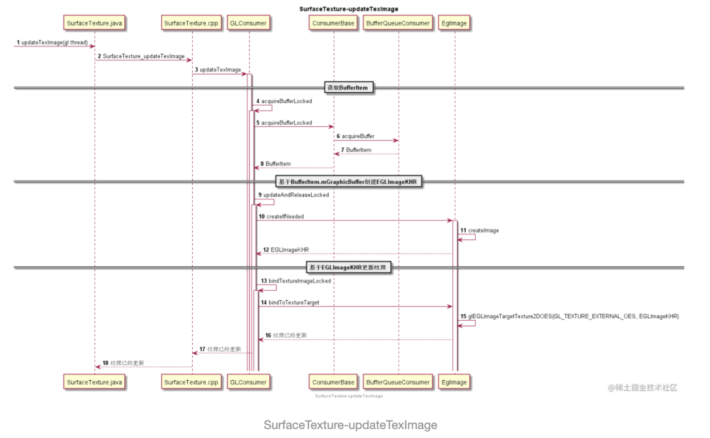

SurfaceTexture是离屏渲染和TextureView的核心，内部包含了一个BufferQueue，可以把Surface生成的图像流，转换为纹理，供业务方进一步加工使用。整个架构如下图所示：



1. 首先，通过Canvas、OpenGL、Camera或者Video Decoder生成图像流。
2. 接着，图像流通过Surface入队到BufferQueue，并通知到GLConsumer。
3. 然后，GLConsumer从BufferQueue获取图像流GraphicBuffer，并转换为纹理。
4. 最后，业务方可以对纹理进一步处理，例如：上特效或者上屏。

下面我们分别看下SurfaceTexture初始化以及图像数据在SurfaceTexture内部的流转。


## SurfaceTexture初始化

`new SurfaceTexture(textureId)`启动SurfaceTexture初始化，核心逻辑如下所示：



`SurfaceTexture_init`是SurfaceTexture初始化的核心代码，如下所示：

```cpp
static void SurfaceTexture_init(JNIEnv* env, jobject thiz, jboolean isDetached, jint texName, jboolean singleBufferMode, jobject weakThiz)
{
    // 创建BufferQueueCore、BufferQueueProducer、BufferQueueConsumer
    sp<IGraphicBufferProducer> producer;
    sp<IGraphicBufferConsumer> consumer;
    BufferQueue::createBufferQueue(&producer, &consumer);

    if (singleBufferMode) { // 单缓冲
        consumer->setMaxBufferCount(1); // 双缓冲、三缓冲就是指这里
    }

    // Java层的SurfaceTexture,实际对应Native层GLConsumer
    sp<GLConsumer> surfaceTexture;
    if (isDetached) {
        surfaceTexture = new GLConsumer(consumer,GL_TEXTURE_EXTERNAL_OES,true,!singleBufferMode);
    } else {
        surfaceTexture = new GLConsumer(consumer,texName,GL_TEXTURE_EXTERNAL_OES,true,!singleBufferMode);
    }

    // If the current context is protected, inform the producer.
    if (isProtectedContext()) {
        consumer->setConsumerUsageBits(GRALLOC_USAGE_PROTECTED);
    }
    // 为Java层SurfaceTexture.mSurfaceTexture设置GLConsumer对象地址
    SurfaceTexture_setSurfaceTexture(env, thiz, surfaceTexture);
    // 为Java层SurfaceTexture.mProducer设置producer对象地址
    SurfaceTexture_setProducer(env, thiz, producer);
    // SurfaceTexture jclass
    jclass clazz = env->GetObjectClass(thiz);

    // weakThiz表示Java层SurfaceTexture对象的弱引用，JNISurfaceTextureContext是JNI封装类，负责回调Java层SurfaceTexture.postEventFromNative方法
    sp<JNISurfaceTextureContext> ctx(new JNISurfaceTextureContext(env, weakThiz, clazz));
    // 为GLConsumer设置回调（回调到java层）
    surfaceTexture->setFrameAvailableListener(ctx); 
    // 为Java层SurfaceTexture.mFrameAvailableListener设置ctx的对象地址
    SurfaceTexture_setFrameAvailableListener(env, thiz, ctx);
}
```

SurfaceTexture初始化后，向`GLConsumer`设置了`JNISurfaceTextureContext`监听器，该监听器会回调到Java层`SurfaceTexture.postEventFromNative`方法，进一步回调到注册到SurfaceTexture中的OnFrameAvailableListener监听器，用于通知业务层有新的`GraphicBuffer`入队了。如果业务层对最新的`GraphicBuffer`感兴趣，则调用`updateTexImage`把`GraphicBuffer`更新到纹理，否则啥也不做，忽略一些图形数据。

`GLConsumer`是BufferQueue的直接消费者，负责把`GraphicBuffer`转化为纹理。然后通过监听类`wp<FrameAvailableListener> mFrameAvailableListener`通知间接消费者消费纹理。当间接消费者是`SurfaceFlinger`时，监听类为Layer，Layer进一步通知`SurfaceFlinger`去合成所有Layer，然后上屏。当间接消费者是`SurfaceTexture`时，监听类为JNISurfaceTextureContext，用于通知Java层新的图像数据可用了。


## SurfaceTexture图像数据流转

这块主要看下生产者`Surface`的创建，业务层收到帧可用通知以及更新目标纹理的流程。


### 基于SurfaceTexture创建生产者Surface

基于纹理ID创建`SurfaceTexture`后，一般会创建Surface，此时Surface是生产者，SurfaceTexture(Native层对应GLConsumer)是消费者。消费者负责把从BufferQueue中获取的GraphicBuffer转换为纹理，然后业务层可以对纹理进一步处理，例如：上特效或者上屏。

> 作为生产者的Surface通过BufferQueueProducer，向BufferQueue写GraphicBuffer；作为消费者的GLConsumer通过BufferQueueConsumer，从BufferQueue读GraphicBuffer。

根据`SurfaceTexture`创建`Surface`的核心逻辑在Native层：根据SurfaceTexture持有的BufferqueueProducer创建一个Surface对象，并把该对象的地址绑定到Java层`Surface.mNativeObject`变量。核心代码如下所示：

```cpp
// 基于SurfaceTexture创建Surface
public Surface(SurfaceTexture surfaceTexture) {
    synchronized (mLock) {
        mName = surfaceTexture.toString();
        // 保存Native层Surface对象地址
        setNativeObjectLocked(nativeCreateFromSurfaceTexture(surfaceTexture));
    }
}
// 根据SurfaceTexture持有的BufferqueueProducer创建Surface，并返回对象地址    
static jlong nativeCreateFromSurfaceTexture(JNIEnv* env, jclass clazz, jobject surfaceTextureObj) {
    // 从Java层surfaceTexture.mProducer中获取BufferqueueProducer的对象地址，并创建BufferqueueProducer。
    sp<IGraphicBufferProducer> producer(SurfaceTexture_getProducer(env, surfaceTextureObj));
   // 基于BufferqueueProducer，创建Native Surface对象
    sp<Surface> surface(new Surface(producer, true));
   // 返回Surface对象地址
    surface->incStrong(&sRefBaseOwner);
    return jlong(surface.get());
}
```

可见，创建Native层`Surface`对象，`BufferqueueProducer`参数是必须的，它负责从`BufferQueue`中出队和入队`GraphicBuffer`。

创建好`Surface`后，就可以通过多种方式向Surface绘制图像数据了，例如：Canvas绘制、Camera输出、视频解码器渲染和OpenGL渲染。

下面，我们分两步看下图形数据是怎么更新到目标纹理的？


### 业务层收到帧可用通知

这里，我们以Canvas绘制为例，看下业务层收到帧可用回调流程，如下所示：



Java层Surface调用unlockCanvasAndPost方法后，Native层Surface通过BufferqueueProducer把GraphicBuffer入队到BufferQueue，同时通过BufferQueueCore的`sp<IConsumerListener> mConsumerListener`（实现类为BufferQueue::ProxyConsumerListener）监听器通知消费者，然后一步步通知到Java层为SurfaceTexture设置的OnFrameAvailableListener监听器。


### 业务层主动更新目标纹理

Java层OnFrameAvailableListener监听器收到回调后，需要从OpenGL线程调用`updateTexImage`把`GraphicBuffer`更新到纹理。这里的纹理就是我们创建SurfaceTexture时传入的纹理ID，整个更新流程如下所示：



> OnFrameAvailableListener.onFrameAvailable回调可以发生在任意线程，所以不能在回调中直接调用updateTexImage，而是必须切换到OpenGL线程调用。因为updateTexImage调用链涉及到OpenGL操作，所以必须在GL线程。

核心代码是`GLConsumer::updateTexImage`：

- 首先，通过`BufferQueueConsumer`从BufferQueue中获取可用的`BufferItem`，其中包含了`GraphicBuffer`。
- 然后，基于`GraphicBuffer`创建EglImage及EGLImageKHR。
- 最后，基于`EGLImageKHR`更新纹理内容。

简单来说，通过`updateTexImage`，我们把最新的图形数据更新到了纹理，至于如何使用纹理，就是业务层的事情了。


### 基于GraphicBuffer更新OES纹理

上面讲到，`updateTexImage`方法最终会把`GraphicBuffer`更新到目标纹理，实际是通过`EglImage`及`EGLImageKHR`实现的，这里我们看下在Android平台上使用`EGLImageKHR`的方式：

1. 纹理目标需要从`GL_TEXTURE_2D`替换为`GL_TEXTURE_EXTERNAL_OES`，例如：glBindTexture、glTexParameteri等函数。
2. 片元着色器中，声明OES扩展：`#extension GL_OES_EGL_image_external : require`。同时，使用`samplerExternalOES`替代`sampler2D`纹理类型。
3. 基于`GraphicBuffer`图形数据，通过`eglCreateImageKHR`创建`EGLImageKHR`。

> `GraphicBuffer`可以从BufferQueue中获取，也可以lock后获取内存地址，写入图形数据，具体可参考GraphicBuffer.cpp。

1. 通过`glEGLImageTargetTexture2DOES`把`EGLImageKHR`填充为纹理数据

> glEGLImageTargetTexture2DOES(GL_TEXTURE_EXTERNAL_OES, static_cast(EGLImageKHR));

1. 最后，使用`eglDestroyImageKHR`销毁`EGLImageKHR`。

创建和销毁`EGLImageKHR`的函数原型如下所示：

```cpp
// 创建EGLImageKHR，在Android平台上，ctx可以是EGL_NO_CONTEXT，target是EGL_NATIVE_BUFFER_ANDROID，buffer是由GraphicBuffer创建来的。
EGLImageKHR eglCreateImageKHR(EGLDisplay dpy, EGLContext ctx, EGLenum target, EGLClientBuffer buffer, const EGLint *attrib_list)

// 销毁EGLImageKHR
EGLBoolean eglDestroyImageKHR(EGLDisplay dpy, EGLImageKHR image)
```

具体使用方式可参考GLConsumer::EglImage::createImage。

`GLConsumer`内部封装了`EglImage`类，负责`GraphicBuffer`、`EGLImageKHR`和OES纹理的处理逻辑，核心代码如下所示：

```cpp
// EglImage根据GraphicBuffer创建EGLImageKHR，然后使用EGLImageKHR更新纹理，是GLConsumer中负责把从BufferQueue获取的GraphicBuffer，转换为纹理的工具类。
class EglImage : public LightRefBase<EglImage>{
public:
    // 唯一的构造函数，接收一个GraphicBuffer参数
    EglImage(sp<GraphicBuffer> graphicBuffer);

    // 如果参数发生变更，则调用createImage创建内部的EGLImageKHR
    status_t createIfNeeded(EGLDisplay display, const Rect& cropRect, bool forceCreate = false);

    // 把EGLImageKHR绑定的GraphicBuffer图形数据上传到目标纹理
    void bindToTextureTarget(uint32_t texTarget){
        glEGLImageTargetTexture2DOES(texTarget, static_cast<GLeglImageOES>(mEglImage));
    }

private:
    // 创建内部的EGLImageKHR
    EGLImageKHR createImage(EGLDisplay dpy, const sp<GraphicBuffer>& graphicBuffer, const Rect& crop);

    // 用于创建EGLImageKHR的GraphicBuffer
    sp<GraphicBuffer> mGraphicBuffer;
    // 根据GraphicBuffer创建的EGLImageKHR
    EGLImageKHR mEglImage;
    // 创建EGLImageKHR需要的参数
    EGLDisplay mEglDisplay;
    // 创建EGLImageKHR时，使用的裁剪区域
    Rect mCropRect;
}
```


## 总结

SurfaceTexture是离屏渲染的核心，例如：我们可以把SurfaceTexture设置给Camera接收摄像头图像数据，并转换为OES纹理，然后可以利用OpenGL对OES纹理做进一步特效处理，最后上屏或者录制成视频。所以，理解`SurfaceTexture`底层原理有助于业务层开发和问题排查，希望本文对有心人有所帮助。

## 参考文档

1. *Using GL_OES_EGL_image_external on Android https://gist.github.com/rexguo/6696123*
2. *EGL_KHR_image_base.txt https://www.khronos.org/registry/EGL/extensions/KHR/EGL_KHR_image_base.tx*


*来源：https://juejin.cn/post/6844904161645953038*