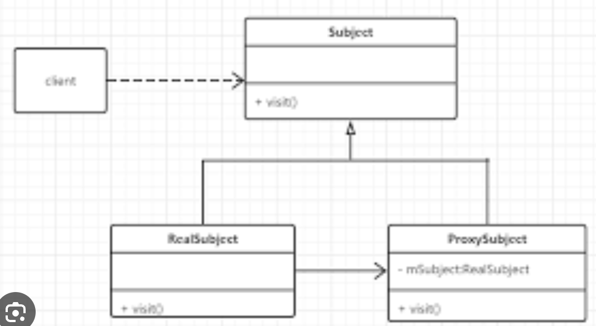

## Handler

#### 同步屏障

msg.target = null


代码在MessageQueue::next


在ViewRootImpl中有方法用于设置和取消同步屏障


## Binder


系统服务——实名—— getSystemService

安全性：带有调用者的身份信息(uid)。

#### Android权限验证：


Binder传输数据


Intent传输数据本质上是使用Binder来完成的。Intent启动组件需要借助AMS完成，因此startActivity 会离开当前应用进程，进入AMS所在的system_server进程进行跨进程通信。这就意味着传输的对象需要在不同进程之间进行传输。

为了保护不同进程互不干扰，进程隔离让system_server进程无法直接获取应用进程内存中的对象。因此必须通过类似于复制的手段，将应用进程的对象传递给system_server进程，再由system_server进程传递给应用中的 OtherActivity 。

因此使用Intent传输数据除了基本数据类型之外，对于其他类型对象需要此类型实现了Serializable或者Parcelable序列化接口才能进行传输。


#### mmap

能让虚拟内存和<b>指定的</b>物理内存直接联系起来。


用户空间是不能直接操作文件的，只是操作一个虚拟内存；


代码示例：


#### Binder驱动


Binder涉及的类：


Java端Stub继承自Binder，相当于Client端。Service是服务端。


## 启动流程


SystemServer要做的：


从开机到桌面的过程为：

**Bootloader** ➪**Kernel** ➪**Init进程** ➪ **Zygote** ➪ **SystemServer** ➪ **ServiceManager** ➪ **Home Launcher**

　　Android服务包括系统服务和应用服务，系统服务是指Android系统在启动过程就已经启动实现了的服务，对于系统服务又分为Java服务和本地服务，Java服务是由Java代码编写而成，由SystemServer进程提供，而本地服务是由C/C++实现的服务，由Init进程在系统启动时启动的服务。应用服务是由开发者自行实现的某些特定服务。

１、Bootloader

​	当电源按下，引导芯片代码开始从预定义的地方（固化在ROM）开始执行。加载引导程序到RAM，然后执行。 　　 　　BootLoader是在操作系统内核运行之前运行。可以初始化硬件设备、建立内存空间映射图，从而将系统的软硬件环境带到一个合适状态，以便为最终调用操作系统内核准备好正确的环境。

２、Kernel

​	Android内核启动时，会设置缓存、被保护存储器、计划列表，加载驱动。当内核完成系统设置，它首先在系统文件中寻找”init”文件，然后启动root进程或者系统的第一个进程。

３、init进程

　　init进程，它是一个由内核启动的用户级进程。内核自行启动（已经被载入内存，开始运行，并已初始化所有的设备驱动程序和数据结构等）之后，就通过启动一个用户级程序init的方式，完成引导进程。init始终是第一个进程。

　　启动过程就是代码init.c中main函数执行过程：system\core\init\init.c在函数中执行了：**文件夹建立**，**挂载**，**rc文件解析**，**属性设置**，**启动服务**，**执行动作**，**socket监听**……

- rc文件解析

　　.rc文件是Android使用的初始化脚本文件 ，Android中有特定的格式以及规则。

４、Zygote

　　所有的应用程序进程以及系统服务进程（SystemServer）都是由Zygote进程孕育（fork）出来的，zygote本身是Native应用程序，与驱动内核无关。

　　我们知道，Android系统是基于Linux内核的，而在Linux系统中，所有的进程都是init进程的子孙进程，也就是说，所有的进程都是直接或者间接地由init进程fork出来的。Zygote进程也不例外，它是在系统启动的过程，由init进程创建的（在系统启动脚本system/core/rootdir/init.rc文件中）。

　　在Java中，不同的虚拟机实例会为不同的应用分配不同的内存。假如Android应用应该尽可能快地启动，但如果Android系统为每一个应用启动不同的Dalvik虚拟机实例，就会消耗大量的内存以及时间。因此，为了克服这个问题，Android系统创造了”Zygote”。Zygote是一个虚拟器进程，预加载以及初始化核心库类，让Dalvik虚拟机共享代码、降低内存占用和启动时间。

**Zygote进程包含两个主要模块：**

①. Socket服务端，该Socket服务端用于接收启动新的Dalvik进程命令。

②. Framework共享类及共享资源，当Zygote进程启动后，会装载一些共享类和资源，共享类是在preload-classes文件中定义的，共享资源是在preload-resources文件中定义。因为其他Dalvik进程是由Zygote进程孵化出来的，因此只要Zygote装载好了这些类和资源后，新的Dalvik进程就不需要在装载这些类和资源了，它们共享Zygote进程的资源和类。

**Zygote启动分为两个阶段：**

　①. **虚拟机启动 --- 通过native启动**　

- startVm(&mJavaVM, &env) 　　启动虚拟机　
- onVmCreated(env) 虚拟机启动后的初始化
- startReg(env) 注册JNI函数
- env->CallStaticVoidMethod(startClass, startMeth, strArray) 调用ZygoteInit类的main函数开创java世界　 　　　　　　　　　　　　 ②. **SystemServer进程 --- 通过Java启动**　
- registerZygoteSocket() 　为zygote进程注册监听socket
- preload() 加载常用的JAVA类和系统资源
- startSystemServer() 启动SystemServer进程
- runSelectLoopMode() 进入循环监听模式
- closeServerSocket() 进程退出时，关闭socket监听

５、启动系统服务

　　Zygote创建新的进程去启动系统服务。你可以在ZygoteInit类的”startSystemServer”方法中找到源代码。

核心服务：

> 启动电源管理器；　

创建Activity管理器；　

> 启动电话注册；　

> 启动包管理器；
>
> 设置Activity管理服务为系统进程；
>
> 启动上下文管理器；
>
> 启动系统Context Providers；
>
> 启动电池服务；
>
> 启动定时管理器；
>
> 启动传感服务；
>
> 启动窗口管理器；
>
> 启动蓝牙服务；
>
> 启动挂载服务。

其他服务：

６、引导完成

　　一旦系统服务在内存中跑起来了，Android就完成了引导过程。在这个时候“ACTION_BOOT_COMPLETED”开机启动广播就会发出去。


#### Apk包增量更新

使用BinaryDiff库（依赖bzip）

Dex文件格式：


## AMS

本质是一个Java对象，实现了IBinder，实现进程间通信的接口，用于管理Activity。是个系统服务，也负责包管理、电池管理、震动管理。


Zygote fork出了app进程和system_server进程，system_server创建了大量服务（比如dumpsys），并加载Android Framework所需要的资源。


#### startActivity流程

Launcher、AMS、Zygote和app都是不同的进程。

时序图：


Instrumentation: 

ActivityThread不是线程，但它跑在UI主线程。

Hook Activity启动流程： 找到hook点 IActivityManager（单例），反射。


## PMS && WMS

一个Activity对应一个Window， Window用来统一管理View。

#### WMS


View-> Canvas -> Surface -> SurfaceFlinger(生产者、消费者)底层处理-> skia/opengl/vulkan

刷新率过高，但软件跟不上，比如120Hz手机，8ms处理不了指令，可能还会导致连续掉帧，反而引起卡顿。

窗口类型：应用窗口、子窗口、系统窗口（Toast, 电话）

ViewRootImpl: view和wms的桥梁


## 性能优化

#### 内存

LeakCanary: 1. ContentProvider生命周期先于Application::onCreate 2. WeakReference(ReferenceQueue)

Application->**attachBaseContext** =====>ContentProvider->onCreate =====>Application->onCreate =====>Activity->onCreate

使用内存分析器检查应用的内存使用情况

https://developer.android.com/studio/profile/memory-profiler?hl=zh-cn


#### 启动速度

app启动流程


可以用adb 命令 am start -S -W com.xxx.XXXX/.MainActivity启动看统计耗时。


ViewPager懒加载，用ViewPager2

卡顿检测：利用Handler，一个线程发个延时消息给主线程Handler改个标志位，自己wait一定时间，看标志位是否改变。（注意假唤醒情况）

selinux 安全模型


#### 耗电量

Android 6.0 Doze低电量模式


Standby待机模式

Battery Historian

参考https://www.jianshu.com/p/378cf678bdeb 配置环境

Android 8.0以上，AS的Enegry Profiler


#### 网络优化

传统DNS用的UDP：


解决方案：HTTPDNS


连接优化：

Keep-alive, http1.1，方便复用Socket，避免重复三次握手建立连接

但http1.1只能一次处理一个请求。解决方案： http2多路复用


数据压缩：

序列化，用protobuf取代json

http请求体开启gzip压缩

webp代替png，不同网络使用不同清晰度图片

http开启缓存（okhttp.cache）


#### 安装包大小

开启打包资源缩减（代码未引用的图片会变成黑像素，xml会变成空内容）， tools:keep指定保留


#### Crash监控

```java
Thread.setDefaultUncaughtExceptionHandler(mCustomUncaughtExceptionHandler)
```

Native crash捕获：Google breakpad


## 虚拟机

**JVM**

JVM是基于栈的虚拟机，对于基于栈的虚拟机来说，每一个运行时的线程，都有一个独立的栈。栈中记

录了方法调用的历史，每有一次方法调用，栈中便会多一个栈桢。最顶部的栈桢称作当前栈桢，其代表

着当前执行的方法。基于栈的虚拟机通过操作数栈进行所有操作。

在JVM中执行字节码，将

```java
int a = 1; 
int b = 2; 
int c = a + b;
```

编译为字节码，得到的指令为：

```java
ICONST_1 #将int类型常量1压入操作数栈 
ISTORE 0 #将栈顶int类型值存入局部变量0 
ICONST_2 
ISTORE 1 
ILOAD 0 #从局部变量表加载0：int类型数据 
ILOAD 1 
IADD #执行int类型加法 
ISTORE 2
```

数据会不断在操作数栈与局部变量表之间移动。


**Dalvik**

Dalvik虚拟机（ Dalvik Virtual Machine ），简称Dalvik VM或者DVM。DVM是Google专门为Android平台开发的虚拟机，它运行在Android运行时库中。

**与JVM区别**

**基于的架构不同**

DVM是基于寄存器的虚拟机，并没有JVM栈帧中的操作数栈，但是有很多虚拟寄存器。其实和操作数栈

相同，这些寄存器也存放在运行时栈中，本质上就是一个数组。与JVM相似，在Dalvik VM中每个线程都

有自己的PC和调用栈，方法调用的活动记录以帧为单位保存在调用栈上。

与JVM版相比，Dalvik无需从栈中读写数据，所需的指令更少，数据也不再需要频繁的移动。

```
#int a = 1 
const/4 v0, #int 1 // #1 
#int b = 2 
const/4 v1, #int 2 // #2 
#int c = a + b 
add-int v2, v0, v1
```

**执行的字节码不同**

在Java中，Java类会被编译成一个或多个.class文件，打包成jar文件，而后JVM会通过相应的.class文件和jar文件获取相应的字节码。

DVM会用dx工具将所有的.class文件或者jar文件转换为一个.dex文件，然后DVM会从该.dex文件读取指令和数据。

.jar文件在中包含多个.class文件，每个.class文件里面包含了该类的常量池、类信息、属性等等。当JVM加载该.jar文件的时候，会加载里面的所有的.class文件，JVM的这种加载方式很慢，对于内存有限的移动设备并不合适。

而.dex文件中也包含很多类信息，但是dex将多个类信息整合在一起了，多个类复用常量池等区域。


**ART**

ART(Android Runtime)是Android 4.4发布的，用来替换Dalvik虚拟，Android 4.4默认采用的还是

DVM，系统会提供一个选项来开启ART。在Android 5.0时，默认采用ART

**与DVM的区别**

Dalvik下应用在安装的过程，会执行一次优化，将dex字节码进行优化生成odex文件。

ART能够兼容Dalvik中的字节码执行。但是ART 引入了预先编译机制（Ahead Of Time），在Android4.4到Android 7.0以下的设备中安装应用时，ART 会使用 dex2oat 程序编译应用，将应用中dex编译成本地机器码。但是此过程会导致应用安装变慢。

因此，从Android N(Android 7.0)开始，ART 混合使用AOT、JIT与解释执行：

1、最初安装应用时不进行任何 AOT 编译（避免安装过慢），运行过程中解释执行，对经常执行的方法进行JIT，经过 JIT 编译的方法将会记录到Profile配置文件中。

2、当设备闲置和充电时，编译守护进程会运行，根据Profile文件对常用代码进行 AOT 编译。待下次运行时直接使用。


## ClassLoader

* Android 4.4及以下：

  * DexClassLoader : 可加载jar、apk和dex，可以从SD卡中加载

  * PathClassLoader : 只能加载已安裝到系統中（即/data/app目录下）的apk文件

* Android 5.0~Android 8.0：

  * DexClassLoader : 可加载jar、apk和dex，可以从SD卡中加载

  * PathClassLoader : 可加载jar、apk和dex，可以从SD卡中加载，但会导致无法进行dex2oat操作

* Android 8.1及以上：
  * DexClassLoader 与 PathClassLoader 完全一致


##  odex，解释型和编译型区别

odex全称：OptimizedDEX，表示经过优化的dex文件。

Android APK就是一个Zip压缩包 ，Android 虚拟机每次需要从Zip压缩中读取classes.dex文件完成类加载。而odex就是把 .dex 文件从Zip压缩包中的提取，这样运行时无需再次从 APK 提取 。


在开发中，无论我们使用Java、C++还是其他语言，实际上我们写的代码都是给人看的。然后我们的运行设备并没有人这么聪明，只能够看懂一些特定的简单的指令。因此在程序真正运行之前需要先将源代码转换成这种运行设备能够识别的二进制指令，也就是机器码。

但是不同的语言对什么时候、怎么转换成机器码又有不同的处理，我们按照对不同处理方式可以把语言分类为：**解释型语言和编译型语言**：

**编译型语言**：利用**编译器**将源码一次性全部转换成二进制指令，生成可执行程序，如C/C++等。

**解释型语言**：边执行，边使用**解释器**转换，如JavaScript、PHP等 


不管是**编译器**还是**解释器**实际上都是把人能看懂的代码，翻译成CPU能够识别的指令(机器码)。但是编译型语言需要在开发完成以后将所有的源代码都转换成可执行程序 ，而可执行程序里面包含的就是机器码。不同操作系统对可执行文件的内部结构有不同的要求，彼此之间无法兼容，**因此编译型语言一般是不能跨平台的**，需要在不同平台运行，需要根据不同的平台生成对应平台的可执行文件。

相比于编译型语言，**解释型语言几乎都能跨平台**。解释型语言之所以能够跨平台，是因为有了解释器这个中间层。在不同的平台下，解释器会将相同的源代码转换成不同的机器码。


### 什么是 `dex2oat`?

- **`dex2oat`** 是 Android 中的一种工具，它的全称是 "Dalvik Executable to OAT"。它的主要功能是将 `.dex` 文件（Dalvik Executable 文件）转换为 `.oat` 文件（Optimized Android Runtime 文件）。
- **工作过程**：
  - 在 Android 的应用程序安装过程中，`dex2oat` 被调用来将应用程序的 `dex` 文件转换为优化的 `oat` 文件。这一过程一般是在 AOT（Ahead-Of-Time）编译的上下文中进行的。
  - `oat` 文件包含了经过优化的机器代码，这样在应用程序运行时可以提高启动速度和执行效率。
- **什么时候调用**：
  - `dex2oat` 通常在应用程序安装过程前执行，将 `dex` 文件转换为 `oat`，从而提高后续执行时的性能。

### 什么是 `ODEX`?

- **`ODEX`** 是 "Optimized Dalvik Executable" 的缩写。它是 Android 早期版本中的一种用来优化性能的文件格式。
- 如果一个应用程序被编译成 `ODEX` 文件，这通常意味着在安装时进行了 AOT 编译，生成了一个 `odex` 文件以提高后续的运行效率。`ODEX` 文件会与原始的 `dex` 文件一起分发。
- **文件结构**：
  - `ODX` 文件和标准 `.dex` 文件结合，允许 Android 系统在启动应用程序时更快地加载和执行代码。

### `dex2oat` 和 `ODEX` 的关系

1. **功能**:
   - `dex2oat` 是将 `.dex` 文件转换为 `.oat` 文件的工具，生成的 `.oat` 文件包含了优化后的代码。
   - `ODEX` 可以被视为早期的方案来实现优化，它与 `dex` 文件一起分发并帮助提高应用启动性能。
2. **优化方式**:
   - `ODX` 文件是之前 Android 中的实现方式，而 `dex2oat` 代表了一种新的方法，不再使用 `ODEX` 的格式。
   - 在 Android 5.0（Lollipop）及以后，`dex2oat` 将 `dex` 文件编译为 `oat` 文件，取代了传统的 `ODEX` 文件。此时，`oat` 也可以包含 `dex` 文件的优化信息。
3. **现代 Android**:
   - 在现代 Android 系统中，`dex2oat` 工具通常用于将应用的 `.dex` 文件编译成 `.oat` 文件，这样做也有助于减少应用的启动时间和运行内存。
   - 现在，很多优化和运行时的过程已经内置在 Android 系统中，取代了传统的 `ODEX` 文件机制。

### 总结

- `dex2oat` 是将 `.dex` 文件转换为 `.oat` 文件的工具，用于应用的 AOT 编译并优化执行性能。
- `ODEX` 是一种旧的优化文件格式，与 `.dex` 文件一起工作，以提升性能。
- <b>在现代 Android 系统中，`dex2oat` 和 `.oat` 逐渐取代了传统的 `ODEX` 文件机制，成为优化 Android 应用程序执行的重要手段</b>。


## 反射、动态代理

反射为什么慢？

以反射方法为例，在使用反射时，首先需要获得对应的 Class 对象，然后获取需要反射执行的 Method对象，调用 invoke 方法。

Java 反射效率低主要原因是：

 1. 在反射执行方法时，参数需要拆装箱3

​	invoke 方法的参数是 Object[] 类型，当方法参数是基本数据类型时候，需要在此转化成 对应的包装类型，如 int需要转换为Integer ，也就会额外生成Integer 对象。接着还需要将这些参数封装为Object数组。

 2. 需要检查方法可见性

​	反射时每次调用都必须检查方法的可见性，比如反射private方法时必须设置setAccessible(true) ，在执行时，invoke方法需要根据作用域与flag进行检查

 3. 需要校验参数

​	反射时也必须检查每个实际参数与形式参数的类型匹配性

 4. 反射方法难以内联

​	正常调用的方法能够进行内联优化，而反射将本来允许内联的方法变得复杂，无法内联

 5. JIT 无法优化

​	反射涉及到动态加载 ，无法进行优化


代理模式，属于结构型模式。使用一个类代表另一个类的功能，在某些情况下，一个对象不适合或者不能直接引用另一个对象，而代理对象可以在客户端和目标对象之间起到中介的作用。 比如生活中常见的中介与租房，租房者不需要直接与房东交互，房东把房屋租赁交给中介代理。代理模式的目的有：

（1）通过引入代理对象的方式来间接访问目标对象，防止直接访问目标对象给系统带来的不必要复杂性；

（2）通过代理对象对访问进行控制；

代理模式一般会有三个角色：



**抽象角色：**

指代理角色和真实角色对外提供的公共方法，一般为一个接口

**真实角色：**

需要实现抽象角色接口，定义了真实角色所要实现的业务逻辑，以便供代理角色调用。也就是真正的业务逻辑在此。

**代理角色：**

需要实现抽象角色接口，是真实角色的代理，通过真实角色的业务逻辑方法来实现抽象方法，并可以附加自己的操作。将统一的流程控制都放到代理角色中处理！


**静态代理**

静态代理在进行一对一代理时，会出现时静态代理对象量多，可维护性差，而在一对多时，也会出现扩展能力差的问题。

**动态代理**

当我们的系统更新或者增加新的业务需求，可能需要新增很多目标接口和代理类。而动态代理就能够很好的解决这个问题：

**Java动态代理原理**

我们的类一般由Java源文件编译出Java字节码.class文件，然后经过类加载器ClassLoader加载使用。字节码的数据主要由一个真实存在的.class记录，类加载器读取这个.class文件中的字节码数据。而动态代理，则是在运行时通过： Proxy.newProxyInstance 在内存中直接生成类的字节码数据，然后创建此类实例对象返回。Java动态代理在内存中生成出来的字节码数据。

我们可以写出到文件中去查看：

```java
//生成NDK代理类:com.enjoy.lib.Proxy$0 
byte[] bytes = ProxyGenerator.generateProxyClass("com.enjoy.lib.Proxy$0", new Class[]{NDK.class}); 
try {
	FileOutputStream fos = new FileOutputStream("/xxx/Proxy$0.class"); 
	fos.write(bytes); 
	fos.close(); 
} catch (IOException e) {
	e.printStackTrace(); 
}
```

Android中没有ProxyGenerator，可以创建Java工程（使用JDK）

最后反编译查看 Proxy.newProxyInstance 创建的对象类型 Proxy$0.class 内容如下：

```java
public final class Proxy$0 extends Proxy implements NDK { 
  private static Method m1; 
  private static Method m2; 
  private static Method m3; 
  private static Method m0; //InvocationHandler Proxy.newProxyInstance最后一个参数 
  public Proxy$0(InvocationHandler var1) throws { 
    super(var1); 
  }
  
  // ...
  
  //在动态代理对象上调用ndk方法,通过InvocationHandler回调出去 
  public final void ndk() throws {
    try {
      super.h.invoke(this, m3, (Object[])null); 
    } catch (RuntimeException | Error var2) {
      throw var2; 
    } catch (Throwable var3) {
      throw new UndeclaredThrowableException(var3); 
    } 
  }
  
  //静态代码块，加载就会找到对应的method，比如ndk方法 
  static { 
    try {
      //...... 
      m3 = Class.forName("com.xxx.NDK").getMethod("ndk"); 
      //...... 
    } catch (NoSuchMethodException var2) { 
      throw new NoSuchMethodError(var2.getMessage()); 
    } catch (ClassNotFoundException var3) { 
      throw new NoClassDefFoundError(var3.getMessage()); 
    } 
  }
}
```

 **动态代理的方法怎么初始化的？**

在Java动态代理中会根据代理的接口生成Proxy派生类作为代理类。此类中会生成一段静态代码块，在静态代码块中使用反射获取到被代理类的所有方法并赋值给成员属性，以供后续使用。

在执行方法时，会通过 InvocationHandler 将此方法对应的被代理类方法(静态代码块获得的Method)对象以及参数回调给使用者。


