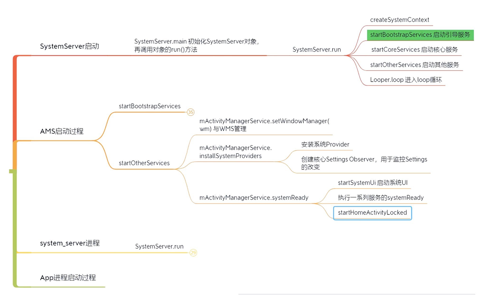

## Handler

#### 同步屏障

msg.target = null


代码在MessageQueue::next


在ViewRootImpl中有方法用于设置和取消同步屏障


## Binder


系统服务——实名—— getSystemService

安全性：带有调用者的身份信息(uid)。

#### Android权限验证：


Binder传输数据


#### mmap

能让虚拟内存和<b>指定的</b>物理内存直接联系起来。


用户空间是不能直接操作文件的，只是操作一个虚拟内存；


代码示例：


#### Binder驱动


Binder涉及的类：


Java端Stub继承自Binder，相当于Client端。Service是服务端。


## 启动流程


SystemServer要做的：


从开机到桌面的过程为：

**Bootloader** ➪**Kernel** ➪**Init进程** ➪ **Zygote** ➪ **SystemServer** ➪ **ServiceManager** ➪ **Home Launcher**

　　Android服务包括系统服务和应用服务，系统服务是指Android系统在启动过程就已经启动实现了的服务，对于系统服务又分为Java服务和本地服务，Java服务是由Java代码编写而成，由SystemServer进程提供，而本地服务是由C/C++实现的服务，由Init进程在系统启动时启动的服务。应用服务是由开发者自行实现的某些特定服务。

１、Bootloader

​	当电源按下，引导芯片代码开始从预定义的地方（固化在ROM）开始执行。加载引导程序到RAM，然后执行。 　　 　　BootLoader是在操作系统内核运行之前运行。可以初始化硬件设备、建立内存空间映射图，从而将系统的软硬件环境带到一个合适状态，以便为最终调用操作系统内核准备好正确的环境。

２、Kernel

​	Android内核启动时，会设置缓存、被保护存储器、计划列表，加载驱动。当内核完成系统设置，它首先在系统文件中寻找”init”文件，然后启动root进程或者系统的第一个进程。

３、init进程

　　init进程，它是一个由内核启动的用户级进程。内核自行启动（已经被载入内存，开始运行，并已初始化所有的设备驱动程序和数据结构等）之后，就通过启动一个用户级程序init的方式，完成引导进程。init始终是第一个进程。

　　启动过程就是代码init.c中main函数执行过程：system\core\init\init.c在函数中执行了：**文件夹建立**，**挂载**，**rc文件解析**，**属性设置**，**启动服务**，**执行动作**，**socket监听**……

- rc文件解析

　　.rc文件是Android使用的初始化脚本文件 ，Android中有特定的格式以及规则。

４、Zygote

　　所有的应用程序进程以及系统服务进程（SystemServer）都是由Zygote进程孕育（fork）出来的，zygote本身是Native应用程序，与驱动内核无关。

　　我们知道，Android系统是基于Linux内核的，而在Linux系统中，所有的进程都是init进程的子孙进程，也就是说，所有的进程都是直接或者间接地由init进程fork出来的。Zygote进程也不例外，它是在系统启动的过程，由init进程创建的（在系统启动脚本system/core/rootdir/init.rc文件中）。

　　在Java中，不同的虚拟机实例会为不同的应用分配不同的内存。假如Android应用应该尽可能快地启动，但如果Android系统为每一个应用启动不同的Dalvik虚拟机实例，就会消耗大量的内存以及时间。因此，为了克服这个问题，Android系统创造了”Zygote”。Zygote是一个虚拟器进程，预加载以及初始化核心库类，让Dalvik虚拟机共享代码、降低内存占用和启动时间。

**Zygote进程包含两个主要模块：**

①. Socket服务端，该Socket服务端用于接收启动新的Dalvik进程命令。

②. Framework共享类及共享资源，当Zygote进程启动后，会装载一些共享类和资源，共享类是在preload-classes文件中定义的，共享资源是在preload-resources文件中定义。因为其他Dalvik进程是由Zygote进程孵化出来的，因此只要Zygote装载好了这些类和资源后，新的Dalvik进程就不需要在装载这些类和资源了，它们共享Zygote进程的资源和类。

**Zygote启动分为两个阶段：**

　①. **虚拟机启动 --- 通过native启动**　

- startVm(&mJavaVM, &env) 　　启动虚拟机　
- onVmCreated(env) 虚拟机启动后的初始化
- startReg(env) 注册JNI函数
- env->CallStaticVoidMethod(startClass, startMeth, strArray) 调用ZygoteInit类的main函数开创java世界　 　　　　　　　　　　　　 ②. **SystemServer进程 --- 通过Java启动**　
- registerZygoteSocket() 　为zygote进程注册监听socket
- preload() 加载常用的JAVA类和系统资源
- startSystemServer() 启动SystemServer进程
- runSelectLoopMode() 进入循环监听模式
- closeServerSocket() 进程退出时，关闭socket监听

５、启动系统服务

　　Zygote创建新的进程去启动系统服务。你可以在ZygoteInit类的”startSystemServer”方法中找到源代码。

核心服务：

> 启动电源管理器；　

创建Activity管理器；　

> 启动电话注册；　

> 启动包管理器；
>
> 设置Activity管理服务为系统进程；
>
> 启动上下文管理器；
>
> 启动系统Context Providers；
>
> 启动电池服务；
>
> 启动定时管理器；
>
> 启动传感服务；
>
> 启动窗口管理器；
>
> 启动蓝牙服务；
>
> 启动挂载服务。

其他服务：

６、引导完成

　　一旦系统服务在内存中跑起来了，Android就完成了引导过程。在这个时候“ACTION_BOOT_COMPLETED”开机启动广播就会发出去。


#### Apk包增量更新

使用BinaryDiff库（依赖bzip）

Dex文件格式：


## AMS

本质是一个Java对象，实现了IBinder，实现进程间通信的接口，用于管理Activity。是个系统服务，也负责包管理、电池管理、震动管理。



Zygote fork出了app进程和system_server进程，system_server创建了大量服务（比如dumpsys），并加载Android Framework所需要的资源。


#### startActivity流程

Launcher、AMS、Zygote和app都是不同的进程。

时序图：


Instrumentation: 

ActivityThread不是线程，但它跑在UI主线程。

Hook Activity启动流程： 找到hook点 IActivityManager（单例），反射。


## PMS && WMS

一个Activity对应一个WIndow， Window用来统一管理View。

#### WMS


View-> Canvas -> Surface -> SurfaceFlinger(生产者、消费者)底层处理-> skia/opengl/vulkan

刷新率过高，但软件跟不上，比如120Hz手机，8ms处理不了指令，可能还会导致连续掉帧，反而引起卡顿。

窗口类型：应用窗口、子窗口、系统窗口（Toast, 电话）

ViewRootImpl: view和wms的桥梁


## 性能优化

#### 内存

LeakCanary: 1. ContentProvider生命周期先于Application::onCreate 2. WeakReference(ReferenceQueue)

Application->**attachBaseContext** =====>ContentProvider->onCreate =====>Application->onCreate =====>Activity->onCreate

使用内存分析器检查应用的内存使用情况

https://developer.android.com/studio/profile/memory-profiler?hl=zh-cn


#### 启动速度

app启动流程


可以用adb 命令 am start -S -W com.xxx.XXXX/.MainActivity启动看统计耗时。


ViewPager懒加载，用ViewPager2

卡顿检测：利用Handler，一个线程发个延时消息给主线程Handler改个标志位，自己wait一定时间，看标志位是否改变。（注意假唤醒情况）

selinux 安全模型


#### 耗电量

Android 6.0 Doze低电量模式


Standby待机模式

Battery Historian

参考https://www.jianshu.com/p/378cf678bdeb 配置环境

Android 8.0以上，AS的Enegry Profiler


#### 网络优化

传统DNS用的UDP：


解决方案：HTTPDNS


连接优化：

Keep-alive, http1.1，方便复用Socket，避免重复三次握手建立连接

但http1.1只能一次处理一个请求。解决方案： http2多路复用


数据压缩：

序列化，用protobuf取代json

http请求体开启gzip压缩

webp代替png，不同网络使用不同清晰度图片

http开启缓存（okhttp.cache）


#### 安装包大小

开启打包资源缩减（代码未引用的图片会变成黑像素，xml会变成空内容）， tools:keep指定保留


#### Crash监控

```java
Thread.setDefaultUncaughtExceptionHandler(mCustomUncaughtExceptionHandler)
```

Native crash捕获：Google breakpad

