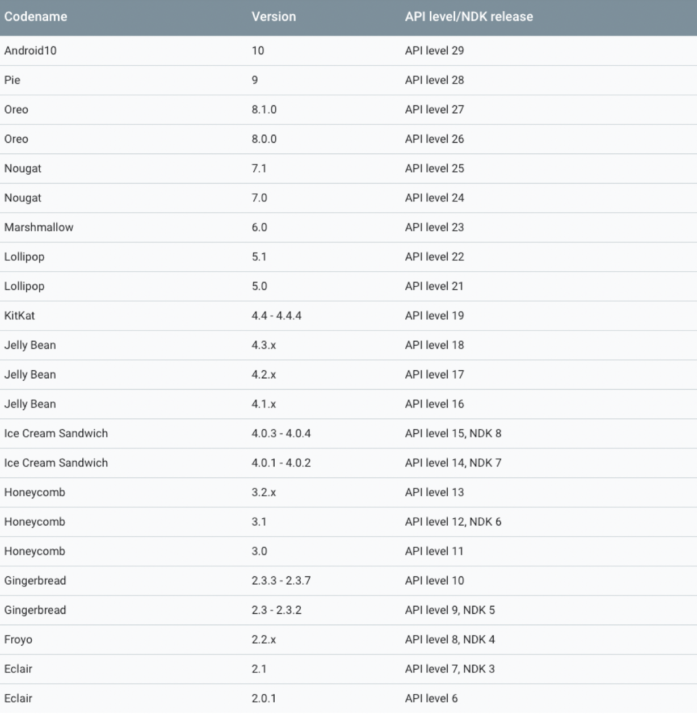

Oreo 8.0           API level 26

Nougat 7.1         API level 25

| **Platform Version**       | **API Level** | **VERSION_CODE**       | **Notes**                                                    |
| -------------------------- | ------------- | ---------------------- | ------------------------------------------------------------ |
| Android 7.0                | 24            | N                      | [Platform Highlights](https://developer.android.com/about/versions/nougat/index.html) |
| Android 6.0                | 23            | M                      | [Platform Highlights](https://developer.android.com/about/versions/marshmallow/index.html) |
| Android 5.1                | 22            | LOLLIPOP_MR1           | [Platform Highlights](https://developer.android.com/about/versions/lollipop.html) |
| Android 5.0                | 21            | LOLLIPOP               |                                                              |
| Android 4.4W               | 20            | KITKAT_WATCH           | KitKat for Wearables Only                                    |
| Android 4.4                | 19            | KITKAT                 | [Platform Highlights](https://developer.android.com/about/versions/kitkat.html) |
| Android 4.3                | 18            | JELLY_BEAN_MR2         | [Platform Highlights](https://developer.android.com/about/versions/jelly-bean.html) |
| Android 4.2,  4.2.2        | 17            | JELLY_BEAN_MR1         | [Platform Highlights](https://developer.android.com/about/versions/jelly-bean.html#android-42) |
| Android 4.1,  4.1.1        | 16            | JELLY_BEAN             | [Platform Highlights](https://developer.android.com/about/versions/jelly-bean.html#android-41) |
| Android 4.0.3, 4.0.4       | 15            | ICE_CREAM_SANDWICH_MR1 | [Platform Highlights](https://developer.android.com/about/versions/android-4.0-highlights.html) |
| Android 4.0,  4.0.1, 4.0.2 | 14            | ICE_CREAM_SANDWICH     |                                                              |
| Android 3.2                | 13            | HONEYCOMB_MR2          |                                                              |
| Android 3.1.x              | 12            | HONEYCOMB_MR1          | [Platform Highlights](https://developer.android.com/about/versions/android-3.1-highlights.html) |
| Android 3.0.x              | 11            | HONEYCOMB              | [Platform Highlights](https://developer.android.com/about/versions/android-3.0-highlights.html) |
| Android 2.3.4              |               |                        |                                                              |
| Android 2.3.3              | 10            | GINGERBREAD_MR1        | [Platform Highlights](https://developer.android.com/about/versions/android-2.3-highlights.html) |
| Android 2.3.2              |               |                        |                                                              |
| Android 2.3.1              |               |                        |                                                              |
| Android 2.3                | 9             | GINGERBREAD            |                                                              |
| Android 2.2.x              | 8             | FROYO                  | [Platform Highlights](https://developer.android.com/about/versions/android-2.2-highlights.html) |
| Android 2.1.x              | 7             | ECLAIR_MR1             | [Platform Highlights](https://developer.android.com/about/versions/android-2.0-highlights.html) |
| Android 2.0.1              | 6             | ECLAIR_0_1             |                                                              |
| Android 2.0                | 5             | ECLAIR                 |                                                              |
| Android 1.6                | 4             | DONUT                  | [Platform Highlights](https://developer.android.com/about/versions/android-1.6-highlights.html) |
| Android 1.5                | 3             | CUPCAKE                | [Platform Highlights](https://developer.android.com/about/versions/android-1.5-highlights.html) |
| Android 1.1                | 2             | BASE_1_1               |                                                              |
| Android 1.0                | 1             | BASE                   |                                                              |