## Android 测光梳理

### 什么是测光
我们所看到的，不是物体本身，而且这个物体上反射出来的光，我们想要看东西，我们的眼睛就需要接受这个光，同理，相机想要拍出照片，也需要接收这个光。
人眼是可以自动调节进光量的，但是相机是做不到的，所以，我们需要控制这个光的进入，光进入多了，照片会过曝，光进入少了，照片会欠曝，这个时候，我们就需要测光了。

**测光就是测光线的明暗，使相机实现正确曝光的过程。也就是组合曝光参数：光圈，ISO，快门**

### 测光的原理
相机在测光过程中，会将拍摄的所有物体都默认为反射率18%的灰色，专业术语叫“中级灰”，并以此作为测光的基准，曝光的目的是为了正确还原这种灰色。因为18%灰与人皮肤平均反射光的色调一样。
但是18%灰也不是准确的，对于纯白，纯黑，会导致画面的影调和色彩的失真。

测光方式

* 评价测光，是最常用的一个测光模式，也叫多区域测光。对画面的整体亮度进行平均测定，对逆光主体也有效。
* 局部测光，是对画面的中央部分进行测光，相机的测光元件会对画面中心约占画面12%的范围进行测光，并最终进行平均加权而得出测光数据。

* 点测光，比局部测光更为精确，测光元件仅测量画面最中心1%-3%的极小范围区域进行测光。
* 中央重点平均测光：将画面中央约60%的区域作为测光的重点，同时并兼顾画面的边缘。与评价测光的区别在于相机会根据拍摄者的需要强调对某个区域进行重点测光，所获得的图像会很少有某个区域欠曝或过曝的问题出现，对于一些重点主体部位，图像也能很清晰地进行反映。

### Android中的测光
#### CONTROL_AE_ANTIBANDING_MODE
用于抗闪烁的。
对于某些类型的照明装置，例如一些荧光灯，以电源频率的速度闪烁，如果曝光时间不正确，则可能最终的成像中，闪烁成了图像上的一组亮带。

它的值有：

* OFF
* 50HZ
* 60HZ

* AUTO

可使用CameraCharacteristics#CONTROL_AE_AVAILABLE_ANTIBANDING_MODES查询支持的值。

#### CONTROL_AE_EXPOSURE_COMPENSATION

设置曝光补偿，可调节图像亮度。
它是以step进行调整的，step的大小通过CameraCharacteristics#CONTROL_AE_COMPENSATION_STEP进行查询，曝光补偿范围通过CameraCharacteristics#CONTROL_AE_COMPENSATION_RANGE进行查询。
例如，如果曝光值（EV）步长为0.333，则“6”表示+2 EV的曝光补偿; -3意味着-1 EV的曝光补偿。
一个EV表示图像亮度加倍。

只有在CaptureRequest#CONTROL_AE_MODE != OFF的情况下才有效。或者在CaptureRequest#CONTROL_AE_LOCK == true时也有效。

在曝光补偿改变的情况下，相机设备可能需要几帧才能到达新请求的曝光目标。在此期间，CaptureResult＃CONTROL_AE_STATE字段将处于SEARCHING状态。 达到新的曝光目标后，CaptureResult＃CONTROL_AE_STATE将从SEARCHING更改为CONVERGED，LOCKED（如果启用了AE锁定）或FLASH_REQUIRED（如果场景太暗而无法进行静态捕捉）。

#### CONTROL_AE_REGION

设置自动曝光测量区域。
权重必须在[0，1000]以内，而且代表的是这个区域中每个像素的权重。在 metering result 中，相同权重的 更大的mertring aream 比 较小的区域有更多影响。metering 区域可以重叠，而且相机设备会叠加重叠区域的权重。
权重是相对于其他计量区域的权重，因此如果仅使用一个区域，则所有非零权重将具有相同的效果。 忽略0权重的区域。
这个权重是设置在MeteringRectangle中的。

#### 手动曝光设置：

只有在CaptureRequest#CONTROL_AE_MODE为OFF并且支持时才可以使用。

#### LENS_APERTURE：光圈

支持的光圈范围可使用CameraCharacteristics#LENS_INFO_AVAILABLE_APERTURES查询。
在光圈正在改变时，LENS_STATE会被设置为MOVING。

#### SENSOR_EXPOSURE_TIME：快门/曝光时间

只有在CaptureRequest#CONTROL_AE_MODE or CaptureRequest#CONTROL_MODE为OFF时才有效。
可以通过CameraCharacteristics#SENSOR_INFO_EXPOSURE_TIME_RANGE进行范围查询。

#### SENSOR_SENSITIVITY：ISO/灵敏度

可通过 CameraCharacteristics#SENSOR_INFO_SENSITIVITY_RANGE进行范围查询。
只有在CaptureRequest#CONTROL_AE_MODE or CaptureRequest#CONTROL_MODE为OFF时才有效。
SENSOR_FRAME_DURATION：
从帧曝光开始到下一帧曝光开始的持续时间。

#### 项目中：

对于设置不同的曝光补偿：4，2，0，-2，-4
对于华为nova2s，step为1/2，范围在-4～4

## Android Camera2 对焦梳理

### **一、对焦的原理** 

通过相机镜头中镜片组的前后移动，改变像距的位置，使物像恰好落在底片或感光底片上。

**1）焦点（focus）** 

平行光线射入凸透镜时，镜头将所有的光线聚集在一点，这个点，就叫做焦点；焦点和镜片光学中心的距离叫做焦距。

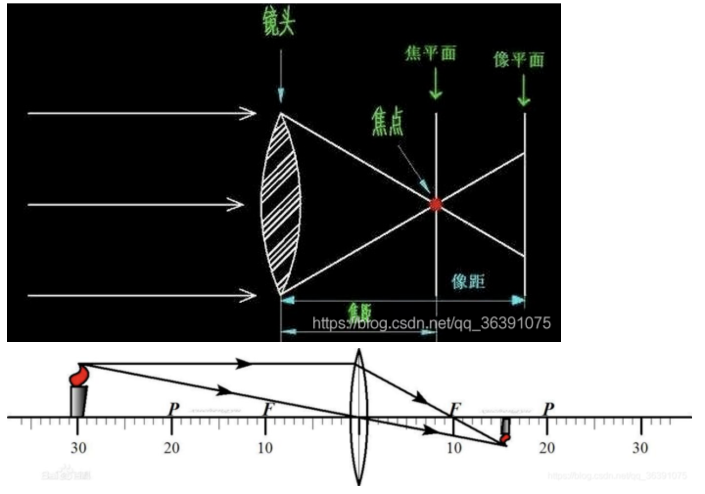

对于我们照相机来说，照相机的镜头就是一个凸透镜，胶片或者感光底片就是屏幕，它也符合凸透镜成像的原理。

**2）凸透镜成像公式：1/u + 1/v = 1/f**

u：指物距，即物体到透镜组中心的距离

v：指像距，即成像至中心的距离

f：焦距

**3）变焦（zoom） 是指改变焦距f**

只有变焦镜头的焦距才能被改变，定焦镜头的焦距是固定的。

事实上，相机的镜头是由多片凸透镜和凹透镜组成，但从成像结果来看，可以把这一组镜头看成一个凸透镜。

变焦最直观的感受就是被摄物体在取景器离被放大或者缩小了。

**4）调焦/对焦（focus）** 指改变像距，也就是改变镜头光心到底片平面的位置。光心是指光学中心。

“焦点对在xxx上面（Focus on xxx）”这个习惯说法（也即“合焦”），是指通过“调焦”，即改变像距v，使之与景物xxx到镜头的距离u、镜头焦距f，满足成像公式 1/u + 1/v = 1/f，也就是景物xxx能在底片上清晰成像。

相机的成像是在像平面，而不是在焦平面，调焦调的是感光元件离透镜光心的距离，使得感光元件与像平面重合。

在理想情况下，我们希望是通过凸透镜成像，都能成在一个点上，但是实际情况不是这样的，平行光通过一个凸透镜，根本就不是汇聚到一个点，而是越靠近中轴线的光束聚焦得越远，越靠近透镜边缘的光聚集得越近，这其实是光学误差的一种，叫球差：

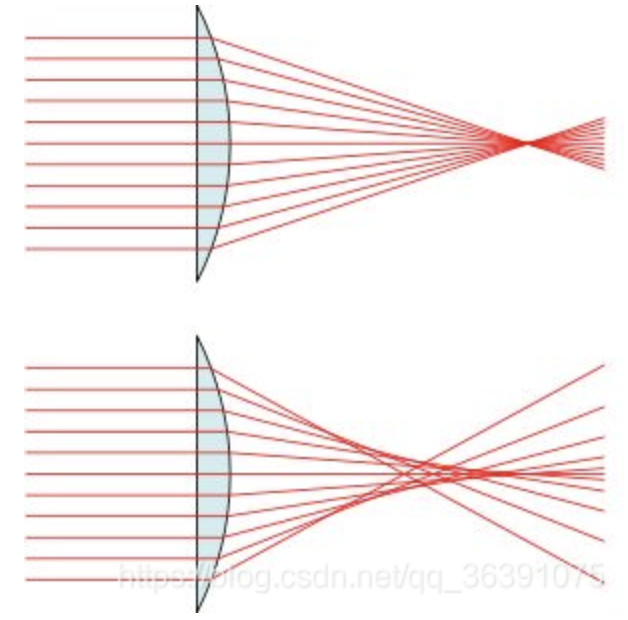

那么，在实际情况下，有那么多个光线和中轴线交汇的点，那么哪个是焦点/焦平面？实际上，每个光线和中轴交汇的点都是焦点，所以焦平面也不止一个。在所有的光线的焦点中，一般情况下，我们重点看两条：一条是聚焦在最远处的，叫近轴焦点，另一条是聚焦在最近处的，叫边缘光线焦点。

对于像平面，一般感光器件在哪里，像平面就在哪里。但是正常情况下，会把像平面放在焦点附近，因为那里的成像相对清晰。具体是放在近轴焦点还是边缘光线焦点，还是放在二者之间的某个位置，就要看你是希望得到最终的光斑大小最小呢，还是均方根光斑大小最小等等一些判据的。

所以对焦的关键还是需要满足这个公式：1/u + 1/v = 1/f

当被摄物体在无限远处时，我们的成像就在焦平面，此时像距无限趋紧焦平面，也就是像距=焦距。

离焦平面前后越远的物体，成像也就越模糊。

### **二、Android 中有关Camera2的对焦API**

**1）CONTROL_AF_MODE** 

当前是否开启自动对焦，以及设置它的模式。

它只有在 android.control.mode = AUTO 和镜头没有固定焦距（i.e android.lens.info.minimumFocusDistance > 0）的情况下，才有用。当aeMode 为 OFF时，AF的行为取决了设备。

建议在将android.control.aeMode设置为OFF之前使用android.control.afTrigger锁定AF，或者在AE关闭时将AF模式设置为OFF。它的值有：
* 1、OFF：自动对焦程序不再控制镜头；foucusDistance 由application控制。

* 2、AUTO：基本自动对焦模式。在这个模式中，镜头不会移动，除非 autofocus trigger 被触发。当 trigger是activated的时候，AF的状态将转换为ACTIVE_SCAN，然后出 scan的结果（FOCUSED or NOT_FOCUSED） 如果镜头没有固定焦距，所有设备都支持。

* 3、MACRO：特写聚焦模式。在这个模式中，镜头不回移动，除非autofocus trigger 的行为被调用。当 trigger 被触发后，AF的状态将转换为ACTIVE_SCAN,然后出扫描结果（FOCUSED or NOT_FOCUSED）。这个模式对那些离镜头很近的物体的对焦进行优化。也就是微距。

* 4、CONTINUOUS_VIDEO：在该模式中，AF算法连续地修改镜头位置以尝试提供恒定对焦的图像流。
The focusing behavior should be suitable for good quality video recording; typically this means slower focus movement and no overshoots. When the AF trigger is not involved, the AF algorithm should start in INACTIVE state, and then transition into PASSIVE_SCAN and PASSIVE_FOCUSED states as appropriate. When the AF trigger is activated, the algorithm should immediately transition into AF_FOCUSED or AF_NOT_FOCUSED as appropriate, and lock the lens position until a cancel AF trigger is received.
一旦收到取消，算法应转换回INACTIVE并恢复被动扫描。请注意，此行为与CONTINUOUS_PICTURE不同，因为必须立即取消正在进行的PASSIVE_SCAN。

* 5、CONTINUOUS_PICTURE:在该模式中，AF算法连续地修改镜头位置以尝试提供恒定对焦的图像流。
  The focusing behavior should be suitable for still image capture; typically this means focusing as fast as possible. When the AF trigger is not involved, the AF algorithm should start in INACTIVE state, and then transition into PASSIVE_SCAN and PASSIVE_FOCUSED states as appropriate as it attempts to maintain focus. When the AF trigger is activated, the algorithm should finish its PASSIVE_SCAN if active, and then transition into AF_FOCUSED or AF_NOT_FOCUSED as appropriate, and lock the lens position until a cancel AF trigger is received.

   4，5的区别就是，4的对焦过程中焦点的移动较慢，5的对焦的过程的尽可能的快。

* 6、EDOF:扩展景深（数字对焦）模式。
相机设备将自动生成具有扩展景深的图像; 在拍照之前不需要进行特殊的聚焦操作。AF trigger 被忽略，而且AF的状态一直是INACTIVE。
用简单的语言表达就是：用数字技术模拟光学的对焦系统。

主要功能：
i、大景深 20cm - infinity 整个距离范围内都能实现清晰图像，优于AF
ii、barcode几名片扫面功能 15cm -15cm 可以用OCR识别，兼容AF的微距功能
iii、低照度功能，可以在低照度下拍摄噪点很小的图片
iiii、用简单的类似定焦镜头的结构来实现低成本 与AF相比，无需驱动马达，尺寸小成本低

v、EDoF 扩展景深技术的原理和效果：

**2) CONTROL_AF_SATE** 

自动对焦算法现在的状态。 

当改变和开启自动对焦模式时，总会重置 AF 的状态为INACTIVE。同样的，当改变CONTROL_MODE 或 当CaptureRequest#CONTROL_MODE == USE_SCENE_MODE时改变CaptureRequest#CONTROL_SCENE_MODE ，也会重置AF的状态为INACTIVE。

状态的结果是针对于这一帧图像的（与这帧图像同步）：如果AF状态变为FOCUSED，则与该结果相关联的图像数据应该是清晰的。

* 1、INAVTIVE：AF是off，或者还没有打算去 scan

* 2、PASSIVE_SCAN：AF当前正在执行AF扫描，以连续自动对焦模式启动相机设备。只有用于CONTINUOUS_* AF modes，才会出现此状态。这是一个瞬间的状态，相机设备在捕获结果中可以跳过报告此状态。

* 3、PASSIVE_FOCUSED：AF目前认为它已经聚焦，但随时可能重新开始扫描。只有用于CONTINUOUS_* AF modes，才会出现此状态。这是一个瞬间的状态，相机设备在捕获结果中可以跳过报告此状态。

* 4、ACTIVE_SCAN：AF正在执行AF scan。只有用于AUTO or MACRO AF modes，才会出现此状态。这是一个瞬间的状态，相机设备在捕获结果中可以跳过报告此状态。

* 5、FOCUSED_LOCKED：AF认为它是正确聚焦并锁定焦点。镜头将保持静止，直到AF mode改变或者一个新的AF trigger 触发

* 6、NOT_FOCUSED_LOCKED：AF无法成功聚焦并锁定焦点。镜头将保持静止，直到AF mode改变或者一个新的AF trigger 触发

* 7、PASSIVE_UNFOCUSED：AF在没有找到焦点的情况下完成被动扫描，并且可以随时重新开始扫描。只有用于CONTINUOUS_* AF modes，才会出现此状态。这是一个瞬间的状态，相机设备在捕获结果中可以跳过报告此状态。

LEGACY camera devices do not support this state. When a passive scan has finished, it will always go to PASSIVE_FOCUSED.

**3)CONTROL_AF_REGIONS** 

List of metering areas to use for auto-focus. 如果android.control.maxRegionsAf 为0 ，将不可用。

通过android.control.maxRegionsAf 可以得到设备所支持的最大对焦区域数量。

对于不支持android.distortionCorrection.mode 这个的设备来说，坐标系始终遵循android.sensor.info.activeArraySize的坐标系，其中（0，0）是活动像素数组中的左上角像素，（android.sensor.info.activeArraySize.width - 1，android.sensor .info.activeArraySize.height - 1）是活动像素阵列中的右下角像素。

对于支持android.distortionCorrection.mode的设备来说，坐标系取决于mode的设置。当失真校正模式为OFF时，坐标系遵循android.sensor.info.preCorrectionActiveArraySize，其中（0,0）是预校正活动数组的左上角像素，（android.sensor.info.preCorrectionActiveArraySize.width - 1，android.sensor。info.preCorrectionActiveArraySize.height - 1）是预校正有源像素阵列中的右下角像素。

当失真校正模式不是OFF时，坐标系遵循android.sensor.info.activeArraySize，其中（0,0）是活动数组的左上角像素，（android.sensor.info.activeArraySize.width - 1，android.sensor.info.activeArraySize.height - 1）是活动像素阵列中的右下角像素。

If the metering region is outside the used android.scaler.cropRegion returned in capture result metadata, the camera device will ignore the ps outside the crop region and output only the interp rectangle as the metering region in the result metadata. If the region is entirely outside the crop region, it will be ignored and not reported in the result metadata.

权重必须在[0，1000]以内，而且代表的是这个区域中每个像素的权重。在 metering result 中，相同权重的 更大的mertring aream 比 较小的区域有更多影响。metering 区域可以重叠，而且相机设备会叠加重叠区域的权重。权重是相对于其他计量区域的权重，因此如果仅使用一个区域，则所有非零权重将具有相同的效果。忽略0权重的区域。这个权重是设置在MeteringRectangle中的。

**对焦区域**

* 1) 广域对焦： 相机将对出现在取景器中的所有取景范围内的物体进行自定对焦，通常会选择对距离镜头最近的主体进行对焦。推荐在主体比较考前或者对对焦精度要求不高且相机快速做出对焦判断的情况下使用。

* 2) 区： 对取景器画面中的一部分区域内的物体进行自动对焦的模式。它的对焦范围比较大，合适主体比较突出，在画面中位置比较集中的时候使用。

* 3. 中心和自由点对焦： 对多有自动对焦点中的某一个点进行选取。中心，就是选取处于对焦屏中最中心的那个点。合适静物拍摄，对对焦精度有很高的要求下使用。

**4)CONTROL_AF_TRIGGER** 

是否在这次请求中触发自动对焦。

When included and set to START, the camera device will trigger the autofocus algorithm. If autofocus is disabled, this trigger has no effect. 通常，应用程序对于a single capture 应该将此字段设置为START or CANCEL，然后返回变为IDLE。

为连续多次捕获指定START意味着一遍又一遍地重新启动AF操作。它的值：

IDLE：START：立即触发自动对焦 CANCEL：自动对焦将转为初始状态，并且取消现在的任何active trigger CONTROL_AF_AVAILABLE_MODES 设备所支持的 对于 android.control.afMode 所支持的自动对焦模式列表。所有LIMITED 和 FULL模式的相机设备都支持OFF模式，和具有可调焦点单元的所有相机设备（android.lens.info.minimumFocusDistance> 0）将支持AUTO模式。只有当LEGACY设备支持聚焦到无穷大时（通过将android.lens.focusDistance设置为0.0f），它才会支持OFF模式。

**5) LENS_FOCUS_DISTANCE** 

从镜头的最前面测量到的最锐焦距平面的所需距离。 

此控件可用于在支持MANUAL_SENSOR功能的设备上设置手动对焦，并具有可变焦距镜头（see android.lens.info.minimumFocusDistance）。0.0 这个值意味着无限远焦点，值集将被限制为[0.0f，android.lens.info.minimumFocusDistance]。这个字段的设置不会立即生效，并且镜头移动到请求的焦距之前可能需要几帧。当镜头仍在移动时，android.lens.state将设置为MOVING。LEAGCY 的设备大多数可以设置为0.0 Range of valid values:>= 0

**6) LENS_FOCAL_LENGTH**

所需的镜头焦距; 用于光学变焦。

此设置控制相机设备镜头的物理焦距。改变焦距改变了相机设备的视野，并且通常用于光学变焦。这个字段的设置不会立即生效，并且镜头移动到请求的焦距之前可能需要几帧。

当镜头仍在移动时，android.lens.state将设置为MOVING。光学变焦在大多数设备上不支持。

Range of valid values: android.lens.info.availableFocalLengths LENS_OPTICAL_STABILIZATION_MODE 设置拍摄图像时相机设备是否使用光学图像稳定（OIS）。

OIS用于补偿由于捕捉期间相机的小幅移动引起的运动模糊。与数字图像稳定（android.control.videoStabilizationMode）不同，OIS利用机械元件来稳定相机传感器，从而在相机抖动变得明显之前允许更长的曝光时间。如果摄像头设备同时支持OIS和数字图像稳定（android.control.videoStabilizationMode），则打开这两种模式可能会产生不良交互，因此建议不要同时启用这两种模式。

不是所有的设备都支持OIS，可以通过 android.lens.info.availableOpticalStabilization 查看。

它的值：1、OFF 2、ON

Camera2对焦的状态转换 AF_MODE_AUTO or AF_MODE_MACRO

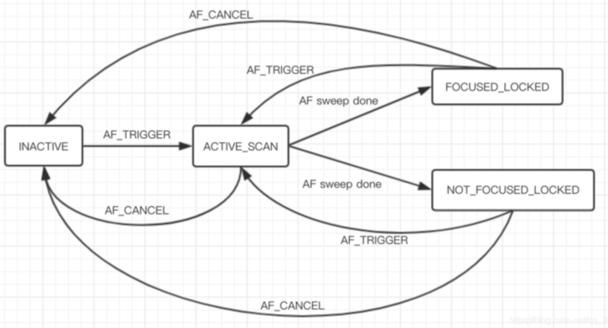

对于对焦时状态的转换，相机设备是可以跳过瞬态的，瞬态是指在没有应用干预的情况的下发生状态变化的的状态。

瞬态有：
ACTIVE_SCAN
INACTIVE
PASSIVE_FOCUSED
PASSIVE_SCAN
PASSIVE_UNFOCUSED

因为瞬态的原因，所以我们在设置手动对焦时，不能由瞬态来决定是否对焦成功或失败。

对于瞬态，相机设备在两个结果之间跳过一个或多个瞬态，也是可以的，例如：

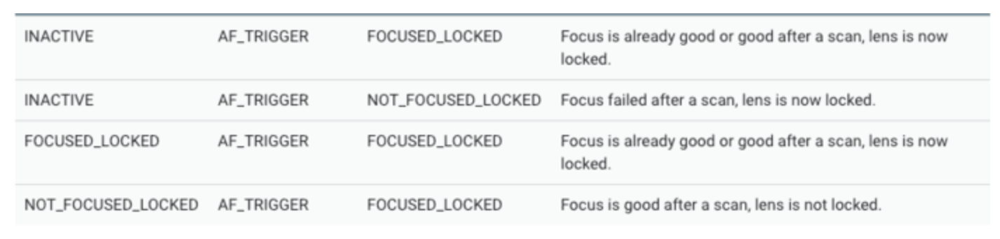

AF_MODE_CONTINUOUS_VIDEO or AF_MODE_CONTINUOUS_PICTURE

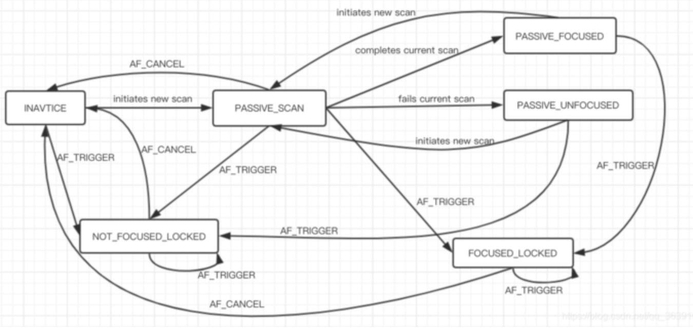

当在AF_MODE_CONTINUOUS_*（CAF模式）和AF_MODE_AUTO / AF_MODE_MACRO之间切换时，相机设备可以跳过INACTIVE或PASSIVE_SCAN状态。当触发AF时，要切换模式，将会重新评估AF：

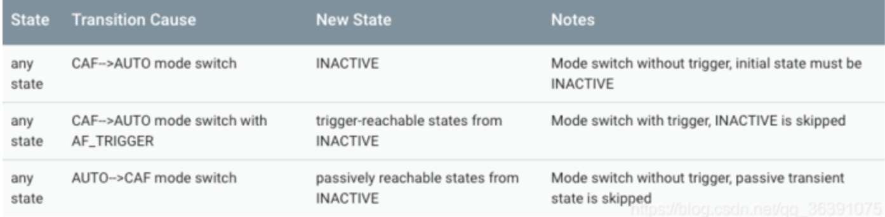

### 三、项目中的实践

录像和预览时：开启自动对焦，仅在华为nova2s上

1、AF_MODE_AUTO：
状态变化是从 ACTIVE_SCAN -> INACTIVE -> ACTIVE_SCAN -> FOCUSED_LOCKED

2、AF_MODE_CONTINUOUS_VIDEO：
状态变化是从 ACTIVE_SCAN -> INACTIVE -> ACTIVE_SCAN -> FOCUSED_LOCKED

3、AF_MODE_CONTINUOUS_PICTURE：
状态变化是 ACTIVE_SCAN -> INACTIVE -> ACTIVE_SCAN -> FOCUSED_LOCKED

4、AF_MODE_MACRO：
状态变化是从 ACTIVE_SCAN -> INACTIVE -> ACTIVE_SCAN -> FOCUSED_LOCKED

5、AF_MODE_EDOF：
大多数手机不支持

根据对API的解读，在预览时，触发手动对焦，可以将模式设置为auto，录像时，可以设置为CONTINUOUS_VIDEO

拍照/预览

1、AF_MODE_AUTO：自动
2、AF_MODE_CONTINUOUS_PICTURE：用于静像拍摄
3、AF_MODE_MACRO：用于微距模式
4、AF_MODE_EDOF：用于拍摄风景

使用华为p30拍摄，它支持的模式是：0，1，2，3，4。我就分别对1，2，4进行对比，也就是atuo，marco，picture

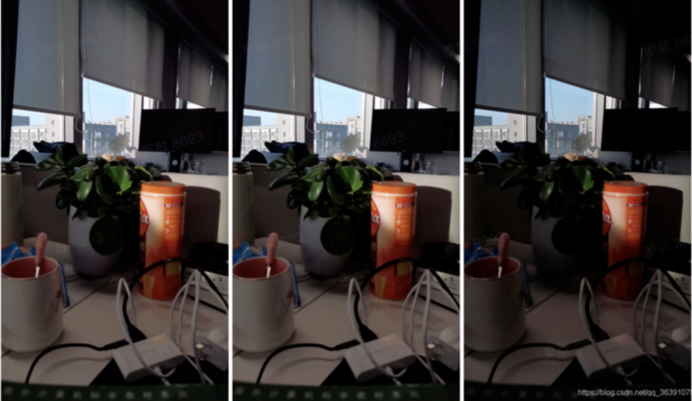

再进行微距拍摄：auto，marco，picture：

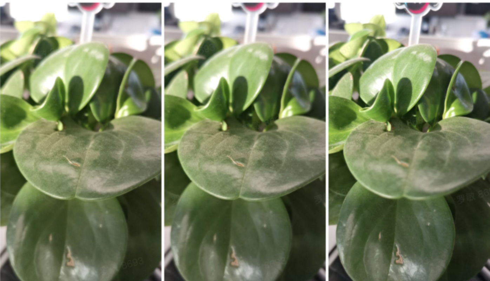

远景拍摄：auto，marco，picture

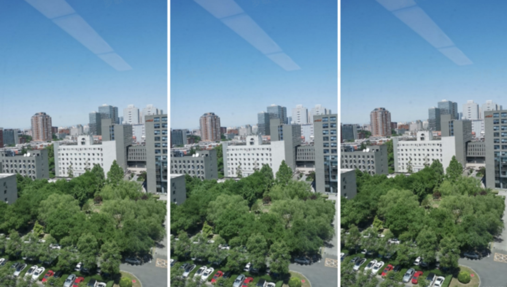

然后我们看看对焦效果：auto，marco，picture

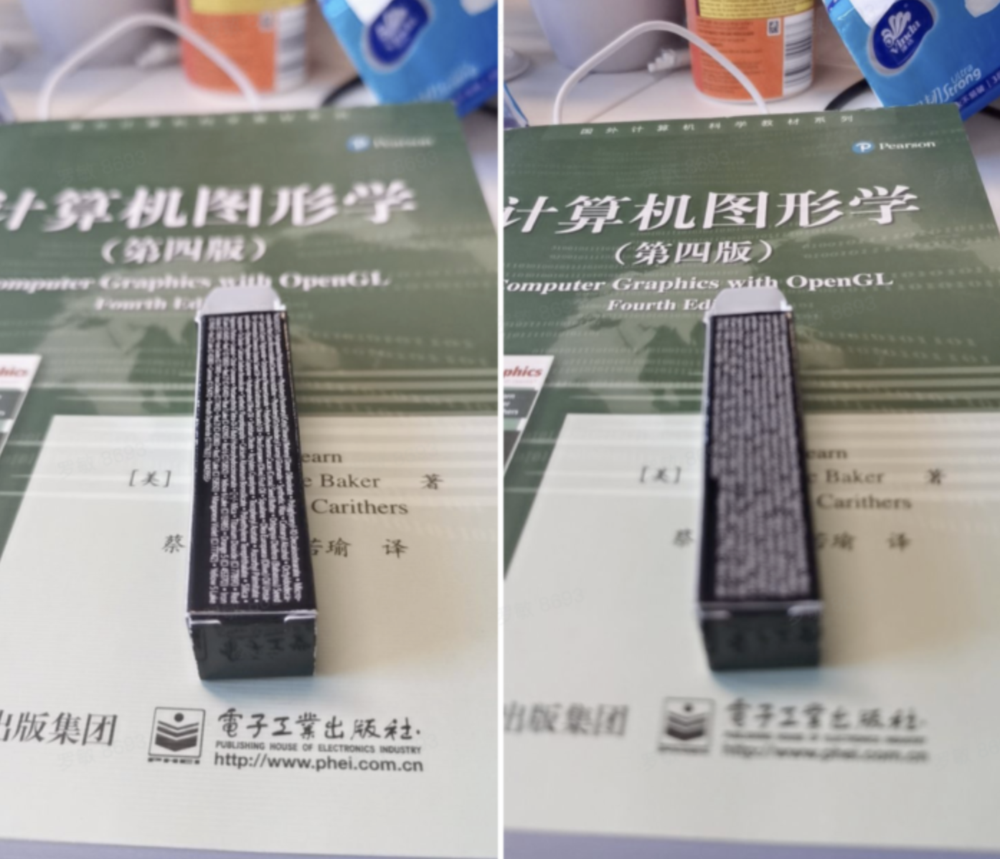

可以看到，对于拍照来说，auto模式的表现，无论是近景还是远景，呈现的效果都差不多，所以在设置手动对焦时，可以将对焦模式设置为auto。

现在，一般手机都不支持EDOF。

参考：https://blog.csdn.net/Mr_ZJC/article/details/118715214

### **四、总结** 

1）点击拍照时：为了尽快对焦且提供恒定的图像流，使用AF_MODE_CONTINUOUS_PICTURE

2）点击录像时：为了提供稳定的图像流，不会出现太大的波动，使用AF_MODE_CONTINUOUS_VIDEO

3）手动对焦时：一般情况下：使用AF_MODE_AUTO

4）近景：使用 AF_MODE_MACRO

## AE自动曝光

### AE是什么

AE(Auto Exposure)/AEC(Auto Exposure Control)自动曝光

AE 算法的主要工作原理

- 实时获取输入图像的统计信息并与设定目标亮度进行比较，而动态调节 sensor 的曝光时间和增益以及镜头光圈大小以达到实际亮度与设定目标亮度接近

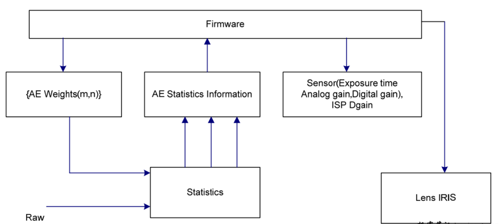

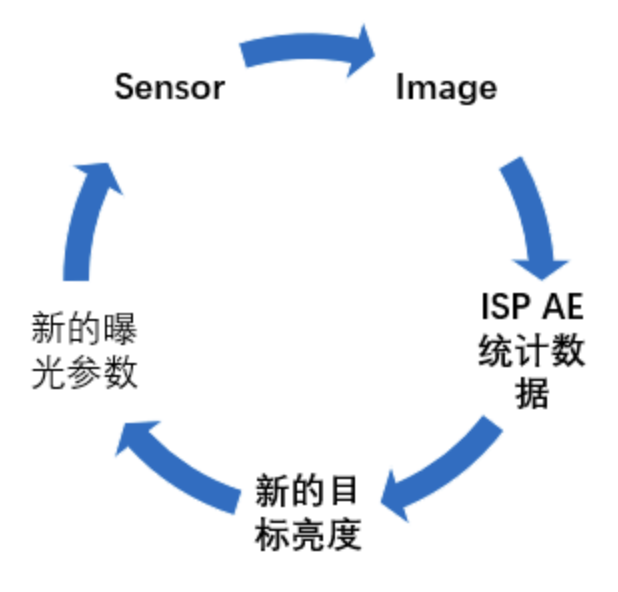

### Android中3A总开关

**CaptureRequest#CONTROL_MODE**

读取CameraCharacteristics#CONTROL_AVAILABLE_MODES来判断支持哪些Control Mode

|           CONTROL_MODE取值           |                             描述                             |
| :----------------------------------: | :----------------------------------------------------------: |
|           CONTROL_MODE_OFF           | Manual 3A，3A参数完全由App决定；为了快速响应从OFF切到AUTO模式，有可能3A算法还在运行，只是结果不会使用（依赖HAL的实现） |
|          CONTROL_MODE_AUTO           | 3A参数是由3A算法计算出来，触发3A算法运算可以是App，也可能是HAL自动触发 |
|     CONTROL_MODE_USE_SCENE_MODE      | 3A参数由Scene Mode(比如ACTION，NIGHT, BEACH等)决定，但有一个例外：当Scene Mode为FACE_PRIORITY时，3A参数还是由3A算法决定 |
| CONTROL_MODE_USE_EXTENDED_SCENE_MODE | 3A参数由Extended Scene Mode决定，比如BOKEH。 API 30新增该Mode |
|     CONTROL_MODE_OFF_KEEP_STATE      |  跟OFF模式类似，区别在于3A参数被锁定在上一个模式的最新值上   |

### AE模式

**CaptureRequest#CONTROL_AE_MODE**

**当前平台支持哪些值**：读取CameraCharacteristics#CONTROL_AE_AVAILABLE_MODES

**行为**

- 当设置为OFF模式时：AE算法不生效，通过CaptureRequest#SENSOR_EXPOSURE_TIME, CaptureRequest#SENSOR_SENSITIVITY, CaptureRequest#SENSOR_FRAME_DURATION控制曝光
- 当设置为**非**OFF模式时（CONTROL_AE_MODE_ON*）：手动曝光参数不生效，会被AE算法的结果覆盖
- 当选择带有**FLASH**的模式时：表示FLASH由AE来控制，CaptureRequest#FLASH_MODE设置的参数不生效

|         CONTROL_AE_MODE取值          |                             描述                             |
| :----------------------------------: | :----------------------------------------------------------: |
|         CONTROL_AE_MODE_OFF          | 手动曝光模式。 Hardware Level为**FULL**的CameraDevice必须支持；Hardware Level为LEGACY的CameraDevice不支持；Hardware Level为**LIMITED**的CameraDevice同时支持**MANUAL_SENSOR** capability也必须支持 |
|          CONTROL_AE_MODE_ON          |                自动曝光模式，所有设备必须支持                |
|    CONTROL_AE_MODE_ON_AUTO_FLASH     |           与ON模式类似。在暗环境下会控制闪光灯打闪           |
|   CONTROL_AE_MODE_ON_ALWAYS_FLASH    |  与ON模式类似，在拍照时（STILL_CAPTURE）一定会让闪光灯打闪   |
| CONTROL_AE_MODE_ON_AUTO_FLASH_REDEYE |             与ON_AUTO_FLASH类似，会自动消除红眼              |
|  CONTROL_AE_MODE_ON_EXTERNAL_FLASH   | 告诉Camera设备外部闪光灯（不受Camera系统控制）已经打开，需要快速进行重新测光。外部闪光灯关闭后，需要切到其他ON模式 |

### AE状态

**CaptureResult#CONTROL_AE_STATE表示AE算法当前帧的状态。**

|       CONTROL_AE_MODE取值       |                             描述                             |
| :-----------------------------: | :----------------------------------------------------------: |
|    CONTROL_AE_STATE_INACTIVE    | AE算法未激活状态，每次切换AE模式 / CONTROL_MODE / CONTROL_SCENE_MODE时，AE状态都会重置到CONTROL_AE_STATE_INACTIVE，但在CaptureResult中不一定能看到这种状态 |
|   CONTROL_AE_STATE_SEARCHING    | AE算法正在收敛过程中，正在调整曝光参数，在CaptureResult中不一定能看到这种状态 |
|   CONTROL_AE_STATE_CONVERGED    |                        AE算法收敛完成                        |
|     CONTROL_AE_STATE_LOCKED     | 当前的AE参数固定不变了，被锁住了，是由CONTROL_AE_LOCK来控制的 |
| CONTROL_AE_STATE_FLASH_REQUIRED |      AE算法收敛了，但拍照时需要打闪以获得更好的图像亮度      |
|   CONTROL_AE_STATE_PRECAPTURE   | AE算法进入precapture状态，可以将CONTROL_AE_PRECAPTURE_TRIGGER设置为START来触发，打闪测光或消除红眼时需要 |

### 拍照前AE测光

CaptureRequest#CONTROL_AE_PRECAPTURE_TRIGGER标识是否触发拍照前的测光动作：

- 在Flash为不OFF时，需要在**拍照**前需要触发测光动作，用来估计场景亮度和最终打闪需要的闪光灯功率
- 在Hardware Level为LEGACY的设备上，Camera HAL自己完成测光动作，不需要App参与，其他Hardware Level的设备都需要App参与
- App只能在单个CaptureRequest中设置该参数，设置完后需要等待测光完成才能进行下一步动作（比如拍照）
- 测光完成后，Camera HAL内部为了给接下来的拍照，曝光可能会把AE锁住，因此如果App接下来不拍照，需要主动让AE恢复正常流程
  - < API 23 : 设置CONTROL_AE_LOCK为TRUE后，再设置CONTROL_AE_LOCK为FALSE
  - \>= API 23 : 设置为CONTROL_AE_PRECAPTURE_TRIGGER为CANCEL
- 支持同时对AE和AF进行preCapture trigger

|  CONTROL_AE_PRECAPTURE_TRIGGER取值   |                             描述                             |
| :----------------------------------: | :----------------------------------------------------------: |
|  CONTROL_AE_PRECAPTURE_TRIGGER_IDLE  |                    没有触发AE preCapture                     |
| CONTROL_AE_PRECAPTURE_TRIGGER_START  |                  触发AE preCapture测光操作                   |
| CONTROL_AE_PRECAPTURE_TRIGGER_CANCEL | 取消AE preCapture测光，回到AE初始状态。如果AE preCapture测光已经完成，该动作会将AE状态切到初始状态 |