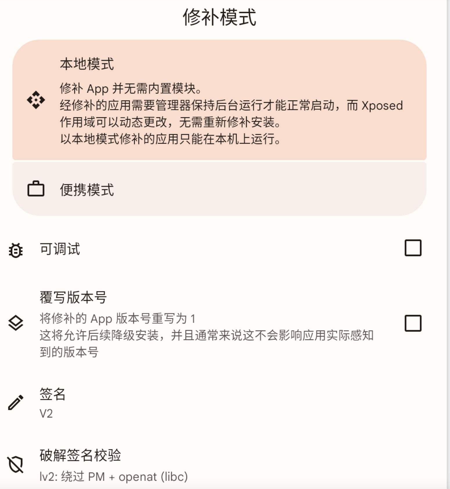

以抖音为例，参考文献：

https://libill.github.io/2019/08/06/debug-android-framework/

https://duzhaokun123.github.io/2022/05/06/simple-lspatch-guide.html

## 准备工具

### 1. LSPatch

LSPosed框架的免 Root 实现, 通过在目标APK中插入dex等整合Xposed API，需要运行 Android 9+ 的设备

https://github.com/LSPosed/LSPatch

或链接: https://pan.baidu.com/s/15g0f9WD3aR5IgYAsUlxIYg?pwd=emn6 提取码: emn6

安装打开LSPatch后，在管理器的`管理`页面点击右下角`+`，首次打包需要选择一个目录输出打包好的文件， 这里随便选一个 **空目录**

选择需要 patch 的应用, 可以选择已安装的或文件。之后会看到这样的界面：

可选择`本地模式`或`便携模式`, 本地模式需要管理器保活

选择`便携模式`需要选择要嵌入模块, 点击`嵌入模块`以选择

可选多个, 选完后点击右下角对勾以继续

最后点击右下角`开始修补`以打包

等待完成, 在输出目录下会有修补好的apk文件。点击`安装`以安装, 安装需要`Shizuku`服务, 如果没有需要去之前选择的目录手动安装

安装会卸载当前安装的应用, 注意备份。

### 2. 三方apk，比如抖音

链接: https://pan.baidu.com/s/13ms-j3Zt-WixlCUwUEttbw?pwd=2s3b 提取码: 2s3b

## 调试源码

以Camera2相机启动为例，调试CaptureRequest.java的set接口：

* 先用AS下载对应手机安卓版本的源码。

* 随便新建一个Android 新项目，包名cn.test.demo，避免com开头是因为源码有com，等下拷贝源码是避免重复
* 拷贝源码到Demo工程的java目录下

* 手机上打开要调试的app，比如抖音
* Demo工程上打开CaptureRequest，在set接口断点，然后attach抖音的进程。运行到Camera启动那边，就能断点上了。

* 如果是频繁调用的接口，可以改成日志断点。类似条件断点，在断点上右击，把Suspend的勾选去掉，会发现下面的选项。增加日志即可。

