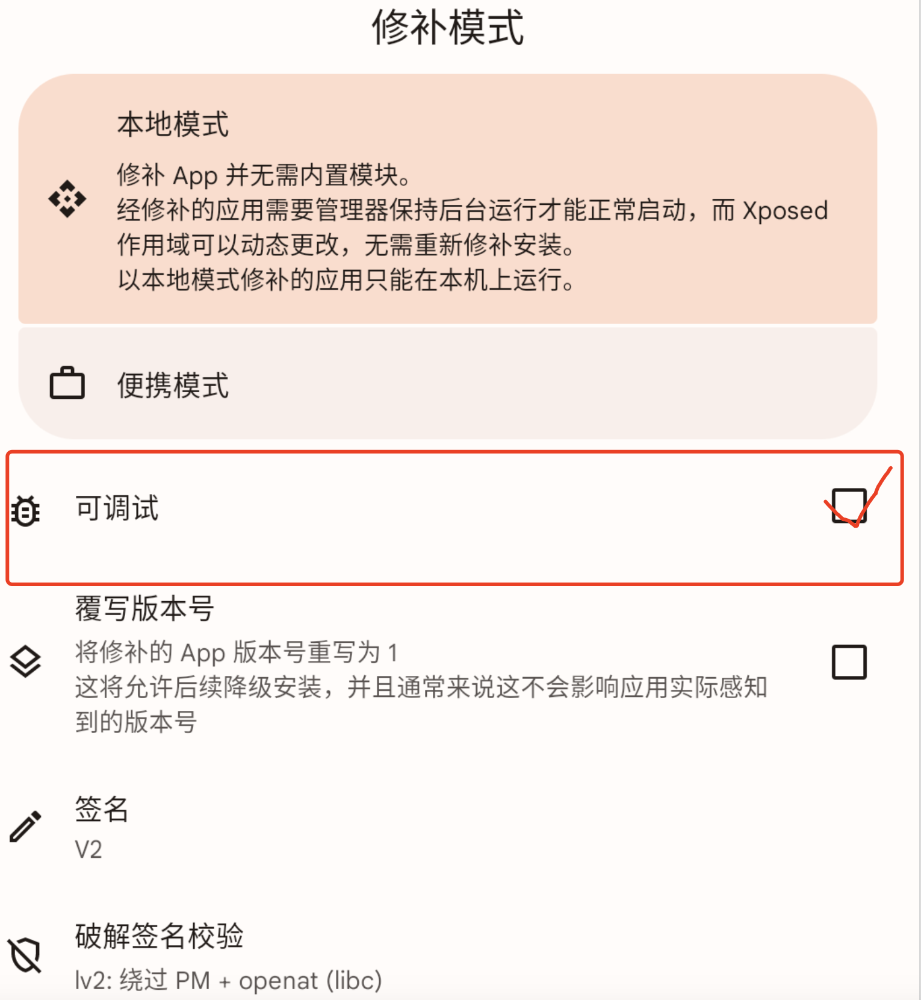

以抖音为例，参考文献：

https://libill.github.io/2019/08/06/debug-android-framework/

https://duzhaokun123.github.io/2022/05/06/simple-lspatch-guide.html


## 准备工具

### 1. LSPatch

LSPosed框架的免 Root 实现, 通过在目标APK中插入dex等整合Xposed API，需要运行 Android 9+ 的设备

https://github.com/LSPosed/LSPatch （最好找最新版本，不然中间容易出问题）

或链接: https://pan.baidu.com/s/15g0f9WD3aR5IgYAsUlxIYg?pwd=emn6 提取码: emn6


安装打开LSPatch后，在管理器的`管理`页面点击右下角`+`，首次打包需要选择一个目录输出打包好的文件， 这里随便选一个 **空目录**.


首次打包需要选择一个目录输出打包好的文件


选择需要 patch 的应用, 可以选择已安装的或文件。比如b站如图：


（也可以网上先下载apk保存到手机再选择从存储目录中选取apk）之后会看到这样的界面，注意要勾选“可调试”，不然安装patch包后在AS上找不到调试进程：



可选择`本地模式`或`便携模式`, 本地模式需要管理器保活

选择`便携模式`需要选择要嵌入模块, 点击`嵌入模块`以选择

可选多个, 选完后点击右下角对勾以继续

最后点击右下角`开始修补`以打包

等待完成, 在输出目录下会有修补好的apk文件。点击`安装`以安装, 安装需要`Shizuku`服务, 如果没有需要去之前选择的目录手动安装

安装会卸载当前安装的应用, 注意备份。


### 2. 三方apk，比如抖音

链接: https://pan.baidu.com/s/13ms-j3Zt-WixlCUwUEttbw?pwd=2s3b 提取码: 2s3b


## 调试源码

以Camera2相机启动为例，调试CaptureRequest.java的set接口：

* 先用AS下载对应手机安卓版本的源码。

* 随便新建一个Android 新项目，包名cn.test.demo，避免com开头是因为源码有com，等下拷贝源码是避免重复
* 拷贝源码到Demo工程的java目录下


* 手机上打开要调试的app，比如抖音
* Demo工程上打开CaptureRequest，在set接口断点，然后attach抖音的进程。运行到Camera启动那边，就能断点上了。


* 如果是频繁调用的接口，可以改成日志断点。类似条件断点，在断点上右击，把Suspend的勾选去掉，会发现下面的选项。增加日志即可。


## 进阶方法

上述方法也有很多缺点，大部分手机会出现卡死、断点不上的问题。更方便的方法如下：

参考文档：

https://blog.ketal.icu/cn/Xposed%E6%A8%A1%E5%9D%97%E5%BC%80%E5%8F%91%E5%85%A5%E9%97%A8%E4%BF%9D%E5%A7%86%E7%BA%A7%E6%95%99%E7%A8%8B/

**Xposed模块开发入门保姆级教程**

在开始之前，你需要准备好：

- 一台可以安装Xposed框架的手机（推荐LSPosed、Android 10+）
- 一台可以编写代码并且装有jdk的电脑
- 一个名叫[Android Studio](https://developer.android.com/studio)的软件（当然你用[IDEA](https://www.jetbrains.com/zh-cn/idea/download/)也没问题就是了）
- 一个反编译软件，如：[JADX](https://github.com/skylot/jadx)
- 一个可以查看布局的App，如：开发者助手

其次，本文假定你已经学会以下内容：

- 会Java/Kotlin其中一种语言（强烈推荐Kotlin，对模块开发特别友好，为此我专门写了一个kotlin的[Xposed模块开发用库](https://github.com/KyuubiRan/EzXHelper)来使用，能帮助开发者省下30%~50%甚至更多的代码量，注重模块本身逻辑的编写！不过本期教程不会使用就是了）
- Java的反射
- Android的基础套件（如Context、View等，其实这两个就足够了，已经能干很多了）


### 创建项目 & 引入依赖

首先，我们打开Android Studio创建一个空项目，不需要任何Activity，语言凭个人喜好创建，反正我两种都会讲。
然后，我们需要引入Xposed的库，不过它并没有上传到MavenCentral上，所以我们需要在`settings.gradle`里修改一下(gradle 7.0+)

```groovy
dependencyResolutionManagement {
    repositoriesMode.set(RepositoriesMode.FAIL_ON_PROJECT_REPOS)
    repositories {
        google()
        mavenCentral()
        maven { url 'https://api.xposed.info/' }  // 添加这一行即可
    }
}
```

之后，进入我们app目录下的build.gradle引入xposed的依赖，当然你也可以移除所有依赖来让安装包变小

```groovy
dependencies {
    compileOnly 'de.robv.android.xposed:api:82' 
    // compileOnly 'de.robv.android.xposed:api:82:sources' // 不要导入源码，这会导致idea无法索引文件，从而让语法提示失效
}
```

如果你移除了所有依赖只保留了Xposed，你就会发现，你的项目不能build，会直接报错！没关系，我们修复一下：

- 移除`src/res/values/themes.xml`里面的主题(注意还有个夜间模式，在values-night文件夹下)
- 移除`AndroidManifest.xml`文件里`<application ... />`中的`android:theme="xxx"`那一行 移除之后就能build了。我们继续，我们需要创建一个模块作用域文件，在`values`目录下创建一个名叫`arrays`的资源文件，它的内容如下：

```xml
<resources>
    <string-array name="xposedscope" >
        <!-- 这里填写模块的作用域应用的包名，可以填多个。 -->
        <item>com.ss.android.ugc.aweme</item>  <!-- 抖音 -->
        <item>com.zhiliaoapp.musically</item>  <!-- Tiktok -->
    </string-array>
</resources>
```

最后，我们在Run那里编辑一下启动配置，勾选`Always install with package manager`并且将`Launch Options`改成`Nothing`

### 声明模块

做完上一步之后，我们需要声明它是一个Xposed模块，好让框架发现它，这样我们才能激活模块。
回到`AndroidManifest.xml`文件里，我们将`<application ... />`改成以下形式（注意，是改成！就是把结尾的`/>`换成`> </application>`）

```xml
<application ... > 
        <!-- 是否为Xposed模块 -->
        <meta-data
            android:name="xposedmodule"
            android:value="true"/>
        <!-- 模块的简介（在框架中显示） -->
        <meta-data
            android:name="xposeddescription"
            android:value="我是Xposed模块简介" />
        <!-- 模块最低支持的Api版本 一般填54即可 -->
        <meta-data 
            android:name="xposedminversion"     
            android:value="54"/>
        <!-- 模块作用域 -->
        <meta-data
            android:name="xposedscope"
            android:resource="@array/xposedscope"/>
</appication>
```

然后在`src/main`目录下创建一个文件夹名叫`assets`，并且创建一个文件叫`xposed_init`，**注意，它没有后缀名！！**。
接着我们需要创建一个入口类，名叫`MainHook`（或者随便你想取什么名字都行），创建好后回到我们的`xposed_init`里并用文本文件的方式打开它，输入我们刚刚创建的类的完整路径。如：`me.kyuubiran.xposedtutorial.MainHook`，同时**注意大小写**。
到这里，我们声明模块的部分就结束了！怎么样，接下去就到了我们激动人心的编写模块部分了！

### 模块编写

#### MainHook

来到我们的`MainHook`，首先我们需要实现以下Xposed的IXposedHookLoadPackage接口，以便执行Hook操作。具体操作如下
`Java:`

```java
package me.kyuubiran.xposedtutorial;

import de.robv.android.xposed.IXposedHookLoadPackage;
import de.robv.android.xposed.callbacks.XC_LoadPackage;

public class MainHook implements IXposedHookLoadPackage {
    @Override
    public void handleLoadPackage(XC_LoadPackage.LoadPackageParam lpparam) throws Throwable {
        // 过滤不必要的应用
        if (!lpparam.packageName.equals("me.kyuubiran.xposedapp")) return;
        // 执行Hook
        hook(lpparam);
    }

    private void hook(XC_LoadPackage.LoadPackageParam lpparam) {
        // 具体流程
    }
}
```

或

```kotlin
package me.kyuubiran.xposedtutorial

import de.robv.android.xposed.IXposedHookLoadPackage
import de.robv.android.xposed.callbacks.XC_LoadPackage

class MainHook : IXposedHookLoadPackage {
    override fun handleLoadPackage(lpparam: XC_LoadPackage.LoadPackageParam) {
        // 过滤不必要的应用
        if (lpparam.packageName != "me.kyuubiran.xposedapp") return
        // 执行Hook
        hook(lpparam)
    }

    private fun hook(lpparam: XC_LoadPackage.LoadPackageParam) {
        // 具体流程
    }
}
```

hook函数可以写成如下(如下为打印Camera2相机参数设置的日志)：

```java
		private void hook(XC_LoadPackage.LoadPackageParam lpparam) {
//        Log.e("test", "hook begin");
        Class<?> clz = XposedHelpers.findClass("android.hardware.camera2.CaptureRequest$Builder", lpparam.classLoader);
        for (Method m : clz.getDeclaredMethods()) {
            if (m.getName().equals("set")) {
//                Log.e("test", "method " + m.toGenericString());
                XposedBridge.hookMethod(m, new XC_MethodHook() {
                    @Override
                    protected void afterHookedMethod(MethodHookParam param) {
                        if(param.args[1] instanceof MeteringRectangle[]){
                            MeteringRectangle[] rectangles = (MeteringRectangle[])(param.args[1]);
                            Log.e("CaptureRequest", "key : " + param.args[0].toString() + "value :" + rectangles[0].toString());
                        } else {
                            Log.e("CaptureRequest", "key : " + param.args[0].toString() + "value :" + param.args[1].toString());
                        }
                    }
                });
            }
        }


//        CaptureRequest.Key<Integer> intCls = CaptureRequest.CONTROL_AF_MODE;
//        CaptureRequest.Key<Boolean> booCls = CaptureRequest.CONTROL_AWB_LOCK;
//        CaptureRequest.Key<Float> floatCls = CaptureRequest.LENS_APERTURE;
//        CaptureRequest.Key<MeteringRectangle[]> aeRectCls = CaptureRequest.CONTROL_AE_REGIONS;
//        CaptureRequest.Key<Range<Integer>> rangeCls = CaptureRequest.CONTROL_AE_TARGET_FPS_RANGE;
//
//        // 第一种 填ClassName
//        XC_MethodHook.Unhook unhook = XposedHelpers.findAndHookMethod(
//                "android.hardware.camera2.CaptureRequest$Builder",    // className
//                lpparam.classLoader,    // classLoader 使用lpparam.classLoader
//                "set",             // 要hook的方法
//                intCls.getClass().getGenericSuperclass(),           // 要hook的方法的参数表，如果有多个就用逗号隔开
//                Integer.class,
//                new XC_MethodHook() {   // 最后一个填hook的回调
//                    @Override
//                    protected void beforeHookedMethod(MethodHookParam param) {
//
//                    } // Hook方法执行前
//                    @Override
//                    protected void afterHookedMethod(MethodHookParam param) {
//                        //Log.e("CaptureRequest", "key : " + param.args[0].toString() + "value :" + param.args[1].toString());
//                        Log.e("CaptureRequest", "xxxx");
//                    } // Hook方法执行后
//                });
//        // 它返回一个unhook 在你不需要继续hook的时候可以调用它来取消Hook
//        unhook.unhook();    // 取消空的Hook
    }
    
	 /**
     *防止重复执行Hook代码
     * @param flag 判断标识,针对不同Hook代码分别进行判断
     * @return 是否已经注入Hook代码
     */
    private boolean isInjecter(String flag) {
        try {
            if (TextUtils.isEmpty(flag)) return false;
            Field methodCacheField = XposedHelpers.class.getDeclaredField("methodCache");
            methodCacheField.setAccessible(true);
            HashMap<String, Method> methodCache = (HashMap<String, Method>) methodCacheField.get(null);
            Method method=XposedHelpers.findMethodBestMatch(Application.class,"onCreate");
            String key=String.format("%s#%s",flag,method.getName());
            if (methodCache.containsKey(key)) return true;
            methodCache.put(key, method);
            return false;
        } catch (Throwable e) {
            e.printStackTrace();
        }
        return false;
    }
```

到这里，我们的准备工作已经完成，安装模块并在框架中激活它！

把这个app run到手机，如果成功，会发现比如原来的LSPatch app的管理->模块 这一栏会多出一个TTXposed（你app工程的包名）。


然后按之前基础操作中安装patch过的app，比如tiktok。点击后选择模块作用域，如图：


会进入如下界面，点击打钩即可：


现在进入tiktok的相机，就可以看到hook的日志了。


