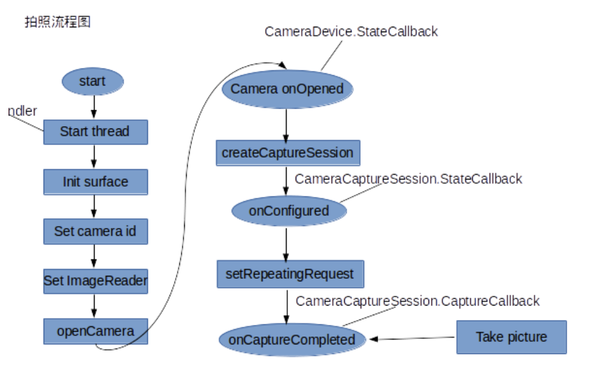

Android API 21新增了Camera2，这与之前的camera架构完全不同，使用起来也比较复杂，但是功能变得很强大。

在讲解开启预览之前，首先需要了解camera2的几个比较重要的类：

- CameraManager： 管理手机上的所有摄像头设备，它的作用主要是获取摄像头列表和打开指定的摄像头
- CameraDevice： 具体的摄像头设备，它有一系列参数（预览尺寸、拍照尺寸等），可以通过CameraManager的getCameraCharacteristics()方法获取。它的作用主要是创建CameraCaptureSession和CaptureRequest
- CameraCaptureSession： 相机捕获会话，用于处理拍照和预览的工作（很重要）
- CaptureRequest： 捕获请求，定义输出缓冲区以及显示界面（TextureView或SurfaceView）等

下面梳理一下使用Camera2进行预览和拍照的主要流程：



### 1、定义TextureView作为预览界面

在布局文件中加入TextureView控件，然后实现其监听事件

```java
textureView = (TextureView) findViewById(R.id.textureView);
```

然后我们可以在OnResume()方法中设置监听SurefaceTexture的事件

```java
textureView.setSurfaceTextureListener(textureListener);
```

当SurefaceTexture准备好后会回调SurfaceTextureListener 的onSurfaceTextureAvailable()方法：

```java
TextureView.SurfaceTextureListener textureListener = new TextureView.SurfaceTextureListener() {
    @Override
    public void onSurfaceTextureAvailable(SurfaceTexture surface, int width, int height) {
        // 当SurefaceTexture可用的时候，设置相机参数并打开相机
        setupCamera(width, height);
        openCamera();
    }
};
```

### 2、设置相机参数

为了更好地预览，我们根据TextureView的尺寸设置预览尺寸，Camera2中使用CameraManager来管理摄像头

```java
private void setupCamera(int width, int height) {
    // 获取摄像头的管理者CameraManager
    CameraManager manager = (CameraManager) getSystemService(Context.CAMERA_SERVICE);
    try {
        // 遍历所有摄像头
        for (String cameraId: manager.getCameraIdList()) {
            CameraCharacteristics characteristics = manager.getCameraCharacteristics(cameraId);
            // 默认打开后置摄像头
            if (characteristics.get(CameraCharacteristics.LENS_FACING) == CameraCharacteristics.LENS_FACING_FRONT)
                continue;
            // 获取StreamConfigurationMap，它是管理摄像头支持的所有输出格式和尺寸
            StreamConfigurationMap map = characteristics.get(CameraCharacteristics.SCALER_STREAM_CONFIGURATION_MAP);
            // 根据TextureView的尺寸设置预览尺寸
            mPreviewSize = getOptimalSize(map.getOutputSizes(SurfaceTexture.class), width, height);
            mCameraId = cameraId;
            break;
        }
    } catch (CameraAccessException e) {
        e.printStackTrace();
    }
}
```

### 3、开启相机

Camera2中打开相机也需要通过CameraManager类：

```java
private void openCamera() {
    // 获取相机的管理者CameraManager
    CameraManager manager = (CameraManager) getSystemService(Context.CAMERA_SERVICE);
    // 检查权限
    try {
        if (ActivityCompat.checkSelfPermission(this, Manifest.permission.CAMERA) != PackageManager.PERMISSION_GRANTED) {
            return;
        }
        // 打开相机，第一个参数指示打开哪个摄像头，第二个参数stateCallback为相机的状态回调接口，第三个参数用来确定Callback在哪个线程执行，为null的话就在当前线程执行
        manager.openCamera(mCameraId, stateCallback, null);
    } catch (CameraAccessException e) {
        e.printStackTrace();
    }
}
```

实现StateCallback 接口，当相机打开后会回调onOpened方法，在这个方法里面开启预览

```java
private final CameraDevice.StateCallback stateCallback = new CameraDevice.StateCallback() {
    @Override
    public void onOpened(CameraDevice camera) {
        mCameraDevice = camera;
        // 开启预览
        startPreview();
    }
}
```

### 4、开启相机预览

我们使用TextureView显示相机预览数据，Camera2的预览和拍照数据都是使用CameraCaptureSession会话来请求的

```java
 private void startPreview() {
        setupImageReader();
        SurfaceTexture mSurfaceTexture = textureView.getSurfaceTexture();
        // 设置TextureView的缓冲区大小
        mSurfaceTexture.setDefaultBufferSize(mPreviewSize.getWidth(), mPreviewSize.getHeight());
        // 获取Surface显示预览数据
        mPreviewSurface = new Surface(mSurfaceTexture);
        try {
            getPreviewRequestBuilder();
            // 创建相机捕获会话，第一个参数是捕获数据的输出Surface列表，第二个参数是CameraCaptureSession的状态回调接口，当它创建好后会回调onConfigured方法，第三个参数用来确定Callback在哪个线程执行，为null的话就在当前线程执行
            mCameraDevice.createCaptureSession(Arrays.asList(mPreviewSurface, mImageReader.getSurface()), new CameraCaptureSession.StateCallback() {
                @Override
                public void onConfigured(CameraCaptureSession session) {
                    mCaptureSession = session;
                    repeatPreview();
                }

                @Override
                public void onConfigureFailed(CameraCaptureSession session) {

                }
            }, null);
        } catch (CameraAccessException e) {
            e.printStackTrace();
        }
    }
```

### 5、实现PreviewCallback

Camera2没有提供Camera中的PreviewCallback，那么我们如何实现预览帧数据呢？在Camera2中提供了CameraCaptureSession.CaptureCallback：

```java
private CameraCaptureSession.CaptureCallback mPreviewCaptureCallback = new CameraCaptureSession.CaptureCallback() {
    @Override
    public void onCaptureCompleted(@NonNull CameraCaptureSession session, @NonNull CaptureRequest request, @NonNull TotalCaptureResult result) {

    }

    @Override
    public void onCaptureProgressed(@NonNull CameraCaptureSession session, @NonNull CaptureRequest request, @NonNull CaptureResult partialResult) {

    }
};
```

### 6、实现拍照操作

Camera2拍照是通过ImageReader来实现的，首先先做些准备工作，比如设置拍照参数，如方向、尺寸等

```java
private static final SparseIntArray ORIENTATION = new SparseIntArray();
    static {
        ORIENTATION.append(Surface.ROTATION_0, 90);
        ORIENTATION.append(Surface.ROTATION_90, 0);
        ORIENTATION.append(Surface.ROTATION_180, 270);
        ORIENTATION.append(Surface.ROTATION_270, 180);
    }
```

创建一个ImageReader，并监听它的事件：

```java
private void setupImageReader() {
    // 前三个参数分别是需要的尺寸和格式，最后一个参数代表每次最多获取几帧数据
    mImageReader = ImageReader.newInstance(mPreviewSize.getWidth(), mPreviewSize.getHeight(), ImageFormat.JPEG, 1);
    // 监听ImageReader的事件，当有图像流数据可用时会回调onImageAvailable方法，它的参数就是预览帧数据，可以对这帧数据进行处理
    mImageReader.setOnImageAvailableListener(new ImageReader.OnImageAvailableListener() {
        @Override
        public void onImageAvailable(ImageReader reader) {
            Log.i(TAG, "Image Available!");
            Image image = reader.acquireLatestImage();
            // 开启线程异步保存图片
            new Thread(new ImageSaver(image)).start();
        }
    }, null);
}
```

注意：一定要调用reader.acquireLatestImage()和close()方法，否则预览画面就会卡住.

创建保存图片的线程

```java
public static class ImageSaver implements Runnable {
        private Image mImage;
        public ImageSaver(Image image) {
            mImage = image;
        }
        @Override
        public void run() {
            ByteBuffer buffer = mImage.getPlanes()[0].getBuffer();
            byte[] data = new byte[buffer.remaining()];
            buffer.get(data);
            mImageFile = new File(Environment.getExternalStorageDirectory() + "/DCIM/myPicture.jpg");
            FileOutputStream fos = null;
            try {
                fos = new FileOutputStream(mImageFile);
                fos.write(data, 0 ,data.length);
            } catch (IOException e) {
                e.printStackTrace();
            } finally {
                mImageFile = null;
                if (fos != null) {
                    try {
                        fos.close();
                        fos = null;
                    } catch (IOException e) {
                        e.printStackTrace();
                    }
                }
            }
        }
    }
```

现在准备工作做好了，还需要响应点击拍照事件，我们设置点击拍照按钮调用capture()方法，capture()方法即实现拍照：

```java
private void capture() {
    try {
        // 首先我们创建请求拍照的CaptureRequest
        final CaptureRequest.Builder mCaptureBuilder = mCameraDevice.createCaptureRequest(CameraDevice.TEMPLATE_STILL_CAPTURE);
        // 获取屏幕方向
        int rotation = getWindowManager().getDefaultDisplay().getRotation();

        mCaptureBuilder.addTarget(mPreviewSurface);
        mCaptureBuilder.addTarget(mImageReader.getSurface());

        // 设置拍照方向
        mCaptureBuilder.set(CaptureRequest.JPEG_ORIENTATION, ORIENTATION.get(rotation));

        // 停止预览
        mCaptureSession.stopRepeating();

        // 开始拍照，然后回调上面的接口重启预览，因为mCaptureBuilder设置ImageReader作为target，所以会自动回调ImageReader的onImageAvailable()方法保存图片
        CameraCaptureSession.CaptureCallback captureCallback = new CameraCaptureSession.CaptureCallback() {

            @Override
            public void onCaptureCompleted(@NonNull CameraCaptureSession session, @NonNull CaptureRequest request, @NonNull TotalCaptureResult result) {
                repeatPreview();
            }
        };

        mCaptureSession.capture(mCaptureBuilder.build(), captureCallback, null);
    } catch (CameraAccessException e) {
        e.printStackTrace();
    }
}
```

 

示例代码：https://github.com/renhui/RHCamera2

Google官方Demo：https://github.com/googlearchive/android-Camera2Basic