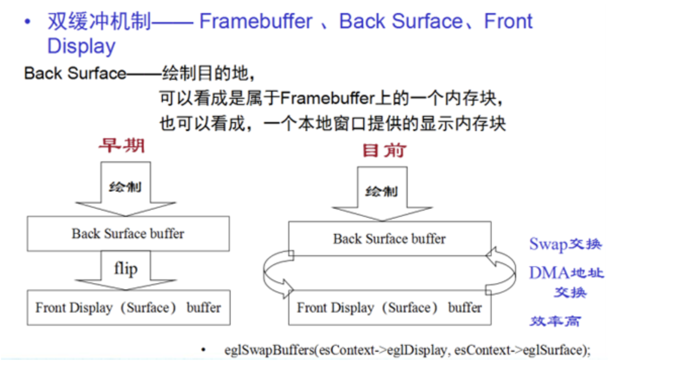

参考：https://www.twblogs.net/a/5e4f42b8bd9eee101e84e199/?lang=zh-cn

我们知道，在android camera里，可以给一个request添加多个target.比如以google的camera2Basic为例：

```java
private void createCameraPreviewSession() {
        try {
            SurfaceTexture texture = mTextureView.getSurfaceTexture();
            assert texture != null;

            // We configure the size of default buffer to be the size of camera preview we want.
            texture.setDefaultBufferSize(mPreviewSize.getWidth(), mPreviewSize.getHeight());

            // This is the output Surface we need to start preview.
            Surface surface = new Surface(texture);

            // We set up a CaptureRequest.Builder with the output Surface.
            mPreviewRequestBuilder
                    = mCameraDevice.createCaptureRequest(CameraDevice.TEMPLATE_PREVIEW);
            mPreviewRequestBuilder.addTarget(surface);
            mPreviewRequestBuilder.addTarget(mImageReader.getSurface());

            // Here, we create a CameraCaptureSession for camera preview.
            mCameraDevice.createCaptureSession(Arrays.asList(surface, mImageReader.getSurface()),
                    new CameraCaptureSession.StateCallback() {

                        @Override
                        public void onConfigured(@NonNull CameraCaptureSession cameraCaptureSession) {
                            // The camera is already closed
                            if (null == mCameraDevice) {
                                return;
                            }

                            // When the session is ready, we start displaying the preview.
                            mCaptureSession = cameraCaptureSession;
                            try {
                                // Auto focus should be continuous for camera preview.
                             //   mPreviewRequestBuilder.set(CaptureRequest.CONTROL_AF_MODE,
                            //            CaptureRequest.CONTROL_AF_MODE_CONTINUOUS_PICTURE);
                                // Flash is automatically enabled when necessary.
                             //   setAutoFlash(mPreviewRequestBuilder);

                                // Finally, we start displaying the camera preview.
                                mPreviewRequest = mPreviewRequestBuilder.build();
                                mCaptureSession.setRepeatingRequest(mPreviewRequest,
                                        mCaptureCallback, mBackgroundHandler);
                            } catch (CameraAccessException e) {
                                e.printStackTrace();
                            }
                        }

                        @Override
                        public void onConfigureFailed(
                                @NonNull CameraCaptureSession cameraCaptureSession) {
                            showToast("Failed");
                        }
                    }, null
            );
        } catch (CameraAccessException e) {
            e.printStackTrace();
        }
    }
```

​    在这个函数里，就addTarget了两个surface, 一个是用来预览用的SurfaceTexture，另一个是用来接收预览数据进行处理的imageReader。

​     我们今天要说的就是这个ImageReader。这个ImageReader的创建方式如下：

```
mImageReader = ImageReader.newInstance(1280, 960,
               ImageFormat.YUV_420_888, /*maxImages*/2);
mImageReader.setOnImageAvailableListener(
               mOnImageAvailableListener, mBackgroundHandler);
```

​    这样创建好后，在下面的代码段里收到帧数据，可以用来做拍照或者图像编码处理等：

```
    private final ImageReader.OnImageAvailableListener mOnImageAvailableListener
            = new ImageReader.OnImageAvailableListener() {

        @Override
        public void onImageAvailable(ImageReader reader) {
            Image img = reader.acquireLatestImage(); 
//          mBackgroundHandler.post(new ImageSaver(reader.acquireNextImage(), mFile));
            img.close();
        }

    };
```

​    好，现在问题来了。如果我们在newInstance的时候，创建imageReader时用的格式是jpeg或yuv的，那么在onImageAvailable里接收数据的频繁会非常的低。特别是jpeg，每秒大概只能接收到一两帧，yuv也会卡得很，每秒最多不超过15帧。并且同时add了imageReader后，会严重拖慢预览的性能，预览画面也会跟着卡顿起来。特别是在摄像头移动的时候，会有严重的残影。

​    要解决这个问题，先要弄清楚这个卡顿，究竟是在哪个地方卡住的。是有耗时操作，还是系统内有啥限制导致丢帧？为了弄清这个问题，下面我从系统层入手，排查这个问题。


​    1.）rameworks\base\core\java\android\hardware\camera2\legacy\RequestThreadManager.java

```
    private final SurfaceTexture.OnFrameAvailableListener mPreviewCallback =
            new SurfaceTexture.OnFrameAvailableListener() {
                @Override
                public void onFrameAvailable(SurfaceTexture surfaceTexture) {
                    if (mGLThreadManager != null) {
                        mGLThreadManager.queueNewFrame();
                    }
                }
            };
```

​    2.）frameworks\base\core\java\android\hardware\camera2\legacy\GLThreadManager.java

```
    public void queueNewFrame() {
        Handler handler = mGLHandlerThread.getHandler();

        /**
         * Avoid queuing more than one new frame.  If we are not consuming faster than frames
         * are produced, drop frames rather than allowing the queue to back up.
         */
        if (!handler.hasMessages(MSG_NEW_FRAME)) {
            handler.sendMessage(handler.obtainMessage(MSG_NEW_FRAME));
        } else {
            Log.e(TAG, "GLThread dropping frame.  Not consuming frames quickly enough!");
        }
    }
```

​    注意这里的注释，大意是，如果消费帧的速度，比不上生产帧的速度，则会丢弃帧。从这里我们可以大概的猜测下，imageReader丢帧的原因。应该是我们在取帧数据的时候，消耗了太长的时间。也就是取帧的速度，比不上摄像头生产帧的速度。

​    3.）frameworks\base\core\java\android\hardware\camera2\legacy\GLThreadManager.java

```
    private final Handler.Callback mGLHandlerCb = new Handler.Callback() {
        ......
        public boolean handleMessage(Message msg) {
            ......
            try {
                switch (msg.what) {
                    ......
                    case MSG_NEW_FRAME:
						Log.i(TAG, "MSG_NEW_FRAME mDroppingFrames "+mDroppingFrames);
                        if (mDroppingFrames) {
                            Log.i(TAG, "Ignoring frame.");
                            break;
                        }

                        if (!mConfigured) {
                            Log.e(TAG, "Dropping frame, EGL context not configured!");
                        }
                        mTextureRenderer.drawIntoSurfaces(mCaptureCollector);
                        break;
                    ......
                    default:
                        Log.e(TAG, "Unhandled message " + msg.what + " on GLThread.");
                        break;
                }
            } catch (Exception e) {
                //!--
            }
            return true;
        }
    };
```

​    4.)frameworks\base\core\java\android\hardware\camera2\legacy\SurfaceTextureRenderer.java

```
   public void drawIntoSurfaces(CaptureCollector targetCollector) {
        ......
        if ((mSurfaces == null || mSurfaces.size() == 0)
                && (mConversionSurfaces == null || mConversionSurfaces.size() == 0)) {
            return;
        }

        ......
        for (EGLSurfaceHolder holder : mSurfaces) {
            if (LegacyCameraDevice.containsSurfaceId(holder.surface, targetSurfaceIds)) {
                try{
                    LegacyCameraDevice.setSurfaceDimens(holder.surface, holder.width,
                            holder.height);
                    makeCurrent(holder.eglSurface);

                    LegacyCameraDevice.setNextTimestamp(holder.surface, captureHolder.second);
                    drawFrame(mSurfaceTexture, holder.width, holder.height,
                            (mFacing == CameraCharacteristics.LENS_FACING_FRONT) ?
                                    FLIP_TYPE_HORIZONTAL : FLIP_TYPE_NONE);
                    swapBuffers(holder.eglSurface);
                } catch (LegacyExceptionUtils.BufferQueueAbandonedException e) {
                    Log.w(TAG, "Surface abandoned, dropping frame. ", e);
                    request.setOutputAbandoned();
                }
            }
        }
		
        for (EGLSurfaceHolder holder : mConversionSurfaces) {
            if (LegacyCameraDevice.containsSurfaceId(holder.surface, targetSurfaceIds)) {
                // glReadPixels reads from the bottom of the buffer, so add an extra vertical flip
                try {
                    makeCurrent(holder.eglSurface);
                    drawFrame(mSurfaceTexture, holder.width, holder.height,
                            (mFacing == CameraCharacteristics.LENS_FACING_FRONT) ?
                                    FLIP_TYPE_BOTH : FLIP_TYPE_VERTICAL);
                } catch (LegacyExceptionUtils.BufferQueueAbandonedException e) {
                    // Should never hit this.
                    throw new IllegalStateException("Surface abandoned, skipping drawFrame...", e);
                }
                mPBufferPixels.clear();
                GLES20.glReadPixels(/*x*/ 0, /*y*/ 0, holder.width, holder.height,
                        GLES20.GL_RGBA, GLES20.GL_UNSIGNED_BYTE, mPBufferPixels);
                checkGlError("glReadPixels");
                try {
                    int format = LegacyCameraDevice.detectSurfaceType(holder.surface);
                    LegacyCameraDevice.setSurfaceDimens(holder.surface, holder.width,
                            holder.height);
                    LegacyCameraDevice.setNextTimestamp(holder.surface, captureHolder.second);
                    //!++ fix pixel data shift.
                    byte[] pixelArray;
					Log.i(TAG, "drawIntoSurfaces copyOfRange start, mPBufferPixels.arrayOffset()="+mPBufferPixels.arrayOffset());
                    if (mPBufferPixels.arrayOffset() == 0) {
                        pixelArray = mPBufferPixels.array();
                    } else {
                        pixelArray = Arrays.copyOfRange(
                                mPBufferPixels.array(),
                                mPBufferPixels.arrayOffset(),
                                mPBufferPixels.capacity() + mPBufferPixels.arrayOffset());
                    }
					//这里跑到LegacyCameraDevice.produceFrame，然后在LegacyCameraDevice.produceFrame里的
					// anw->queueBuffer里，跑到了android_media_ImageReader.cpp里的onFrameAvailable里。再
				    //跑了app在的onFrameAvailable
                    LegacyCameraDevice.produceFrame(holder.surface, pixelArray,
                            holder.width, holder.height, format);
                    //!++
                    //!--
                } catch (LegacyExceptionUtils.BufferQueueAbandonedException e) {
                    Log.w(TAG, "Surface abandoned, dropping frame. ", e);
                    request.setOutputAbandoned();
                }
            }
        }
        targetCollector.previewProduced();

        if (doTiming) {
            endGlTiming();
        }
    }
```

​    在这一步里，我们看到了有两个Surface，一个是mSurfaces队列，还有一个是mConversionSurfaces队列。从代码上看来，两种队列的处理方式不同。mConversionSurfaces的，需要先用GLES20.glReadPixels从gpu将数据拷贝到cpu里来，然后再交由LegacyCameraDevice.produceFrame去将ragb的帧数据，转成app上指定的数据。

​    以我们这个例子为例，我们app上指定的是YUV_420_888，但是gpu里渲染给surface的数据是rgb的，所以还要转成yuv的才行。看起来，好像是这里拷贝然后再转码耗费的时间导致的卡顿。那我们继续跟进去，在通过glReadPixels取到数据后，将给了LegacyCameraDevice.produceFrame去处理。


​    5.）frameworks\base\core\java\android\hardware\camera2\legacy\LegacyCameraDevice.java

```
    static void produceFrame(Surface surface, byte[] pixelBuffer, int width,
                             int height, int pixelFormat)
            throws BufferQueueAbandonedException {
        checkNotNull(surface);
        checkNotNull(pixelBuffer);
        checkArgumentPositive(width, "width must be positive.");
        checkArgumentPositive(height, "height must be positive.");

        LegacyExceptionUtils.throwOnError(nativeProduceFrame(surface, pixelBuffer, width, height,
                pixelFormat));
    }
```

​    6.)frameworks\base\core\jni\android_hardware_camera2_legacy_LegacyCameraDevice.cpp

```
static jint LegacyCameraDevice_nativeProduceFrame(JNIEnv* env, jobject thiz, jobject surface,
        jbyteArray pixelBuffer, jint width, jint height, jint pixelFormat) {
    ........

    status_t err = produceFrame(anw, reinterpret_cast<uint8_t*>(pixels), width, height,
            pixelFormat, bufSize);
    ........
    return NO_ERROR;
}
```

​    7.)frameworks\base\core\jni\android_hardware_camera2_legacy_LegacyCameraDevice.cpp

```
static status_t produceFrame(const sp<ANativeWindow>& anw,
                             uint8_t* pixelBuffer,
                             int32_t bufWidth, // Width of the pixelBuffer
                             int32_t bufHeight, // Height of the pixelBuffer
                             int32_t pixelFmt, // Format of the pixelBuffer
                             int32_t bufSize) {
    ........
    switch(pixelFmt) {
        case HAL_PIXEL_FORMAT_YCrCb_420_SP: {
            if (bufferLength < totalSizeBytes) {
                ALOGE("%s: PixelBuffer size %zu too small for given dimensions",
                        __FUNCTION__, bufferLength);
                return BAD_VALUE;
            }
            uint8_t* img = NULL;
            ALOGV("%s: Lock buffer from %p for write", __FUNCTION__, anw.get());
            err = buf->lock(GRALLOC_USAGE_SW_WRITE_OFTEN, (void**)(&img));
            if (err != NO_ERROR) return err;

            uint8_t* yPlane = img;
            uint8_t* uPlane = img + height * width;
            uint8_t* vPlane = uPlane + 1;
            size_t chromaStep = 2;
            size_t yStride = width;
            size_t chromaStride = width;

            rgbToYuv420(pixelBuffer, width, height, yPlane,
                    uPlane, vPlane, chromaStep, yStride, chromaStride);
            break;
        }
        case HAL_PIXEL_FORMAT_YV12: {
            if (bufferLength < totalSizeBytes) {
                ALOGE("%s: PixelBuffer size %zu too small for given dimensions",
                        __FUNCTION__, bufferLength);
                return BAD_VALUE;
            }

            if ((width & 1) || (height & 1)) {
                ALOGE("%s: Dimens %zu x %zu are not divisible by 2.", __FUNCTION__, width, height);
                return BAD_VALUE;
            }

            uint8_t* img = NULL;
            //!++
            ALOGI("%s: Lock buffer from %p for write", __FUNCTION__, anw.get());
            //!--
            err = buf->lock(GRALLOC_USAGE_SW_WRITE_OFTEN, (void**)(&img));
            if (err != NO_ERROR) {
                ALOGE("%s: Error %s (%d) while locking gralloc buffer for write.", __FUNCTION__,
                        strerror(-err), err);
                return err;
            }

            uint32_t stride = buf->getStride();
            ALOGV("%s: stride is: %" PRIu32, __FUNCTION__, stride);
            LOG_ALWAYS_FATAL_IF(stride % 16, "Stride is not 16 pixel aligned %d", stride);

            uint32_t cStride = ALIGN(stride / 2, 16);
            size_t chromaStep = 1;

            uint8_t* yPlane = img;
            uint8_t* crPlane = img + static_cast<uint32_t>(height) * stride;
            uint8_t* cbPlane = crPlane + cStride * static_cast<uint32_t>(height) / 2;

            rgbToYuv420(pixelBuffer, width, height, yPlane,
                    crPlane, cbPlane, chromaStep, stride, cStride);
            break;
        }
        case HAL_PIXEL_FORMAT_YCbCr_420_888: {
            // Software writes with YCbCr_420_888 format are unsupported
            // by the gralloc module for now
            if (bufferLength < totalSizeBytes) {
                ALOGE("%s: PixelBuffer size %zu too small for given dimensions",
                        __FUNCTION__, bufferLength);
                return BAD_VALUE;
            }
            android_ycbcr ycbcr = android_ycbcr();
            ALOGV("%s: Lock buffer from %p for write", __FUNCTION__, anw.get());

            err = buf->lockYCbCr(GRALLOC_USAGE_SW_WRITE_OFTEN, &ycbcr);
            if (err != NO_ERROR) {
                ALOGE("%s: Failed to lock ycbcr buffer, error %s (%d).", __FUNCTION__,
                        strerror(-err), err);
                return err;
            }
            rgbToYuv420(pixelBuffer, width, height, &ycbcr);
            break;
        }
        case HAL_PIXEL_FORMAT_BLOB: {
            int8_t* img = NULL;
            struct camera3_jpeg_blob footer = {
                .jpeg_blob_id = CAMERA3_JPEG_BLOB_ID,
                .jpeg_size = (uint32_t)bufferLength
            };

            size_t totalJpegSize = bufferLength + sizeof(footer);
            totalJpegSize = (totalJpegSize + 3) & ~0x3; // round up to nearest octonibble

            if (totalJpegSize > totalSizeBytes) {
                ALOGE("%s: Pixel buffer needs size %zu, cannot fit in gralloc buffer of size %zu",
                        __FUNCTION__, totalJpegSize, totalSizeBytes);
                return BAD_VALUE;
            }

            err = buf->lock(GRALLOC_USAGE_SW_WRITE_OFTEN, (void**)(&img));
            if (err != NO_ERROR) {
                ALOGE("%s: Failed to lock buffer, error %s (%d).", __FUNCTION__, strerror(-err),
                        err);
                return err;
            }

            memcpy(img, pixelBuffer, bufferLength);
            memcpy(img + totalSizeBytes - sizeof(footer), &footer, sizeof(footer));
            break;
        }
        default: {
            ALOGE("%s: Invalid pixel format in produceFrame: %x", __FUNCTION__, pixelFmt);
            return BAD_VALUE;
        }
    }

    ALOGV("%s: Unlock buffer from %p", __FUNCTION__, anw.get());
    err = buf->unlock();
    if (err != NO_ERROR) {
        ALOGE("%s: Failed to unlock buffer, error %s (%d).", __FUNCTION__, strerror(-err), err);
        return err;
    }
    //!++
    ALOGI("%s: Queue buffer to %p", __FUNCTION__, anw.get());
    //!--
    err = anw->queueBuffer(anw.get(), buf->getNativeBuffer(), /*fenceFd*/-1);
    if (err != NO_ERROR) {
        ALOGE("%s: Failed to queue buffer, error %s (%d).", __FUNCTION__, strerror(-err), err);
        return err;
    }
    return NO_ERROR;
}
```

​    我们可以从这个函数里看到，传进来的数据，都在这里转码。开始我怀疑是这里转码引起的卡顿，后来在这个函数的前后加上打印发现，每次转码都只耗费了1到5毫秒左右的时间。显然，这肯定不会引起卡顿。

​    如果不是这里，那又会是哪里呢？我们往回找，的第4步的SurfaceTextureRenderer.java文件里的drawIntoSurfaces函数中，传给produceFrame的数据，是先用GLES20.glReadPixels从gpu将数据拷贝到cpu里来，然后再交由LegacyCameraDevice.produceFrame去将ragb的帧数据，转成app上指定的数据的。现在我们再在GLES20.glReadPixels这条语句的前后加上打印log，查看这里耗时多少。


从打印的log看出，当app指定imageReader的格式为 YUV_420_888 的时候，这条语句执行一次，大概耗时120毫秒左右。当然，在不同的机器，不同的版本上，这速度略有不同，总之，这是一个相当耗时的操作。

​    现在可以定位，问题基本上就是这里引起的。我们app如果指定预览的fps为25的话，理论上imageReader每秒也要收到这么多帧数据才对。但是这里读取一帧的数据，就花费了120毫秒，可想而知，一秒下来，最多能读个七八帧数据。

​    问题找到了，该怎么去解决呢？我在网上找到了一个大神的解决方案，用的是双缓冲队列。不过人家用的gles接口是3.0的，我这边是2.0的，接口有些不同，对这一块不熟，我还没弄清楚，怎么去实现。不过如果哪位同学是3.0的，倒是可以去参考一下。如果有哪位同学是2.0的，且对这一块比较熟悉的，可以留言咱们交流交流。好，下面附上这位大神的链接：

https://blog.csdn.net/c553110519/article/details/73294172

 

​    对于对opengl接口不熟，app上用imageReader的目的只是用来拍照的，可以先换另一种思路。我们还是从第4步看起，在第4步的SurfaceTextureRenderer.java文件里的drawIntoSurfaces函数中，有两个for循环，用来处理两路surface.上面讲的是第二路的mConversionSurfaces，还有一咱是mSurfaces。 这两路有什么区别呢？我们可以在这个文件里查找一下，会发现如下代码：

```
   public void configureSurfaces(Collection<Pair<Surface, Size>> surfaces) {
        ......

        for (Pair<Surface, Size> p : surfaces) {
            Surface s = p.first;
            Size surfaceSize = p.second;
            // If pixel conversions aren't handled by egl, use a pbuffer
            try {
                EGLSurfaceHolder holder = new EGLSurfaceHolder();
                holder.surface = s;
                holder.width = surfaceSize.getWidth();
                holder.height = surfaceSize.getHeight();
                if (LegacyCameraDevice.needsConversion(s)) {
                    mConversionSurfaces.add(holder);
                    // LegacyCameraDevice is the producer of surfaces if it's not handled by EGL,
                    // so LegacyCameraDevice needs to connect to the surfaces.
                    LegacyCameraDevice.connectSurface(s);
                } else {
                    mSurfaces.add(holder);
                }
            } catch (LegacyExceptionUtils.BufferQueueAbandonedException e) {
                Log.w(TAG, "Surface abandoned, skipping configuration... ", e);
            }
        }
}
    static boolean needsConversion(Surface s) throws BufferQueueAbandonedException {
        int nativeType = detectSurfaceType(s);
        return nativeType == ImageFormat.YUV_420_888 || nativeType == ImageFormat.YV12 ||
                nativeType == ImageFormat.NV21;
    }
```

​    从这里可以看出，当我们app上设置的是yuv格式时，就会添加到mConversionSurfaces这个队列里，再对它进行转码。如果不是yuv格式的，则添加到另一个队列mSurfaces.

​    8.）frameworks\base\core\java\android\hardware\camera2\legacy\SurfaceTextureRenderer.java

```
 public void drawIntoSurfaces(CaptureCollector targetCollector) {
        ........
        for (EGLSurfaceHolder holder : mSurfaces) {
			Log.i(TAG, "drawIntoSurfaces a6, j="+j);
			j++;
            if (LegacyCameraDevice.containsSurfaceId(holder.surface, targetSurfaceIds)) {
                try{
					Log.i(TAG, "drawIntoSurfaces a7");
                    LegacyCameraDevice.setSurfaceDimens(holder.surface, holder.width,
                            holder.height);
                    makeCurrent(holder.eglSurface);

                    LegacyCameraDevice.setNextTimestamp(holder.surface, captureHolder.second);
                    drawFrame(mSurfaceTexture, holder.width, holder.height,
                            (mFacing == CameraCharacteristics.LENS_FACING_FRONT) ?
                                    FLIP_TYPE_HORIZONTAL : FLIP_TYPE_NONE);
                    swapBuffers(holder.eglSurface);
                } catch (LegacyExceptionUtils.BufferQueueAbandonedException e) {
                    Log.w(TAG, "Surface abandoned, dropping frame. ", e);
                    request.setOutputAbandoned();
                }
            }
        }
        ........
}
```

​    9.）frameworks\base\core\java\android\hardware\camera2\legacy\SurfaceTextureRenderer.java

```
    private boolean swapBuffers(EGLSurface surface)
            throws LegacyExceptionUtils.BufferQueueAbandonedException {
        boolean result = EGL14.eglSwapBuffers(mEGLDisplay, surface);
        int error = EGL14.eglGetError();
        if (error == EGL14.EGL_BAD_SURFACE) {
            throw new LegacyExceptionUtils.BufferQueueAbandonedException();
        } else if (error != EGL14.EGL_SUCCESS) {
            throw new IllegalStateException("swapBuffers: EGL error: 0x" +
                    Integer.toHexString(error));
        }
        return result;
    }
```

   

​    这里没有去从gpu里取数据，而是使用的swapBuffers来将EGLDisplay, surface两个缓冲的地址对队一下，这里实际上使用的，也就是opengl的双缓冲机制，速度相当之快，大约在2毫秒左右不到就完成了数据交换。如图所示：



​    利用双缓冲进行Swap的时候，Display和Surface进行实际意义上的地址交换，来实现eglSwapBuffers的标准， 如上图的右侧所示。上图的左侧表示，单缓冲Framebuffer的形式，Surface永远都在后端， 显示的永远是Display，在GPU出现后已不使用。    

​    既然采用这种方式速度最快，那么我们就可使用这种方式了。怎么才能使用这种方式呢？正如我们上面第7步所描述的，只要使用的不是yuv的数据，都会走这一步。那我们看看除了yuv数据，我们app都可以设置哪些格式。

10.）frameworks\base\media\jni\android_media_ImageReader.cpp

```
static jint ImageReader_imageSetup(JNIEnv* env, jobject thiz, jobject image) {
        if (imgReaderFmt != bufferFormat) {
            if (imgReaderFmt == HAL_PIXEL_FORMAT_YCbCr_420_888 &&
                    isPossiblyYUV(bufferFormat)) {
                // Treat formats that are compatible with flexible YUV
                // (HAL_PIXEL_FORMAT_YCbCr_420_888) as HAL_PIXEL_FORMAT_YCbCr_420_888.
                ALOGV("%s: Treat buffer format to 0x%x as HAL_PIXEL_FORMAT_YCbCr_420_888",
                        __FUNCTION__, bufferFormat);
            } else if (imgReaderFmt == HAL_PIXEL_FORMAT_BLOB &&
                    bufferFormat == HAL_PIXEL_FORMAT_RGBA_8888) {
                // Using HAL_PIXEL_FORMAT_RGBA_8888 Gralloc buffers containing JPEGs to get around
                // SW write limitations for (b/17379185).
                ALOGV("%s: Receiving JPEG in HAL_PIXEL_FORMAT_RGBA_8888 buffer.", __FUNCTION__);
            } else {
                // Return the buffer to the queue. No need to provide fence, as this buffer wasn't
                // used anywhere yet.
                bufferConsumer->releaseBuffer(*buffer);
                ctx->returnBufferItem(buffer);

                // Throw exception
                ALOGE("Producer output buffer format: 0x%x, ImageReader configured format: 0x%x",
                        bufferFormat, ctx->getBufferFormat());
                String8 msg;
                msg.appendFormat("The producer output buffer format 0x%x doesn't "
                        "match the ImageReader's configured buffer format 0x%x.",
                        bufferFormat, ctx->getBufferFormat());
                jniThrowException(env, "java/lang/UnsupportedOperationException",
                        msg.string());
                return -1;
            }
        }
}
```

​    从上面代码可以看出，如果是yuv格式的，是直接支持的（注意，是部份yuv格式，即只有yv12,、ycbcr_420_888、ycbcr_422_sp、ycrcb_420_sp、ycbcr_422_I这5种yuv格式的才支持），详情可以看\frameworks\native\libs\gui\CpuConsumer.cpp

```
static bool isPossiblyYUV(PixelFormat format) {
    switch (static_cast<int>(format)) {
        case HAL_PIXEL_FORMAT_RGBA_8888:
        case HAL_PIXEL_FORMAT_RGBX_8888:
        case HAL_PIXEL_FORMAT_RGBA_FP16:
        case HAL_PIXEL_FORMAT_RGBA_1010102:
        case HAL_PIXEL_FORMAT_RGB_888:
        case HAL_PIXEL_FORMAT_RGB_565:
        case HAL_PIXEL_FORMAT_BGRA_8888:
        case HAL_PIXEL_FORMAT_Y8:
        case HAL_PIXEL_FORMAT_Y16:
        case HAL_PIXEL_FORMAT_RAW16:
        case HAL_PIXEL_FORMAT_RAW10:
        case HAL_PIXEL_FORMAT_RAW_OPAQUE:
        case HAL_PIXEL_FORMAT_BLOB:
        case HAL_PIXEL_FORMAT_IMPLEMENTATION_DEFINED:
            return false;

        case HAL_PIXEL_FORMAT_YV12:
        case HAL_PIXEL_FORMAT_YCbCr_420_888:
        case HAL_PIXEL_FORMAT_YCbCr_422_SP:
        case HAL_PIXEL_FORMAT_YCrCb_420_SP:
        case HAL_PIXEL_FORMAT_YCbCr_422_I:
        default:
            return true;
    }
}
```

​    如果app设置的格式不是yuv的，那么如果设置的是HAL_PIXEL_FORMAT_BLOB(即jpeg，对应关系看下面的函数)格式的，且当前设备输出的mGraphicBuffer的格式是HAL_PIXEL_FORMAT_RGBA_8888的，那么也是支持的。

```
int android_view_Surface_mapPublicFormatToHalFormat(PublicFormat f) {

    switch(f) {
        case PublicFormat::JPEG:
        case PublicFormat::DEPTH_POINT_CLOUD:
            return HAL_PIXEL_FORMAT_BLOB;
        case PublicFormat::DEPTH16:
            return HAL_PIXEL_FORMAT_Y16;
        case PublicFormat::RAW_SENSOR:
        case PublicFormat::RAW_DEPTH:
            return HAL_PIXEL_FORMAT_RAW16;
        default:
            // Most formats map 1:1
            return static_cast<int>(f);
    }
}
```

​    如果即不是yuv的，又不是blob的，那么只要app上设置的imageReader的格式，和当前设备输出的mGraphicBuffer的格式是一致的，也是可以的。

​    比如，app上设置的是HAL_PIXEL_FORMAT_RGBA_8888，且当前设备的mGraphicBuffer的格式也是HAL_PIXEL_FORMAT_RGBA_8888，那么也是支持的，是可以直接用双缓冲来处理渲染的。但是如果app设置的格式和设备的mGraphicBuffer的格式不一致，那就不支持 了。

比如，app上设置的是HAL_PIXEL_FORMAT_RGBA_8888，且当前设备的mGraphicBuffer的格式是HAL_PIXEL_FORMAT_RGBX_8888，那么就会报错。

​    至于这个当前设备的mGraphicBuffer的格式具体是在哪个地方设置的，我暂时还没看明白。希望有清楚的兄弟，可以留言一起交流。

​    最后总结一下，如果你不懂opengl的双缓冲技术，但是又想用imageReader高速的取到每一帧数据，那么就不要去用yuv的格式，只用和你当前设备匹配的格式。比如我这边用的是：

```
               mImageReader = ImageReader.newInstance(1280, 960,
                        PixelFormat.RGBA_8888, /*maxImages*/2); 
```

​    这样，onImageAvailable就可以非常快的取到每一帧的数据了。