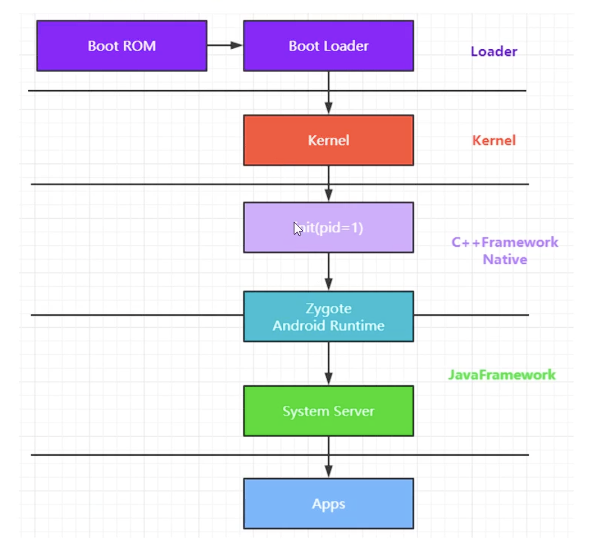
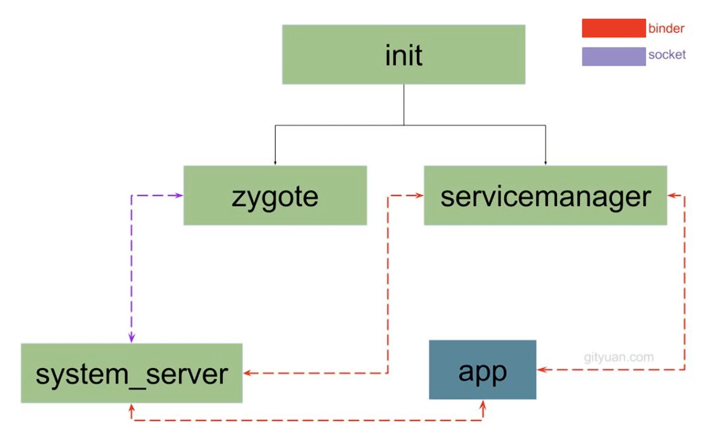

## 启动流程

init是第一个fork出的用户态进程。核心做的事情有3：

1. 启动一系列守护进程；
2. 启动Zygote
3. 启动Media Server

#### init进程分析：

1. 创建和挂载启动所需要的文件目录；
2. 初始化和启动属性服务；
3. 解析init.rc(里面有大量服务进程)文件并fork出Zygote进程；

Zygote再fork出system_server和app进程。

总体启动流程如下：

1. 按电源通电 --> 2. </b>从Boot Rom开始加载，启动Boot Loader引导程序</b> --> 3. 拉起linux内核Kernel --> 4. 拉起用户态的init进程，做准备工作 --> 5. fork出Zygote进程 --> 6.Zygote提前加载一些资源，并fork（会基于Copy-on-Write机制）出system_server（比如system_server就能直接使用Zygote的JNI函数、共享库、主题资源等），并启动一个socket服务端，如果ams需要创建进程，请求Zygote创建 --> 7. System_server启动AMS,PMS,WMS, Looper::loop等服务 --> 8. AMS会打开Launcher的Home Activity，即桌面。

1, 2, 3, 4同Linux系统启动。

