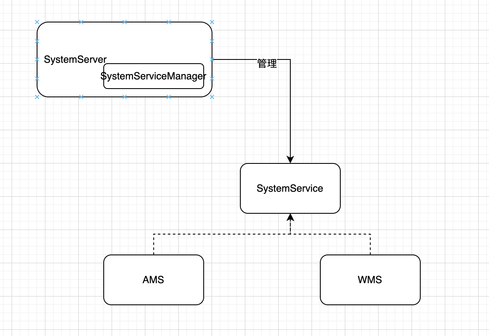
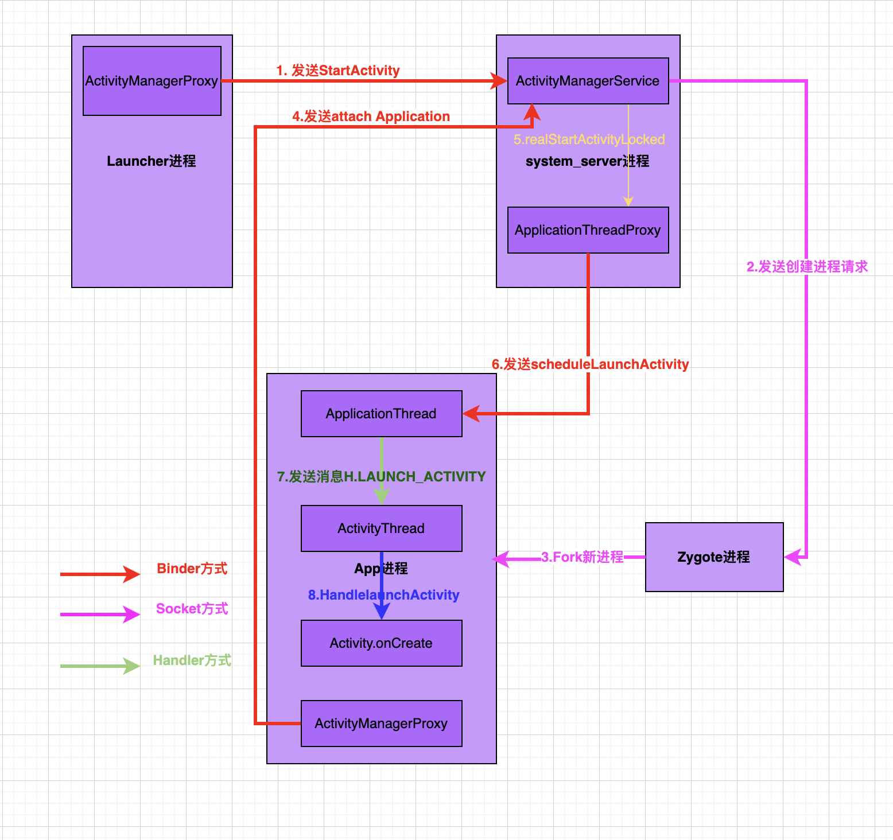

## ActvityManagerServcie的重要功能

start(): 1)启动 CPU 监控线程; 2) 注册电池状态和权限管理服务 

startObservingNativeCrashes()： 监听所有的crash事件 

setSystemProcess()： 添加各种管理app状态信息的服务还有进程等等信息

## SystemServer进程注意事项

## Application启动流程分析

