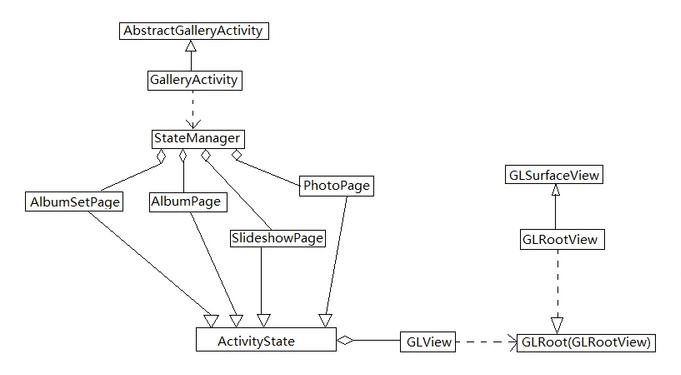
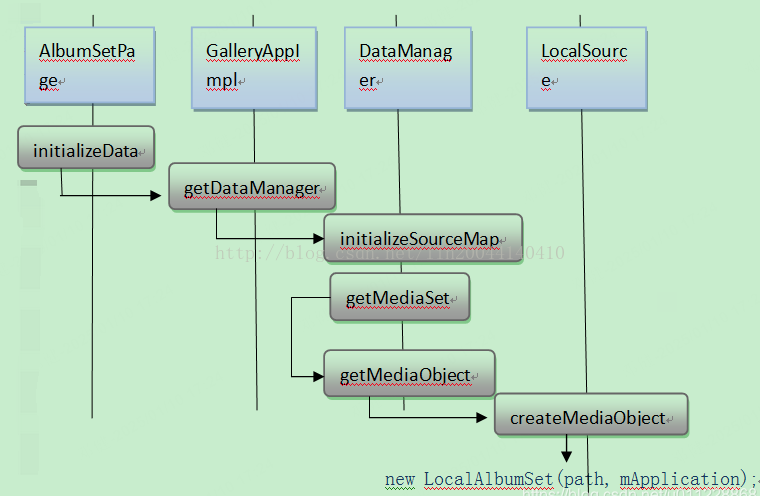

## 大致结构图

## 数据加载

DataManager

生成数据的流程图如图：

## 参考文档

[Android Gallery2 开发经验整理-CSDN博客](https://blog.csdn.net/u011228868/article/details/102894063)

[Android Gallery2源代码分析 - yxysuanfa - 博客园](https://www.cnblogs.com/yxysuanfa/p/7114810.html)

[Android 4.0 gallery2 生成video thumbnail的过程_android如何生成音频文件的thumbnail-CSDN博客](https://blog.csdn.net/hongszh/article/details/7969333?utm_medium=distribute.pc_feed_404.none-task-blog-2~default~BlogCommendFromBaidu~default-1.nonecase&depth_1-utm_source=distribute.pc_feed_404.none-task-blog-2~default~BlogCommendFromBaidu~default-1.nonecas)

[Gallery图库源码分析_NULL____的博客-CSDN博客](https://blog.csdn.net/lb377463323/category_9269186.html)

