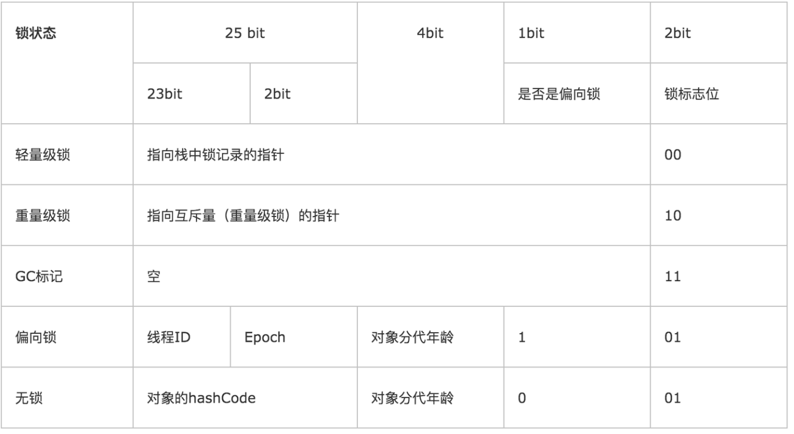
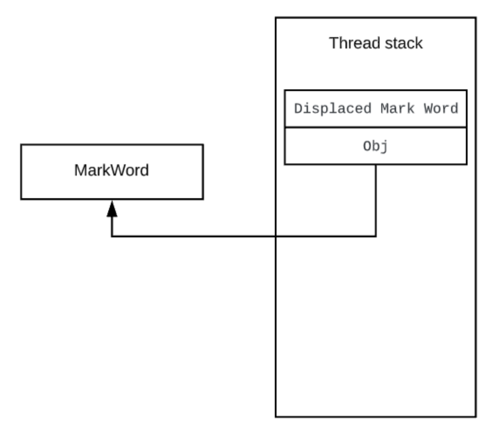
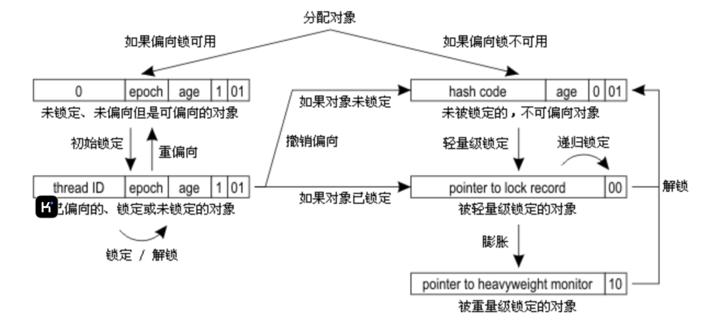
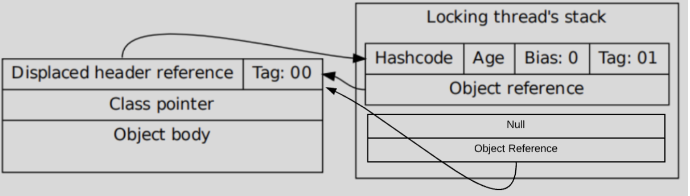
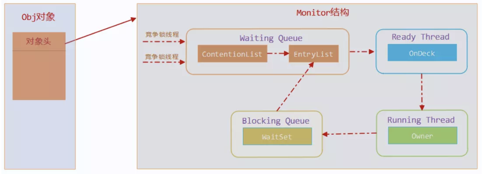
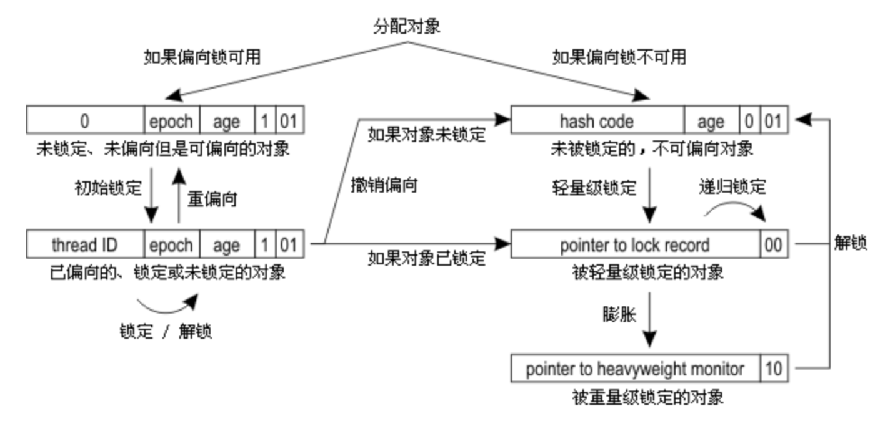

## 引言

本文着重介绍 JVM 中 synchronized 锁相关的内容，更多关于 JVM 的文章均收录于**[贝贝猫的文章目录](https://zhuanlan.zhihu.com/p/360478342)**。


## 锁

锁是多线程软件开发的必要工具之一, 它的基本作用是保护临界区资源不会被多个线程同时访问而受到破坏。如果由于多线程访问造成对象数据的不一致, 那么系统运行将会得到错误的结果。通过锁, 可以让多个线程排队, 一个一个地进入临界区访问目标对象, 使目标对象的状态总是保持一致, 这也就是锁存在的价值。

在 Java 中存在两种实现同步的语义，synchronized 方法和 synchronized 代码块:

```java
public class Test {

    public void synchronizedBlock() {
        synchronized (this) {
            System.out.println("synchronizedMethod");
        }
    }

    public synchronized void synchronizedMethod() {
        System.out.println("synchronizedMethod");
    }
}
```

上述代码两个函数生成的字节码如下所示：

```java
// synchronizedBlock
// access flags public
 0 aload_0
 1 dup
 2 astore_1
 3 monitorenter
 4 getstatic #2 <java/lang/System.out>
 7 ldc #3 <synchronizedMethod>
 9 invokevirtual #4 <java/io/PrintStream.println>
12 aload_1
13 monitorexit
14 goto 22 (+8)
17 astore_2
18 aload_1
19 monitorexit
20 aload_2
21 athrow
22 return

// synchronizedMethod
// access flags public synchronized
0 getstatic #2 <java/lang/System.out>
3 ldc #3 <synchronizedMethod>
5 invokevirtual #4 <java/io/PrintStream.println>
8 return
```

从字节码中，我们会发现编译器会将同步代码块用 `monitorenter` 和 `monitorexit` 包裹，这里因为有隐式的 `try-finally` 所以有两个 `monitorexit`，而同步方法，则是通过函数的的 `access flags` 进行标识，当执行有 `synchronized` 标识的函数时，最后也会调用 `monitorenter` 和 `monitorexit` 基本一样的逻辑。

这里的monitor是：对象监视器。在JVM中,每个对象都会和一个对象监视器（monitor）相关联。jvm需要保证每个monitorenter都有一个monitorexit对应。这两个指令，本质上都是对 对象监视器(monitor)进行获取，这个过程是排他的，也就是说同一时刻只能有一个线程获取到由synchronized所保护对象的监视器。线程执行到monitorenter指令时，会尝试获取对象所对应的monitor所有权，也就是尝试获取对象的锁；而执行monitorexit，就是释放monitor的所有权。 如果其他线程已经占用了monitor，则当前线程进入阻塞状态。

在 JDK 1.6 之前, synchronized 只使用了系统层提供的锁机制，例如 Linux 平台上的 mutex，这会造成进程间切换的开销，所以性能并不理想。

在 JDK 1.6 引入了两种新型锁机制：<font color="red">偏向锁和轻量级锁</font>，它们的引入是为了解决在没有多线程竞争或基本没有竞争的场景下因使用传统锁机制带来的性能开销问题。JVM 会根据竞争的强度来选用不同的锁实现，来降低锁的使用开销。那么 JVM 是如何实现这么多种类型的锁的呢？在 JVM 的实现中，<b>每个对象都有一个对象头</b>，用于保存对象的系统信息。对象头中有一个成为 <font color="red">Mark Word</font> 的部分，它是实现锁的关键。在 32 位系统中，它是一个 32 位的数据，在 64 位系统中，它占 64 位。它是一个多功能的数据区，可以存放对象的哈希值，对象年龄，所得指针等数据。一个对象使用了哪种锁实现，谁占用了锁，都记录在这个 Mark Word 中。下表展示了 32 位 HotSpot 虚拟机中 Mark Word 的存储情况。



可以看到锁信息也是存在于对象的 mark word 中的。当对象状态为偏向锁（biasable）时，mark word 存储的是偏向的线程 ID；当状态为轻量级锁（lightweight locked）时，mark word 存储的是指向线程栈中 Lock Record 的指针；当状态为重量级锁（inflated）时，为指向堆中的 monitor 对象的指针。接下来，我们介绍一下这三种类型的锁都具有什么样的特点，以及它们的实现方式。


### 偏向锁

在 JDK1.6 中为了提高一个对象在一段很长的时间内都只被一个线程用做锁对象场景下的性能，引入了偏向锁，在第一次获得锁时，会有一个 CAS 操作，之后该线程再获取锁，只会执行几个简单的命令，而不是开销相对较大的 CAS 命令。

1. 当 JVM 启动了偏向锁模式（1.6 以上默认开启）并且锁对象的 Class 没有关闭偏向锁模式时，该锁对象初始的 `mark word` 将是可偏向状态，此时的 `thread id` 为 0，表示当前没有任何一个线程持有该锁。
2. 获得锁的逻辑：

* 	在程序进入同步代码块时，会访问Mark Word中偏向锁的标识是否设置成1，锁标志位是否为01，若为偏向锁状态，则查看偏向锁状态下线程ID是否指向当前线程。如果是则直接执行同步代码。但是markword中记录的线程ID如果不是当前线程，则通过CAS比较与交换尝试修改对象头获得锁。CAS操作成功则可以直接执行同步代码，否则表示有其他线程竞争，此时获得偏向锁的线程被挂起，偏向锁升级为轻量级锁 ，然后被阻塞的线程继续往下执行同步代码。

- 如果该对象是第一次被线程获得锁时，会先在当前线程栈中找到一个可用的 Lock Record 并将其 obj 指向锁对象，Displaced Mark Word 置为空，然后根据 `mark word` 确认当前锁是否处于未偏向模式，如果处于未偏向模式则会通过 CAS 指令，将 `mark word` 中的 `thread id` 0 改为当前线程 id。如果成功，则说明获得了偏向锁，继而执行同步块中的代码，否则，说明当前存在多线程竞争，不适合使用偏向锁，开始执行锁的升级逻辑，锁的升级我们后面介绍。



- - 当被偏向的线程再次进入同步块时，发现锁对象偏向的就是当前线程（thread id），会再往当前线程的栈中添加一条 Displaced Mark Word 为空的 Lock Record（通过它来实现可重入锁），然后继续执行同步块的代码，因为操纵的是线程私有的栈，因此不需要用到 CAS 指令，因为如此偏向锁模式下，当被偏向的线程再次尝试获得锁时，仅仅进行几个简单的操作就可以了，在这种情况下，synchronized 关键字带来的性能开销基本可以忽略。
  - 当其他线程进入同步块时，发现已经有偏向的线程了，则会进入到撤销偏向锁的逻辑

1. 锁的升级逻辑：当发现多线程竞争时，偏向锁会升级为轻量级锁，一般来说，会在 safepoint（此时用户代码不会执行）中去查看偏向的线程是否还存活，如果存活且还在同步块中（根据栈帧中是否还有 obj 指向该锁对象的 Lock Record）则将锁升级为轻量级锁，原偏向的线程继续拥有锁，当前线程则走入到轻量级锁的加锁逻辑中；如果偏向的线程已经不存活或者不在同步块中，则将对象头的 mark word 改为无锁状态（unlocked），之后再升级为轻量级锁。 > 锁升级的过程是在 JVM 中专门的 VM Thread 中执行，该线程会源源不断的从 VMOperationQueue 中取出请求，比如 GC 请求和锁升级请求都会被推入该请求队列中。对于需要 safepoint 的操作，必须要等到所有的 Java 线程进入到 safepoint 才开始执行。
2. 解锁逻辑：将栈中最近的的一个 lock record 的 obj 字段设置为 null（该 obj 字段原本指向锁对象）。需要注意的是，偏向锁的解锁步骤中并不会修改对象头中的 thread id。
3. 批量重偏向：当只有一个线程反复进入同步块时，偏向锁带来的性能开销基本可以忽略，但是当有其他线程尝试获得锁时，就需要等到 safe point 时将偏向锁撤销并升级。而偏向锁的撤销是有一定成本的，如果说运行时的场景本身存在多线程竞争的，那偏向锁的存在不仅不能提高性能，而且会导致性能下降。因此，JVM 中增加了一种批量重偏向机制。它主要是为了解决如下问题：一个线程 A 创建了大量锁对象并执行了初始的同步操作，此时线程 A 是偏向锁的持有者，但是之后线程 A 不再使用该锁，而是另一个线程 B 期望持有这些锁对象并进行之后的所有操作。在这种情况下，按照正常的逻辑，所有的偏向锁都会被撤销并升级为轻量级锁，这样即便是之后总是线程 B 一个线程使用这些锁，也不能享受到偏向锁的性能优势了。怎么解决这个问题呢？JVM 会以 class 为单位，为每个 class 维护一个偏向锁撤销计数器，每当该 class 的任意实例对象发生偏向撤销操作时，该 class 的计数器 +1。当达到阈值（20）时，JVM 就会进行批量重偏向。当发生重偏向时，会更新 class 的 epoch 和 **当前处于加锁状态的对象的 epoch**，注意：对象在创建出来时，会复用其 class 当前的 epoch 值，而在发生批量重偏向时，只有真正处于锁定状态的对象 epoch 才会和 class 的 epoch 一起 +1，而不处于锁定状态的对象 epoch 不变（即线程栈中不存在对应 Lock Record 的锁对象）。这时候，如果线程 B 想要持有锁对象时，如果发现对象的 epoch 和其 class 的epoch 不等，可以不执行偏向锁撤销的逻辑，直接将 mark word 中的 thread id 通过 CAS 改为自己的 thread id。这样就避免偏向锁撤销的性能损耗，并且继续享受偏向锁带来的性能优势。
4. 批量撤销：如果一些锁存在明显的多线程竞争，那么每个锁对象都要从偏向锁逐步升级到轻量级锁，显然会造成很大的性能损耗，所以，JVM 引入了一个直接跳过偏向锁的机制。就想批量重偏向时所说的，每个 class 都有一个计数器，该计数器在 class 对象发生偏向锁撤销时 +1，当该计数器达到更高阈值（40）时，JVM 会认定该 class 存在明显的竞争，不适合使用偏向锁，之后该 class 的所有对象都不再使用偏向锁，而是直接使用轻量级锁。

理解了偏向锁的各个处理过程之后，我们来看一下下面这张图，其中展示了偏向锁状态的切换流程：



从图中最上面出发会分为偏向锁可用和不可用：

- 可用：默认模式
- 不可用：锁对象已经发生了撤销（多线程竞争），该 class 已经发生了批量撤销（该 class 的很多个实例都发生了多线程竞争），偏向锁在 JVM 层关闭 然后我们看一下偏向锁可用这一支：
- 初始锁定：更新 thread id，线程栈中添加指向锁对象的 Lock Record
- 再次锁定：mark word 不变，只在线程栈中添加指向锁对象的 Lock Record
- 解锁：mark word 不变，只在线程栈中删除一个指向锁对象的 Lock Record
- 重偏向：该 class 对象发生了很多次撤销，引发重偏向，class 的 epoch 和处于锁定状态（存在指向锁对象的 Lock Record）的对象（我们称这批锁对象为 Group A） epoch +1，其他空闲但是 thread id 不为 0 的锁对象（我们称这批锁对象为 Group B） epoch 不变，当另一个线程尝试获取获取 Group B 的锁时，虽然其 threadID 不为 0，但是因为其 epoch 和 class 的 epoch 不一致，所以可以把它当做 thread id = 0 来看待。 然后我们看一下从左支到右支的升级过程：
- 如果发现多线程竞争，并且当前锁持有线程没有在同步代码中（不存在指向锁对象的 Lock Record），那么先将该锁恢复到未锁定状态，并标记该锁不可使用偏向模式，然后开始轻量级锁的加锁逻辑，这部分我们后面介绍。
- 如果发现多线程竞争，并且当前锁持有线程在同步代码中（存在指向锁对象的 Lock Record），那么我们需要将该锁升级到轻量级模式，并让原来持有锁的线程继续持有该锁，然后当前线程按照轻量级锁的加锁流程开始竞争该锁。

至此，上图中关于偏向锁的部分就都介绍完了，接下来，我们介绍一下轻量级锁的实现和升级流程。


### 轻量级锁

JVM 的开发者发现在很多情况下，在 Java 程序运行时，同步块中的代码都是不存在竞争的，不同的线程交替的执行同步块中的代码。这种情况下，用重量级锁是没必要的。因此 JVM 引入了轻量级锁的概念。

线程在执行同步块之前，JVM 会先在当前的线程的栈帧中创建一个 Lock Record，其包括一个用于存储对象头中的 mark word（官方称之为 Displaced Mark Word）以及一个指向对象的指针。下图右边的部分就是一个 Lock Record。可以看到 Displaced Mark Word 中保存了 mark word 中原来的内容，然后 mark work 变为指向该 Lock Record 的指针。



轻量级锁的 Lock Record 和偏向锁 Lock Record 的区别就在这个 Displaced Mark Word，在偏向锁的所有 Lock Record 的 Displaced Mark Word 都为 null，而在轻量级锁中，会存在一个 Displaced Mark Word 不为空的 Lock Record。然后 mark word 中会保存一个指向该 Lock Record 的指针。而如果一个线程重复获取该锁（重入锁），后续加锁过程只会添加 Displaced Mark Word 为 null 的 Lock Record，这部分就和偏向锁一样了。看到这，想必大家已经清楚从偏向锁到轻量级锁的直接升级过程了，就是将一个 Displaced Mark Word 本为 null 的 LockRecord 更新，复制 mark word 中的内容，然后通过 CAS 将 mark word 改为指向该 Lock Record 的指针。

总结一下轻量级锁的处理流程：

- 加锁逻辑：

1. 在线程栈中创建一个 Lock Record（Displaced Mark Word 复制 mark word 中的现有内容），将其 obj（即上图的Object reference）字段指向锁对象。
2. 直接通过 CAS 指令将 Lock Record 的地址存储在对象头的 mark word 中，如果对象处于无锁状态则修改成功，代表该线程获得了轻量级锁。如果失败，进入到步骤 3。
3. 如果是当前线程已经持有该锁了，代表这是一次锁重入。设置 Lock Record 第一部分（Displaced Mark Word）为 null，起到了一个重入计数器的作用，然后结束。
4. 走到这一步说明发生了竞争，可能需要膨胀为重量级锁，具体过程后面介绍。

- 解锁逻辑：

1. 查找线程栈, 找到 obj 字段等于当前锁对象的 Lock Record。
2. 如果 Lock Record 的 Displaced Mark Word 为 null，代表这是一次重入，将 obj 设置为 null 即可。
3. 如果 Lock Record 的 Displaced Mark Word 不为 null，则利用 CAS 指令将对象头的 mark word 恢复成为 Displaced Mark Word 的内容。如果成功，则锁被释放，否则说明当前锁已经被膨胀为重量级锁，这时候需要执行重量级锁的释放逻辑。

- 锁的升级：
- 从偏向锁升级到轻量级锁： 将一个 Displaced Mark Word 本为 null 的 LockRecord 更新，复制 mark word 中的内容，然后通过 CAS 将 mark word 改为指向该 Lock Record 的指针。
- 轻量级锁升级到重量级锁： 若当前一个线程 A 持有锁，而且只有一个线程 B 想要获取该锁，则该线程 B 通过自旋进行等待。但是当自旋超过一定的次数，或者一个线程 A 在持有锁，一个线程 B 在自旋等待，又有第三个线程 C 来访时，轻量级锁升级为重量级锁。

### 重量级锁

重量级锁是我们常说的传统意义上的锁，通过对象监视器（monitor）实现，其中monitor的本质是依赖于底层操作系统的Mutex

Lock实现。其利用操作系统底层的同步机制去实现 Java 中的线程同步。

操作系统实现线程之间的切换需要从用户态到内核态的切换，切换成本非常高。主要是，当系统检查到锁是重量级锁之后，会把等待想要获得锁的线程进行**阻塞**，被阻塞的线程不会消耗cpu。但是阻塞或者唤醒一个线程时，都需要操作系统来帮忙，这就需要从**用户态**转换到**内核态**，而转换状态是需要消耗很多时间的，有可能比用户执行代码的时间还要长。

重量级锁的状态下，对象的 mark word 为指向一个堆中 monitor 对象的指针。

一个 monitor 对象包括这么几个关键字段：ContentionList，EntryList ，WaitSet，owner。其中 ContentionList（cxq） ，EntryList ，WaitSet 都是由 ObjectWaiter 的链表结构，owner 指向持有锁的线程。



当一个线程尝试获得锁时，如果该锁已经被占用，则会将该线程封装成一个 ObjectWaiter 对象插入到 ContentionList 的队列，然后暂停当前线程。当持有锁的线程释放锁前，会将 ContentionList 中的所有元素移动到 EntryList 中去，并唤醒 EntryList 的队首线程。这个选中的线程叫做 Heir presumptive 即假定继承人，就是图中的 Ready Thread，假定继承人被唤醒后会尝试获得锁，但 synchronized 是非公平的，所以假定继承人不一定能获得锁，它其实会和当前正准备获得锁的线程进行争夺，这也就是为什么使用 synchronized 时，有可能最后申请锁的线程反而第一个拿到了锁。

如果一个线程在同步块中调用了 Object#wait 方法，会将该线程对应的 ObjectWaiter 从 EntryList 移除并加入到 WaitSet 中，然后释放锁。当 wait 的线程被 notify 之后，会将对应的 ObjectWaiter 从 WaitSet 移动到 EntryList 中。需要注意的是，当调用一个锁对象的 wait 或 notify 方法时，如当前锁的状态是偏向锁或轻量级锁则会先膨胀成重量级锁。因为偏向锁和轻量级锁是不具备进程切换能力的。

最后回到升级示意图中，我们可以介绍最右下角的部分了：



当轻量级锁状态发生严重的竞争时（或者调用了锁对象 wait 或 notify 方法），会创建一个 monitor 对象（需要根据当前锁的持有情况进行 monitor 的初始化），然后将 mark word 改为指向该 monitor 的指针。

