GC的出现解放了程序员需要手动回收内存的苦恼，但我们也是要了解GC的，知己知彼，百战不殆嘛。

常见的GC回收算法主要包括[引用计数](https://zhida.zhihu.com/search?content_id=106279360&content_type=Article&match_order=1&q=引用计数&zhida_source=entity)算法、可达性分析法、[标记清除算法](https://zhida.zhihu.com/search?content_id=106279360&content_type=Article&match_order=1&q=标记清除算法&zhida_source=entity)、复制算法、标记压缩算法、[分代算法](https://zhida.zhihu.com/search?content_id=106279360&content_type=Article&match_order=1&q=分代算法&zhida_source=entity)以及分区算法。

其中，引用计数法和可达性分析法用于判定一个对象是否可以回收，其他的算法为具体执行GC时的算法。

今天来聊聊可达性分析法，并说明一下什么样的对象才是真正可以被回收的。

在介绍引用计数法的时候，我们提到了此种算法的[循环引用](https://zhida.zhihu.com/search?content_id=106279360&content_type=Article&match_order=1&q=循环引用&zhida_source=entity)的缺陷，所以Java没有使用此种算法。

那Java使用的是啥算法来标记一个对象是否是垃圾对象呢？

Java是通过判断一个对象是否可触及，以及一个对象的引用类型（[强引用](https://zhida.zhihu.com/search?content_id=106279360&content_type=Article&match_order=1&q=强引用&zhida_source=entity)、软引用、弱引用、虚引用）来决定是否回收这个对象。

本文将根据上述，分为两部分进行介绍。

最后会简单介绍一下GC回收过程中保证数据一致性的方法：Stop the World

### 1 如何判断一个对象是否可触及？

判断是否可触及包含两个要素： *通过可达性分析该对象到GC Root不可达，如果不可达会进行第一次标记。* 已经丧失"自救"机会，如果没有自救机会，会进行第二次标记，此时该对象可回收。

### 1.1 可达性分析

可达性分析法定义了一系列称为"GC Roots"的对象作为起始点，从这个起点开始向下搜索，每一条可达路径称为引用链，当一个对象没有任意一条引用链可以到达"GC Roots"时，那么就对这个对象进行第一次"可回收"标记。

**那么什么是GC Root呢？**

可以理解为由堆外指向堆内的引用。

**那么都有哪些对象可以作为GC Roots呢？** 包括如下几种 *代码中某一方法中的局部变量* 类变量（静态变量） *常量* [本地方法栈](https://zhida.zhihu.com/search?content_id=106279360&content_type=Article&match_order=1&q=本地方法栈&zhida_source=entity)中引用的对象 * 已启动且未停止的线程

下面以一段代码来简单说明一下前三类

```java
class Test {
    private static A a = new A(); // 静态变量
    public static final String CONTANT = "I am a string"; // 常量

    public static void main(String[] args) {
        A innerA = new A(); // 局部变量
    }
}

class A {
    ...
}
```

这段代码的运行时内存图示如下：

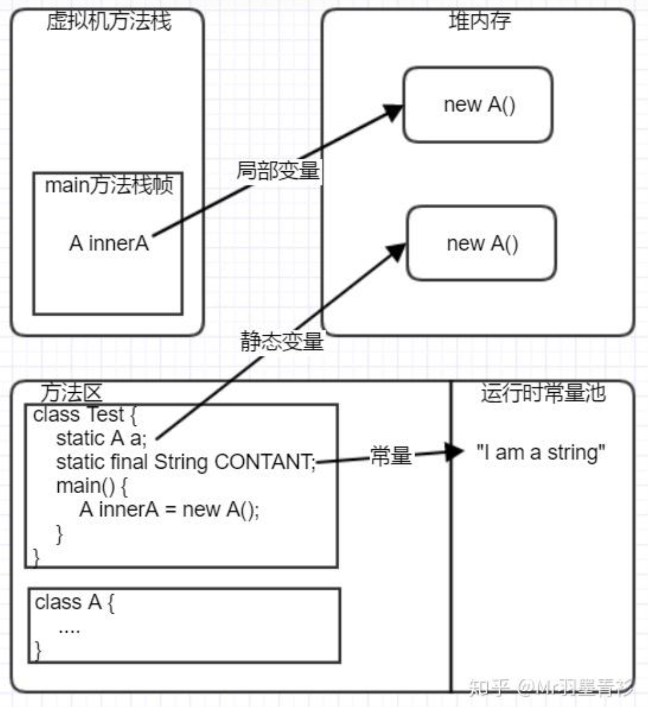

首先，类加载器加载Test类，会初始化静态变量a，将常量引用指向常量池中的字符串，完成[Test类](https://zhida.zhihu.com/search?content_id=106279360&content_type=Article&match_order=2&q=Test类&zhida_source=entity)的加载；

然后，main方法执行，main方法会入虚拟机方法栈，执行main方法会在堆中创建A的对象，并赋值给局部变量innerA。

此时GC Roots状态如下：

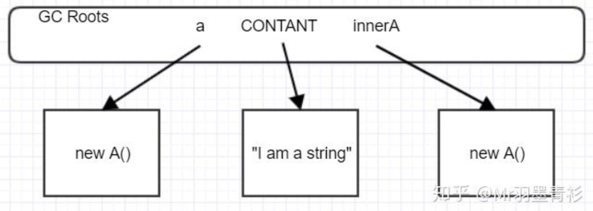

当main方法执行完出栈后，变为：

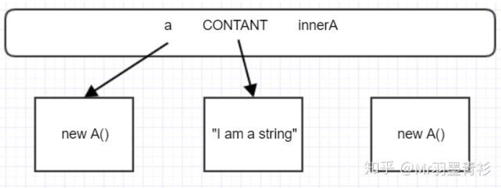

第三个对象已经没有引用链可达GC Root，此时，第三个对象被第一次标记。

### 1.2 对象的"自救"

一个被可达性分析标记为可回收的对象，是有机会进行自救的。前提是：覆写了Object的finalize()方法，且GC还没有执行该对象的finalize()方法。

先来看一下finalize方法的定义

```java
/**
* Called by the garbage collector on an object when garbage collection
* determines that there are no more references to the object.
* A subclass overrides the {@code finalize} method to dispose of
* system resources or to perform other cleanup.
* <p>
* The general contract of {@code finalize} is that it is invoked
* if and when the Java&trade; virtual
* machine has determined that there is no longer any
* means by which this object can be accessed by any thread that has
* not yet died, except as a result of an action taken by the
* finalization of some other object or class which is ready to be
* finalized. The {@code finalize} method may take any action, including
* making this object available again to other threads; the usual purpose
* of {@code finalize}, however, is to perform cleanup actions before
* the object is irrevocably discarded. For example, the finalize method
* for an object that represents an input/output connection might perform
* explicit I/O transactions to break the connection before the object is
* permanently discarded.
* <p>
* The {@code finalize} method of class {@code Object} performs no
* special action; it simply returns normally. Subclasses of
* {@code Object} may override this definition.
* <p>
* The Java programming language does not guarantee which thread will
* invoke the {@code finalize} method for any given object. It is
* guaranteed, however, that the thread that invokes finalize will not
* be holding any user-visible synchronization locks when finalize is
* invoked. If an uncaught exception is thrown by the finalize method,
* the exception is ignored and finalization of that object terminates.
* <p>
* After the {@code finalize} method has been invoked for an object, no
* further action is taken until the Java virtual machine has again
* determined that there is no longer any means by which this object can
* be accessed by any thread that has not yet died, including possible
* actions by other objects or classes which are ready to be finalized,
* at which point the object may be discarded.
* <p>
* The {@code finalize} method is never invoked more than once by a Java
* virtual machine for any given object.
* <p>
* Any exception thrown by the {@code finalize} method causes
* the finalization of this object to be halted, but is otherwise
* ignored.
*
* @throws Throwable the {@code Exception} raised by this method
* @see java.lang.ref.WeakReference
* @see java.lang.ref.PhantomReference
* @jls 12.6 Finalization of Class Instances
*/
protected void finalize() throws Throwable { }
```

大致翻译一下前两段：当GC判定某一对象不再通过任一形式被引用时，GC会调用该对象的finalize方法。方法执行时，可以进行任何操作，包括将这个对象再次赋值给某一变量引用，但其主要目的还是做一些对象的清除操作。

其实在finalize方法中，只要将这个对象的引用(this)再次赋值给某一变量，这个对象就可以"自救"。

如果一个对象在finalize阶段也没有完成自救，那么就真的要被回收了。

**下面演示一个"自救"的例子：**

```java
public class SaveMe {

    public static SaveMe saveMe;

    public static void main(String[] args) throws InterruptedException {
        saveMe = new SaveMe();
        saveMe = null; // 取消引用，经过可达性分析，上面new出来的对象不再可达GC Root
        System.gc(); // 第一次GC，会执行finalize方法
        Thread.sleep(1000);
        if (saveMe == null) {
            System.out.println("对象为null");
        } else {
            System.out.println("对象不为null");
        }
        // 经过上面的过程，对象已经自救了，这里再次将其引用置空
        saveMe = null;
        System.gc(); // 不会再执行finalize方法，没有机会自救了
        Thread.sleep(1000);
        if (saveMe == null) {
            System.out.println("对象为null");
        } else {
            System.out.println("对象不为null");
        }
    }

    // finalize方法全局只会执行一次
    @Override
    protected void finalize() throws Throwable {
        super.finalize();
        saveMe = this; // 进行自救
    }
}
```

上述代码很简明，可根据注释理解。代码执行结果如下：

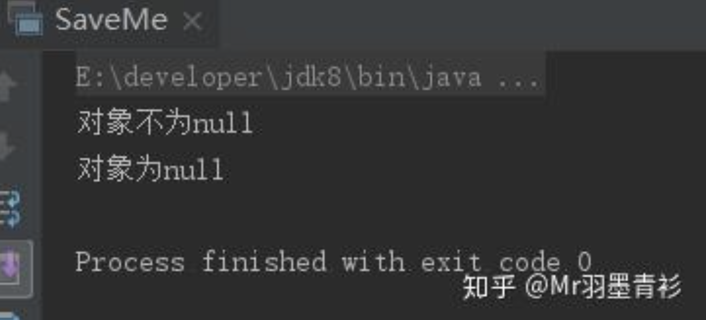

### 2 不同引用类型的回收

Java中有四种引用类型，引用强度由强到弱：强引用、软引用、弱引用、[虚引用](https://zhida.zhihu.com/search?content_id=106279360&content_type=Article&match_order=2&q=虚引用&zhida_source=entity)。针对不同的引用类型，GC的回收策略不同。

### 2.1 强引用

通过关键字new的对象就是强引用对象，强引用指向的对象任何时候都不会被回收，宁愿OOM也不会回收。

### 2.2 软引用

如果一个对象持有软引用，那么当JVM堆空间不足时，会被回收。

一个类的软引用可以通过java.lang.ref.SoftReference持有。

### 2.3 弱引用

如果一个对象持有[弱引用](https://zhida.zhihu.com/search?content_id=106279360&content_type=Article&match_order=4&q=弱引用&zhida_source=entity)，那么在GC时，只要发现弱引用对象，就会被回收。

一个类的弱引用可以通过java.lang.ref.WeakReference持有。

### 2.4 虚引用

几乎和没有一样，随时可以被回收。

通过PhantomReference持有。


### 3 Stop the World

问题的出现：如果程序一边执行，一边进行可达性分析的标记操作，那么有可能刚标记完一个对象，这个对象又再次被赋值给其他的引用。这样就有可能回收掉正在使用的对象。

解决这个问题的方式就是Stop the World（STW），STW会在所有线程到达一个安全点时，暂停掉所有应用线程的执行，然后开始专心的标记垃圾对象。这样就保证了数据的一致性，不会导致误回收。


# 通过SerialGC详细理解分代算法

Java GC发展至今，已经推出了好几代收集器，包括Serial、ParNew、Parallel、CMS、G1以及Java11中最新的ZGC。每一代GC都对前一代存在的问题做出了很大的改善。

今天介绍一个古董收集器-Serial串行GC。

虽然此收集器的使用场景已经不多，但本文通过这个收集器，说明了如何分配每一块堆内存的大小，并根据GC日志，详细说明了Serial GC在新生代和老年代的GC过程。

Serial GC的名字能很好地概括他的特点：串行。它与应用线程的执行是串行的，也就是说，执行应用线程的时候，不会执行GC，执行GC的时候，不能执行应用线程。

所以，整个Java进程执行起来就行下面的样子：

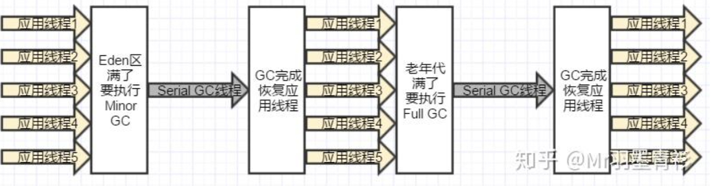

Serial GC使用的是分代算法，在新生代上，Serial使用复制算法进行收集，在老年代上，Serial使用标记-压缩算法进行收集。

分代算法、复制算法、标记-压缩请移步：

[Java虚拟机-GC垃圾回收算法-标记清除法、复制算法、标记压缩法、分代算法](https://link.zhihu.com/?target=https%3A//juejin.im/post/5c41d8166fb9a049b82ac23d)

### 1 Serial存在的问题

如上图所示，在需要执行GC时，GC线程会阻塞所有用户线程（Stop-The-world，简称STW），等他执行完，才会恢复用户线程。

这对我们的应用程序来说，每次GC是都会造成不同程度的卡顿，对用户是极为不友好的。

### 2 使用场景

个人观点：

首先，根据其特点，回收算法简单，所以回收效率高。

其次，它是单线程收集的，不存在GC线程之间的切换。由于Java的线程切换是需要系统内核来调度的，在单线程下，可以很大程度的减少调度带来的系统开销。

所以，也许在单核CPU机器上，且业务场景为只对公司内部使用且可以忍受STW带来的卡顿的情况下，有一些用武之地。

### 3 实战

环境： *CPU：i7 4核* 内存：16G * JDK version：8

### 3.1 先来看一下默认情况下，使用的哪个GC

添加下面JVM参数并运行代码，观察GC日志

```java
/**
 * JVM参数：
 * -XX:+PrintGCDetails -XX:+PrintGCTimeStamps
 */
public static void main(String[] args) {
    System.out.println("Hello SerialGC");
}
```

程序输出如下

```java
Hello SerialGC
// 下面是GC日志
Heap
PSYoungGen      total 76288K, used 6554K [0x000000076b180000, 0x0000000770680000, 0x00000007c0000000)
  eden space 65536K, 10% used [0x000000076b180000,0x000000076b7e6930,0x000000076f180000)
  from space 10752K, 0% used [0x000000076fc00000,0x000000076fc00000,0x0000000770680000)
  to   space 10752K, 0% used [0x000000076f180000,0x000000076f180000,0x000000076fc00000)
ParOldGen       total 175104K, used 0K [0x00000006c1400000, 0x00000006cbf00000, 0x000000076b180000)
  object space 175104K, 0% used [0x00000006c1400000,0x00000006c1400000,0x00000006cbf00000)
Metaspace       used 3458K, capacity 4496K, committed 4864K, reserved 1056768K
  class space    used 381K, capacity 388K, committed 512K, reserved 1048576K
```

- PSYoungGen：表示年轻代使用的是ParallelGC
- ParOldGen：表示老年代使用的是ParallelGC
- Metaspace：元数据区使用情况

可见，在多核情况下，JVM默认选用了支持多线程并发的ParallelGC。

### 3.2 Serial GC是运行在Client模式下的默认收集器？

[周志明](https://zhida.zhihu.com/search?content_id=106279898&content_type=Article&match_order=1&q=周志明&zhida_source=entity)老师的书中提到过，SerialGC仍然是-client模式下默认的收集器。

下面来实验一下，刚才的JVM启动参数加上-client参数

```java
/**
* JVM参数：
* -client -XX:+PrintGCDetails -XX:+PrintGCTimeStamps
*/
public static void main(String[] args) {
    System.out.println("Hello SerialGC");
}
```

运行结果如下：

```java
Hello SerialGC in client mode
Heap
PSYoungGen      total 76288K, used 6554K [0x000000076b180000, 0x0000000770680000, 0x00000007c0000000)
  eden space 65536K, 10% used [0x000000076b180000,0x000000076b7e6930,0x000000076f180000)
  from space 10752K, 0% used [0x000000076fc00000,0x000000076fc00000,0x0000000770680000)
  to   space 10752K, 0% used [0x000000076f180000,0x000000076f180000,0x000000076fc00000)
ParOldGen       total 175104K, used 0K [0x00000006c1400000, 0x00000006cbf00000, 0x000000076b180000)
  object space 175104K, 0% used [0x00000006c1400000,0x00000006c1400000,0x00000006cbf00000)
Metaspace       used 3513K, capacity 4498K, committed 4864K, reserved 1056768K
  class space    used 387K, capacity 390K, committed 512K, reserved 1048576K
```

可见依然是ParallelGC。

这个原因应该是由于，在JDK1.8下，-client和-server参数默认都是失效的，所以指定-client也无济于事。

其实笔者也在相同的环境下尝试了JDK6和JDK7，也同样不是SerialGC，所以猜想可能是老版本的单核CPU情况下，JVM会默认选择SerialGC，但这一点笔者尚未查证。

**PS：-client和-server**

-client和-server参数在之前版本的JDK中是用来选择JVM运行过程中使用的编译器的。对启动性能有要求的程序，可使用-client，对应的编译器为编译效率较快C1，对峰值性能有要求的程序，可使用-server，对应生成代码执行效率较快的C2（参考了郑雨迪老师在极客时间推出的课程）。

Java8会默认使用分层编译的机制，会自动选择在何时使用哪个编译器，所以client和server参数在默认情况下失效。相对之前的JDK版本，JDK8的这种机制很大程度地提升了代码的编译执行效率。

### 3.3 Serial GC实战 - JVM参数

本小节说明了如何配置堆内存中每一块内存的大小。

首先我们要明确需要指定哪几块内存。因为Serial GC是分代收集，所以要确认新生代和老年代的大小，其中，新生代又需要确认Eden区和Survivor区的大小。

- 定义整个堆内存的大小

```java
// -Xmx：最大堆内存，-Xms：最小堆内存，这里设置为一样的，表示堆内存固定200M
-Xmx200M -Xms200M
```

- 定义新生代和老年代的大小

```java
// NewRatio表示老年代和新生代的比例，3表示3：1
// 即把整个堆内存分为4份，老年代占3份，新生代1份
// 目前堆内存为200M，NewRatio=3时，新生代=50M，老年代=150M
-XX:NewRatio=3
```

- 定义Eden区和Survivor区的大小

```java
// SurvivorRatio表示Eden区和两个Survivor区的比例，3表示3：2（注意是两个Survivor区）
// 即把新生代分为5份，Eden占3份，Survivor区占2份
// 目前新生代为50M，Survivor=3时，Eden=30M，Survivor=20M（from=10M, to=10M）
-XX:SurvivorRatio=3
```

- 配置GC日志打印参数

```java
// -XX:+UseSerialGC：显示指定使用Serial GC
// -XX:+PrintGCDetails：打印GC详细日志
// -XX:+PrintGCTimeStamps：打印GC发生的时间
-XX:+UseSerialGC -XX:+PrintGCDetails -XX:+PrintGCTimeStamps
```

- 实践

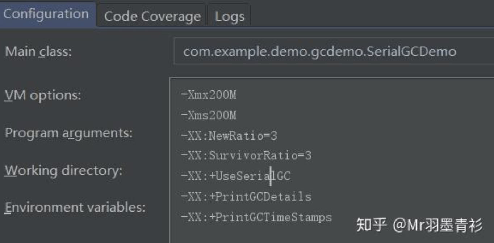

依然用上面的Hello SerialGC程序，运行结果如下

```java
Hello SerialGC
Heap
// def new generation表明新生代使用SerialGC，total:40M，已使用：4302K
// total少了10M？这是因为新生代使用复制算法，From区和to区实际上每次只能使用1个，所以是eden的30M + from或to的10M = 40M
def new generation   total 40960K, used 4302K [0x00000000f3800000, 0x00000000f6a00000, 0x00000000f6a00000)
  // eden区30M
  eden space 30720K,  14% used [0x00000000f3800000, 0x00000000f3c33b78, 0x00000000f5600000)
  // from区10M
  from space 10240K,   0% used [0x00000000f5600000, 0x00000000f5600000, 0x00000000f6000000)
  // to区10M
  to   space 10240K,   0% used [0x00000000f6000000, 0x00000000f6000000, 0x00000000f6a00000)
// 老年代使用 SerialGC ，总大小150M，已使用0K
tenured generation   total 153600K, used 0K [0x00000000f6a00000, 0x0000000100000000, 0x0000000100000000)
   the space 153600K,   0% used [0x00000000f6a00000, 0x00000000f6a00000, 0x00000000f6a00200, 0x0000000100000000)
// 元数据区大小，暂不关注
Metaspace       used 3450K, capacity 4496K, committed 4864K, reserved 1056768K
  class space    used 380K, capacity 388K, committed 512K, reserved 1048576K
```

关于复制算法，请移步：

[复制算法](https://link.zhihu.com/?target=https%3A//juejin.im/post/5c41d8166fb9a049b82ac23d)

### 3.4 Serial GC实战 - 通过GC日志理解新生代老年代的GC过程

此实验在上述JVM参数配置条件下运行。

下面通过一个实例程序，来观察一下

```java
public class SerialGCDemo {

    /**
     * 堆内存：-Xmx200M -Xms200M
     * 新生代：-XX:NewRatio=3 -XX:SurvivorRatio=3
     * GC参数：-XX:+UseSerialGC -XX:+PrintGCDetails -XX:+PrintGCTimeStamps
     * 堆空间：200M，新生代：50M，老年代：150M，新生代eden区：30M，新生代from区：10M，新生代to区：10M
     * -Xmx200M -Xms200M -XX:NewRatio=3 -XX:SurvivorRatio=3 -XX:+UseSerialGC -XX:+PrintGCDetails -XX:+PrintGCTimeStamps
     * @param args
     */
    public static void main(String[] args) {
        byte[][] useMemory = new byte[1000][];
        Random random = new Random();
        for (int i = 0; i < useMemory.length; i++) {
            useMemory[i] = new byte[1024 * 1024 * 10]; // 创建10M的对象
            // 20%的概率将创建出来的对象变为可回收对象
            if (random.nextInt(100) < 20) {
                System.out.println("created byte[] and set to null: " + i);
                useMemory[i] = null;
            } else {
                System.out.println("created byte[]: " + i);
            }
        }
    }
}
```

整体日志输入如下：

```java
created byte[]: 0
created byte[]: 1
0.236: [GC (Allocation Failure) 0.236: [DefNew: 24807K->870K(40960K), 0.0132148 secs] 24807K->21350K(194560K), 0.0132618 secs] [Times: user=0.02 sys=0.00, real=0.01 secs]
created byte[]: 2
created byte[] and set to null: 3
0.252: [GC (Allocation Failure) 0.252: [DefNew: 21941K->717K(40960K), 0.0060942 secs] 42421K->31437K(194560K), 0.0061231 secs] [Times: user=0.00 sys=0.00, real=0.00 secs]
created byte[]: 4
created byte[]: 5
0.259: [GC (Allocation Failure) 0.259: [DefNew: 22408K->717K(40960K), 0.0114560 secs] 53128K->51917K(194560K), 0.0114856 secs] [Times: user=0.00 sys=0.02, real=0.02 secs]
created byte[]: 6
created byte[]: 7
0.285: [GC (Allocation Failure) 0.285: [DefNew: 21788K->717K(40960K), 0.0122524 secs] 72988K->72397K(194560K), 0.0122868 secs] [Times: user=0.00 sys=0.00, real=0.01 secs]
created byte[]: 8
created byte[]: 9
0.299: [GC (Allocation Failure) 0.299: [DefNew: 21790K->717K(40960K), 0.0115042 secs] 93470K->92877K(194560K), 0.0115397 secs] [Times: user=0.03 sys=0.00, real=0.02 secs]
created byte[]: 10
created byte[]: 11
0.312: [GC (Allocation Failure) 0.312: [DefNew: 21791K->717K(40960K), 0.0120174 secs] 113952K->113357K(194560K), 0.0120525 secs] [Times: user=0.00 sys=0.00, real=0.01 secs]
created byte[]: 12
created byte[]: 13
0.328: [GC (Allocation Failure) 0.328: [DefNew: 21792K->717K(40960K), 0.0162437 secs] 134432K->133837K(194560K), 0.0162844 secs] [Times: user=0.00 sys=0.01, real=0.02 secs]
created byte[]: 14
created byte[]: 15
0.347: [GC (Allocation Failure) 0.347: [DefNew: 21793K->21793K(40960K), 0.0000201 secs]0.347: [Tenured: 133120K->143360K(153600K), 0.0103885 secs] 154913K->154316K(194560K), [Metaspace: 3350K->3350K(1056768K)], 0.0104608 secs] [Times: user=0.02 sys=0.00, real=0.01 secs]
Exception in thread "main" created byte[]: 16
0.361: [Full GC (Allocation Failure) 0.361: [Tenured: 143360K->143360K(153600K), 0.0028089 secs] 165153K->164556K(194560K), [Metaspace: 3350K->3350K(1056768K)], 0.0028543 secs] [Times: user=0.00 sys=0.00, real=0.00 secs]
0.364: [Full GC (Allocation Failure) 0.364: [Tenured: 143360K->143360K(153600K), 0.0050038 secs] 164556K->164538K(194560K), [Metaspace: 3350K->3350K(1056768K)], 0.0050390 secs] [Times: user=0.00 sys=0.00, real=0.00 secs]
Disconnected from the target VM, address: '127.0.0.1:57881', transport: 'socket'
java.lang.OutOfMemoryError: Java heap space
Heap
    at com.example.demo.gcdemo.SerialGCDemo.main(SerialGCDemo.java:28)
def new generation   total 40960K, used 22281K [0x00000000f3800000, 0x00000000f6a00000, 0x00000000f6a00000)
  eden space 30720K,  72% used [0x00000000f3800000, 0x00000000f4dc27c0, 0x00000000f5600000)
  from space 10240K,   0% used [0x00000000f6000000, 0x00000000f6000000, 0x00000000f6a00000)
  to   space 10240K,   0% used [0x00000000f5600000, 0x00000000f5600000, 0x00000000f6000000)
tenured generation   total 153600K, used 143360K [0x00000000f6a00000, 0x0000000100000000, 0x0000000100000000)
   the space 153600K,  93% used [0x00000000f6a00000, 0x00000000ff6000e0, 0x00000000ff600200, 0x0000000100000000)
Metaspace       used 3381K, capacity 4568K, committed 4864K, reserved 1056768K
  class space    used 364K, capacity 392K, committed 512K, reserved 1048576K
```

日志说明：

```java
0.236: [GC (Allocation Failure) 0.236: [DefNew: 24807K->870K(40960K), 0.0132148 secs] 24807K->21350K(194560K), 0.0132618 secs] [Times: user=0.02 sys=0.00, real=0.01 secs]
```

- 0.236：GC发生的时间（秒），从程序启动开始计算
- [GC：GC类型，另外还有Full GC，GC不会造成STW，Full GC会。
- (Allocation Failure)：GC原因，申请内存失败
- [DefNew：说明新生代用Serail GC回收，即default new generation之意。
- 24087K -> 870K(40960K)：GC前该区域内存已使用容量 -> GC后该区域内存已使用容量(该区域内存总容量)
- 0.0132148 secs：该内存区域GC所占用的时间（秒）
- 24807K->21350K(194560K)：GC前堆内存已使用容量 -> GC后堆内存已使用容量(堆内存总容量：190M，这里要减去from或to的10M)
- 0.0132618 secs：本次回收整体占用时间（秒）
- [Times: user=0.02 sys=0.00, real=0.01 secs]：占用时间具体数据。user：用户态消耗的CPU时间，sys：[内核态](https://zhida.zhihu.com/search?content_id=106279898&content_type=Article&match_order=1&q=内核态&zhida_source=entity)消耗的CPU时间，real：从操作开始到操作结束所经历的墙钟时间。

```java
0.361: [Full GC (Allocation Failure) 0.361: [Tenured: 143360K->143360K(153600K), 0.0028089 secs] 165153K->164556K(194560K), [Metaspace: 3350K->3350K(1056768K)], 0.0028543 secs] [Times: user=0.00 sys=0.00, real=0.00 secs]
```

这里只说明一下与上面有区别的地方 *[Full GC：GC类型，会造成STW* [Tenured：老年代回收 *143360K->143360K(153600K)：老年代GC前已使用内存容量 -> 老年代GC后已使用内存容量(老年代总容量)* 165153K->164556K(194560K)：堆内存GC前已使用内存容量 -> 堆内存GC后已使用内存容量(堆内存总容量) * Metaspace：元数据区内存回收情况

下面分步骤详细看一下从程序开始到结束，对内存的变化过程

整个内存初始状态如下：

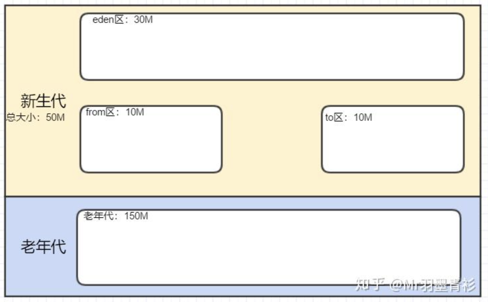

```java
created byte[]: 0
created byte[]: 1
0.236: [GC (Allocation Failure) 0.236: [DefNew: 24807K->870K(40960K), 0.0132148 secs] 24807K->21350K(194560K), 0.0132618 secs] [Times: user=0.02 sys=0.00, real=0.01 secs]
```

创建了两个10M的对象（记为ID：0，ID：1），并且没有设置成可回收对象，由于Eden区目前最起码还有一个Random对象，所以在给第三个对象申请内存时，发现Eden区内存不足，触发了GC。

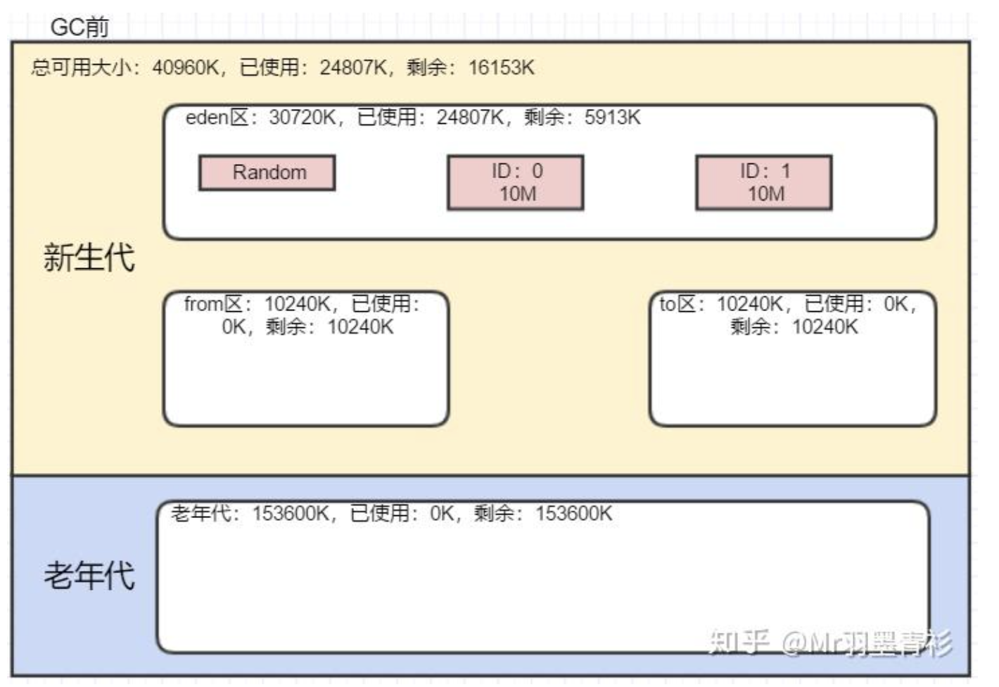

新生代在GC后变为870K，说明Random对象被复制到from区，而两个10M的对象都直接晋升到了老年代。

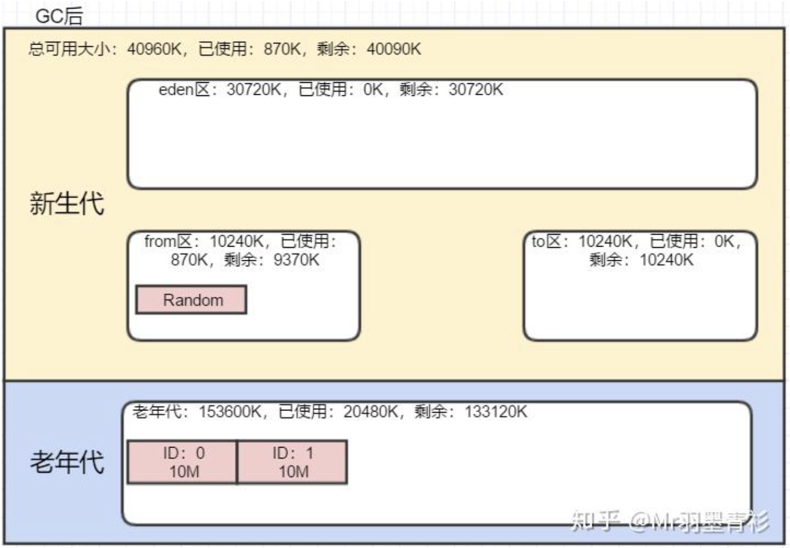

```java
created byte[]: 2
created byte[] and set to null: 3
0.252: [GC (Allocation Failure) 0.252: [DefNew: 21941K->717K(40960K), 0.0060942 secs] 42421K->31437K(194560K), 0.0061231 secs] [Times: user=0.00 sys=0.00, real=0.00 secs]
```

创建了ID：2和ID：3对象，并把ID：3设置为可回收对象

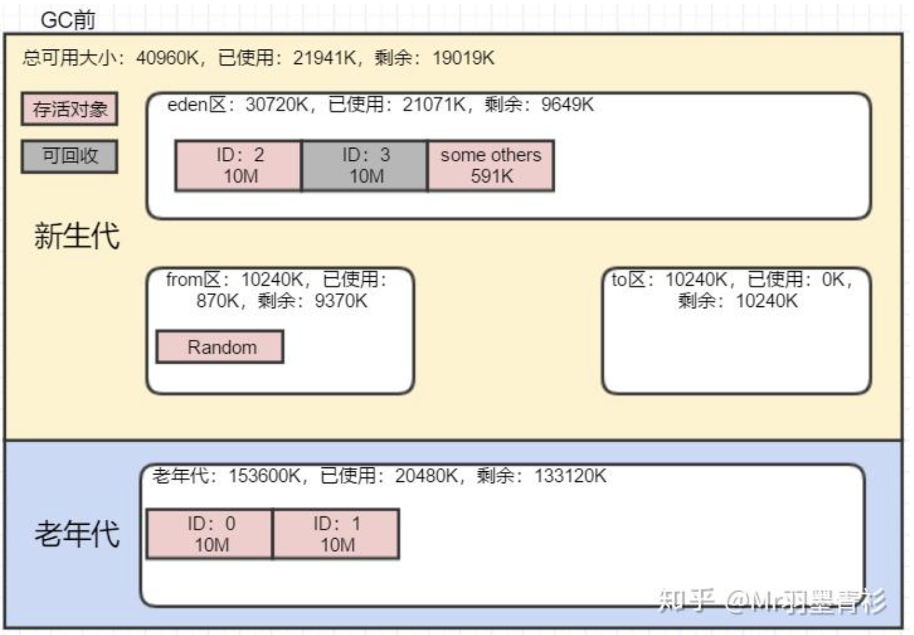

GC会将Eden区的对象和from区的对象尝试复制到to区，ID：3对象直接回收（通过堆空间的容量变化可以看出：42421K->31437K），ID：2对象在to区中放不下，晋升老年代

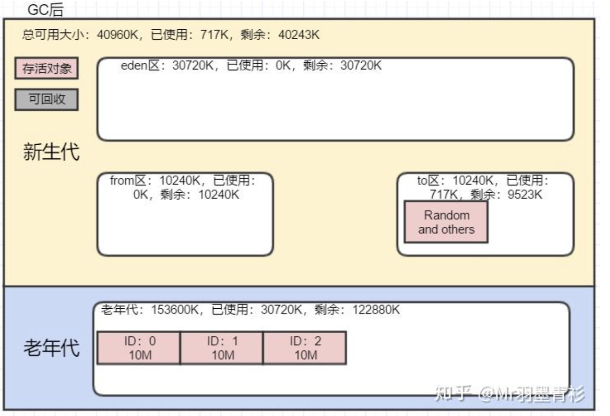

一直到创建ID：12，ID：13，都与上述过程类似，并且没有产生过垃圾对象，但创建完ID：13对象后，老年代的已使用内存达到了130M+，如下：

```java
created byte[]: 12
created byte[]: 13
0.328: [GC (Allocation Failure) 0.328: [DefNew: 21792K->717K(40960K), 0.0162437 secs] 134432K->133837K(194560K), 0.0162844 secs] [Times: user=0.00 sys=0.01, real=0.02 secs]
```

再创建ID：14，ID：15对象后，又需要新生代GC

```java
created byte[]: 14
created byte[]: 15
0.347: [GC (Allocation Failure) 0.347: [DefNew: 21793K->21793K(40960K), 0.0000201 secs]0.347: [Tenured: 133120K->143360K(153600K), 0.0103885 secs] 154913K->154316K(194560K), [Metaspace: 3350K->3350K(1056768K)], 0.0104608 secs] [Times: user=0.02 sys=0.00, real=0.01 secs]
```

GC前如下所示

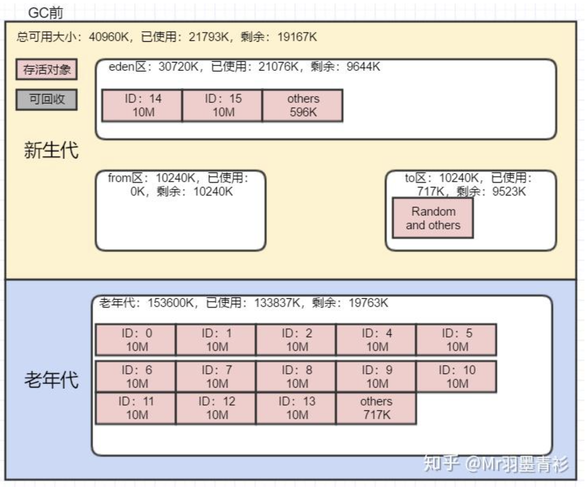

在新生代GC时，要把ID：14，ID：15的对象复制到老年代，但此时老年代已经不足以容纳这两个对象，此时会触发老年代的GC。

即日志中的Tenured部分。但发现没有任何对象可以回收，然后尝试复制了Eden区的一个对象到老年代

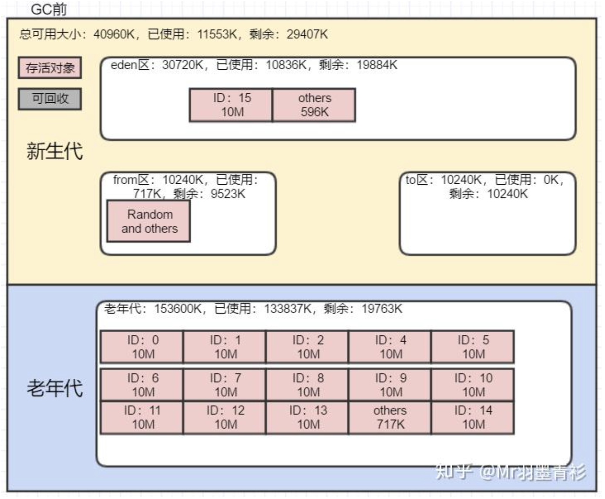

然后继续创建对象，会继续尝试Full GC，Full GC无果，最终发生内存溢出。

```java
Exception in thread "main" created byte[]: 16
0.361: [Full GC (Allocation Failure) 0.361: [Tenured: 143360K->143360K(153600K), 0.0028089 secs] 165153K->164556K(194560K), [Metaspace: 3350K->3350K(1056768K)], 0.0028543 secs] [Times: user=0.00 sys=0.00, real=0.00 secs]
0.364: [Full GC (Allocation Failure) 0.364: [Tenured: 143360K->143360K(153600K), 0.0050038 secs] 164556K->164538K(194560K), [Metaspace: 3350K->3350K(1056768K)], 0.0050390 secs] [Times: user=0.00 sys=0.00, real=0.00 secs]
Disconnected from the target VM, address: '127.0.0.1:57881', transport: 'socket'
java.lang.OutOfMemoryError: Java heap space
Heap
    at com.example.demo.gcdemo.SerialGCDemo.main(SerialGCDemo.java:28)
```


### 4 总结

首先介绍了Serial的特点以及存在的问题，SerialGC是串行收集器，在收集时会产生STW，停顿时间较长导致用户体验差。

然后通过实战，介绍了如何指定JVM的每一块堆内存。

最后通过一个案例，详细描述了SerialGC的整个过程以及内存变化。


