## 泛型

JDK中判断方法是否重复：方法名、参数、返回值来判断在字节码是否重复。但编译IDE工具中只会判断参数和方法名。

泛型编译成字节码会做泛型擦除，Java虚拟机中在字节码用Signature（弱记忆）签名字段这里保留相关的泛型信息。


## 注解、反射

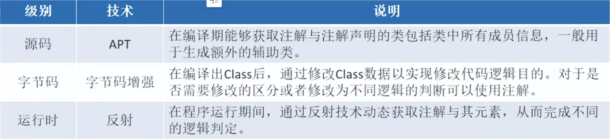


## 进程、线程

进程是操作系统分配资源的最小单元，线程是操作系统调度的最小单元。

在 Android 操作系统中，进程的执行环境可以分为两种状态：内核态（Kernel Mode）和用户态（User Mode）。

* 内核态：此状态下的进程可以执行<font color="red">任何 CPU 指令</font>，并且可以访问所有的内存地址。操作系统的内核代码运行在内核态，以执行硬件控制和进程调度等低级任务。

* 用户态：在用户态，进程只能执行<font color="red">用户级的指令</font>，并且必须通过系统调用来请求内核的服务。这种隔离是为了提高系统的安全性和稳定性。

### 内存映射

IPC 机制中涉及到的内存映射通过 mmap() 来实现，mmap() 是操作系统中一种内存映射的方法。内存映射简单的讲就是将用户空间的一块内存区域映射到内核空间。映射关系建立后，用户对这块内存区域的修改可以直接反应到内核空间；反之内核空间对这段区域的修改也能直接反应到用户空间。

内存映射能减少数据拷贝次数，实现用户空间和内核空间的高效互动。两个空间各自的修改能直接反映在映射的内存区域，从而被对方空间及时感知。也正因为如此，内存映射能够提供对进程间通信的支持。


1.6G cpu执行一条指令耗时0.6ns

一次线程切换的上下文切换占用约2000个CPU周期

不要用stop结束线程，可能资源未正常释放，一般用Interrupt

就绪不代表运行，需要等CPU时间片。

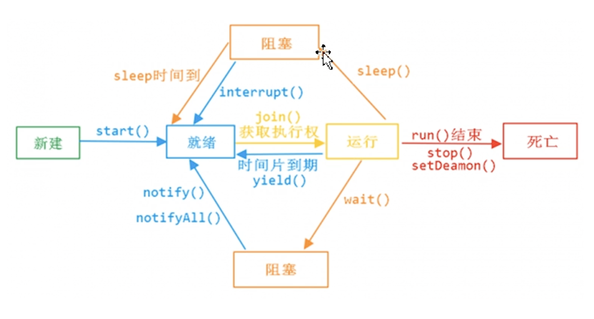

yield: 线程让出CPU（不会让出锁），操作系统再去选线程

join: 挂起当前运行的线程，给join的线程

setDaemon: 设置成守护线程，守护线程finally不一定会调用。

#### 守护线程

java 中的线程分为两种：守护线程（Daemon）和用户线程（User）。

任何线程都可以设置为守护线程和用户线程，通过方法 Thread.setDaemon(boolean)；true 则把该线程设置为守护线程，反之则为用户线程。Thread.setDaemon()必须在 Thread.start()之前调用，否则运行时会抛出异常。

唯一的区别是判断虚拟机(JVM)何时离开，Daemon 是为其他线程提供服务，如果全部的 User Thread 已经撤离，Daemon 没有可服务的线程，JVM 撤离。


ThreadLocal引发的内存泄漏：

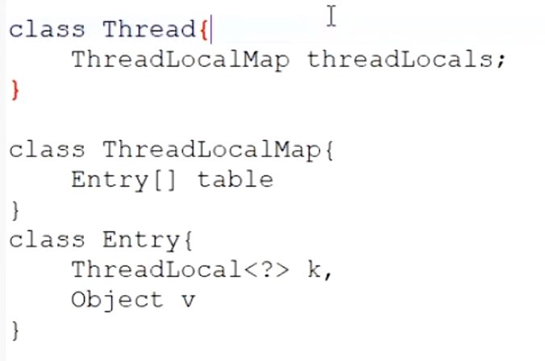

```java
static class Entry extends WeakReference<ThreadLocal<?>> {
        /** The value associated with this ThreadLocal. */
        Object value;

        Entry(ThreadLocal<?> k, Object v) {
            super(k);
            value = v;
        }
    }
```

可以看到这个Entry类，这里的key是使用了个弱引用，所以因为使用弱引用这里的key，ThreadLocal会在JVM下次GC回收时候被回收，而造成了个key为null的情况，而外部ThreadLocalMap是没办法通过null key来找到对应value的。如果当前线程一直在运行，那么线程中的ThreadLocalMap也就一直存在，而map中却存在key已经被回收为null对应的Entry和value却一直存在不会被回收，造成内存的泄漏。

不过，这一点设计者也考虑到了，在get()、set()、remove()方法调用的时候会清除掉线程ThreadLocalMap中所有Entry中Key为null的Value，并将整个Entry设置为null，这样在下次回收时就能将Entry和value回收。

这样看上去好像是因为key使用了弱引用才导致的内存泄漏，为了解决还特意添加了清除null key的功能，那么是不是不用弱引用就可以了呢？

很显然不是这样的。设计者使用弱引用是由原因的。

- 如果使用强引用，那么如果在运行的线程中ThreadLocal对象已经被回收了但是ThreadLocalMap还持有ThreadLocal的强引用，若是没有手动删除，ThreadLocal不会被回收，同样导致内存泄漏。
- 如果使用弱引用ThreadLocal的对象被回收了，因为ThreadLocalMap持有的是ThreadLocal的弱引用，即使没有手动删除，ThreadLocal也会被回收。nullkey的value在下一次ThreadLocalMap调用set,get，remove的时候会被清除。

所以，由于ThreadLocalMap和线程Thread的生命周期一样长，如果没有手动删除Map的中的key，无论使用强引用还是弱引用实际上都会出现内存泄漏，但是使用弱引用可以多一层保护，null key在下一次ThreadLocalMap调用set、get、remove的时候就会被清除。

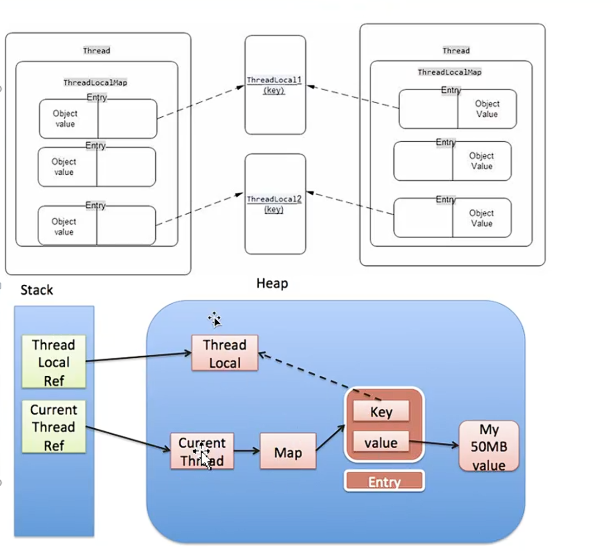

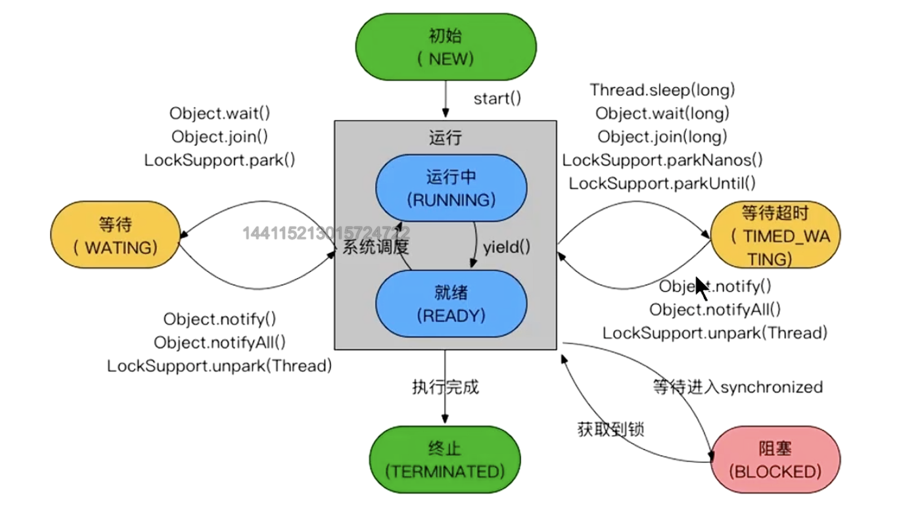

只有synchronized能让线程进入阻塞态，lock和sleep都是等待/等待超时


Java实现中，有一个静态内部类ThreadLocalMap，内部定义了一个Entry是一个弱引用。会导致key被回收，但线程还持有value，导致没回收。可以用完后主动调用remove ，这里会调用ThreadLocal的expungeStaleEntry来清除key为null的。而set/get方法清除的不及时。


死锁：互斥、请求和保持、不剥夺/抢占、环路等待

#### 线程协作

Synchorized(xxx.this) {

​	while(!condintion) {

​		对象.wait();	// 对象wait后会马上释放锁

​	}

}

Synchorized(xxx.this) {

​	对象.notify()/.notifyAll();// 不会马上释放锁，要等后面Synchorized内代码块执行完。notify会随机唤醒同一个Synchorized对象的一个

​	业务逻辑；

}

yield(),sleep()不释放锁。


CAS问题：1.  ABA问题,如果变量被改了之后又被改回来；解决方案：AtomicMarkableReference或AtomicStampedReference。 2. 开销问题（自旋）。3.只能保证一个变量的原子操作；解决方案：AtomicReference。

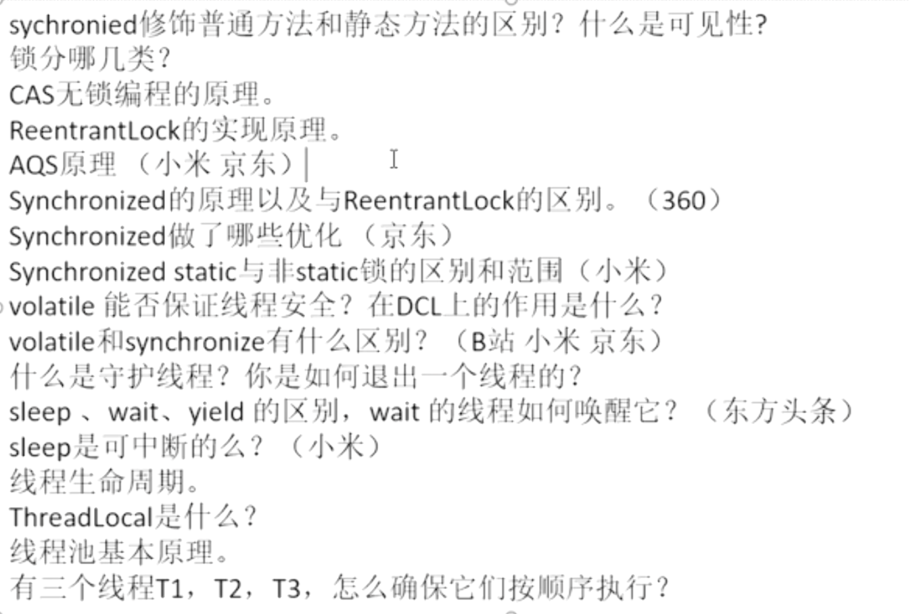


#### 线程池

CPU密集型，最大线程数一般设置为：cpu核心数Runtime.getRuntime().availableProcessor() + 1; **为了充分利用 CPU 资源** ，**避免上下文切换的开销**

- 当设置线程池的最大线程数为可用处理器核心数时，理论上每个线程都可以在一个核心上运行，充分利用 CPU 资源，避免上下文切换的开销。
- 但是，在实际应用中，可能会有一些额外的开销或等待时间（例如，I/O 操作、任务调度等），因此增加一个线程可以帮助在某些情况下<font color="red">提高吞吐量</red>。通过将线程数设置为核心数加一，可以确保在 CPU 处于忙碌状态时，仍然有一个额外的线程可以处理任务，这在任务调度和负载均衡上是有利的。


IO密集型，最大线程数一般设置为：cpu核心数 * 2；

- I/O 密集型任务主要涉及对外部资源的访问（如网络、磁盘等），在这些操作中，线程会很大程度上处于等待状态，直到 I/O 操作完成。
- 在执行 I/O 操作时，线程并不需要使用 CPU 进行计算，而是会因为等待 I/O 的响应而被阻塞。因此，多个线程可以同时等待 I/O 的完成，从而提高系统的利用率。

- 在 I/O 密集型应用中，由于线程大部分时间都在等待 I/O 完成，我们可以通过增加线程数来抵消等待时间。
- 设置线程池的最大线程数为 `availableProcessors() * 2` 可以确保我们有足够的线程在等待 I/O 完成时，仍然能够利用 CPU 来执行其他任务。
- 如果线程数设置得过高，超过系统可以承载的范围，可能会导致操作系统进行频繁的上下文切换，这是因为线程需要在 CPU 资源之间切换执行。过多的上下文切换将带来性能上的开销。
- 找到一个平衡点是非常重要的，`availableProcessors() * 2` 通常被认为是一个安全的经验法则，可以有效减少上下文切换的频率同时提高吞吐量。

混合型，拆分线程池；


#### 锁

参考https://blog.csdn.net/u012373815/article/details/111035234#:~:text=Java%E4%B8%AD%E7%9A%84%E5%A4%A7%E9%83%A8%E5%88%86,%E7%AE%80%E7%A7%B0%E4%B8%BAAQS%EF%BC%89%E5%AE%9E%E7%8E%B0%E7%9A%84%E3%80%82

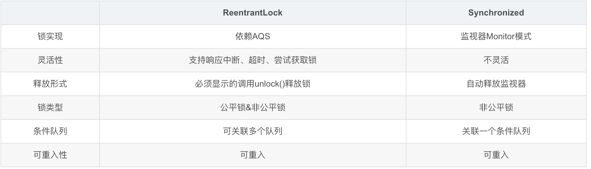

#### AQS

模版方法模式，实现类继承自AbstractQueuedSynchronizer，重写实现tryAcquire和tryRelease等，里面可以用CAS判断设置状态成功后调用AQS的setExclusiveOwnerThread来设置独占。

关键成员变量：state，保存同步状态。

Java中的大部分同步类（**Lock、Semaphore、ReentrantLock等**）都是基于AbstractQueuedSynchronizer（简称为AQS）实现的。AQS是一种提供了**原子式管理同步状态**、**阻塞和唤醒线程功能以及队列模型的简单框架**。


#### CLH队列锁（ReteenLock实现）

要排队的线程打包成QNode对象。队列中每个节点不断 用CAS去检查myPred前一个节点是否释放锁。

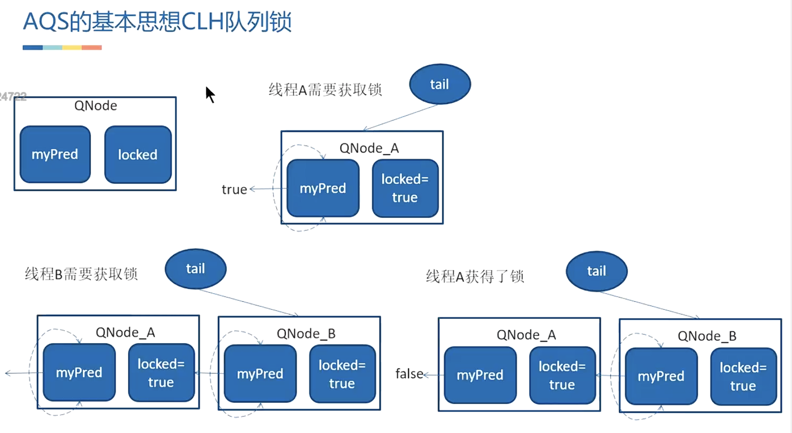

公平锁和非公平锁实现区别：（公平锁tryAcquire要判断后去排队）

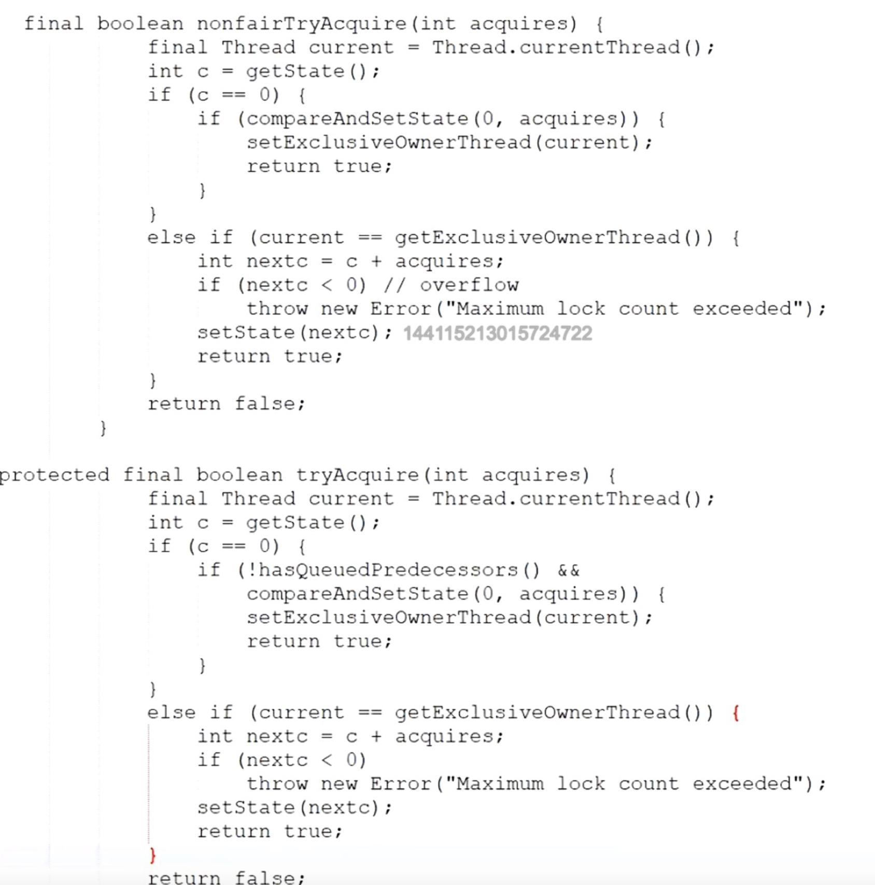

可重入锁则在tryAcquire的时候判断拿锁的是不是自己线程，如果是要改state状态。


#### Synchnorized

JVM虚拟机帮忙插入montiorenter和montiorexit。但如果是加在方法上，则通过加ACC_SYNCHNORIZED实现。


#### 对象头

在32位系统下，对象头8字节，64位则是16个字节【未开启压缩指针，开启后12字节】。对象头中存储了对象的hashcode、分代年龄、锁状态、锁标志位对于普通对象而言，其对象头中有两类信息：**mark word和类型指针**。另外对于数组而言还会有一份记录数组长度的数据。

Java对象头内容记录会变：

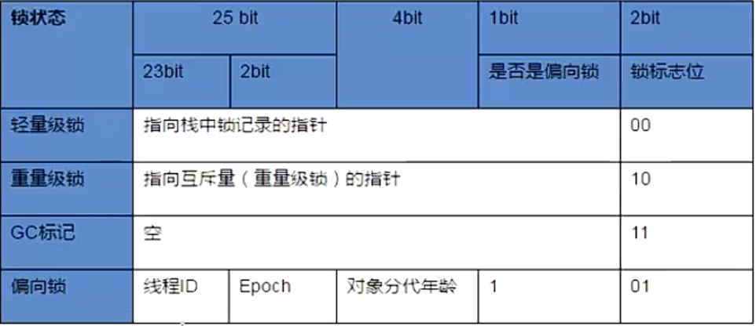

轻量级锁：自旋尝试拿锁；

虚拟机动态判断自旋时间，超过限制（一般是一次上下文切换的时间）后升级锁；

虚拟机统计大部分情况下一个锁总是由同一个线程获取到，推出偏向锁；

偏向锁：检查上一个拿锁的线程是否自己线程（线程ID判断），如果是直接拿到锁；

锁升级：偏向锁（发现有其他线程，撤销偏向锁，撤销时会STW Stop The World）->轻量级锁 -> 重量级锁

高并发任务需要禁用偏向锁。

另外还有锁粗化、锁消除、逃逸分析；


在 Java 中，“逃逸分析”是一种动态分析技术，主要用于优化性能，特别是在多线程环境中的对象创建和对象的作用域管理。通过逃逸分析，Java 编译器和虚拟机（JVM）能够识别对象的可用范围，从而为优化内存分配和减少锁的开销提供依据。

### 逃逸分析的基本概念

- **逃逸**: 当一个对象“逃逸”出其创建的方法或作用域时，意味着这个对象可以被方法外的代码持有或访问。举个例子，如果一个对象是在一个方法内部创建并被返回，那么该对象就是“逃逸”的。
- **逃逸分析的目标**: 主要用于识别对象的生命期，以及该对象是否可以在方法内部安全地使用，不需要在记录共享的状态或在栈上分配。这可以减少对象在堆上的分配，并避免多余的锁操作。

### 逃逸分析的优化

逃逸分析的结果可以用来进行以下优化：

1. **栈上分配 (Stack Allocation)**:
   - 在某些情况下，如果对象只在一个方法内部使用，并且没有逃逸到其他地方，JVM 可以将该对象分配在栈上，而不是在堆上。这种方式会减少内存分配和垃圾回收的开销。
2. **锁消除 (Lock Elimination)**:
   - 如果分析确定一个对象没有被多个线程并发访问，则可以消除对该对象的加锁。这意味着即使该对象的成员方法逻辑上是同步的，但由于在运行时的分析中发现没有多个线程竞争该对象的锁，JVM 可以在代码生成阶段跳过锁的获取和释放操作。
3. **同步消除 (Synchronization Elimination)**:
   - 类似于锁消除，JVM 在对方法进行逃逸分析后，确认为该对象的锁是不必要的。如果确实没有其他线程访问该对象，JVM 可以在编译阶段优化掉这个同步块。


## IO


## JVM&& JMM

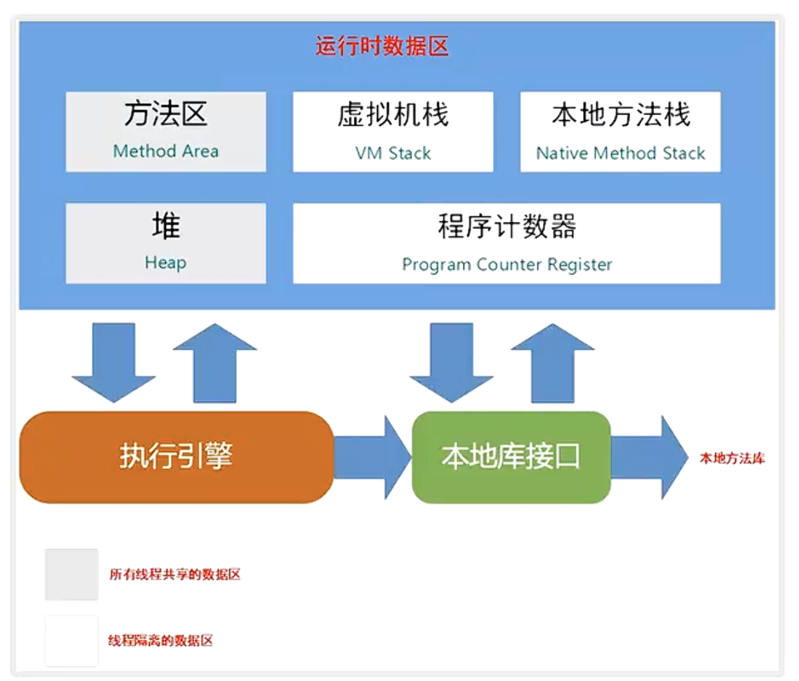

查看app内存限制命令： adb shell cat /system/build.prop

activityManager.getMemoryClass()


Java 虚拟机栈的栈帧（Stack Frame）是用于支持方法调用和方法执行的数据结构，每个方法在执行时都会创建一个栈帧。栈帧包含了方法的局部变量表、操作数栈、动态链接、方法出口等信息。

下面是栈帧中主要包含的信息：

1. 局部变量表（Local Variable Table）：
   - 用于存储方法参数和局部变量的值。在 Java 字节码中，局部变量表的槽位是从0开始的，槽位的大小根据变量的数据类型而定。
2. 操作数栈（Operand Stack）：
   - 用于执行操作的栈，临时存储方法执行过程中的部分结果。操作数栈的大小是提前确定的，栈深度在编译时就可以确定。
3. 动态链接（Dynamic Linking）：
   - 包含了指向运行时常量池中该方法的引用，以便在运行时解析调用的方法、字段等。
4. 返回地址（Return Address）：
   - 用于存储方法的返回地址，即执行完当前方法后需要返回的下一条指令的地址。在方法执行过程中，当调用其他方法时，返回地址会被保存在栈帧中。
5. 异常表（Exception Table）：
   - 用于存储方法中可能抛出的异常信息，包括异常的类型、处理程序的起始和结束位置、以及在栈帧中的处理程序。
6. 附加信息：
   - 一些附加的信息，如常量池引用、调试信息等。

每个栈帧都对应着方法的一次调用，当方法被调用时，栈帧被入栈，当方法执行完毕时，栈帧被出栈。栈帧的创建和销毁是方法调用的基本操作。 Java 虚拟机的栈帧结构使得方法的执行能够按照方法调用的层次进行管理。


Java 中的内存模型分为 **主内存**（Main Memory）和 **工作内存**（Working Memory），这是在 Java 内存模型（Java Memory Model, JMM）中出现的一个重要概念，主要用于描述线程之间如何共享和访问内存。

### 主内存（Main Memory）

主内存是指 Java 虚拟机（JVM）中的共享内存区域，它存储了所有对象实例和类静态变量。主内存是一块全局可见的区域，所有线程都可以访问主内存中的数据，因此在多个线程之间共享数据时，主内存是一个重要的组成部分。

- **对象和类变量存储**：Java 中的对象实例和类的静态变量都存储在主内存中。
- **共享数据**：由于所有线程都可以访问主内存中的数据，因此主内存是线程间共享的。

### 工作内存（Working Memory）

工作内存是每个线程私有的内存区域。每个线程在执行时会将主内存中的变量拷贝到自己的工作内存中，以提高访问速度。线程在工作内存中对变量的操作（读、写等）不直接影响主内存中的数据，直到线程将结果写回主内存。

- **线程私有**：每个线程都会有自己的一套工作内存，工作内存通常是线程对主内存的一个“快照”。
- **操作效率**：由于工作内存对线程来说是私有的，因此对数据的读写操作相对较快，有助于提高程序的性能。


#### GCRoot包括：

静态变量，线程栈变量，常量池，JNI（指针）
