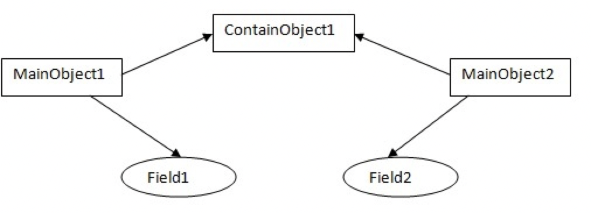
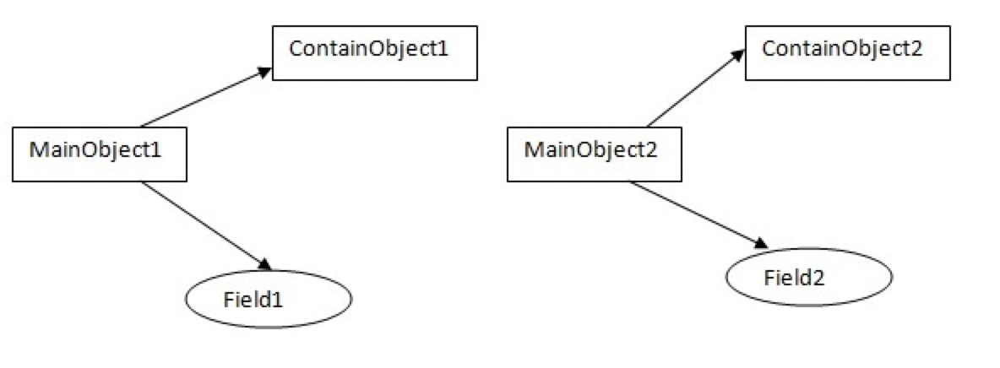
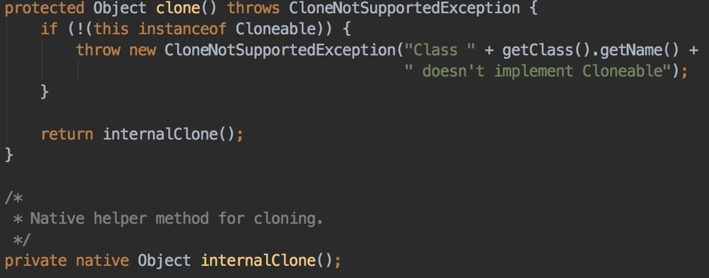
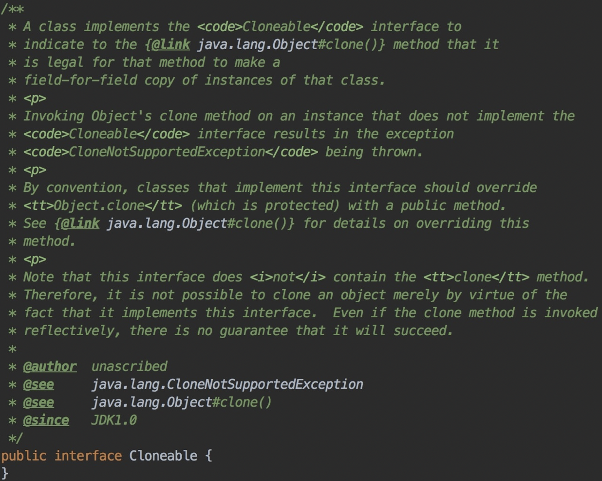
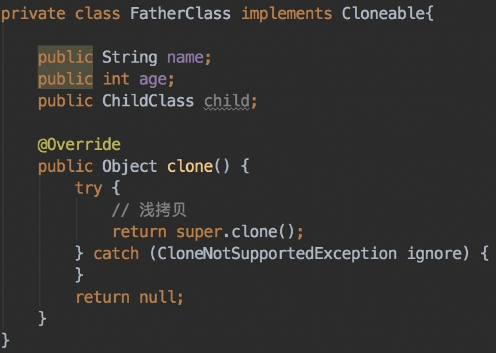
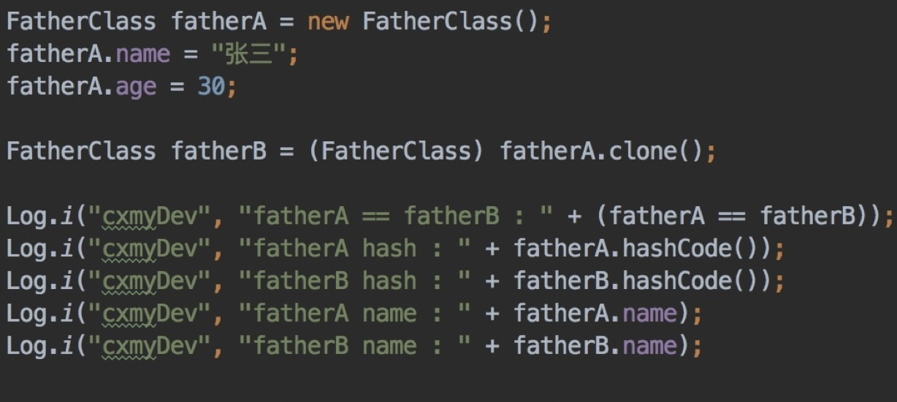
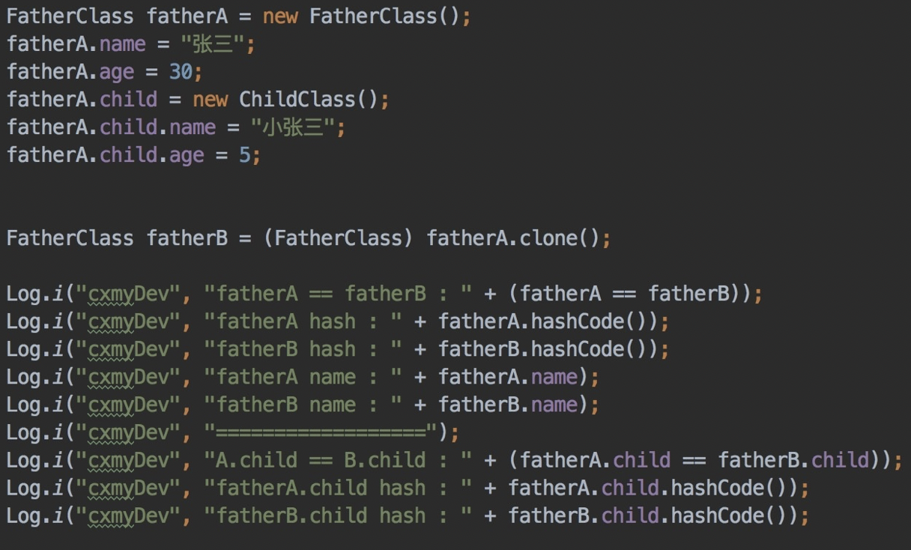
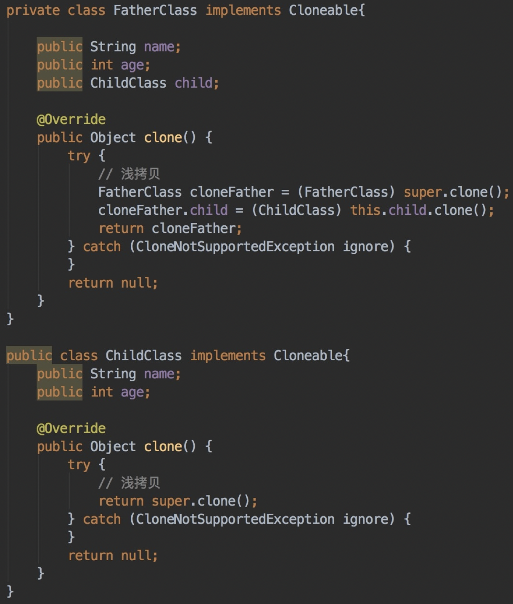

### 一、前言

任何变成语言中，其实都有浅拷贝和深拷贝的概念，Java 中也不例外。在对一个现有的对象进行拷贝操作的时候，是有浅拷贝和深拷贝之分的，他们在实际使用中，区别很大，如果对其进行混淆，可能会引发一些难以排查的问题。

本文就在 Java 中的深拷贝和浅拷贝做一个详细的解说。

### 二、什么是浅拷贝和深拷贝

首先需要明白，浅拷贝和深拷贝都是针对一个已有对象的操作。那先来看看浅拷贝和深拷贝的概念。

在 Java 中，除了**基本数据类型**（元类型）之外，还存在 **类的实例对象** 这个引用数据类型。而一般使用 『 **=** 』号做赋值操作的时候。对于基本数据类型，实际上是拷贝的它的值，但是对于对象而言，其实赋值的只是这个对象的引用，将原对象的引用传递过去，他们实际上还是指向的同一个对象。

而浅拷贝和深拷贝就是在这个基础之上做的区分，如果在拷贝这个对象的时候，只对基本数据类型进行了拷贝，而对引用数据类型只是进行了引用的传递，而没有真实的创建一个新的对象，则认为是浅拷贝。反之，在对引用数据类型进行拷贝的时候，创建了一个新的对象，并且复制其内的成员变量，则认为是深拷贝。

所以到现在，就应该了解了，所谓的浅拷贝和深拷贝，只是在拷贝对象的时候，对 **类的实例对象** 这种引用数据类型的不同操作而已。

总结来说：

1、浅拷贝：对基本数据类型进行值传递，对引用数据类型进行引用传递般的拷贝，此为浅拷贝。

2、深拷贝：对基本数据类型进行值传递，对引用数据类型，创建一个新的对象，并复制其内容，此为深拷贝。

### 三、Java 中的 clone()

##### 3.1 Object 上的 clone() 方法

在 Java 中，所有的 Class 都继承自 Object ，而在 Object 上，存在一个 clone() 方法，它被声明为了 protected ，所以我们可以在其子类中，使用它。

而无论是浅拷贝还是深拷贝，都需要实现 clone() 方法，来完成操作。

可以看到，它的实现非常的简单，它限制所有调用 clone() 方法的对象，都必须实现 Cloneable 接口，否者将抛出 CloneNotSupportedException 这个异常。最终会调用 internalClone() 方法来完成具体的操作。而 internalClone() 方法，实则是一个 **native** 的方法。对此我们就没必要深究了，只需要知道它可以 clone() 一个对象得到一个新的对象实例即可。

而反观 **Cloneable** 接口，可以看到它其实什么方法都不需要实现。对他可以简单的理解只是一个标记，是开发者允许这个对象被拷贝。

##### 3.2 浅拷贝

先来看看浅拷贝的例子。

首先创建一个 class 为 FatherClass ，对其实现 **Cloneable** 接口，并且重写 clone() 方法。

然后先正常 new 一个 FatherClass 对象，再使用 clone() 方法创建一个新的对象。

最后看看输出的 Log ：

I/cxmyDev: fatherA == fatherB : false 

I/cxmyDev: fatherA hash : 560973324 

I/cxmyDev: fatherB hash : 560938740 

I/cxmyDev: fatherA name : 张三 

I/cxmyDev: fatherB name : 张三

可以看到，使用 clone() 方法，从 **==** 和 **hashCode** 的不同可以看出，clone() 方法实则是真的创建了一个新的对象。

**但这只是一次浅拷贝的操作。**

来验证这一点，继续看下去，在 FatherClass 中，还有一个 ChildClass 的对象 child ，**clone()** 方法是否也可以正常复制它呢？改写一个上面的 Demo。

看到，这里将其内的 child 进行负责，用起来看看输出的 Log 效果。

I/cxmyDev: fatherA == fatherB : false 

I/cxmyDev: fatherA hash : 560975188 

I/cxmyDev: fatherB hash : 560872384

I/cxmyDev: fatherA name : 张三 

I/cxmyDev: fatherB name : 张三 

I/cxmyDev: ================== 

I/cxmyDev: A.child == B.child : true 

I/cxmyDev: fatherA.child hash : 560891436 

I/cxmyDev: fatherB.child hash : 560891436

从最后对 child 的输出可以看到，A 和 B 的 child 对象，实际上还是指向了统一个对象，只对对它的引用进行了传递。

##### 3.3 深拷贝

既然已经了解了对 clone() 方法，只能对当前对象进行浅拷贝，引用类型依然是在传递引用。

那么，如何进行一个深拷贝呢？

比较常用的方案有两种：

1. 序列化（serialization）这个对象，再反序列化回来，就可以得到这个新的对象，无非就是序列化的规则需要我们自己来写。
2. 继续利用 clone() 方法，既然 clone() 方法，是我们来重写的，实际上我们可以对其内的引用类型的变量，再进行一次 clone()。

继续改写上面的 Demo ，让 ChildClass 也实现 Cloneable 接口。

最重要的代码就在 FatherClass.clone() 中，它对其内的 child ，再进行了一次 clone() 操作。

再来看看输出的 Log。

I/cxmyDev: fatherA == fatherB : false

I/cxmyDev: fatherA hash : 561056732 

I/cxmyDev: fatherB hash : 561057344 

I/cxmyDev: fatherA name : 张三 

I/cxmyDev: fatherB name : 张三 

I/cxmyDev: ================== 

I/cxmyDev: A.child == B.child : false 

I/cxmyDev: fatherA.child hash : 561057304 

I/cxmyDev: fatherB.child hash : 561057360

可以看到，对 child 也进行了一次拷贝，这实则是对 ChildClass 进行的浅拷贝，但是对于 FatherClass 而言，则是一次深拷贝。

其实深拷贝的思路都差不多，序列化也好，使用 clone() 也好，实际上都是需要我们自己来编写拷贝的规则，最终实现深拷贝的目的。

如果想要实现深拷贝，推荐使用 clone() 方法，这样只需要每个类自己维护自己即可，而无需关心内部其他的对象中，其他的参数是否也需要 clone() 。

### 四、总结

到现在基本上就已经梳理清楚，Java 中浅拷贝和深拷贝的概念了。

实则浅拷贝和深拷贝只是相对的，如果一个对象内部只有基本数据类型，那用 clone() 方法获取到的就是这个对象的深拷贝，而如果其内部还有引用数据类型，那用 clone() 方法就是一次浅拷贝的操作。

