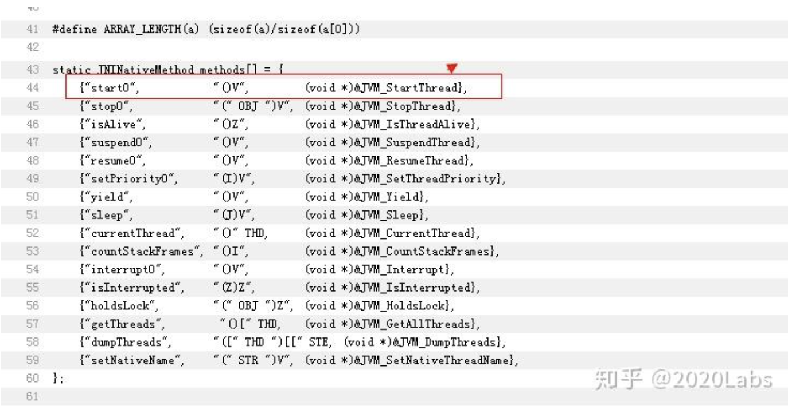

网上几乎全部介绍Kotlin的文章都会说Kotlin的协程是多么的高效，比线程性能好很多，然而事情的真相真是如此么？

协程的概念本身并不新鲜，使用C++加上内嵌汇编，一个基本的协程模型50行代码之内就可以完全搞出来。早在2013年国内就有团队开源了号称支持千万并发的C++协程库 libco。

最近几年协程的概念越来越深入人心，主要还是因为Google的Go语言应用范围越来越广，考虑到目前并没有一个通用的协程的定义，所以本文中对协程的定义主要来自于Go。


## 一、Kotlin协程在互联网上的主流定义

问题的讨论起源于文章[《Go语言出现后，Java还是最佳选择吗？》](https://link.zhihu.com/?target=https%3A//mp.weixin.qq.com/s%3F__biz%3DMzIzOTU0NTQ0MA%3D%3D%26mid%3D2247491875%26idx%3D1%26sn%3Dcb915675f6b1892d22bd434b372910c7%26scene%3D21%23wechat_redirect)，由于之前写过一段时间Go语言，对Go语言有一定的理解，所以当时我看完这篇文章的时候感到疑惑的是Kotlin到底有没有完整的实现类似于Go语言中的协程机制？如果有，那么显然没有必要费这么一大段功夫来魔改JVM的实现。如果没有，那么网上那一堆堆的博客难道说的都是错误的吗？例如下面百度搜索的结果：


Kotlin官方网站中的例子：


这个例子说明用Java开10w个线程很大概率就会OOM了，但是Kotlin开10w个协程就不会OOM，给人一种Go语言中协程的感觉。但是真的是这样么？带着这个问题，我们进行了一番探索，希望下面的内容能帮你解开疑惑。

## 二、JVM中的Thread和OS的Thread的对应关系

要搞清楚协程，首先要搞清楚线程。我们都知道CPU的每个核心同一时刻只能执行一个线程。

因此会带来一个问题，当线程数量超过CPU的核心数量的时候怎么办？当然是有的线程先暂停一下，然后让其他的线程走走，每个线程都有机会走一下，最终的目标就是让每个线程都执行完毕。

对于大部分Java的开发者来说，JVM都是Oracle提供的，而Android开发者面对的就是Art了。但是不管是Oracle的JVM还是谷歌Android的Art，对于这种主流的JVM实现，他们的线程数量和操作系统中线程的数量基本都是保持在1:1的。

也就是说只要在Java语言里面每start Thread 一次，JVM中就会多一个Thread，最终就会多一个os级别的线程，在不考虑调整JVM参数的情况下，一个Thread所占用的内存大小是1mb。最终的JVM的Thread的调度还是依赖底层的操作系统级别的Thread调度。只要是依赖了操作系统级别的Thread调度，那么就不可避免的存在Thread切换带来的开销。

每一次Thread的 上下文切换都会带来开销，最终结果就是如果线程过多，那么最终线程执行代码的时间就变少，因为大部分的CPU的时间都消耗在了切换线程上下文上。

这里简单证明一下，在Java中Thread和OS的Thread 是1:1的关系:

Start一个线程以后，这里最终是要调用一个jni方法 private native void start0();

jdk 目录下 /src/share/native/java/lang/ 目录下查询Thread.c 文件



start0 方法最终调用的JVM_StartThread方法. 再看看这个方法。

在hotspot 实现下（注意不是jdk目录了）：

/src/share/vm/prims/ 下面的 jvm.cpp 文件

找到这个方法：


继续下去就跟平台有关了，考虑到Android底层就是Linux，且现在基本服务器都是部署在Linux环境下，可以直接在Linux目录下找对应的实现：也即是在hotspot 下 src/os/linux/vm/os_linux.cpp 中找到该入口。


熟悉Linux的人应该知道，pthread_create 函数就是Linux下创建线程的系统函数了。这就完整的证明了主流JVM中 Java代码里Thread和最终对应os中的Thread是1:1的关系。


## 三、Go语言中的协程做了什么

再回到协程，尤其是在Go语言出现以后，协程在很大程度上可以避免因为创建线程过多，最终导致CPU时间片都来做切线程的操作，从而留给线程自己的CPU时间过少的问题。

原因就在于Go语言中提供的协程在完成我们开发者需要的并发任务的时候， 它的并发之间的调度是由Go语言本身完成的，并没有交给操作系统级别的Thread切换来完成。也就说协程本质上不过是一个个并发的任务而已。

在Go语言中，这些并发的任务之间相互的调度都是由Go语言完成，由极少数的线程来完成n个协程的并发任务，这其中的调度器并没有交给操作系统而是交给了自己。

同时在Go中创建一个协程，也仅仅需要4kb的内存而已，这跟OS中创建一个线程所需要的1mb相差甚远。


## 四、Go和Java在实现并发任务上的不同

我们需要注意的是：对于开发者而言，并不关心实现并发任务的到底是线程还是进程还是协程或者是什么其他。我们只关心提交的并发任务是否可以完成。

来看一下这段极简的Java代码。

```java
package com.wuyue;
  
public class JavaCode {
    public static void main(String[] args) {
  
        new Thread() {
            @Override
            public void run() {
                while (true) {
                    System.out.println("iqoo" + "  " + Thread.currentThread().getName());
                    try {
                        Thread.sleep(3000);
                    } catch (InterruptedException e) {
                        e.printStackTrace();
                    }
                }
            }
        }.start();
        new Thread() {
            @Override
            public void run() {
                while (true) {
                    System.out.println("x27" + "  " + Thread.currentThread().getName());
                    try {
                        Thread.sleep(3000);
                    } catch (InterruptedException e) {
                        e.printStackTrace();
                    }
                }
            }
        }.start();
  
    }
}
```


这个执行结果真的很简单， 交错打印的IQOO和x27 分别对应着2个独立的线程。所以Java 对外提供的并发能力就是依靠不同的Thread来完成。

简单来说有多少个并发任务，最终反应到JVM和OS中就是有多少个Thread来运行。然后我们来看看Go语言中协程是如何完成类似的事情的。

```go
package main
  
  
import (
    "fmt"
    "runtime"
    "strconv"
    "time"
  
    "golang.org/x/sys/windows"
)
  
func name(s string) {
    for {
        //为了演示起来方便 我们每个协程都是相隔一秒才打印，否则命令行中刷起来太快，不好看执行过程
        time.Sleep(time.Second)
        str := fmt.Sprint(windows.GetCurrentThreadId())
        var s = "iqoo" + s + " belong thread " + str
        fmt.Println(s)
  
    }
}
  
func main() {
    //逻辑cpu数量为4，代表我这个go程序 有4个p可以使用。每个p都会被分配一个系统线程。
    //这里因为我电脑的cpu是i5 4核心的，所以这里返回的是4. 如果你的机器是i7 四核心的，那这里返回值就是8了
    //因为intel的i7 cpu 有超线程技术，简单来说就是一个cpu核心 可以同时运行2个线程。
    fmt.Println("逻辑cpu数量:" + strconv.Itoa(runtime.NumCPU()))
    str := fmt.Sprint(windows.GetCurrentThreadId())
    fmt.Println("主协程所属线程id =" + str)
    //既然在我机器上golang默认是4个逻辑线程，那我就将同步任务扩大到10个，看看执行结果
    for i := 1; i <= 10; i++ {
        go name(strconv.Itoa(i))
    }
    // 避免程序过快直接结束
    time.Sleep(100 * time.Second)
  
}
```

可以从下图中看出来，这种交错的并发任务在Go中是可以在一个线程中完成的，也就验证了协程的并发能力并不是线程给的，而是交给Go语言本身自己来完成的。


这里要额外注意的是，Go中 有时候会出现协程迁移的情况（即某个协程可能一开始在线程id为5的线程跑，过一会又会去线程id为10的线程跑），这与Go的调度器机制有关，此处就不展开Go调度器这个话题。

只要知道 Go中的多个协程可以在同一个线程上执行并发任务即可。可以理解为Go的并发模型是M（协程数）:N（线程数）。其中M远远大于N（指数级的差距）. 这个是所有实现协程机制的语言中共有的特性。

## 五、Kotlin有类似Go中的协程能力吗？

那同样的需求，用Kotlin-JVM可以来完成吗？答案是不可以。简单来说，如果Kotlin-JVM 能提供Go类似的协程能力，那应该能完成如下的需求（但实际上使用Kotlin语言是无法完成下面的需求的）：

1. N个并发任务分别打印不同的字符串。就跟上述Go和Java的例子一样。
2. 在打印的时候需要打印出所属的线程id或者线程name，且这id和name要保证一样。因为只有一样 才可以证明是在一个线程上完成了并发任务，而不是靠JVM的Thread来完成并发任务。

## 六、Kotlin语言中有“锁”吗？

我们都知道任何一门现代语言都对外提供了一定的并发能力，且一般都在语言层面提供了“锁”的实现。比如开启10个线程 对一个int变量 进行++操作，要保证打印出来的顺序一定得是1,2,3,4...10. 这样的Java代码很好写，一个synchronized关键字就可以，我们看看Go中的协程是否有类似的能力？

```go
package main
  
  
import (
    "fmt"
    "strconv"
    "sync"
    "time"
  
    "golang.org/x/sys/windows"
)
  
var Mutex sync.Mutex
  
var i = 0
  
func name(s string) {
    Mutex.Lock()
    str := fmt.Sprint(windows.GetCurrentThreadId())
    fmt.Println("i==" + strconv.Itoa(i) + "  belong thread id " + str)
    i++
    defer Mutex.Unlock()
  
}
  
func main() {
    for i := 1; i <= 10; i++ {
        go name(strconv.Itoa(i))
    }
    // 避免程序过快直接结束
    time.Sleep(100 * time.Second)
}
```


执行结果很清楚的可以看到，Go中的协程也是有完整的锁实现的。那么Kotlin-JVM的协程有没有类似的锁的实现呢？经过一番搜索，我们首先看看这个Kotlin官方论坛中的讨论[https://discuss.kotlinlang.org/](https://link.zhihu.com/?target=https%3A//discuss.kotlinlang.org/t/concurrency-in-kotlin/858)


这里要提一下的是，很多人都以为Kotlin是谷歌出的，是谷歌的亲儿子，实际上这是一种错误的想法。Kotlin是JB Team的产物，并不是谷歌亲自操刀开发的，最多算是个谷歌的干儿子。这个JB Team 很多人应该知道，是IDEA的开发团队Android Studio也是脱胎自 IDEA。

关于这个讨论，JB Team的意思是说 Kotlin 在自己的语言级别并没有实现一种同步机制，还是依靠的 Kotlin-JVM中的 Java关键字。尤其是synchronized。既然并发的机制都是依靠的JVM中的sync或者是lock来保证，为何称之为自己是协程的？

我们知道在主流JVM的实现中，是没有协程的，实际上JVM也不知道上层的JVM语言到底是啥，反正JVM只认class文件，至于这个class文件是Java编译出来的，还是Kotlin编译出来的，或是如groovy等其他语言，那都不重要，JVM不需要知道。

基于这个讨论 我们可以确定的是，Kotlin语言没有提供锁的关键字，所有的锁实现都交给了JVM自己处理。其实就是交给线程来处理了。也就是说，虽然 Kotlin-JVM 声称自己是协程，但实际上干活的还是JVM中Thread那一套东西。

写一个简单的代码验证一下，简单写一个Kotlin的类，因为Kotlin本身没有提供同步的关键字，所以这里就用Kotlin官方提供的sync注解。

```kotlin
class PrintTest {
    @Synchronized fun print(){
        println("hello world")
    }
  
    @Synchronized fun print2(){
        println("hello world")
    }
}
```

然后我们反编译看看这个东西到底是啥。


## 七、Kotlin未来会支持真协程吗？

到了这里，是否说Kotlin 完全是不支持协程的呢？我认为这种说法也是不准确的，只能说Kotlin-JVM 这个组合是不支持协程的。例如我们在IDEA中新建Kotlin工程的时候。


可以看出来，这里是有选项的，上述的验证，我们只验证了 Kotlin-JVM 是不支持协程的。那么有没有一种Kotlin-x 的东西是支持协程的呢？答案是还真可能有。具体参见官方文档中Kotlin-Native 平台对 并发能力的描述：

[https://kotlinlang.org/docs/reference/native/concurrency.html](https://link.zhihu.com/?target=https%3A//kotlinlang.org/docs/reference/native/concurrency.html)（Kotlin-native平台就是直接将Kotlin-native编译成对应平台的可执行文件也就是机器码，并不需要类似于JVM这样的虚拟机了）。

我大概翻译一下其中的几个要点：Kotlin-Native的并发能力不鼓励使用带有互斥代码块和条件变量的经典的面向线程的并发模型，因为该模型容易出错且不可靠。开篇的这句话直接diss的就是JVM的并发模型。然后继续往下看还有惊喜：


注意看第一句话，意思就是Kotlin-native提供了一种worker的机制 来替代线程。目前来看能替代线程的东西也就只有协程了。也就是说起码在Kotlin-native这个平台上，Kotlin是真的想提供协程能力的。目前Kotlin-Native并没有正式发布，我们在idea上新建Kotlin工程的时候并没有看到有Kotlin-Native这个选项。且Kotlin-Native目前仅支持linux和mac平台，不支持windows。有兴趣且有条件的同学可以自行搜索Kotlin-Native的编译方法。

## 八、主流JVM有计划支持协程吗？

经过前文的分析，我们知道至少目前来看主流的JVM实现中是没有协程的实现的。但是已经有不少团队在朝着这方面努力，比如说 quasar这个库，利用字节码注入的方法可以实现协程的效果。

在这个作者加入Oracle之前，OPENJDK也一直在往协程上努力，项目名loom，这个应该是开源社区中一直在做的标准协程实现了。此外在生产环境中已经协程上线的效果可以看文章[《重塑云上的 Java 语言》](https://link.zhihu.com/?target=https%3A//mp.weixin.qq.com/s%3F__biz%3DMzU4NzU0MDIzOQ%3D%3D%26mid%3D2247488382%26idx%3D1%26sn%3D895c40c9696dd528dcf0fcefe6ac423d%26scene%3D21%23wechat_redirect)。

## 九、Kotlin中的协程到底是啥？

那么既然证明了，Kotlin-JVM中的协程并不是真协程，那么这个东西到底是什么，应该怎么用？

个人理解Kotlin-JVM的线程应该就仅仅是针对Java中的Thread做了一次更友好的封装。让我们更方便的使用Java中的线程才是Kotlin-JVM中的协程的真正目的。

本质上和Handler，AsyncTask，RxJava 基本是一致的。只不过Kotlin中的协程比他们更方便一些。这其中最核心的是suspend这个Kotlin协程中的关键字。

```kotlin
class MainActivity : AppCompatActivity() {
  
    override fun onCreate(savedInstanceState: Bundle?) {
        super.onCreate(savedInstanceState)
        setContentView(R.layout.activity_main)
        GlobalScope.launch(Dispatchers.Main) {
            getInfo()
            getInfoNoContext()
            Log.v("wuyue", "我又切回来了 in thread " + Thread.currentThread().name)
        }
    }
  
    /**
     * 挂起就是切换线程 没其他作用，最多就是切到其他线程以后还可以自动切回来，避免过多的callback
     * 所有被suspend标记的函数 要么在协程里被调用，要么在其他挂起函数里被调用，否则就无法实现
     * 切走以后又可以切回来的效果
     */
    suspend fun getInfo() {
        /**
         * withContext挂起函数 内部实现了挂起的流程，suspend其实并没有这个功能
         * kotlin中有很多挂起函数，withContext 应该是最常用的
         */
        withContext(Dispatchers.IO) {
            Log.v("wuyue", "getInfo in thread " + Thread.currentThread().name)
        }
    }
  
    /**
     * 这个函数 虽然用suspend标记 但是并没有 用withContext 指定挂起，
     * 所以是没办法实现切线程的作用的，自然而然也就无法实现 所谓的挂起了
     * 个人理解这个suspend关键字的作用就是提醒 调用者注意 你如果调用的是一个被suspend标记的函数
     * 那么一定要注意 这个函数可能是一个后台任务，是一个耗时的操作，你需要在一个协程里使用他。
     * 如果不在协程里使用，那么kotlin的编译 就会直接报错了。
     *
     *
     * 这点其实对于android来讲还是很有用的，你所有认为耗时的操作都可以用suspend来标记，然后在内部指定
     * 这个协程的thread 为 io thread， 如果调用者没有用launch来 call 这个方法，那么编译就报错。
     * 自然而然就避免了很多 主线程操作io的问题
     *
     */
    suspend fun getInfoNoContext() {
        Log.v("wuyue", "getInfoNoContext in thread " + Thread.currentThread().name)
    }
}
```


这段代码很简单，可以多看一下注释。很多人都会被所谓Kotlin协程的**非阻塞式**吓到，其实你就理解成Kotlin中所宣传的非阻塞式，无非是用阻塞的写法来完成非阻塞的任务而已。

试想一下，我们上述Kotlin中的代码 如果用Thread来写，就会比较麻烦了，甚至还需要用到回调（如果你不用handler的话）。这一点上Kotlin 协程的作用和RxJava其实是一致的，只不过Kotlin做的更彻底，比RxJava更优雅更方便更简洁。

考虑一种稍微复杂的场景，某个页面需要2个接口都返回以后才能刷新展示，此种需求，如果用原生的Java concurrent并发包是可以做的，但是比较麻烦，要考虑各种异常带来的问题。

比较好的实现方式是用RxJava的zip操作符来做，在有了Kotlin以后，如果利用Kotlin，这段代码甚至会比zip操作符还要简单。例如：

```kotlin
class MainActivity : AppCompatActivity() {
  
    override fun onCreate(savedInstanceState: Bundle?) {
        super.onCreate(savedInstanceState)
        setContentView(R.layout.activity_main)
        GlobalScope.launch(Dispatchers.Main) {
            Log.v("wuyue", "time 1==" + System.currentTimeMillis())
            val sum = withContext(Dispatchers.IO) {
                val requestA = async { requestA() }
                val requestB = async { requestB() }
                requestA.await() +"_____" +requestB.await()
            }
            Log.v("wuyue", "time 2==" + System.currentTimeMillis() + " get sum=" + sum)
        }
    }
  
    /**
     * 3s以后 才拿到请求结果 IQOO
     */
    fun requestA(): String {
        sleep(3 * 1000)
        Log.v("wuyue", "requestA in " + Thread.currentThread().name)
        return "IQOO"
    }
  
    /**
     * 5秒以后拿到请求结果 B
     */
    fun requestB(): String {
        sleep(5 * 1000)
        Log.v("wuyue", "requestB in " + Thread.currentThread().name)
        return "X27"
    }
}
```


可以看出来，我们的2个请求分别在不一样的Thread中完成，并且回调到主线程的时机也差不多花了5s的时间，证明这2个request是并行请求的。

## 十、总结

最后对本文做一个总结：

1. Kotlin-JVM中所谓的协程是假协程，本质上还是一套基于原生Java Thread API 的封装。和Go中的协程完全不是一个东西，不要混淆,更谈不上什么性能更好。
2. Kotlin-JVM中所谓的协程挂起，就是开启了一个子线程去执行任务（不会阻塞原先Thread的执行，要理解对于CPU来说，在宏观上每个线程得到执行的概率都是相等的），仅此而已，没有什么其他高深的东西。
3. Kotlin-Native是有机会实现完整真协程方案的。虽然我个人不认为JB TEAM 在这方面能比Go做的更好，所以这个项目意义并不是很大。
4. Kotlin-JVM中的协程最大的价值是写起来比RxJava的线程切换还要方便。几乎就是用阻塞的写法来完成非阻塞的任务。
5. 对于Java来说，不管你用什么方法，只要你没有魔改JVM，那么最终你代码里start几个线程，操作系统就会创建几个线程，是1比1的关系。
6. OpenJDK正在做JVM的协程实现，项目名称为loom，有兴趣的同学可以查看对应资料。
7. Kotlin官网中那个创建10w个Kotlin协程没有oom的例子其实有误导性，本质上那10w个Kotlin协程就是10w个并发任务仅此而已，他下面运行的就是一个单线程的线程池。你往一个线程池里面丢多少个任务都不会OOM的（前提是你的线程池创建的时候设定了对应的拒绝策略，否则无界队列下，任务过多一定会OOM），因为在运行的始终是那几个线程。

- 参考资料

1. https://www.zhihu.com/question/23290260
2. [https://juejin.im/post/5b7678f451882533110e8948](https://link.zhihu.com/?target=https%3A//juejin.im/post/5b7678f451882533110e8948)
3. https://www.zhihu.com/question/263955521
4. [https://kaixue.io/kotlin-coroutines-1/](https://link.zhihu.com/?target=https%3A//kaixue.io/kotlin-coroutines-1/)

更多内容敬请关注 **vivo 互联网技术** 微信公众号


[http://weixin.qq.com/r/KzgbAzzEqmHVrXhg9205](https://link.zhihu.com/?target=http%3A//weixin.qq.com/r/KzgbAzzEqmHVrXhg9205) (二维码自动识别)