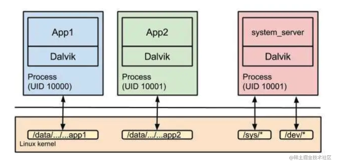
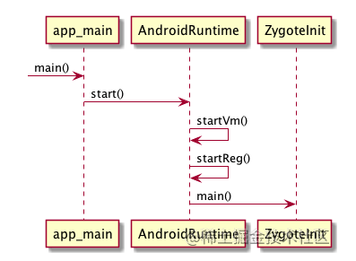
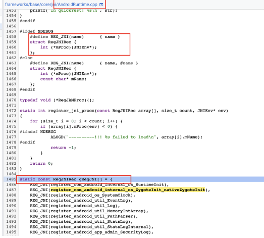
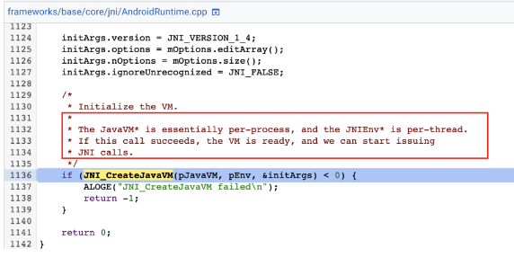
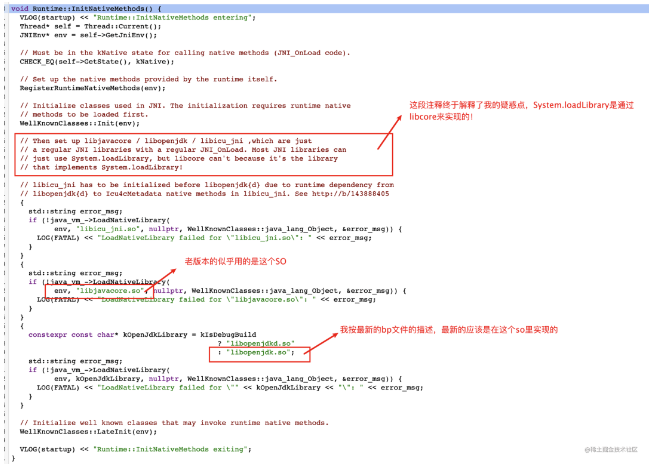
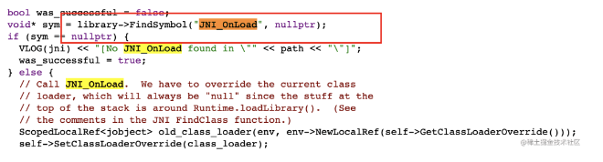
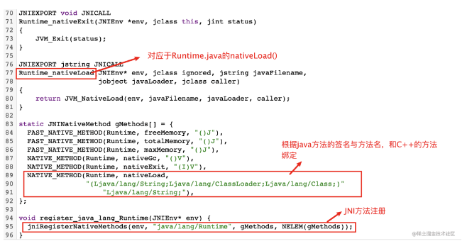
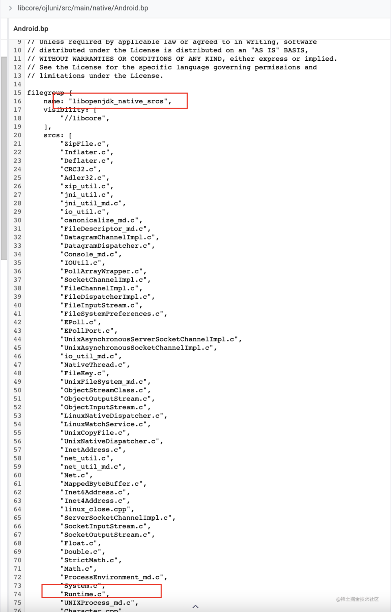
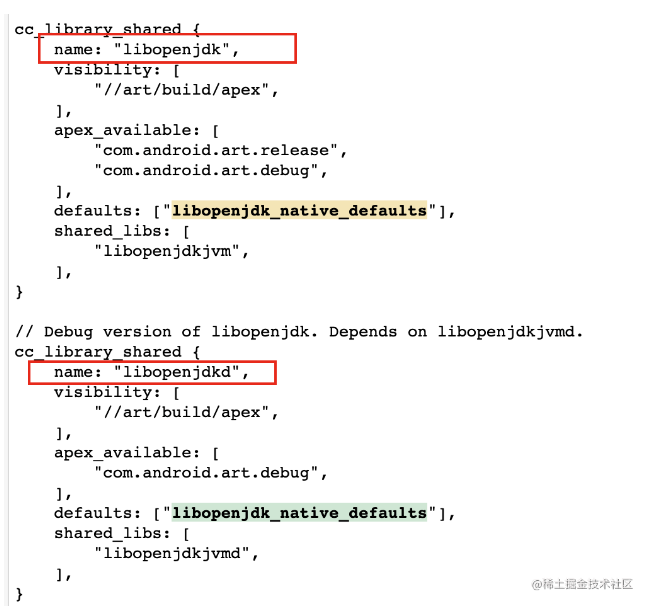

### **Android 上 SO 加载原理**

要知道,Android本质上还是一个Linux系统，两者加载SO都是一样的套路，这里有篇文章说的很好：Linux 系统加载动态库过程分析。简单点说：Anroid加载SO，最终是通过系统方法dlopen()来完成的。

基本流程是：`System.loadLibrary() -> Runtime.loadLibrary0() -> Runtime.nativeLoad() -> ...`。 

但这里有个地方让我刚开始难以理解，明明是看SO的加载，结果最后却是用到了JNI的方法，那又是谁加载的这个JNI的SO呢？

显然，Runtime的JNI部分已经加载好了，这里就要看Anroid系统本身的加载流程，可以参考安卓进程的启动流程、从源码解析-Android中Zygote进程是如何fork一个APP进程的、Android Zygote进程和app进程fork过程分析1、Android Zygote进程和app进程fork过程分析2，**我用的是最新的Android代码，可能会和文章不太一致，但大体思路是没变的**。先看一张安卓进程之间的关系图：

不难看出，每一个android进程都各自独立的虚拟机，那么一个应用在启动时，会加载自己的虚拟机，这个时候，也就会加载到`Runtime.nativeLoad()`方法，那就要讲讲虚拟机的加载了。

### 虚拟机加载流程

先挑一个简单的说，就我们平时常用的`Context.startActivity()`就能拉起一个进程，抛开其中复杂的逻辑判断，调用链是： 
`Context.startActivity() -> Instrumentation.execStartActivity() -> ActivityTaskManager.getService().startActivity() -> binder访问到ActivityManagerService.startActivity() -> 如果进程未启动 -> ActivityTaskManagerService.startProcessAsync() -> ProcessList.startProcessLocked() -> Process.start() -> ZygoteProcess.start() -> 通过LocalSocket到ZygoteInit.java` 

这里需要切换到`ZygoteInit.java`,Zygote进程被启动后，会一直读取通过LocalSocket过来的任务，其流程是： 
`ZygoteInit.main() -> ZygoteServer.runSelectLoop() 读到前面发来的创建进程请求-> ZygoteConnection.processOneCommand() -> Zygote.forkAndSpecialize() -> Zygote.nativeForkAndSpecialize() -> fork成功后 -> 回到ZygoteConnection.processOneCommand()中，调用ZygoteConnection.handleChildProc() -> ZygoteInit.childZygoteInit() —> RuntimeInit.findStaticMain() -> ActivityThread.main()`

到这一步，就是到了拉起APP主线程的时候了，应用的虚拟机早在fork的那一步就被拷贝，其实已经被启动了。

似乎跑题了，应该只需要看Zygote进程的创建流程的，就当是复习吧=、=。

#### Zygote进程启动来看So加载

手机启动流程：

1. 启动电源以及系统启动：开启电源后，加载引导程序BootLoader到RAM中，执行。
2. BootLoader：Android系统开始运行前的一个小程序，作用是拉起OS并运行。
3. Linxu内存启动：启动后会有一系列初始化动作，接着会调用init.rc（Android Init Langauage脚本语言），并启动init进程。
4. init进程启动：init进程主要用于初始化和启动熟悉服务，也可以用来启动Zygote进程。
5. 执行zygot的rc脚本后，会进入frameworks/base/cmds/app_process/app_main.cpp的main方法。
6. 先看下流程图(来源)：

7. 创建虚拟机后，开始注册JNI方法AndroidRuntime::startReg() -> AndroidRuntime::register_jni_procs()。 
   扯一个题外话，该注册方法的调用是这样的，register_jni_procs(gRegJNI, NELEM(gRegJNI), env)，它的实现是如图：

   可见，这里的gRegJNI是一个RegJNIRec数组，都通过调用array[i].mProc(env)来注册，由于C++知识的匮乏，初看还不太理解，做一下说明，拿方法`int register_com_android_internal_os_RuntimeInit(JNIEnv* env)`来说：`REG_JNI(register_com_android_internal_os_RuntimeInit)`等价于`{register_com_android_internal_os_RuntimeInit}`，而这种数组定义方式的含义实际上就是把`register_com_android_internal_os_RuntimeInit`这个函数指针，作为该数组元素的初始化参数，即该数组元素的`mProc`指针指向`register_com_android_internal_os_RuntimeInit`

8. 如果这里能找到对`Runtime.nativeLoad()`方法的C++注册，那显然就能解释JNI方法是如何加载的了，遗憾的是，并没有，这里的操作，主要是注册Android特有的JNI方法，于是要回到虚拟机初始化部分。

9. 回到`AndroidRuntime::startVm() -> JNI_CreateJavaVM()`,看注释有点意思了，大意是说是Android虚拟机预处理的地方，完成后就能使用JNI方法了。

   

   接着到`JniInvocation.c的JNI_CreateJavaVM() -> 最终是DlSymbol JNI_CreateJavaVM_ = FindSymbol(library, "JNI_CreateJavaVM"); -> libart.so的JNI_CreateJavaVM() -> java_vm_ext.cc的JNI_CreateJavaVM() -> runtime.cc的Runtime::Start() -> runtime.cc的Runtime::InitNativeMethods()` 
   详细看下InitNativeMethods()方法,终于有点戏了：

   

   接着走，来到`java_vm_ext.cc的JavaVMExt::LoadNativeLibrary()`方法里有段代码是这样的：

   

   **如果熟悉System.loadLibrary()的同学就会知道，加载SO的时候，就会被调用到JNI_Onload()方法。**

   10. 根据前面System.loadLibrary()文章，找到`nativeLoad()`的JNI实现，发现在Runtime.c这个类，看如下代码：

       是不是有点JNI注册方法的感觉了，就是这里！

       

   11. 那么就剩下一件事了，Runtime.c是放到哪个SO里的呢？ 

   其全路径是`libcore/ojluni/src/main/native/Runtime.c`，发现其代码在libcore/ojluni里（小知识：Android Java API迁移）,查看libcore/ojluni/src/main/native/Android.bp：

   

   里面就有一直心心念念的Runtime.c,接着根据其中name来搜，到libcore/NativeCode.bp，接下来路径是`libcore/NativeCode.bp -> libopenjdk_native_defaults -> libopenjdk`：

   

   另一个后缀带d的应该是debug模式下的。

   12. 到这里，整个流程就跑完了，接着做一下总结。

## 总结

这部分文章，描述是我从疑惑 Android SO 的加载，探究整个问题的思考路径：

1. 从`System.loadLibrary()`源码开始，发现加载会用到Native方法`Runtime.nativeLoad()`，从而有第一个疑惑点：明明是看SO的加载，结果用到了Native的方法。
2. 多方查证资料后，知道了Linux加载SO的方式：`dlopen()`和`dlsym()`。从而知道，一定还有另外一个路径去注册C++方法，并串联起Java和C++方法。
3. 像这种方法，应该是Android虚拟机需要加载的，所以猜测在Android虚拟机启动时，会初始化这块逻辑。
4. 在查资料的同时，也学习了一波Activity拉起进程的逻辑，不过由于进程是fork出来的，所以并不涉及虚拟机的创建。
5. 那么就想到去看Android系统的启动流程，进而了解了Zygote进程的启动。
6. 在看Zygote进程启动流程代码时，进入了一个误区，一直以为AndroidRuntime.cpp里注册的一票JNI方法就是我要找的`Runtime.nativeLoad()`，虽然代码流程最后走到了，但这块其实注册的是Android的系统方法，而我需要关系的是Java虚拟机的部分。
7. 回到`AndroidRuntime::startVm()`部分，继续跟流程，在`Runtime::initNativeMethods()`里，看到了关键注释，描述了`System.loadLibrary()`是如何被加载的。
8. 通过查找`Runtime.nativeLoad()`方法所在的源码位置，知道Runtime.c所在的仓库，那么只需要验证一个点，就是`Runtime::initNativeMethods()`加载的SO里头，编译时有这个Runtime.c。
9. 这里需要去看下Anroid系统如何编译的了，然后去了解了bp脚本，最终根据编译脚本确认了之前的思路。
10. Android系统是十分复杂的，想要深挖一个点的时候，往往需要多个点的知识背景，但保持这种探究的精神，非常有助于自己的提升。

> *原文链接: https://juejin.cn/post/6850418111439437832*