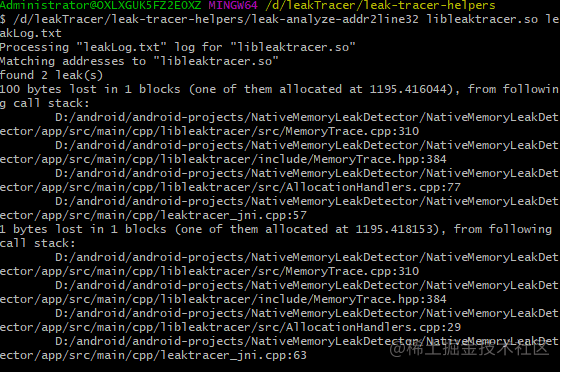

#### 一、LeakTracer介绍

以下是官方介绍

https://github.com/fredericgermain/LeakTracer

http://www.andreasen.org/LeakTracer/

> This library is designed to be a nice complement of valgrind and libduma (ex efence) to detect leak memory. It simply override C/C++ allocation function (new, malloc, …) to keep then in a simple list that could be analysed later. The effective allocation is still done by the underlying libc. It can be used when valgrind is not ported on your platform, when libduma is using too much virtual memory (embedded system), or when you're really interested in tracking only memory leaks. You may start/stop/dump monitoring allocation from the first allocation, when the program receive a signal (for ex. SIGUSR1), or when you explicitly call a LeakTracer function.

简单来说，**该库主要是通过重写`libc`中的`malloc`、`free`、`new`、`delete`这些函数和操作符，记录内存申请和释放操作来判断程序是否可能出现了内存泄漏。**


#### 二、使用介绍

- 该库主要是提供了以下几个函数对外使用，用于内存泄漏检测，其中`writeLeaksToFile`函数用于将内存泄漏信息输出到文件

```
        /** starts monitoring memory allocations in all threads */
        inline void startMonitoringAllThreads(void);

        /** starts monitoring memory allocations in current thread */
        inline void startMonitoringThisThread(void);

        /** stops monitoring memory allocations (in all threads or in
         *   this thread only, depends on the function used to start
         *   monitoring */
        inline void stopMonitoringAllocations(void);

        /** stops all monitoring - both of allocations and releases */
        inline void stopAllMonitoring(void);

        /** writes report with all memory leaks */
        void writeLeaksToFile(const char *reportFileName);
```

- 然后用该库提供的leak-tracer-helpers文件夹中的工具对输出的日志进行分析，打印出内存泄漏的代码位置及调用栈信息，效果如下

  

  **注意：** leak-tracer-helpers目录下的leak-analyze-addr2line工具其实是一堆shell代码，用到了addr2line工具，需要将NDK中的addr2line加到环境变量Path中。


#### 三、源码分析

这里以如下流程为例分析内存泄漏检测流程：

- 调用`startMonitoringAllThreads`初始化
- 手动造成内存泄漏
- 调用`stopAllMonitoring`停止检测
- 调用`writeLeaksToFile`输出内存泄漏信息
- **初始化**

先来看看`startMonitoringAllThreads`函数，这里主要是调用了`leaktracer::MemoryTrace::Setup()`进行初始化操作

```
 inline void MemoryTrace::startMonitoringAllThreads(void) {

        leaktracer::MemoryTrace::Setup();

        TRACE((stderr, "LeakTracer: startMonitoringAllThreads\n"));
        if (!__monitoringReleases) {
            MutexLock lock(__allocations_mutex);
            // double-check inside Mutex
            if (!__monitoringReleases) {
                __allocations.clearAllInfo();
                __monitoringReleases = true;
            }
        }
        // 将这个标记位置为true，后续用于判断
        __monitoringAllThreads = true;
        stopMonitoringPerThreadAllocations();
    }
```

然后在`leaktracer::MemoryTrace::Setup()`中看到，主要是执行了`MemoryTrace::init_no_alloc_allowed()`

```
int MemoryTrace::Setup(void)
{
    pthread_once(&MemoryTrace::_init_no_alloc_allowed_once, MemoryTrace::init_no_alloc_allowed);

    if (!leaktracer::MemoryTrace::GetInstance().AllMonitoringIsDisabled()) {
        pthread_once(&MemoryTrace::_init_full_once, MemoryTrace::init_full_from_once);
    }
#if 0
        else if (!leaktracer::MemoryTrace::GetInstance().__setupDone) {
    }   
#endif
    return 0;
}
```

在`MemoryTrace::init_no_alloc_allowed()`函数中做了最关键的两件事：

- 调用`dlsym`函数找到libc中的`calloc`,`malloc`等函数，记录在`libc_alloc_func_t`结构体的`localredirect`变量中

- 调用`dladdr`函数，用于记录动态库加载时的基础偏移量，`Dl_info`结构体的内容如下，`dli_fbase`用于记录so加载时基础偏移量，这个后续在计算指令相对于动态库的偏移量时会用到

  ```
  typedef struct {
    /* Pathname of shared object that contains address. */
    const char* dli_fname;
    /* Address at which shared object is loaded. */
    void* dli_fbase;
    /* Name of nearest symbol with address lower than addr. */
    const char* dli_sname;
    /* Exact address of symbol named in dli_sname. */
    void* dli_saddr;
  } Dl_info;
  ```

```c++
typedef struct {
  const char *symbname;
  void *libcsymbol;
  void **localredirect;
} libc_alloc_func_t;

static Dl_info s_P2pSODlInfo;

static libc_alloc_func_t libc_alloc_funcs[] = {
  { "calloc", (void*)__libc_calloc, (void**)(&lt_calloc) },
  { "malloc", (void*)__libc_malloc, (void**)(&lt_malloc) },
  { "realloc", (void*)__libc_realloc, (void**)(&lt_realloc) },
  { "free", (void*)__libc_free, (void**)(&lt_free) }
};

void MemoryTrace::init_no_alloc_allowed()
{
    libc_alloc_func_t *curfunc;
    unsigned i;
    // 记录libc中需要重写的函数的地址
     for (i=0; i<(sizeof(libc_alloc_funcs)/sizeof(libc_alloc_funcs[0])); ++i) {
        curfunc = &libc_alloc_funcs[i];
        if (!*curfunc->localredirect) {
            if (curfunc->libcsymbol) {
                *curfunc->localredirect = curfunc->libcsymbol;
            } else {
                *curfunc->localredirect = dlsym(RTLD_NEXT, curfunc->symbname);
            }
        }
    } 
    // 调用一次dladdr，用于记录动态库加载时的基础偏移量
     dladdr((const void*)init_no_alloc_allowed, &s_P2pSODlInfo);

    __instance = reinterpret_cast<MemoryTrace*>(&s_memoryTrace_instance);

    // we're using a c++ placement to initialized the MemoryTrace object living in the data section
    new (__instance) MemoryTrace();

    // it seems some implementation of pthread_key_create use malloc() internally (old linuxthreads)
    // these are not supported yet
    pthread_key_create(&__instance->__thread_internal_disabler_key, NULL);
}
```

以上便是初始化相关的主要内容，接下来看下申请内存和释放内存时的操作

- **内存申请**

**这里定义的`lt_malloc`、`lt_free`等函数就是当时初始化时的函数，指向了`libc`中的`malloc`、`free`等函数**

```
/*
 * underlying allocation, de-allocation used within
 * this tool
 */
#define LT_MALLOC  (*lt_malloc)
#define LT_FREE    (*lt_free)
#define LT_REALLOC (*lt_realloc)
#define LT_CALLOC  (*lt_calloc)
```

在代码中实际调用的`malloc`将被重写为如下内容，主要是在调用`libc`的`malloc`后对内存申请进行记录

```
void *malloc(size_t size)
{
    void *p;
    leaktracer::MemoryTrace::Setup();

    leaktracer::MemoryTrace::GetInstance().InternalMonitoringDisablerThreadUp();
    p = LT_MALLOC(size);
    leaktracer::MemoryTrace::GetInstance().InternalMonitoringDisablerThreadDown();
    leaktracer::MemoryTrace::GetInstance().registerAllocation(p, size, false);

    return p;
}
```

将内存申请记录存到`__allocations`这个Map中，包含内存地址、大小、时间、调用栈信息，其中需要关注下记录调用栈信息的实现

```c++
inline void MemoryTrace::registerAllocation(void *p, size_t size, bool is_array) {
        allocation_info_t *info = NULL;
        if (!AllMonitoringIsDisabled() &&
            (__monitoringAllThreads || getThreadOptions().monitoringAllocations) && p != NULL) {
            MutexLock lock(__allocations_mutex);
            info = __allocations.insert(p);
            if (info != NULL) {
                info->size = size;
                info->isArray = is_array;
                storeTimestamp(info->timestamp);
            }
        }
        // we store the stack without locking __allocations_mutex
        // it should be safe enough
        // prevent a deadlock between backtrave function who are now using advanced dl_iterate_phdr function
        // and dl_* function which uses malloc functions
        if (info != NULL) {
            storeAllocationStack(info->allocStack);
        }

        if (p == NULL) {
            InternalMonitoringDisablerThreadUp();
            // WARNING
            InternalMonitoringDisablerThreadDown();
        }
    }
```

记录调用栈信息的实现如下

```
void MemoryTrace::storeAllocationStack(void* arr[ALLOCATION_STACK_DEPTH])
{
    unsigned int iIndex = 0;

    TraceHandle traceHandle;
    traceHandle.backtrace = arr;
    traceHandle.pos = 0;
    _Unwind_Backtrace(Unwind_Trace_Fn, &traceHandle);

    // fill remaining spaces
    for (iIndex = traceHandle.pos; iIndex < ALLOCATION_STACK_DEPTH; iIndex++)
        arr[iIndex] = NULL;
}
```

真正记录调用栈的实现

- 调用`_Unwind_GetIP`获取当前栈帧里的指令指针（Instruction Pointer）
- 和初始化时的`dli_fbase`相减，即可得到指令相对于动态库的偏移量

```
_Unwind_Reason_Code Unwind_Trace_Fn(_Unwind_Context *context, void *hnd) {
    struct TraceHandle *traceHandle = (struct TraceHandle *) hnd;
    _Unwind_Word ip = _Unwind_GetIP(context);
    if (traceHandle->pos != ALLOCATION_STACK_DEPTH) {
        traceHandle->backtrace[traceHandle->pos] = (void *) (ip - (_Unwind_Word) s_P2pSODlInfo.dli_fbase);
        ++traceHandle->pos;
        return _URC_NO_REASON;
    }
    return _URC_END_OF_STACK;
}
```


- **内存释放**

**和申请内存类似，释放内存时候，通过重写`free`函数，将内存申请记录移除**

```
void free(void* ptr)
{
    leaktracer::MemoryTrace::Setup();

    leaktracer::MemoryTrace::GetInstance().registerRelease(ptr, false);
    LT_FREE(ptr);
}
 inline void MemoryTrace::registerRelease(void *p, bool is_array) {
        if (!AllMonitoringIsDisabled() && __monitoringReleases && p != NULL) {
            MutexLock lock(__allocations_mutex);
            allocation_info_t *info = __allocations.find(p);
            if (info != NULL) {
                if (info->isArray != is_array) {
                    InternalMonitoringDisablerThreadUp();
                    // WARNING
                    InternalMonitoringDisablerThreadDown();
                }
                __allocations.release(p);
            }
        }
    }
```


- **记录内存泄漏信息**

打开输出流

```
void MemoryTrace::writeLeaksToFile(const char* reportFilename)
{
    MutexLock lock(__allocations_mutex);
    InternalMonitoringDisablerThreadUp();

    std::ofstream oleaks;
    oleaks.open(reportFilename, std::ios_base::out);
    if (oleaks.is_open())
    {
        writeLeaksPrivate(oleaks);
        oleaks.close();
    }
    else
    {
        std::cerr << "Failed to write to \"" << reportFilename << "\"\n";
    }
    InternalMonitoringDisablerThreadDown();
}
```

`__allocations`是存放内存申请记录的map，其中的内容就是申请了但是未释放的内存，输出相关信息

```c++
void MemoryTrace::writeLeaksPrivate(std::ostream &out)
{
    struct timespec mono, utc, diff;
    allocation_info_t *info;
    void *p;
    double d;
    const int precision = 6;
    int maxsecwidth;

    clock_gettime(CLOCK_REALTIME, &utc);
    clock_gettime(CLOCK_MONOTONIC, &mono);

    if (utc.tv_nsec > mono.tv_nsec) {
        diff.tv_nsec = utc.tv_nsec - mono.tv_nsec;
        diff.tv_sec = utc.tv_sec - mono.tv_sec;
    } else {
        diff.tv_nsec = 1000000000 - (mono.tv_nsec - utc.tv_nsec);
        diff.tv_sec = utc.tv_sec - mono.tv_sec -1;
    }

    maxsecwidth = 0;
    while(mono.tv_sec > 0) {
        mono.tv_sec = mono.tv_sec/10;
        maxsecwidth++;
    }
    if (maxsecwidth == 0) maxsecwidth=1;

    out << "# LeakTracer report";
    d = diff.tv_sec + (((double)diff.tv_nsec)/1000000000);
    out << " diff_utc_mono=" << std::fixed << std::left << std::setprecision(precision) << d ;
    out << "\n";

    __allocations.beginIteration();
    while (__allocations.getNextPair(&info, &p)) {
        d = info->timestamp.tv_sec + (((double)info->timestamp.tv_nsec)/1000000000);
        out << "leak, ";
        out << "time="  << std::fixed << std::right << std::setprecision(precision) << std::setfill('0') << std::setw(maxsecwidth+1+precision) << d << ", "; // setw(16) ?
        out << "stack=";
        for (unsigned int i = 0; i < ALLOCATION_STACK_DEPTH; i++) {
            if (info->allocStack[i] == NULL) break;

            if (i > 0) out << ' ';
            out << info->allocStack[i];

        }
        out << ", ";

        out << "size=" << info->size << ", ";

        out << "data=";
        const char *data = reinterpret_cast<const char *>(p);
        for (unsigned int i = 0; i < PRINTED_DATA_BUFFER_SIZE && i < info->size; i++)
            out << (isprint(data[i]) ? data[i] : '.');
        out << '\n';
    }
}
```


- **取出日志后的分析脚本**

主要是调用了`addr2line`将偏移地址转换为代码位置

```c++
#!/usr/bin/perl
use IO::Handle;

my $exe_name = shift (@ARGV);
my $log_name = shift (@ARGV);

if (!$exe_name || !$log_name) {
   print "Usage: $0 <PROGRAM> <LEAKFILE>\n";
   exit (1);
}

print "Processing \"$log_name\" log for \"$exe_name\"\n";

print "Matching addresses to \"$exe_name\"\n";

my %stacks;
my %addresses;
my $lines = 0;

open (LEAKFILE, $log_name) || die("failed to read from \"$log_name\"");

while (<LEAKFILE>) {
   chomp;
   my $line = $_;
   if ($line =~ /^leak, time=([\d.]*), stack=([\w ]*), size=(\d*), data=.*/) {
      $lines ++;

      my $id = $2;
      $stacks{$id}{COUNTER} ++;
      $stacks{$id}{TIME} = $1;
      $stacks{$id}{SIZE} += $3;

      my @ptrs = split(/ /, $id);
      foreach $ptr (@ptrs) {
         $addresses{$ptr} = "unknown";
      }
   }
}
close (LEAKFILE);
printf "found $lines leak(s)\n";
if ($lines == 0) { exit 0; }

# resolving addresses
my @unique_addresses = keys (%addresses);
my $addr_list = "";
foreach $addr (@unique_addresses) { $addr_list .= " $addr"; }

if (!open(ADDRLIST, "addr2lineArm64 -e $exe_name $addr_list |")) { die "Failed to resolve addresses"; }
my $addr_idx = 0;
while (<ADDRLIST>) {
   chomp;
   $addresses{$unique_addresses[$addr_idx]} = $_;
   $addr_idx++;
}
close (ADDRLIST);

# printing allocations
while (($stack, $info) = each(%stacks)) {
   print $info->{SIZE}." bytes lost in ".$info->{COUNTER}." blocks (one of them allocated at ".$info->{TIME}."), from following call stack:\n";
   @stack = split(/ /, $stack);
   foreach $addr (@stack) { print "\t".$addresses{$addr}."\n"; }
}
```

PS:为了方便地对各种ABI的动态库进行分析，我将NDK中各种ABI对应的`addr2line`工具根据ABI分别命名，如`arm64-v8a`对应的`addr2line`命名为`addr2lineArm64`


#### Demo下载地址

https://github.com/wangshengyang1996/AndroidLeakTracer

> 原文链接: https://juejin.cn/post/6844903974991036424