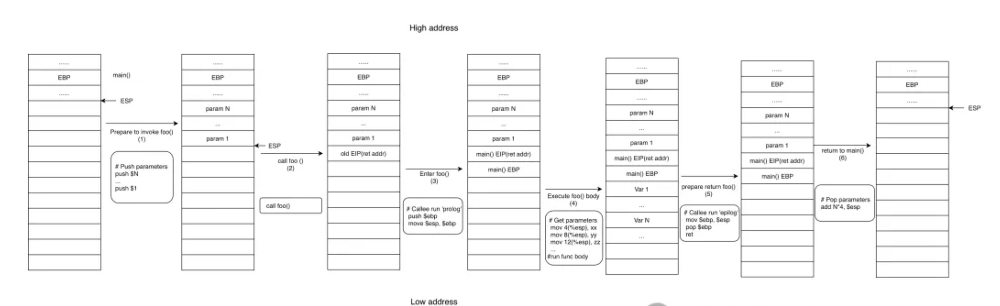
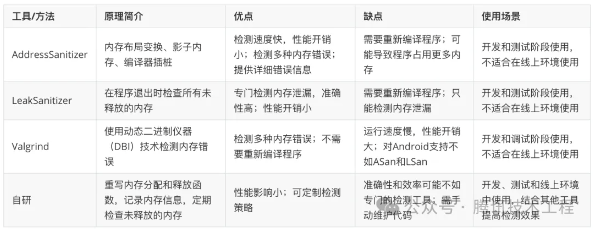

> 本文将分三个部分阐述如何实现 Android Native 内存泄漏监控，包括代理实现的三种方案（Inline Hook、PLT/GOT Hook、LD_PRELOAD）及其优缺点，以及如何检测Native内存泄露和获取Android Native堆栈的方法。本文将提供一套比较全面的解决思路，帮助大家更好地检测 Android Native 内存泄漏问题。

作者：yeconglu

一个完整的 Android Native 内存泄漏检测工具主要包含三部分：代理实现、堆栈回溯和缓存管理。代理实现是解决 Android 平台上接入问题的关键部分，堆栈回溯则是性能和稳定性的核心要素。

本文会从三个方面介绍如何实现 Native 内存泄漏监控:

- 介绍代理实现的三个方案 Inline Hook、PLT/GOT Hook、LD_PRELOAD 的实现方式和优缺点。

- 介绍检测 Android Native 内存泄露的基本思路和包含缓存逻辑的示例代码。

- 介绍获取 Android Native 堆栈的方法，用于记录分配内存时的调用栈。

  

### **一、代理内存管理函数实现**

首先我们来介绍一下代理内存管理函数实现的三个方案 ：

- Inline Hook
- PLT/GOT Hook
- LD_PRELOAD

#### **1.1 Native Hook**

##### **1.1.1 方案对比：Inline Hook和PLT/GOT Hook**

目前主要有两种Native Hook方案：Inline Hook和PLT/GOT Hook。


> 指令重定位是指在计算机程序的链接和装载过程中，对程序中的相对地址进行调整，使其指向正确的内存位置。这是因为程序在编译时，无法预知在运行时会被装载到内存的哪个位置，所以编译后的程序中，往往使用相对地址来表示内存位置。然而在实际运行时，程序可能被装载到内存的任何位置，因此需要在装载过程中，根据程序实际被装载到的内存地址，对程序中的所有相对地址进行调整，这个过程就叫做重定位。

在进行Inline Hook时，如果直接修改目标函数的机器码，可能会改变原有的跳转指令的相对地址，从而使程序跳转到错误的位置，因此需要进行指令重定位，确保修改后的指令能正确地跳转到预期的位置。

##### **1.1.2 案例：在Android应用中Hook `malloc` 函数**

为了更好地理解Native Hook的应用场景，我们来看一个实际的案例：在Android应用中Hook `malloc` 函数，以监控文件的打开操作。

###### **1.1.2.1 Inline Hook实现**

```cpp
#include <stdio.h>
#include <dlfcn.h>
#include <unistd.h>
#include <string.h>
#include <sys/mman.h>
#include <android/log.h>

#define TAG "NativeHook"
#define LOGD(...) __android_log_print(ANDROID_LOG_DEBUG, TAG, __VA_ARGS__)

typedef void* (*orig_malloc_func_type)(size_t size);

orig_malloc_func_type orig_malloc;

unsigned char backup[8];  // 用于保存原来的机器码

void* my_malloc(size_t size) {
    LOGD("内存分配: %zu 字节", size);

    // 创建一个新的函数指针orig_malloc_with_backup，指向一个新的内存区域
    void *orig_malloc_with_backup = mmap(NULL, sizeof(backup) + 8, PROT_READ | PROT_WRITE | PROT_EXEC, MAP_ANONYMOUS | MAP_PRIVATE, -1, 0);
    
    // 将备份的指令A和B复制到新的内存区域
    memcpy(orig_malloc_with_backup, backup, sizeof(backup));

    // 在新的内存区域的末尾添加一个跳转指令，使得执行流跳转回原始malloc函数的剩余部分
    unsigned char *jump = (unsigned char *)orig_malloc_with_backup + sizeof(backup);
    jump[0] = 0x01;  // 跳转指令的机器码
    *(void **)(jump + 1) = (unsigned char *)orig_malloc + sizeof(backup);  // 跳转目标的地址

    // 调用orig_malloc_with_backup函数指针
    orig_malloc_func_type orig_malloc_with_backup_func_ptr = (orig_malloc_func_type)orig_malloc_with_backup;
    void *result = orig_malloc_with_backup_func_ptr(size);

    // 释放分配的内存区域
    munmap(orig_malloc_with_backup, sizeof(backup) + 8);

    return result;
}

void *get_function_address(const char *func_name) {
    void *handle = dlopen("libc.so", RTLD_NOW);
    if (!handle) {
        LOGD("错误: %s", dlerror());
        return NULL;
    }

    void *func_addr = dlsym(handle, func_name);
    dlclose(handle);

    return func_addr;
}

void inline_hook() {
    void *orig_func_addr = get_function_address("malloc");
    if (orig_func_addr == NULL) {
        LOGD("错误: 无法找到 'malloc' 函数的地址");
        return;
    }

    // 备份原始函数
    orig_malloc = (orig_malloc_func_type)orig_func_addr;

    // 备份原始机器码
    memcpy(backup, orig_func_addr, sizeof(backup));

    // 更改页面保护
    size_t page_size = sysconf(_SC_PAGESIZE);
    uintptr_t page_start = (uintptr_t)orig_func_addr & (~(page_size - 1));
    mprotect((void *)page_start, page_size, PROT_READ | PROT_WRITE | PROT_EXEC);

    // 构造跳转指令
    unsigned char jump[8] = {0};
    jump[0] = 0x01;  // 跳转指令的机器码
    *(void **)(jump + 1) = my_malloc;  // 我们的钩子函数的地址

    // 将跳转指令写入目标函数的入口点
    memcpy(orig_func_addr, jump, sizeof(jump));
}

void unhook() {
    void *orig_func_addr = get_function_address("malloc");
    if (orig_func_addr == NULL) {
        LOGD("错误: 无法找到 'malloc' 函数的地址");
        return;
    }

    // 更改页面保护
    size_t page_size = sysconf(_SC_PAGESIZE);
    uintptr_t page_start = (uintptr_t)orig_func_addr & (~(page_size - 1));
    mprotect((void *)page_start, page_size, PROT_READ | PROT_WRITE | PROT_EXEC);

    // 将备份的机器码写入目标函数的入口点
    memcpy(orig_func_addr, backup, sizeof(backup));
}
```

在`my_malloc`中，我们需要先执行备份的指令，然后将执行流跳转回原始`malloc`函数的剩余部分：

1. 在`my_malloc`函数中，创建一个新的函数指针`orig_malloc_with_backup`，它指向一个新的内存区域，该区域包含备份的指令以及一个跳转指令。
2. 将备份的指令复制到新的内存区域。
3. 在新的内存区域的末尾添加一个跳转指令，使得执行流跳转回原始`malloc`函数的剩余部分。
4. 在`my_malloc`中，调用`orig_malloc_with_backup`函数指针。

这里有三个难点，下面详细解释一下。

\####### 1.1.2.1.1 如何修改内存页的保护属性

`orig_func_addr & (~(page_size - 1))` 这段代码的作用是获取包含 `orig_func_addr` 地址的内存页的起始地址。这里使用了一个技巧：`page_size` 总是2的幂，因此 `page_size - 1` 的二进制表示形式是低位全为1，高位全为0，取反后低位全为0，高位全为1。将 `orig_func_addr` 与 `~(page_size - 1)` 进行与操作，可以将 `orig_func_addr` 的低位清零，从而得到内存页的起始地址。

`mprotect((void *)page_start, page_size, PROT_READ | PROT_WRITE | PROT_EXEC);` 这行代码的作用是修改内存页的保护属性。`mprotect` 函数可以设置一块内存区域的保护属性，它接受三个参数：需要修改的内存区域的起始地址，内存区域的大小，以及新的保护属性。在这里，我们将包含 `orig_func_addr` 地址的内存页的保护属性设置为可读、可写、可执行（`PROT_READ | PROT_WRITE | PROT_EXEC`），以便我们可以修改这个内存页中的代码。

\####### 1.1.2.1.2 如何恢复原函数

**想要恢复原来的函数，我们需要在Hook之前保存原来的机器码，然后在需要恢复时，将保存的机器码写回函数的入口点。**

代码中的`backup`数组用于保存原始机器码。在`inline_hook`函数中，我们在修改机器码之前先将原始机器码复制到`backup`数组。然后，我们提供了一个`unhook`函数，用于恢复原始机器码。在需要恢复`malloc`函数时，可以调用`unhook`函数。

需要注意的是，这个示例假设函数的入口点的机器码长度是8字节。在实际使用时，你需要根据实际情况确定机器码的长度，并相应地调整`backup`数组的大小和`memcpy`函数的参数。

\####### 1.1.2.1.3 如何实现指令重定位

我们以一个简单的ARM64汇编代码为例，演示如何进行指令重定位。假设我们有以下目标函数：

```cpp
TargetFunction:
    mov x29, sp
    sub sp, sp, #0x10
    ; ... 其他指令 ...
    bl SomeFunction
    ; ... 其他指令 ...
    b TargetFunctionEnd
```

我们要在`TargetFunction`的开头插入一个跳转指令，将执行流跳转到我们的`HookFunction`。为了实现这一目标，我们需要进行以下操作：

1. **备份被覆盖的指令**：我们需要备份`TargetFunction`开头的指令，因为它们将被我们的跳转指令覆盖。在这个例子中，我们需要备份`mov x29, sp`和`sub sp, sp, #0x10`两条指令。

2. **插入跳转指令**：在`TargetFunction`的开头插入一个跳转到`HookFunction`的跳转指令。在ARM64汇编中，我们可以使用`b`指令实现这一目标：

   ```
   b HookFunction
   ```

3. **处理被覆盖的指令**：在`HookFunction`中，我们需要执行被覆盖的指令。在这个例子中，我们需要在`HookFunction`中执行`mov x29, sp`和`sub sp, sp, #0x10`两条指令。

4. **重定位跳转和数据引用**：在`HookFunction`中，我们需要处理目标函数中的跳转和数据引用。在这个例子中，我们需要重定位`bl SomeFunction`和`b TargetFunctionEnd`两条跳转指令。根据目标函数在内存中的新地址，我们需要计算新的跳转地址，并修改这两条指令的操作数。

5. **返回到目标函数**：在`HookFunction`中执行完被覆盖的指令和其他自定义操作后，我们需要返回到目标函数的未被修改部分。在这个例子中，我们需要在`HookFunction`的末尾添加一个跳转指令，将执行流跳转回`TargetFunction`的`sub sp, sp, #0x10`指令。

经过以上步骤，我们成功地在`TargetFunction`中插入了一个跳转到`HookFunction`的跳转指令，并对目标函数中的跳转和数据引用进行了重定位。这样，当执行到`TargetFunction`时，程序将跳转到`HookFunction`执行，并在执行完被覆盖的指令和其他自定义操作后，返回到目标函数的未被修改部分。

###### **1.1.2.2 PLT/GOT Hook实现**

> PLT（Procedure Linkage Table）和GOT（Global Offset Table）是Linux下动态链接库（shared libraries）中用于解析动态符号的两个重要表。
>
> PLT（Procedure Linkage Table）：过程链接表，用于存储动态链接库中函数的入口地址。当程序调用一个动态链接库中的函数时，首先会跳转到PLT中的对应条目，然后再通过GOT找到实际的函数地址并执行。
>
> GOT（Global Offset Table）：全局偏移表，用于存储动态链接库中函数和变量的实际地址。在程序运行时，动态链接器（dynamic linker）会根据需要将函数和变量的实际地址填充到GOT中。PLT中的条目会通过GOT来找到函数和变量的实际地址。

在PLT/GOT Hook中，我们可以修改GOT中的函数地址，使得程序在调用某个函数时实际上调用我们自定义的函数。这样，我们可以在自定义的函数中添加额外的逻辑（如检测内存泄漏），然后再调用原始的函数。这种方法可以实现对程序的无侵入式修改，而不需要重新编译程序。

```cpp
#include <stdio.h>
#include <dlfcn.h>
#include <unistd.h>
#include <android/log.h>

#define TAG "NativeHook"
#define LOGD(...) __android_log_print(ANDROID_LOG_DEBUG, TAG, __VA_ARGS__)

typedef void* (*orig_malloc_func_type)(size_t size);

orig_malloc_func_type orig_malloc;

void* my_malloc(size_t size) {
    LOGD("Memory allocated: %zu bytes", size);
    return orig_malloc(size);
}

void plt_got_hook() {
    void **got_func_addr = (void **)dlsym(RTLD_DEFAULT, "malloc");
    if (got_func_addr == NULL) {
        LOGD("Error: Cannot find the GOT entry of 'malloc' function");
        return;
    }

    // Backup the original function
    orig_malloc = (orig_malloc_func_type)*got_func_addr;

    // Replace the GOT entry with the address of our hook function
    *got_func_addr = my_malloc;
}
```

上面代码中的`RTLD_DEFAULT`是一个特殊的句柄值，表示在当前进程已加载的所有动态链接库中查找符号。当使用`RTLD_DEFAULT`作为`dlsym()`的`handle`参数时，`dlsym()`会在当前进程已加载的所有动态链接库中查找指定的符号，而不仅仅是某个特定的动态链接库。

###### **1.1.2.3 再看 Inline Hook 和 Got Hook 的区别**

关键在于，两种 Native Hook 方式的实现中，dlsym返回的地址含义是不一样的：

- Inline Hook

```cpp
void *get_function_address(const char *func_name) {
    void *handle = dlopen("libc.so", RTLD_NOW);
    ...
    void *func_addr = dlsym(handle, func_name);
    dlclose(handle);

    return func_addr;
}

void *orig_func_addr = get_function_address("malloc");
memcpy(orig_func_addr, jump, sizeof(jump));
```

dlsym 返回的地址是函数在内存中的实际地址，这个地址通常指向函数的入口点（即函数的第一条指令）。

- Got Hook

```cpp
void **got_func_addr = (void **)dlsym(RTLD_DEFAULT, "malloc");
*got_func_addr = my_malloc;
```

dlsym 返回的是 malloc 函数在 GOT 中的地址，注意`void **got_func_addr`是双重指针。

#### **1.2 使用`LD_PRELOAD`**

使用`LD_PRELOAD`的方式，可以在不修改源代码的情况下重载内存管理函数。虽然这种方式在Android平台上有很多限制，但是我们也可以了解下相关的原理。

`LD_PRELOAD` 是一个环境变量，用于在程序运行时预加载动态链接库。通过设置 `LD_PRELOAD`，我们可以在程序运行时强制加载指定的库，从而在不修改源代码的情况下改变程序的行为。这种方法通常用于调试、性能分析和内存泄漏检测等场景。

使用 `LD_PRELOAD` 检测内存泄漏的原理和方法如下：

1. **原理**：当设置了 `LD_PRELOAD` 环境变量时，程序会在加载其他库之前加载指定的库。这使得我们可以在自定义库中重载（override）一些原始库（如 glibc）中的函数。在内存泄漏检测的场景中，我们可以重载内存分配和释放函数（如 `malloc`、`calloc`、`realloc` 和 `free`），以便在分配和释放内存时记录相关信息。

2. **方法**：

   a. **创建自定义库**：首先，我们需要创建一个自定义内存泄露检测库，并在其中重载内存分配和释放函数。在这些重载的函数中，我们可以调用原始的内存管理函数，并在分配内存时将内存块及其相关信息（如分配大小、调用栈等）添加到全局内存分配表中，在释放内存时从全局内存分配表中删除相应的内存块。

   b. **设置 `LD_PRELOAD` 环境变量**：在运行程序之前，我们需要设置 `LD_PRELOAD` 环境变量，使其指向自定义库的路径。这样，程序在运行时会优先加载自定义库，从而使用重载的内存管理函数。

   c. **运行程序**：运行程序时，它将使用重载的内存管理函数，从而记录内存分配和释放的信息。我们可以在程序运行过程中或运行结束后，检查全局内存分配表中仍然存在的内存块，从而检测内存泄漏。

通过使用 `LD_PRELOAD` 检测内存泄漏，我们可以在不修改程序源代码的情况下，动态地改变程序的行为，记录内存分配和释放的信息，从而检测到内存泄漏并找出内存泄漏的来源。

#### **1.3 小结**

最后我们以一个表格总结一下本节的三种代理实现方式的优缺点：


### **二、检测Natie内存泄露**

本节我们将基于PLT/GOT Hook的代理实现方案，介绍检测Native层内存泄漏的整体思路。

#### **2.1 原理介绍**

在Android中，要检测Native层的内存泄漏，可以重写`malloc`、`calloc`、`realloc`和`free`等内存分配和释放函数，以便在每次分配和释放内存时记录相关信息。例如，我们可以创建一个全局的内存分配表，用于存储所有分配的内存块及其元数据（如分配大小、分配位置等）。然后，在释放内存时，从内存分配表中删除相应的条目。定期检查内存分配表，找出没有被释放的内存。

#### **2.2 代码示例**

下面代码的主要技术原理是重写内存管理函数，并使用弱符号引用原始的内存管理函数，以便在每次分配和释放内存时记录相关信息，并能够在程序运行时动态地查找和调用这些函数。

以下是代码示例：

```cpp
#include <cstdlib>
#include <cstdio>
#include <map>
#include <mutex>
#include <dlfcn.h>
#include <execinfo.h>
#include <vector>
#include <android/log.h>  

#define TAG "CheckMemoryLeaks" 
#define LOGD(...) __android_log_print(ANDROID_LOG_DEBUG, TAG, __VA_ARGS__)

// 全局内存分配表，存储分配的内存块及其元数据（如分配大小、调用栈等）
std::map<void*, std::pair<size_t, std::vector<void*>>> g_memoryAllocations;
std::mutex g_memoryAllocationsMutex;

// 定义弱符号引用原始的内存管理函数
extern "C" void* __libc_malloc(size_t size) __attribute__((weak));
extern "C" void  __libc_free(void* ptr) __attribute__((weak));
extern "C" void* __libc_realloc(void *ptr, size_t size) __attribute__((weak));
extern "C" void* __libc_calloc(size_t nmemb, size_t size) __attribute__((weak));

void* (*lt_malloc)(size_t size);
void  (*lt_free)(void* ptr);
void* (*lt_realloc)(void *ptr, size_t size);
void* (*lt_calloc)(size_t nmemb, size_t size);

#define LT_MALLOC  (*lt_malloc)
#define LT_FREE    (*lt_free)
#define LT_REALLOC (*lt_realloc)
#define LT_CALLOC  (*lt_calloc)

// 在分配内存时记录调用栈
std::vector<void*> record_call_stack() {
  //  ...
}

// 初始化原始内存管理函数，如果弱符号未定义，则使用 dlsym 获取函数地址
void init_original_functions() {
  if (!lt_malloc) {
    if (__libc_malloc) {
      lt_malloc = __libc_malloc;
    } else {
      lt_malloc = (void*(*)(size_t))dlsym(RTLD_NEXT, "malloc");
    }
  }
  //calloc realloc free 的实现也类似
  ...
}

// 重写 malloc 函数
extern "C" void* malloc(size_t size) {
  // 初始化原始内存管理函数
  init_original_functions();

  // 调用原始的 malloc 函数
  void* ptr = LT_MALLOC(size);

  // 记录调用栈
  std::vector<void*> call_stack = record_call_stack();

  // 在全局内存分配表中添加新分配的内存块及其元数据
  std::unique_lock<std::mutex> lock(g_memoryAllocationsMutex);
  g_memoryAllocations[ptr] = std::make_pair(size, call_stack);

  return ptr;
}

// 重写 calloc 函数
extern "C" void* calloc(size_t nmemb, size_t size) {
  // 跟 malloc 实现类似
  // ...
}

// 重写 realloc 函数
extern "C" void* realloc(void* ptr, size_t size) {
  // 初始化原始内存管理函数
  init_original_functions();

  // 调用原始的 realloc 函数
  void* newPtr = LT_REALLOC(ptr, size);

  // 记录调用栈
  std::vector<void*> call_stack = record_call_stack();
  
  // 更新全局内存分配表中的内存块及其元数据
  std::unique_lock<std::mutex> lock(g_memoryAllocationsMutex);
  g_memoryAllocations.erase(ptr);
  g_memoryAllocations[newPtr] = std::make_pair(size, call_stack);

  return newPtr;
}

// 重写 free 函数
extern "C" void free(void* ptr) {
  // 初始化原始内存管理函数
  init_original_functions();

  // 从全局内存分配表中删除释放的内存块
  std::unique_lock<std::mutex> lock(g_memoryAllocationsMutex);
  g_memoryAllocations.erase(ptr);

  // 调用原始的 free 函数
  LT_FREE(ptr);
}

// 定义一个函数用于检查内存泄漏
void check_memory_leaks() {
  // 使用互斥锁保护对全局内存分配表的访问，防止在多线程环境下发生数据竞争
  std::unique_lock<std::mutex> lock(g_memoryAllocationsMutex);

  // 如果全局内存分配表为空，说明没有检测到内存泄漏
  if (g_memoryAllocations.empty()) {
    LOGD("No memory leaks detected.");
  } else {
    // 如果全局内存分配表不为空，说明检测到了内存泄漏
    LOGD("Memory leaks detected:");
    // 遍历全局内存分配表，打印出所有未被释放的内存块的地址和大小
    for (const auto& entry : g_memoryAllocations) {
      LOGD("  Address: %p, Size: %zu bytes\n", entry.first, entry.second.first);
      LOGD("  Call stack:");
      for (void* frame : entry.second.second) {
        LOGD("    %p\n", frame);
      }
    }
  }
}

int main() {
  // 初始化原始内存管理函数
  init_original_functions();
  
  // 示例代码
  void* ptr1 = malloc(10);
  void* ptr2 = calloc(10, sizeof(int));
  void* ptr3 = malloc(20);
  ptr3 = realloc(ptr3, 30);
  free(ptr1);
  free(ptr2);
  free(ptr3);

  // 检查内存泄漏
  check_memory_leaks();

  return 0;
}
```

上面代码的核心逻辑包括：

1. **重写内存管理函数**：重写`malloc`、`calloc`、`realloc`和`free`，在分配内存时将内存块及其信息添加到全局内存分配表，释放内存时从表中删除相应内存块。
2. **弱符号引用原始内存管理函数**：使用`__attribute__((weak))`定义四个弱符号引用glibc/eglibc中的内存管理函数。在`init_original_functions`函数中检查弱符号定义，若未定义则使用`dlsym`函数查找原始内存管理函数。
3. **全局内存分配表**：定义全局内存分配表存储所有分配的内存块及其信息。表是一个map，键是内存块地址，值是一个pair，包含内存块大小和调用栈。
4. **调用栈记录**：分配内存时记录当前调用栈，有助于检测内存泄漏时找出泄漏来源。
5. **内存泄漏检测**：定义`check_memory_leaks`函数检查全局内存分配表中仍存在的内存块，表示存在内存泄漏。

##### **2.2.1 使用弱符号：防止对`dlsym`函数的调用导致无限递归**

`dlsym`函数用于查找动态链接库中的符号。但是在glibc和eglibc中，`dlsym`函数内部可能会调用`calloc`函数。如果我们正在重定义`calloc`函数，并且在`calloc`函数中调用`dlsym`函数来获取原始的`calloc`函数，那么就会产生无限递归。

`__libc_calloc`等函数被声明为弱符号，这是为了避免与glibc或eglibc中对这些函数的强符号定义产生冲突。然后在`init_original_functions`函数中，我们检查了`__libc_calloc`等函数是否为`nullptr`。如果是，那么说明glibc或eglibc没有定义这些函数，那就使用`dlsym`函数获取这些函数的地址。如果不是，那么说明glibc或eglibc已经定义了这些函数，那就直接使用那些定义。

##### **2.2.2 关于RTLD_NEXT的解释**

`RTLD_NEXT`是一个特殊的“伪句柄”，用于在动态链接库函数中查找下一个符号。它常常与`dlsym`函数一起使用，用于查找和调用原始的（被覆盖或者被截获的）函数。

在Linux系统中，如果一个程序链接了多个动态链接库，而这些库中有多个定义了同名的函数，那么在默认情况下，程序会使用第一个找到的函数。但有时候，我们可能需要在一个库中覆盖另一个库中的函数，同时又需要调用原始的函数。这时候就可以使用`RTLD_NEXT`。

`dlsym(RTLD_NEXT, "malloc")`会查找下一个名为"malloc"的符号，即原始的`malloc`函数。然后我们就可以在自定义的`malloc`函数中调用原始的`malloc`函数了。

##### **2.2.3 注意事项**

检测内存泄漏可能会增加程序的运行时开销，并可能导致一些与线程安全相关的问题。在使用这种方法时，我们需要确保代码是线程安全的，并在不影响程序性能的情况下进行内存泄漏检测。同时，手动检测内存泄漏可能无法发现所有的内存泄漏，因此建议大家还要使用其他工具（如AddressSanitizer、LeakSanitizer或Valgrind）来辅助检测内存泄漏。


### **三、获取Android Native堆栈**

大家可能也注意到了，在第二部分的Native内存泄露检测实现中，`record_call_stack`的实现省略了。所以我们还遗留了一个问题：应该如何记录分配内存时的调用栈呢？最后一节我们就来阐述获取Android Native堆栈的方法。

#### **3.1 使用`unwind`函数**

##### **3.1.1 工具和方法**

对于Android系统，不能直接使用`backtrace_symbols`函数，因为它在Android Bionic libc中没有实现。但是，我们可以使用`dladdr`函数替代`backtrace_symbols`来获取符号信息。

Android NDK提供了`unwind.h`头文件，其中定义了`unwind`函数，可以用于获取任意线程的堆栈信息。

##### **3.1.2 获取当前线程的堆栈信息**

如果我们需要获取当前线程的堆栈信息，可以使用Android NDK中的`unwind`函数。以下是使用`unwind`函数获取堆栈信息的示例代码：

```cpp
#include <unwind.h>
#include <dlfcn.h>
#include <stdio.h>

// 定义一个结构体，用于存储回溯状态
struct BacktraceState {
    void** current;
    void** end;
};

// 回溯回调函数，用于处理每一帧的信息
_Unwind_Reason_Code unwind_callback(struct _Unwind_Context* context, void* arg) {
    BacktraceState* state = static_cast<BacktraceState*>(arg);
    uintptr_t pc = _Unwind_GetIP(context);
    if (pc) {
        if (state->current == state->end) {
            return _URC_END_OF_STACK;
        } else {
            *state->current++ = reinterpret_cast<void*>(pc);
        }
    }
    return _URC_NO_REASON;
}

// 捕获回溯信息，将其存储到buffer中
void capture_backtrace(void** buffer, int max) {
    BacktraceState state = {buffer, buffer + max};
    _Unwind_Backtrace(unwind_callback, &state);
}

// 打印回溯信息
void print_backtrace(void** buffer, int count) {
    for (int idx = 0; idx < count; ++idx) {
        const void* addr = buffer[idx];
        const char* symbol = "";

        Dl_info info;
        if (dladdr(addr, &info) && info.dli_sname) {
            symbol = info.dli_sname;
        }

        // 计算相对地址
        void* relative_addr = reinterpret_cast<void*>(reinterpret_cast<uintptr_t>(addr) - reinterpret_cast<uintptr_t>(info.dli_fbase));

        printf("%-3d %p %s (relative addr: %p)\n", idx, addr, symbol, relative_addr);
    }
}

// 主函数
int main() {
    const int max_frames = 128;
    void* buffer[max_frames];

    // 捕获回溯信息
    capture_backtrace(buffer, max_frames);
    // 打印回溯信息
    print_backtrace(buffer, max_frames);

    return 0;
}
```

在上述代码中，`capture_backtrace`函数使用`_Unwind_Backtrace`函数获取堆栈信息，然后我们使用`dladdr`函数获取到函数所在的SO库的基地址（`info.dli_fbase`），然后计算出函数的相对地址（`relative_addr`）。然后在打印堆栈信息时，同时打印出函数的相对地址。

##### **3.1.3 libunwind的相关接口**

###### **3.1.3.1 _Unwind_Backtrace**

`_Unwind_Backtrace`是libunwind库的函数，用于获取当前线程调用堆栈。它遍历栈帧并在每个栈帧上调用用户定义的回调函数，以获取栈帧信息（如函数地址、参数等）。函数原型如下：

```
_Unwind_Reason_Code _Unwind_Backtrace(_Unwind_Trace_Fn trace, void *trace_argument);
```

参数：

1. `trace`：回调函数，会在每个堆栈帧上被调用。回调函数需返回`_Unwind_Reason_Code`类型值，表示执行结果。
2. `trace_argument`：用户自定义参数，传递给回调函数。通常用于存储堆栈信息或其他用户数据。

###### **3.1.3.2 _Unwind_GetIP**

`_Unwind_GetIP`是libunwind库的函数，用于获取当前栈帧的指令指针（即当前函数的返回地址）。它依赖底层硬件架构（如ARM、x86等）和操作系统实现。函数原型如下：

```
uintptr_t _Unwind_GetIP(struct _Unwind_Context *context);
```

参数：

- `context`：当前栈帧的上下文信息。在`_Unwind_Backtrace`函数中创建并在每个栈帧上传递给回调函数。

`_Unwind_GetIP`返回无符号整数，表示当前函数的返回地址。可用此地址获取函数的符号信息，如函数名、源文件名和行号等。

###### **3.1.3.3 在不同Android版本中的可用性**

`_Unwind_Backtrace`和`_Unwind_GetIP`函数在libunwind库中定义，该库是GNU C Library（glibc）的一部分。但Android系统使用轻量级的C库Bionic libc，而非glibc。因此，这两个函数在Android系统中的可用性取决于Bionic libc和Android系统版本。

在早期Android版本（如Android 4.x），Bionic libc未完全实现libunwind库功能，导致`_Unwind_Backtrace`和`_Unwind_GetIP`函数可能无法正常工作。这时，需使用其他方法获取堆栈信息，如手动遍历栈帧或使用第三方库。

从Android 5.0（Lollipop）起，Bionic libc提供更完整的libunwind库支持，包括`_Unwind_Backtrace`和`_Unwind_GetIP`函数。因此，在Android 5.0及更高版本中，可直接使用这两个函数获取堆栈信息。

尽管这两个函数在新版Android系统中可用，但它们的行为可能受编译器优化、调试信息等影响。实际使用中，我们需要根据具体情况选择最合适的方法。

#### **3.2 手动遍历栈帧来实现获取堆栈信息**

在Android系统中，`_Unwind_Backtrace`的具体实现依赖于底层硬件架构（例如ARM、x86等）和操作系统。它会使用特定于架构的寄存器和数据结构来遍历栈帧。例如，在ARM64架构上，`_Unwind_Backtrace`会使用Frame Pointer（FP）寄存器和Link Register（LR）寄存器来遍历栈帧。

如果不使用`_Unwind_Backtrace`，我们可以手动遍历栈帧来实现获取堆栈信息。

##### **3.2.1 ARM64架构下的示例代码**

以下是一个基于ARM64架构的示例代码，展示如何使用Frame Pointer（FP）寄存器手动遍历栈帧：

```cpp
#include <stdio.h>
#include <dlfcn.h>

void print_backtrace_manual() {
    uintptr_t fp = 0;
    uintptr_t lr = 0;

    // 获取当前的FP和LR寄存器值
    asm("mov %0, x29" : "=r"(fp));
    asm("mov %0, x30" : "=r"(lr));

    while (fp) {
        // 计算上一个栈帧的FP和LR寄存器值
        uintptr_t prev_fp = *(uintptr_t*)(fp);
        uintptr_t prev_lr = *(uintptr_t*)(fp + 8);

        // 获取函数地址对应的符号信息
        Dl_info info;
        if (dladdr(reinterpret_cast<void*>(lr), &info) && info.dli_sname) {
            printf("%p %s\n", reinterpret_cast<void*>(lr), info.dli_sname);
        } else {
            printf("%p\n", reinterpret_cast<void*>(lr));
        }

        // 更新FP和LR寄存器值
        fp = prev_fp;
        lr = prev_lr;
    }
}
```

在上述代码中，我们首先获取当前的FP（x29）和LR（x30）寄存器值。然后，通过遍历FP链，获取每个栈帧的返回地址（存储在LR寄存器中）。最后，使用`dladdr`函数获取函数地址对应的符号信息，并打印堆栈信息。

在这段代码中，`*(uintptr_t*)(fp)`表示的是取fp所指向的内存地址处的值。fp是一个无符号整数，表示的是一个内存地址，`(uintptr_t*)(fp)`将fp转换成一个指针，然后`*`操作符取该指针所指向的值。

在ARM64架构中，函数调用时会创建一个新的栈帧。每个栈帧中包含了函数的局部变量、参数、返回地址以及其他与函数调用相关的信息。其中，Frame Pointer（FP，帧指针）寄存器（x29）保存了上一个栈帧的FP寄存器值，Link Register（LR）寄存器（x30）保存了函数的返回地址。

在这段代码中，`fp`变量保存了当前栈帧的FP寄存器值，也就是上一个栈帧的帧基址。因此，`*(uintptr_t*)(fp)`取的就是上一个栈帧的FP寄存器值，即上上个栈帧的帧基址。这个值在遍历栈帧时用来更新`fp`变量，以便在下一次循环中处理上一个栈帧。

##### **3.2.2 ARM架构下的示例代码**

在ARM架构下，我们可以使用Frame Pointer（FP）寄存器（R11）和Link Register（LR）寄存器（R14）来手动遍历栈帧。以下是一个基于ARM架构的示例代码，展示如何手动遍历栈帧以获取堆栈信息：

```cpp
#include <stdio.h>
#include <dlfcn.h>

void print_backtrace_manual_arm() {
    uintptr_t fp = 0;
    uintptr_t lr = 0;

    // 获取当前的FP和LR寄存器值
    asm("mov %0, r11" : "=r"(fp));
    asm("mov %0, r14" : "=r"(lr));

    while (fp) {
        // 计算上一个栈帧的FP和LR寄存器值
        uintptr_t prev_fp = *(uintptr_t*)(fp);
        uintptr_t prev_lr = *(uintptr_t*)(fp + 4);

        // 获取函数地址对应的符号信息
        Dl_info info;
        if (dladdr(reinterpret_cast<void*>(lr), &info) && info.dli_sname) {
            printf("%p %s\n", reinterpret_cast<void*>(lr), info.dli_sname);
        } else {
            printf("%p\n", reinterpret_cast<void*>(lr));
        }

        // 更新FP和LR寄存器值
        fp = prev_fp;
        lr = prev_lr;
    }
}
```

在这个示例代码中，我们首先获取当前的FP（R11）和LR（R14）寄存器值。然后，通过遍历FP链，获取每个栈帧的返回地址（存储在LR寄存器中）。最后，使用`dladdr`函数获取函数地址对应的符号信息，并打印堆栈信息。

通过以上示例代码，我们可以看到，在不同架构上手动遍历栈帧以获取堆栈信息的方法大致相同，只是寄存器和数据结构有所不同。这种方法提供了一种在不使用`_Unwind_Backtrace`的情况下获取堆栈信息的方式，有助于我们更好地理解和调试程序。

##### **3.2.3 寄存器**

在函数调用过程中，fp（Frame Pointer，帧指针）、lr（Link Register，链接寄存器）和sp（Stack Pointer，栈指针）是三个关键寄存器，它们之间的关系如下：

1. fp（Frame Pointer）：帧指针寄存器用于指向当前栈帧的帧基址。在函数调用过程中，每个函数都会有一个栈帧，用于存储函数的局部变量、参数、返回地址等信息。fp寄存器有助于定位和访问这些信息。在不同的架构中，fp寄存器可能有不同的名称，例如，在ARM64架构中，fp寄存器对应X29；在ARM架构中，fp寄存器对应R11；在x86_64架构中，fp寄存器对应RBP。
2. lr（Link Register）：链接寄存器用于保存函数的返回地址。当一个函数被调用时，程序需要知道在函数执行完毕后返回到哪里继续执行。这个返回地址就被保存在lr寄存器中。在不同的架构中，lr寄存器可能有不同的名称，例如，在ARM64架构中，lr寄存器对应X30；在ARM架构中，lr寄存器对应R14；在x86_64架构中，返回地址通常被保存在栈上，而不是专用寄存器中。
3. sp（Stack Pointer）：栈指针寄存器用于指向当前栈帧的栈顶。在函数调用过程中，栈指针会根据需要分配或释放栈空间。在不同的架构中，sp寄存器可能有不同的名称，例如，在ARM64架构中，sp寄存器对应XSP；在ARM架构中，sp寄存器对应R13；在x86_64架构中，sp寄存器对应RSP。

fp、lr和sp三者在函数调用过程中共同协作，以实现正确的函数调用和返回。fp用于定位栈帧中的数据，lr保存函数的返回地址，而sp则负责管理栈空间。在遍历栈帧以获取堆栈信息时，我们需要利用这三个寄存器之间的关系来定位每个栈帧的位置和内容。

##### **3.2.4 栈帧**

栈帧（Stack Frame）是函数调用过程中的一个重要概念。每次函数调用时，都会在栈上创建一个新的栈帧。栈帧包含了函数的局部变量、参数、返回地址以及其他一些与函数调用相关的信息。下图是一个标准的函数调用过程：



> EBP：基址指针寄存器，指向栈帧的底部。在 ARM 下寄存器为 R11。在 ARM64 中寄存器为 X29。ESP：栈指针寄存器，指向栈帧的栈顶 ， 在 ARM 下寄存器为 R13。EIP：指令寄存器，存储的是 CPU 下次要执行的指令的地址，ARM 下为 PC，寄存器为 R15。

每次函数调用都会保存 EBP 和 EIP 用于在返回时恢复函数栈帧。这里所有被保存的 EBP 就像一个链表指针，不断地指向调用函数的 EBP。

在Android系统中，栈帧的基本原理与其他操作系统相同，通过SP和FP所限定的stack frame，就可以得到母函数的SP和FP，从而得到母函数的stack frame（PC，LR，SP，FP会在函数调用的第一时间压栈），以此追溯，即可得到所有函数的调用顺序。

在ARM64和ARM架构中，我们可以使用FP链（帧指针链）来遍历栈帧。具体方法是：从当前FP寄存器开始，沿着FP链向上遍历，直到遇到空指针（NULL）或者无效地址。在遍历过程中，我们可以从每个栈帧中提取返回地址（存储在LR寄存器中）以及其他相关信息。

##### **3.2.5 名字修饰（Name Mangling）**

Native堆栈的符号信息跟代码中定义的函数名字相比，可能会有一些差别，因为GCC生成的符号表有一些修饰规则。

C++支持函数重载，即同一个函数名可以有不同的参数类型和个数。为了在编译时区分这些函数，GCC会对函数名进行修饰，生成独特的符号名称。修饰后的名称包含了函数名、参数类型等信息。例如，对于如下C++函数：

```cpp
namespace test {
  int foo(int a, double b);
}
```

经过GCC修饰后，生成的符号可能类似于：`_ZN4test3fooEid`，其中：

- `_ZN`和`E`是修饰前缀和后缀，用于标识这是一个C++符号。

- `4test`表示命名空间名为`test`，`4`表示命名空间名的长度。

- `3foo`表示函数名为`foo`，`3`表示函数名的长度。

- `id`表示函数的参数类型，`i`代表`int`，`d`代表`double`。

  

### **四、实践建议**

通过前文的详细介绍，我们已经了解了如何实现Android Native内存泄漏监控的三个方面：包括代理实现、检测Native内存泄露和获取Android Native堆栈的方法。最后，我们再来看一下现有的一些内存泄露检测工具对比，并给出一些实践建议。

#### **4.1 Native 内存泄露检测工具对比**

在实际应用中，我们需要根据具体场景选择最合适的方案。下面表格中的前三种工具都是现成的，但是具有一定的局限性，特别是不适合在线上使用。




#### **4.2 实践建议**

在实际项目中，我们可以结合多种内存泄漏检测方案来提高检测效果。以下是一些建议：

1. **编码规范**：在编写代码时，遵循一定的编码规范和最佳实践，例如使用智能指针、避免循环引用等，可以有效地降低内存泄漏的风险。
2. **代码审查**：在开发过程中，定期进行代码审查，检查代码中是否存在潜在的内存泄漏风险。代码审查可以帮助我们及时发现和修复问题，提高代码质量。
3. **自动化测试**：在项目中引入自动化测试，对关键功能进行内存泄漏检测。可以在持续集成环境中使用ASan、LSan等工具来检测内存泄漏，确保新提交的代码不会引入新的内存泄漏问题。
4. **性能监控**：在线上环境中，定期监控应用程序的内存使用情况。如果发现内存使用异常，可以使用手动检测方法或者将问题反馈到开发环境，使用其他工具进行进一步分析和处理。
5. **问题定位**：当发现内存泄漏问题时，根据工具提供的错误信息，快速定位问题发生的位置。结合堆栈信息、相对地址等，可以帮助我们更好地理解问题的原因，从而修复问题。


### **五、总结**

在开发和测试阶段，我们可以使用ASan、LSan和Valgrind等工具来检测内存泄漏。而在线上环境中，由于这些工具的性能开销较大，不适合直接使用。在这种情况下，我们可以采用手动检测的方法，结合代码审查和良好的编程习惯，来尽可能地减少内存泄漏的发生。

然而，这些工具并不能保证检测出所有的内存泄漏。内存泄漏的发现和修复，需要我们对代码有深入的理解，以及良好的编程习惯。只有这样，我们才能有效地防止和解决内存泄漏问题，从而提高我们的应用程序的稳定性和性能。