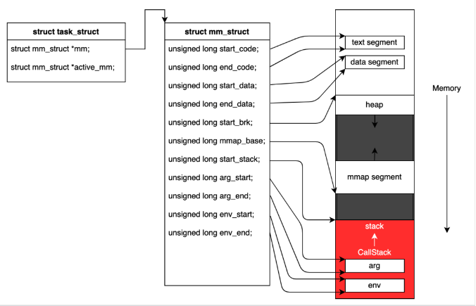
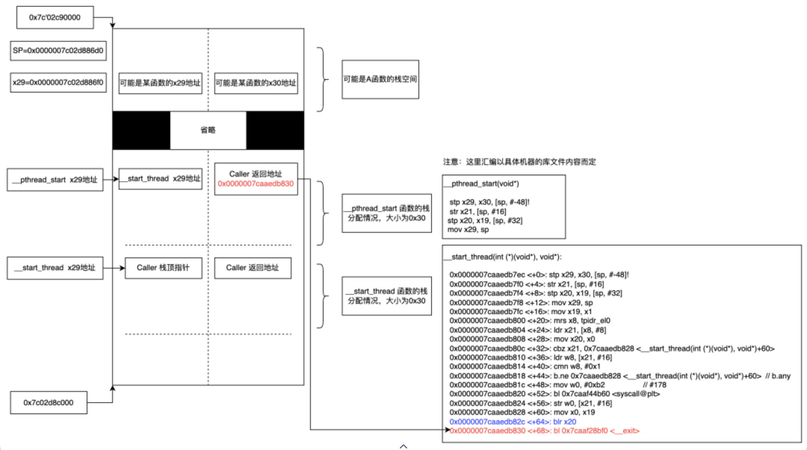

## 常见的Native Crash类型

当native 层发生异常的时候，往往是通过信号的方式发送，给相对应的信号处理器处理


我们可以从signal.h看到，大概已经定义的信号有

```c++
/**
 * #define SIGHUP 1
#define SIGINT 2
#define SIGQUIT 3
#define SIGILL 4
#define SIGTRAP 5
#define SIGABRT 6
#define SIGIOT 6
#define SIGBUS 7
#define SIGFPE 8
#define SIGKILL 9
#define SIGUSR1 10
#define SIGSEGV 11
#define SIGUSR2 12
## define SIGPIPE 13
#define SIGALRM 14
#define SIGTERM 15
#define SIGSTKFLT 16
#define SIGCHLD 17
#define SIGCONT 18
#define SIGSTOP 19
#define SIGTSTP 20
#define SIGTTIN 21
#define SIGTTOU 22
#define SIGURG 23
#define SIGXCPU 24
#define SIGXFSZ 25
#define SIGVTALRM 26
#define SIGPROF 27
#define SIGWINCH 28
#define SIGIO 29
#define SIGPOLL SIGIO
#define SIGPWR 30
#define SIGSYS 31
 */
```


| SIGSEGV      | SEGV_MAPERR                         | 地址不在 /proc/self/maps 映射中              |
| ------------ | ----------------------------------- | -------------------------------------------- |
| SEGV_ACCERR  | 没有访问权限                        |                                              |
| SEGV_MTESERR | MTE特有类型                         |                                              |
| SIGABRT      |                                     | 程序主动退出，常见调用函数abort()，raise()等 |
| SIGILL       | ILL_ILLOPC                          | 非法操作码（opcode）                         |
| ILL_ILLOPN   | 非法操作数（operand）               |                                              |
| ILL_ILLADR   | 非法寻址                            |                                              |
| ILL_ILLTRP   | 非法trap，如_builtintrap()主动崩溃  |                                              |
| ILL_PRVOPC   | 非法特权操作码(privileged opcode)   |                                              |
| ILL_PRVREG   | 非法特权寄存器(privileged register) |                                              |
| ILL_COPROC   | 协处理器错误                        |                                              |
| ILL_BADSTK   | 内部堆栈错误                        |                                              |
| SIGBUS       | BUS_ADRALN                          | 访问地址未对齐                               |
| BUS_ADRERR   | 访问不存在的物理地址                |                                              |
| BUS_OBJERR   | 特定对象的硬件错误                  |                                              |
| SIGFPE       | FPE_INTDIV                          | 整数除以0                                    |
| FPE_INTOVF   | 整数溢出                            |                                              |
| FPE_FLTDIV   | 浮点数除以0                         |                                              |
| FPE_FLTOVF   | 浮点数上溢（overflow）              |                                              |
| FPE_FLTUND   | 浮点数下溢（underflow）             |                                              |
| FPE_FLTRES   | 浮点数结果不精确                    |                                              |
| FPE_FLTINV   | 无效的浮点运算                      |                                              |
| FPE_FLTSUB   | 越界                                |                                              |


## 日志

当程序发生了 Native Crash 错误，Android 的日志会输出到 log crash buffer 上，因此我们通过 

adb logcat -b crash 抓取到相应的错误报告，而日志本身能提供的信息是有限的，仅仅是错误堆栈，与当前线程的寄存器信息。


#### tombstone

当只有日志堆栈不能进行更详细的分析时，我们还需要程序的部分内存信息以及寄存器信息，而Android 的错误机制会相应的会生成一份 tombstone 文件保存到 /data/tombstones/tombstone_xx ，对于没有 Root 权限的机器则可以通过 adb bugreport 抓取出 tombstone 文件。

```
ABI: 'arm64'   【 arm64的程序 】
Timestamp: 2022-06-07 01:53:32.033409857+0800  【 发生错误的时间戳 】
Process uptime: 0s
Cmdline: mediaserver64   【 程序名 】
pid: 1139, tid: 11981, name: NPDecoder  >>> mediaserver64 <<<  【 进程号、线程号 】
uid: 1013
```

#### 错误类型

```
signal 11 (SIGSEGV), code 2 (SEGV_ACCERR), fault addr 0x7c02d886f0
【 错误类型是 SIGSEGV，子类是 SEGV_ACCERR，错误地址0x7c02d886f0 】
SIGSEGV 也是我们最常见的 Native Crash 类型，大部分时候我们称其为段错误，而错误意思是在 PC=0x7c02d886f0 上发生拒绝访问的段错误。
```

#### **寄存器信息**

```

x0  79748c5e568e2ddc  x1  0000007ca13c3618  x2  0000000000000000  x3  0000007ca1291000

x4  0000000001909705  x5  0000000000000000  x6  0000007c02d88808  x7  b60625655bf0252f

x8  0000000000000080  x9  0000007ca126fed7  x10 0000000000000006  x11 0000007bfd0a81fc

x12 9ef8a95ca9649dbe  x13 e44782d5ac38720e  x14 0000007bfd0a8030  x15 0000001e56307b5c

x16 0000007c95dfdb70  x17 0000007c9844f118  x18 0000007bfaa28000  x19 b400007c13c246d0

x20 0000007c02d88730  x21 b400007c13c67c00  x22 0000000000000415  x23 0000007c02d89000

x24 0000000000000002  x25 b400007c13c246d0  x26 b400007c13c67c00  x27 0000007c02d89000

x28 0000007ca13c2c28  x29 0000007c02d886f0

lr  0000007c02d886f0  sp  0000007c02d886d0  pc  0000007c02d886f0  pst 0000000080001000
```

#### **堆栈信息**

```
backtrace:

#00 pc 00000000000f86f0  [anon:stack_and_tls:11981]   【PC刚好落在线程栈地址上】
这种情况很少见，虽然它只有的一条堆栈，并不代表程序是从这里开始运行，出现的这种情况仅仅 unwind 无法正确的回溯。
我们是可以通过栈地址空间内存进行恢复调用栈，用户态主线程栈（红色部分）结构如下：
```



而线程栈位于 mmap segmemt上，我们可以在 /proc/self/maps 上找到该线程栈的地址空间范围。

0000007c'02c90000-0000007c'02d8bfff rw-     0   fc000  [anon:stack_and_tls:11981]

大多数 arm64 的 Linux Android 程序，它的线程调用栈结构样例如下：



```shell
//  bionic/libc/arch-arm64/bionic/__bionic_clone.S#include <private/bionic_asm.h>

// pid_t __bionic_clone(int flags, void* child_stack, pid_t* parent_tid, void* tls, pid_t* child_tid, int (*fn)(void*), void* arg);

ENTRY_PRIVATE(__bionic_clone)
    # Push 'fn' and 'arg' onto the child stack.
    stp     x5, x6, [x1, #-16]!

    # Make the system call.
    mov     x8, __NR_clone
    svc     #0

    # Are we the child?
    cbz     x0, .L_bc_child

    # Set errno if something went wrong.
    cmn     x0, #(MAX_ERRNO + 1)
    cneg    x0, x0, hi
    b.hi    __set_errno_internal

    ret

.L_bc_child:
    # We're in the child now. Set the end of the frame record chain.
    mov     x29, #0
    # Setting x30 to 0 will make the unwinder stop at __start_thread.
    mov     x30, #0
    # Call __start_thread with the 'fn' and 'arg' we stored on the child stack.
    ldp     x0, x1, [sp], #16
    b       __start_thread
END(__bionic_clone)

NOTE_GNU_PROPERTY()
```

#### **内存信息**

tombstone 会记录当前有效地址的寄存器附近内存信息，大小为0x100，这个可以修改文件

system/core/debuggerd/libdebuggerd/utility.cpp 中的宏定义 MEMORY_BYTES_TO_DUMP 参数

像这种一条堆栈的情况下，栈的内存信息配合下边的映射表可以帮助到我们对栈进行恢复。


参考https://mp.weixin.qq.com/s/SYwOnnyvdomXonYNF5CV2w

