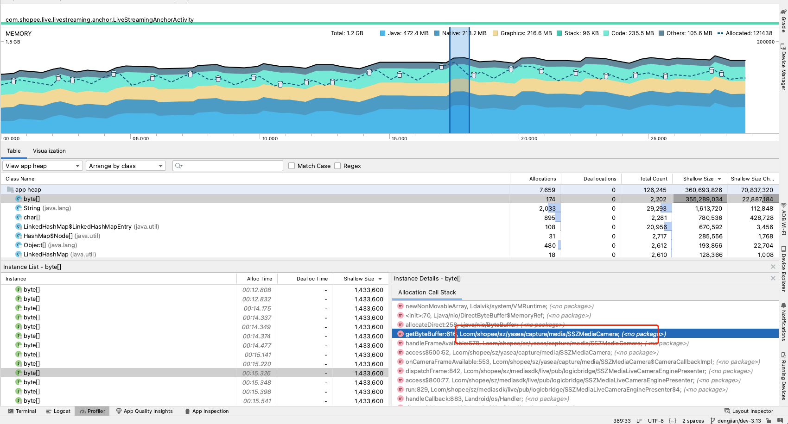

官方使用文档参考：https://developer.android.com/studio/profile/memory-profiler?hl=zh-cn

如果项目有Java内存泄漏，可以跑起Profiler后，选择 **Record Java / Kotlin allocations**，然后选择 **Record**。如果设备搭载的是 Android 8 或更高版本，则内存分析器界面将转换为显示正在进行录制的单独屏幕。可以与录制上方的迷你时间轴进行交互（例如，更改选择范围）。如需完成录制，请选择 **Stop** 图标

选择时间轴的某个区域后（或者使用搭载 Android 7.1 或更低版本的设备完成录制会话后），已分配对象的列表将显示，按类名称进行分组，并按其堆计数排序。如下图所示：

点击上图中的Shallow Size，按这个大小排序，找到最大的分配对象，然后会出现Instance窗口，里面选择后会出现Instance Details窗口，这里看到内存分配的堆栈。