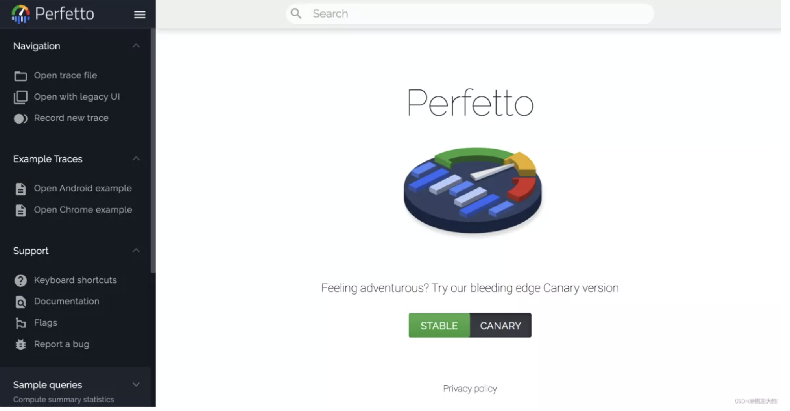
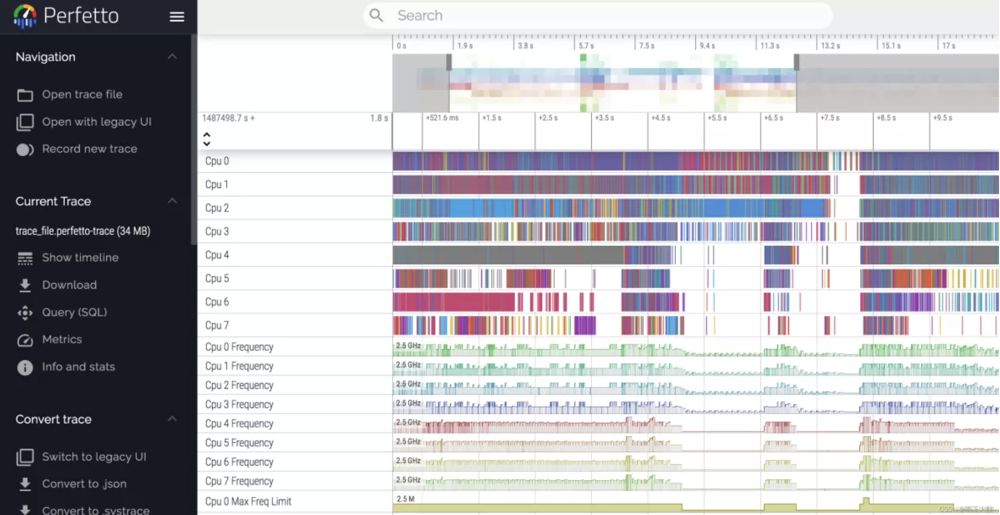

## 理解Perfetto(why+what)

### 1. Perfetto和systrace的关系

Perfetto 是 Android 10 中引入的全新平台级跟踪工具。这是适用于 Android、Linux 和 Chrome 的更加通用和复杂的开源跟踪项目。与 Systrace 不同，它提供数据源超集，可以用 protobuf 编码的二进制流形式记录任意长度的跟踪记录。总而言之，可以将Perfetto理解为sysyrace的升级版，用在更新的平台、新图表展示更多的信息。

同时在android系统中，“系统跟踪”应用是一款用于将设备活动保存到跟踪文件的 Android 工具。在搭载 Android 10（API 级别 29）或更高版本的设备上，跟踪文件会以 Perfetto 格式保存。在搭载较低版本 Android 系统的设备上，跟踪文件会以 systrace 格式保存。

在兼容性上，考虑到一些历史原因，Perfetto工具抓取的trace文件也可以转换成sysytrace视图，习惯用systrace的也可以用Perfetto的Open with legacy UI来完成转换功能。


### 2. perfetto相比systrace的优势

* UI：perfetto的操作和systrace的操作类似，界面UI更加美观，进程相关信息显示更全。
* 流畅性：打开较大的trace文件比systrace更流畅一些。
* 线程：如果你对某些线程感兴趣，可以置顶放在一起分析。看线程被谁唤醒很方便。
* Binder：Binder跨进程点击跳转的跟踪更加⽅便。


## 使用perfetto

### 1. 常规操作

要想使用perfetto，主要执行命令：

```shell
#1 设置属性
adb shell setprop persist.traced.enable 1
#2 信息收集perfetto命令
adb shell perfetto -o /data/misc/perfetto-traces/trace_file.perfetto-trace -t 20s sched freq idle am wm gfx view binder_driver hal dalvik camera input res memory
#3 pull出 trace文件
adb pull /data/misc/perfetto-traces/trace_file.perfetto-trace .
```

生成的trace文件可以用网页版的perfetto UI直接查看。

perfetto可以在浏览器中可以直接打开，网址为： [Perfetto UI](https://ui.perfetto.dev/)，点进后是这样：



打开trace文件后效果如下所示：



基本操作和sysytrace几乎全部通用。同时，perfetto在终端和PC上均可使用：

* 使用adb直接运行perfetto的方式参考： [Android 开发者之adb 运行perfetto](https://developer.android.google.cn/studio/command-line/perfetto?hl=zh-cn)

* 在PC端运行perfetto的方式参考： [Quickstart Perfetto Tracing文档(Chrome/中文翻译)](https://perfetto.dev/docs/quickstart/android-tracing)


### 2. perfetto关于内存调试文档整理

* 调试内存可参照文档： [Android 上调试内存使用情况 Perfetto Tracing文档](https://perfetto.dev/docs/case-studies/memory)

* 内存事件和计数器相关： [counters and events-Perfetto Tracing文档](https://perfetto.dev/docs/data-sources/memory-counters)
* native heap调试相关： [Native heap profiler-Perfetto Tracing文档](https://perfetto.dev/docs/data-sources/native-heap-profiler)

* java heap调试相关：[ java heap profiler-Perfetto Tracing文档](https://perfetto.dev/docs/data-sources/java-heap-profiler)


### 3. 新功能-perfetto APP启动 直接追踪

perfetto 在android 13版本设备上可以配置为在启动APP时自动开始记录跟踪，具体可参照文档：[ APP启动时自动开始记录跟踪 Perfetto Tracing文档](https://perfetto.dev/docs/case-studies/android-boot-tracing)


### 4. perfetto完整功能 和 总纲链接

perfotto功能主要涉及 数据源、应用检测、痕迹分析、追踪可视化等功能、总纲链接如下：

 [总纲 Perfetto Tracing文档](https://perfetto.dev/docs/)

