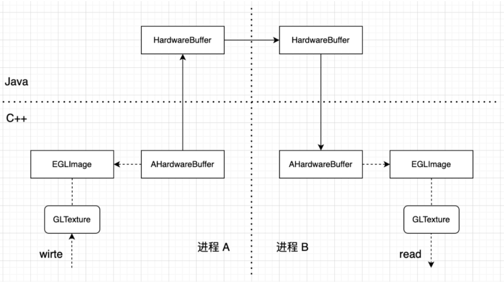
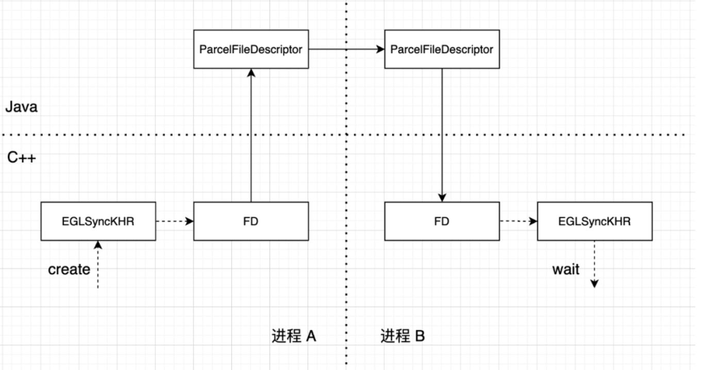

提到多进程渲染，通常会想到 Chrome 浏览器的多进程架构，其每个页面 tab、插件都是运行在独立进程，并且有一个单独的 GPU 进程，这里最明显的好处是可以隔离各模块之间的耦合。

即使某个进程卡顿、crash 也不会影响到其它进程，从而提升系统整体的稳定性，特别是 GPU 进程，各厂商提供的图形驱动可能有不同的兼容性问题(参考：Chromium 的 GPU 兼容方案)，采用独立进程能有效降低主进程 crash 概率。

对于移动端应用，比如 Android 平台，系统并没有限制多进程的使用，我们也可以使用多进程架构来提升应用的稳定性，比如小程序、直播等场景，又或者应用需要使用 Unreal/Unity 来渲染 3D 效果，使用独立进程在稳定性、内存回收等方面都会有明显收益。

而针对渲染，多进程架构比较重要的问题是纹理数据如何传输，比如主进程的相机帧传到渲染进程，渲染进程的结果纹理传回主进程。

Android 系统 API 提供的 Surface 对象支持跨进程传递，可以在一个进程通过 `eglCreateWindowSurface`创建 EGLSurface 进行渲染写入，然后在另一个进程的 `onFrameAvailable` 回调中调用 `updateTexImage` 获取渲染结果。


**Android 8.0 之后系统提供了 HardwareBuffer 相关 API，也可用于跨进程纹理传输，相比 Surface 更高效，并且避免了 `onFrameAvailable` 回调机制导致的时序复杂度。**


### HardwareBuffer

> HardwareBuffer wraps a native `AHardwareBuffer` object, which is a low-level object representing a memory buffer accessible by various hardware units. HardwareBuffer allows sharing buffers across different application processes. In particular, HardwareBuffers may be mappable to memory accessibly to various hardware systems, such as the GPU, a sensor or context hub, or other auxiliary processing units. For more information, see the NDK documentation for `AHardwareBuffer`.

如上，HardwareBuffer 官方介绍为一种底层的内存 buffer 对象，可在不同进程间共享，可映射到不同硬件系统，如 GPU、传感器等，从构造函数可以看出，其可以指定 format 和 usage，用来让底层选择最合适的实现，目前 format 主要是渲染相关的纹理格式，Android 11 之后支持了 BLOB 格式，可用来做 NN 相关的数据共享。

如果看一下 HardwareBuffer 的实现，会发现其只是 GraphicBuffer 的一个包装，只是 Android 低版本并没有开放 GraphicBuffer 相关 API，而前面提到的 Surface ，其底层就是基于 GraphicBuffer 来实现的，因此本质上是 Android 系统开放了更底层的 API，我们才可以有更高效的实现，接下来看具体如何基于 HardwareBuffer 跨进程传输纹理。



整体流程如上图，首先在进程 A 创建 AHardwareBuffer 对象：

```cpp
AHardwareBuffer *buffer = nullptr;  
AHardwareBuffer_Desc desc = {  
        static_cast<uint32_t>(width),  
        static_cast<uint32_t>(height),  
        1,  
        AHARDWAREBUFFER_FORMAT_R8G8B8A8_UNORM,  
        AHARDWAREBUFFER_USAGE_CPU_READ_NEVER | AHARDWAREBUFFER_USAGE_CPU_WRITE_NEVER |  
        AHARDWAREBUFFER_USAGE_GPU_SAMPLED_IMAGE | AHARDWAREBUFFER_USAGE_GPU_COLOR_OUTPUT,  
        0,  
        0,  
        0};  
int errCode = HWDriver::AHardwareBuffer_allocate(&desc, &buffer);
```

这里我们设置 HardwareBuffer 格式为 AHARDWAREBUFFER_FORMAT_R8G8B8A8_UNORM，对应 GLES 纹理格式 GL_RGBA8，由于我们的纹理不涉及 CPU 读写，添加 usage 标记 CPU_READ_NEVER 和 CPU_WRITE_NEVER，又因为需要作为 GPU 纹理读，以及作为 framebuffer attachment 写，需要添加标记 GPU_SAMPLED_IMAGE 和 GPU_FRAMEBUFFER，接下来需要将创建出来的 buffer 关联我们的输入纹理：

```cpp
EGLClientBuffer clientBuffer = glext::eglGetNativeClientBufferANDROID(buffer_);  
if (!clientBuffer) { 
    ...
}  

EGLDisplay display = eglGetDisplay(EGL_DEFAULT_DISPLAY);  

if (eglImage_ != EGL_NO_IMAGE_KHR) {  
    glext::eglDestroyImageKHR(display, eglImage_);
    ...
}  

EGLint eglImageAttributes[] = {EGL_IMAGE_PRESERVED_KHR, EGL_TRUE, EGL_NONE};  
eglImage_ = glext::eglCreateImageKHR(display, EGL_NO_CONTEXT, EGL_NATIVE_BUFFER_ANDROID,  
                                     clientBuffer, eglImageAttributes);  
if (eglImage_ == EGL_NO_IMAGE_KHR) {  
    ...
}  

glBindTexture(GL_TEXTURE_2D, texId);  
glext::glEGLImageTargetTexture2DOES(GL_TEXTURE_2D, (GLeglImageOES) eglImage_);
```

EGLImage 来自于 EGL 的一个扩展 EGL_KHR_image_base，用于在不同的 EGL 环境之间共享数据(如OpenGL-OpenCL)，而 Android 系统通过另一个扩展 EGL_ANDROID_get_native_client_buffer 支持从 HardwareBuffer 创建 EGLImage，创建 EGLImage 之后，再通过 `glEGLImageTargetTexture2DOES` 将 buffer 关联到纹理(该纹理的 image storage 设置成了 HardwareBuffer 对象)，这样如果我们能在另一个进程拿到这个 HardwareBuffer 对象，也就实现了纹理的跨进程传输(共享)。

```cpp
jobject getBufferJObject(JNIEnv *env) const {  
    return HWDriver::AHardwareBuffer_toHardwareBuffer(env, buffer_);  
}
```

通过 `AHardwareBuffer_toHardwareBuffer` 函数，我们将 C++ AHardwareBuffer 对象转为 Java HardwareBuffer 对象，其本身实现了 Parcelable 接口，可以直接通过 AIDL 传递到另一个进程，其中具体的实现就是 Android 系统 GraphicBuffer 跨进程那一套(底层通过 fd 实现)，这里就不做具体的分析了，在进程 B 拿到 HardwareBuffer 对象后，需要再转换为 C++ 的 AHardwareBuffer 对象：

```cpp
AHardwareBuffer *MakeAdoptedJObject(JNIEnv *env, jobject buffer) {
    AHardwareBuffer *hwBuffer = HWDriver::AHardwareBuffer_fromHardwareBuffer(env, buffer);
    HWDriver::AHardwareBuffer_acquire(hwBuffer);
    return hwBuffer;
}
```

接下来的步骤就和进程 A 一样了，创建 EGLClientBuffer，再创建 EGLImage，最后通过 `glEGLImageTargetTexture2DOES` 关联到纹理，如果进程 A 之前已经通过渲染到纹理(framebuffer attachment)写入了内容，进程 B 关联纹理后，就可以直接通过 shader 采样渲染出来了。

**可以看出，通过 HardwareBuffer 实现纹理的跨进程传输(共享)，本质上是两个进程的纹理设置了同一份 image storage**，整体流程相比 Surface 跨进程更简洁高效。当然，绑定到 EGLImage 的纹理有一些限制，比如mutable, 纹理过滤方式等，具体可查看 OES_EGL_image_external 扩展说明。


### EGLSyncKHR

到这里还没完，同一个纹理存储，一个进程写，一个进程读，而且纹理的读写是在 GPU 端，需要有合适的同步机制来保证读写顺序，这里 Android 系统提供了一个 EGL 扩展来完成 ANDROID_native_fence_sync ，其在 EGL_KHR_fence_sync 扩展的基础上，支持将 EGL 同步对象和一个文件描述符关联起来。

EGL 同步对象和 GLES 本身的同步对象 GLSync 类似，只不过是在 EGL API 层面，而通过 Android 的扩展关联文件描述符后，就具备了跨进程能力，同 GLSync 一样，EGL 同步对象也提供了Client 同步 `eglClientWaitSyncKHR` 和 Server 同步 `eglWaitSyncKHR` 两种方式，这里我们使用 Server 同步的方式来实现跨进程同步：



如上图，在进程 A 写入(渲染)纹理后，我们创建 EGL 同步对象并 flush

```cpp
EGLDisplay display = eglGetDisplay(EGL_DEFAULT_DISPLAY);  
EGLSyncKHR eglSync = glext::eglCreateSyncKHR(display, EGL_SYNC_NATIVE_FENCE_ANDROID, nullptr);  
if (eglSync == EGL_NO_SYNC_KHR) {  
    LOGE("eglCreateSyncKHR null: %s", GetEGLError());  
    return EGL_NO_NATIVE_FENCE_FD_ANDROID;  
}  

glFlush();
```

然后关联(复制)到文件描述符，这里可以理解为引用计数+1，注意 dup 之后需要将之前的 eglSync destroy 掉

```cpp
int fenceFd = glext::eglDupNativeFenceFDANDROID(display, eglSync);  
glext::eglDestroySyncKHR(display, eglSync);
```

dup 得到的 fd 可以通过 Android 提供的 ParcelFileDescriptor 进行跨进程传递 (两个进程的 fd 都指向同一个内核文件)：

```cpp
// 进程 A：fd -> ParcelFileDescriptor
ParcelFileDescriptor pfd = ParcelFileDescriptor.adoptFd(fd)

// 进程 B：ParcelFileDescriptor -> fd
int fd = pfd.detachFd();
```

进程 B 在拿到 传递过来的 fd 后，需要基于这个 fd 重新创建一个 EGLSyncKHR，然后 wait：

```cpp
EGLDisplay display = eglGetDisplay(EGL_DEFAULT_DISPLAY);  
EGLint attribs[] = {EGL_SYNC_NATIVE_FENCE_FD_ANDROID, fenceFd, EGL_NONE};  
EGLSyncKHR eglSync = glext::eglCreateSyncKHR(display, EGL_SYNC_NATIVE_FENCE_ANDROID, attribs);  
if (eglSync == EGL_NO_SYNC_KHR) {  
    LOGE("wait failed: eglCreateSyncKHR null: %s", GetEGLError());  
    close(fenceFd);  
    return false;
}  

EGLint success = glext::eglWaitSyncKHR(display, eglSync, 0);  
glext::eglDestroySyncKHR(display, eglSync);
```

本质上 Android 端的 Fence 就是基于 fd 的，因此类似于前面的 HardwareBuffer，这里的同步也是两个进程共享一个 Sync 对象，在一端 create，另一端 wait。

至此我们整个跨进程渲染链路才算完成了，核心的两点是基于 HardwareBuffer 的纹理传输和基于 EGLSyncKHR 的跨进程同步。查看 Chromium 的代码，可以看到其在 Android 8.0 后也使用了 HardwareBuffer 来做跨进程内存共享，与我们上面的实现类似，具体可查看 *Issue 761432: Implement AHardwareBuffer-backed GPUMemoryBuffer for Android O*

> *原文链接:* *https://robot9.me/hardwarebuffer-multi-process-rendering*


