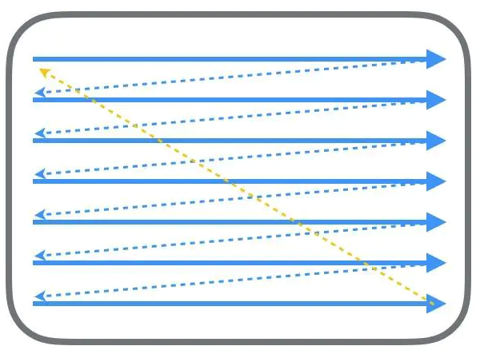
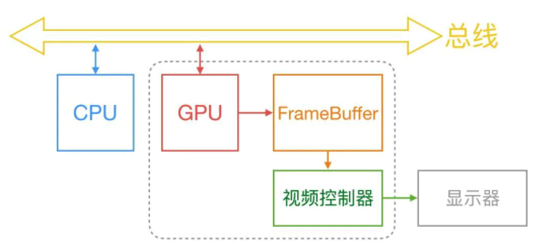
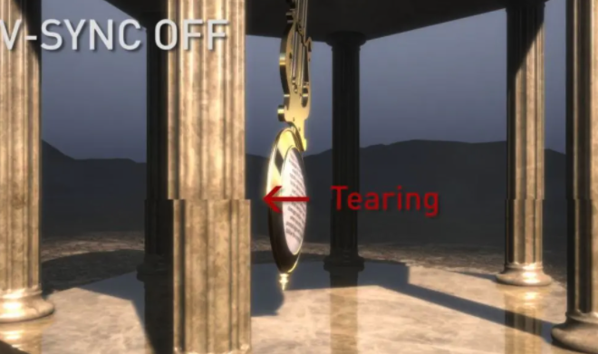
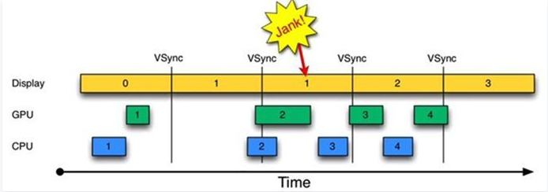
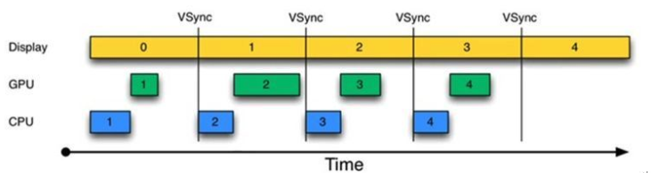
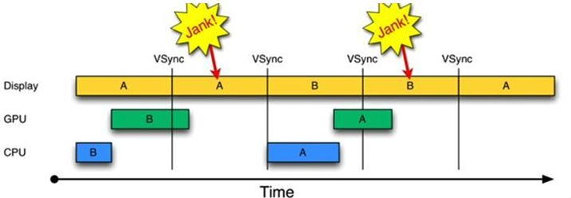
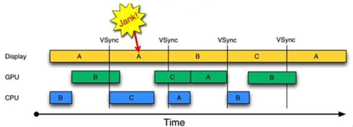

# 显示绘制--垂直同步、双缓冲、三缓冲

网上这类的文章挺多，我看的时候也晕乎，有点是爬虫趴下来的格式图片都挂了，有的参入和很多代码方面的讲解，一些概念性的平台无关的机制如果能不涉及代码细节，可能会更好。

我尝试用这篇文章，把尝试把这三个东西讲清楚。（前置知识：需要先了解什么是掉帧，16ms这个数字怎么来的）

## 屏幕显示图像的原理

拿过去的CRT显示器原理来说，CRT的电子枪按照上面的方式，从上到下逐行扫描，扫描完成以后显示器就呈现一帧的画面，然后电子枪就回到初始位置继续下一次扫描。

为了把显示器的显示和系统视频控制器同步，显示器会用硬件时钟产生一系列定时信号。
 当电子枪换下一行准备扫描的时候，显示器会发出一个水平同步信号HSync。
 当一帧画面绘制完成后，电子枪回复到原位，准备画下一帧前，显示器会发出一个垂直同步信号VSync。
 显示器通常以VSync信号的频率来刷新。

计算机系统中的CPU、GPU、显示器的大致协同工作如下：

CPU计算好现实内容提交到GPU，GPU渲染完成后将渲染结果放入帧缓冲区，随后视频控制器就会按照VSync信号逐行读取帧缓冲区的数据，然后在显示器上显示。

即，电脑显示一张画面是分成两个步骤完成的。

- 第一步是CPU和显卡把所要显示的画面数据计算出来。
- 第二步是显示器把这些数据写到屏幕上。

这两步工作都需要时间，并且可以并行执行，因为具体执行这两个过程的硬件是相互独立的（是cpu/显卡 和 视频控制器）。但是呢，这两个工作的耗时是不同的。
 cpu以及显卡每秒能计算出的画面数量是根据硬件性能决定的。 但是显示器每秒刷新频率是固定的（一般是60hz，所以每隔16.667ms就会刷新一次）。

这种两边速率不统一的问题（先不说谁快谁慢），引入了帧缓冲（FrameBuffer）的概念。

帧缓冲能在一定程度上提升效率，但还是有几个问题：

- 画面闪烁
- 画面撕裂
- 跳帧
- 卡顿

接下来聊聊显示上会遇到的几个问题以及方案的演进：

## 画面撕裂、跳帧、闪烁

如上面说过的，显示器刷新的时候是从最上面的一行像素开始逐行向下刷新，所以从顶端到底部的刷新是有时间差的。如果显卡的性能很强，也就是显卡帧率大于屏幕刷新率的时候，就会出现屏幕上半部分还停留在上一帧的画面，新的一帧的数据已经拷贝上来了，那么屏幕的下半部分渲染出来的就是下一帧的画面-----这种情况被称为画面撕裂（问题-1）。
 如果显卡再快一点，那么下一帧的图像还没来得及显示，下下一帧的数据就覆盖上来了，中间这帧就跳过了-----这种情况被称为跳帧（问题-2）。
 反过来，如果显卡帧率小于显示器刷新率，那每次在屏幕上看到的可能不是完整的图形，每次看到的图形比上次更完整一些。于是在用户看起来，画面是卡顿掉帧不顺滑（问题-3）。
 在单缓冲的场景下，渲染下一帧的时候先清除画布的当前视图，这样就会导致画面看起来闪烁，比如大学时候在win32的GDI+写过小游戏的朋友一定有印象，不使用额外手段的情况下，画面动起来的时候是会一闪一闪的。（问题-4）。

方案：针对这问题-1和-2，引入了**垂直同步的技术**。

**垂直同步（V-Sync）**，开启后GPU会等待显示器的VSync信号发出后再进行新的一帧渲染和缓冲区更新。即，把显卡帧率锁定为显示器的刷新率，

由上述结论我们只能得到，垂直同步可以在显卡帧率比显示器刷新率高的时候解决撕裂和跳帧的问题。但是，显卡帧率小于显示器刷新率的时候，也就是问题-3和问题-4，引入了**双缓冲技术**。

**双缓冲技术**，GPU会预先渲染好一帧放入一个缓冲区内，让视频控制器读取，当下一帧渲染好后，GPU会直接把视频控制器的指针指向第二个缓冲区。也就是说，在一帧被渲染完以后才会交给屏幕显示，不会看到“半成品画面”。并且有两个缓冲区互换，不需要在显示前台清理画布，所以不会闪烁。

安卓在4.1引入了是三缓存+垂直同步的机制。

下面再来说一下**Android的三重缓冲**：先对比总结一下上面说的几种情况：

**没有垂直同步的情况，**由上图可知

- 1.时间从0开始，进入第一个16ms：Display显示第0帧，CPU处理完第一帧后，GPU紧接其后处理继续第一帧。三者互不干扰，一切正常。 
- 2.时间进入第二个16ms：因为早在上一个16ms时间内，第1帧已经由CPU，GPU处理完毕。故Display可以直接显示第1帧。显示没有问题。但在本16ms期间，CPU和GPU 却并未及时去绘制第2帧数据（注意前面的空白区），而是在本周期快结束时，CPU/GPU才去处理第2帧数据。 
- 3.时间进入第3个16ms，此时Display应该显示第2帧数据，但由于CPU和GPU还没有处理完第2帧数据，故Display只能继续显示第一帧的数据，结果使得第1 帧多画了一次（对应时间段上标注了一个Jank）。 
- 4.通过上述分析可知，此处发生Jank的关键问题在于，为何第1个16ms段内，CPU/GPU没有及时处理第2帧数据？原因很简单，CPU可能是在忙别的事情（比如某个应用通过sleep 固定时间来实现动画的逐帧显示），不知道该到处理UI绘制的时间了。可CPU一旦想起来要去处理第2帧数据，时间又错过了！

**增加垂直同步，**由图可知，每收到VSYNC中断，CPU就开始处理各帧数据。整个过程非常完美。 不过，仔细琢磨图2却会发现一个新问题：图2中，CPU和GPU处理数据的速度似乎都能在16ms内完成，而且还有时间空余，也就是说，CPU/GPU的FPS（帧率，Frames Per Second）要高于Display的FPS。确实如此。由于CPU/GPU只在收到VSYNC时才开始数据处理，故它们的FPS被拉低到与Display的FPS相同。但这种处理并没有什么问题，因为Android设备的Display FPS一般是60，其对应的显示效果非常平滑。 如果CPU/GPU的FPS小于Display的FPS，会是什么情况呢？请看下图：

GPU帧率小于显示器刷新率的时候还是会出现下面的情况（掉帧）(注意看黄色的GPU占用的Buffer)：

由图可知： 1.在第二个16ms时间段，Display本应显示B帧，但却因为GPU还在处理B帧，导致A帧被重复显示。 2.同理，在第二个16ms时间段内，CPU无所事事，因为A Buffer被Display在使用。B Buffer被GPU在使用。注意，一旦过了VSYNC时间点， CPU就不能被触发以处理绘制工作了。

这样当掉帧的时候，第二个16ms时间段内，显示控制器占用一个Buffer，GPU暂用一个Buffer。**两个Buffer都被占用，导致CPU空闲下来浪费了资源**，因为垂直同步的原因只有V-SYNC时间点CPU才能触发绘制工作。

## **三级缓存**

这时候引入第三个Buffer。这个Tripple Buffer机制利用CPU/GPU的空闲等待时间提前准备好数据，但是不一定会使用。

由图可知： 第二个16ms时间段，CPU使用C Buffer绘图。虽然还是会多显示A帧一次，但后续显示就比较顺畅了。**是不是Buffer越多越好呢？回答是否定的。由图4可知，在第二个时间段内，CPU绘制的第C帧数据要到第四个16ms才能显示， 这比双Buffer情况多了16ms延迟。所以，Buffer最好还是两个，三个足矣。**

以上对VSYNC进行了理论分析，其实也引出了Project Buffer的三个关键点： 核心关键：需要VSYNC定时中断。 Triple Buffer：当双Buffer不够使用时，该系统可分配第三块Buffer。 另外，还有一个非常隐秘的关键点：即将绘制工作都统一到VSYNC时间点上。这就是Choreographer的作用。在它的统一指挥下，应用的绘制工作都将变得井井有条。

如上图所示，一开始会掉帧一次后面就不会掉帧了。这个所谓的引入Buffer的机制，就和App和SurfaceFlinger通信的时使用的匿名共享内存Ashmem里的数据结构SharedClient里的SSHaredBufferStack关联上了，这个stack有16个位置，在4.1以后这个启用了3个缓冲位。这块SurfaceFlinger的文章我会进行专门的整理。

参考文献：
 [https://source.android.com/devices/graphics/index.html](https://links.jianshu.com/go?to=https%3A%2F%2Fsource.android.com%2Fdevices%2Fgraphics%2Findex.html)
 [https://blog.ibireme.com/2015/11/12/smooth_user_interfaces_for_ios/](https://links.jianshu.com/go?to=https%3A%2F%2Fblog.ibireme.com%2F2015%2F11%2F12%2Fsmooth_user_interfaces_for_ios%2F)
 [https://developer.android.google.cn/topic/performance/vitals/render#java](https://links.jianshu.com/go?to=https%3A%2F%2Fdeveloper.android.google.cn%2Ftopic%2Fperformance%2Fvitals%2Frender%23java)

作者：欧祎
链接：https://www.jianshu.com/p/b5fe01cfc753
来源：简书
著作权归作者所有。商业转载请联系作者获得授权，非商业转载请注明出处。