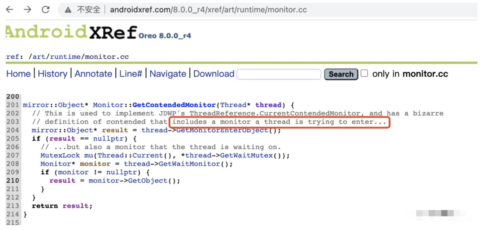
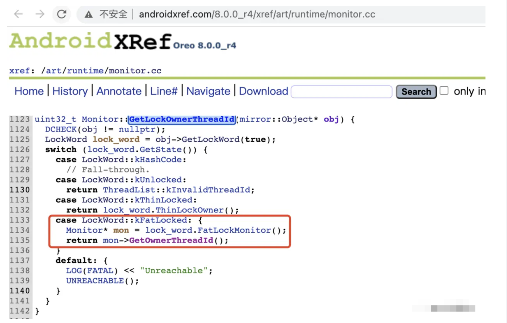
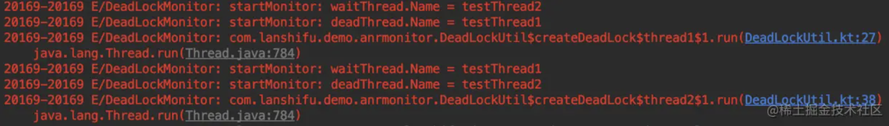

参考https://juejin.cn/post/6973564044351373326

## 一、卡顿原理和监控

### 1.1 卡顿原理

一般来说，主线程有耗时操作会导致卡顿，卡顿超过阈值，触发ANR。

从源码层面一步步分析卡顿原理：

首先应用进程启动的时候，`Zygote`会反射调用 `ActivityThread` 的 main 方法，启动 loop 循环

```typescript
->ActivityThread

public static void main(String[] args) {
      ...
	Looper.prepareMainLooper();
	Looper.loop();
	...
}
```

看下Looper的loop方法


## 六、死锁监控

在发生ANR的时候，有时候只有主线程堆栈信息可能还不够，例如发生死锁的情况，**需要知道当前线程在等待哪个锁，以及这个锁被哪个线程持有**，然后把发生死锁的线程堆栈信息都收集到。

流程如下：

1. 获取当前blocked状态的线程
2. 获取该线程想要竞争的锁
3. 获取该锁被哪个线程持有
4. 通过关系链，判断死锁的线程，输出堆栈信息

在Java层并没有相关API可以实现死锁监控，可以从Native层入手。

### 6.1 获取当前blocked状态的线程

这个比较简单，一个for循环就搞定，不过我们要的线程id是native层的线程id，Thread 内部有一个native线程地址的字段叫 `nativePeer`，通过反射可以获取到。

```java
Thread[] threads = getAllThreads();
for (Thread thread : threads) {
  if (thread.getState() == Thread.State.BLOCKED) {
    long threadAddress = (long) ReflectUtil.getField(thread, "nativePeer");
    // 找不到地址，或者线程已经挂了，此时获取到的可能是0和-1
    if (threadAddress <= 0) {
      continue;
    }
    ...后续
  }
}
```

有了native层线程地址，还需要找到native层相关函数


### 6.2 获取当前线程想要竞争的锁

从ART 源码可以找到这个函数 [androidxref.com/8.0.0_r4/xr…](https://link.juejin.cn/?target=http%3A%2F%2Fandroidxref.com%2F8.0.0_r4%2Fxref%2Fart%2Fruntime%2Fmonitor.cc)

函数：**Monitor::GetContendedMonitor**



从源码和源码的解释可以看出，这个函数是用来获取当前线程等待的Monitor。

顺便说说Monitor以及Java对象结构

##### Monitor

**Monitor是一种并发控制机制**，提供多线程环境下的互斥和同步，以支持安全的并发访问。

Monitor由以下3个元素组成：

1. 临界区：例如synchronize修饰的代码块
2. 条件变量：用来维护因不满足条件而阻塞的线程队列
3. Monitor对象，维护Monitor的入口、临界区互斥量（即锁）、临界区和条件变量，以及条件变量上的阻塞和唤醒

感兴趣可以参考这一篇文章 [说一说管程（Monitor）及其在Java synchronized机制中的体现](https://link.juejin.cn?target=https%3A%2F%2Fwww.jianshu.com%2Fp%2Fe624460c645c)


##### Java的Class对象

Java的Class对象包括三部分组成：

1. 对象头：MarkWord和对象指针

   > **MarkWord（标记字段）**：保存哈希码、分代年龄、**锁标志位**、偏向线程ID、偏向时间戳等信息 **对象指针**：即指向当前对象的类的元数据的指针，虚拟机通过这个指针来确定这个对象是哪个类的实例。

2. 实例数据：对象实际的数据

3. 对齐填充：按8字节对齐（JVM自动内存管理系统要求对象起始地址必须是8字节的整数倍）。例如Integer对象，对象头MarkWord和对象指针分别占用4字节，实例数据4字节，那么对齐填充就是4字节，Integer占用内存是int的4倍。

------

回到 `GetContendedMonitor` 函数，我们可以通过打开动态库`libart.so`，然后使用`dlsym`获取函数的符号地址，然后就可以进行调用了。

由于Android 7.0开始，系统限制App中调用`dlopen`，`dlsym`等函数打开系统动态库，我们可以使用 [ndk_dlopen](https://link.juejin.cn?target=https%3A%2F%2Fgithub.com%2Frrrfff%2Fndk_dlopen)这个库来绕过这个限制

```c++
//1、初始化
ndk_init(env);

//2、打开动态库libart.so
void *so_addr = ndk_dlopen("libart.so", RTLD_NOLOAD);
if (so_addr == NULL) {
	return 1;
}
```

打开动态库之后，会返回动态库的内存地址，接下来就可以通过`dlsym`获取`GetContendedMonitor`这个函数的符号地址，只不过要注意，c++可以重载，所以它的函数符号比较特殊，需要从`libart.so`中搜索匹配找到

```c++
    //c++跟c不一样，c++可以重载，描述符会变，需要打开libart.so，在里面搜索查找GetContendedMonitor的函数符号
    //http://androidxref.com/8.0.0_r4/xref/system/core/libbacktrace/testdata/arm/libart.so

    //获取Monitor::GetContendedMonitor函数符号地址
    get_contended_monitor = ndk_dlsym(so_addr, "_ZN3art7Monitor19GetContendedMonitorEPNS_6ThreadE");
    if (get_contended_monitor == NULL) {
        return 2;
    }
```

到此，第一个函数的符号地址找到了，接下来要找另外一个函数


### 6.3 获取目标锁被哪个线程持有

**函数：Monitor::GetLockOwnerThreadId**



用同样的方式来获取这个函数符号地址

```c++
// Monitor::GetLockOwnerThreadId
//这个函数是用来获取 Monitor的持有者,会返回线程id
get_lock_owner_thread = ndk_dlsym(so_addr, get_lock_owner_symbol_name(api_level));
if (get_lock_owner_thread == NULL) {
  return 3;
}
```

由于从android 10开始，这个`GetLockOwnerThreadId`函数符号有变化，所以需要通过api版本来判断使用哪一个

```c++
const char *get_lock_owner_symbol_name(jint level) {
    if (level <= 29) {
        //android 9.0 之前
        //http://androidxref.com/9.0.0_r3/xref/system/core/libbacktrace/testdata/arm/libart.so 搜索 GetLockOwnerThreadId
        return "_ZN3art7Monitor20GetLockOwnerThreadIdEPNS_6mirror6ObjectE";
    } else {
        //android 10.0
        // todo 10.0 源码中这个函数符号变了，需要自行查阅
        return "_ZN3art7Monitor20GetLockOwnerThreadIdEPNS_6mirror6ObjectE";
    }
}
```

到此，就得到了两个函数符号地址，接下来就把blocked状态的native线程id传过去，调用就行了


### 6.4 找到一直不释放锁的线程

```c++
Java_com_lanshifu_demo_anrmonitor_DeadLockMonitor_getContentThreadIdArt(JNIEnv *env,jobject thiz,jlong native_thread) {

    LOGI("getContentThreadIdArt");
    int monitor_thread_id = 0;
    if (get_contended_monitor != NULL && get_lock_owner_thread != NULL) {
        LOGI("get_contended_monitor != NULL");
        //1、调用一下获取monitor的函数，返回当前线程想要竞争的monitor
        int monitorObj = ((int (*)(long)) get_contended_monitor)(native_thread);
        if (monitorObj != 0) {
            LOGI("monitorObj != 0");
            // 2、获取这个monitor被哪个线程持有，返回该线程id
            monitor_thread_id = ((int (*)(int)) get_lock_owner_thread)(monitorObj);
        } else {
            LOGE("GetContendedMonitor return null");
            monitor_thread_id = 0;
        }
    } else {
        LOGE("get_contended_monitor == NULL || get_lock_owner_thread == NULL");

    }
    return monitor_thread_id;
}
```

两个步骤：

1. 获取当前线程要竞争的锁
2. 获取这个锁被哪个线程持有

通过两个步骤，得到的是那个一直不释放锁的线程id。

### 6.5 通过算法，找到死锁

前面已经知道当前blocked状态的线程id（还需要转换成native线程id），以及这个blocked线程在等待哪个线程释放锁，也就是得到关系链：

1. A等待B  B等待A
2. A等待B  B等待C  C等待A ...
3. 其它...

如何判断有死锁？我们可以用Map来保存对应关系

map[A]=B

map[B]=A

最后通过互斥条件判断出死锁线程，把造成死锁的线程堆栈信息输出，如下



检查出死锁，线下可以弹窗或者toast，线上则可以采集数据上报。


### 6.6 死锁监控小结

死锁监控原理还是比较清晰的：

1. 获取blocked状态的线程
2. 获取该线程想要竞争的锁（native层函数）
3. 获取这个锁被哪个线程持有（native层函数）
4. 有了关系链，就可以找出造成死锁的线程


