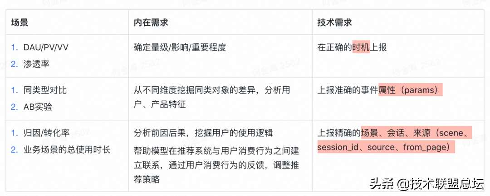
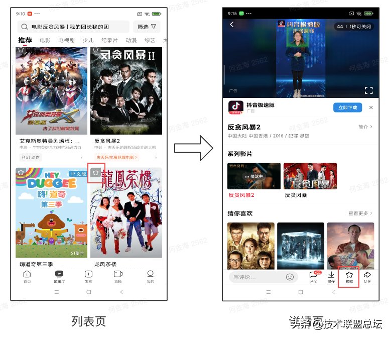
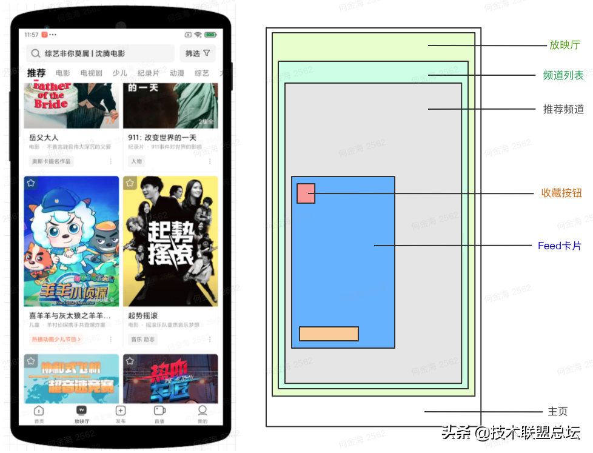
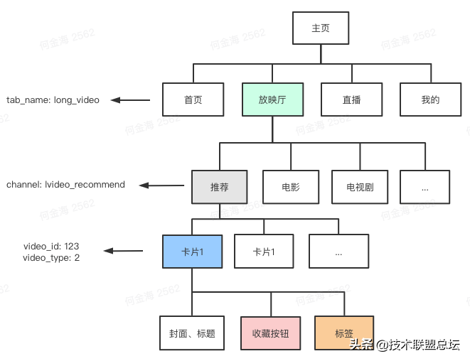
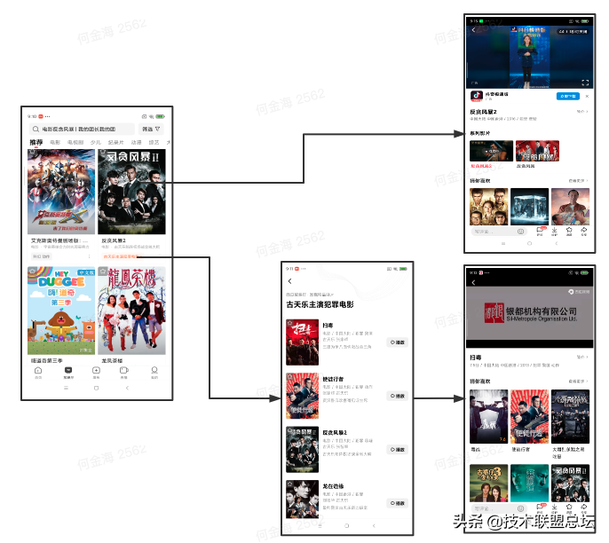
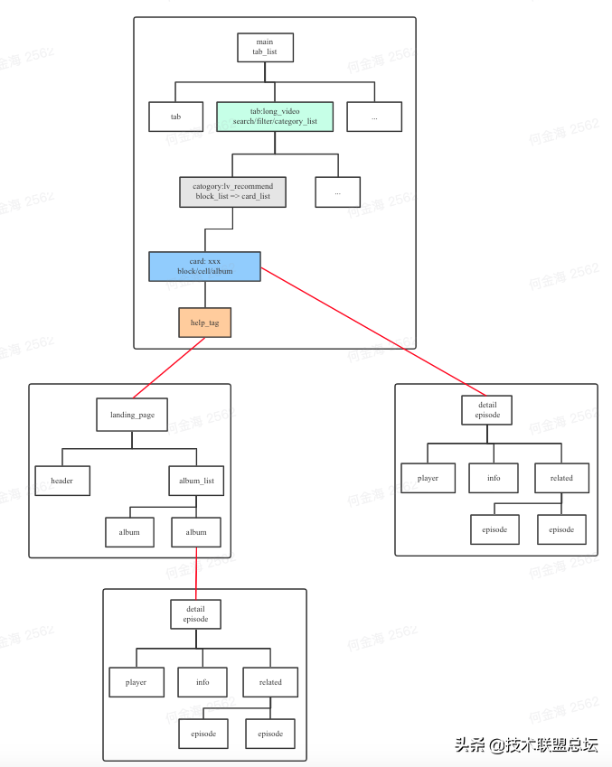
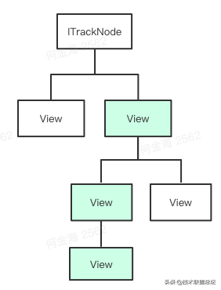
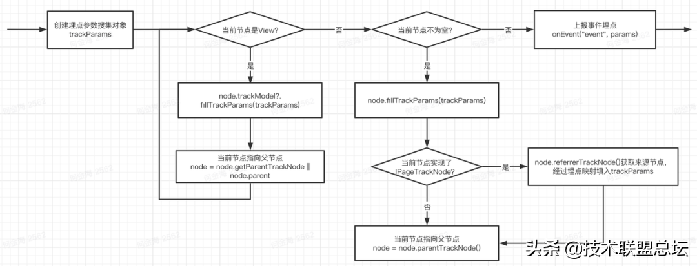

# 埋点的背景

目前互联网/软件行业内，广泛使用数据驱动产品迭代，通过精细的数据分析、模型训练为用户提供更好的服务。在此过程中，数据埋点的工作是后续数据分析、模型训练等工作的基础。

数据埋点通常是产品经理、数据分析师，以及推荐系统工程师，基于业务需求（例如：广告的下载安装转化），产品需求（例如：关注按钮的曝光次数以及点击的人数）对用户行为的每一个事件确定埋点需求。客户端工程师进行对应的埋点功能开发，通过 SDK 上报埋点的数据结果，后端记录数据进行一系列处理，并汇总后提供给产品经理、数据分析师，以及推荐系统工程师进行数据分析或模型训练，帮助优化产品运营策略。


# 经典的消费场景

下面有几种经典的数据消费场景：




我们可以看到，行为分析埋点，需要包括某一事件发生时的前因、后果，以及事件发生对象的特征。在复杂的数据分析、模型训练等需求中，不仅仅需要获知某个事件的发生次数，对埋点上下文尤为关注。此处上下文指的通常有 2 类，分别是：

- 事件发生的页面信息和页面位置信息
- 用户经过怎样的路径来到当前页面，也就是“来源”信息


# 经典的埋点需求

下面我们结合具体场景，看 1 个简单的埋点需求，“点击收藏”事件




上面左图是西瓜放映厅的推荐列表，右图是某个影片的详情页，点击推荐列表的影片卡片，会跳转到详情页。作为最常见的消费场景，列表和详情都有收藏按钮，我们希望知道每一个收藏事件发生的场景，方便后续优化收藏功能，以及结合用户收藏的情况，优化推荐模型。

埋点需求是上报收藏按钮的点击事件 click_favorite，要求包含收藏影片的信息，所在的场景信息等。

1. 如果收藏事件发生在列表页，会上报如下的内容

```
{
  "event": "click_favorite",
  "params": {
    "video_id": "123", // 影片ID
    "video_type": 2, // 影片类型
    "page_name": "feed", // 当前页面
    "tab_name": "long_video" // 当前所在的底Tab
    "channel_name": "lvideo_recommend", // 当前所在的频道
  }
}
```

1. 如果收藏事件发生在详情页，会上报如下的内容

```
{
  "event": "click_favorite",
  "params": {
    "video_id": "123", // 影片ID
    "video_type": 2, // 影片类型
    "page_name": "detail", // 当前页面
    "from_page": "feed", // 来源页面
    "from_tab_name": "long_video" // 来源底Tab
    "from_channel_name": "lvideo_recommend", // 来源频道
  }
}
```


# 现有方案

前端用户交互的界面，通常有复杂的页面层级关系和跳转逻辑，为了准确记录埋点信息，满足上述埋点需求，主要有以下几种实现方案。


# 直接传参

通过平台支持的参数传递方式，逐个定义并且读写参数；或者基于面向对象程序设计，对每个类添加相应的埋点参数，在类对象的关系中进行埋点参数传递。

对于上面的埋点需求 click_favorite，我们假设列表页和详情页的层级结构是：

- 列表页：CinemaTabFragment（放映厅 Tab）=> VideoChannelFragment（频道）=> VideoViewHolder（卡片）
- 详情页：VideoDetailActivity（详情页 Activity） -> BottomActionBar（底部操作栏）

当然实际情况因为项目的组件抽象复用等原因，往往会有更复杂的层级。直接传参要怎么实现这个埋点需求呢：

1. 列表页的 click_favorite 埋点，需要从底 Tab 把所在 Tab 信息传给频道，频道再把底 Tab 和频道信息传给卡片

```
class CinemaTabFragment {
    fun getItem() {
        fragment = VideoChannelFragment()
        // 配置频道所处的底Tab
        fragment.tabName = "long_video"
        return fragment
    }
}

class VideoChannelFragment {
    var tabName
    var channelName

    fun onBindViewHolder(position) {
        holder.videoInfo = items.get(position)
        // 配置卡片的tabName和channelName
        holder.tabName = this.tabName
        holder.channelName = this.channelName
    }
}

class VideoViewHolder {
    var tabName
    var channelName
    var videoInfo

    fun clickFavorite() {
        // 上报埋点的时候，拼接参数
        LogSdk.onEvent("click_favorite", mapOf(
            "tab_name" to this.tabName,
            "channel_name" to this.channelName,
            "video_id" to this.videoInfo.id,
            "video_type" to this.videoInfo.type,
            "page_name" to "feed"
        ))
    }
}
```

1. 详情页的 click_favorite 埋点，首先需要在列表页点击卡片跳转的时候，把上下文信息通过跳转参数传递给详情页，然后详情页解析出参数，传给底部操作栏

```
class VideoViewHolder {
    var tabName
    var channelName
    var videoInfo

    fun clickJumpDetail() {
        intent.putExtra("from_tab_name", this.tabName)
        intent.putExtra("from_channel_name", this.channelName)
        intent.putExtra("from_page", "feed")
        intent.putExtra("video_id", this.videoInfo.id)
        startActivity(intent)
    }
}

class VideoDetailActivity {
    // 详情页还有其他埋点需要报这几个参数，先缓存下来
    var fromTabName
    var fromChannelName
    var fromPage

    var videoInfo

    fun onCreate() {
        // 详情页还有其他埋点需要报这几个参数，缓存在变量里
        fromTabName = intent.getString("from_tab_name")
        fromChannelName = intent.getString("from_channel_name")
        fromPage = intent.getString("from_page")

        val videoId = intent.getString("video_id")
        videoInfo = loadVideoInfo(videoId)

        // 设置参数到底部操作组件
        bottomActionBar.fromTabName = fromTabName
        bottomActionBar.fromChannelName = fromChannelName
        bottomActionBar.fromPage = fromPage
        bottomActionBar.videoInfo = videoInfo
    }
}

class BottomActionBar {
    var fromTabName
    var fromChannelName
    var fromPage
    var videoInfo

    fun clickFavorite() {
        // 上报埋点的时候，拼接参数
        LogSdk.onEvent("click_favorite", mapOf(
            "from_tab_name" to this.fromTabName,
            "from_channel_name" to this.fromChannelName,
            "from_page" to this.fromPage,
            "video_id" to this.videoInfo.id,
            "video_type" to this.videoInfo.type,
            "page_name" to "detail"
        ))
    }
}
```

这里是简化过的伪代码，即便是这样，依然可以看出直接传参有非常显著的缺陷：

- 每增加一个参数，都需要写大量的重复代码，工程代码膨胀
- 模块间约定了很多埋点参数的协议，耦合程度高，难以维护
- 一些场景的嵌套层次深，经过很多层的参数传递，非常容易漏报埋点参数


# 单例传参

上述问题有一种轻微缓解的办法，使用单例来进行埋点参数的访问。通过一个单例进行埋点参数的维护，由于单例提供了全局唯一访问入口，程序中的任何位置都能方便地读和写埋点参数。这种方式带来的好处是不需要在每个类都定义大量的埋点参数，只需要访问单例进行修改和读取。

以详情页的 click_favorite 埋点举例，可以通过跳转前把值写入单例，上报埋点时直接从单例获取，而无须再从详情页 Activity 传值给底部操作栏。

```
object VideoDetailTracker {
    var fromTabName
    var fromChannelName
    var fromPage
    var videoInfo
}

class VideoViewHolder {
    var tabName
    var channelName
    var videoInfo

    fun clickJumpDetail() {
        // 把上下文信息先存到单例
        VideoDetailTracker.fromTabName = this.tabName
        VideoDetailTracker.fromChannelName = this.channelName
        VideoDetailTracker.fromPage = "feed"
        VideoDetailTracker.videoInfo = this.videoInfo
        startActivity(intent)
    }
}

class VideoDetailActivity {

    fun onCreate() {
        // 详情页不需要再解析埋点参数，也不需要再传递给BottomActionBar
        // 只需有正常的功能代码
        val videoId = intent.getString("video_id")
        videoInfo = loadVideoInfo(videoId)
    }
}

class BottomActionBar {

    fun clickFavorite() {
        // 上报埋点的时候，直接从单例取出来拼接参数
        LogSdk.onEvent("click_favorite", mapOf(
            "from_tab_name" to VideoDetailTracker.fromTabName,
            "from_channel_name" to VideoDetailTracker.fromChannelName,
            "from_page" to VideoDetailTracker.fromPage,
            "video_id" to VideoDetailTracker.videoInfo.id,
            "video_type" to VideoDetailTracker.videoInfo.type,
            "page_name" to "detail"
        ))
    }
}
```

可以看出来，从列表页 => 详情页以后，在详情页上报埋点，获取页面来源信息，确实比之前更简单了。但仔细想想，这种方案治标不治本，同样有明显的弊端：

- 首先，无法解决列表页这种多实例场景的问题，比如一个推荐列表中有多个卡片，每个卡片的埋点参数都不一样，卡片的埋点参数还是需要自己传
- 单例的数据可能被多个位置写入，且一旦被覆盖就没法恢复，比如这样的路径：列表 -> 详情页 1 -> 相关推荐 -> 详情页 2，进到详情页 2 以后，单例的数据被覆盖了，这时候再回到详情页 1，获取到的埋点参数实际是详情页 2 的，导致埋点参数上报错误。
- 存放和清理的时机难以控制，清理早了会导致埋点参数缺失，忘记清理可能导致后面的埋点获取不到参数


# 无埋点

无埋点是业界流行的一种埋点方案，所谓的“无埋点”、“全埋点”，是指埋点 SDK 通过编译时插桩、运行时反射或动态代理的方式，自动进行埋点事件的触发和上报，无须客户端工程师手动进行埋点开发工作。由产品经理、数据分析师等在埋点管理后台，使用 XPath 路径、页面视图 id 或者文本匹配等技术，定位到页面视图的位置，过滤出所需的数据。

此方案的优势很明显，客户端只需要一次性的接入，理论上能够搜集到所有页面、视图的曝光、点击等事件，无需客户端同学进行后续的埋点需求开发。

有这么好的事？为什么字节没有广泛使用？此方案的缺陷在于：

1. 仅能上报有限的简单事件类型，如页面视图曝光、点击等，无法完成复杂事件的上报，如一次支付行为的操作路径、结果、错误信息等
2. 无法自定义参数，主要指跳转的来源、所处的场景等上下文信息，无法满足复杂的数据分析和推荐模型所需的数据要求
3. 由产品经理、数据分析师等在埋点管理后台进行的事件录入，把复杂度从开发转嫁给了产品，消费成本较高
4. 对页面视图的稳定性有很高的要求，需要约定 id、文本、视图的层级，保持页面结构不变，如果客户端工程师因为一些新需求开发、性能优化等调整了视图结构，将会导致已录入的埋点失效，增加了额外的维护成本
5. 全场景的数据上报，可能产生大量的无用数据，消耗大量传输、存储、计算资源


# 基于责任链的埋点框架

下面介绍下我们正在使用的埋点框架，是怎么解决埋点传参困难、代码冗余的问题，简化埋点开发复杂度的。


# 分析问题

回顾下刚刚的埋点需求，上报 click_favorite 埋点，复杂度在于上报埋点的对象（列表卡片、详情页底部操作栏），为了埋点需要从其他对象（频道、底 Tab、前面的页面）获取埋点参数。

卡片需要关注自己所在的底 Tab、频道，详情页需要关注自己的来源页面，这显然违反了“关注点分离”的原则。如果我们让每个对象仅关注自己的信息，是否可行？


# 埋点与视图层级的关系

我们回想下列表页的视图层级




是不是会发现所需的埋点参数恰好就分布在视图树的责任链中？




没错，聪明的你已经想到了，我们在收藏按钮被点击时，只需要从收藏按钮的节点按照卡片 -> 推荐频道 -> 放映厅Tab的顺序向上找，就能够拿到所有需要的参数了。既然这个上下级关系（责任链）已经客观存在，我们为什么还需要层层透传埋点，直接利用这个关系不就好了吗？


# 埋点与页面跳转链路的关系

来源类埋点参数定义，常见的有 from_page、click_position 等，需要在跳转的过程中，从前序页面，传递到后序页面，同时会有些映射规则，比如前序页面的 page_name 到了后序页面，上报 from_page。

那么页面的跳转链路是什么样的呢？我们回想下，跳转到详情页，有很多种路径，比如下面的 2 种：




上面是直接从推荐列表页进详情页：推荐列表 => 详情页

下面是从推荐列表页，点击标签进入选集页，再从选集页进入详情页：推荐列表 => 选集 => 详情页

可以看出页面的跳转链路，逻辑上也是一个树状结构。如果我们结合前面说到的页面内视图层级，把两个树放在一起，会是下面的样子：




是不是发现，我们需要的埋点上下文参数，理论上都可以通过节点的关系找到？


# 解决问题

有了前面的讨论，我们来看一下怎么把这个问题，抽象成一个框架。

# 1. ITrackModel

ITrackModel 很简单，这个接口定义了能够填充埋点参数的对象，只要实现了这个接口，就可以在埋点上报的时候添加参数

```
interface ITrackModel {
    fun fillTrackParams(trackParams: TrackParams)
}
```

# 2. ITrackNode

ITrackModel 只是定义了填充参数的职责，ITrackModel 对象之间并没有关联，怎么找到所有的 ITrackModel，让它们填充自己的埋点参数呢？在此基础上，我们定义了 ITrackNode 接口

```
interface ITrackNode: ITrackModel {
    fun parentTrackNode(): ITrackNode?
    fun referrerTrackNode(): ITrackNode?
}
```

ITrackModel 继承了 ITrackModel，除了有填充埋点参数的能力外，还会指向父节点和来源节点。

- parentTrackNode：指向父节点，通过它可以建立一个页面内的责任链，在一个页面内，根节点通常是页面的顶层容器，例如 Android 的 Activity
- referrerTrackNode：指向来源节点，通过它可以建立用户跳转的逻辑链路，在用户使用 App 的一个会话中，来源链路根节点通常指启动页面（也可以由 Push、DeepLink 的启动参数构造虚拟的 referrer 节点）

# 3. 建立页面上下级责任链

定义了 ITrackModel 和 ITrackNode，接下来就是实现每个节点，并且将这些节点连起来。

最通用的方式，是直接实现 ITrackNode，例如在列表场景中，我们可以建立 ViewHolder -> Adapter -> Fragment 的责任链

```
// 放映厅Tab
class CinemaTabFragment: ITrackNode {

    override fun parentTrackNode(): ITrackNode {
        return activity as ITrackNode
    }

    override fun fillTrackParams(trackParams: TrackParams) {
        trackParams.putIfNull("tab_name", "long_video")
    }
}

// 频道Fragment
class VideoChannelFragment: ITrackNode {
    override fun parentTrackNode(): ITrackNode {
        return parentFragment as ITrackNode
    }

    override fun fillTrackParams(trackParams: TrackParams) {
        trackParams.putIfNull("channel_name", "lvideo_recommend")
        trackParams.putIfNull("page_name", "feed")
    }
}

// 列表Adapter，这一层没有参数，只是作为中间节点，连接卡片ViewHolder和频道Fragment
class VideoChannelAdapter(private val parent: ITrackNode): ITrackNode {
    override fun parentTrackNode(): ITrackNode {
        return fragment as ITrackNode
    }
}

// 卡片ViewHolder
class VideoViewHolder(private val parent: ITrackNode, val view: View) : ITrackNode {

    var videoInfo

    override fun parentTrackNode(): ITrackNode {
        return parentFragment as ITrackNode
    }

    override fun fillTrackParams(trackParams: TrackParams) {
        trackParams.putIfNull("video_id", videoInfo.id)
        trackParams.putIfNull("video_type", videoInfo.type)
    }

    fun clickFavorite() {
        // 使用ITrackNode.onEvent上报埋点，会从当前节点开始向上收集埋点参数
        this.onEvent("click_favorite")
    }
}
```

这样，我们就建立起了列表页的上下级责任链，我们可以看到埋点参数都在对应的节点添加了，而不需要再从上级层层传入，上报埋点的代码变得非常简单。

直接实现 ITrackNode 的方式，特别适合 Fragment、Adapter、ViewHolder 等需要我们自定义的类，他们在视图构建中的作用是将视图拆分层级，更好的管理局部的视图、数据和逻辑。然而，我们发现这种方式需要实现每一个节点，并且手动建立节点之间的联系，使用起来还是挺麻烦的。

大部分情况下，我们发现上下级责任链的关系，和视图层级的关系是一致的，而系统已经为我们建立了视图树 ViewTree，那么我们可以利用 ViewTree，来建立上下级责任链。其中 ViewTree 上的每一个 View，只需要实现 ITrackModel 的能力，就可以负责填充埋点参数。

我们利用 View.setTag 可以存放任意对象的特性，为 View 增加了扩展属性

```
/**
 * 设置View的TrackModel
 */
var View.trackModel: ITrackModel?
    get() = this.getTag(TAG_ID_TRACK_MODEL) as? ITrackModel
    set(value) {
        this.setTag(TAG_ID_TRACK_MODEL, value)
    }
```

上面的例子，可以换一种实现方式：

```
// 放映厅Tab
class CinemaTabFragment: ITrackModel {

    override fun fillTrackParams(trackParams: TrackParams) {
        trackParams.putIfNull("tab_name", "long_video")
    }

    override fun onViewCreated(view: View) {
        // 放映厅Tab根视图，ITrackModel由Fragment实现
        view.trackModel = this
    }
}

// 频道Fragment
class VideoChannelFragment: ITrackModel {

    override fun fillTrackParams(trackParams: TrackParams) {
        trackParams.putIfNull("channel_name", "lvideo_recommend")
        trackParams.putIfNull("page_name", "feed")
    }

    override fun onViewCreated(view: View) {
        // 频道根视图，ITrackModel由Fragment实现
        view.trackModel = this
    }
}

// 卡片ViewHolder
class VideoViewHolder(val view: View) : ITrackModel {

    var videoInfo

    fun bind(videoInfo: VideoInfo) {
        this.videoInfo = videoInfo
        this.itemView.trackModel = this
    }

    override fun fillTrackParams(trackParams: TrackParams) {
        trackParams.putIfNull("video_id", videoInfo.id)
        trackParams.putIfNull("video_type", videoInfo.type)
    }

    fun clickFavorite() {
        // 使用View.trackEvent上报埋点，会从当前View开始向上收集埋点参数
        itemView.trackEvent("click_favorite")
    }
}
```

可以看到，利用 ViewTree，为 View 添加 trackModel 的方式，不需要再实现 ITrackNode，手动建立上下级关系。由于 ViewTree 的存在，即便是层级很深的子视图，也可以直接作为埋点节点来使用，而不需要再经过中间的桥接节点。

直接在自定义类实现 ITrackNode，和为 View 添加 ITrackModel，这两种方式可以组合在一起使用。理想的页面上下级链路是这样的，实现 ITrackNode 作为上层节点，更加方便组织逻辑关系复杂的子视图，如首页频道等；层级较深的节点直接利用 ViewTree，方便向上搜索责任链。




# 4. 建立页面来源责任链

建立来源责任链的建立，指的是页面跳转过程中，将跳转前的节点/上下文参数传递给跳转后的页面，作为后者的来源节点（referrerTrackNode）。

我们利用跳转 Intent 携带来源节点信息：

```
// 设置当前跳转的来源节点
class VideoViewHolder {
    fun clickJumpDetail() {
        // 设置跳转的来源节点是当前节点
        intent.setReferrerTrackNode(this)
        startActivity(intent)
    }
}
```

在跳转后的页面，只需要从 intent 再取出来就可以了

```
class VideoDetailActivity {
    override fun referrerTrackNode(): ITrackNode {
        return intent.getReferrerTrackNode()
    }
}
```

值得注意的是，逻辑上应该直接使用当前节点的引用作为下个页面的 referrerTrackNode，但实际使用中，可能会有内存泄漏、链路过于复杂的问题，所以在 setReferrerTrackNode 的时候，我们制作了当前节点的快照，把当前节点的上下文参数都添加进了 Map，传递给下个页面的实际上是这个快照节点。

完成了来源节点的传递，在下个页面怎么使用呢？最简单的是直接把来源节点的所有参数，添加进埋点中，但我们的埋点需求常常会需要一些转换规则，比如：

- 上个页面的 category_name，跳转后上报 parent_category_name
- 上个页面的 page_name，跳转后上报 from_page

因此我们定义了 IPageTrackNode，用来做页面级别的埋点处理

```
interface IPageTrackNode: ITrackNode {
    fun referrerKeyMap(): Map<String, String>
}
```

通常会由页面的 Activity 实现 IPageTrackNode

```
class VideoDetailActivity: IPageTrackNode {

    var videoInfo

    // 定义来源参数映射
    override fun referrerKeyMap(): Map<String, String> {
        return mapOf(
            "page_name" to "from_page",
            "channel_name" to "from_channel_name",
            "tab_name" to "from_tab_name"
        )
    }

    override fun fillTrackParams(trackParams: TrackParams) {
        trackParams.putIfNull("video_id", videoInfo.id)
        trackParams.putIfNull("video_type", videoInfo.type)
        trackParams.putIfNull("page_name", "detail")
    }
}

class BottomActionBar {

    fun clickFavorite() {
        // 上报埋点的时候，直接从当前节点往上收集埋点参数
        trackEvent("click_favorite")
    }
}
```

可以看到这样一来，在详情页上报 click_favorite 埋点也变得简单了。


# 5. 埋点参数的收集

前面说明了如何建立页面上下级责任链和来源责任链。上报埋点的时候，按照下面的流程，顺着责任链收集埋点参数：




# 6. 埋点线索：TrackThread

按照前面的内容，我们已经可以建立用户使用整个 App 的过程中，所有上下文的责任链关系，理论上可以上报任意需要的上下文参数。然而实际业务的埋点需求中，还有一类更复杂的场景，需要在多个节点/页面间共享埋点参数。例如西瓜视频创作过程的埋点：

- tab_name：进入创作场景的来源，在一次创作过程中，所有埋点都需要带上这个信息
- is_record/is_cut：是否使用过拍摄、剪辑功能，可能在创作过程中发生变化，在创作过程的任意节点上，需要读写这些参数

以前这类埋点基本会通过单例来维护，单例的话就会遇到前面“单例传参”部分讲到的问题，而我们发现在整个页面上下级和来源责任链都已经建立的情况下，页面的之间的关联不就可以方便地共享参数吗？在一个打开的页面上添加参数，并且共享到后续的页面，参数的生命周期和页面的生命周期绑定，用户离开这个页面后自动消失，不用担心清除和覆盖的问题。

因此我们引入埋点线索（TrackThread）的定义，任意起始节点都可以初始化一个 TrackThread，TrackThread 上能够存放各种类型的 TrackModel，在后续的所有关联节点中，都能够通过已经建立的责任链，访问到 Thread 进行读写。通过任意节点上报埋点，可以指定需要添加哪些 TrackModel 的埋点参数。

```
//实现ITrackModel接口
class RecordInfo : ITrackModel {
    var isRecord = false

    override fun fillTrackParams(params: TrackParams) {
        params.put("is_record", isRecord.toYesOrNo())
    }
}

// 在某个合适的时机，比如进入拍摄页面，开启埋点thread，添加TrackModel
node.startTrackThread().putTrackModel(RecordInfo())

// 任意节点上更新thread
node.trackThread?.getTrackModel(RecordInfo::class.java).isRecord = true

// 上报埋点
view.newTrackEvent("click_publish") // 通过newTrackEvent创建Event实例
    .with(RecordInfo::class.java) // 声明需要上报TrackThread中的RecordInfo
    .emit() // 最终计算并上报埋点
```

埋点线索适合用于具有会话特性的流程中，方便在流程中共享参数，常见的还有登录、注册的流程，订单创建流程等。


# 总结

至此，我们基于责任链的埋点开发框架已经差不多介绍完了，从上面的内容可以看出，这个框架更多是约定了一套责任链的协议，通过责任链的存在，方便埋点参数的收集上报。当然我们为了方便使用，也使用到很多语言特性来简化框架的 API，比如通过接口默认实现，Fragment 的父节点默认指向 Activity，通过扩展函数，让 View 可以直接添加 TrackModel 和上报埋点，但这些都不影响协议原本的内涵。

总结下这个方案的优势和问题：


# 优势

- 埋点需求对原有的功能代码侵入性小，只需实现 ITrackNode 接口建立链路，或者直接使用 ViewTree 的责任链，就可以达到跨层级传参的目的，传参复杂度大大降低，减少代码量和人力成本
- 各个节点不再需要关注其他节点的埋点参数，只需要负责填充自己的参数即可，做到“关注点分离”，同时还能够让每个节点的参数得到复用，无需反复添加同样的参数，理想情况下，一个场景的一个新增参数，只需在相关节点上添加一处，即可做到所有的子节点都能收集到


# 问题

- 理解成本，就像前端同学使用 React 一样，不可避免地有一些学习成本；同时还需要和数据分析师约定好埋点规范，只有在良好的规范下，埋点框架才能发挥更好的作用
- 无法通过类、参数定义等方式，强制约束埋点参数列表，新来的开发同学做新需求时，可能不知道该传哪些参数


# 重构现有埋点的建议

一些场景已经有大量埋点逻辑，无法短时间全部改掉。主要原因是因为埋点往往没有“边界”：埋点需要大量的“上下文”与“来源”参数，而我们已经在实践中发现，这些参数是埋点错综复杂的主要原因。

举 2 个例子：进入个人主页埋点（enter_pgc）和点击关注埋点(rt_follow)，开发面临的情况是进入个人主页的入口有 100+处，关注组件被引用的场景有 58 处。短时间要修改全部来源参数和上下文参数的传递方式，开发和测试成本很大，一次迭代基本不可能完成。

因此我们建议弄清埋点的“边界”，在此基础上控制每一次重构的影响范围。


# 重构通用业务组件

通用业务组件指的是像“关注按钮”或者“关注操作”这种有特定业务逻辑、大量使用于各种业务场景的下沉组件。这类组件往往有特定的埋点要求，触发埋点本身不是很复杂的事情，复杂的是怎么获取到触发事件时的上下文信息。对于此类组件，建议：

- 保留新旧两种埋点传参的接口
- 在老接口中对埋点参数进行封装，转发到新接口执行实际的逻辑，同时对老接口标注@Deprecated
- 未来逐步替换到新接口上


# 重构一个页面的结构

重构一个页面时，期望可以把各个层级定义成 TrackNode 节点，构建完整的责任链。但是一个页面结构中，常常使用了大量其他模块的组件或者功能，而依赖的这些模块还没完成埋点重构。因此重构时依赖到其他模块/组件的情况，建议：

- 对当前模块内的部分构建责任链
- 不改变其他模块的接口，涉及到这些模块埋点参数传递的，在传参的节点上，获取节点的埋点参数，使用老的方式传参


# 重构一个页面的来源传参方式

一个页面的来源参数，外部可能通过很多种方式，如 Intent、单例等传递过来。为了让页面内责任链上的每个节点，都能够获取到来源的参数，同时兼容外部新老传参的方式，建议：

- 当前页面改造成新的获取来源参数的方式，同时支持按照老的传参方式读取来源参数，需要时可在页面初始化的时机 Mock 一个 referrerTrackNode
- 外部跳转逐步切换到新的来源参数传参方式